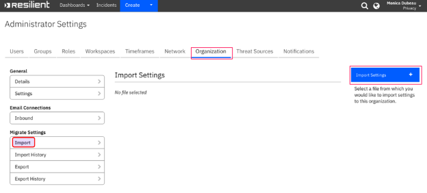

# Data Breach Best Practices for QRadar SOAR

A thorough data breach response plan that can be executed quickly is essential to comply with regulatory requirements, enhance customer trust and loyalty, and protect your brand.  Even though every data compromise has its own challenges and extenuating circumstances, there are some best-practice guidelines for how to best respond. 

## Overview

This package contains 23 tasks that prescribe suggested non-regulatory activities for responding to breaches of personal data. Data Breach Best Practices are tasks that, while not mandated by any specific regulator, are recommended and are supplemental to the privacy-specific tasks derived from the specific reporting requirements. 

To help accelerate your response efforts, these tasks can be easily assigned rules and conditions to ensure that they only appear in your privacy playbooks as necessary. 

This package includes an example custom field, rule, and condition to demonstrate how to make Data Breach Best Practices tasks appear using customizations. Specifically, a new field ‘High Volume Privacy Event’ has been created, and when ‘High Volume Privacy Event’ is equal to ‘Yes’, all 23 tasks will appear within your incident’s playbook. 

## Installation

Before installing, verify that your environment meets the following prerequisites: 

- QRadar SOAR platform is version 34 or later. 
- You have a QRadar SOAR account to use for the App. This can be any account that has the permission to view and modify administrator and customization settings, and read and update incidents. You need to know the account username and password. 

Complete the following steps to Install Data Breach Best Practices: 

1. Download data\_breach\_best\_practices\_playbook.zip from the App Exchange. 
1. Run the unzip command line command to expose the data\_breach\_best\_practices\_playbook.res file. 
1. Import the .res file into the QRadar SOAR platform. 

Log in to the QRadar SOAR platform and navigate to the Administrator Settings tab. 

Navigate to Organization and click on Import then select Import Settings. 

  

Select the .res file from Downloads and click proceed. 

4. Follow the Configurations instructions to add the new custom field. 
4. If necessary, modify the custom field name, rule, and/or condition to match your business needs. 

## QRadar SOAR Configurations

Add Custom Field 

To add a custom field to incident tabs, use the following steps. 

1. Log in to the QRadar SOAR platform and navigate to the Customization Settings tab. 

2. Navigate to Layout settings and click on Incident Tabs then select the Breach Incident Tab. 

3. Drag and drop the custom field, High Volume Privacy Event. When done, save the tab. 

  

4. Create an incident and select yes for High Volume Privacy Event to receive the 23 tasks. 

Modify Custom Fields, Rules, Conditions 

To modify a custom field, use the following steps. 

1. Navigate to Layouts and click on edit icon next to High Volume Privacy Event. 

2. Edit Incident Field as appropriate to your business needs. Click save when done. 

To modify a rule and condition, use the following steps. 

1. Navigate to Rules and select High Volume Privacy Event. 

2. Edit the Rule and Condition as appropriate to your business needs. Click Save when done. 

## Support

For additional support, contact [My Support](https://ibm.com/mysupport). 
