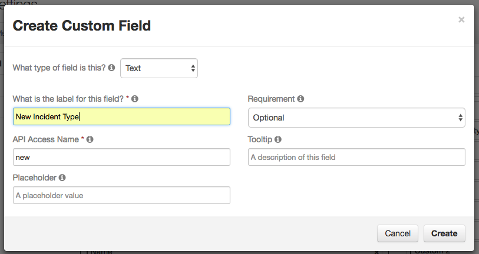
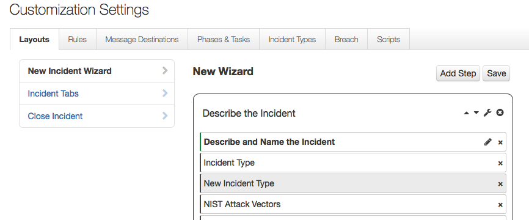
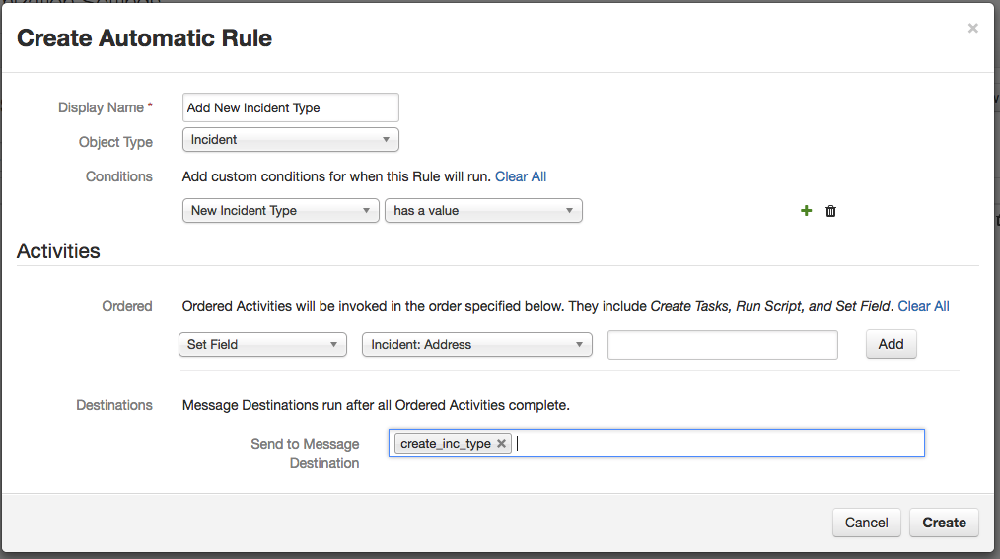

New Incident Type
=================

Use Case:  User wants to create new Incident Types in Resilient automatically from
the New Incident Wizard screen for use with the incident they are creating. 

An automatic rule is triggered when the user creates a new incident.  The action
processor implemented in the auto_add_new_inc_type.py module will use the
Resilient REST API to create the specified incident in Resilient and apply it 
to the newly created incident.

## Environment and Installation

This integration is provided as
* A component for a "resilient circuits" framework
* A fragment of a configuration file.

Copy the .py file into your `components` directory, where it will be
loaded automatically when your application starts.

Copy the configuration file fragment into your application's configuration
file and edit the settings appropriately.

## Resilient server setup

You must configure the following customizations to the Resilient server.
Open the Customization Settings menu.

### Message Destination
Open the Message Destinations tab.
Create a Queue message destination with programmatic name `create_inc_type`.
Select Yes for "expect acknowledgement", and add the integration user
to its users list.

### Custom Field
Open the Layouts tab.
Click `Add Field` and create a new optional Text field called `New Incident Type`.
Click `New Incident Wizard` and add the New Incident Type field to the
desired section.

### Rules

Create an automatic rule named `Add New Incident Type`, associated with object type
"Incident".  Choose `create_inc_type` as the message destination. Add condition
"New Incident Type has a value".

