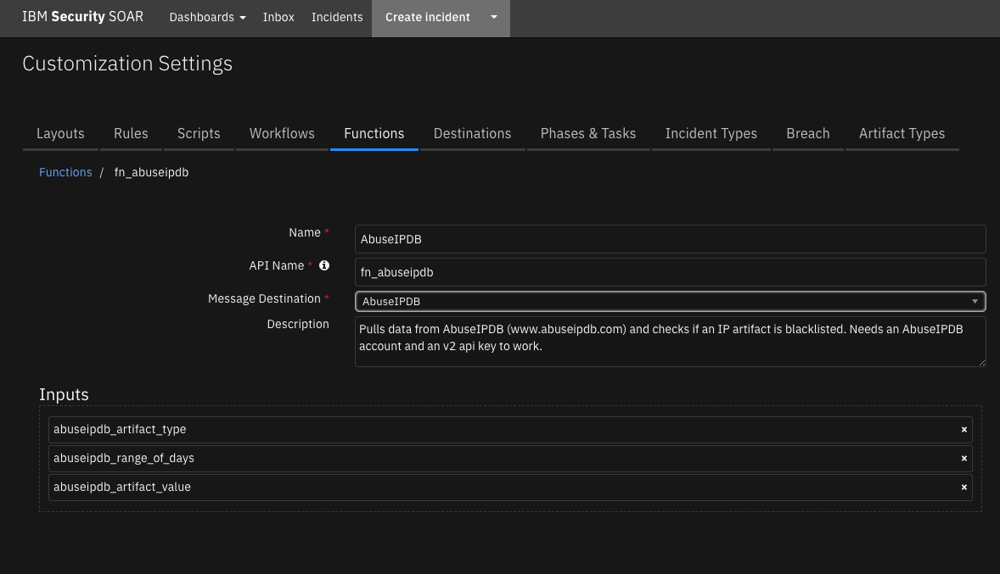

<!--
  This README.md is generated by running:
  "resilient-sdk docgen -p fn_abuseipdb"

  It is best edited using a Text Editor with a Markdown Previewer. VS Code
  is a good example. Checkout https://guides.github.com/features/mastering-markdown/
  for tips on writing with Markdown

  All fields followed by "::CHANGE_ME::"" should be manually edited

  If you make manual edits and run docgen again, a .bak file will be created

  Store any screenshots in the "doc/screenshots" directory and reference them like:
  

  NOTE: If your app is available in the container-format only, there is no need to mention the integration server in this readme.
-->

# AbuseIPDB Function for IBM SOAR

## Table of Contents
- [Release Notes](#release-notes)
- [Overview](#overview)
  - [Key Features](#key-features)
- [Requirements](#requirements)
  - [Resilient platform](#resilient-platform)
  - [Cloud Pak for Security](#cloud-pak-for-security)
  - [Proxy Server](#proxy-server)
  - [Python Environment](#python-environment)
  - [Endpoint Developed With](#endpoint-developed-with)
- [Installation](#installation)
  - [Install](#install)
  - [App Configuration](#app-configuration)
- [Function - AbuseIPDB](#function---abuseipdb)
- [Rules](#rules)
- [Troubleshooting & Support](#troubleshooting--support)
---

## Release Notes
<!--
  Specify all changes in this release. Do not remove the release 
  notes of a previous release
-->
| Version | Date | Notes |
| ------- | ---- | ----- |
| 1.0.0 | 02/2022 | Initial Release |

---

## Overview
<!--
  Provide a high-level description of the function itself and its remote software or application.
  The text below is parsed from the "description" and "long_description" attributes in the setup.py file
-->
This app pulls data from AbuseIPDB (www.abuseipdb.com) and checks if an IP artifact is blacklisted. If so, it will add a hit to the artifact. This app requires an AbuseIPDB account and an v2 api key to work.
**Resilient Circuits Components for 'fn_abuseipdb'**

  

Resilient Circuits Components for 'fn_abuseipdb'

### Key Features
<!--
  List the Key Features of the Integration
-->
* The workflow creates a hit in the artifact containing information on the IP address.

---

## Requirements
<!--
  List any Requirements 
--> 
* resilient-circuits>=43.0.0
* resilient_lib>=38.0.0

This app supports the IBM Resilient SOAR Platform and the IBM Cloud Pak for Security.

### Resilient platform
The Resilient platform supports two app deployment mechanisms, App Host and integration server.

If deploying to a Resilient platform with an App Host, the requirements are:
* Resilient platform >= `43.1.49`.
* The app is in a container-based format (available from the AppExchange as a `zip` file).

If deploying to a Resilient platform with an integration server, the requirements are:
* Resilient platform >= `43.1.49`.
* The app is in the older integration format (available from the AppExchange as a `zip` file which contains a `tar.gz` file).
* Integration server is running `resilient-circuits>=43.0.0`.
* If using an API key account, make sure the account provides the following minimum permissions: 
  | Name | Permissions |
  | ---- | ----------- |
  | Org Data | Read |
  | Function | Read |
  | Artifact | Read, Edit |


The following Resilient platform guides provide additional information: 
* _App Host Deployment Guide_: provides installation, configuration, and troubleshooting information, including proxy server settings. 
* _Integration Server Guide_: provides installation, configuration, and troubleshooting information, including proxy server settings.
* _System Administrator Guide_: provides the procedure to install, configure and deploy apps. 

The above guides are available on the IBM Knowledge Center at [ibm.biz/soar-docs](https://ibm.biz/soar-docs). On this web page, select your Resilient platform version. On the follow-on page, you can find the _App Host Deployment Guide_ or _Integration Server Guide_ by expanding **Resilient Apps** in the Table of Contents pane. The System Administrator Guide is available by expanding **System Administrator**.

### Cloud Pak for Security
If you are deploying to IBM Cloud Pak for Security, the requirements are:
* IBM Cloud Pak for Security >= 1.7.
* Cloud Pak is configured with an App Host.
* The app is in a container-based format (available from the AppExchange as a `zip` file).

The following Cloud Pak guides provide additional information: 
* _App Host Deployment Guide_: provides installation, configuration, and troubleshooting information, including proxy server settings. From the Table of Contents, select Case Management and Orchestration & Automation > **Orchestration and Automation Apps**.
* _System Administrator Guide_: provides information to install, configure, and deploy apps. From the IBM Cloud Pak for Security Knowledge Center table of contents, select Case Management and Orchestration & Automation > **System administrator**.

These guides are available on the IBM Knowledge Center at [ibm.biz/cp4s-docs](https://ibm.biz/cp4s-docs). From this web page, select your IBM Cloud Pak for Security version. From the version-specific Knowledge Center page, select Case Management and Orchestration & Automation.

### Proxy Server
The app does support a proxy server.

### Python Environment
Both Python 2.7 and Python 3.6 are supported.
Additional package dependencies may exist for each of these packages:
* resilient-circuits>=43.0.0
* resilient_lib>=38.0.0

### Endpoint Developed With

This app has been implemented using:

| Product Name | Product Version | API URL | API Version |
| ------ | :------: | ------- | ----------- |
| AbuseIPDB | ------ | https://api.abuseipdb.com/api/v2/check | v2 |

#### Prerequisites
<!--
List any prerequisites that are needed to use with this endpoint solution. Remove any section that is unnecessary.
-->
* An AbuseIPDB account and a v2 API key

---

## Installation

### Install
* To install or uninstall an App or Integration on the _Resilient platform_, see the documentation at [ibm.biz/soar-docs](https://ibm.biz/soar-docs).
* To install or uninstall an App on _IBM Cloud Pak for Security_, see the documentation at [ibm.biz/cp4s-docs](https://ibm.biz/cp4s-docs) and follow the instructions above to navigate to Orchestration and Automation.

### App Configuration
The following table provides the settings you need to configure the app. These settings are made in the app.config file. See the documentation discussed in the Requirements section for the procedure.

| Config | Required | Example | Description |
| ------ | :------: | ------- | ----------- |
| **abuseipdb_key** | Yes | `[your api key from your AbuseIPDB account]` | -- |
| **abuseipdb_url** | Yes | `https://api.abuseipdb.com/api/v2/check` | -- |
| **ignore_white_listed** | Yes | `True` | -- |


---

## Function - AbuseIPDB
Pulls data from AbuseIPDB (www.abuseipdb.com) and checks if an IP artifact is blacklisted. Needs an AbuseIPDB account and an v2 api key to work.

  

<details><summary>Inputs:</summary>
<p>

| Name | Type | Required | Example | Tooltip |
| ---- | :--: | :------: | ------- | ------- |
| `abuseipdb_artifact_type` | `text` | Yes | `-` | - |
| `abuseipdb_artifact_value` | `text` | Yes | `-` | - |

</p>
</details>

<details><summary>Outputs:</summary>
<p>

> **NOTE:** This example might be in JSON format, but `results` is a Python Dictionary on the SOAR platform.

```python
results = {
    'version': 2.0,
    'success': True,
    'reason': None,
    'content': {
        'data': {
            'ipAddress': '110.77.136.226',
            'isPublic': True,
            'ipVersion': 4,
            'isWhitelisted': False,
            'abuseConfidenceScore': 100,
            'countryCode': 'TH',
            'usageType': None,
            'isp': 'CAT Telecom Public Company Ltd',
            'domain': 'cattelecom.com',
            'hostnames': [],
            'countryName': 'Thailand',
            'totalReports': 105,
            'numDistinctUsers': 35,
            'lastReportedAt': '2022-02-08T17:10:55+00:00',
            'reports': [{
                'reportedAt': '2022-02-08T17:10:55+00:00',
                'comment': 'Attempted Brute Force (dovecot)',
                'categories': [18],
                'reporterId': 34703,
                'reporterCountryCode': 'GB',
                'reporterCountryName': 'United Kingdom of Great Britain and Northern Ireland'
            }]
        }
    },
    'raw': None,
    'inputs': {
        'abuseipdb_artifact_type': 'IP Address',
        'abuseipdb_artifact_value': '110.77.136.226'
    },
    'metrics': {
        'version': '1.0',
        'package': 'fn-abuseipdb',
        'package_version': '1.0.0',
        'host': 'My Host',
        'execution_time_ms': 4498,
        'timestamp': '2022-02-09 13:29:46'
    }
}
```

</p>
</details>

<details><summary>Example Pre-Process Script:</summary>
<p>

```python
inputs.abuseipdb_artifact_type = artifact.type
inputs.abuseipdb_artifact_value = artifact.value
```

</p>
</details>

<details><summary>Example Post-Process Script:</summary>
<p>

```python
CATEGORIES= {
  3: "Fraud Orders",
  4: "DDoS Attack",
  5: "FTP Brute-Force",
  6: "Ping of Death",
  7: "Phishing",
  8: "Fraud VoIP",
  9: "Open Proxy",
  10: "Web Spam",
  11: "Email Spam",
  12: "Blog Spam",
  13: "VPN IP",
  14: "Port Scan",
  15: "Hacking",
  16: "SQL Injection",
  17: "Spoofing",
  18: "Brute-Force",
  19: "Bad Web Bot",
  20: "Exploited Host",
  21: "Web App Attack",
  22: "SSH",
  23: "IoT Targeted",
}

if results.success:
  resp_data = results.content['data']
  number_of_reports = resp_data['totalReports']
  country_name = resp_data['countryName']
  most_recent_report = resp_data['lastReportedAt']
  confidence_score = resp_data.get("abuseConfidenceScore", 0)
  
  hit = []
  
  # get clean list of de-duped categories
  categories_names = ""
  if resp_data.get('reports'):
      categories_list = []
      for report in resp_data['reports']:
          categories_list.extend(report["categories"])
      categories_set = set(categories_list)  # dedup list
      categories_names = u', '.join(CATEGORIES.get(item, 'unknown') for item in categories_set)
  
  # only return data if there's anything useful
  if number_of_reports or confidence_score:
      hit = [
        {
          "name": "Confidence Score",
          "type": "number",
          "value": "{}".format(confidence_score)
        }, 
        {
          "name": "Number of Reports",
          "type": "number",
          "value": "{}".format(number_of_reports)
        }, 
        {
          "name": "Country",
          "type": "string",
          "value": "{}".format(country_name)
        },
        {
          "name": "Most Recent Report",
          "type": "string",
          "value": "{}".format(most_recent_report)
        },
        {
          "name": "Categories",
          "type": "string",
          "value": "{}".format(categories_names)
        }
        ]
  artifact.addHit("AbuseIPDB Function hits added", hit)
else:
  incident.addNote("AbuseIPDB Check IP Address Blocklist failed: {}".format(results.reason))

```

</p>
</details>

---


## Rules
| Rule Name | Object | Workflow Triggered |
| --------- | ------ | ------------------ |
| AbuseIPDB Check IP Address Blocklist | artifact | `abuseipdb_check_ip_address_blocklist` |

---

## Troubleshooting & Support
Refer to the documentation listed in the Requirements section for troubleshooting information.

### For Support
This is a IBM Community provided App. Please search the Community [ibm.biz/soarcommunity](https://ibm.biz/soarcommunity) for assistance.
