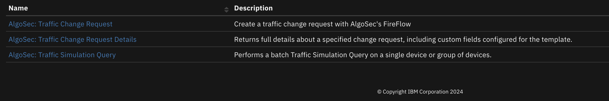
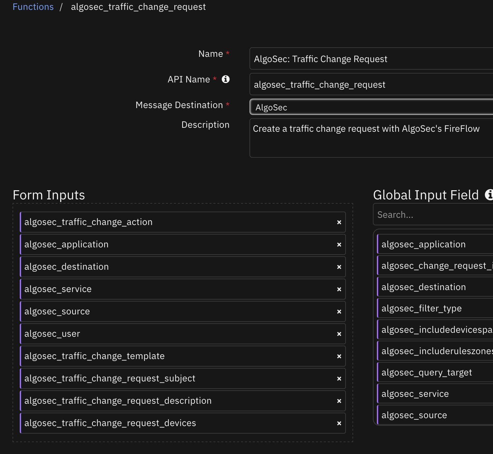
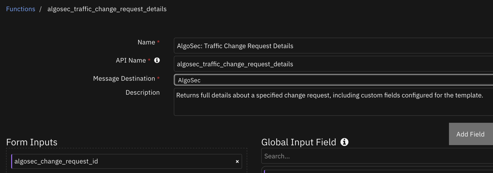
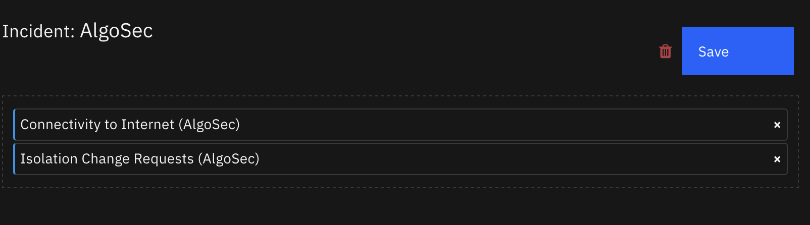
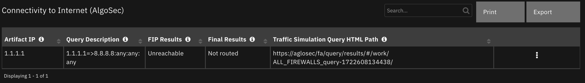
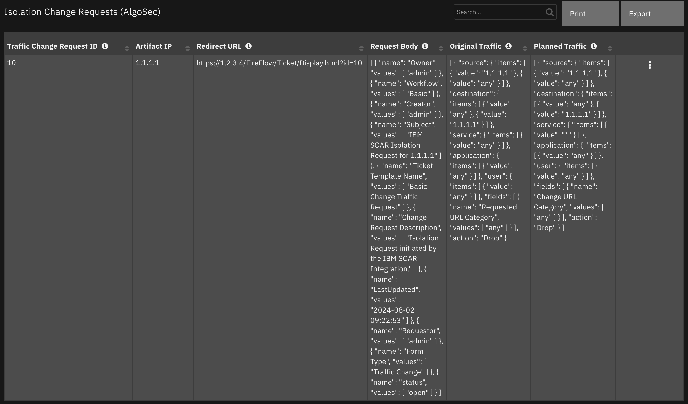

# IBM SOAR integration for AlgoSec


## Table of Contents
- [Release Notes](#release-notes)
- [Overview](#overview)
  - [Key Features](#key-features)
- [Requirements](#requirements)
  - [SOAR platform](#soar-platform)
  - [Cloud Pak for Security](#cloud-pak-for-security)
  - [Proxy Server](#proxy-server)
  - [Python Environment](#python-environment)
- [Installation](#installation)
  - [Install](#install)
  - [App Configuration](#app-configuration)
- [Function - AlgoSec: Traffic Change Request](#function---algosec-traffic-change-request)
- [Function - AlgoSec: Traffic Change Request Details](#function---algosec-traffic-change-request-details)
- [Function - AlgoSec: Traffic Simulation Query](#function---algosec-traffic-simulation-query)
  - [Custom Layouts](#custom-layouts)
- [Data Table - Connectivity to Internet (AlgoSec)](#data-table---connectivity-to-internet-algosec)
- [Data Table - Isolation Change Requests (AlgoSec)](#data-table---isolation-change-requests-algosec)
- [Playbooks](#playbooks)
- [Troubleshooting & Support](#troubleshooting--support)

---

## Release Notes
| Version | Date | Notes |
| ------- | ---- | ----- |
| 1.0.0 | 02/2019 | Initial Release |
| 2.0.0 | 08/2024 | Integration rewritten with latest AlgoSec REST API. Apphost compatible. Converted to playbooks. |

---

## Overview
<!--
  Provide a high-level description of the function itself and its remote software or application.
  The text below is parsed from the "description" and "long_description" attributes in the setup.py file
-->
**IBM SOAR integration for AlgoSec**

 

This integration allows one to make a traffic change request, get the details of a traffic change request, or a traffic simulation query.

### Key Features
<!--
  List the Key Features of the Integration
-->
* Make traffic change requests
* Get the details of a traffic change request
* Make a traffic simulation query

---

## Requirements
This app supports the IBM Security QRadar SOAR Platform and the IBM Security QRadar SOAR for IBM Cloud Pak for Security.

### SOAR platform
The SOAR platform supports two app deployment mechanisms, Edge Gateway (also known as App Host) and integration server.

If deploying to a SOAR platform with an App Host, the requirements are:
* SOAR platform >= `51.0.0.0.9340`.
* The app is in a container-based format (available from the AppExchange as a `zip` file).

If deploying to a SOAR platform with an integration server, the requirements are:
* SOAR platform >= `51.0.0.0.9340`.
* The app is in the older integration format (available from the AppExchange as a `zip` file which contains a `tar.gz` file).
* Integration server is running `resilient-circuits>=51.0.0`.
* If using an API key account, make sure the account provides the following minimum permissions:
  | Name | Permissions |
  | ---- | ----------- |
  | Org Data | Read |
  | Function | Read |

The following SOAR platform guides provide additional information:
* _Edge Gateway Deployment Guide_ or _App Host Deployment Guide_: provides installation, configuration, and troubleshooting information, including proxy server settings.
* _Integration Server Guide_: provides installation, configuration, and troubleshooting information, including proxy server settings.
* _System Administrator Guide_: provides the procedure to install, configure and deploy apps.

The above guides are available on the IBM Documentation website at [ibm.biz/soar-docs](https://ibm.biz/soar-docs). On this web page, select your SOAR platform version. On the follow-on page, you can find the _Edge Gateway Deployment Guide_, _App Host Deployment Guide_, or _Integration Server Guide_ by expanding **Apps** in the Table of Contents pane. The System Administrator Guide is available by expanding **System Administrator**.

### Cloud Pak for Security
If you are deploying to IBM Cloud Pak for Security, the requirements are:
* IBM Cloud Pak for Security >= `1.10.15`.
* Cloud Pak is configured with an Edge Gateway.
* The app is in a container-based format (available from the AppExchange as a `zip` file).

The following Cloud Pak guides provide additional information:
* _Edge Gateway Deployment Guide_ or _App Host Deployment Guide_: provides installation, configuration, and troubleshooting information, including proxy server settings. From the Table of Contents, select Case Management and Orchestration & Automation > **Orchestration and Automation Apps**.
* _System Administrator Guide_: provides information to install, configure, and deploy apps. From the IBM Cloud Pak for Security IBM Documentation table of contents, select Case Management and Orchestration & Automation > **System administrator**.

These guides are available on the IBM Documentation website at [ibm.biz/cp4s-docs](https://ibm.biz/cp4s-docs). From this web page, select your IBM Cloud Pak for Security version. From the version-specific IBM Documentation page, select Case Management and Orchestration & Automation.

### Proxy Server
The app **does** support a proxy server.

### Python Environment
Python 3.9, 3.11, and 3.12 are officially supported. When deployed as an app, the app runs on Python 3.11.
Additional package dependencies may exist for each of these packages:
* resilient-circuits>=51.0.0

---

## Installation

### Install
* To install or uninstall an App or Integration on the _SOAR platform_, see the documentation at [ibm.biz/soar-docs](https://ibm.biz/soar-docs).
* To install or uninstall an App on _IBM Cloud Pak for Security_, see the documentation at [ibm.biz/cp4s-docs](https://ibm.biz/cp4s-docs) and follow the instructions above to navigate to Orchestration and Automation.

### App Configuration
The following table provides the settings you need to configure the app. These settings are made in the app.config file. See the documentation discussed in the Requirements section for the procedure.

| Config | Required | Example | Description |
| ------ | :------: | ------- | ----------- |
| **password** | Yes | `algosec` | *The password for the AlgoSec login.* |
| **server_ip** | Yes | `local.algosec.com` | *The address of the AlgoSec server. Either an IP address or fully qualified domain name* |
| **username** | Yes | `admin` | *The username for the AlgoSec login.* |
| **verify** | No | `true` | *True to connect with SSL.* |
| **https_proxy** | No | `` | *Https proxy to use when connecting to the AlgoSec server.* |

---

## Function - AlgoSec: Traffic Change Request
Create a traffic change request with AlgoSec's FireFlow

 

<details><summary>Inputs:</summary>
<p>

| Name | Type | Required | Example | Tooltip |
| ---- | :--: | :------: | ------- | ------- |
| `algosec_application` | `text` | No | `any` | Application(s) for the rule. Multiple values are separated by commas (,). If empty, the query runs on application: 'any' |
| `algosec_destination` | `text` | No | `8.8.8.8` | Destination(s) IP address for the query. Multiple values are separated by commas (,). |
| `algosec_service` | `text` | No | `*` | Service(s) for the query. Multiple values are separated by commas (,). |
| `algosec_source` | `text` | Yes | `1.1.1.1` | Source to use. Either a single source or a comma separated list of sources |
| `algosec_traffic_change_action` | `select` | Yes | `Drop` | Action: Allow or Drop |
| `algosec_traffic_change_request_description` | `text` | No | `Traffic Change Request initiated by the IBM SOAR Integration.` | The description of the traffic change request |
| `algosec_traffic_change_request_devices` | `text` | No | `-` | Comma separated list of devices |
| `algosec_traffic_change_request_subject` | `text` | No | `IBM SOAR Traffic Change Request` | Subject of the traffic change request |
| `algosec_traffic_change_template` | `text` | Yes | `-` | Name of template to use |
| `algosec_user` | `text` | No | `any` | User(s) who created the rule. Multiple values are separated by commas (,). If empty, the query runs on user: 'any' |

</p>
</details>

<details><summary>Outputs:</summary>
<p>

> **NOTE:** This example might be in JSON format, but `results` is a Python Dictionary on the SOAR platform.

```python
results = {
  "content": {
    "data": {
      "changeRequestId": 11,
      "redirectUrl": "https://1.2.3.4/FireFlow/Ticket/Display.html?id=11"
    },
    "messages": [],
    "status": "Success"
  },
  "inputs": {
    "algosec_destination": "any, 1.1.1.1",
    "algosec_service": "any",
    "algosec_source": "1.1.1.1, any",
    "algosec_traffic_change_action": "Drop",
    "algosec_traffic_change_request_description": "Isolation Request initiated by the IBM SOAR Integration.",
    "algosec_traffic_change_request_subject": "IBM SOAR Isolation Request for 1.1.1.1",
    "algosec_traffic_change_template": "Basic Change Traffic Request"
  },
  "metrics": {
    "execution_time_ms": 9129,
    "host": "local",
    "package": "fn-algosec",
    "package_version": "1.0.0",
    "timestamp": "2024-08-02 09:26:21",
    "version": "1.0"
  },
  "raw": null,
  "reason": null,
  "success": true,
  "version": 2.0
}
```

</p>
</details>

<details><summary>Example Function Input Script:</summary>
<p>

```python
inputs.algosec_source = f"{artifact.value}, any"
inputs.algosec_traffic_change_action = "Drop"
inputs.algosec_destination = f"any, {artifact.value}"
inputs.algosec_service = "any"
inputs.algosec_traffic_change_request_description = "Isolation Request initiated by the IBM SOAR Integration."
inputs.algosec_traffic_change_request_subject = f"IBM SOAR Isolation Request for {artifact.value}"
inputs.algosec_traffic_change_template = "Basic Change Traffic Request"
```

</p>
</details>

<details><summary>Example Function Post Process Script:</summary>
<p>

```python
from json import dumps
# Results from the traffic change request call
change_request = playbook.functions.results.isolate_host_results
request_data = change_request.get("content", {}).get("data", {})
# Results from getting the traffic change request details
request_details = playbook.functions.results.change_request_details
details_data = request_details.get("content", {}).get("data", {})

if change_request.get("success"):
  # Add Row
  row = incident.addRow("algosec_isolation_requests")
  row['traffic_change_request_id'] = request_data.get("changeRequestId")
  row['hostname'] = artifact.value
  row['traffic_change_request_url'] = request_data.get("redirectUrl")
  row['traffic_change_request_body'] = dumps(details_data.get("fields", {}), indent=4)
  row['traffic_change_request_original_traffic'] = dumps(details_data.get("originalTraffic", {}), indent=4)
  row['traffic_change_request_planned_traffic'] = dumps(details_data.get("plannedTraffic", {}), indent=4)
else:
  incident.addNote(f"Isolate Host from Network on host {artifact.value} failed with reason: {change_request.get('reason', '')}")
```

</p>
</details>

---
## Function - AlgoSec: Traffic Change Request Details
Returns full details about a specified change request, including custom fields configured for the template.

 

<details><summary>Inputs:</summary>
<p>

| Name | Type | Required | Example | Tooltip |
| ---- | :--: | :------: | ------- | ------- |
| `algosec_change_request_id` | `number` | Yes | `3` | The ID of the change request you want to return data for. |

</p>
</details>

<details><summary>Outputs:</summary>
<p>

> **NOTE:** This example might be in JSON format, but `results` is a Python Dictionary on the SOAR platform.

```python
results = {
  "content": {
    "data": {
      "fields": [
        {
          "name": "Owner",
          "values": [
            "admin\u003cadmin@example.com\u003e"
          ]
        },
        {
          "name": "Workflow",
          "values": [
            "Basic"
          ]
        },
        {
          "name": "Creator",
          "values": [
            "admin\u003cadmin@example.com\u003e"
          ]
        },
        {
          "name": "Subject",
          "values": [
            "IBM SOAR Isolation Request for 1.1.1.1"
          ]
        },
        {
          "name": "Ticket Template Name",
          "values": [
            "Basic Change Traffic Request"
          ]
        },
        {
          "name": "Change Request Description",
          "values": [
            "Isolation Request initiated by the IBM SOAR Integration."
          ]
        },
        {
          "name": "LastUpdated",
          "values": [
            "2024-08-02 09:26:26"
          ]
        },
        {
          "name": "Requestor",
          "values": [
            "admin\u003cadmin@example.com\u003e"
          ]
        },
        {
          "name": "Form Type",
          "values": [
            "Traffic Change"
          ]
        },
        {
          "name": "status",
          "values": [
            "open"
          ]
        }
      ],
      "id": 11,
      "originalTraffic": [
        {
          "action": "Drop",
          "application": {
            "items": [
              {
                "value": "any"
              }
            ]
          },
          "destination": {
            "items": [
              {
                "value": "any"
              },
              {
                "value": "1.1.1.1"
              }
            ]
          },
          "fields": [
            {
              "name": "Requested URL Category",
              "values": [
                "any"
              ]
            }
          ],
          "service": {
            "items": [
              {
                "value": "any"
              }
            ]
          },
          "source": {
            "items": [
              {
                "value": "1.1.1.1"
              },
              {
                "value": "any"
              }
            ]
          },
          "user": {
            "items": [
              {
                "value": "any"
              }
            ]
          }
        }
      ],
      "plannedTraffic": [
        {
          "action": "Drop",
          "application": {
            "items": [
              {
                "value": "any"
              }
            ]
          },
          "destination": {
            "items": [
              {
                "value": "any"
              },
              {
                "value": "1.1.1.1"
              }
            ]
          },
          "fields": [
            {
              "name": "Change URL Category",
              "values": [
                "any"
              ]
            }
          ],
          "service": {
            "items": [
              {
                "value": "*"
              }
            ]
          },
          "source": {
            "items": [
              {
                "value": "1.1.1.1"
              },
              {
                "value": "any"
              }
            ]
          },
          "user": {
            "items": [
              {
                "value": "any"
              }
            ]
          }
        }
      ]
    },
    "messages": [],
    "status": "Success"
  },
  "inputs": {
    "algosec_change_request_id": 11
  },
  "metrics": {
    "execution_time_ms": 8305,
    "host": "local",
    "package": "fn-algosec",
    "package_version": "1.0.0",
    "timestamp": "2024-08-02 09:26:31",
    "version": "1.0"
  },
  "raw": null,
  "reason": null,
  "success": true,
  "version": 2.0
}
```

</p>
</details>

<details><summary>Example Function Input Script:</summary>
<p>

```python
data = playbook.functions.results.isolate_host_results.get("content", {}).get("data", {})
inputs.algosec_change_request_id = data.get("changeRequestId")
```

</p>
</details>

<details><summary>Example Function Post Process Script:</summary>
<p>

```python
from json import dumps
# Results from the traffic change request call
change_request = playbook.functions.results.isolate_host_results
request_data = change_request.get("content", {}).get("data", {})
# Results from getting the traffic change request details
request_details = playbook.functions.results.change_request_details
details_data = request_details.get("content", {}).get("data", {})

if change_request.get("success"):
  # Add Row
  row = incident.addRow("algosec_isolation_requests")
  row['traffic_change_request_id'] = request_data.get("changeRequestId")
  row['hostname'] = artifact.value
  row['traffic_change_request_url'] = request_data.get("redirectUrl")
  row['traffic_change_request_body'] = dumps(details_data.get("fields", {}), indent=4)
  row['traffic_change_request_original_traffic'] = dumps(details_data.get("originalTraffic", {}), indent=4)
  row['traffic_change_request_planned_traffic'] = dumps(details_data.get("plannedTraffic", {}), indent=4)
else:
  incident.addNote(f"Isolate Host from Network on host {artifact.value} failed with reason: {change_request.get('reason', '')}")
```

</p>
</details>

---
## Function - AlgoSec: Traffic Simulation Query
Performs a batch Traffic Simulation Query on a single device or group of devices.

 

<details><summary>Inputs:</summary>
<p>

| Name | Type | Required | Example | Tooltip |
| ---- | :--: | :------: | ------- | ------- |
| `algosec_application` | `text` | No | `any` | Application(s) for the rule. Multiple values are separated by commas (,). If empty, the query runs on application: 'any' |
| `algosec_destination` | `text` | No | `8.8.8.8` | Destination(s) IP address for the query. Multiple values are separated by commas (,). |
| `algosec_includedevicespaths` | `boolean` | No | `-` | true: Includes devices paths section in response (devicesInPath). |
| `algosec_includeruleszones` | `boolean` | No | `-` | true: Includes source/destination zones of rule of zone-based devices in response (sourceZone, destinationZone). |
| `algosec_query_target` | `text` | No | `ALL_FIREWALLS` | Name of a device or group the query will run on. If empty, the query runs on the entire network and all permitted devices for the user. |
| `algosec_service` | `text` | No | `*` | Service(s) for the query. Multiple values are separated by commas (,). |
| `algosec_source` | `text` | Yes | `1.1.1.1` | Source to use |
| `algosec_user` | `text` | No | `any` | User(s) who created the rule. Multiple values are separated by commas (,). If empty, the query runs on user: 'any' |

</p>
</details>

<details><summary>Outputs:</summary>
<p>

> **NOTE:** This example might be in JSON format, but `results` is a Python Dictionary on the SOAR platform.

```python
results = {
  "content": {
    "queryResult": [
      {
        "finalResult": "Not routed",
        "fipResult": "Unreachable",
        "queryDescription": "1.2.3.5=\u003e8.8.8.8:any:any:any",
        "queryHTMLPath": "https://aglosec/fa/query/results/#/work/ALL_FIREWALLS_query-1722608134438/"
      }
    ],
    "queryUIResult": "https://aglosec/fa/query/results/#/work/ALL_FIREWALLS_query-1722608134438/"
  },
  "inputs": {
    "algosec_destination": "8.8.8.8",
    "algosec_service": "any",
    "algosec_source": "1.2.3.5"
  },
  "metrics": {
    "execution_time_ms": 9827,
    "host": "local",
    "package": "fn-algosec",
    "package_version": "1.0.0",
    "timestamp": "2024-08-02 09:59:19",
    "version": "1.0"
  },
  "raw": null,
  "reason": null,
  "success": true,
  "version": 2.0
}
```

</p>
</details>

<details><summary>Example Function Input Script:</summary>
<p>

```python
inputs.algosec_source = artifact.value
inputs.algosec_destination = "8.8.8.8"
inputs.algosec_service = "any"
```

</p>
</details>

<details><summary>Example Function Post Process Script:</summary>
<p>

```python
results = playbook.functions.results.inet_check_output
content = results.get("content", {})

# Processing if the function is a success
if results.get("success"):
  for queryResult in content.get("queryResult", []):
    # Add Row
    row = incident.addRow("algosec_internet_connectivity_queries")
    row.artifact_ip = artifact.value
    row.query_description = queryResult.get("queryDescription")
    row.traffic_simulation_fip_results = queryResult.get("fipResult")
    row.traffic_simulation_final_results = queryResult.get("finalResult")
    row.query_html_path = queryResult.get("queryHTMLPath")
```

</p>
</details>

---

## Playbooks
| Playbook Name | Description | Activation Type | Object | Status | Condition | 
| ------------- | ----------- | --------------- | ------ | ------ | --------- | 
| AlgoSec: Check Host Internet Connectivity - Example (PB) | Check internet connection for a given "IP Address" artifact using AlgoSec FireFlow. The connectivity query results are updated in the incident's Data Table called "AlgoSec Internet Connection" | Manual | artifact | `enabled` | `artifact.type in ['IP Address', 'DNS Name', 'Network CIDR Range']` |
| AlgoSec: Isolate from Network - Example (PB) | Isolate an "IP Address" artifact using AlgoSec FireFlow. The FireFlow isolation request details are updated in the incident's Data Table called "AlgoSec Isolation Requests". | Manual | artifact | `enabled` | `artifact.type in ['IP Address', 'DNS Name', 'Network CIDR Range']` |

---

## Custom Layouts
<!--
  Use this section to provide guidance on where the user should add any custom fields and data tables.
  You may wish to recommend a new incident tab.
  You should save a screenshot "custom_layouts.png" in the doc/screenshots directory and reference it here
-->
* Import the Data Tables and Custom Fields like the screenshot below:

  


## Data Table - Connectivity to Internet (AlgoSec)

 

#### API Name:
algosec_internet_connectivity_queries

#### Columns:
| Column Name | API Access Name | Type | Tooltip |
| ----------- | --------------- | ---- | ------- |
| Artifact IP | `artifact_ip` | `text` | The given address |
| Final Results | `traffic_simulation_final_results` | `select` | One of the following: allowed, blocked, partially allowed, not routed |
| FIP Results | `traffic_simulation_fip_results` | `select` | One of the following: Unreachable, SameZone, Routed, PartiallyRouted, NotExecuted, Unknown |
| Query Description | `query_description` | `text` | Description of query. |
| Traffic Simulation Query HTML Path | `query_html_path` | `textarea` | URL to the results in the UI. |

---
## Data Table - Isolation Change Requests (AlgoSec)

 

#### API Name:
algosec_isolation_requests

#### Columns:
| Column Name | API Access Name | Type | Tooltip |
| ----------- | --------------- | ---- | ------- |
| Artifact IP | `hostname` | `text` | - |
| Original Traffic | `traffic_change_request_original_traffic` | `textarea` | The original traffic |
| Planned Traffic | `traffic_change_request_planned_traffic` | `textarea` | The planned traffic |
| Redirect URL | `traffic_change_request_url` | `textarea` | The redirect URL for the traffic change request. |
| Request Body | `traffic_change_request_body` | `textarea` | The request body of the traffic change request. |
| Traffic Change Request ID | `traffic_change_request_id` | `number` | The ID of the traffic change request. |

---


## Troubleshooting & Support
Refer to the documentation listed in the Requirements section for troubleshooting information.

### For Support
This is an IBM supported app. Please search [ibm.com/mysupport](https://ibm.com/mysupport) for assistance.
