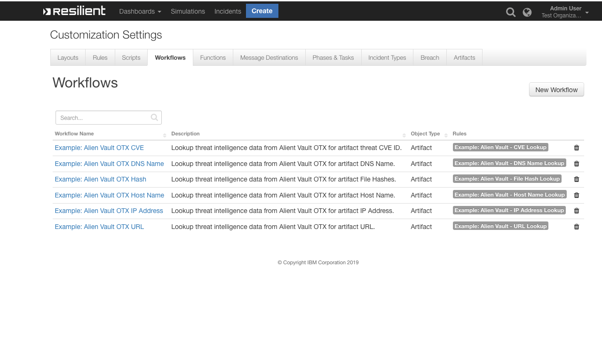
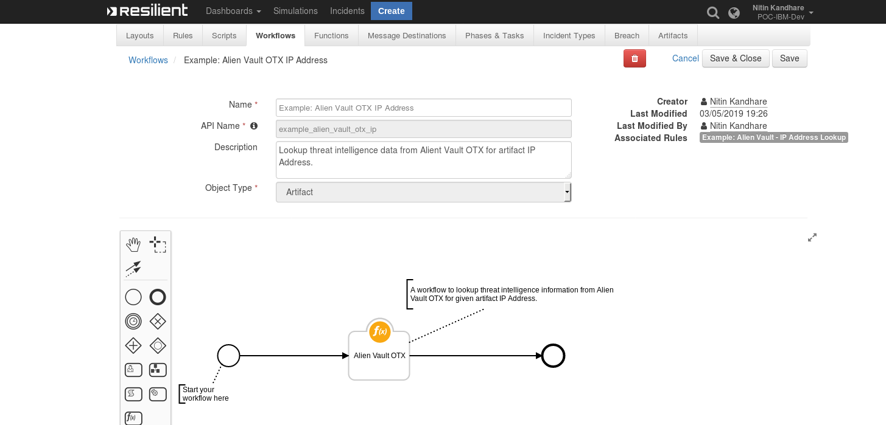
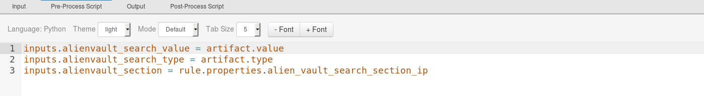
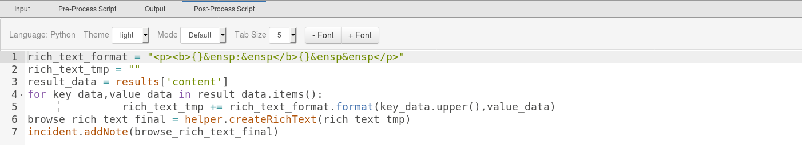
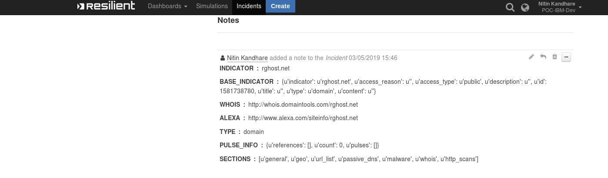

# Alien Vault OTX Search Function for IBM Resilient 

## Table of Contents
  - [About This Package](#about-this-package)
  - [Prerequisites](#prerequisites)
  - [Resilient Installation](#resilient-installation)
  - [Resilient Configuration](#app.config-settings)
  - [Function Inputs](#function-inputs)
  - [Function Output](#function-output)
  - [Pre-Process Script](#pre-process-script)
  - [Post-Process Script](#post-process-script)
  - [Rules](#rules)
 ---
## About This Package:  
  
This Alien Vault OTX function is RESTful Web service API providing a way to search for threat intelligence information from the Alien Vault database.  
   Threat intelligence indicators information can be searched for IP Address, Domain, Host Name, File Hashes, URL, CVE.  
   
   For more information : [Alien Vault OTX ](https://otx.alienvault.com/api) 
      
 **This package contains a function that searches alien vault otx platform with the given query for Threat Intelligence data**
 
There are six different functions for different type of artifacts:

 

Sample Function layout:


Sample Pre-Process Script


Sample Post-Process Script


The function makes use of the Alien Vault `api/v1/indicators` API call to get information on a given query	
## Prerequisites:  
  
* resilient version 31 or later  
* resilient_circuits version 30 or later  
* Account in alien vault : [Alien Vault OTX](https://otx.alienvault.com/)
* DirectConnect OTX API Key from Alien Vault  
  
## Resilient Installation  
  
This package requires that it is installed on a RHEL or CentOS platform and uses the resilient-circuits framework.  
Install this package with 'pip', such as:  
      
 To install Package   
 `pip install fn_alienvault_otx/`  
 
 The .tar.gz file can be installed using 
 `pip install fn_alienvault_otx-<version>.tar.gz`

  To import the function and example rule and workflows into Resilient, run the following command:  
 `resilient-circuits customize  Reply to the prompt for package import.`  
  
To uninstall,  
 `pip uninstall fn_alienvault_otx`  

## app.config settings 
Run the following command to generate the alien vault configuration section in the app.config file:  
  
` resilient-circuits config [-u | -c]`   

The following gRPC configuration data is added:  
```                 
 [fn_alienvault_otx] 
 # OTX API Key to Access the Alien Vault OTX Service    
 av_api_key=<<DirectConnect OTX API Key>>  
 #Base URL Path of Alien Vault OTX      
 av_base_url=https://otx.alienvault.com/api/v1 # Proxy Server by Default it 
 will be None proxy=None 
```
 
Edit the [fn_alienvault_otx] properties as follows:
      
 1. av_api_key : Alien vault OTX DirectConnect API Key.  
      
After installation & configuration, the package will be loaded by 
`resilient-circuits run`  
 ## Function Inputs
 
| Function Name | Type | Required | Example | Info |
| ------------- | :--: | :-------:| ------- | ---- |
| `alien_search_value` | `String` | Yes | `"192.168.0.1"` | The search value to send to Alien Vault OTX (may be any String that contains an IP Address, URL, Hash,Threat CVE ID,DNS Name,System Name.) |
| `alien_search_type` | `String` | Yes | `IP Address` | The search type to send to Alien Vault OTX (may be any String type can be an IP Address, URL, Hash,Threat CVE ID,DNS Name,System Name.)|
| `alien_section` | `select` | Yes | `reputation` | The section to search for Threat Intelligence Data from Alien Vault, this section may be different for different search type(may be any string general, geo, malware,reputation, url_list, passive_dns, http_scans etc)|


 ## Function Output
 Run the Resilient Function in DEBUG mode to get the function output printed on console.
 
 Sample Output Displayed on Incident Notes Section
 
 
 ## Pre-Process Script
 This example sets the `alienvault_search_value`, `alienvault_search_type`, `alienvault_section` inputs to the value & type of the Artifacts and sections the user took action on 
```python
# The search value to send to Alien Vault OTX (may be any String that contains an IP Address, URL, Hash,Threat CVE ID,DNS Name,System Name.)
inputs.alienvault_search_value = artifact.value
#The search type to send to Alien Vault OTX (may be any String type can be an IP Address, URL, Hash,Threat CVE ID,DNS Name,System Name.)
inputs.alienvault_search_type = artifact.type
#The section to search for Threat Intelligence Data from Alien Vault, this section may be different for different search type(may be any string general, geo, malware,reputation, url_list, passive_dns, http_scans etc)
inputs.alienvault_section = rule.properties.alien_vault_search_section_ip
```
 ## Post-Process Script
 ```python
 # Api Response Received is converted to Rich text and rendering in incident note section of Resilient.
 rich_text_format = "<p><b>{}&ensp:&ensp</b>{}&ensp&ensp</p>"
rich_text_tmp = ""
result_data = results['content']
for key_data,value_data in result_data.items():
               rich_text_tmp += rich_text_format.format(key_data.upper(),value_data)
browse_rich_text_final = helper.createRichText(rich_text_tmp)
incident.addNote(browse_rich_text_final)
 ```
 ## Rules

| Rule Name | Object Type | Workflow Triggered |Activity Fields|
| --------- | :---------: | ------------------ |---------------|
| Example: Alien Vault - CVE Lookup | `Artifact` | `Example: Alien Vault OTX CVESearch` |`Alien Vault Search Section CVE` values : general
| Example: Alien Vault - DNS Name Lookup | `Artifact` | `Example: Alien Vault OTX DNS Name` |`Alien Vault Search Section DNS Name` values :        general,geo,malware,url_list,passive_dns,whois,http_scans
| Example: Alien Vault - File Hash Lookup | `Artifact` | `Example: Alien Vault OTX Hash` |`Alien Vault Search Section Hash` values : general,analysis
| Example: Alien Vault - Host Name Lookup | `Artifact` | `Example: Alien Vault OTX Host Name` |`Alien Vault Search Section Host Name` values : general,geo,malware,url_list,passive_dns,http_scans
| Example: Alien Vault - IP Address Lookup | `Artifact` | `Example: Alien Vault OTX IP Address` |`Alien Vault Search Section IP Address` values : general,reputation,geo,malware,url_list,passive_dns,http_scans
| Example: Alien Vault - URL Lookup | `Artifact` | `Example: Alien Vault OTX URL` |`Alien Vault Search Section URL` values : general,url_list
## Using the Alien Vault OTX Function  
  The Alien Vault Function can be called on artifact like IP Address, DNS Name, System Name, URL, URL Referer,   
  Hashes, Threat CVE ID.  
  after calling function from artifact we needs to choose `Section` based on the artifact. for more info on section   
  please refer on link : https://otx.alienvault.com/api  
    
