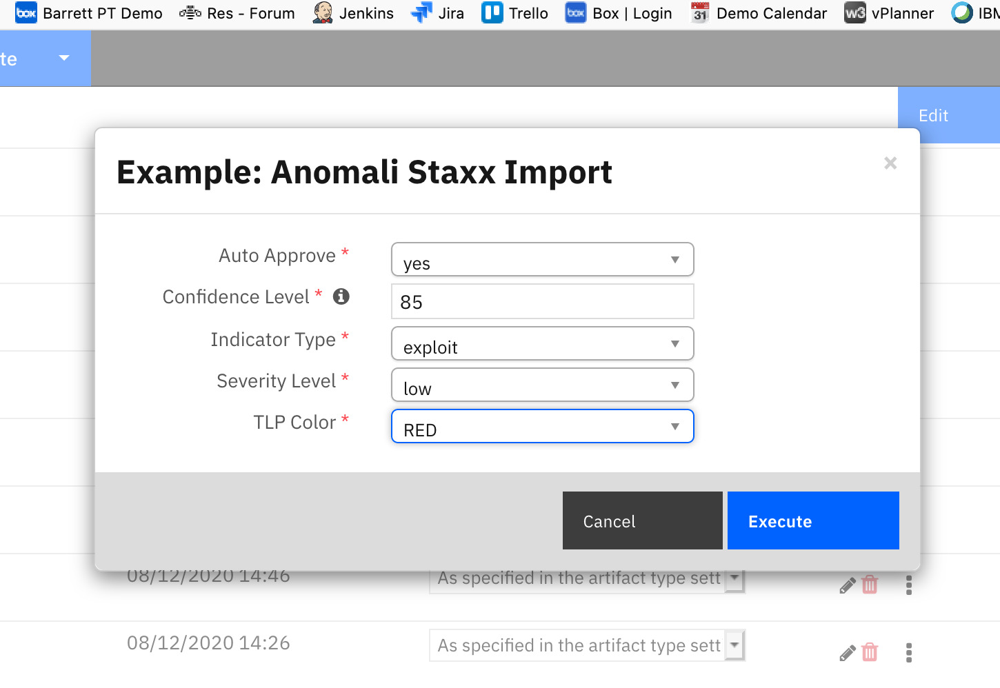
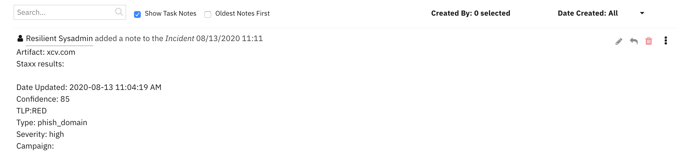

<!--
  This User README.md is generated by running:
  "resilient-sdk docgen -p fn_anomali_staxx --user-guide"

  It is best edited using a Text Editor with a Markdown Previewer. VS Code
  is a good example. Checkout https://guides.github.com/features/mastering-markdown/
  for tips on writing with Markdown

  If you make manual edits and run docgen again, a .bak file will be created

  Store any screenshots in the "doc/screenshots" directory and reference them like:
  
-->

# **User Guide:** fn_anomali_staxx

## Table of Contents
- [Release Notes](#release-notes)
- [Overview](#overview)
- [Key Features](#key-features)
- [Requirements](#requirements)
- [Installation](#installation)
- [Uninstall](#uninstall)
- [Function - Staxx Query](#function---staxx-query)
- [Function - Staxx Import](#function---staxx-import)
- [Rules](#rules)
- [Troubleshooting](#troubleshooting)
- [Support](#support)

---

## Release Notes
<!--
  Specify all changes in this release. Do not remove the release 
  notes of a previous release
-->
### v1.0.0
* Initial Release (based on send-to-staxx integration)

---

## Overview
<!--
  Provide a high-level description of the function itself and its remote software or application.
  The text below is parsed from the "description" and "long_description" attributes in the setup.py file
-->
**'fn_anomali_staxx' app**

 

---

## Key Features
<!--
  List the Key Features of the Integration
-->
* Add artifact values as indicators to Anomali Staxx 
* Search Anomali Staxx for indicators matching an artifact value
---

## Requirements
<!--
  List any Requirements 
-->
* Resilient platform >= `v35.2.32`
* An Integration Server running `resilient_circuits>=30.0.0`
  * To set up an Integration Server see: [Installation Guides](https://www.ibm.com/support/knowledgecenter/SSBRUQ_37.0.0/doc/container_apps.html)
  * If using API Keys, minimum required permissions are:
      * Org Data: Read, Edit
      * Function: Read
---

## Installation

### App Host
All the components for running this integration in a container already exist when using the App Host app.

To install,

* Navigate to Administrative Settings and then the Apps tab.
* Click the Install button and select the downloaded file: app-fn_anomali_staxx-x.x.x.zip.
* Go to the Configuration tab and edit the app.config file, editing the API key for Anomali Staxx and making any additional setting changes.

  | Config | Required | Example | Description |
  | ------ | :------: | ------- | ----------- |
  | **staxx_ip** | Yes | `10.10.10.10` | *Enter a description of the config here* |
  | **staxx_port** | Yes | `8080` | *Enter a description of the config here* |
  | **staxx_user** | Yes | `someuser` | *Enter a description of the config here* |
  | **staxx_password** | Yes | `somepass` | *Enter a description of the config here* |
  | **https_proxy** | No | https://your.proxy.com / *https proxy for connecting to Anomali Staxx* |
  | **http_proxy** | No | http://your.proxy.com / *http proxy for connecting to Anomali Staxx* |


### Integration Server
* Download the `app-fn_anomali_staxx-x.x.x.zip` file.
* Copy the `.zip` to your Integration Server and SSH into it.
* **Unzip** the package:
  ```
  $ unzip app-fn_anomali_staxx-x.x.x.zip
  ```
* **Install** the package:
  ```
  $ pip install fn_anomali_staxx-x.x.x.tar.gz
  ```
* Import the **configurations** into your app.config file:
  ```
  $ resilient-circuits config -u -l fn-anomali-staxx
  ```
* Import the fn_anomali_staxx **customizations** into the Resilient platform:
  ```
  $ resilient-circuits customize -y -l fn-anomali-staxx
  ```
* Open the config file, scroll to the bottom and edit your fn_anomali_staxx configurations:
  ```
  $ nano ~/.resilient/app.config
  ```
  | Config | Required | Example | Description |
  | ------ | :------: | ------- | ----------- |
  | **staxx_ip** | Yes | `10.10.10.10` | *Enter a description of the config here* |
  | **staxx_port** | Yes | `8080` | *Enter a description of the config here* |
  | **staxx_user** | Yes | `someuser` | *Enter a description of the config here* |
  | **staxx_password** | Yes | `somepass` | *Enter a description of the config here* |
  | **https_proxy** | No | https://your.proxy.com / *https proxy for connecting to Anomali Staxx* |
  | **http_proxy** | No | http://your.proxy.com / *http proxy for connecting to Anomali Staxx* |

* **Save** and **Close** the app.config file.
* [Optional]: Run selftest to test the Integration you configured:
  ```
  $ resilient-circuits selftest -l fn-anomali-staxx
  ```
* **Run** resilient-circuits or restart the Service on Windows/Linux:
  ```
  $ resilient-circuits run
  ```
---

## Uninstall
* SSH into your Integration Server.
* **Uninstall** the package:
  ```
  $ pip uninstall fn-anomali-staxx
  ```
* Open the config file, scroll to the [fn_anomali_staxx] section and remove the section or prefix `#` to comment out the section.
* **Save** and **Close** the app.config file.

---

## Function - Staxx Query
Query Staxx for indicators based on an artifact value. A confirming note is added to the incident.

 
 

<details><summary>Inputs:</summary>
<p>

| Name | Type | Required | Example | Tooltip |
| ---- | :--: | :------: | ------- | ------- |
| `staxx_indicator` | `text` | No | `-` | - |
| `staxx_max_results` | `number` | No | `10` | specify a maximum number of results to return, default is 10 |

</p>
</details>

<details><summary>Outputs:</summary>
<p>

```python
results = {
            'version': '1.0',
            'success': True,
            'reason': None,
            'content': [
              {
                'indicator': '1.2.3.4',
                'tlp': 'TLP:AMBER',
                'itype': 'mal_ip',
                'severity': 'low',
                'classification': 'public',
                'detail': 'resilient',
                'confidence': 33,
                'actor': '',
                'feed_name': 'import',
                'source': 'admin',
                'feed_site_netloc': 'localhost',
                'campaign': '',
                'type': 'ip',
                'id': 'anomali:indicator-86e0bfc8-df0f-4346-b9e9-63dce33f44ac',
                'date_last': '2020-08-12 10:05:58 AM'
              }
            ],
            'raw': '[{"indicator": "1.2.3.4", "tlp": "TLP:AMBER", "itype": "mal_ip", "severity": "low", "classification": "public", "detail": "resilient", "confidence": 33, "actor": "", "feed_name": "import", "source": "admin", "feed_site_netloc": "localhost", "campaign": "", "type": "ip", "id": "anomali:indicator-86e0bfc8-df0f-4346-b9e9-63dce33f44ac", "date_last": "2020-08-12 10:05:58 AM"}, {"indicator": "1.2.3.4", "tlp": "TLP:AMBER", "itype": "mal_ip", "severity": "low", "classification": "public", "detail": "resilient", "confidence": 33, "actor": "", "feed_name": "import", "source": "admin", "feed_site_netloc": "localhost", "campaign": "", "type": "ip", "id": "anomali:indicator-191e13df-857f-4200-a9e3-1327fb9b4858", "date_last": "2020-08-12 10:03:52 AM"}, {"indicator": "1.2.3.4", "tlp": "TLP:AMBER", "itype": "mal_ip", "severity": "low", "classification": "public", "detail": "resilient", "confidence": 33, "actor": "", "feed_name": "import", "source": "admin", "feed_site_netloc": "localhost", "campaign": "", "type": "ip", "id": "anomali:indicator-d716bb4b-861c-4be4-bf64-02c9fc00ec23", "date_last": "2020-08-12 10:02:29 AM"}]',
            'inputs': {
              'staxx_indicator': '1.2.3.4'
            },
            'metrics': {
              'version': '1.0',
              'package': 'unknown',
              'package_version': 'unknown',
              'host': 'Marks-MacBook-Pro.local',
              'execution_time_ms': 307,
              'timestamp': '2020-08-12 10:27:25'
            }
          }
```

</p>
</details>

<details><summary>Workflows</summary>

  <details><summary>Example Pre-Process Script:</summary>
  <p>

  ```python
  inputs.staxx_indicator = artifact.value
  ```

  </p>
  </details>

  <details><summary>Example Post-Process Script:</summary>
  <p>

  ```python
  note = u"Artifact: {}\nStaxx results:\n".format(artifact.value)
indicators = []
if not results.content:
  note = note + u"\n No results found"
else:
  for item in results.content:
    indicators.append("""
Date Updated: {}
Confidence: {}
{}
Type: {}
Severity: {}
Campaign: {}""".format(item.get('date_last', ''), item.get('confidence', ''), item.get('tlp', ''), item.get('itype', ''), item.get('severity', ''), item.get('campaign', '')))

incident.addNote(note + "\n".join(indicators))

  ```

  </p>
  </details>

</details>

---
## Function - Staxx Import
Send an observable to Anomali Staxx including categorization settings. 
A confirming note is added to the incident.

 
 

<details><summary>Inputs:</summary>
<p>

| Name | Type | Required | Example | Tooltip |
| ---- | :--: | :------: | ------- | ------- |
| `staxx_auto_approve` | `select` | No | `-` | - |
| `staxx_confidence` | `text` | No | `-` | value 0-100 |
| `staxx_indicator` | `text` | No | `-` | - |
| `staxx_indicator_type` | `select` | No | `-` | - |
| `staxx_severity` | `select` | No | `-` | - |
| `staxx_tlp` | `select` | No | `-` | - |

</p>
</details>

<details><summary>Outputs:</summary>
<p>

```python
results = {
            'version': '1.0',
            'success': True,
            'reason': None,
            'content': 'Import intelligence job ID 20200812163012 ',
            'raw': '"Import intelligence job ID 20200812163012 "',
            'inputs': {
              'staxx_confidence': '34',
              'staxx_indicator_type': {
                'id': 588,
                'name': 'adware'
              },
              'staxx_auto_approve': {
                'id': 607,
                'name': 'no'
              },
              'staxx_tlp': {
                'id': 586,
                'name': 'GREEN'
              },
              'staxx_severity': {
                'id': 580,
                'name': 'low'
              },
              'staxx_indicator': 'xcv.com'
            },
            'metrics': {
              'version': '1.0',
              'package': 'fn-anomali-staxx',
              'package_version': '1.0.0',
              'host': 'Marks-MacBook-Pro.local',
              'execution_time_ms': 1019,
              'timestamp': '2020-08-12 16:30:14'
            }
          }
```

</p>
</details>

<details><summary>Workflows</summary>

  <details><summary>Example Pre-Process Script:</summary>
  <p>

  ```python
inputs.staxx_indicator = artifact.value
#
inputs.staxx_auto_approve = rule.properties.auto_approve
inputs.staxx_confidence = rule.properties.confidence_level
inputs.staxx_indicator_type = rule.properties.indicator_type
inputs.staxx_severity = rule.properties.severity_level
inputs.staxx_tlp = rule.properties.tlp_color
  ```

  </p>
  </details>

  <details><summary>Example Post-Process Script:</summary>
  <p>

  ```python
if not results.success:
  note = u"Artifact: {} import to Anomali Staxx failed: {}".format(artifact.value, results.reason)
else:
  note = u"""Artifact: {} added to Anomali Staxx:
  
Confidence: {}
Indicator Type: {}
TLP: {}
Severity: {}""".format(artifact.value, rule.properties.confidence_level, rule.properties.indicator_type, rule.properties.tlp_color, rule.properties.severity_level)

incident.addNote(note)
  ```

  </p>
  </details>

</details>

---

## Rules
| Rule Name | Object | Workflow Triggered |
| --------- | ------ | ------------------ |
| Example: Anomali Staxx Import | artifact | `example_staxx_indicator_import` |
| Example: Anomali Staxx Query | artifact | `example_staxx_indicator_search` |

---

<!--
## Inform Resilient Users
  Use this section to optionally provide additional information so that Resilient playbook 
  designer can get the maximum benefit of your integration.
-->


## Troubleshooting
There are several ways to verify the successful operation of a function.

### Resilient Action Status
* When viewing an incident, use the Actions menu to view **Action Status**.
* By default, pending and errors are displayed.
* Modify the filter for actions to also show Completed actions.
* Clicking on an action displays additional information on the progress made or what error occurred.

### Resilient Scripting Log
* A separate log file is available to review scripting errors.
* This is useful when issues occur in the pre-processing or post-processing scripts.
* The default location for this log file is: `/var/log/resilient-scripting/resilient-scripting.log`.

### Resilient Logs
* By default, Resilient logs are retained at `/usr/share/co3/logs`.
* The `client.log` may contain additional information regarding the execution of functions.

### Resilient-Circuits
* The log is controlled in the `.resilient/app.config` file under the section [resilient] and the property `logdir`.
* The default file name is `app.log`.
* Each function will create progress information.
* Failures will show up as errors and may contain python trace statements.

---

## Support
| Name | Version | Author | Support URL |
| ---- | ------- | ------ | ----------- |
| fn_anomali_staxx | 1.0.0 | Resilient Labs | https://ibm.biz/resilientcommunity |

---