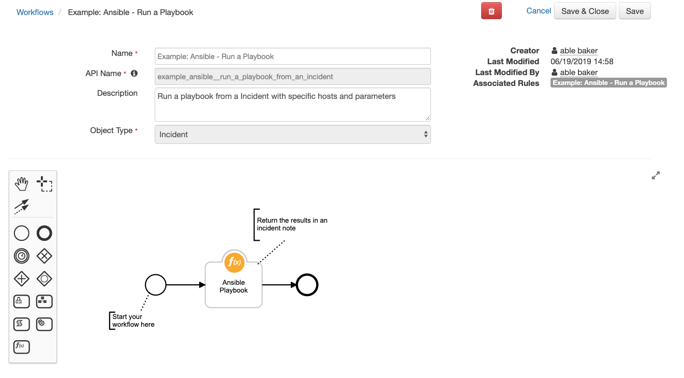
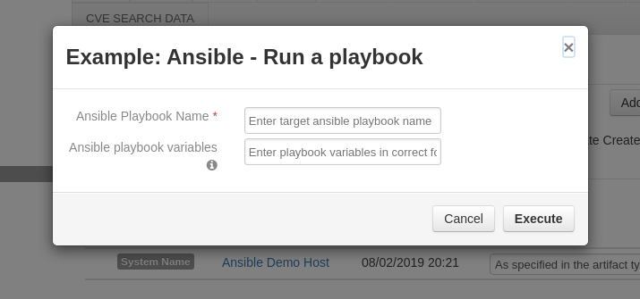

# Ansible Integration Function for IBM Resilient
## Table of Contents
  - [About This Package](#about-this-package)
  - [Prerequisites](#prerequisites)
  - [Installation](#installation)
  - [Function Inputs](#function-inputs)
  - [Function Output](#function-output)
  - [Considerations](#considerations)
---

## About This Package:
This package contains functions that integrate with Ansible to run playbooks and modules for remote host execution.

## Features:
* Run pre-written Ansible Playbooks from the Resilient platform, using parameter substitution.
* Run Ansible Modules for ad-hoc command execution.
* Run Resilient Rules at the Incident and Artifact levels.

Additional documentation on Ansible can be found at [the Ansible website](https://docs.ansible.com/).

### Package Components
* Functions:
  - fn_ansible
  - fn_ansible_module
* Workflows:
  - Example: Ansible - Run a Module
  - Example: Ansible - Run a Playbook from an Incident
  - Example: Ansible - Run a Playbook on an Artifact
* Rules:
  - Example: Ansible - Run a Module
  - Example: Ansible - Run a Playbook
  - Example: Ansible - Run a Playbook from an Artifact

## Prerequisites:
This integration relies on the installation of the ansible solution on the integration server. The process of installing ansible can be followed [here](https://docs.ansible.com/ansible/latest/installation_guide/).

* ansible >= 2.8.1
* ansible-runner >= 1.3.4
* Resilient platform >= v31.0.0
* Integrations Server Resilient Circuits >= v30.0.0
* Ansible config directory per the [ansible-runner convention](https://ansible-runner.readthedocs.io/en/latest/index.html)

* Ansible relies on a system library `sshpass`. Depending on your Integration Server operation system, different procedures are required to install this system library.

## Installation    
This package requires that it is installed on a RHEL or CentOS platform and uses the Resilient Circuits framework. 

* Unzip the package downloaded from the IBM App Exchange
* To install the package, run:

    ```
    $ [sudo] pip install fn_ansible-<version>.tar.gz
    ```
   
* To import the function, example rules and workflows into your Resilient platform, run:

    ```
    $ resilient-circuits customize -l fn-ansible
    ```
* To update your `app.config` file with the required Ansible configurations, run:

    ```
    $ resilient-circuits config -u -l fn-ansible
    ```

* Within the `app.config` file, edit the following configuration data:

    ```
    [fn_ansible]
    runner_dir=</full/path/to/your/ansible/directory>
    artifact_dir=</full/path/to/artifacts/directory>
    # change this value to trim the collection of previous process runs
    artifact_retention_num=0
    ```

* To uninstall:

    ```
    $ [sudo] pip uninstall fn-ansible
    ```

* Run Resilient Circuits:

    ```
    $ resilient-circuits run
    ```

### Sample Workflow:
 

## Function Inputs:
| Input Name | Type | Required | Example | Info |
| ------------- | :--: | :-------:| ------- | ---- |
| ansible_playbook_name | String | Yes | "my_playbook" or "my_playbook.yml" | Identifies target playbook to run |
| ansible_parameters | String | No | "host_names=192.168.1.4" | Substitution variables for a Playbook at runtime. For example, a Playbook containing `hosts: "{{host_names}}"` will be replaced using the example value of 196.168.1.4. Use semi-colons (;) to separate different parameters. |

Some parameters can contain more than one value. In these cases, use a comma (,) to separate the values. Example: `host_names=192.168.56.1,192.168.56.2`.

When using playbooks run against artifacts, an additional parameter is sent specifying the artifact value to the playbook as `artifact_value=<artifact_value>`. Therefore, in your playbook, ensure to add `{{artifact_value}}` for value substitution.

 
## Function Output:
Results returned to the Resilient platform from an Ansible function are in the following payload pattern:

```
{
  'version': '1.0',
  'success': True,
  'reason': None,
  'inputs': {
    u'ansible_playbook_name': u'find_files2',
    u'ansible_parameters': u'age=-2d; host_names=192.168.56.3,192.168.56.4; path=/usr/local/bin/'
  },
  'metrics': {
    'package': 'fn-ansible',
    'timestamp': '2019-06-19 11:06:39',
    'package_version': '1.0.0',
    'host': 'xxx.cambridge.ibm.com',
    'version': '1.0',
    'execution_time_ms': 12549
  },
  'content': {
    u'192.168.56.4': {
      'detail': 'fatal: [192.168.56.4]: UNREACHABLE! => {"changed": false, "msg": "timed out", "unreachable": true}',
      'summary': 'failed'
    },
    u'192.168.56.3': {
      'detail': '',
      'summary': 'failed'
    }
  },
  'raw': '{"192.168.56.4": {"detail": "fatal: [192.168.56.4]: UNREACHABLE! => {\\"changed\\": false, \\"msg\\": \\"timed out\\", \\"unreachable\\": true}", "summary": "failed"}, "192.168.56.3": {"detail": "", "summary": "failed"}'
}
```

The following Post-Processing Script cleans up the payload and adds it as an incident note:

```
import re

pp = '(\\x1b\[\d*(;\d*)*m)'
note = u''

if len(results['content'].keys()) == 0:
  note = u"No results returned on parameters: {}".format(results['inputs'])
else:

  for item in results['content']:
    note = note + u"{} - {}\n".format(item, results['inputs'])
    note = note + re.sub(pp, '', results['content'][item]['detail']).replace('\\r\\n', '\\n') + '\n'

incident.addNote(helper.createPlainText(note))
```

For very large data results, it may not be practical to save the results as a Note. Instead, the fn_utilities function `Utilities: String to Attachment` can be added to your workflow to send your Ansible results to an attachment. In this case, workflow properties are used to retain the results of this function for use by downstream functions. 

## Considerations
* Only the ansible-runner `synchronous` capability is supported.
* Playbook and artifact names must not contain unicode characters. This is a limitation in the ansible-runner package ( <= 2.8.1) which should be resolved in a future release.
* The app.config setting `artifact_retention_num` is available to clean up previous execution files older than the specified days. Use a value of 0 to specify no deletion.
* Consider using Rule Activity Field select lists for Ansible module name and parameter restrictions. This ensures that only specific commands are used for ad-hoc executions.
* Also consider using Rule Activity Field select lists for Ansible playbook names for similar reasons to ensure only specific playbooks are supported through Resilient.
* The workflow associated with a module or playbook function will remain blocked until all host executions are complete and the results are returned. The ansible-runner `Asynchronous` operation corrects this restriction but remains a future enhancement.