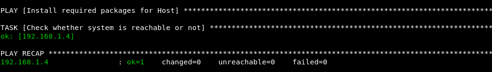
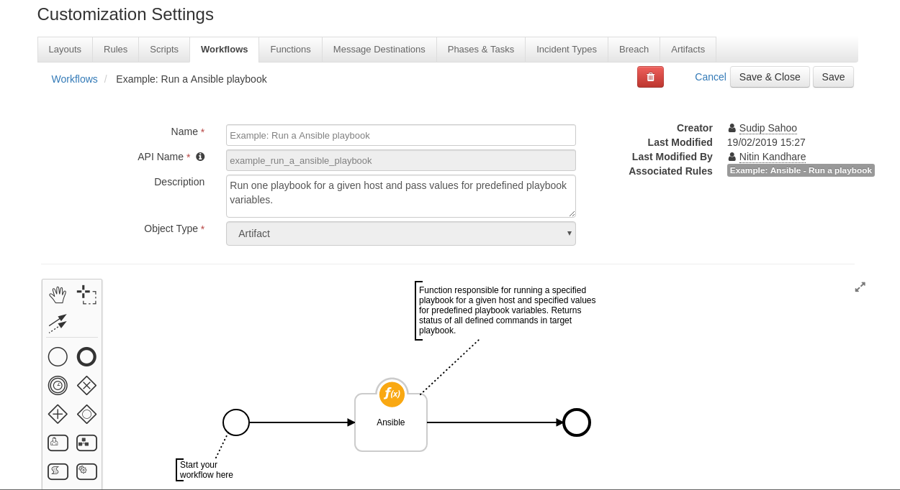

# Ansible Integration Function for IBM Resilient

## Table of Contents
  - [About This Package](#about-this-package)
  - [Prerequisites](#prerequisites)
  - [Installation](#installation)
  - [Function Inputs](#function-inputs)
  - [Function Output](#function-output)
  - [Pre-Process Script](#pre-process-script)
  - [Post-Process Script](#post-process-script)
---

## About This Package:
**This package contains a Function that integrates with Ansible installed in Control Machine.**

 

* User can run pre-written Playbooks.
* User can also supply extra variables(if applicable) on 1 or more target machines.
* User have the option to avail Ansible Vault features and can run Encrypted Playbook(s).

### Sample Workflow:
 

## Prerequisites:
* Resilient Appliance >= v31.0.0
* Integrations Server running resilient_circuits >= v30.0.0
* Ansible config file and Host file configured as per convention.


## Installation    
This package requires that it is installed on a RHEL or CentOS platform and uses the resilient-circuits framework.    
* Install this package using `pip`:
* Download the `.zip` file from our App Exchange and extract it. You will find a file called: `fn-ansible-<version>.tar.gz`
* Copy this file to your Integrations Server
* To install the package, run:
    ```
    $ pip install pip install fn-ansible-<version>.tar.gz
    ```
* To import the function, example rules and workflows into your Resilient Appliance, run:
    ```
    $ resilient-circuits customize -y -l fn-ansible
    ```
* To update your `app.config` file with the required Ansible configurations, run:
    ```
    $ resilient-circuits config -u
    ```
* Then open your `app.config` file and the following configuration data is added:
    ```
    [fn_ansible]
    playbook_dir=</full/path/to/your/playbook/directory>
    user_name=<USERNAME-OF-HOSTS>
    root_password=<PASSWORD-OF-HOSTS>
    hosts_path=</full/path/of/your/inventory/file>
    playbook_become_method=<SUPER-USER-METHOD e.g. sudo>
    playbook_become_user=<NAME-OF-ROOT-USER e.g. root>
    vault_password_file=<OPTIONAL: /full/path/of/password/file>
    connection_type=<OPTIONAL: e.g. local, smart etc.>
    control_machine_username=<OPTIONAL: for user; REQUIRED: for developers and testers>
    control_machine_password=<OPTIONAL: for user; REQUIRED: for developers and testers>
    ```

If you are using ansible-vault please provide full path of your password file( Recommended format below: ) -
> vault_password.yml
    ---
    vault_pass: <your-password>

* Configuration Values From Keystore
Values in the config file can be pulled from a compatible keystore system on your OS. To retrieve a value named `yourkey` from a keystore, set it to `^yourkey`.

Example from app.confg:

```
[fn_ansible]
root_password=^root_password

```
* Adding the Values to Keystore
The resilient package includes a utility to add all of the keystore-based values from your app.config file to your system's compatible keystore system. Once you have referenced the keys in your app.config file, run `res-keyring` and you will be prompted for the secure values to store.

```
  $ res-keyring 
  Configuration file: /Users/example/.resilient/app.config
  Secrets are stored with 'keyring.backends.OS_X'
  [fn_ansible] root_password: <not set>
  Enter new value (or <ENTER> to leave unchanged): <enter-your-password>
  Confirm new value: <re-enter-your-password>
  Value set.
  Done.

```
* Run resilient-circuits:
    ```
    $ resilient-circuits run
    ```
* To uninstall:
    ```
    $ pip uninstall fn-ansible
    ```

## Function Inputs:
| Input Name | Type | Required | Example | Info |
| ------------- | :--: | :-------:| ------- | ---- |
| `ansible_playbook_name` | `String` | Yes | `"my_playbook" or "my_playbook.yml"` | Identifies target playbook to be run |
| `ip_void_artifact_value` | `String` | No | `"host_names=192.168.1.4"` | Replaces Variables with acutal values in Playbool during runtime. In example here Function will assume that 'host_name' is the variable and used in target playbook and will  replace it with '192.168.1.4'. Be careful with any extra space and unwanted character(s) as it will cause failure in runtime.|

 
## Function Output:
* To see the output of each of the API calls for this Function, we recommend running `resilient-circuits` in `DEBUG` mode.
* To do this run:
    ```
    $ resilient-circuits run --loglevel=DEBUG
    ```

### An Example Output:
```python
results = {'192.168.1.4': { 
    'failures': 0, 
    'unreachable': 0, 
    'ok': 1, 
    'changed': 0, 
    'skipped': 0
    }
}
```
## Pre-Process Script:

```python
inputs.ansible_playbook_name = rule.properties.ansible_playbook_name
inputs.ansible_parameters = rule.properties.ansible_playbook_variables
```

## Post-Process Script:
* This example appends the Threat Intelligences to the Artifact's Description:.
```python
# We are only displaying the status of the tasks
incident.addNote(str(results))
```
