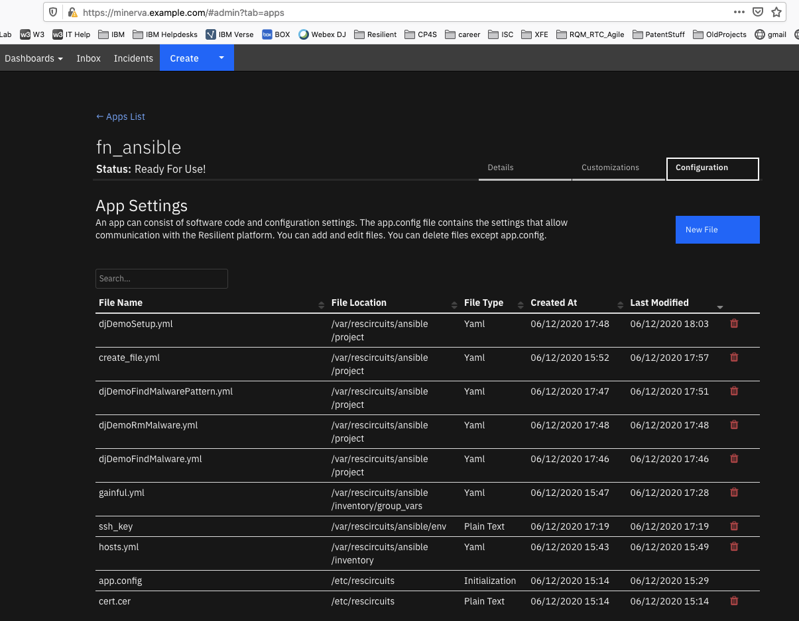

# Ansible for SOAR


## Table of Contents
- [Release Notes](#release-notes)
- [1.2.0 Changes](#120-changes)
- [Overview](#overview)
  - [Key Features](#key-features)
- [Integration Server Installation](#integration-server-installation)
- [Cloud Pak for Security](#cloud-pak-for-security)
- [Requirements](#requirements)
  - [SOAR platform](#soar-platform)
  - [App Host Installation](#app-host-installation)
  - [Proxy Server](#proxy-server)
  - [Python Environment](#python-environment)
- [Installation](#installation)
  - [Install](#install)
  - [App Configuration](#app-configuration)
- [Function - Ansible Module](#function---ansible-module)
- [Function - Ansible Playbook](#function---ansible-playbook)
- [Playbooks](#playbooks)
- [Considerations](#Considerations)
- [App Host sshPass Support](#app-host-sshpass-support)
- [Troubleshooting & Support](#troubleshooting--support)

---

## Release Notes

| Version | Date | Notes |
| ------- | ---- | ----- |
| 1.2.0 | 05/2024 | Refresh the integration. Convert rule/workflows to playbooks.|
| 1.1.1 | 04/2021 | Support for App Host. |
| 1.1.0 | 11/2019 | Change result payload format to JSON returned to SOAR. |

## 1.2.0 Changes
In v1.2, the existing rules and workflows have been replaced with playbooks. This change is made to support the ongoing, newer capabilities of playbooks. Each playbook has the same functionality as the previous, corresponding rule/workflow.

If upgrading from a previous release, you'll noticed that the previous release's rules/workflows remain in place. Both sets of rules and playbooks are active. For manual actions, playbooks will have the same name as it's corresponding rule, but with "(PB)" added at the end. For automatic actions, the playbooks will be disabled by default.

You can continue to use the rules/workflows. But migrating to playbooks will provide greater functionality along with future app enhancements and bug fixes.

---

## Overview

**Run Ansible Playbooks and Modules**

 

This app runs the Ansible environment to allow the running of playbooks and modules against your enterprise.
Specify the playbooks, hosts and environment variables necessary for execution.

### Key Features
* Run pre-written Ansible Playbooks from the SOAR platform, using parameter substitution.
* Run Ansible Modules for ad-hoc command execution.
* Run SOAR playbooks at the Incident and Artifact levels.

Additional documentation on Ansible can be found at [the Ansible website](https://docs.ansible.com/).

---

## App Host Installation
All the components for running Ansible in a container already exist when using the App Host app. The remainder of this section details the Ansible configuration file changes.

Under the Configuration Tab for an App, build out the ansible-runner files needed per the [ansible-runner convention](https://docs.ansible.com/ansible/latest/installation_guide/intro_configuration.html). The necessary files are the `hosts` file, ssh_key and your yml playbooks. Build these files under `/var/rescircuits/ansible` and ensure that the app.config file contains the same reference:

```
[fn_ansible]
runner_dir=/var/rescircuits/ansible
artifact_dir=/tmp
```

### Ansible Playbooks
When adding Ansible playbooks through the Configuration tab of an App, ensure the File Path is `/var/rescircuits/ansible/project`.

Note: Ansible playbooks and modules cannot be run within the container environment.

The minimum Ansible files needed are:
* hosts, and
* playbooks

Your environment may require more configuration files, such as ssh_key and envvars.

This is an example of the configuration files used including several yaml files.


If you require additional ansible modules, additional effort is needed to include them as files in the Configuration tab.

### Limitations
Presently, there are limitations in the use of containers when Ansible playbook parameters sent from SOAR
are used with any file defined in `/var/rescircuits/ansible/env`.

## Integration Server Installation
### Prerequisites:
This integration relies on the installation of the ansible solution on the integration server. The process of installing ansible can be followed [here](https://docs.ansible.com/ansible/latest/installation_guide/).

* ansible >= 2.8.1
* ansible-runner >= 2.3.6
* SOAR platform >= v50.0.0
* Integrations Server Resilient Circuits >= v50.0.0
* Ansible config directory per the [ansible-runner convention](https://docs.ansible.com/ansible/latest/installation_guide/intro_configuration.html)

* Ansible relies on a system library `sshpass`. Depending on your Integration Server operation system, different procedures are required to install this system library.

* For RHEL servers, the [Red Hat Developer Toolset](https://access.redhat.com/documentation/en-us/red_hat_developer_toolset/8/html/user_guide/chap-red_hat_developer_toolset) is needed to build the ansible runtime environment. This may also require a registered subscription manager to install.

This package requires that it is installed on a RHEL or CentOS platform and uses the Resilient Circuits framework.

* Unzip the package downloaded from the IBM App Exchange
```
    $ unzip app-fn_ansible-<version>.zip
```
* To install the package, run:

    ```
    $ [sudo] pip install fn_ansible-<version>.tar.gz
    ```

* To import the function, example rules and workflows into your SOAR platform, run:

    ```
    $ resilient-circuits customize -l fn-ansible
    ```
* To update your `app.config` file with the required Ansible configurations, run:

    ```
    $ resilient-circuits config -u -l fn-ansible
    ```

* Within the `app.config` file, edit the following configuration data:

    ```
    [fn_ansible]
    runner_dir=</full/path/to/your/ansible/directory>
    # temporary files collected when running a module or a playbook
    artifact_dir=</full/path/to/artifacts/directory>
    # change this value to trim the collection of previous process runs
    artifact_retention_num=0
    ```

* To uninstall:

    ```
    $ [sudo] pip uninstall fn-ansible
    ```

* Run Resilient Circuits:

    ```
    $ resilient-circuits run
    ```

---

## Requirements
This app supports the IBM Security QRadar SOAR Platform and the IBM Security QRadar SOAR for IBM Cloud Pak for Security.

### SOAR platform
The SOAR platform supports two app deployment mechanisms, Edge Gateway (also known as App Host) and integration server.

If deploying to a SOAR platform with an App Host, the requirements are:
* SOAR platform >= `50.0.9097`.
* The app is in a container-based format (available from the AppExchange as a `zip` file).

If deploying to a SOAR platform with an integration server, the requirements are:
* SOAR platform >= `50.0.9097`.
* The app is in the older integration format (available from the AppExchange as a `zip` file which contains a `tar.gz` file).
* Integration server is running `resilient_circuits>=50.0.0`.
* If using an API key account, make sure the account provides the following minimum permissions: 
  | Name | Permissions |
  | ---- | ----------- |
  | Org Data | Read |
  | Function | Read |

The following SOAR platform guides provide additional information: 
* _Edge Gateway Deployment Guide_ or _App Host Deployment Guide_: provides installation, configuration, and troubleshooting information, including proxy server settings. 
* _Integration Server Guide_: provides installation, configuration, and troubleshooting information, including proxy server settings.
* _System Administrator Guide_: provides the procedure to install, configure and deploy apps. 

The above guides are available on the IBM Documentation website at [ibm.biz/soar-docs](https://ibm.biz/soar-docs). On this web page, select your SOAR platform version. On the follow-on page, you can find the _Edge Gateway Deployment Guide_, _App Host Deployment Guide_, or _Integration Server Guide_ by expanding **Apps** in the Table of Contents pane. The System Administrator Guide is available by expanding **System Administrator**.

### Cloud Pak for Security
If you are deploying to IBM Cloud Pak for Security, the requirements are:
* IBM Cloud Pak for Security >= `1.10.15`.
* Cloud Pak is configured with an Edge Gateway.
* The app is in a container-based format (available from the AppExchange as a `zip` file).

The following Cloud Pak guides provide additional information: 
* _Edge Gateway Deployment Guide_ or _App Host Deployment Guide_: provides installation, configuration, and troubleshooting information, including proxy server settings. From the Table of Contents, select Case Management and Orchestration & Automation > **Orchestration and Automation Apps**.
* _System Administrator Guide_: provides information to install, configure, and deploy apps. From the IBM Cloud Pak for Security IBM Documentation table of contents, select Case Management and Orchestration & Automation > **System administrator**.

These guides are available on the IBM Documentation website at [ibm.biz/cp4s-docs](https://ibm.biz/cp4s-docs). From this web page, select your IBM Cloud Pak for Security version. From the version-specific IBM Documentation page, select Case Management and Orchestration & Automation.

### Proxy Server
The app does not support a proxy server.

### Python Environment
Python 3.6, 3.9, and 3.11 are supported.
Additional package dependencies may exist for each of these packages:
* ansible-runner==1.3.4; python_version=="3.6"
* ansible-runner~=2.3.6; python_version>="3.9"
* ansible==2.8.3; python_version=="3.6"
* ansible~=7.3.0; python_version>="3.9"
* python-daemon==2.3.2; python_version=="3.6"
* python-daemon~=3.0.1; python_version>="3.9"
* resilient_circuits>=50.0.0
* resilient_lib>=50.0.0
* pywinrm

---

## Installation

### Install
* To install or uninstall an App or Integration on the _SOAR platform_, see the documentation at [ibm.biz/soar-docs](https://ibm.biz/soar-docs).
* To install or uninstall an App on _IBM Cloud Pak for Security_, see the documentation at [ibm.biz/cp4s-docs](https://ibm.biz/cp4s-docs) and follow the instructions above to navigate to Orchestration and Automation.

### App Configuration
The following table provides the settings you need to configure the app. These settings are made in the app.config file. See the documentation discussed in the Requirements section for the procedure.

| Config | Required | Example | Description |
| ------ | :------: | ------- | ----------- |
| **artifact_dir** | Yes | `</full/path/to/artifacts/directory>` | *Full path to artifacts directory. App Host deployments should use /tmp. * |
| **artifact_retention_num** | Yes | `0` | *Change this value to trim the collection of previous process run* |
| **runner_dir** | Yes | `</full/path/to/your/ansible/directory>` | *Full path to the Ansible runner directory. App Host deployments should use /var/rescircuits/ansible. *|


 ---

## Function - Ansible Module
Run an Ansible Module

 

<details><summary>Inputs:</summary>
<p>

| Name | Type | Required | Example | Tooltip |
| ---- | :--: | :------: | ------- | ------- |
| `ansible_hosts` | `text` | Yes | `-` | host name pattern or group for module execution |
| `ansible_module` | `text` | Yes | `-` | command and parameters to run |
| `ansible_parameters` | `text` | No | `paths=/etc;depth=1` | parameters for the module separated by a semicolon (;) |

</p>
</details>

<details><summary>Outputs:</summary>
<p>

> **NOTE:** This example might be in JSON format, but `results` is a Python Dictionary on the SOAR platform.

```python
results = {
  "content": {
    "52": {
      "detail": "\u001b[1;35m[WARNING]: No inventory was parsed, only implicit localhost is available\u001b[0m",
      "summary": "successful"
    },
    "localhost": {
      "detail": {
        "_ansible_no_log": false,
        "changed": true,
        "cmd": [
          "echo",
          "Hello",
          "World!"
        ],
        "delta": "0:00:00.062326",
        "end": "2024-03-19 14:17:15.149417",
        "invocation": {
          "module_args": {
            "_raw_params": "echo Hello World!",
            "_uses_shell": false,
            "argv": null,
            "chdir": null,
            "creates": null,
            "executable": null,
            "expand_argument_vars": true,
            "removes": null,
            "stdin": null,
            "stdin_add_newline": true,
            "strip_empty_ends": true
          }
        },
        "msg": "",
        "rc": 0,
        "start": "2024-03-19 14:17:15.087091",
        "stderr": "",
        "stderr_lines": [],
        "stdout": "Hello World!",
        "stdout_lines": [
          "Hello World!"
        ]
      },
      "summary": "successful"
    }
  },
  "inputs": {
    "ansible_hosts": "localhost",
    "ansible_module": "command",
    "ansible_parameters": "echo Hello World!"
  },
  "metrics": {
    "execution_time_ms": 11817,
    "host": "local",
    "package": "fn-ansible",
    "package_version": "1.3.0",
    "timestamp": "2024-03-19 14:17:15",
    "version": "1.0"
  },
  "raw": null,
  "reason": null,
  "success": true,
  "version": 2.0
}
```

</p>
</details>

<details><summary>Example Function Input Script:</summary>
<p>

```python
inputs.ansible_hosts = getattr(playbook.inputs, "ansible_hosts", None)
inputs.ansible_module = getattr(playbook.inputs, "ansible_module", None)
inputs.ansible_parameters = getattr(playbook.inputs, "ansible_module_arguments", None)
```

</p>
</details>

<details><summary>Example Function Post Process Script:</summary>
<p>

```python
results = playbook.functions.results.module_results
if results.get("success"):
  if len(results.get('content', {}).keys()) == 0:
    note = f"Running Ansible module: {playbook.inputs.ansible_module}\nParameters: {results.get('inputs')}\nNo results returned."
  else:
    for item in results.get('content', {}):
      note = "Running Ansible module: {}\nParameters: {}\nResults: {}".format(playbook.inputs.ansible_module, results.get('inputs'), results.get('content', {}).get(item, {}).get('detail'))
  incident.addNote(helper.createPlainText(note))
else:
  incident.addNote(f"Running Ansible Module: {playbook.inputs.ansible_module} failed with reason: {results.get('reason')}")
```

</p>
</details>

---
## Function - Ansible Playbook
Ansible is simple IT engine for automation, it is designed for manage many systems, rather than just one at a time.

 

<details><summary>Inputs:</summary>
<p>

| Name | Type | Required | Example | Tooltip |
| ---- | :--: | :------: | ------- | ------- |
| `ansible_parameters` | `text` | No | `age=30;paths=C:\Users\Administrator` | parameters for the playbook separated by a semicolon (;) |
| `ansible_playbook_name` | `text` | Yes | `-` | - |

</p>
</details>

<details><summary>Outputs:</summary>
<p>

> **NOTE:** This example might be in JSON format, but `results` is a Python Dictionary on the SOAR platform.

```python
results = {
  "content": {
    "127.0.0.1": {
      "detail": {
        "_ansible_no_log": false,
        "changed": true,
        "cmd": [
          "echo",
          "Hello"
        ],
        "delta": "0:00:00.012063",
        "end": "2024-03-19 14:31:34.888730",
        "invocation": {
          "module_args": {
            "_raw_params": "echo Hello",
            "_uses_shell": false,
            "argv": null,
            "chdir": null,
            "creates": null,
            "executable": null,
            "expand_argument_vars": true,
            "removes": null,
            "stdin": null,
            "stdin_add_newline": true,
            "strip_empty_ends": true
          }
        },
        "msg": "",
        "rc": 0,
        "start": "2024-03-19 14:31:34.876667",
        "stderr": "",
        "stderr_lines": [],
        "stdout": "Hello",
        "stdout_lines": [
          "Hello"
        ]
      },
      "summary": "successful"
    },
    "63": {
      "detail": "\u001b[1;35mthe implicit localhost does not match \u0027all\u0027\u001b[0m",
      "summary": "successful"
    }
  },
  "inputs": {
    "ansible_parameters": "command=echo Hello",
    "ansible_playbook_name": "playbook2"
  },
  "metrics": {
    "execution_time_ms": 11915,
    "host": "local",
    "package": "fn-ansible",
    "package_version": "1.3.0",
    "timestamp": "2024-03-19 14:31:35",
    "version": "1.0"
  },
  "raw": null,
  "reason": null,
  "success": true,
  "version": 2.0
}
```

</p>
</details>

<details><summary>Example Function Input Script:</summary>
<p>

```python
inputs.ansible_playbook_name = getattr(playbook.inputs, "ansible_playbook_name", None)
artifact_value = f'artifact_value={artifact.value}'
if getattr(playbook.inputs, "ansible_playbook_variables", None):
  inputs.ansible_parameters = ';'.join(getattr(playbook.inputs, "ansible_playbook_variables", None), artifact_value)
else:
  inputs.ansible_parameters = artifact_value
```

</p>
</details>

<details><summary>Example Function Post Process Script:</summary>
<p>

```python
results = playbook.functions.results.playbook_results
if results.get("success"):
  if len(results.get("content", {}).keys()) == 0:
    note = "No results returned on parameters: {}".format(results.get('inputs'))
  else:
    for item in results.get('content', {}):
      note = f"{item} - {results.get('inputs')}\n{str(results.get('content', {}).get(item, {}).get('detail'))}"
  incident.addNote(helper.createPlainText(note))
else:
  incident.addNote(f"Running Ansible playbook: {playbook.inputs.ansible_playbook_name} failed with reason: {results.get('reason')}")
```

</p>
</details>

For very large data results, it may not be practical to save the results as a Note. Instead, the fn_utilities function `Utilities: String to Attachment` can be added to your workflow to send your Ansible results to an attachment. In this case, workflow properties are used to retain the results of this function for use by downstream functions.

---


## Playbooks
| Playbook Name | Description | Activation Type | Object | Status | Condition | 
| ------------- | ----------- | --------------- | ------ | ------ | --------- | 
| Ansible: Run a Module - Example (PB) | Run an Ansible module for ad-hoc operations | Manual | incident | `enabled` | `-` | 
| Ansible: Run a Playbook - Example (PB) | Run a playbook from an Incident with specific hosts and parameters | Manual | incident | `enabled` | `-` | 
| Ansible: Run a Playbook from an Artifact - Example (PB) | Merge artifact_value with Ansible parameters to run a Playbook | Manual | artifact | `enabled` | `-` | 

---

## Considerations
* Only the ansible-runner `synchronous` capability is supported.
* Playbook and artifact names must not contain unicode characters. This is a limitation in the ansible-runner package ( <= 2.8.1) which should be resolved in a future release.
* The app.config setting `artifact_retention_num` is available to clean up previous execution files older than the specified days. Use a value of 0 to specify no deletion.
* Consider using Rule Activity Field select lists for Ansible module name and parameter restrictions. This ensures that only specific commands are used for ad-hoc executions.
* Also consider using Rule Activity Field select lists for Ansible playbook names for similar reasons to ensure only specific playbooks are supported through SOAR.
* The workflow associated with a module or playbook function will remain blocked until all host executions are complete and the results are returned. The ansible-runner `Asynchronous` operation corrects this restriction but remains a future enhancement.
* Playbooks should use the `debug` statement to return findings back to SOAR. The example below runs the `find` module, returning the file found using the debug statement.

```yaml
- hosts: "{{host_names}}"
  tasks:
  - name: Recursively find files
    find:
      paths: "{{path}}"
      age: "{{age}}"
      recurse: yes
      pattern: '*'
    register: files_matched

  - debug:
      msg: "{{ files_matched.files }}"
```

---

## App Host sshPass Support
You may find that you require the sshPass package for your use of Ansible. This package uses the [GPLv2 license](https://www.gnu.org/licenses/old-licenses/gpl-2.0.en.html) and
this license restricts IBM from building and distributing a container under our [International License Agreement](https://www-03.ibm.com/software/sla/sladb.nsf/pdf/ilan/$file/ilan_en.pdf).

If you require sshPass, you can build your own container by modifying the `Dockerfile` in the fn_ansible-x.x.x.tar.gz archive and uncomment the following
RUN command. See the documentation on [hosting your own container registry for App Host](https://www.ibm.com/support/knowledgecenter/SSBRUQ_37.0.0/doc/container_apps.html)
for the use of a private registry with App Host.

```
# uncomment to support sshpass in your privately built container
#yum install -y sshpass
```

---

## Troubleshooting & Support
Refer to the documentation listed in the Requirements section for troubleshooting information.
 
### For Support
This is a IBM supported App. For assistance, see [https://ibm.com/mysupport](https://ibm.com/mysupport).
