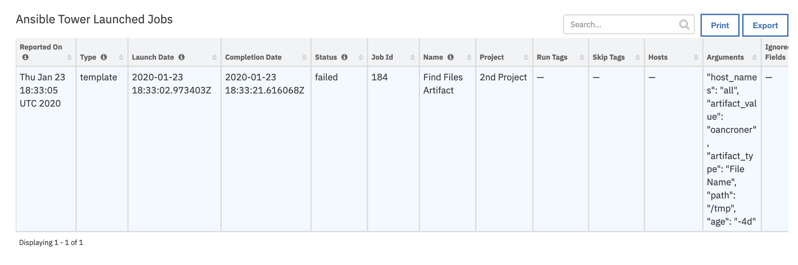

<!--
  This README.md is generated by running:
  "resilient-sdk docgen -p fn_ansible_tower"

  This file was generated with resilient-sdk v51.0.2.2.1096

  It is best edited using a Text Editor with a Markdown Previewer. VS Code
  is a good example. Checkout https://guides.github.com/features/mastering-markdown/
  for tips on writing with Markdown

  All fields followed by "::CHANGE_ME::"" should be manually edited

  If you make manual edits and run docgen again, a .bak file will be created

  Store any screenshots in the "doc/screenshots" directory and reference them like:
  

  NOTE: If your app is available in the container-format only, there is no need to mention the integration server in this readme.
-->

# Ansible Tower


## Table of Contents
- [Release Notes](#release-notes)
- [Overview](#overview)
  - [Key Features](#key-features)
- [Requirements](#requirements)
  - [SOAR platform](#soar-platform)
  - [Cloud Pak for Security](#cloud-pak-for-security)
  - [Proxy Server](#proxy-server)
  - [Python Environment](#python-environment)
- [Installation](#installation)
  - [Install](#install)
  - [App Configuration](#app-configuration)
- [Function - Ansible Tower Get Ad Hoc Command Results](#function---ansible-tower-get-ad-hoc-command-results)
- [Function - Ansible Tower Get Job Results](#function---ansible-tower-get-job-results)
- [Function - Ansible Tower List Job Templates](#function---ansible-tower-list-job-templates)
- [Function - Ansible Tower List Jobs](#function---ansible-tower-list-jobs)
- [Function - Ansible Tower Run an Ad Hoc Command](#function---ansible-tower-run-an-ad-hoc-command)
- [Function - Ansible Tower Run Job](#function---ansible-tower-run-job)
  - [Custom Layouts](#custom-layouts)
- [Data Table - Ansible Tower Job Templates](#data-table---ansible-tower-job-templates)
- [Data Table - Ansible Tower Launched Jobs](#data-table---ansible-tower-launched-jobs)
- [Rules](#rules)
- [Troubleshooting & Support](#troubleshooting--support)

---

## Release Notes
<!--
  Specify all changes in this release. Do not remove the release
  notes of a previous release
-->
| Release | Date | Notes |
| ------- | ---- | ----- |
| v1.0.4  | 10/2024 | Rebuilt the app to server v51.0.0 |
| v1.0.3  | 7/2021 | Bug fix to handle results data |
| v1.0.2  | 2/2021 | Bug fix for paged results from templates, jobs, etc. |
| v1.0.1  | 12/2020 | App Host support |
| v1.0.0  | 2/2020 | Initial release |

---

## Overview
<!--
  Provide a high-level description of the function itself and its remote software or application.
  The text below is parsed from the "description" and "long_description" attributes in the setup.py file
-->
**Resilient Circuits Components for 'fn_ansible_tower'**

This integration provides the capability to execute jobs and return job results from Ansible Tower.

Specific features include:

* List Job Templates filtering by Project
* Execute Job Templates, specifying name/value pairs for job template substitution
* Execute ad-hoc Jobs, specifying name/value pairs for module parameters
* List Jobs run filtered by status or date
* Return Job run results


 

---

## Requirements
<!--
  List any Requirements
-->
This app supports the IBM Security QRadar SOAR Platform and the IBM Security QRadar SOAR for IBM Cloud Pak for Security.

### SOAR platform
The SOAR platform supports two app deployment mechanisms, Edge Gateway (also known as App Host) and integration server.

If deploying to a SOAR platform with an App Host, the requirements are:
* SOAR platform >= `51.0.0`.
* The app is in a container-based format (available from the AppExchange as a `zip` file).

If deploying to a SOAR platform with an integration server, the requirements are:
* SOAR platform >= `51.0.0`.
* The app is in the older integration format (available from the AppExchange as a `zip` file which contains a `tar.gz` file).
* Integration server is running `resilient_circuits>=51.0.0`.
* If using an API key account, make sure the account provides the following minimum permissions:
  | Name | Permissions |
  | ---- | ----------- |
  | Org Data | Read |
  | Function | Read |

The following SOAR platform guides provide additional information:
* _Edge Gateway Deployment Guide_ or _App Host Deployment Guide_: provides installation, configuration, and troubleshooting information, including proxy server settings.
* _Integration Server Guide_: provides installation, configuration, and troubleshooting information, including proxy server settings.
* _System Administrator Guide_: provides the procedure to install, configure and deploy apps.

The above guides are available on the IBM Documentation website at [ibm.biz/soar-docs](https://ibm.biz/soar-docs). On this web page, select your SOAR platform version. On the follow-on page, you can find the _Edge Gateway Deployment Guide_, _App Host Deployment Guide_, or _Integration Server Guide_ by expanding **Apps** in the Table of Contents pane. The System Administrator Guide is available by expanding **System Administrator**.

### Cloud Pak for Security
If you are deploying to IBM Cloud Pak for Security, the requirements are:
* IBM Cloud Pak for Security >= `1.10.16`.
* Cloud Pak is configured with an Edge Gateway.
* The app is in a container-based format (available from the AppExchange as a `zip` file).

The following Cloud Pak guides provide additional information:
* _Edge Gateway Deployment Guide_ or _App Host Deployment Guide_: provides installation, configuration, and troubleshooting information, including proxy server settings. From the Table of Contents, select Case Management and Orchestration & Automation > **Orchestration and Automation Apps**.
* _System Administrator Guide_: provides information to install, configure, and deploy apps. From the IBM Cloud Pak for Security IBM Documentation table of contents, select Case Management and Orchestration & Automation > **System administrator**.

These guides are available on the IBM Documentation website at [ibm.biz/cp4s-docs](https://ibm.biz/cp4s-docs). From this web page, select your IBM Cloud Pak for Security version. From the version-specific IBM Documentation page, select Case Management and Orchestration & Automation.

### Proxy Server
The app **does** support a proxy server.

### Python Environment
Python 3.9, 3.11, and 3.12 are officially supported. When deployed as an app, the app runs on Python 3.11.
Additional package dependencies may exist for each of these packages:
* resilient_circuits>=51.0.0
* resilient_lib>=51.0.0

---

## Installation

### Install
* To install or uninstall an App or Integration on the _SOAR platform_, see the documentation at [ibm.biz/soar-docs](https://ibm.biz/soar-docs).
* To install or uninstall an App on _IBM Cloud Pak for Security_, see the documentation at [ibm.biz/cp4s-docs](https://ibm.biz/cp4s-docs) and follow the instructions above to navigate to Orchestration and Automation.

### App Configuration
The following table provides the settings you need to configure the app. These settings are made in the app.config file. See the documentation discussed in the Requirements section for the procedure.


  | Config | Required | Example | Description |
  | ------ | :------: | ------- | ----------- |
  | **username** | Yes | `` | *User name for API access to Ansible Tower* |
  | **password** | Yes | `` | *Password for above user name* |
  | **url** | Yes | `` | *URL to Ansible Tower* |
  | **cafile** | Yes | `False` | *False for no SSL certificate verification or path to certificate file* |

### Integration Server
* Download the `app-fn_ansible_tower-x.x.x.zip`.
* Copy the `.zip` to your Integration Server and SSH into it.
* **Unzip** the package:
  ```
  $ unzip app-fn_ansible_tower-x.x.x.zip
  ```
* **Install** the package:
  ```
  $ pip install fn_ansible_tower-x.x.x.tar.gz
  ```
* Import the **configurations** into your app.config file:
  ```
  $ resilient-circuits config -u
  ```
* Import the fn_ansible_tower **customizations** into the Resilient platform:
  ```
  $ resilient-circuits customize -y -l fn-ansible-tower
  ```
* Open the config file, scroll to the bottom and edit your fn_ansible_tower configurations:
  ```
  $ nano ~/.resilient/app.config
  ```
  | Config | Required | Example | Description |
  | ------ | :------: | ------- | ----------- |
  | **username** | Yes | `` | *User name for API access to Ansible Tower* |
  | **password** | Yes | `` | *Password for above user name* |
  | **url** | Yes | `` | *URL to Ansible Tower* |
  | **cafile** | Yes | `False` | *False for no SSL certificate verification or path to certificate file* |

* **Save** and **Close** the app.config file.
* [Optional]: Run selftest to test the Integration you configured:
  ```
  $ resilient-circuits selftest -l fn-ansible-tower
  ```
* **Run** resilient-circuits or restart the Service on Windows/Linux:
  ```
  $ resilient-circuits run
  ```

### Custom Layouts
<!--
  Use this section to provide guidance on where the user should add any custom fields and data tables.
  You may wish to recommend a new incident tab.
  You should save a screenshot "custom_layouts.png" in the doc/screenshots directory and reference it here
-->
* Import the Data Tables like the screenshot below:

  

 ---

## Uninstall
* SSH into your Integration Server.
* **Uninstall** the package:
  ```
  $ pip uninstall fn-ansible-tower
  ```
* Open the config file, scroll to the [fn_ansible_tower] section and remove the section or prefix `#` to comment out the section.
* **Save** and **Close** the app.config file.

## Function - Ansible Tower Get Ad Hoc Command Results
Return the results of an ad hoc command job

  

<details><summary>Inputs:</summary>
<p>

| Name | Type | Required | Example | Tooltip |
| ---- | :--: | :------: | ------- | ------- |
| `incident_id` | `number` | Yes | `-` | - |
| `tower_job_id` | `number` | Yes | `-` | Launched job Id for a job template |
| `tower_save_as` | `select` | Yes | `-` | - |

</p>
</details>

<details><summary>Outputs:</summary>
<p>

> **NOTE:** This example might be in JSON format, but `results` is a Python Dictionary on the SOAR platform.

```python
results = {
    # TODO: Generate an example of the Function Output within this code block.
    # To get the output of a Function:
    #   1. Run resilient-circuits in DEBUG mode: $ resilient-circuits run --loglevel=DEBUG
    #   2. Invoke the Function in SOAR
    #   3. Gather the results using: $ resilient-sdk codegen -p fn_ansible_tower --gather-results
    #   4. Run docgen again: $ resilient-sdk docgen -p fn_ansible_tower
    # Or simply paste example outputs manually here. Be sure to remove any personal information
}
```

</p>
</details>

<details><summary>Example Function Input Script:</summary>
<p>

```python
inputs.tower_job_id = row['job_id']
inputs.tower_save_as = rule.properties.tower_save_as
inputs.incident_id = incident.id
```

</p>
</details>

<details><summary>Example Function Post Process Script:</summary>
<p>

```python
import re

if results.content:
  finished = results.content['summary']['finished'].replace('T', ' ') if results.content['summary']['finished'] else None
  
  row['status'] = results.content['summary']['status']
  row['completion_date'] = finished
  
  note = u"Job Id: {}\nStatus: {}\nTemplate Name: {}\nFinished: {}".format(results.inputs['tower_job_id'], results.content['summary']['status'],
                                                                           results.content['summary']['name'], finished)
  if not results.inputs['tower_save_as_attachment']:
    note = note + u"\n".join(event.get("stdout") for event in results.content['events']['results'])
    incident.addNote(re.sub(r'[\x00-\x7f]\[[0-9;]*m', r'', note)) # remove color hilighting
  else:
    attachment_name = u"{}_{}.txt".format(results.content['summary']['name'].replace(" ", "_"), results.inputs['tower_job_id'])
    note = note + u"\nAttachment Name: {}".format(attachment_name)
    incident.addNote(note)

```

</p>
</details>

---
## Function - Ansible Tower Get Job Results
Get the results of a complete job

  

<details><summary>Inputs:</summary>
<p>

| Name | Type | Required | Example | Tooltip |
| ---- | :--: | :------: | ------- | ------- |
| `incident_id` | `number` | Yes | `-` | - |
| `tower_job_id` | `number` | Yes | `-` | Launched job Id for a job template |
| `tower_save_as` | `select` | Yes | `-` | - |

</p>
</details>

<details><summary>Outputs:</summary>
<p>

> **NOTE:** This example might be in JSON format, but `results` is a Python Dictionary on the SOAR platform.

```python
results = {
    # TODO: Generate an example of the Function Output within this code block.
    # To get the output of a Function:
    #   1. Run resilient-circuits in DEBUG mode: $ resilient-circuits run --loglevel=DEBUG
    #   2. Invoke the Function in SOAR
    #   3. Gather the results using: $ resilient-sdk codegen -p fn_ansible_tower --gather-results
    #   4. Run docgen again: $ resilient-sdk docgen -p fn_ansible_tower
    # Or simply paste example outputs manually here. Be sure to remove any personal information
}
```

</p>
</details>

<details><summary>Example Function Input Script:</summary>
<p>

```python
inputs.tower_job_id = row['job_id']
inputs.tower_save_as = rule.properties.tower_save_as
inputs.incident_id = incident.id
```

</p>
</details>

<details><summary>Example Function Post Process Script:</summary>
<p>

```python
import re

if results.content:
  finished = results.content['summary']['finished'].replace('T', ' ') if results.content['summary']['finished'] else None
  
  row['status'] = results.content['summary']['status']
  row['completion_date'] = finished
  
  note = u"Job Id: {}\nStatus: {}\nTemplate Name: {}\nFinished: {}".format(results.inputs['tower_job_id'], results.content['summary']['status'],
                                                                           results.content['summary']['name'], finished)
  if not results.inputs['tower_save_as_attachment']:
    note = note + u"\n".join(event.get("stdout") for event in results.content['events']['results'])
    incident.addNote(re.sub(r'[\x00-\x7f]\[[0-9;]*m', r'', note)) # remove color hilighting
  else:
    attachment_name = u"{}_{}.txt".format(results.content['summary']['name'].replace(" ", "_"), results.inputs['tower_job_id'])
    note = note + u"\nAttachment Name: {}".format(attachment_name)
    incident.addNote(note)

```

</p>
</details>

---
## Function - Ansible Tower List Job Templates
List available job templates. * Wildcard can be used to filter project and template names

  
<details><summary>Inputs:</summary>
<p>

| Name | Type | Required | Example | Tooltip |
| ---- | :--: | :------: | ------- | ------- |
| `tower_project` | `text` | No | `-` | Optionally filter by project. Supports * wildcard |
| `tower_template_pattern` | `text` | No | `-` | Use * to use wildcard matches |

</p>
</details>

<details><summary>Outputs:</summary>
<p>

> **NOTE:** This example might be in JSON format, but `results` is a Python Dictionary on the SOAR platform.


```python
results = {
    # TODO: Generate an example of the Function Output within this code block.
    # To get the output of a Function:
    #   1. Run resilient-circuits in DEBUG mode: $ resilient-circuits run --loglevel=DEBUG
    #   2. Invoke the Function in SOAR
    #   3. Gather the results using: $ resilient-sdk codegen -p fn_ansible_tower --gather-results
    #   4. Run docgen again: $ resilient-sdk docgen -p fn_ansible_tower
    # Or simply paste example outputs manually here. Be sure to remove any personal information
}
```

</p>
</details>

<details><summary>Example Function Input Script:</summary>
<p>

```python
inputs.tower_project = rule.properties.tower_project
inputs.tower_template_pattern = rule.properties.tower_template_pattern
```

</p>
</details>

<details><summary>Example Function Post Process Script:</summary>
<p>

```python
import java.util.Date as Date
if not results.content:
  row = incident.addRow("ansible_tower_job_templates")
  row['reported_on'] = str(Date())
  row['template_name'] = "-- No results returned --"
else:
  for template in results.content:
    row = incident.addRow("ansible_tower_job_templates")
    row['reported_on'] = str(Date())
    row['template_id'] = template['id']
    row['template_name'] = template['name']
    row['template_description'] = template['description']
    row['template_project'] = template['summary_fields']['project']['name']
    row['template_playbook'] = template['playbook']
    row['template_last_run'] = template['last_job_run'].replace('T', ' ') if template['last_job_run'] else None
```

</p>
</details>

---
## Function - Ansible Tower List Jobs
List Ansible Tower jobs based on job status and last modified conditions

  

<details><summary>Inputs:</summary>
<p>

| Name | Type | Required | Example | Tooltip |
| ---- | :--: | :------: | ------- | ------- |
| `tower_job_status` | `multiselect` | No | `-` | Leave empty for all status values |
| `tower_last_updated` | `select` | No | `-` | specify timeframe to filter returned jobs |

</p>
</details>

<details><summary>Outputs:</summary>
<p>

> **NOTE:** This example might be in JSON format, but `results` is a Python Dictionary on the SOAR platform.

```python
results = {
    # TODO: Generate an example of the Function Output within this code block.
    # To get the output of a Function:
    #   1. Run resilient-circuits in DEBUG mode: $ resilient-circuits run --loglevel=DEBUG
    #   2. Invoke the Function in SOAR
    #   3. Gather the results using: $ resilient-sdk codegen -p fn_ansible_tower --gather-results
    #   4. Run docgen again: $ resilient-sdk docgen -p fn_ansible_tower
    # Or simply paste example outputs manually here. Be sure to remove any personal information
}
```

</p>
</details>

<details><summary>Example Function Input Script:</summary>
<p>

```python
inputs.tower_job_status = rule.properties.job_status
inputs.tower_last_updated = rule.properties.last_updated
```

</p>
</details>

<details><summary>Example Function Post Process Script:</summary>
<p>

```python
import java.util.Date as Date
for job in results.content:
  run_row = incident.addRow('ansible_tower_launched_jobs')
  
  run_row['reported_on'] = str(Date())
  run_row['type'] = 'template'
  run_row['launch_date'] = job['created'].replace('T', ' ')
  run_row['status'] = job['status']
  run_row['job_id'] = job['id']
  run_row['template_name'] = job['name']
  run_row['project'] = job['summary_fields']['project']['name']
  run_row['run_tags'] = job['job_tags']
  run_row['skip_tags'] = job['skip_tags']
  run_row['inventory'] = job['limit']
  run_row['arguments'] = job['extra_vars'].replace("{", "").replace("}", "")
  #run_row['ignored_fields'] = str(job['ignored_fields'])
```

</p>
</details>

---
## Function - Ansible Tower Run an Ad Hoc Command
Run an ad hoc command through ansible tower

  

<details><summary>Inputs:</summary>
<p>

| Name | Type | Required | Example | Tooltip |
| ---- | :--: | :------: | ------- | ------- |
| `tower_arguments` | `text` | No | `name1=value;name2=value` | Semicolon separated name/value pairs |
| `tower_credential` | `number` | Yes | `-` | - |
| `tower_hosts` | `text` | No | `-` | comma separated list of hosts to limit  |
| `tower_inventory` | `number` | No | `-` | - |
| `tower_module` | `select` | No | `-` | - |

</p>
</details>

<details><summary>Outputs:</summary>
<p>

> **NOTE:** This example might be in JSON format, but `results` is a Python Dictionary on the SOAR platform.

```python
results = {
    # TODO: Generate an example of the Function Output within this code block.
    # To get the output of a Function:
    #   1. Run resilient-circuits in DEBUG mode: $ resilient-circuits run --loglevel=DEBUG
    #   2. Invoke the Function in SOAR
    #   3. Gather the results using: $ resilient-sdk codegen -p fn_ansible_tower --gather-results
    #   4. Run docgen again: $ resilient-sdk docgen -p fn_ansible_tower
    # Or simply paste example outputs manually here. Be sure to remove any personal information
}
```

</p>
</details>

<details><summary>Example Function Input Script:</summary>
<p>

```python
inputs.tower_module = rule.properties.ansible_tower_module
inputs.tower_arguments = rule.properties.ansible_tower_module_arguments
inputs.tower_hosts = rule.properties.ansible_tower_hosts

inventory = rule.properties.ansible_tower_inventory
if inventory.find('-') != -1:
  inv_split = inventory.split("-")
else:
  inv_split = inventory.split(" ")
inputs.tower_inventory = int(inv_split[0])

credential = rule.properties.ansible_tower_credential
if credential.find('-') != -1:
  cred_split = credential.split("-")
else:
  cred_split = credential.split(" ")
inputs.tower_credential = int(cred_split[0])
```

</p>
</details>

<details><summary>Example Function Post Process Script:</summary>
<p>

```python
import java.util.Date as Date

run_row = incident.addRow('ansible_tower_launched_jobs')

run_row["reported_on"] = str(Date())
run_row['type'] = 'ad hoc'
run_row['launch_date'] = results.content['created'].replace('T', ' ')
run_row['status'] = results.content['status']
run_row['job_id'] = results.content['id']
run_row['template_name'] = results.content['name']
run_row['inventory'] = results.content['limit']
run_row['arguments'] = str(results.content['module_args']).replace("{", "").replace("}", "")

```

</p>
</details>

---
## Function - Ansible Tower Run Job
Execute a job for a given tower template

  

<details><summary>Inputs:</summary>
<p>

| Name | Type | Required | Example | Tooltip |
| ---- | :--: | :------: | ------- | ------- |
| `tower_arguments` | `text` | No | `name1=value;name2=value` | Semicolon separated name/value pairs |
| `tower_hosts` | `text` | No | `-` | comma separated list of hosts to limit  |
| `tower_run_tags` | `text` | No | `-` | Comma separated list of plays to run |
| `tower_skip_tags` | `text` | No | `-` | Comma separated list of plays to skip |
| `tower_template_id` | `number` | No | `-` | Job Template Id to launch |
| `tower_template_name` | `text` | No | `-` | Name of Job Template, optional to tower_template_id |

</p>
</details>

<details><summary>Outputs:</summary>
<p>

> **NOTE:** This example might be in JSON format, but `results` is a Python Dictionary on the SOAR platform.


```python
results = {
    # TODO: Generate an example of the Function Output within this code block.
    # To get the output of a Function:
    #   1. Run resilient-circuits in DEBUG mode: $ resilient-circuits run --loglevel=DEBUG
    #   2. Invoke the Function in SOAR
    #   3. Gather the results using: $ resilient-sdk codegen -p fn_ansible_tower --gather-results
    #   4. Run docgen again: $ resilient-sdk docgen -p fn_ansible_tower
    # Or simply paste example outputs manually here. Be sure to remove any personal information
}
```

</p>
</details>

<details><summary>Example Function Input Script:</summary>
<p>

```python
inputs.tower_template_name = rule.properties.ansible_tower_job_name
inputs.tower_hosts = rule.properties.ansible_tower_hosts
artifact_data = "artifact_value={};artifact_type={}".format(artifact.value, artifact.type)
if rule.properties.ansible_tower_arguments:
  inputs.tower_arguments = ";".join((rule.properties.ansible_tower_arguments, artifact_data))
else:
  inputs.tower_arguments = artifact_data
inputs.tower_run_tags = rule.properties.ansible_tower_run_tags
inputs.tower_skip_tags = rule.properties.ansible_tower_skip_tags
```

</p>
</details>

<details><summary>Example Function Post Process Script:</summary>
<p>

```python
import java.util.Date as Date
if not results.content['failed']:
  run_row = incident.addRow('ansible_tower_launched_jobs')
  
  run_row['reported_on'] = str(Date())
  run_row['type'] = 'template'
  run_row['launch_date'] = results.content['created'].replace('T', ' ')
  run_row['status'] = results.content['status']
  run_row['job_id'] = results.content['job']
  run_row['template_name'] = results.content['name']
  run_row['project'] = results.content['summary_fields']['project']['name']
  run_row['run_tags'] = results.content['job_tags']
  run_row['skip_tags'] = results.content['skip_tags']
  run_row['inventory'] = results.content['limit']
  run_row['arguments'] = str(results.content['extra_vars']).replace("{", "").replace("}", "")
  run_row['ignored_fields'] = str(results.content['ignored_fields']).replace("{", "").replace("}", "")
```

</p>
</details>

---


## Custom Layouts
<!--
  Use this section to provide guidance on where the user should add any custom fields and data tables.
  You may wish to recommend a new incident tab.
  You should save a screenshot "custom_layouts.png" in the doc/screenshots directory and reference it here
-->
* Import the Data Tables and Custom Fields like the screenshot below:

   


## Data Table - Ansible Tower Job Templates

  

#### API Name:
ansible_tower_job_templates

#### Columns:
| Column Name | API Access Name | Type | Tooltip |
| ----------- | --------------- | ---- | ------- |
| Description | `template_description` | `text` | - |
| Job Id | `template_id` | `number` | - |
| Last Run | `template_last_run` | `text` | - |
| Name | `template_name` | `text` | - |
| Playbook | `template_playbook` | `text` | - |
| Project | `template_project` | `text` | - |
| Reported On | `reported_on` | `text` | - |

---
## Data Table - Ansible Tower Launched Jobs

  

#### API Name:
ansible_tower_launched_jobs

#### Columns:
| Column Name | API Access Name | Type | Tooltip |
| ----------- | --------------- | ---- | ------- |
| Arguments | `arguments` | `text` | - |
| Completion Date | `completion_date` | `text` | - |
| Hosts | `inventory` | `text` | - |
| Ignored Fields | `ignored_fields` | `text` | - |
| Job Id | `job_id` | `number` | - |
| Launch Date | `launch_date` | `text` | Date Job was created |
| Name | `template_name` | `text` | Job Template Name |
| Project | `project` | `text` | - |
| Reported On | `reported_on` | `text` | Date row was added |
| Run Tags | `run_tags` | `text` | - |
| Skip Tags | `skip_tags` | `text` | - |
| Status | `status` | `text` | Status of Job |
| Type | `type` | `text` | 'ad hoc', 'template' |

---


## Rules
| Rule Name | Object | Workflow Triggered | Condition |
| --------- | ------ | ------------------ | ---------- |
| Ansible Tower Get Ad Hoc Command Results | ansible_tower_launched_jobs | `ansible_tower_get_ad_hoc_command_results` | `ansible_tower_launched_jobs.type equals ad hoc` |
| Ansible Tower Get Job Results | ansible_tower_launched_jobs | `ansible_tower_get_job_results` | `ansible_tower_launched_jobs.type equals template` |
| Ansible Tower List Job Templates | incident | `ansible_tower_list_job_templates` | `-` |
| Ansible Tower List Jobs | incident | `ansible_tower_list_jobs` | `-` |
| Ansible Tower Run an Ad Hoc Command | incident | `ansible_tower_run_an_ad_hoc_command` | `-` |
| Ansible Tower Run Job | ansible_tower_job_templates | `ansible_tower_launch_job_template` | `ansible_tower_job_templates.template_id has_a_value` |
| Ansible Tower Run Job - Artifact | artifact | `ansible_tower_run_job__artifact` | `-` |
| Ansible Tower Run Job - Incident | incident | `ansible_tower_run_job__incident` | `-` |

---


## Troubleshooting & Support
Refer to the documentation listed in the Requirements section for troubleshooting information.
 
### For Support
This is a IBM Community provided app. Please search the Community [ibm.biz/soarsupport](https://ibm.biz/soarsupport) for assistance.
