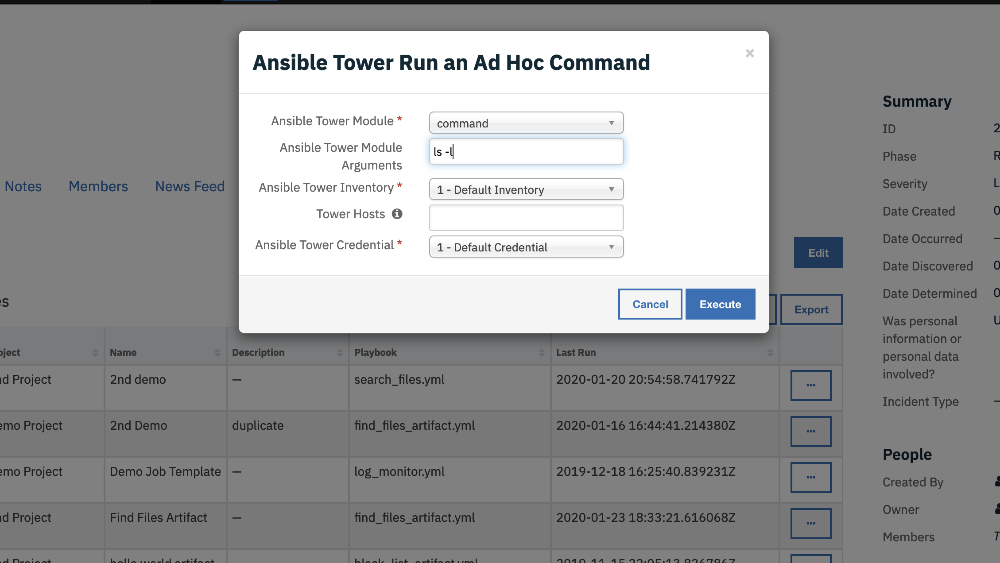
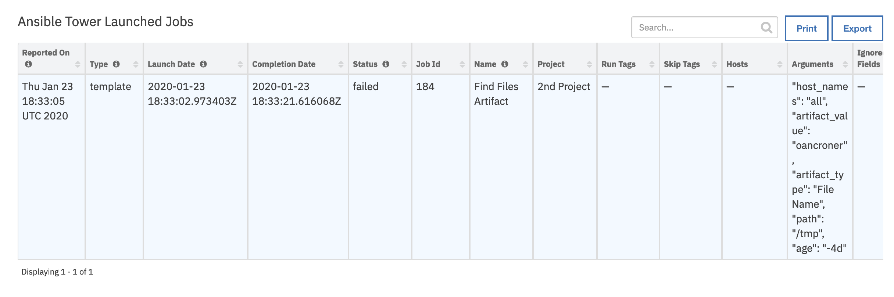
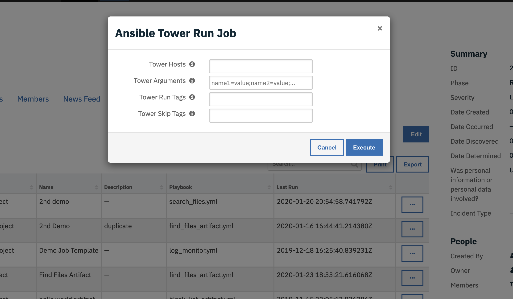
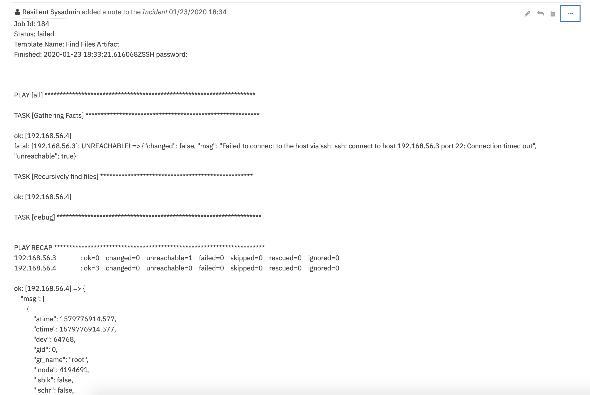
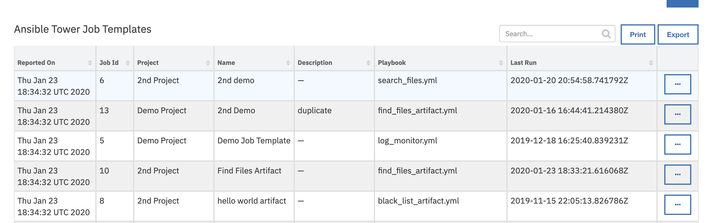

<!--
  This User README.md is generated by running:
  "resilient-sdk docgen -p fn_ansible_tower --only-user-guide"

  It is best edited using a Text Editor with a Markdown Previewer. VS Code
  is a good example. Checkout https://guides.github.com/features/mastering-markdown/
  for tips on writing with Markdown

  If you make manual edits and run docgen again, a .bak file will be created

  Store any screenshots in the "doc/screenshots" directory and reference them like:
  
-->

# **User Guide:** fn_ansible_tower_v1.0.0

## Table of Contents
- [Key Features](#key-features)
- [Function - Ansible Tower Run an Ad Hoc Command](#function---ansible-tower-run-an-ad-hoc-command)
- [Function - Ansible Tower List Jobs](#function---ansible-tower-list-jobs)
- [Function - Ansible Tower Run Job](#function---ansible-tower-run-job)
- [Function - Ansible Tower Get Job Results](#function---ansible-tower-get-job-results)
- [Function - Ansible Tower List Job Templates](#function---ansible-tower-list-job-templates)
- [Function - Ansible Tower Get Ad Hoc Command Results](#function---ansible-tower-get-ad-hoc-command-results)
- [Data Table - Ansible Tower Launched Jobs](#data-table---ansible-tower-launched-jobs)
- [Data Table - Ansible Tower Job Templates](#data-table---ansible-tower-job-templates)
- [Rules](#rules)

---

## Key Features
<!--
  List the Key Features of the Integration
-->
* List Job Templates filtering by Project and Template name
* Execute Job Templates, specifying name/value pairs for job template substitution
* Execute ad-hoc Jobs, specifying name/value pairs for module parameters
* List Jobs run filtered by status or date
* Return Job run results

---

See the Installation guide in this package for instructions on how to install, import into Resilient and customize your layouts.

---

## Function - Ansible Tower Run an Ad Hoc Command
This function allows one to run an ad hoc command. An ad hoc command is an Ansible module.

 

<details><summary>Inputs:</summary>
<p>Edit the Rule's activity field for tower_modules to tailor to your organization's list of modules exposed.
</p>
<p>

| Name | Type | Required | Example | Tooltip |
| ---- | :--: | :------: | ------- | ------- |
| `tower_arguments` | `text` | No | `name1=value;name2=value` | Semicolon separated name/value pairs |
| `tower_credential` | `number` | Yes | `-` | id of credential to use |
| `tower_hosts` | `text` | No | `-` | comma separated list of hosts to limit  |
| `tower_inventory` | `number` | No | `-` | id of inventory to use |
| `tower_module` | `select` | No | `-` | tower module as custom setup within Resilient |

</p>
</details>

<details><summary>Outputs:</summary>
<p>
Results are displayed in the Ansible Tower Launched Jobs datatable.
</p>
</details>

<details><summary>Example Pre-Process Script:</summary>
<p>

```python
inputs.tower_module = rule.properties.ansible_tower_module
inputs.tower_arguments = rule.properties.ansible_tower_module_arguments
inputs.tower_hosts = rule.properties.ansible_tower_hosts

inventory = rule.properties.ansible_tower_inventory
if inventory.find('-') != -1:
  inv_split = inventory.split("-")
else:
  inv_split = inventory.split(" ")
inputs.tower_inventory = int(inv_split[0])

credential = rule.properties.ansible_tower_credential
if credential.find('-') != -1:
  cred_split = credential.split("-")
else:
  cred_split = credential.split(" ")
inputs.tower_credential = int(cred_split[0])
```

</p>
</details>

<details><summary>Example Post-Process Script:</summary>
<p>

```python
import java.util.Date as Date

if not results.content['failed']:
  run_row = incident.addRow('ansible_tower_launched_jobs')
  
  run_row["reported_on"] = str(Date())
  run_row['type'] = 'ad hoc'
  run_row['launch_date'] = results.content['created'].replace('T', ' ')
  run_row['status'] = results.content['status']
  run_row['job_id'] = results.content['id']
  run_row['template_name'] = results.content['name']
  #run_row['project'] = results.content['summary_fields']['project']['name']
  #run_row['run_tags'] = results.content['job_tags']
  #run_row['skip_tags'] = results.content['skip_tags']
  run_row['inventory'] = results.content['limit']
  run_row['arguments'] = str(results.content['module_args']).replace("{", "").replace("}", "")
  #run_row['ignored_fields'] = str(results.content['ignored_fields'])
```

</p>
</details>

---
## Function - Ansible Tower List Jobs
List jobs based on job status and last modified conditions.

 

<details><summary>Inputs:</summary>
<p>

| Name | Type | Required | Example | Tooltip |
| ---- | :--: | :------: | ------- | ------- |
| `tower_job_status` | `multiselect` | No | `-` | Leave empty for all status values |
| `tower_last_updated` | `select` | No | `-` | specify timeframe to filter returned jobs |

</p>
</details>

<details><summary>Outputs:</summary>
<p>
Results are displayed in the Ansible Tower List Templates datatable.
</p>
</details>

<details><summary>Example Pre-Process Script:</summary>
<p>

```python
inputs.tower_job_status = rule.properties.job_status
inputs.tower_last_updated = rule.properties.last_updated
```

</p>
</details>

<details><summary>Example Post-Process Script:</summary>
<p>

```python
import java.util.Date as Date
for job in results.content:
  run_row = incident.addRow('ansible_tower_launched_jobs')
  
  run_row['reported_on'] = str(Date())
  run_row['type'] = 'template'
  run_row['launch_date'] = job['created'].replace('T', ' ')
  run_row['status'] = job['status']
  run_row['job_id'] = job['id']
  run_row['template_name'] = job['name']
  run_row['project'] = job['summary_fields']['project']['name']
  run_row['run_tags'] = job['job_tags']
  run_row['skip_tags'] = job['skip_tags']
  run_row['inventory'] = job['limit']
  run_row['arguments'] = job['extra_vars'].replace("{", "").replace("}", "")
  #run_row['ignored_fields'] = str(job['ignored_fields'])
```

</p>
</details>

---
## Function - Ansible Tower Run Job
Execute a job for a given job template.

 

<details><summary>Inputs:</summary>
<p>

| Name | Type | Required | Example | Tooltip |
| ---- | :--: | :------: | ------- | ------- |
| `tower_arguments` | `text` | No | `name1=value;name2=value` | Semicolon separated name/value pairs |
| `tower_hosts` | `text` | No | `-` | comma separated list of hosts to limit  |
| `tower_run_tags` | `text` | No | `-` | Comma separated list of plays to run |
| `tower_skip_tags` | `text` | No | `-` | Comma separated list of plays to skip |
| `tower_template_id` | `number` | No | `-` | Job Template Id to launch |
| `tower_template_name` | `text` | No | `-` | Name of Job Template, optional to tower_template_id |

</p>
<p>
<ul>
<li>
When executing a job template from an artifact, two additional arguments are added to the tower_arguments: artifact_type and artifact_value. Use these arguments in your playbooks as needed.
</li>
<li>Specify either template name or template id.</li>
<li>Template names are case sensitive</li>
<ul>
</p>
</details>

<details><summary>Outputs:</summary>
<p>
Results are displayed in the Ansible Tower Launched Jobs datatable.
</p>
</details>

<details><summary>Example Pre-Process Script:</summary>
<p>

```python
inputs.tower_template_name = rule.properties.ansible_tower_job_name
inputs.tower_hosts = rule.properties.ansible_tower_hosts
artifact_data = "artifact_value={};artifact_type={}".format(artifact.value, artifact.type)
if rule.properties.ansible_tower_arguments:
  inputs.tower_arguments = ";".join((rule.properties.ansible_tower_arguments, artifact_data))
else:
  inputs.tower_arguments = artifact_data
inputs.tower_run_tags = rule.properties.ansible_tower_run_tags
inputs.tower_skip_tags = rule.properties.ansible_tower_skip_tags
```

</p>
</details>

<details><summary>Example Post-Process Script:</summary>
<p>

```python
import java.util.Date as Date
if not results.content['failed']:
  run_row = incident.addRow('ansible_tower_launched_jobs')
  
  run_row['reported_on'] = str(Date())
  run_row['type'] = 'template'
  run_row['launch_date'] = results.content['created'].replace('T', ' ')
  run_row['status'] = results.content['status']
  if results.content['job']:
    run_row['job_id'] = results.content['job']
  else:
    run_row['job_id'] = results.content['id']
  run_row['template_name'] = results.content['name']
  if results.content['summary_fields'].get('project'):
    run_row['project'] = results.content['summary_fields']['project']['name']
  run_row['run_tags'] = results.content['job_tags']
  run_row['skip_tags'] = results.content['skip_tags']
  run_row['inventory'] = results.content['limit']
  run_row['arguments'] = str(results.content['extra_vars']).replace("{", "").replace("}", "")
  run_row['ignored_fields'] = str(results.content['ignored_fields']).replace("{", "").replace("}", "")
```

</p>
</details>

---
## Function - Ansible Tower Get Job Results
Get the results of a running or completed job.

 

<details><summary>Inputs:</summary>
<p>

| Name | Type | Required | Example | Tooltip |
| ---- | :--: | :------: | ------- | ------- |
| `incident_id` | `number` | Yes | `-` | - |
| `tower_job_id` | `number` | Yes | `-` | Launched job Id for a job template |
| `tower_save_as` | `text` | Yes | 'attachment' | either save as a note or an attachment |

</p>
<p>Use tower_save_as `attachment` when the results are expected to be large, such as when many hosts are returning results.
</p>
</details>

<details><summary>Outputs:</summary>
<p>
Results returned as either a note or an attachment.
</p>
</details>

<details><summary>Example Pre-Process Script:</summary>
<p>

```python
inputs.tower_job_id = row['job_id']
inputs.tower_save_as_attachment = rule.properties.save_results_as_attachment
inputs.incident_id = incident.id
```

</p>
</details>

<details><summary>Example Post-Process Script:</summary>
<p>

```python
import re

if results.content:
  finished = results.content['summary']['finished'].replace('T', ' ') if results.content['summary']['finished'] else None
  
  row['status'] = results.content['summary']['status']
  row['completion_date'] = finished
  
  note = u"Job Id: {}\nStatus: {}\nTemplate Name: {}\nFinished: {}".format(results.inputs['tower_job_id'], results.content['summary']['status'],
                                                                           results.content['summary']['name'], finished)
  if not results.inputs['tower_save_as_attachment']:
    note = note + u"\n".join(event.get("stdout") for event in results.content['events']['results'])
    incident.addNote(re.sub(r'[\x00-\x7f]\[[0-9;]*m', r'', note)) # remove color hilighting
  else:
    attachment_name = u"{}_{}.txt".format(results.content['summary']['name'].replace(" ", "_"), results.inputs['tower_job_id'])
    note = note + u"\nAttachment Name: {}".format(attachment_name)
    incident.addNote(note)

```

</p>
</details>

---
## Function - Ansible Tower List Job Templates
List available job templates by project or template name search.

 

<details><summary>Inputs:</summary>
<p>

| Name | Type | Required | Example | Tooltip |
| ---- | :--: | :------: | ------- | ------- |
| `tower_project` | `text` | No | `-` | Optionally filter by project. Use * for wildcard matching. |
| `tower_template_pattern` | `text` | No | `-` | Optionally filter by project. se * for wildcard matching. |

</p>
<ul>
<li>
Use * to indicate wildcard searches
</li>
<li>Template names are case sensitive</li>
<ul>
</details>

<details><summary>Outputs:</summary>
<p>
Results are displayed in the Ansible Tower Job Templates datatable.
</p>
</details>

<details><summary>Example Pre-Process Script:</summary>
<p>

```python
inputs.tower_project = rule.properties.tower_project
inputs.tower_template_pattern = rule.properties.tower_template_pattern
```

</p>
</details>

<details><summary>Example Post-Process Script:</summary>
<p>

```python
import java.util.Date as Date
if not results.content:
  row = incident.addRow("ansible_tower_job_templates")
  row['reported_on'] = str(Date())
  row['template_name'] = "-- No results returned --"
else:
  for template in results.content:
    row = incident.addRow("ansible_tower_job_templates")
    row['reported_on'] = str(Date())
    row['template_id'] = template['id']
    row['template_name'] = template['name']
    row['template_description'] = template['description']
    row['template_project'] = template['summary_fields']['project']['name']
    row['template_playbook'] = template['playbook']
    row['template_last_run'] = template['last_job_run'].replace('T', ' ') if template['last_job_run'] else None
```

</p>
</details>

---
## Function - Ansible Tower Get Ad Hoc Command Results
Return the results of an ad hoc command job.


<details><summary>Inputs:</summary>
<p>

| Name | Type | Required | Example | Tooltip |
| ---- | :--: | :------: | ------- | ------- |
| `incident_id` | `number` | Yes | `-` | - |
| `tower_job_id` | `number` | Yes | `-` | Launched job Id for a job template |
| `tower_save_as` | `text` | Yes | `note` | either save as a note or an attachment |

</p>
<p>Use tower_save_as `attachment` when the results are expected to be large, such as when many hosts are returning results.
</p>
</details>

<details><summary>Outputs:</summary>
<p>
Results returned as either a note or an attachment.
</p>
</details>

<details><summary>Example Pre-Process Script:</summary>
<p>

```python
inputs.tower_job_id = row['job_id']
inputs.tower_save_as_attachment = rule.properties.save_results_as_attachment
inputs.incident_id = incident.id
```

</p>
</details>

<details><summary>Example Post-Process Script:</summary>
<p>

```python
import re

if results.content:
  finished = results.content['summary']['finished'].replace('T', ' ') if results.content['summary']['finished'] else None
  
  row['status'] = results.content['summary']['status']
  row['completion_date'] = finished
  
  note = u"Job Id: {}\nStatus: {}\nTemplate Name: {}\nFinished: {}".format(results.inputs['tower_job_id'], results.content['summary']['status'],
                                                                           results.content['summary']['name'], finished)
  if not results.inputs['tower_save_as_attachment']:
    note = note + u"\n".join(event.get("stdout") for event in results.content['events']['results'])
    incident.addNote(re.sub(r'[\x00-\x7f]\[[0-9;]*m', r'', note)) # remove color hilighting
  else:
    attachment_name = u"{}_{}.txt".format(results.content['summary']['name'].replace(" ", "_"), results.inputs['tower_job_id'])
    note = note + u"\nAttachment Name: {}".format(attachment_name)
    incident.addNote(note)

```

</p>
</details>

---

## Data Table - Ansible Tower Launched Jobs

 

#### API Name:
ansible_tower_launched_jobs

#### Columns:
| Column Name | API Access Name | Type | Tooltip |
| ----------- | --------------- | ---- | ------- |
| Reported On | `reported_on` | `text` | Date row was added |
| Type | `type` | `text` | 'ad hoc', 'template' |
| Launch Date | `launch_date` | `text` | Date job was created |
| Completion Date | `completion_date` | `text` | Date job completed |
| Status | `status` | `text` | Status of Job |
| Job Id | `job_id` | `number` | job id returned |
| Name | `template_name` | `text` | Job Template Name |
| Project | `project` | `text` | Project of Job Template |
| Run Tags | `run_tags` | `text` | tags used when job launched |
| Skip Tags | `skip_tags` | `text` | tags used when job launched |
| Hosts | `inventory` | `text` | hosts specified when job launched |
| Ignored Fields | `ignored_fields` | `text` | Returned from Ansible Tower if no match in Job Template |
| Arguments | `arguments` | `text` | Arguments for job template substitution |

---
## Data Table - Ansible Tower Job Templates

 

#### API Name:
ansible_tower_job_templates

#### Columns:
| Column Name | API Access Name | Type | Tooltip |
| ----------- | --------------- | ---- | ------- |
| Reported On | `reported_on` | `text` | - |
| Job Id | `template_id` | `number` | - |
| Project | `template_project` | `text` | - |
| Name | `template_name` | `text` | - |
| Description | `template_description` | `text` | - |
| Playbook | `template_playbook` | `text` | - |
| Last Run | `template_last_run` | `text` | - |
---


## Rules
| Rule Name | Object | Workflow Triggered |
| --------- | ------ | ------------------ |
| Ansible Tower Get Job Results | ansible_tower_launched_jobs | `ansible_tower_get_job_results` |
| Ansible Tower Run Job | ansible_tower_job_templates | `ansible_tower_launch_job_template` |
| Ansible Tower Run an Ad Hoc Command | incident | `ansible_tower_run_an_ad_hoc_command` |
| Ansible Tower Run Job - Artifact | artifact | `ansible_tower_run_job__artifact` |
| Ansible Tower Run Job - Incident | incident | `ansible_tower_run_job__incident` |
| Ansible Tower List Jobs | incident | `ansible_tower_list_jobs` |
| Ansible Tower Get Ad Hoc Command Results | ansible_tower_launched_jobs | `ansible_tower_get_ad_hoc_command_results` |
| Ansible Tower List Job Templates | incident | `ansible_tower_list_job_templates` |

---

<!--
## Inform Resilient Users
  Use this section to optionally provide additional information so that Resilient playbook 
  designer can get the maximum benefit of your integration.
-->