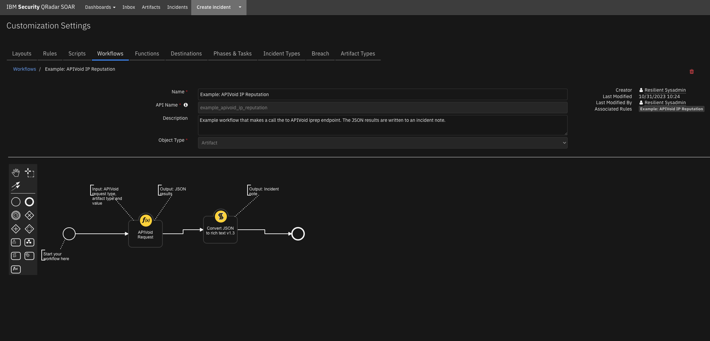
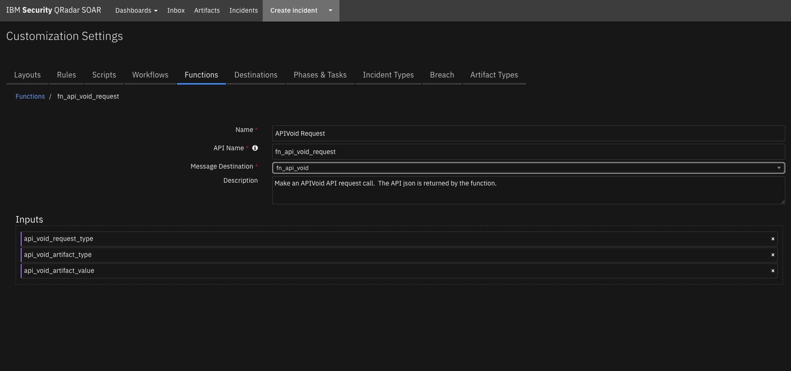

<!--
  This README.md is generated by running:
  "resilient-sdk docgen -p fn_api_void"

  It is best edited using a Text Editor with a Markdown Previewer. VS Code
  is a good example. Checkout https://guides.github.com/features/mastering-markdown/
  for tips on writing with Markdown

  If you make manual edits and run docgen again, a .bak file will be created

  Store any screenshots in the "doc/screenshots" directory and reference them like:
  

  NOTE: If your app is available in the container-format only, there is no need to mention the integration server in this readme.
-->

# APIVoid Threat Analysis APIs

## Table of Contents
- [Release Notes](#release-notes)
- [Overview](#overview)
  - [Key Features](#key-features)
- [Requirements](#requirements)
  - [Resilient platform](#resilient-platform)
  - [Cloud Pak for Security](#cloud-pak-for-security)
  - [Proxy Server](#proxy-server)
- [Installation](#installation)
  - [Install](#install)
  - [App Configuration](#app-configuration)
- [Function - APIVoid Request](#function---apivoid-request)
- [Script - Convert JSON to rich text v1.1](#script---convert-json-to-rich-text-v11)
- [Rules](#rules)
- [Troubleshooting & Support](#troubleshooting--support)
---

## Release Notes
<!--
  Specify all changes in this release. Do not remove the release 
  notes of a previous release
-->
| Version | Date | Notes |
| ------- | ---- | ----- |
| 1.0.0 | 12/2020 | Initial Release |

---

## Overview
<!--
  Provide a high-level description of the function itself and its remote software or application.
  The text below is parsed from the "description" and "long_description" attributes in the setup.py file
-->
**A Resilient Function to integrate with the APIVoid API**

 

Provides APIVoid's threat intelligence to enrich Resilient artifacts

### Key Features
<!--
  List the Key Features of the Integration
-->
Included in this package are:
* A function which makes APIVoid API calls and returns threat intelligence information in JSON-format.  The APIVoid Request function supports the following APIVoid API request types:
  * IP Reputation (iprep)
  * Domain Reputation (domainbl)
  * DNS Lookup (dnslookup)
  * Email Verify (emailverify)
  * ThreatLog (threatlog)
  * SSL Info (sslinfo)
  * URL Reputation (urlrep)
* 7 example workflows and 7 example rules which demonstrate how to call each supported APIVoid endpoint. 
* The JSON results of the function are written to an incident note by the workflows.

---

## Requirements
<!--
  List any Requirements 
-->
This app supports the IBM Resilient SOAR Platform and the IBM Cloud Pak for Security.

### Resilient platform
The Resilient platform supports two app deployment mechanisms, App Host and integration server.

If deploying to a Resilient platform with an App Host, the requirements are:
* Resilient platform >= `36.0.5634`.
* The app is in a container-based format (available from the AppExchange as a `zip` file).

If deploying to a Resilient platform with an integration server, the requirements are:
* Resilient platform >= `36.0.5634`.
* The app is in the older integration format (available from the AppExchange as a `zip` file which contains a `tar.gz` file).
* Integration server is running `resilient_circuits>=30.0.0`.
* If using an API key account, make sure the account provides the following minimum permissions: 
  | Name | Permissions |
  | ---- | ----------- |
  | Org Data | Read |
  | Function | Read |

The following Resilient platform guides provide additional information: 
* _App Host Deployment Guide_: provides installation, configuration, and troubleshooting information, including proxy server settings. 
* _Integration Server Guide_: provides installation, configuration, and troubleshooting information, including proxy server settings.
* _System Administrator Guide_: provides the procedure to install, configure and deploy apps. 

The above guides are available on the IBM Knowledge Center at [ibm.biz/resilient-docs](https://ibm.biz/resilient-docs). On this web page, select your Resilient platform version. On the follow-on page, you can find the _App Host Deployment Guide_ or _Integration Server Guide_ by expanding **Resilient Apps** in the Table of Contents pane. The System Administrator Guide is available by expanding **System Administrator**.

### Cloud Pak for Security
If you are deploying to IBM Cloud Pak for Security, the requirements are:
* IBM Cloud Pak for Security >= 1.4.
* Cloud Pak is configured with an App Host.
* The app is in a container-based format (available from the AppExchange as a `zip` file).

The following Cloud Pak guides provide additional information: 
* _App Host Deployment Guide_: provides installation, configuration, and troubleshooting information, including proxy server settings. From the Table of Contents, select Case Management and Orchestration & Automation > **Orchestration and Automation Apps**.
* _System Administrator Guide_: provides information to install, configure, and deploy apps. From the IBM Cloud Pak for Security Knowledge Center table of contents, select Case Management and Orchestration & Automation > **System administrator**.

These guides are available on the IBM Knowledge Center at [ibm.biz/cp4s-docs](https://ibm.biz/cp4s-docs). From this web page, select your IBM Cloud Pak for Security version. From the version-specific Knowledge Center page, select Case Management and Orchestration & Automation.

### Proxy Server
The app does support a proxy server.

---

## Installation

### Install
* To install or uninstall an App or Integration on the _Resilient platform_, see the documentation at [ibm.biz/resilient-docs](https://ibm.biz/resilient-docs).
* To install or uninstall an App on _IBM Cloud Pak for Security_, see the documentation at [ibm.biz/cp4s-docs](https://ibm.biz/cp4s-docs) and follow the instructions above to navigate to Orchestration and Automation.

### App Configuration
The following table provides the settings you need to configure the app. These settings are made in the app.config file. See the documentation discussed in the Requirements section for the procedure.

| Config | Required | Example | Description |
| ------ | :------: | ------- | ----------- |
| **apivoid_base_url** | Yes | `https://endpoint.apivoid.com` | *APIVoid API base URL.* |
| **apivoid_sub_url** | Yes | `v1/pay-as-you-go/` | *APIVoid API sub-url.* |
| **apivoid_api_key** | Yes | `<your-api-key>` | *APIVoid API Key.* |


---

## Function - APIVoid Request
Make an APIVoid API request call.  The API json is returned by the function.

 

<details><summary>Inputs:</summary>
<p>

| Name | Type | Required | Example | Tooltip |
| ---- | :--: | :------: | ------- | ------- |
| `api_void_artifact_type` | `text` | Yes | `URL` | - |
| `api_void_artifact_value` | `text` | Yes | `https://example.com` | - |
| `api_void_request_type` | `select` | Yes | `URL Reputation` | - |

<p>
Supported APIVoid request types included in the app are:
* 

</p>
</details>

<details><summary>Outputs:</summary>
<p>

```python
results = {
   {'version': '1.0', 
   'success': True, 
   'reason': None, 
   'content': {'data': {'report': {'dns_records': {'ns': {'records': [{'target': 'ns3.google.com', 'ip': '216.239.36.10', 'country_code': 'US', 'country_name': 'United States of America', 'isp': 'Google LLC'}, {'target': 'ns2.google.com', 'ip': '216.239.34.10', 'country_code': 'US', 'country_name': 'United States of America', 'isp': 'Google LLC'}, {'target': 'ns1.google.com', 'ip': '216.239.32.10', 'country_code': 'US', 'country_name': 'United States of America', 'isp': 'Google LLC'}, {'target': 'ns4.google.com', 'ip': '216.239.38.10', 'country_code': 'US', 'country_name': 'United States of America', 'isp': 'Google LLC'}]}, 'mx': {'records': [{'target': 'aspmx.l.google.com', 'ip': '173.194.216.27', 'country_code': 'US', 'country_name': 'United States of America', 'isp': 'Google LLC'}, {'target': 'alt1.aspmx.l.google.com', 'ip': '209.85.202.26', 'country_code': 'US', 'country_name': 'United States of America', 'isp': 'Google LLC'}, {'target': 'alt3.aspmx.l.google.com', 'ip': '172.217.218.27', 'country_code': 'US', 'country_name': 'United States of America', 'isp': 'Google LLC'}, {'target': 'alt4.aspmx.l.google.com', 'ip': '209.85.233.26', 'country_code': 'US', 'country_name': 'United States of America', 'isp': 'Google LLC'}, {'target': 'alt2.aspmx.l.google.com', 'ip': '66.102.1.27', 'country_code': 'US', 'country_name': 'United States of America', 'isp': 'Google LLC'}]}}, 'domain_blacklist': {'engines': [{'name': 'SpamhausDBL', 'reference': 'https://www.spamhaus.org/lookup/', 'detected': False}, {'name': 'ThreatLog', 'reference': 'https://www.threatlog.com/', 'detected': False}, {'name': 'OpenPhish', 'reference': 'https://www.openphish.com/', 'detected': False}, {'name': 'PhishTank', 'reference': 'https://www.phishtank.com/', 'detected': False}, {'name': 'Phishing.Database', 'reference': 'https://github.com/mitchellkrogza/Phishing.Database', 'detected': False}, {'name': 'PhishStats', 'reference': 'https://phishstats.info/', 'detected': False}, {'name': 'URLVir', 'reference': 'https://www.urlvir.com/', 'detected': False}, {'name': 'URLhaus', 'reference': 'https://urlhaus.abuse.ch/', 'detected': False}, {'name': 'RPiList Not Serious', 'reference': 'https://github.com/RPiList/specials', 'detected': False}, {'name': 'precisionsec', 'reference': 'https://precisionsec.com/', 'detected': False}, {'name': 'AntiSocial Blacklist', 'reference': 'https://theantisocialengineer.com/', 'detected': False}, {'name': 'PhishFeed', 'reference': 'https://phishfeed.com/', 'detected': False}, {'name': 'Spam404', 'reference': 'https://www.spam404.com/', 'detected': False}, {'name': 'CRDF', 'reference': 'https://threatcenter.crdf.fr/check.html', 'detected': False}, {'name': 'Artists Against 419', 'reference': 'http://wiki.aa419.org/index.php/Main_Page', 'detected': False}], 'detections': 0}, 'file_type': {'signature': '', 'extension': '', 'headers': 'HTML'}, 'geo_location': {'countries': ['US']}, 'html_forms': {'number_of_total_forms': 0, 'number_of_total_input_fields': 0, 'two_text_inputs_in_a_form': False, 'credit_card_field_present': False, 'password_field_present': False, 'email_field_present': False}, 'redirection': {'found': True, 'external': False, 'url': 'https://www.google.com/'}, 'response_headers': {'code': 301, 'status': 'HTTP/1.1 301 Moved Permanently', 'location': 'https://www.google.com/', 'content-type': 'text/html; charset=UTF-8', 'date': 'Tue, 22 Dec 2020 18:24:33 GMT', 'expires': 'Thu, 21 Jan 2021 18:24:33 GMT', 'cache-control': 'public, max-age=2592000', 'server': 'gws', 'content-length': '220', 'x-xss-protection': '0', 'x-frame-options': 'SAMEORIGIN'}, 'risk_score': {'result': 0}, 'security_checks': {'is_host_an_ipv4': False, 'is_suspicious_url_pattern': False, 'is_suspicious_file_extension': False, 'is_robots_noindex': False, 'is_suspended_page': False, 'is_most_abused_tld': False, 'is_uncommon_clickable_url': False, 'is_phishing_heuristic': False, 'is_possible_emotet': False, 'is_suspicious_content': False, 'is_empty_page_title': False, 'is_empty_page_content': False, 'is_domain_blacklisted': False, 'is_suspicious_domain': False, 'is_sinkholed_domain': False, 'is_defaced_heuristic': False, 'is_masked_file': False, 'is_risky_geo_location': False, 'is_china_country': False, 'is_non_standard_port': False, 'is_email_address_on_url_query': False, 'is_directory_listing': False, 'is_exe_on_directory_listing': False, 'is_zip_on_directory_listing': False, 'is_php_on_directory_listing': False, 'is_doc_on_directory_listing': False, 'is_pdf_on_directory_listing': False, 'is_linux_elf_file': False, 'is_linux_elf_file_on_free_dynamic_dns': False, 'is_linux_elf_file_on_free_hosting': False, 'is_linux_elf_file_on_ipv4': False, 'is_masked_linux_elf_file': False, 'is_masked_windows_exe_file': False, 'is_ms_office_file': False, 'is_windows_exe_file_on_free_dynamic_dns': False, 'is_windows_exe_file_on_free_hosting': False, 'is_windows_exe_file_on_ipv4': False, 'is_windows_exe_file': False, 'is_external_redirect': False, 'is_credit_card_field': False, 'is_password_field': False, 'is_valid_https': True}, 'server_details': {'ip': '173.194.216.138', 'hostname': 'vu-in-f138.1e100.net', 'continent_code': 'NA', 'continent_name': 'North America', 'country_code': 'US', 'country_name': 'United States of America', 'region_name': 'California', 'city_name': 'Mountain View', 'latitude': 37.40599060058594, 'longitude': -122.0785140991211, 'isp': 'Google LLC'}, 'site_category': {'is_torrent': False, 'is_vpn_provider': False, 'is_free_hosting': False, 'is_anonymizer': False, 'is_url_shortener': False, 'is_free_dynamic_dns': False}, 'url_parts': {'scheme': 'https', 'host': 'google.com', 'host_nowww': 'google.com', 'port': None, 'path': None, 'query': None}, 'web_page': {'title': '301 Moved', 'description': '', 'keywords': ''}}}, 'credits_remained': 17.82, 'estimated_queries': '35', 'elapsed_time': '0.14', 'success': True}, 'raw': '{"data": {"report": {"dns_records": {"ns": {"records": [{"target": "ns3.google.com", "ip": "216.239.36.10", "country_code": "US", "country_name": "United States of America", "isp": "Google LLC"}, {"target": "ns2.google.com", "ip": "216.239.34.10", "country_code": "US", "country_name": "United States of America", "isp": "Google LLC"}, {"target": "ns1.google.com", "ip": "216.239.32.10", "country_code": "US", "country_name": "United States of America", "isp": "Google LLC"}, {"target": "ns4.google.com", "ip": "216.239.38.10", "country_code": "US", "country_name": "United States of America", "isp": "Google LLC"}]}, "mx": {"records": [{"target": "aspmx.l.google.com", "ip": "173.194.216.27", "country_code": "US", "country_name": "United States of America", "isp": "Google LLC"}, {"target": "alt1.aspmx.l.google.com", "ip": "209.85.202.26", "country_code": "US", "country_name": "United States of America", "isp": "Google LLC"}, {"target": "alt3.aspmx.l.google.com", "ip": "172.217.218.27", "country_code": "US", "country_name": "United States of America", "isp": "Google LLC"}, {"target": "alt4.aspmx.l.google.com", "ip": "209.85.233.26", "country_code": "US", "country_name": "United States of America", "isp": "Google LLC"}, {"target": "alt2.aspmx.l.google.com", "ip": "66.102.1.27", "country_code": "US", "country_name": "United States of America", "isp": "Google LLC"}]}}, "domain_blacklist": {"engines": [{"name": "SpamhausDBL", "reference": "https://www.spamhaus.org/lookup/", "detected": false}, {"name": "ThreatLog", "reference": "https://www.threatlog.com/", "detected": false}, {"name": "OpenPhish", "reference": "https://www.openphish.com/", "detected": false}, {"name": "PhishTank", "reference": "https://www.phishtank.com/", "detected": false}, {"name": "Phishing.Database", "reference": "https://github.com/mitchellkrogza/Phishing.Database", "detected": false}, {"name": "PhishStats", "reference": "https://phishstats.info/", "detected": false}, {"name": "URLVir", "reference": "https://www.urlvir.com/", "detected": false}, {"name": "URLhaus", "reference": "https://urlhaus.abuse.ch/", "detected": false}, {"name": "RPiList Not Serious", "reference": "https://github.com/RPiList/specials", "detected": false}, {"name": "precisionsec", "reference": "https://precisionsec.com/", "detected": false}, {"name": "AntiSocial Blacklist", "reference": "https://theantisocialengineer.com/", "detected": false}, {"name": "PhishFeed", "reference": "https://phishfeed.com/", "detected": false}, {"name": "Spam404", "reference": "https://www.spam404.com/", "detected": false}, {"name": "CRDF", "reference": "https://threatcenter.crdf.fr/check.html", "detected": false}, {"name": "Artists Against 419", "reference": "http://wiki.aa419.org/index.php/Main_Page", "detected": false}], "detections": 0}, "file_type": {"signature": "", "extension": "", "headers": "HTML"}, "geo_location": {"countries": ["US"]}, "html_forms": {"number_of_total_forms": 0, "number_of_total_input_fields": 0, "two_text_inputs_in_a_form": false, "credit_card_field_present": false, "password_field_present": false, "email_field_present": false}, "redirection": {"found": true, "external": false, "url": "https://www.google.com/"}, "response_headers": {"code": 301, "status": "HTTP/1.1 301 Moved Permanently", "location": "https://www.google.com/", "content-type": "text/html; charset=UTF-8", "date": "Tue, 22 Dec 2020 18:24:33 GMT", "expires": "Thu, 21 Jan 2021 18:24:33 GMT", "cache-control": "public, max-age=2592000", "server": "gws", "content-length": "220", "x-xss-protection": "0", "x-frame-options": "SAMEORIGIN"}, "risk_score": {"result": 0}, "security_checks": {"is_host_an_ipv4": false, "is_suspicious_url_pattern": false, "is_suspicious_file_extension": false, "is_robots_noindex": false, "is_suspended_page": false, "is_most_abused_tld": false, "is_uncommon_clickable_url": false, "is_phishing_heuristic": false, "is_possible_emotet": false, "is_suspicious_content": false, "is_empty_page_title": false, "is_empty_page_content": false, "is_domain_blacklisted": false, "is_suspicious_domain": false, "is_sinkholed_domain": false, "is_defaced_heuristic": false, "is_masked_file": false, "is_risky_geo_location": false, "is_china_country": false, "is_non_standard_port": false, "is_email_address_on_url_query": false, "is_directory_listing": false, "is_exe_on_directory_listing": false, "is_zip_on_directory_listing": false, "is_php_on_directory_listing": false, "is_doc_on_directory_listing": false, "is_pdf_on_directory_listing": false, "is_linux_elf_file": false, "is_linux_elf_file_on_free_dynamic_dns": false, "is_linux_elf_file_on_free_hosting": false, "is_linux_elf_file_on_ipv4": false, "is_masked_linux_elf_file": false, "is_masked_windows_exe_file": false, "is_ms_office_file": false, "is_windows_exe_file_on_free_dynamic_dns": false, "is_windows_exe_file_on_free_hosting": false, "is_windows_exe_file_on_ipv4": false, "is_windows_exe_file": false, "is_external_redirect": false, "is_credit_card_field": false, "is_password_field": false, "is_valid_https": true}, "server_details": {"ip": "173.194.216.138", "hostname": "vu-in-f138.1e100.net", "continent_code": "NA", "continent_name": "North America", "country_code": "US", "country_name": "United States of America", "region_name": "California", "city_name": "Mountain View", "latitude": 37.40599060058594, "longitude": -122.0785140991211, "isp": "Google LLC"}, "site_category": {"is_torrent": false, "is_vpn_provider": false, "is_free_hosting": false, "is_anonymizer": false, "is_url_shortener": false, "is_free_dynamic_dns": false}, "url_parts": {"scheme": "https", "host": "google.com", "host_nowww": "google.com", "port": null, "path": null, "query": null}, "web_page": {"title": "301 Moved", "description": "", "keywords": ""}}}, "credits_remained": 17.82, "estimated_queries": "35", "elapsed_time": "0.14", "success": true}', 
   'inputs': {'api_void_request_type': {'id': 308, 'name': 'URL Reputation'}, 'api_void_artifact_type': 'URL', 'api_void_artifact_value': 'https://google.com'}, 'metrics': {'version': '1.0', 'package': 'fn-api-void', 'package_version': '1.0.0', 'host': 'local', 'execution_time_ms': 194345, 'timestamp': '2020-12-22 13:27:31'}
   }

}
```

</p>
</details>

<details><summary>Example Pre-Process Script:</summary>
<p>

```python
inputs.api_void_artifact_value = artifact.value
inputs.api_void_artifact_type = artifact.type
```

</p>
</details>

<details><summary>Example Post-Process Script:</summary>
<p>

```python
# Put the results json into a workflow property so we can call the 
# convert_json_to_rich_text script to print readable formatted json in an incident note.
inputs = results.get("inputs")
artifact_value = inputs.get("api_void_artifact_value")
header = u"APIVoid DNS Lookup: {0}".format(artifact_value)

json_note = {
              "version": "1.1",
              "header": header, 
              "json": results.content,
              "sort": False
            }

workflow.addProperty('convert_json_to_rich_text', json_note)

```

</p>
</details>

---

## Script - Convert JSON to rich text v1.1
This script converts a json object into a hierarchical display of rich text and adds the rich text to an incident's rich text (custom) field or an incident note. A workflow property is used to share the json to convert and identify parameters used on how to perform the conversion.

Typically, a function will create the workflow property 'convert_json_to_rich_text', and this script will run after that function to perform the conversion.

Features:
* Display the hierarchical nature of json, presenting the json keys (sorted if specified) as bold labels
* Provide links to found URLs
* Create either an incident note or add results to an incident (custom) rich text field.

**Object:** incident

<details><summary>Script Text:</summary>
<p>

```python
# (c) Copyright IBM Corp. 2010, 2020. All Rights Reserved.
VERSION = 1.1
"""
  This script converts a json object into a hierarchical display of rich text and adds the rich text to an incident's rich text (custom) field or an incident note.
  A workflow property is used to define the json to convert and identify parameters used on how to perform the conversion.
  Typically, a function will create workflow property and this script will run after that function to perform the conversion.
  Features:
    * Display the hierarchical nature of json, presenting the json keys as bold labels
    * Provide links to found URLs
    * Create either an incident note or add results to an incident (custom) rich text field.
  
  In order to use this script, define a workflow property called: convert_json_to_rich_text, to define the json and parameters to use for the conversion.
  Workflow properties can be added using a command similar to this:
  workflow.addProperty('convert_json_to_rich_text', {
    "version": 1.1,
    "header": "Artifact scan results for: {}".format(artifact.value),
    "padding": 10,
    "separator": u"<br />",
    "sort": True,
    "json": results.content,
    "json_omit_list": ["omit"],
    "incident_field": None
  })
  
  Format of workflow.property.convert_json_to_rich_text:
  { 
    "version": 1.1, [this is for future compatibility]
    "header": str, [header line to add to converted json produced or None. Ex: Results from scanning artifact: xxx. The header may contain rich text tags]
    "padding": 10, [padding for nested json elements, or defaults to 10]
    "separator": u"<br />"|list such as ['<span>','</span>'], [html separator between json keys and lists or defaults to html break: '<br />'. 
                                                If a list, then the data is brackets by the pair specified]
    "sort": True|False, [sort the json keys at each level when displayed]
    "json": json, [required json to convert]
    "json_omit_list": [list of json keys to exclude or None]
    "incident_field": "<incident_field>" [indicates a builtin rich text incident field, such as 'description' 
                                          or a custom rich text field in the format: 'properties.<field>'. default: create an incident note]
  }
"""

import re

# needed for python 3
try:
    unicode("abc")
except:
    unicode = str


rc = re.compile(r'http[s]?://(?:[a-zA-Z]|[0-9]|[$-_@.&+#\?]|[!*\(\),]|(?:%[0-9a-fA-F][0-9a-fA-F]))+')

class ConvertJson:
    """Class to hold the conversion parameters and perform the conversion"""

    def __init__(self, omit_keys=[], padding=10, separator=u"<br />", sort_keys=False):
        self.omit_keys = omit_keys
        self.padding = padding
        self.separator = separator
        self.sort_keys = sort_keys


    def format_link(self, item):
        """[summary]
          Find embedded urls (http(s)) and add html anchor tags to display as links
          Args:
              item ([string])

          Returns:
              [str]: None|original text if no links|text with html links
        """
        formatted_item = item
        if item and not isinstance(item, (int, bool, float)):
            list = rc.findall(item)
            if list:
                for link in list:
                    formatted_item = formatted_item.replace(link, u"<a target='blank' href='{0}'>{0}</a>".format(link))

        return formatted_item

    def expand_list(self, list_value, is_list=False):
        """[summary]
          convert items to html, adding indents to nested dictionaries.
          Args:
              list_value ([dict|list]): json element

          Returns:
              [str]: html converted code
        """
        if not isinstance(list_value, list):
            return self.format_link(list_value)
        elif not list_value:
            return u"None<br>"

        try:
            items_list = []  # this will ensure list starts on second line of key label
            for item in list_value:
                if isinstance(item, dict):
                    result = self.convert_json_to_rich_text(item)
                    if is_list:
                        items_list.append(u"<li>{}</li>".format(result))
                    else:
                        items_list.append(result)
                elif isinstance(item, list):
                    items_list.append(self.expand_list(item, is_list=True))
                elif is_list:
                    items_list.append(u"<li>{}</li>".format(self.format_link(unicode(item))))
                else:
                    items_list.append(self.format_link(unicode(item)))

            expand_list_result = self.add_separator(self.separator if not is_list else u"",
                                                    items_list,
                                                    is_list=is_list)

            if is_list:
                return u"<ul>{}</ul>".format(expand_list_result)
            else:
                return u"<div style='padding:5px'>{}</div>".format(expand_list_result)
        except Exception as err:
            return str(err)

    def convert_json_to_rich_text(self, sub_dict):
        """[summary]
          Walk dictionary tree and convert to html for better display
          Args:
              sub_dict ([type]): [description]

          Returns:
              [type]: [description]
        """
        notes = []
        if sub_dict:
            if isinstance(sub_dict, list):
                expanded_list = self.expand_list(sub_dict, is_list=True)
                notes.append(self.add_separator(self.separator, expanded_list))
            else:
                keys = sorted (sub_dict.keys()) if self.sort_keys else sub_dict.keys()

                for key in keys:
                    if key not in self.omit_keys:
                        value = sub_dict[key]
                        is_list = isinstance(value, list)
                        item_list = [u"<strong>{0}</strong>: ".format(key)]
                        if isinstance(value, dict):
                            convert_result = self.convert_json_to_rich_text(value)
                            if convert_result:
                                item_list.append(u"<div style='padding:{}px'>{}</div>".format(self.padding, convert_result))
                            else:
                                item_list.append(u"None<br>")
                        else:
                            item_list.append(self.expand_list(value, is_list=is_list))
                        notes.append(self.add_separator(self.separator, u"".join(unicode(v) for v in item_list), is_list=is_list))

        result_notes = u"".join(notes)
        if isinstance(self.separator, list):
            return result_notes
        else:
            return result_notes.replace(
                u"</div>{0}".format(self.separator), u"</div>").replace(
                u"{0}</div>".format(self.separator), u"</div>"
            )  # tighten up result

    def add_separator(self, separator, items, is_list=False):
        """
        apply the separator to the data
        :param separator: None, str or list such as ['<span>', '</span>']
        :param items: str or list to add separator
        :return: text with separator applied
        """
        _items = items

        if not _items:
            return "<br>"

        if not isinstance(_items, list):
            _items = [_items]

        if isinstance(separator, list):
            return u"".join([u"{}{}{}".format(separator[0], item, separator[1]) for item in _items])

        return u"{}{}".format(separator.join(_items), separator if not is_list else u"")

def get_properties(property_name):
    """
    Logic to collect the json and parameters from a workflow property.
    Args:
      property_name: workflow property to reference
    Returns:
      padding, separator, header, json_omit_list, incident_field, json, sort_keys
    """
    if not workflow.properties.get(property_name):
        helper.fail("workflow.properties.{} undefined".format(property_name))

    padding = int(workflow.properties[property_name].get("padding", 10))
    separator = workflow.properties[property_name].get("separator", u"<br />")
    if isinstance(separator, list) and len(separator) != 2:
        helper.fail("list of separators should be specified as a pair such as ['<div>', '</div>']: {}".format(separator))

    header = workflow.properties[property_name].get("header")
    json_omit_list = workflow.properties[property_name].get("json_omit_list")
    if not json_omit_list:
        json_omit_list = []
    incident_field = workflow.properties[property_name].get("incident_field")
    json = workflow.properties[property_name].get("json", {})
    if not isinstance(json, dict) and not isinstance(json, list):
        helper.fail("json element is not formatted correctly: {}".format(json))
    sort_keys = bool(workflow.properties[property_name].get("sort", False))

    return padding, separator, header, json_omit_list, incident_field, json, sort_keys


## S T A R T
if 'workflow' in globals():
    padding, separator, header, json_omit_list, incident_field, json, sort_keys = get_properties('convert_json_to_rich_text')

    if header:
        if isinstance(separator, list):
            hdr = u"{0}{1}{2}".format(separator[0], header, separator[1])
        else:
            hdr = u"{0}{1}".format(header, separator)
    else:
        hdr = u""

    convert = ConvertJson(omit_keys=json_omit_list, padding=padding, separator=separator, sort_keys=sort_keys)
    converted_json = convert.convert_json_to_rich_text(json)
    result = u"{}{}".format(hdr, converted_json if converted_json else "\nNone")

    rich_text_note = helper.createRichText(result)
    if incident_field:
        incident[incident_field] = rich_text_note
    else:
        incident.addNote(rich_text_note)

```

</p>
</details>

---


## Rules
| Rule Name | Object | Workflow Triggered |
| --------- | ------ | ------------------ |
| Example: APIVoid ThreatLog | artifact | `example_apivoid_threatlog` |
| Example: APIVoid DNS Lookup | artifact | `example_apivoid_dns_lookup` |
| Example: APIVoid IP Reputation | artifact | `example_apivoid_ip_reputation` |
| Example: APIVoid SSL Info | artifact | `example_apivoid_ssl_info` |
| Example: APIVoid Domain Reputation | artifact | `example_apivoid_domain_reputation` |
| Example: APIVoid Email Verify | artifact | `example_apivoid_email_verify` |
| Example: APIVoid URL Reputation | artifact | `example_apivoid_url_reputation` |

---

## Troubleshooting & Support
Refer to the documentation listed in the Requirements section for troubleshooting information.

### For Support
This is a IBM Community provided App. Please search the Community https://ibm.biz/resilientcommunity for assistance.
