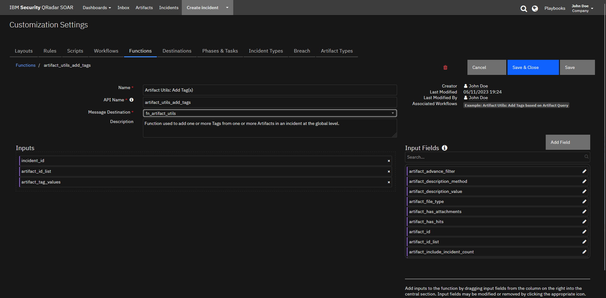
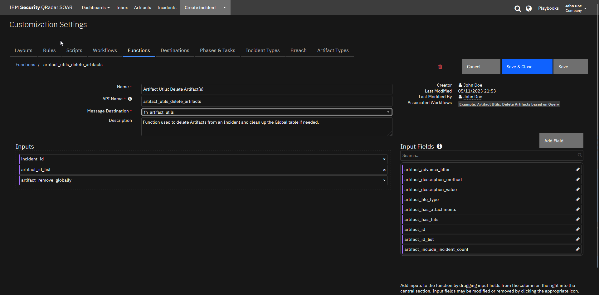
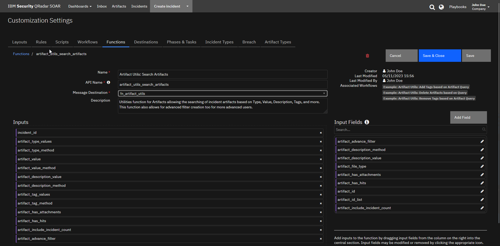

<!--
  This README.md is generated by running:
  "resilient-sdk docgen -p fn_artifact_utils"

  This file was generated with resilient-sdk v51.0.7.2.16540

  It is best edited using a Text Editor with a Markdown Previewer. VS Code
  is a good example. Checkout https://guides.github.com/features/mastering-markdown/
  for tips on writing with Markdown

  All fields followed by "::CHANGE_ME::"" should be manually edited

  If you make manual edits and run docgen again, a .bak file will be created

  Store any screenshots in the "doc/screenshots" directory and reference them like:
  

  NOTE: If your app is available in the container-format only, there is no need to mention the integration server in this readme.
-->

# Artifact Functions for SOAR


## Table of Contents
- [Release Notes](#release-notes)
- [Overview](#overview)
  - [Key Features](#key-features)
- [Requirements](#requirements)
  - [SOAR platform](#soar-platform)
  - [Cloud Pak for Security](#cloud-pak-for-security)
  - [Proxy Server](#proxy-server)
  - [Python Environment](#python-environment)
- [Installation](#installation)
  - [Install](#install)
  - [App Configuration](#app-configuration)
- [Function - Artifact Utils: Add Tag(s)](#function---artifact-utils-add-tags)
- [Function - Artifact Utils: Delete Artifact(s)](#function---artifact-utils-delete-artifacts)
- [Function - Artifact Utils: Remove Tag(s)](#function---artifact-utils-remove-tags)
- [Function - Artifact Utils: Search Artifacts](#function---artifact-utils-search-artifacts)
- [Rules](#rules)
- [Troubleshooting & Support](#troubleshooting--support)

---

## Release Notes
<!--
  Specify all changes in this release. Do not remove the release
  notes of a previous release
-->
| Version | Date | Notes |
| ------- | ---- | ----- |
| 1.0.1 | 12/2025 | Updated application to latest packages | 
| 1.0.0 | 05/2023 | Initial Release | 

---

## Overview
<!--
  Provide a high-level description of the function itself and its remote software or application.
  The text below is parsed from the "description" and "long_description" attributes in the setup.py file
-->
**Functions allowing interactions with Artifacts.**

 

This package contains 4 functions allowing you to interact with SOAR Artifacts for use with other automations.

### Key Features
<!--
  List the Key Features of the Integration
-->
* Searching for Artifacts 
* Add and Remove Tags 
* Deleting Artifacts 

---

## Requirements
<!--
  List any Requirements 
--> 
This app supports the IBM Security QRadar SOAR Platform and the IBM Security QRadar SOAR for IBM Cloud Pak for Security.

### SOAR platform
The SOAR platform supports two app deployment mechanisms, Edge Gateway (also known as App Host) and integration server.

If deploying to a SOAR platform with an App Host, the requirements are:
* SOAR platform >= `51.0.4.0.10288`.
* The app is in a container-based format (available from the AppExchange as a `zip` file).

If deploying to a SOAR platform with an integration server, the requirements are:
* SOAR platform >= `51.0.4.0.10288`.
* The app is in the older integration format (available from the AppExchange as a `zip` file which contains a `tar.gz` file).
* Integration server is running `resilient-circuits>=51.0.0`.
* If using an API key account, make sure the account provides the following minimum permissions:
  | Name | Permissions |
  | ---- | ----------- |
  | Org Data | Read |
  | Function | Read |
  | Incidents | Read |
  | Incident Fields | Edit |
  | Global Artifacts | View |
  | Global Artifacts | Create |
  | Global Artifacts | Edit |
  | Global Artifacts | Delete |

The following SOAR platform guides provide additional information:
* _Edge Gateway Deployment Guide_ or _App Host Deployment Guide_: provides installation, configuration, and troubleshooting information, including proxy server settings.
* _Integration Server Guide_: provides installation, configuration, and troubleshooting information, including proxy server settings.
* _System Administrator Guide_: provides the procedure to install, configure and deploy apps.

The above guides are available on the IBM Documentation website at [ibm.biz/soar-docs](https://ibm.biz/soar-docs). On this web page, select your SOAR platform version. On the follow-on page, you can find the _Edge Gateway Deployment Guide_, _App Host Deployment Guide_, or _Integration Server Guide_ by expanding **Apps** in the Table of Contents pane. The System Administrator Guide is available by expanding **System Administrator**.

### Cloud Pak for Security
If you are deploying to IBM Cloud Pak for Security, the requirements are:
* IBM Cloud Pak for Security >= `1.10.15`.
* Cloud Pak is configured with an Edge Gateway.
* The app is in a container-based format (available from the AppExchange as a `zip` file).

The following Cloud Pak guides provide additional information:
* _Edge Gateway Deployment Guide_ or _App Host Deployment Guide_: provides installation, configuration, and troubleshooting information, including proxy server settings. From the Table of Contents, select Case Management and Orchestration & Automation > **Orchestration and Automation Apps**.
* _System Administrator Guide_: provides information to install, configure, and deploy apps. From the IBM Cloud Pak for Security IBM Documentation table of contents, select Case Management and Orchestration & Automation > **System administrator**.

These guides are available on the IBM Documentation website at [ibm.biz/cp4s-docs](https://ibm.biz/cp4s-docs). From this web page, select your IBM Cloud Pak for Security version. From the version-specific IBM Documentation page, select Case Management and Orchestration & Automation.

### Proxy Server
The app **does** support a proxy server.

### Python Environment
Python 3.9, 3.11, and 3.12 are officially supported. When deployed as an app, the app runs on Python 3.11.
Additional package dependencies may exist for each of these packages:
* resilient-circuits>=51.0.0


---

## Installation

### Install
* To install or uninstall an App or Integration on the _SOAR platform_, see the documentation at [ibm.biz/soar-docs](https://ibm.biz/soar-docs).
* To install or uninstall an App on _IBM Cloud Pak for Security_, see the documentation at [ibm.biz/cp4s-docs](https://ibm.biz/cp4s-docs) and follow the instructions above to navigate to Orchestration and Automation.

### App Configuration
No configuration required for this integration.

---

## Function - Artifact Utils: Add Tag(s)
Function used to add one or more Tags from one or more Artifacts in an incident at the global level.

  

<details><summary>Inputs:</summary>
<p>

| Name | Type | Required | Example | Tooltip |
| ---- | :--: | :------: | ------- | ------- |
| `artifact_id_list` | `text` | Yes | `-` | Comma seperated list of Artifact IDs. |
| `artifact_tag_values` | `text` | No | `-` | Comma seperated list of tags. |
| `incident_id` | `number` | Yes | `-` | - |

</p>
</details>

<details><summary>Outputs:</summary>
<p>

> **NOTE:** This example might be in JSON format, but `results` is a Python Dictionary on the SOAR platform.
```python
results = {
  "content": {
    "537": {
      "created": 1683824680171,
      "creator": {
        "display_name": "John Doe",
        "id": 1,
        "name": "john_doe@company.com",
        "type": "user"
      },
      "description": null,
      "first_associated_time": 1683824680171,
      "first_related_inc_id": 2325,
      "first_related_inc_owner_handle": 33,
      "hit_threat_sources": [],
      "id": 537,
      "last_associated_time": 1683824680171,
      "last_modified_by": {
        "display_name": "AppBuilder",
        "id": 49,
        "name": "6bf8c47e-77a6-41ad-ad22-1004f7eee7cb",
        "type": "apikey"
      },
      "last_modified_time": 1683874565588,
      "last_related_inc_id": 2325,
      "last_related_inc_owner_handle": 33,
      "last_scan_hits": [],
      "perms": {
        "write": true
      },
      "properties": null,
      "related_incident_count": 1,
      "relating": true,
      "relating_incidents": true,
      "scan_option": "on",
      "summary": null,
      "tags": [
        {
          "tag_handle": 134,
          "value": null
        },
        {
          "tag_handle": 127,
          "value": null
        }
      ],
      "type": 1,
      "value": "10.10.10.10",
      "version": 14
    },
    "542": {
      "created": 1683873651813,
      "creator": {
        "display_name": "John Doe",
        "id": 1,
        "name": "john_doe@company.com",
        "type": "user"
      },
      "description": null,
      "first_associated_time": 1683873651813,
      "first_related_inc_id": 2325,
      "first_related_inc_owner_handle": 33,
      "hit_threat_sources": [],
      "id": 542,
      "last_associated_time": 1683873651813,
      "last_modified_by": {
        "display_name": "AppBuilder",
        "id": 49,
        "name": "6bf8c47e-77a6-41ad-ad22-1004f7eee7cb",
        "type": "apikey"
      },
      "last_modified_time": 1683874056253,
      "last_related_inc_id": 2325,
      "last_related_inc_owner_handle": 33,
      "last_scan_hits": [],
      "perms": {
        "write": true
      },
      "properties": null,
      "related_incident_count": 1,
      "relating": true,
      "relating_incidents": true,
      "scan_option": "on",
      "summary": null,
      "tags": [
        {
          "tag_handle": 134,
          "value": null
        },
        {
          "tag_handle": 127,
          "value": null
        }
      ],
      "type": 1,
      "value": "10.156.54.204",
      "version": 1
    },
    "543": {
      "created": 1683873651839,
      "creator": {
        "display_name": "John Doe",
        "id": 1,
        "name": "john_doe@company.com",
        "type": "user"
      },
      "description": null,
      "first_associated_time": 1683873651839,
      "first_related_inc_id": 2325,
      "first_related_inc_owner_handle": 33,
      "hit_threat_sources": [],
      "id": 543,
      "last_associated_time": 1683873651839,
      "last_modified_by": {
        "display_name": "AppBuilder",
        "id": 49,
        "name": "6bf8c47e-77a6-41ad-ad22-1004f7eee7cb",
        "type": "apikey"
      },
      "last_modified_time": 1683874055257,
      "last_related_inc_id": 2325,
      "last_related_inc_owner_handle": 33,
      "last_scan_hits": [],
      "perms": {
        "write": true
      },
      "properties": null,
      "related_incident_count": 1,
      "relating": true,
      "relating_incidents": true,
      "scan_option": "on",
      "summary": null,
      "tags": [
        {
          "tag_handle": 134,
          "value": null
        },
        {
          "tag_handle": 127,
          "value": null
        }
      ],
      "type": 1,
      "value": "10.16.157.4",
      "version": 1
    }
  },
  "inputs": {
    "artifact_id_list": "1532,1538,1539",
    "artifact_tag_values": "Malicious,Internal",
    "incident_id": 2325
  },
  "metrics": {
    "execution_time_ms": 4170,
    "host": "IBM-PF36KPAV",
    "package": "fn-artifact-utils",
    "package_version": "1.0.0",
    "timestamp": "2023-05-12 02:56:07",
    "version": "1.0"
  },
  "raw": null,
  "reason": null,
  "success": true,
  "version": 2.0
}
```

</p>
</details>

<details><summary>Example Function Input Script:</summary>
<p>

```python
"""
Sample Script to be used to Demonstrate how the Search Function could be used.
"""
search_results = workflow.properties.search_results

artifact_id_list = []
for artifact in search_results.content['data']:
  artifact_id_list.append(str(artifact['id']))

inputs.incident_id = incident.id
inputs.artifact_id_list = (',').join(artifact_id_list)
inputs.artifact_tag_values = rule.properties.artifact_tags_to_add

```

</p>
</details>

<details><summary>Example Function Post Process Script:</summary>
<p>

```python
None
```

</p>
</details>

---
## Function - Artifact Utils: Delete Artifact(s)
Function used to delete Artifacts from an Incident and clean up the Global table if needed.

 

<details><summary>Inputs:</summary>
<p>

| Name | Type | Required | Example | Tooltip |
| ---- | :--: | :------: | ------- | ------- |
| `artifact_id_list` | `text` | Yes | `-` | Comma seperated list of Artifact IDs. |
| `artifact_remove_globally` | `boolean` | Yes | `-` | Should the Artifact be removed from the Global Artifacts table if no remaining Related Incidents? |
| `incident_id` | `number` | Yes | `-` | - |

</p>
</details>

<details><summary>Outputs:</summary>
<p>

> **NOTE:** This example might be in JSON format, but `results` is a Python Dictionary on the SOAR platform.
```python
results = {
  "content": {
    "global_artifact_deletion": {
      "hints": [],
      "message": null,
      "success": true,
      "title": null
    },
    "incident_artifact_deletion": {
      "hints": [],
      "message": null,
      "success": true,
      "title": null
    }
  },
  "inputs": {
    "artifact_id_list": "1542",
    "artifact_remove_globally": true,
    "incident_id": 2325
  },
  "metrics": {
    "execution_time_ms": 2354,
    "host": "IBM-PF36KPAV",
    "package": "fn-artifact-utils",
    "package_version": "1.0.0",
    "timestamp": "2023-05-12 02:54:39",
    "version": "1.0"
  },
  "raw": null,
  "reason": null,
  "success": true,
  "version": 2.0
}
```

</p>
</details>

<details><summary>Example Function Input Script:</summary>
<p>

```python
"""
Sample Script to be used to Demonstrate how the Search Function could be used.
"""
search_results = workflow.properties.search_results

artifact_id_list = []
for artifact in search_results.content['data']:
  artifact_id_list.append(str(artifact['id']))

inputs.incident_id = incident.id
inputs.artifact_id_list = (',').join(artifact_id_list)
inputs.artifact_remove_globally = True

```

</p>
</details>

<details><summary>Example Function Post Process Script:</summary>
<p>

```python
None
```

</p>
</details>

---
## Function - Artifact Utils: Remove Tag(s)
Function used to remove one or more Tags from one or more Artifacts in an incident at the global level.

  

<details><summary>Inputs:</summary>
<p>

| Name | Type | Required | Example | Tooltip |
| ---- | :--: | :------: | ------- | ------- |
| `artifact_id_list` | `text` | Yes | `-` | Comma seperated list of Artifact IDs. |
| `artifact_tag_values` | `text` | No | `-` | Comma seperated list of tags. |
| `incident_id` | `number` | Yes | `-` | - |

</p>
</details>

<details><summary>Outputs:</summary>
<p>

> **NOTE:** This example might be in JSON format, but `results` is a Python Dictionary on the SOAR platform.
```python
results = {
  "content": {
    "542": {
      "created": 1683873651813,
      "creator": {
        "display_name": "John Doe",
        "id": 1,
        "name": "john_doe@company.com",
        "type": "user"
      },
      "description": null,
      "first_associated_time": 1683873651813,
      "first_related_inc_id": 2325,
      "first_related_inc_owner_handle": 33,
      "hit_threat_sources": [],
      "id": 542,
      "last_associated_time": 1683873651813,
      "last_modified_by": {
        "display_name": "AppBuilder",
        "id": 49,
        "name": "6bf8c47e-77a6-41ad-ad22-1004f7eee7cb",
        "type": "apikey"
      },
      "last_modified_time": 1683874646685,
      "last_related_inc_id": 2325,
      "last_related_inc_owner_handle": 33,
      "last_scan_hits": [],
      "perms": {
        "write": true
      },
      "properties": null,
      "related_incident_count": 1,
      "relating": true,
      "relating_incidents": true,
      "scan_option": "on",
      "summary": null,
      "tags": [
        {
          "tag_handle": 134,
          "value": null
        }
      ],
      "type": 1,
      "value": "10.156.54.204",
      "version": 2
    },
    "543": {
      "created": 1683873651839,
      "creator": {
        "display_name": "John Doe",
        "id": 1,
        "name": "john_doe@company.com",
        "type": "user"
      },
      "description": null,
      "first_associated_time": 1683873651839,
      "first_related_inc_id": 2325,
      "first_related_inc_owner_handle": 33,
      "hit_threat_sources": [],
      "id": 543,
      "last_associated_time": 1683873651839,
      "last_modified_by": {
        "display_name": "AppBuilder",
        "id": 49,
        "name": "6bf8c47e-77a6-41ad-ad22-1004f7eee7cb",
        "type": "apikey"
      },
      "last_modified_time": 1683874648355,
      "last_related_inc_id": 2325,
      "last_related_inc_owner_handle": 33,
      "last_scan_hits": [],
      "perms": {
        "write": true
      },
      "properties": null,
      "related_incident_count": 1,
      "relating": true,
      "relating_incidents": true,
      "scan_option": "on",
      "summary": null,
      "tags": [
        {
          "tag_handle": 134,
          "value": null
        }
      ],
      "type": 1,
      "value": "10.16.157.4",
      "version": 2
    }
  },
  "inputs": {
    "artifact_id_list": "1538,1539",
    "artifact_tag_values": "Malicious",
    "incident_id": 2325
  },
  "metrics": {
    "execution_time_ms": 3654,
    "host": "IBM-PF36KPAV",
    "package": "fn-artifact-utils",
    "package_version": "1.0.0",
    "timestamp": "2023-05-12 02:57:28",
    "version": "1.0"
  },
  "raw": null,
  "reason": null,
  "success": true,
  "version": 2.0
}
```

</p>
</details>

<details><summary>Example Function Input Script:</summary>
<p>

```python
"""
Sample Script to be used to Demonstrate how the Search Function could be used.
"""
search_results = workflow.properties.search_results

artifact_id_list = []
for artifact in search_results.content['data']:
  artifact_id_list.append(str(artifact['id']))

inputs.incident_id = incident.id
inputs.artifact_id_list = (',').join(artifact_id_list)
inputs.artifact_tag_values = rule.properties.artifact_tags_to_remove

```

</p>
</details>

<details><summary>Example Function Post Process Script:</summary>
<p>

```python
None
```

</p>
</details>

---
## Function - Artifact Utils: Search Artifacts
Utilities function for Artifacts allowing the searching of incident artifacts based on Type, Value, Description, Tags, and more. This function also allows for advanced filter creation too for more advanced users.

 

<details><summary>Inputs:</summary>
<p>

| Name | Type | Required | Example | Tooltip |
| ---- | :--: | :------: | ------- | ------- |
| `artifact_advance_filter` | `text` | No | `{ "filters" : [{"conditions" : [ {"method" : "in", "field_name" : "type", "value" : artifact_values}], "logic_type" : "all" } ] }` | For use by advanced users who want to build complex filters. |
| `artifact_description_method` | `select` | No | `-` | - |
| `artifact_description_value` | `text` | No | `-` | Value you are searching for within/not within Artifact description. |
| `artifact_has_attachments` | `boolean` | No | `-` | - |
| `artifact_has_hits` | `boolean` | No | `-` | - |
| `artifact_include_incident_count` | `boolean` | Yes | `-` | An option to include the count of related incidents. |
| `artifact_tag_method` | `select` | No | `-` | - |
| `artifact_tag_values` | `text` | No | `-` | Comma seperated list of tags. |
| `artifact_type_method` | `select` | No | `-` | - |
| `artifact_type_values` | `text` | No | `-` | Comma seperated list of Artifact Types. |
| `artifact_value` | `text` | No | `-` | Value you are searching for within/not within Artifact. |
| `artifact_value_method` | `select` | No | `-` | - |
| `incident_id` | `number` | Yes | `-` | - |

</p>
</details>

<details><summary>Outputs:</summary>
<p>

> **NOTE:** This example might be in JSON format, but `results` is a Python Dictionary on the SOAR platform.
```python
results = {
  "content": {
    "data": [
      {
        "actions": [
          {
            "enabled": false,
            "id": 23,
            "name": "Update Data Table Row"
          },
          {
            "enabled": false,
            "id": 96,
            "name": "Example: XML Transformation"
          },
          {
            "enabled": false,
            "id": 21,
            "name": "Get Data Table Rows"
          },
          {
            "enabled": false,
            "id": 91,
            "name": "Example: Shell Command"
          },
          {
            "enabled": false,
            "id": 92,
            "name": "Example: String to Attachment"
          },
          {
            "enabled": false,
            "id": 20,
            "name": "Get Data Table Row"
          },
          {
            "enabled": false,
            "id": 17,
            "name": "Delete Data Table Rows"
          },
          {
            "enabled": false,
            "id": 16,
            "name": "Delete Data Table Row"
          },
          {
            "enabled": false,
            "id": 100,
            "name": "Add Row to Datatable"
          },
          {
            "enabled": false,
            "id": 27,
            "name": "Defender Find Machine by DNS name"
          },
          {
            "enabled": false,
            "id": 28,
            "name": "Defender Find Machines by File Hash"
          },
          {
            "enabled": true,
            "id": 29,
            "name": "Defender Find Machines by Internal IP Address"
          },
          {
            "enabled": false,
            "id": 30,
            "name": "Defender Get File Information"
          },
          {
            "enabled": true,
            "id": 42,
            "name": "Defender Set Indicator"
          },
          {
            "enabled": false,
            "id": 75,
            "name": "Example: (Artifact) Attachment to Base64"
          },
          {
            "enabled": false,
            "id": 81,
            "name": "Example: Email Parsing (Artifact)"
          },
          {
            "enabled": false,
            "id": 79,
            "name": "Example: Call REST API"
          },
          {
            "enabled": false,
            "id": 76,
            "name": "Example: Artifact Hash"
          },
          {
            "enabled": false,
            "id": 83,
            "name": "Example: Expand URL"
          },
          {
            "enabled": false,
            "id": 84,
            "name": "Example: Extract SSL Certificate"
          },
          {
            "enabled": false,
            "id": 87,
            "name": "Example: JSON2HTML"
          },
          {
            "enabled": false,
            "id": 88,
            "name": "Example: Parse SSL Certificate"
          },
          {
            "enabled": false,
            "id": 210,
            "name": "Example: LDAP Utilities: Remove User(s) from Group(s)"
          },
          {
            "enabled": false,
            "id": 225,
            "name": "QRadar Move from Sample Blocked to Sample Suspected"
          },
          {
            "enabled": false,
            "id": 145,
            "name": "Example: SEP - Get Endpoint Details for artifact"
          },
          {
            "enabled": false,
            "id": 80,
            "name": "Example: Domain Distance"
          },
          {
            "enabled": false,
            "id": 142,
            "name": "Example: SEP - Delete Hash from Blacklist"
          },
          {
            "enabled": false,
            "id": 155,
            "name": "Example: SEP - Initiate EOC Scan for Artifact"
          },
          {
            "enabled": false,
            "id": 213,
            "name": "Example: LDAP Utilities: Toggle Access"
          },
          {
            "enabled": false,
            "id": 214,
            "name": "Example: LDAP Utilities: Update"
          },
          {
            "enabled": true,
            "id": 221,
            "name": "Find All QRadar Reference Sets"
          },
          {
            "enabled": true,
            "id": 222,
            "name": "Find in QRadar Reference Set"
          },
          {
            "enabled": true,
            "id": 223,
            "name": "QRadar Add to Reference Set"
          },
          {
            "enabled": false,
            "id": 191,
            "name": "Example: Exchange Online Get User Profile"
          },
          {
            "enabled": true,
            "id": 224,
            "name": "QRadar Add to Reference Table"
          },
          {
            "enabled": false,
            "id": 194,
            "name": "Example: Exchange Online Query Messages on Artifact"
          },
          {
            "enabled": false,
            "id": 139,
            "name": "Example: SEP - Add Hash to Blacklist"
          },
          {
            "enabled": false,
            "id": 205,
            "name": "Schedule a Rule/Playbook to Run - Artifact"
          },
          {
            "enabled": false,
            "id": 267,
            "name": "Example: urlscan.io"
          },
          {
            "enabled": false,
            "id": 209,
            "name": "Example: LDAP Utilities: Add User(s) to Group(s)"
          },
          {
            "enabled": false,
            "id": 211,
            "name": "Example: LDAP Utilities: Search"
          },
          {
            "enabled": false,
            "id": 212,
            "name": "Example: LDAP Utilities: Set Password"
          }
        ],
        "attachment": null,
        "created": 1683824680171,
        "creator": {
          "display_name": "John Doe",
          "email": "john_doe@company.com",
          "fname": "John",
          "id": 1,
          "is_external": false,
          "is_ldap": false,
          "is_saml": false,
          "lname": "Doe",
          "locked": false,
          "password_changed": false,
          "status": "A",
          "ui_theme": "verydarkmode"
        },
        "creator_principal": {
          "display_name": "John Doe",
          "id": 1,
          "name": "john_doe@company.com",
          "type": "user"
        },
        "description": null,
        "global_artifact": [
          {
            "created": 1683824680171,
            "creator": {
              "display_name": "John Doe",
              "id": 1,
              "name": "john_doe@company.com",
              "type": "user"
            },
            "description": null,
            "first_associated_time": 1683824680171,
            "first_related_inc_id": null,
            "first_related_inc_owner_handle": null,
            "hit_threat_sources": [],
            "id": 537,
            "last_associated_time": 1683824680171,
            "last_modified_by": {
              "display_name": "AppBuilder",
              "id": 49,
              "name": "6bf8c47e-77a6-41ad-ad22-1004f7eee7cb",
              "type": "apikey"
            },
            "last_modified_time": 1683874117659,
            "last_related_inc_id": null,
            "last_related_inc_owner_handle": null,
            "last_scan_hits": [],
            "perms": {
              "write": true
            },
            "properties": null,
            "related_incident_count": 1,
            "relating": true,
            "relating_incidents": true,
            "scan_option": "on",
            "summary": null,
            "tags": [
              {
                "tag_handle": "Internal",
                "value": null
              }
            ],
            "type": "IP Address",
            "value": "10.10.10.10",
            "version": 13
          }
        ],
        "global_info": {
          "created": 1683824680171,
          "creator": {
            "display_name": "John Doe",
            "id": 1,
            "name": "john_doe@company.com",
            "type": "user"
          },
          "description": null,
          "first_associated_time": 1683824680171,
          "first_related_inc_id": null,
          "first_related_inc_owner_handle": null,
          "hit_threat_sources": [],
          "id": 537,
          "last_associated_time": 1683824680171,
          "last_modified_by": {
            "display_name": "AppBuilder",
            "id": 49,
            "name": "6bf8c47e-77a6-41ad-ad22-1004f7eee7cb",
            "type": "apikey"
          },
          "last_modified_time": 1683874117659,
          "last_related_inc_id": null,
          "last_related_inc_owner_handle": null,
          "last_scan_hits": [],
          "perms": {
            "write": true
          },
          "properties": null,
          "related_incident_count": 1,
          "relating": true,
          "relating_incidents": true,
          "scan_option": "on",
          "summary": null,
          "tags": [
            {
              "tag_handle": "Internal",
              "value": null
            }
          ],
          "type": "IP Address",
          "value": "10.10.10.10",
          "version": 13
        },
        "hash": "8a1f78cd1b0f77a54d47e45e8e70329d95286364646e1dab9cf6ad6b2a926bb1",
        "hits": [],
        "id": 1532,
        "inc_id": 2325,
        "inc_name": "Sentinel Incident 1965 - First access credential added to Application or Service Principal where no credential was present",
        "inc_owner": "Tier 1",
        "ip": {
          "destination": false,
          "source": false
        },
        "last_modified_by": {
          "display_name": "AppBuilder",
          "id": 49,
          "name": "6bf8c47e-77a6-41ad-ad22-1004f7eee7cb",
          "type": "apikey"
        },
        "last_modified_time": 1683844894105,
        "parent_id": null,
        "pending_scan_result": false,
        "pending_sources": [],
        "perms": {
          "delete": true,
          "read": true,
          "write": true
        },
        "playbooks": [
          {
            "display_name": "Dig",
            "playbook_handle": "dig"
          },
          {
            "display_name": "Traceroute",
            "playbook_handle": "traceroute"
          },
          {
            "display_name": "Whois",
            "playbook_handle": "whois"
          },
          {
            "display_name": "NMAP Scan",
            "playbook_handle": "nmap_scan"
          },
          {
            "display_name": "test",
            "playbook_handle": "test"
          }
        ],
        "properties": [
          {
            "name": "destination",
            "value": "false"
          },
          {
            "name": "source",
            "value": "false"
          }
        ],
        "related_incident_count": null,
        "relating": true,
        "type": "IP Address",
        "value": "10.10.10.10"
      }
    ],
    "recordsFiltered": 1,
    "recordsTotal": 1
  },
  "inputs": {
    "artifact_include_incident_count": false,
    "artifact_tag_method": "not_in",
    "artifact_tag_values": "Malicious",
    "artifact_type_method": "in",
    "artifact_type_values": "IP Address,MAC Address,String",
    "artifact_value": "10.",
    "artifact_value_method": "contains",
    "incident_id": 2325
  },
  "metrics": {
    "execution_time_ms": 879,
    "host": "IBM-PF36KPAV",
    "package": "fn-artifact-utils",
    "package_version": "1.0.0",
    "timestamp": "2023-05-12 02:53:35",
    "version": "1.0"
  },
  "raw": null,
  "reason": null,
  "success": true,
  "version": 2.0
}
```

</p>
</details>

<details><summary>Example Function Input Script:</summary>
<p>

```python
"""
Sample Script to be used to Demonstrate how the Search Function could be used.
"""
inputs.incident_id = incident.id
inputs.artifact_include_incident_count = False

if rule.properties.artifact_type_values:
  inputs.artifact_type_values = rule.properties.artifact_type_values
if rule.properties.artifact_type_method:
  inputs.artifact_type_method = rule.properties.artifact_type_method
if rule.properties.artifact_value:
  inputs.artifact_value = rule.properties.artifact_value
if rule.properties.artifact_value_method:
  inputs.artifact_value_method = rule.properties.artifact_value_method
if rule.properties.artifact_description_value:
  inputs.artifact_description_value = rule.properties.artifact_description_value
if rule.properties.artifact_description_method:
  inputs.artifact_description_method = rule.properties.artifact_description_method
if rule.properties.artifact_tag_values:
  inputs.artifact_tag_values = rule.properties.artifact_tag_values
if rule.properties.artifact_tag_method:
  inputs.artifact_tag_method = rule.properties.artifact_tag_method
if rule.properties.artifact_has_attachments:
  inputs.artifact_has_attachments = rule.properties.artifact_has_attachments
if rule.properties.artifact_has_hits:
  inputs.artifact_has_hits = rule.properties.artifact_has_hits

```

</p>
</details>

<details><summary>Example Function Post Process Script:</summary>
<p>

```python
None
```

</p>
</details>

---


## Rules
| Rule Name | Object | Workflow Triggered | Condition |
| --------- | ------ | ------------------ | ---------- |
| Example: Artifact Utils: Add Tag(s) Based on Search | incident | `example_artifact_utils_add_tags_based_on_artifact_query` | `-` |
| Example: Artifact Utils: Delete Artifacts | incident | `example_artifact_utils_delete_artifacts_based_on_query` | `-` |
| Example: Artifact Utils: Remove Tag(s) Based on Search | incident | `example_artifact_utils_remove_tags_based_on_artifact_query` | `-` |

---


## Troubleshooting & Support
Refer to the documentation listed in the Requirements section for troubleshooting information.
 
### For Support
This is a IBM Community provided app. Please search the Community [ibm.biz/soarcommunity](https://ibm.biz/soarcommunity) for assistance.
