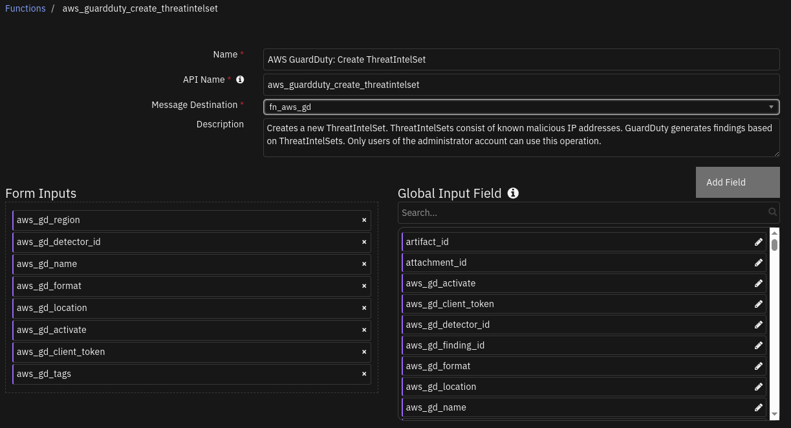
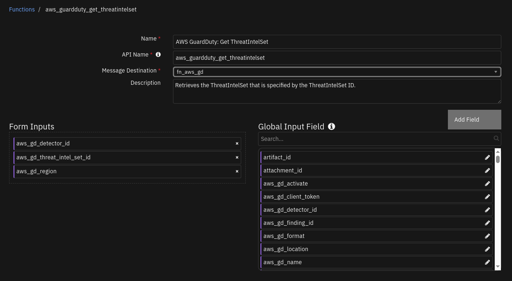
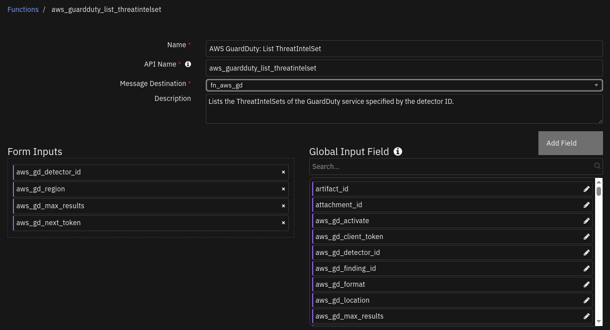
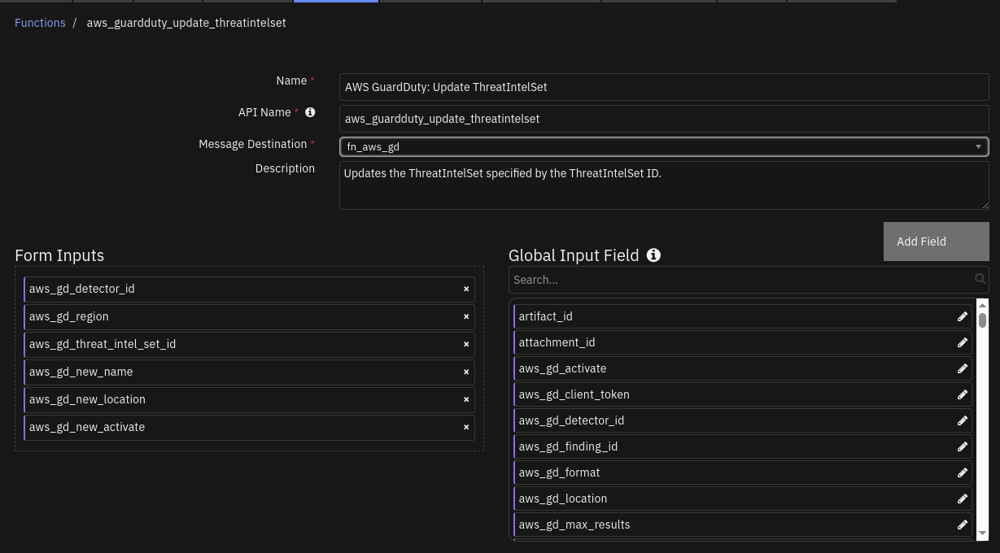
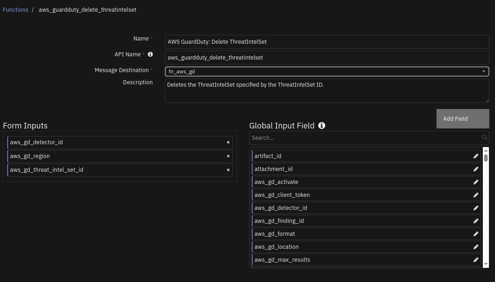
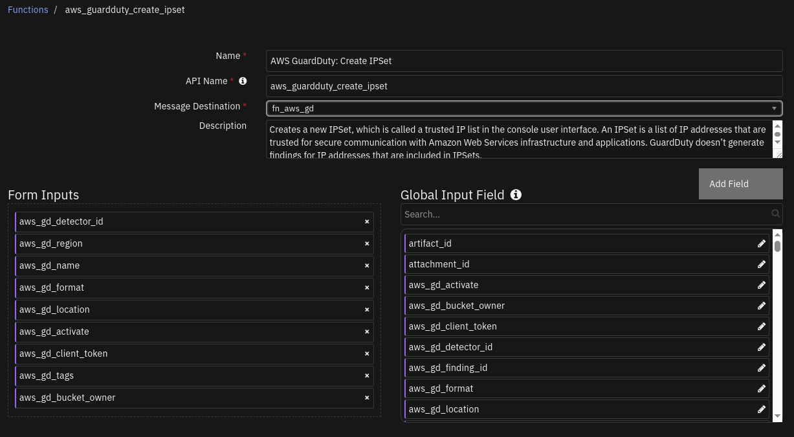
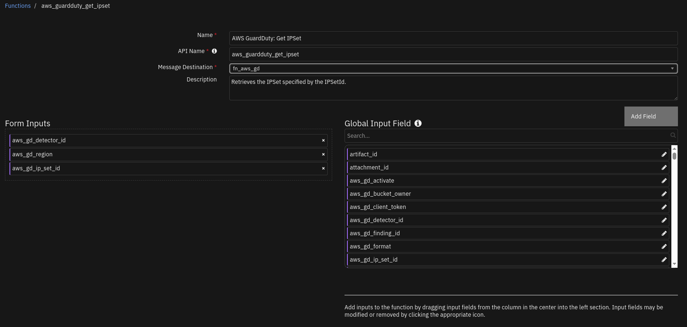
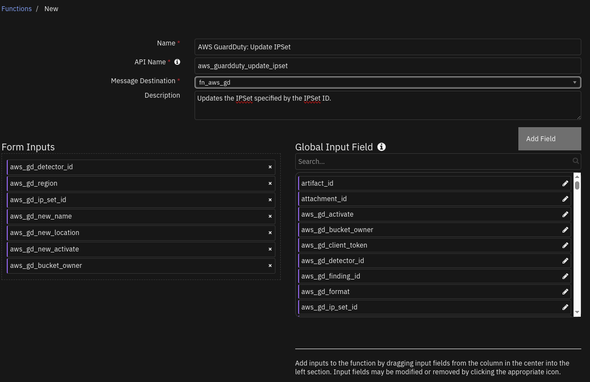
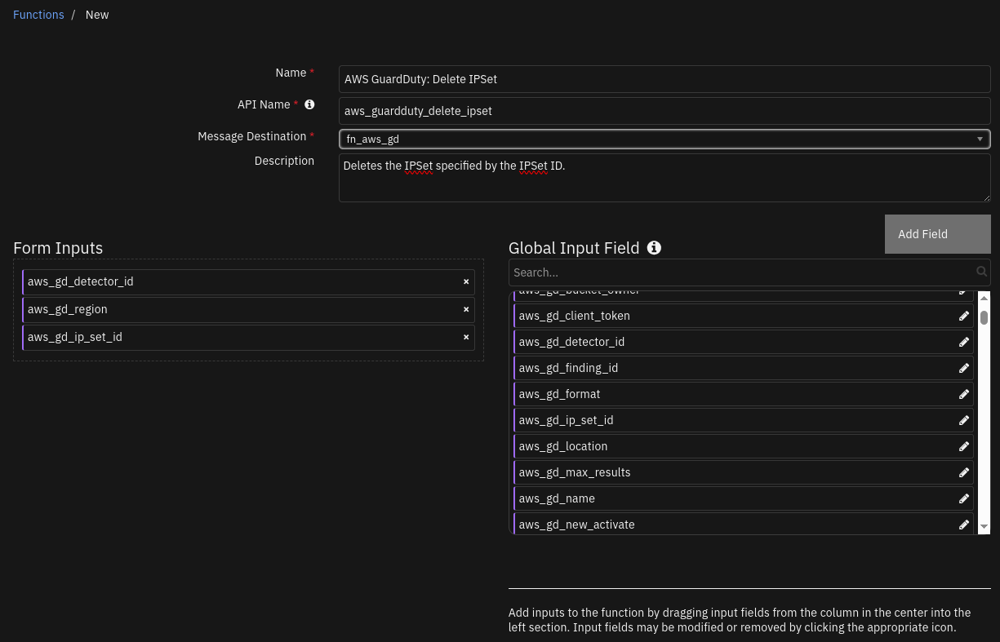

<!--
  This README.md is generated by running:
  "resilient-sdk docgen -p fn_aws_guardduty"

  This file was generated with resilient-sdk v51.0.1.1.824

  It is best edited using a Text Editor with a Markdown Previewer. VS Code
  is a good example. Checkout https://guides.github.com/features/mastering-markdown/
  for tips on writing with Markdown

  All fields followed by "::CHANGE_ME::"" should be manually edited

  If you make manual edits and run docgen again, a .bak file will be created

  Store any screenshots in the "doc/screenshots" directory and reference them like:
  

  NOTE: If your app is available in the container-format only, there is no need to mention the integration server in this readme.
-->

# AWS GuardDuty


## Table of Contents
- [AWS GuardDuty](#aws-guardduty)
  - [Table of Contents](#table-of-contents)
  - [Release Notes](#release-notes)
    - [AWS GuardDuty App 2.0.0 Changes](#aws-guardduty-app--200-changes)
    - [AWS GuardDuty App  1.1.0 Changes](#aws-guardduty-app--110-changes)
  - [Overview](#overview)
    - [Key Features](#key-features)
  - [Requirements](#requirements)
    - [SOAR platform](#soar-platform)
    - [Cloud Pak for Security](#cloud-pak-for-security)
    - [Proxy Server](#proxy-server)
    - [Python Environment](#python-environment)
  - [Installation](#installation)
    - [Install](#install)
    - [App Configuration](#app-configuration)
  - [Poller - AWS GuardDuty: Escalate Findings](#poller---aws-guardduty-escalate-findings)
  - [Function - AWS GuardDuty: Archive finding](#function---aws-guardduty-archive-finding)
  - [Function - AWS GuardDuty: Refresh Finding](#function---aws-guardduty-refresh-finding)
  - [Function - AWS GuardDuty: Create ThreatIntelSet](#function---aws-guardduty-create-threatintelset)
  - [Function - AWS GuardDuty: Get ThreatIntelSet](#function---aws-guardduty-get-threatintelset)
  - [Function - AWS GuardDuty: List ThreatIntelSet](#function---aws-guardduty-list-threatintelset)
  - [Function - AWS GuardDuty: Update ThreatIntelSet](#function---aws-guardduty-update-threatintelset)
  - [Function - AWS GuardDuty: Delete ThreatIntelSet](#function---aws-guardduty-delete-threatintelset)
  - [Function - AWS GuardDuty: Create IPSet](#function---aws-guardduty-create-ipset)
  - [Function - AWS GuardDuty: Get IPSet](#function---aws-guardduty-get-ipset)
  - [Function - AWS GuardDuty: List IPSet](#function---aws-guardduty-list-ipset)
  - [Function - AWS GuardDuty: Update IPSet](#function---aws-guardduty-update-ipset)
  - [Function - AWS GuardDuty: Delete IPSet](#function---aws-guardduty-delete-ipset)
  - [Playbooks](#playbooks)
  - [Custom Layouts](#custom-layouts)
  - [Data Table - GuardDuty Action/Actor Details](#data-table---guardduty-actionactor-details)
      - [API Name:](#api-name)
      - [Columns:](#columns)
  - [Data Table - GuardDuty Finding Overview](#data-table---guardduty-finding-overview)
      - [API Name:](#api-name-1)
      - [Columns:](#columns-1)
  - [Data Table - GuardDuty Resource - Access Key Details](#data-table---guardduty-resource---access-key-details)
      - [API Name:](#api-name-2)
      - [Columns:](#columns-2)
  - [Data Table - GuardDuty Resource - Instance Details](#data-table---guardduty-resource---instance-details)
      - [API Name:](#api-name-3)
      - [Columns:](#columns-3)
  - [Data Table - GuardDuty Resource - S3 Bucket Details](#data-table---guardduty-resource---s3-bucket-details)
      - [API Name:](#api-name-4)
      - [Columns:](#columns-4)
  - [Data Table - GuardDuty Resource Affected](#data-table---guardduty-resource-affected)
      - [API Name:](#api-name-5)
      - [Columns:](#columns-5)
  - [Custom Fields](#custom-fields)
  - [Custom Artifact Types](#custom-artifact-types)
  - [AWS GuardDuty Troubleshooting](#aws-guardduty-troubleshooting)
  - [Troubleshooting \& Support](#troubleshooting--support)
    - [For Support](#for-support)

---

## Release Notes
<!--
  Specify all changes in this release. Do not remove the release 
  notes of a previous release
-->
| Version | Date | Notes |
| ------- | ---- | ----- |
| 2.0.0 | 07/2025 | Added CRUD Functionality for ThreatIntelSets and IPSets |
| 1.1.0 | 04/2024 | Add Playbooks |
| 1.0.0 | 03/2021 | Initial Release |

---
### AWS GuardDuty App  2.0.0 Changes
In v2.0.0, there are 2 new capabilities for Guardduty that have been added. For the trusted IP addresses we have IPSets and for the malicious IP addresses we have ThreatIntelSets.
This will enhance with the existing capabilities and make it easier to specify which IP addresses to generate findings for.

There have been 10 new playbooks introduced which basically deals with create, read, update and delete methods for these sets on AWS Guardduty from SOAR.
When upgrading to the newer version, nothing is changed from the previous methods for IPSets and ThreatIntelSets.

### AWS GuardDuty App  1.1.0 Changes
In v1.1.0, the existing rules and workflows have been replaced with playbooks. This change is made to support the ongoing, newer capabilities of playbooks. Each playbook has the same functionality as the previous, corresponding rule/workflow.

If upgrading from a previous release, you'll noticed that the previous release's rules/workflows remain in place. Both sets of rules and playbooks are active. For manual actions, playbooks will have the same name as it's corresponding rule, but with "(PB)" added at the end. For automatic actions, the playbooks will be disabled by default.

You can continue to use the rules/workflows. But migrating to playbooks will provide greater functionality along with future app enhancements and bug fixes.
## Overview
<!--
  Provide a high-level description of the function itself and its remote software or application.
  The text below is parsed from the "description" and "long_description" attributes in the setup.py file
-->
**Amazon AWS GuardDuty Integration for SOAR.**

 

Amazon AWS GuardDuty is a continuous security monitoring service that identifies unexpected and potentially unauthorized and malicious activity within an AWS environment.
GuardDuty informs the user of the status of their AWS environment by producing security findings that can be viewed in the GuardDuty console.
A finding is a potential security issue discovered by GuardDuty.

The Amazon AWS GuardDuty Integration for SOAR allows you to process and respond to GuardDuty findings within the IBM SOAR Platform.

        

### Key Features
<!--
  List the Key Features of the Integration
-->
The GuardDuty Integration provides the following functionality:
* A poller which gathers current findings from GuardDuty and escalates to the SOAR platform as incidents.
* A function to archive a GuardDuty finding when the corresponding SOAR incident is closed.
* A function to refresh a SOAR incident with the latest information from the corresponding GuardDuty finding.
* Close SOAR incidents if the corresponding GuardDuty findings are archived.
* Archive GuardDuty findings if the corresponding SOAR incidents are closed.
* Trigger a refresh for a SOAR incident if the corresponding GuardDuty finding gets updated.
* A refresh of SOAR incidents can be executed manually.

**Note: AWS Region should always be cross-checked before working with ThreatIntelSets/IPSets**
**Note: ThreatIntelSets/IPSets playbook actions are only available on AWS incidents in SOAR created by the poller**

ThreatIntelSets:
Manage known malicious IP addresses within your AWS environment. You can upload up to 6 threat IP lists per Region.
* Create a new threatintelset on AWS GuardDuty from SOAR and activate the set to generate findings.
* Get the details of a threatintelset on AWS GuardDuty by specifying a threatintelsetid.
* List all the threatintelsets on AWS GuardDuty for a given detector_id and region.
* Update an existing threatintelset on AWS GuardDuty by specifying the threatintelsetid.
* Delete the threatintelset on AWS GuardDuty environment from SOAR.

IPSets:
Manage IP addresses that you trust for secure communication within your AWS environment. You can have only one trusted IP list per Region.
* Create a new ipset on AWS GuardDuty from SOAR and activate the set to skip generating findings for the trusted IP's.
* Get the details of an ipset on AWS GuardDuty by specifying an ipsetid.
* List all the ipsets on AWS GuardDuty for a given detector_id and region.
* Update an existing ipset on AWS GuardDuty by specifying the ipsetid.
* Delete the ipset on AWS GuardDuty environment from SOAR.

---

## Requirements
<!--
  List any Requirements 
--> 
This app supports the IBM Security QRadar SOAR Platform and the IBM Security QRadar SOAR for IBM Cloud Pak for Security.

### SOAR platform
The SOAR platform supports two app deployment mechanisms, Edge Gateway (also known as App Host) and integration server.

If deploying to a SOAR platform with an App Host, the requirements are:
* SOAR platform >= `51.0.0`.
* The app is in a container-based format (available from the AppExchange as a `zip` file).

If deploying to a SOAR platform with an integration server, the requirements are:
* SOAR platform >= `51.0.0`.
* The app is in the older integration format (available from the AppExchange as a `zip` file which contains a `tar.gz` file).
* Integration server is running `resilient_circuits>=51.0.0`.
* If using an API key account, make sure the account provides the following minimum permissions: 
  | Name | Permissions |
  | ---- | ----------- |
  | Org Data | Read |
  | Function | Read |
  | incident | create |
  | all_incidents | Read |

The following SOAR platform guides provide additional information: 
* _Edge Gateway Deployment Guide_ or _App Host Deployment Guide_: provides installation, configuration, and troubleshooting information, including proxy server settings. 
* _Integration Server Guide_: provides installation, configuration, and troubleshooting information, including proxy server settings.
* _System Administrator Guide_: provides the procedure to install, configure and deploy apps. 

The above guides are available on the IBM Documentation website at [ibm.biz/soar-docs](https://ibm.biz/soar-docs). On this web page, select your SOAR platform version. On the follow-on page, you can find the _Edge Gateway Deployment Guide_, _App Host Deployment Guide_, or _Integration Server Guide_ by expanding **Apps** in the Table of Contents pane. The System Administrator Guide is available by expanding **System Administrator**.

### Cloud Pak for Security
If you are deploying to IBM Cloud Pak for Security, the requirements are:
* IBM Cloud Pak for Security >= `1.10.15`.
* Cloud Pak is configured with an Edge Gateway.
* The app is in a container-based format (available from the AppExchange as a `zip` file).

The following Cloud Pak guides provide additional information: 
* _Edge Gateway Deployment Guide_ or _App Host Deployment Guide_: provides installation, configuration, and troubleshooting information, including proxy server settings. From the Table of Contents, select Case Management and Orchestration & Automation > **Orchestration and Automation Apps**.
* _System Administrator Guide_: provides information to install, configure, and deploy apps. From the IBM Cloud Pak for Security IBM Documentation table of contents, select Case Management and Orchestration & Automation > **System administrator**.

These guides are available on the IBM Documentation website at [ibm.biz/cp4s-docs](https://ibm.biz/cp4s-docs). From this web page, select your IBM Cloud Pak for Security version. From the version-specific IBM Documentation page, select Case Management and Orchestration & Automation.

### Proxy Server
The app does support a proxy server.

### Python Environment
Python 3.9 and Python 3.11 are supported.
Additional package dependencies may exist for each of these packages:
* boto3>=1.16.19
* resilient_circuits>=51.0.0
---

## Installation

### Install
* To install or uninstall an App or Integration on the _SOAR platform_, see the documentation at [ibm.biz/soar-docs](https://ibm.biz/soar-docs).
* To install or uninstall an App on _IBM Cloud Pak for Security_, see the documentation at [ibm.biz/cp4s-docs](https://ibm.biz/cp4s-docs) and follow the instructions above to navigate to Orchestration and Automation.

### App Configuration
The following table provides the settings you need to configure the app. These settings are made in the app.config file. See the documentation discussed in the Requirements section for the procedure.

| Config | Required | Example | Description |
| ------ | :------: | ------- | ----------- |
| **aws_gd_access_key_id** | Yes | `ABCD1EFGHI2JK3L4MNOP` | *AWS access key id of user with programmatic (API) access to AWS GuardDuty services for an AWS account. Note: User must have sufficent permissions to be able to manage GuardDuty resources for the AWS account.* |
| **aws_gd_secret_access_key** | Yes | `aBcdeFGH/iJkl1MNo2P3Q4rs5tuV6wXYZAbc+Def` | *AWS secret access key used for programmatic (API) access to AWS services.* |
| **aws_gd_master_region** | Yes | `us-west-1` | *Default or master region for the integration.* |
| **aws_gd_regions** | Yes | `"^us.*"` | *Filter by GuardDuty region names. Can be a string or regular expression.* |
| **aws_gd_regions_interval** | Yes | `60` | *Interval to refresh regions information (in minutes).* |
| **aws_gd_polling_interval** | Yes | `15` | *Interval to poll GuardDuty for findings (in minutes).* |
| **aws_gd_severity_threshold** | No | `7` | *Severity threshold (int) to use in criterion to filter findings .* |
| **aws_gd_lookback_interval** | No | `60` | *How long, (in minutes) to check back for previous findings at startup. Filter to process only more recent findings.* |
| **aws_gd_close_incident_template** | No | `` | *User defined JSON template file to use for closing SOAR incidents.* |
| **http_proxy** | No | `http://proxy:80` | *Optional setting for an http proxy if required.*  |
| **https_proxy** | No | `https://proxy:443` | *Optional setting for an https proxy if required.* |


 ---
## Poller - AWS GuardDuty: Escalate Findings
The GuardDuty integration poller starts querying GuardDuty for findings as soon as the app begins running.

The poller provide the following functionality.

* For any new findings discovered, creates a  matching incident in the SOAR platform.
* Enhances the incidents by adding artifacts, data tables and a note with data from the findings. The note includes the JSON content of the finding.
* Can be configured to filter the findings, which are escalated to the SOAR incidents.
* Closes SOAR incidents if the corresponding GuardDuty findings are archived.
* Archives GuardDuty findings if the corresponding SOAR incidents are closed.
* Triggers a refresh of GuardDuty information for a SOAR incident if the corresponding GuardDuty finding is updated.

The following screenshot shows examples of SOAR incidents created by the poller from GuardDuty findings:

  

The following screenshot shows an example of a SOAR incident Details tab created by the poller:

  

The following screenshot shows an example of GuardDuty finding custom properties in the Details tab of a SOAR incident created by the poller:

   

The following screenshot shows examples of artifacts added to a SOAR incident created by the poller:

   

The following screenshot shows an example of a note added to a SOAR incident created by the poller:

   

Note: See the data tables section for examples of data tables added by the poller.

---

## Function - AWS GuardDuty: Archive finding
SOAR Function to archive an AWS GuardDuty finding when the corresponding incident is closed.

  

<details><summary>Inputs:</summary>
<p>

| Name | Type | Required | Example | Tooltip |
| ---- | :--: | :------: | ------- | ------- |
| `aws_gd_detector_id` | `text` | No | `-` | AWS GuardDuty detector ID. |
| `aws_gd_finding_id` | `text` | No | `-` | AWS GuardDuty finding ID. |
| `aws_gd_region` | `text` | No | `-` | AWS GuardDuty region. |

</p>
</details>

<details><summary>Outputs:</summary>
<p>

> **NOTE:** This example might be in JSON format, but `results` is a Python Dictionary on the SOAR platform.

```python
results = {
  "content": {
    "status": "ok"
  },
  "inputs": {
    "aws_gd_detector_id": "48bb********************b7ccbc82",
    "aws_gd_finding_id": "xxxxyyyyzzzz",
    "aws_gd_region": "us-east-1"
  },
  "metrics": {
    "execution_time_ms": 2058,
    "host": "IBM-dummy-MacBookPro.local",
    "package": "fn-aws-guardduty",
    "package_version": "1.1.0",
    "timestamp": "2024-04-11 14:09:19",
    "version": "1.0"
  },
  "raw": "{\"status\": \"ok\"}",
  "reason": null,
  "success": true,
  "version": "1.0"
}
```

</p>
</details>

<details><summary>Example Function Input Script:</summary>
<p>

```python
inputs.aws_gd_region = incident.properties.aws_guardduty_region
inputs.aws_gd_detector_id = incident.properties.aws_guardduty_detector_id
inputs.aws_gd_finding_id = incident.properties.aws_guardduty_finding_id
```

</p>
</details>

<details><summary>Example Function Post Process Script:</summary>
<p>

```python
##  wf_aws_guardduty_refresh_finding ##
# Example result:
"""
Good
====
Result: {'version': '1.0', 'success': True, 'reason': None,
         'content': {'status': 'ok'},
         'raw': '{"status": "ok"}',
         'inputs': {'aws_gd_finding_id':      'c2bb95a17*******96c58f8a1689785', 
         'aws_gd_region': 'us-east-2',
                    'aws_gd_detector_id': '32b7017d*******22abc4e07c3fdded'
                    },
         'metrics': {'version': '1.0', 'package': 'fn-aws-guardduty', 'package_version': '1.0.0',
         'host': 'myhost.ibm.com', 'execution_time_ms': 1310, 'timestamp': '2021-01-28 11:31:30'
        }
}
Error:
Result: {'version': '1.0', 'success': True, 'reason': None,
         'content': {'status': 'error',
                     'msg': 'An error occurred (BadRequestException) when calling the ArchiveFindings operation:
                     The request is rejected because the input detectorId is not owned by the current account.'},
                     'raw': '<content_as_string>',
         'inputs': {'aws_gd_finding_id': 'c2bb95a17b879bffc96c58f8a1689784', 'aws_gd_region': 'us-east-2',
                    'aws_gd_detector_id': '32b7017*******22abc4e07c3fdfff'
                    },
         'metrics': {'version': '1.0', 'package': 'fn-aws-guardduty', 'package_version': '1.0.0',
         'host': 'myhost.ibm.com', 'execution_time_ms': 1446, 'timestamp': '2021-01-28 11:34:53'
         }
}
"""
#  Globals
FN_NAME = "func_aws_guardduty_archive_finding"
WF_NAME = "Example: AWS GuardDuty: Archive Finding"
# SOAR artifact names to api names.
# Processing
# Processing
CONTENT = playbook.functions.results.output
INPUTS = playbook.functions.results.inputs
QUERY_EXECUTION_DATE = playbook.functions.results.output["metrics"]["timestamp"]


# Processing

def main():
    note_text = ''
    if CONTENT:
        if CONTENT["status"] == "ok":
            note_text = "AWS IAM Integration: Workflow <b>{0}</b>: The finding with id <b>{1}</b> and detector id " \
                        "<b>{2}</b> in region <b>{3}</b> was successfully archived for SOAR function <b>{4}</b>"\
                .format(WF_NAME, INPUTS["aws_gd_finding_id"], INPUTS["aws_gd_detector_id"], INPUTS["aws_gd_region"], FN_NAME)
            # Update archived property.
            incident.properties.aws_guardduty_archived = "True"  
            

        elif CONTENT["status"] == "error":
            note_text = "AWS IAM Integration: Workflow <b>{0}</b>: The finding with id <b>{1}</b> and detector id " \
                        "<b>{2}</b> in region <b>{3}</b> failed archive with error <b>{4}</b> for SOAR function <b>{5}</b>"\
                .format(WF_NAME, INPUTS["aws_gd_finding_id"], INPUTS["aws_gd_detector_id"], INPUTS["aws_gd_region"],
                        CONTENT["msg"], FN_NAME)

        else:
            note_text = "AWS IAM Integration: Workflow <b>{0}</b>: The finding with id <b>{1}</b> and detector id " \
                        "<b>{2}</b> in region <b>{3}</b> got unexpected status <b>{4}</b> for SOAR function <b>{5}</b>" \
                .format(WF_NAME, INPUTS["aws_gd_finding_id"], INPUTS["aws_gd_detector_id"], CONTENT["status"], INPUTS["aws_gd_region"],
                        FN_NAME)

    else:
        note_text += "AWS IAM Integration: Workflow <b>{0}</b>: There was no result returned for SOAR function <b>{0}</b>"\
            .format(WF_NAME, FN_NAME)

    incident.addNote(helper.createRichText(note_text))

if __name__ == "__main__":
    main()

```

</p>
</details>

---
## Function - AWS GuardDuty: Refresh Finding
SOAR Function to refresh AWS GuardDuty finding details in an incident.

 

<details><summary>Inputs:</summary>
<p>

| Name | Type | Required | Example | Tooltip |
| ---- | :--: | :------: | ------- | ------- |
| `aws_gd_detector_id` | `text` | No | `-` | AWS GuardDuty detector ID. |
| `aws_gd_finding_id` | `text` | No | `-` | AWS GuardDuty finding ID. |
| `aws_gd_region` | `text` | No | `-` | AWS GuardDuty region. |
| `incident_id` | `number` | No | `-` | SOAR incident ID. |

</p>
</details>

<details><summary>Outputs:</summary>
<p>

> **NOTE:** This example might be in JSON format, but `results` is a Python Dictionary on the SOAR platform.

```python
results = {
  "content": {
    "data_tables": {
      "gd_access_key_details": [
        {
          "cells": {
            "access_key_id": {
              "value": "xxxxyyyy"
            },
            "principal_id": {
              "value": "xxxxyyyy"
            },
            "query_execution_date": {
              "value": "2024-04-11 14:08:54"
            },
            "user_name": {
              "value": "dummy"
            },
            "user_type": {
              "value": "IAMUser"
            }
          }
        }
      ],
      "gd_action_details": [
        {
          "cells": {
            "action_api": {
              "value": "ListFindings"
            },
            "action_type": {
              "value": "AWS_API_CALL"
            },
            "actor_caller_type": {
              "value": "Remote IP"
            },
            "asn": {
              "value": "17390"
            },
            "asn_org": {
              "value": "CIO-ORGANIZATION"
            },
            "city_name": {
              "value": "Singapore"
            },
            "country_name": {
              "value": "Singapore"
            },
            "event_first_seen": {
              "value": "2024-04-11T05:26:01.000Z"
            },
            "event_last_seen": {
              "value": "2024-04-11T05:32:48.000Z"
            },
            "isp": {
              "value": "IBM Corporation"
            },
            "org": {
              "value": "IBM Corporation"
            },
            "query_execution_date": {
              "value": "2024-04-11 14:08:54"
            },
            "remote_ip": {
              "value": "129.41.56.2"
            },
            "service_name": {
              "value": "guardduty.amazonaws.com"
            }
          }
        }
      ],
      "gd_finding_overview": [
        {
          "cells": {
            "account_id": {
              "value": "xxxxyyyyzzzz"
            },
            "count": {
              "value": "1"
            },
            "created_at": {
              "value": "2024-04-11T05:47:16.625Z"
            },
            "query_execution_date": {
              "value": "2024-04-11 14:08:54"
            },
            "region": {
              "value": "us-east-1"
            },
            "severity": {
              "value": "2"
            },
            "updated_at": {
              "value": "2024-04-11T05:47:16.625Z"
            }
          }
        }
      ],
      "gd_instance_details": [],
      "gd_resource_affected": [
        {
          "cells": {
            "query_execution_date": {
              "value": "2024-04-11 14:08:54"
            },
            "resource_role": {
              "value": "TARGET"
            },
            "resource_type": {
              "value": "AccessKey"
            }
          }
        }
      ],
      "gd_s3_bucket_details": []
    },
    "finding": {
      "AccountId": "xxxxyyyyzzzz",
      "Arn": "arn:aws:guardduty:us-east-1:xxxxyyyyzzzz:detector/48bb********************b7ccbc82/finding/xxxxyyyyzzzz",
      "CreatedAt": "2024-04-11T05:47:16.625Z",
      "Description": "APIs commonly used in Discovery tactics were invoked by user IAMUser : dummy under unusual circumstances. Such activity is not typically seen from this user.",
      "Id": "xxxxyyyyzzzz",
      "Partition": "aws",
      "Region": "us-east-1",
      "Resource": {
        "AccessKeyDetails": {
          "AccessKeyId": "xxxxyyyy",
          "PrincipalId": "xxxxyyyy",
          "UserName": "dummy",
          "UserType": "IAMUser"
        },
        "ResourceType": "AccessKey"
      },
      "SchemaVersion": "2.0",
      "Service": {
        "Action": {
          "ActionType": "AWS_API_CALL",
          "AwsApiCallAction": {
            "AffectedResources": {},
            "Api": "ListFindings",
            "CallerType": "Remote IP",
            "RemoteIpDetails": {
              "City": {
                "CityName": "Singapore"
              },
              "Country": {
                "CountryName": "Singapore"
              },
              "GeoLocation": {
                "Lat": 1.2868,
                "Lon": 103.8503
              },
              "IpAddressV4": "129.41.56.2",
              "Organization": {
                "Asn": "17390",
                "AsnOrg": "CIO-ORGANIZATION",
                "Isp": "IBM Corporation",
                "Org": "IBM Corporation"
              }
            },
            "ServiceName": "guardduty.amazonaws.com"
          }
        },
        "AdditionalInfo": {
          "Type": "default",
          "Value":{"String encoded json. Review full payload in payload_samples folder"},
        "Archived": false,
        "Count": 1,
        "DetectorId": "48bb********************b7ccbc82",
        "EventFirstSeen": "2024-04-11T05:26:01.000Z",
        "EventLastSeen": "2024-04-11T05:32:48.000Z",
        "ResourceRole": "TARGET",
        "ServiceName": "guardduty"
      },
      "Severity": 2,
      "Title": "The user IAMUser : dummy is anomalously invoking APIs commonly used in Discovery tactics.",
      "Type": "Discovery:IAMUser/AnomalousBehavior",
      "UpdatedAt": "2024-04-11T05:47:16.625Z"
    },
    "payload": {
      "artifacts": [],
      "comments": [],
      "description": {
        "content": "APIs commonly used in Discovery tactics were invoked by user IAMUser : dummy under unusual circumstances. Such activity is not typically seen from this user.",
        "format": "text"
      },
      "discovered_date": "2024-04-11T05:47:16.625Z",
      "name": "AWS GuardDuty: The user IAMUser : dummy is anomalously invoking APIs commonly used in Discovery tactics.",
      "properties": {
        "aws_guardduty_archived": "False",
        "aws_guardduty_count": "1",
        "aws_guardduty_detector_id": "48bbf98*******215c7a02b7ccbc82",
        "aws_guardduty_finding_arn": "arn:aws:guardduty:us-east-1:xxxxyyyyzzzz:detector/48bb********************b7ccbc82/finding/xxxxyyyyzzzz",
        "aws_guardduty_finding_id": "xxxxyyyyzzzz",
        "aws_guardduty_finding_type": "Discovery:IAMUser/AnomalousBehavior",
        "aws_guardduty_finding_updated_at": "2024-04-11T05:47:16.625Z",
        "aws_guardduty_region": "us-east-1",
        "aws_guardduty_resource_type": "AccessKey",
        "aws_guardduty_severity": "2"
      },
      "severity_code": "Low"
    },
    "region": "us-east-1",
    "timestamp": "2024-04-11 14:08:54"
  },
  "inputs": {
    "aws_gd_detector_id": "48bb********************b7ccbc82",
    "aws_gd_finding_id": "xxxxyyyyzzzz",
    "aws_gd_region": "us-east-1",
    "incident_id": 2114
  },
  "metrics": {
    "execution_time_ms": 1530,
    "host": "IBM-dummy-MacBookPro.local",
    "package": "fn-aws-guardduty",
    "package_version": "1.1.0",
    "timestamp": "2024-04-11 14:08:54",
    "version": "1.0"
  },
  "raw": "String encoded json. Review full payload in payload_samples folder",
    "reason": null,
  "success": true,
  "version": "1.0"
  }
}
```

</p>
</details>

<details><summary>Example Function Input Script:</summary>
<p>

```python
inputs.aws_gd_region = incident.properties.aws_guardduty_region
inputs.aws_gd_detector_id = incident.properties.aws_guardduty_detector_id
inputs.aws_gd_finding_id = incident.properties.aws_guardduty_finding_id
inputs.incident_id = incident.id
```

</p>
</details>

<details><summary>Example Function Post Process Script:</summary>
<p>

```python
##  wf_aws_guardduty_refresh_finding ##
# Example result:
"""
Result: { 'version': '1.0',
          'success': True,
          'reason': None,
          'content': {'payload': {'name': 'AWS GuardDuty: API GeneratedFindingAPIName was invoked from an IP address on a custom threat list.',
                                  'description': {'format': 'text', 'content': 'An API was used to access a bucket from an IP address on a custom threat list.'},
                                  'discovered_date': '2020-11-25T13:46:37.960Z',
                                  'severity_code': 'Low',
                                  'properties': {'aws_guardduty_finding_id': '60baffd3f9042e38640f2300d5c5a631',
                                                'aws_guardduty_finding_arn': 'arn:aws:guardduty:us-west-2:xxxxyyyyzzzz:detector/f2baedb0*******929e15f56da6a/finding/60baffd3f9042e38640f2300d5c5a631',
                                                'aws_guardduty_finding_type': 'UnauthorizedAccess:S3/MaliciousIPCaller.Custom',
                                                'aws_guardduty_finding_updated_at': '2020-11-26T15:18:12.620Z', 'aws_guardduty_region': 'us-west-2',
                                                'aws_guardduty_resource_type': 'S3Bucket', 'aws_guardduty_count': 4,
                                                'aws_guardduty_detector_id': 'f2baedb*******2fc929e15f56da6a'},
                                  'artifacts': [],
                                  'comments': [{'text': {'format': 'text', 'content': "AWS GuardDuty finding Payload:\n<FINDING_PAYLOAD_AS_STRING>"}}]

                                },
                      "data_tables": {"gd_action_details": [{"cells": {"action_type": {"value": "AWS_API_CALL"},
                                                            "action_api": {"value": "GeneratedFindingAPIName"},
                                                            "event_first_seen": {"value": "2020-11-25T13:46:37.960Z"},
                                                            "event_last_seen": {"value": "2020-11-26T15:18:12.620Z"},
                                                            "actor_caller_type": {"value": "Remote IP"}, "city_name": {"value": "GeneratedFindingCityName"}, "country_name": {"value": "GeneratedFindingCountryName"}, "asn": {"value": "-1"}, "asn_org": {"value": "GeneratedFindingASNOrg"}, "isp": {"value": "GeneratedFindingISP"}, "org": {"value": "GeneratedFindingORG"}, "action_service_name": {"value": "GeneratedFindingAPIServiceName"}, "remote_ip": {"value": "198.51.100.0"}}}],
                                    "gd_resource_affected": [{"cells": {"resource_type": {"value": "S3Bucket"}, "instance_id": {"value": "i-99999999"}, "instance_type": {"value": "m3.xlarge"}, "instance_state": {"value": "running"}, "resource_role": {"value": "TARGET"}, "instance_private_ip": {"value": "10.0.0.1"}, "instance_private_dns": {"value": "GeneratedFindingPrivateName"}, "instance_public_ip": {"value": "198.51.100.0"}, "instance_public_dns": {"value": "GeneratedFindingPublicDNSName"}, "s3bucket_name": {"value": "bucketName"}, "s3bucket_owner": {"value": "CanonicalId of Owner"}}}]

                      }}',
            'inputs': {'incident_id': 2168, 'aws_gd_finding_id': '60baffd3f9042e38640f2300d5c5a631',
                      'aws_gd_region': 'us-west-2', 'aws_gd_detector_id': 'f2baedb0ac74f8f42fc929e15f56da6a'},
            'metrics': {'version': '1.0', 'package': 'fn-aws-guardduty', 'package_version': '1.0.0',
                        'host': 'Johnp-MacBook-Pro-2.galway.ie.ibm.com', 'execution_time_ms': 10739,
                        'timestamp': '2021-01-18 16:51:10'}
}
"""
#  Globals
# List of fields in datatable for wf_aws_guardduty_refresh_finding script
DATA_TABLES = ["gd_action_details", "gd_resource_affected"]
FN_NAME = "func_aws_guardduty_refresh_finding"
WF_NAME = "Example: AWS GuardDuty: Refresh Finding"
# SOAR artifact names to api names.
ARTIFACT_API_TO_TYPE = {
    "aws_iam_access_key_id": "AWS IAM Access Key ID",
    "aws_iam_user_name": "AWS IAM User Name",
    "aws_s3_bucket_name": "AWS S3 Bucket Name",
    "IP Address": "IP Address",
    "DNS Name": "DNS Name",
    "Port": "Port"
}

CONTENT = playbook.functions.results.output
QUERY_EXECUTION_DATE = playbook.functions.results.output["metrics"]["timestamp"]
if CONTENT:
    FINDING = CONTENT.finding
    PAYLOAD = CONTENT.payload
    ARTIFACTS = CONTENT.artifacts
    DATA_TABLES = CONTENT.data_tables

# Processing

def main():
    note_text = ''
    if CONTENT:
        note_text = "AWS GuardDuty Integration: Workflow <b>{0}</b>: Finding data returned for SOAR function " \
                    "<b>{2}</b>".format(WF_NAME, len(CONTENT), FN_NAME)

        update_fields()
        update_datatables()
        if ARTIFACTS:
            add_artifacts()
    else:
        note_text = "AWS GuardDuty Integration: Workflow <b>{0}</b>: No finding data returned for SOAR function " \
                    "<b>{2}</b>".format(WF_NAME, len(CONTENT), FN_NAME)

    incident.addNote(helper.createRichText(note_text))

def update_fields():
    incident.severity_code = PAYLOAD["severity_code"]
    incident.properties.aws_guardduty_finding_updated_at = PAYLOAD["properties"]["aws_guardduty_finding_updated_at"]
    incident.properties.aws_guardduty_count = str(PAYLOAD["properties"]["aws_guardduty_count"])
    incident.properties.aws_guardduty_archived = str(PAYLOAD["properties"]["aws_guardduty_archived"])
    incident.properties.aws_guardduty_severity = str(PAYLOAD["properties"]["aws_guardduty_severity"])

def update_datatables():
    for data_table in DATA_TABLES:
        for row in DATA_TABLES[data_table]:
            newrow = incident.addRow(data_table)
            newrow.query_execution_date = QUERY_EXECUTION_DATE
            data_table_fields = row["cells"]
            for f, v_info in data_table_fields.items():
                newrow[f] = v_info.value


def add_artifacts():
    for artifact in ARTIFACTS:
        artifact_type = ARTIFACT_API_TO_TYPE[artifact["type"]["name"]]
        artifact_value = artifact["value"]
        description = artifact["description"]["content"]
        incident.addArtifact(artifact_type, artifact_value, description)


if __name__ == "__main__":
    main()

```

</p>
</details>

---
## Function - AWS GuardDuty: Create ThreatIntelSet
SOAR function to create a new threat intel set on AWS GuardDuty.



<details><summary>Inputs:</summary>
<p>

| Name | Type | Required | Example | Tooltip |
| ---- | :--: | :------: | ------- | ------- |
| `aws_gd_detector_id` | `text` | Yes | `-` | AWS GuardDuty detector ID. |
| `aws_gd_region` | `text` | Yes | `-` | AWS GuardDuty region. |
| `aws_gd_name` | `text` | Yes | `-` | AWS GuardDuty threatintelset name that we specify. |
| `aws_gd_format` | `text` | Yes | `TXT, STIX, OTX_CSV, ALIEN_VAULT, PROOF_POINT, FIRE_EYE` | AWS GuardDuty file format for the threatintelset. |
| `aws_gd_location` | `text` | Yes | `s3://example_bucket/example.txt` | AWS GuardDuty threatintelset file location. URI can be retrieved from AWS S3 bucket. |
| `aws_gd_activate` | `boolean` | Yes | `-` | AWS GuardDuty threatintelset activation. True indicates that the AWS GuardDuty can use this threatintelset in AWS GuardDuty findings. |
| `aws_gd_client_token` | `text` | No | `-` | AWS GuardDuty threatintelset idempotency token. (Autopopulated when not specified)|
| `aws_gd_tags` | `text` | No | `-` | AWS GuardDuty tags. These are key-value pairs used to categorize and manage the threatintelset lists. It is also a form of metadata which gives more insights about the resource. |


</p>
</details>

<details><summary>Outputs:</summary>
<p>

> **NOTE:** This example might be in JSON format, but `results` is a Python Dictionary on the SOAR platform.

```python
results = {
  "version": 2,
  "success": "True",
  "reason": "None",
  "content": {
    "ResponseMetadata": {
      "RequestId": "df0f48de-de02-4d20-b88b-5234c715a14a",
      "HTTPStatusCode": 200,
      "HTTPHeaders": {
        "date": "Fri, 18 Jul 2025 13:27:40 GMT",
        "content-type": "application/json",
        "content-length": "55",
        "connection": "***",
        "x-amzn-requestid": "df0f48de-de02-4d20-b88b-5234c715a14a",
        "access-control-allow-origin": "*",
        "access-control-allow-headers": "Content-Type,X-Amz-Date,Authorization,X-Api-Key,X-Amz-Security-Token,X-Amz-Content-Sha256,X-Amz-User-Agent,*,Date,X-Amz-Target,x-amzn-platform-id,x-amzn-trace-id",
        "x-amz-apigw-id": "N6DIBG_7IAMEogw=",
        "access-control-expose-headers": "x-amzn-ErrorType,x-amzn-requestid,x-amzn-errormessage,x-amzn-trace-id,x-amz-apigw-id,Date",
        "x-amzn-trace-id": "Root=1-687a4bcc-149a260c62ef8c641a7c8df5;Parent=3a406d782efd26b9;Sampled=0;Lineage=1:045398e1:0",
        "access-control-max-age": "86400"
      },
      "RetryAttempts": 0
    },
    "ThreatIntelSetId": "114da827a1d0442b96f7039275b321e8",
    "status": "ok"
  },
  "raw": "None",
  "inputs": {
    "aws_gd_format": "TXT",
    "aws_gd_name": "Test 18",
    "aws_gd_region": "us-east-1",
    "aws_gd_location": "s3://test-threat-intel-set/malicious_ip.txt",
    "aws_gd_client_token": "***",
    "aws_gd_tags": "Severity:LOW, Mitigation:Possible",
    "aws_gd_activate": "False",
    "aws_gd_detector_id": "48bb********************b7ccbc82"
  },
  "metrics": {
    "version": "1.0",
    "package": "fn-aws-guardduty",
    "package_version": "2.0.0",
    "host": "localhost",
    "execution_time_ms": 1303,
    "timestamp": "2025-07-18 14:27:41"
  }
}
```

</p>
</details>

<details><summary>Example Function Input Script:</summary>
<p>

```python
inputs.aws_gd_region = incident.properties.aws_guardduty_region
inputs.aws_gd_detector_id = incident.properties.aws_guardduty_detector_id
inputs.aws_gd_name = playbook.inputs.aws_gd_name
inputs.aws_gd_activate = playbook.inputs.aws_gd_activate
inputs.aws_gd_format = playbook.inputs.aws_gd_format
inputs.aws_gd_location = playbook.inputs.aws_gd_location
inputs.aws_gd_client_token = playbook.inputs.aws_gd_client_token
inputs.aws_gd_tags = playbook.inputs.aws_gd_tags
```

</p>
</details>

<details><summary>Example Function Post Process Script:</summary>
<p>

```python
#This is a Post-Processing Script for AWS GuardDuty Create ThreatIntelset

FN_NAME = "aws_guardduty_create_threatintelset"
WF_NAME = "AWS GuardDuty: Create ThreatIntelSet"

results = playbook.functions.results.response_output

note_text = f"Action ran for AWS Region: <b>{incident.properties.aws_guardduty_region}</b><br>"

if results.content.status != 'error' and results.success:
  note_text += f"AWS GuardDuty: Playbook: <b>{WF_NAME}</b><br>Successfully executed for SOAR function <b>{FN_NAME}</b><br>"
  if results.content:
    response_body = results.get("content")
    threat_intel_set_id = response_body.get("ThreatIntelSetId")
    note_text += f"ThreatIntelSetId: {threat_intel_set_id}"
else:
  note_text += f"AWS GuardDuty: Playbook: <b>{WF_NAME}</b><br>Execution error for SOAR function <b>{FN_NAME}</b><br>"
  if results.reason is None:
    note_text += f"<b>Reason:</b> {results.get('content').get('msg')}"
  else:
    note_text += f"<b>Reason:</b> {results.get('reason')}"
incident.addNote(helper.createRichText(note_text))
```
</p>
</details>

---
## Function - AWS GuardDuty: Get ThreatIntelSet
SOAR function to read a threat intel set from AWS GuardDuty.



<details><summary>Inputs:</summary>
<p>

| Name | Type | Required | Example | Tooltip |
| ---- | :--: | :------: | ------- | ------- |
| `aws_gd_detector_id` | `text` | Yes | `-` | AWS GuardDuty detector ID. |
| `aws_gd_region` | `text` | Yes | `-` | AWS GuardDuty region. |
| `aws_gd_threat_intel_set_id` | `text` | Yes | `-` | AWS GuardDuty unique id associated with a threatintelset. |


</p>
</details>

</p>
</details>

<details><summary>Outputs:</summary>
<p>

> **NOTE:** This example might be in JSON format, but `results` is a Python Dictionary on the SOAR platform.

```python
results = {
  "version": 2,
  "success": "True",
  "reason": "None",
  "content": {
    "Name": "Test 18",
    "Format": "TXT",
    "Location": "s3://test-threat-intel-set/malicious_ip.txt",
    "Tags": {
      "Mitigation": "Possible",
      "Severity": "LOW"
    },
    "Status": "INACTIVE"
  },
  "raw": "None",
  "inputs": {
    "aws_gd_region": "us-east-1",
    "aws_gd_detector_id": "48bb********************b7ccbc82",
    "aws_gd_threat_intel_set_id": "114da827a1d0442b96f7039275b321e8"
  },
  "metrics": {
    "version": "1.0",
    "package": "fn-aws-guardduty",
    "package_version": "2.0.0",
    "host": "localhost",
    "execution_time_ms": 972,
    "timestamp": "2025-07-18 14:41:10"
  }
}
```

</p>
</details>

<details><summary>Example Function Input Script:</summary>
<p>

```python
inputs.aws_gd_region = incident.properties.aws_guardduty_region
inputs.aws_gd_detector_id = incident.properties.aws_guardduty_detector_id
inputs.aws_gd_threat_intel_set_id = playbook.inputs.aws_gd_threat_intel_set_id
```

</p>
</details>

<details><summary>Example Function Post Process Script:</summary>
<p>

```python
#This is a Post-Processing Script for AWS GuardDuty GET ThreatIntelset

FN_NAME = "aws_guardduty_get_threatintelset"
WF_NAME = "AWS GuardDuty: GET ThreatIntelSet"

results = playbook.functions.results.response_output

note_text = f"Action ran for AWS Region: <b>{incident.properties.aws_guardduty_region}</b><br>"

if results.success:
  note_text += f"AWS GuardDuty: Playbook: <b>{WF_NAME}</b><br>Successfully executed for SOAR function <b>{FN_NAME}</b><br>"
  if results.content:
    response_body = results.get("content")
    threat_intel_set_id = response_body.get("ThreatIntelSetId")
    note_text += f"<b>Information about the ThreatIntelSet:</b><br>"
    note_text += f"ThreatIntelSetId: {playbook.inputs.aws_gd_threat_intel_set_id}<br>"
    note_text += f"Name: {response_body.get('Name')}<br>Format: {response_body.get('Format')}<br>Location: {response_body.get('Location')}<br>Status: {response_body.get('Status')}<br>Tags: {response_body.get('Tags')}<br>"
else:
  note_text += f"AWS GuardDuty: Playbook: <b>{WF_NAME}</b><br>Execution error for SOAR function <b>{FN_NAME}</b><br>"
  note_text += f"<b>Reason:</b> {results.get('reason')}"
incident.addNote(helper.createRichText(note_text))
```
</p>
</details>

---
## Function - AWS GuardDuty: List ThreatIntelSet
SOAR function to read list of all threat intel sets from AWS GuardDuty.



<details><summary>Inputs:</summary>
<p>

| Name | Type | Required | Example | Tooltip |
| ---- | :--: | :------: | ------- | ------- |
| `aws_gd_detector_id` | `text` | Yes | `-` | AWS GuardDuty detector ID. |
| `aws_gd_region` | `text` | Yes | `-` | AWS GuardDuty region. |
| `aws_gd_max_results` | `number` | No | `-` | AWS GuardDuty maximum number of results you want to retrieve. |
| `aws_gd_next_token` | `text` | No | `-` | AWS GuardDuty pagination parameter to be used on the next list operation to retrieve more items. |


</p>
</details>

</p>
</details>

<details><summary>Outputs:</summary>
<p>

> **NOTE:** This example might be in JSON format, but `results` is a Python Dictionary on the SOAR platform.

```python
results = {
  "version": 2,
  "success": "True",
  "reason": "None",
  "content": [
    "114da827a1d0442b96f7039275b321e8",
    "1acc0467837941db18401c6cd2e2287b",
    "4face156778d48a3a06663dd461187ce",
    "68e7855700034e989863db54335ae22b"
  ],
  "raw": "None",
  "inputs": {
    "aws_gd_max_results": 5,
    "aws_gd_region": "us-east-1",
    "aws_gd_next_token": "***",
    "aws_gd_detector_id": "48bb********************b7ccbc82"
  },
  "metrics": {
    "version": "1.0",
    "package": "fn-aws-guardduty",
    "package_version": "2.0.0",
    "hoat": "localhost",
    "execution_time_ms": 1080,
    "timestamp": "2025-07-18 14:54:25"
  }
}
```

</p>
</details>

<details><summary>Example Function Input Script:</summary>
<p>

```python
inputs.aws_gd_region = incident.properties.aws_guardduty_region
inputs.aws_gd_detector_id = incident.properties.aws_guardduty_detector_id
inputs.aws_gd_max_results = playbook.inputs.aws_gd_max_results
inputs.aws_gd_next_token = playbook.inputs.aws_gd_next_token
```

</p>
</details>

<details><summary>Example Function Post Process Script:</summary>
<p>

```python
#This is a Post-Processing Script for AWS GuardDuty List ThreatIntelset

FN_NAME = "aws_guardduty_list_threatintelset"
WF_NAME = "AWS GuardDuty: List ThreatIntelSet"

results = playbook.functions.results.response_output

note_text = f"Action ran for AWS Region: <b>{incident.properties.aws_guardduty_region}</b><br>"

if results.content and results.success:
  note_text += f"AWS GuardDuty: Playbook: <b>{WF_NAME}</b><br>Successfully executed for SOAR function <b>{FN_NAME}</b><br>"
  if results.content:
    threat_intel_set_ids = results.get("content")
    note_text += f"<b>Listing all the ThreatIntelSetIds:</b><br>{threat_intel_set_ids}"
else:
  note_text += f"AWS GuardDuty: Playbook: <b>{WF_NAME}</b><br>Execution error for SOAR function <b>{FN_NAME}</b><br>"
  if results.reason is None:
    note_text += f"<b>Reason:</b> No ThreatIntelSets found on AWS GuardDuty for this region"
  else:
    note_text += f"<b>Reason:</b> {results.get('reason')}"
incident.addNote(helper.createRichText(note_text))
```
</p>
</details>

---
## Function - AWS GuardDuty: Update ThreatIntelSet
SOAR function to update an existing threat intel set on AWS GuardDuty.



<details><summary>Inputs:</summary>
<p>

| Name | Type | Required | Example | Tooltip |
| ---- | :--: | :------: | ------- | ------- |
| `aws_gd_detector_id` | `text` | Yes | `-` | AWS GuardDuty detector ID. |
| `aws_gd_region` | `text` | Yes | `-` | AWS GuardDuty region. |
| `aws_gd_threat_intel_set_id` | `text` | Yes | `-` | AWS GuardDuty unique id associated with a threatintelset. |
| `aws_gd_new_name` | `text` | No | `-` | AWS GuardDuty new name for the threatintelset. |
| `aws_gd_new_location` | `text` | No | `s3://example_bucket/example.txt` | AWS GuardDuty threatintelset new file location. URI can be retrieved from AWS S3 bucket. |
| `aws_gd_new_activate` | `boolean` | No | `-` | AWS GuardDuty update threatintelset new activation status. True indicates that the AWS GuardDuty can use this threatintelset in AWS GuardDuty findings. |


</p>
</details>

</p>
</details>

<details><summary>Outputs:</summary>
<p>

> **NOTE:** This example might be in JSON format, but `results` is a Python Dictionary on the SOAR platform.

```python
results = {
  "version": 2,
  "success": "True",
  "reason": "None",
  "content": {
    "ResponseMetadata": {
      "RequestId": "ef9c6a36-1a25-495c-b193-59a45e5764c5",
      "HTTPStatusCode": 200,
      "HTTPHeaders": {
        "date": "Fri, 18 Jul 2025 14:11:35 GMT",
        "content-type": "application/json",
        "content-length": "0",
        "connection": "***",
        "x-amzn-requestid": "ef9c6a36-1a25-495c-b193-59a45e5764c5",
        "access-control-allow-origin": "*",
        "access-control-allow-headers": "Content-Type,X-Amz-Date,Authorization,X-Api-Key,X-Amz-Security-Token,X-Amz-Content-Sha256,X-Amz-User-Agent,*,Date,X-Amz-Target,x-amzn-platform-id,x-amzn-trace-id",
        "x-amz-apigw-id": "N6JjrHLdIAMEt8Q=",
        "access-control-expose-headers": "x-amzn-ErrorType,x-amzn-requestid,x-amzn-errormessage,x-amzn-trace-id,x-amz-apigw-id,Date",
        "x-amzn-trace-id": "Root=1-687a5617-2f62a30c63bb69fb29504207;Parent=3aba685ead709b1f;Sampled=0;Lineage=1:c7568072:0",
        "access-control-max-age": "86400"
      },
      "RetryAttempts": 0
    },
    "status": "ok"
  },
  "raw": "None",
  "inputs": {
    "aws_gd_new_location": "None",
    "aws_gd_region": "us-east-1",
    "aws_gd_new_name": "New Test 18",
    "aws_gd_detector_id": "48bb********************b7ccbc82",
    "aws_gd_threat_intel_set_id": "4face156778d48a3a06663dd461187ce",
    "aws_gd_new_activate": "None"
  },
  "metrics": {
    "version": "1.0",
    "package": "fn-aws-guardduty",
    "package_version": "2.0.0",
    "host": "localhost",
    "execution_time_ms": 1269,
    "timestamp": "2025-07-18 15:11:35"
  }
}
```

</p>
</details>

<details><summary>Example Function Input Script:</summary>
<p>

```python
inputs.aws_gd_region = incident.properties.aws_guardduty_region
inputs.aws_gd_detector_id = incident.properties.aws_guardduty_detector_id
inputs.aws_gd_threat_intel_set_id = playbook.inputs.aws_gd_threat_intel_set_id
inputs.aws_gd_new_name = playbook.inputs.aws_gd_new_name
inputs.aws_gd_new_location = playbook.inputs.aws_gd_new_location
inputs.aws_gd_new_activate = playbook.inputs.aws_gd_new_activate
```

</p>
</details>

<details><summary>Example Function Post Process Script:</summary>
<p>

```python
#This is a Post-Processing Script for AWS GuardDuty Update ThreatIntelset

FN_NAME = "aws_guardduty_update_threatintelset"
WF_NAME = "AWS GuardDuty: Update ThreatIntelSet"

results = playbook.functions.results.response_output

note_text = f"Action ran for AWS Region: <b>{incident.properties.aws_guardduty_region}</b><br>"

if results.content.status != 'error' and results.success:
  note_text += f"AWS GuardDuty: Playbook: <b>{WF_NAME}</b><br>Successfully executed for SOAR function <b>{FN_NAME}</b><br>"
  if results.content:
    response_body = results.get("content")
    response_status = response_body.get("status")
    note_text += f"<b>Status of request:</b> {response_status}<br>"
else:
  note_text += f"AWS GuardDuty: Playbook: <b>{WF_NAME}</b><br>Execution error for SOAR function <b>{FN_NAME}</b><br>"
  if results.reason is None:
    note_text += f"<b>Reason:</b> {results.get('content').get('msg')}"
  else:
    note_text += f"<b>Reason:</b> {results.get('reason')}"
incident.addNote(helper.createRichText(note_text))
```
</p>
</details>

---
## Function - AWS GuardDuty: Delete ThreatIntelSet
SOAR function to delete a threat intel set from AWS GuardDuty.



<details><summary>Inputs:</summary>
<p>

| Name | Type | Required | Example | Tooltip |
| ---- | :--: | :------: | ------- | ------- |
| `aws_gd_detector_id` | `text` | Yes | `-` | AWS GuardDuty detector ID. |
| `aws_gd_region` | `text` | Yes | `-` | AWS GuardDuty region. |
| `aws_gd_threat_intel_set_id` | `text` | Yes | `-` | AWS GuardDuty unique id associated with a threatintelset. |


</p>
</details>

</p>
</details>

<details><summary>Outputs:</summary>
<p>

> **NOTE:** This example might be in JSON format, but `results` is a Python Dictionary on the SOAR platform.

```python
results = {
  "version": 2,
  "success": "True",
  "reason": "None",
  "content": {
    "ResponseMetadata": {
      "RequestId": "070495ba-88a7-4c18-93f7-a0d89136763d",
      "HTTPStatusCode": 200,
      "HTTPHeaders": {
        "date": "Fri, 18 Jul 2025 14:25:30 GMT",
        "content-type": "application/json",
        "content-length": "0",
        "connection": "***",
        "x-amzn-requestid": "070495ba-88a7-4c18-93f7-a0d89136763d",
        "access-control-allow-origin": "*",
        "access-control-allow-headers": "Content-Type,X-Amz-Date,Authorization,X-Api-Key,X-Amz-Security-Token,X-Amz-Content-Sha256,X-Amz-User-Agent,*,Date,X-Amz-Target,x-amzn-platform-id,x-amzn-trace-id",
        "x-amz-apigw-id": "N6LlsGaZIAMEqpw=",
        "access-control-expose-headers": "x-amzn-ErrorType,x-amzn-requestid,x-amzn-errormessage,x-amzn-trace-id,x-amz-apigw-id,Date",
        "x-amzn-trace-id": "Root=1-687a5957-396bfc5e5ec974a90850c898;Parent=166ae2d7206e62ff;Sampled=0;Lineage=1:511d78a8:0",
        "access-control-max-age": "86400"
      },
      "RetryAttempts": 0
    },
    "status": "ok"
  },
  "raw": "None",
  "inputs": {
    "aws_gd_region": "us-east-1",
    "aws_gd_detector_id": "48bb********************b7ccbc82",
    "aws_gd_threat_intel_set_id": "1acc0467837941db18401c6cd2e2287b"
  },
  "metrics": {
    "version": "1.0",
    "package": "fn-aws-guardduty",
    "package_version": "2.0.0",
    "host": "localhost",
    "execution_time_ms": 3659,
    "timestamp": "2025-07-18 15:25:30"
  }
}
```

</p>
</details>

<details><summary>Example Function Input Script:</summary>
<p>

```python
inputs.aws_gd_region = incident.properties.aws_guardduty_region
inputs.aws_gd_detector_id = incident.properties.aws_guardduty_detector_id
inputs.aws_gd_threat_intel_set_id = playbook.inputs.aws_gd_threat_intel_set_id
```

</p>
</details>

<details><summary>Example Function Post Process Script:</summary>
<p>

```python
#This is a Post-Processing Script for AWS GuardDuty Delete ThreatIntelset

FN_NAME = "aws_guardduty_delete_threatintelset"
WF_NAME = "AWS GuardDuty: Delete ThreatIntelSet"

results = playbook.functions.results.response_output

note_text = f"Action ran for AWS Region: <b>{incident.properties.aws_guardduty_region}</b><br>"

if results.content.status != 'error' and results.success:
  note_text += f"AWS GuardDuty: Playbook: <b>{WF_NAME}</b><br>Successfully executed for SOAR function <b>{FN_NAME}</b><br>"
  if results.content:
    response_body = results.get("content")
    note_text += f"ThreatIntelSet Deleted: {playbook.inputs.aws_gd_threat_intel_set_id}<br>"
    note_text += f"<b>Status of request:</b> {response_body.get('status')}"
else:
  note_text += f"AWS GuardDuty: Playbook: <b>{WF_NAME}</b><br>Execution error for SOAR function <b>{FN_NAME}</b><br>"
  if results.reason is None:
    note_text += f"<b>Reason:</b> {results.get('content').get('msg')}"
  else:
    note_text += f"<b>Reason:</b> {results.get('reason')}"
incident.addNote(helper.createRichText(note_text))
```
</p>
</details>

---
## Function - AWS GuardDuty: Create IPSet
SOAR function to create a new ip set on AWS GuardDuty.



<details><summary>Inputs:</summary>
<p>

| Name | Type | Required | Example | Tooltip |
| ---- | :--: | :------: | ------- | ------- |
| `aws_gd_detector_id` | `text` | Yes | `-` | AWS GuardDuty detector ID. |
| `aws_gd_region` | `text` | Yes | `-` | AWS GuardDuty region. |
| `aws_gd_name` | `text` | Yes | `-` | AWS GuardDuty ipset name that we specify. |
| `aws_gd_format` | `text` | Yes | `TXT, STIX, OTX_CSV, ALIEN_VAULT, PROOF_POINT, FIRE_EYE` | AWS GuardDuty file format for the ipset. |
| `aws_gd_location` | `text` | Yes | `s3://example_bucket/example.txt` | AWS GuardDuty ipset file location. URI can be retrieved from AWS S3 bucket. |
| `aws_gd_activate` | `boolean` | Yes | `-` | AWS GuardDuty ipset activation. True indicates that the AWS GuardDuty can use this ipset in AWS GuardDuty findings. |
| `aws_gd_client_token` | `text` | No | `-` | AWS GuardDuty ipset idempotency token. (Autopopulated when not specified)|
| `aws_gd_tags` | `text` | No | `-` | AWS GuardDuty tags. These are key-value pairs used to categorize and manage the ipset lists. It is also a form of metadata which gives more insights about the resource. |
| `aws_gd_bucket_owner` | `text` | No | `-` | AWS GuardDuty S3 bucket owner account id. |


</p>
</details>

<details><summary>Outputs:</summary>
<p>

> **NOTE:** This example might be in JSON format, but `results` is a Python Dictionary on the SOAR platform.

```python
results = {
    "version": 2,
    "success": "True",
    "reason": "None",
    "content": {
      "ResponseMetadata": {
        "RequestId": "1be8305d-f302-4301-8f00-4a6d15c0a821",
        "HTTPStatusCode": 200,
        "HTTPHeaders": {
          "date": "Mon, 21 Jul 2025 15:52:24 GMT",
          "content-type": "application/json",
          "content-length": "46",
          "connection": "***",
          "x-amzn-requestid": "1be8305d-f302-4301-8f00-4a6d15c0a821",
          "access-control-allow-origin": "*",
          "access-control-allow-headers": "Content-Type,X-Amz-Date,Authorization,X-Api-Key,X-Amz-Security-Token,X-Amz-Content-Sha256,X-Amz-User-Agent,*,Date,X-Amz-Target,x-amzn-platform-id,x-amzn-trace-id",
          "x-amz-apigw-id": "OERH2EjfIAMEVrA=",
          "access-control-expose-headers": "x-amzn-ErrorType,x-amzn-requestid,x-amzn-errormessage,x-amzn-trace-id,x-amz-apigw-id,Date",
          "x-amzn-trace-id": "Root=1-687e6231-7b0f093571c8dbf50752f9d2;Parent=0774277cbf97c298;Sampled=0;Lineage=1:d3f66639:0",
          "access-control-max-age": "86400"
        },
        "RetryAttempts": 0
      },
      "IpSetId": "6c4c7290f81b40ab85e298a785b1db38",
      "status": "ok"
    },
    "raw": "None",
    "inputs": {
      "aws_gd_format": "TXT",
      "aws_gd_bucket_owner": "None",
      "aws_gd_name": "Test 21",
      "aws_gd_region": "us-east-1",
      "aws_gd_location": "s3://test-ip-set/trusted_ip.txt",
      "aws_gd_client_token": "***",
      "aws_gd_tags": "Owner: Hydra",
      "aws_gd_activate": "True",
      "aws_gd_detector_id": "48bb********************b7ccbc82"
    },
    "metrics": {
      "version": "1.0",
      "package": "fn-aws-guardduty",
      "package_version": "2.0.0",
      "host": "localhost",
      "execution_time_ms": 8094,
      "timestamp": "2025-07-21 16:52:24"
    }
}
```

</p>
</details>

<details><summary>Example Function Input Script:</summary>
<p>

```python
inputs.aws_gd_region = incident.properties.aws_guardduty_region
inputs.aws_gd_detector_id = incident.properties.aws_guardduty_detector_id
inputs.aws_gd_name = playbook.inputs.aws_gd_name
inputs.aws_gd_activate = playbook.inputs.aws_gd_activate
inputs.aws_gd_format = playbook.inputs.aws_gd_format
inputs.aws_gd_location = playbook.inputs.aws_gd_location
inputs.aws_gd_client_token = playbook.inputs.aws_gd_client_token
inputs.aws_gd_tags = playbook.inputs.aws_gd_tags
inputs.aws_gd_bucket_owner = playbook.inputs.aws_gd_bucket_owner
```

</p>
</details>

<details><summary>Example Function Post Process Script:</summary>
<p>

```python
#This is a Post-Processing Script for AWS GuardDuty Create IPset

FN_NAME = "aws_guardduty_create_ipset"
WF_NAME = "AWS GuardDuty: Create IPSet"

results = playbook.functions.results.response_output

note_text = f"Action ran for AWS Region: <b>{incident.properties.aws_guardduty_region}</b><br>"

if results.content.status != 'error' and results.success:
  note_text += f"AWS GuardDuty: Playbook: <b>{WF_NAME}</b><br>Successfully executed for SOAR function <b>{FN_NAME}</b><br>"
  if results.content:
    response_body = results.get("content")
    ip_set_id = response_body.get("IpSetId")
    note_text += f"IPSetId: {ip_set_id}"
else:
  note_text += f"AWS GuardDuty: Playbook: <b>{WF_NAME}</b><br>Execution error for SOAR function <b>{FN_NAME}</b><br>"
  if results.reason is None:
    note_text += f"<b>Reason:</b> {results.get('content').get('msg')}"
  else:
    note_text += f"<b>Reason:</b> {results.get('reason')}"
incident.addNote(helper.createRichText(note_text))
```
</p>
</details>

---
## Function - AWS GuardDuty: Get IPSet
SOAR function to read a ip set from AWS GuardDuty.



<details><summary>Inputs:</summary>
<p>

| Name | Type | Required | Example | Tooltip |
| ---- | :--: | :------: | ------- | ------- |
| `aws_gd_detector_id` | `text` | Yes | `-` | AWS GuardDuty detector ID. |
| `aws_gd_region` | `text` | Yes | `-` | AWS GuardDuty region. |
| `aws_gd_ip_set_id` | `text` | Yes | `-` | AWS GuardDuty unique id associated with a ipset. |


</p>
</details>

</p>
</details>

<details><summary>Outputs:</summary>
<p>

> **NOTE:** This example might be in JSON format, but `results` is a Python Dictionary on the SOAR platform.

```python
results = {
    "version": 2,
    "success": "True",
    "reason": "None",
    "content": {
      "Name": "Test 21",
      "Format": "TXT",
      "Location": "s3://test-ip-set/trusted_ip.txt",
      "Tags": {
        "Owner": "Hydra"
      },
      "Status": "ACTIVE"
    },
    "raw": "None",
    "inputs": {
      "aws_gd_region": "us-east-1",
      "aws_gd_ip_set_id": "6c4c7290f81b40ab85e298a785b1db38",
      "aws_gd_detector_id": "48bb********************b7ccbc82"
    },
    "metrics": {
      "version": "1.0",
      "package": "fn-aws-guardduty",
      "package_version": "2.0.0",
      "host": "localhost",
      "execution_time_ms": 720,
      "timestamp": "2025-07-23 10:20:20"
    }
}
```

</p>
</details>

<details><summary>Example Function Input Script:</summary>
<p>

```python
inputs.aws_gd_region = incident.properties.aws_guardduty_region
inputs.aws_gd_detector_id = incident.properties.aws_guardduty_detector_id
inputs.aws_gd_ip_set_id = playbook.inputs.aws_gd_ip_set_id
```

</p>
</details>

<details><summary>Example Function Post Process Script:</summary>
<p>

```python
#This is a Post-Processing Script for AWS GuardDuty GET IPset

FN_NAME = "aws_guardduty_get_ipset"
WF_NAME = "AWS GuardDuty: GET IPSet"

results = playbook.functions.results.response_output

note_text = f"Action ran for AWS Region: <b>{incident.properties.aws_guardduty_region}</b><br>"

if results.success:
  note_text += f"AWS GuardDuty: Playbook: <b>{WF_NAME}</b><br>Successfully executed for SOAR function <b>{FN_NAME}</b><br>"
  if results.content:
    response_body = results.get("content")
    ip_set_id = response_body.get("IpSetId")
    note_text += f"<b>Information about the IPSet:</b><br>"
    note_text += f"IPSetId: {playbook.inputs.aws_gd_ip_set_id}<br>"
    note_text += f"Name: {response_body.get('Name')}<br>Format: {response_body.get('Format')}<br>Location: {response_body.get('Location')}<br>Status: {response_body.get('Status')}<br>Tags: {response_body.get('Tags')}<br>BucketOwner: {response_body.get('ExpectedBucketOwner')}<br>"
else:
  note_text += f"AWS GuardDuty: Playbook: <b>{WF_NAME}</b><br>Execution error for SOAR function <b>{FN_NAME}</b><br>"
  note_text += f"<b>Reason:</b> {results.get('reason')}"
incident.addNote(helper.createRichText(note_text))
```
</p>
</details>

---
## Function - AWS GuardDuty: List IPSet
SOAR function to read list of all ip sets from AWS GuardDuty.


<details><summary>Inputs:</summary>
<p>

| Name | Type | Required | Example | Tooltip |
| ---- | :--: | :------: | ------- | ------- |
| `aws_gd_detector_id` | `text` | Yes | `-` | AWS GuardDuty detector ID. |
| `aws_gd_region` | `text` | Yes | `-` | AWS GuardDuty region. |
| `aws_gd_max_results` | `number` | No | `-` | AWS GuardDuty maximum number of results you want to retrieve. |
| `aws_gd_next_token` | `text` | No | `-` | AWS GuardDuty pagination parameter to be used on the next list operation to retrieve more items. |


</p>
</details>

</p>
</details>

<details><summary>Outputs:</summary>
<p>

> **NOTE:** This example might be in JSON format, but `results` is a Python Dictionary on the SOAR platform.

```python
results = {
    "version": 2,
    "success": "True",
    "reason": "None",
    "content": [
      "6c4c7290f81b40ab85e298a785b1db38"
    ],
    "raw": "None",
    "inputs": {
      "aws_gd_max_results": 5,
      "aws_gd_region": "us-east-1",
      "aws_gd_next_token": "***",
      "aws_gd_detector_id": "48bb********************b7ccbc82"
    },
    "metrics": {
      "version": "1.0",
      "package": "fn-aws-guardduty",
      "package_version": "2.0.0",
      "host": "localhost",
      "execution_time_ms": 698,
      "timestamp": "2025-07-23 15:54:02"
    }
}
```

</p>
</details>

<details><summary>Example Function Input Script:</summary>
<p>

```python
inputs.aws_gd_region = incident.properties.aws_guardduty_region
inputs.aws_gd_detector_id = incident.properties.aws_guardduty_detector_id
inputs.aws_gd_max_results = playbook.inputs.aws_gd_max_results
inputs.aws_gd_next_token = playbook.inputs.aws_gd_next_token
```

</p>
</details>

<details><summary>Example Function Post Process Script:</summary>
<p>

```python
#This is a Post-Processing Script for AWS GuardDuty List IPset

FN_NAME = "aws_guardduty_list_ip_set"
WF_NAME = "AWS GuardDuty: List IPSet"

results = playbook.functions.results.response_output

note_text = f"Action ran for AWS Region: <b>{incident.properties.aws_guardduty_region}</b><br>"

if results.content and results.success:
  note_text += f"AWS GuardDuty: Playbook: <b>{WF_NAME}</b><br>Successfully executed for SOAR function <b>{FN_NAME}</b><br>"
  if results.content:
    ip_set_ids = results.get("content")
    note_text += f"<b>Listing all the IPSetIds:</b><br>{ip_set_ids}"
else:
  note_text += f"AWS GuardDuty: Playbook: <b>{WF_NAME}</b><br>Execution error for SOAR function <b>{FN_NAME}</b><br>"
  if results.reason is None:
    note_text += f"<b>Reason:</b> No IPSets found on AWS GuardDuty for this region"
  else:
    note_text += f"<b>Reason:</b> {results.get('reason')}"
incident.addNote(helper.createRichText(note_text))
```
</p>
</details>

---
## Function - AWS GuardDuty: Update IPSet
SOAR function to update an existing ip set on AWS GuardDuty.



<details><summary>Inputs:</summary>
<p>

| Name | Type | Required | Example | Tooltip |
| ---- | :--: | :------: | ------- | ------- |
| `aws_gd_detector_id` | `text` | Yes | `-` | AWS GuardDuty detector ID. |
| `aws_gd_region` | `text` | Yes | `-` | AWS GuardDuty region. |
| `aws_gd_threat_intel_set_id` | `text` | Yes | `-` | AWS GuardDuty unique id associated with a ipset. |
| `aws_gd_new_name` | `text` | No | `-` | AWS GuardDuty new name for the ipset. |
| `aws_gd_new_location` | `text` | No | `s3://example_bucket/example.txt` | AWS GuardDuty ipset new file location. URI can be retrieved from AWS S3 bucket. |
| `aws_gd_new_activate` | `boolean` | No | `-` | AWS GuardDuty update ipset new activation status. True indicates that the AWS GuardDuty can use this ipset in AWS GuardDuty findings. |
| `aws_gd_bucket_owner` | `text` | No | `-` | AWS GuardDuty S3 bucket owner account id. |


</p>
</details>

</p>
</details>

<details><summary>Outputs:</summary>
<p>

> **NOTE:** This example might be in JSON format, but `results` is a Python Dictionary on the SOAR platform.

```python
results = {
    "version": 2,
    "success": "True",
    "reason": "None",
    "content": {
      "ResponseMetadata": {
        "RequestId": "1b12ee00-ad22-4282-acdd-b00392e7cf9b",
        "HTTPStatusCode": 200,
        "HTTPHeaders": {
          "date": "Thu, 24 Jul 2025 15:30:47 GMT",
          "content-type": "application/json",
          "content-length": "0",
          "connection": "***",
          "x-amzn-requestid": "1b12ee00-ad22-4282-acdd-b00392e7cf9b",
          "access-control-allow-origin": "*",
          "access-control-allow-headers": "Content-Type,X-Amz-Date,Authorization,X-Api-Key,X-Amz-Security-Token,X-Amz-Content-Sha256,X-Amz-User-Agent,*,Date,X-Amz-Target,x-amzn-platform-id,x-amzn-trace-id",
          "x-amz-apigw-id": "OOGyPEGLoAMEjtg=",
          "access-control-expose-headers": "x-amzn-ErrorType,x-amzn-requestid,x-amzn-errormessage,x-amzn-trace-id,x-amz-apigw-id,Date",
          "x-amzn-trace-id": "Root=1-688251a7-3dff520410c0e6d3091b3ec1;Parent=03617a02703ed4c9;Sampled=0;Lineage=1:f75216a5:0",
          "access-control-max-age": "86400"
        },
        "RetryAttempts": 0
      },
      "status": "ok"
    },
    "raw": "None",
    "inputs": {
      "aws_gd_new_location": "None",
      "aws_gd_bucket_owner": "None",
      "aws_gd_region": "us-east-1",
      "aws_gd_new_name": "None",
      "aws_gd_ip_set_id": "6c4c7290f81b40ab85e298a785b1db38",
      "aws_gd_detector_id": "48bb********************b7ccbc82",
      "aws_gd_new_activate": "False"
    },
    "metrics": {
      "version": "1.0",
      "package": "fn-aws-guardduty",
      "package_version": "2.0.0",
      "host": "localhost",
      "execution_time_ms": 1573,
      "timestamp": "2025-07-24 16:30:47"
    }
}
```

</p>
</details>

<details><summary>Example Function Input Script:</summary>
<p>

```python
inputs.aws_gd_region = incident.properties.aws_guardduty_region
inputs.aws_gd_detector_id = incident.properties.aws_guardduty_detector_id
inputs.aws_gd_ip_set_id = playbook.inputs.aws_gd_ip_set_id
inputs.aws_gd_new_name = playbook.inputs.aws_gd_new_name
inputs.aws_gd_new_location = playbook.inputs.aws_gd_new_location
inputs.aws_gd_new_activate = playbook.inputs.aws_gd_new_activate
inputs.aws_gd_bucket_owner = playbook.inputs.aws_gd_bucket_owner
```

</p>
</details>

<details><summary>Example Function Post Process Script:</summary>
<p>

```python
#This is a Post-Processing Script for AWS GuardDuty Update IPset

FN_NAME = "aws_guardduty_update_ipset"
WF_NAME = "AWS GuardDuty: Update IPSet"

results = playbook.functions.results.response_output

note_text = f"Action ran for AWS Region: <b>{incident.properties.aws_guardduty_region}</b><br>"

if results.content.status != 'error' and results.success:
  note_text += f"AWS GuardDuty: Playbook: <b>{WF_NAME}</b><br>Successfully executed for SOAR function <b>{FN_NAME}</b><br>"
  if results.content:
    response_body = results.get("content")
    response_status = response_body.get("status")
    note_text += f"<b>Status of request:</b> {response_status}<br>"
else:
  note_text += f"AWS GuardDuty: Playbook: <b>{WF_NAME}</b><br>Execution error for SOAR function <b>{FN_NAME}</b><br>"
  if results.reason is None:
    note_text += f"<b>Reason:</b> {results.get('content').get('msg')}"
  else:
    note_text += f"<b>Reason:</b> {results.get('reason')}"
incident.addNote(helper.createRichText(note_text))
```
</p>
</details>

---
## Function - AWS GuardDuty: Delete IPSet
SOAR function to delete a ip set from AWS GuardDuty.



<details><summary>Inputs:</summary>
<p>

| Name | Type | Required | Example | Tooltip |
| ---- | :--: | :------: | ------- | ------- |
| `aws_gd_detector_id` | `text` | Yes | `-` | AWS GuardDuty detector ID. |
| `aws_gd_region` | `text` | Yes | `-` | AWS GuardDuty region. |
| `aws_gd_ip_set_id` | `text` | Yes | `-` | AWS GuardDuty unique id associated with a ipset. |


</p>
</details>

</p>
</details>

<details><summary>Outputs:</summary>
<p>

> **NOTE:** This example might be in JSON format, but `results` is a Python Dictionary on the SOAR platform.

```python
results = {
    "version": 2,
    "success": "True",
    "reason": "None",
    "content": {
      "ResponseMetadata": {
        "RequestId": "5b6eb26f-29f2-42fd-997f-6617dd1c2e40",
        "HTTPStatusCode": 200,
        "HTTPHeaders": {
          "date": "Fri, 25 Jul 2025 10:58:36 GMT",
          "content-type": "application/json",
          "content-length": "0",
          "connection": "***",
          "x-amzn-requestid": "5b6eb26f-29f2-42fd-997f-6617dd1c2e40",
          "access-control-allow-origin": "*",
          "access-control-allow-headers": "Content-Type,X-Amz-Date,Authorization,X-Api-Key,X-Amz-Security-Token,X-Amz-Content-Sha256,X-Amz-User-Agent,*,Date,X-Amz-Target,x-amzn-platform-id,x-amzn-trace-id",
          "x-amz-apigw-id": "OQx2fHRDIAMEnfQ=",
          "access-control-expose-headers": "x-amzn-ErrorType,x-amzn-requestid,x-amzn-errormessage,x-amzn-trace-id,x-amz-apigw-id,Date",
          "x-amzn-trace-id": "Root=1-6883635c-4177cf1b3b77b0c042d84c30;Parent=34bf08862f02b77e;Sampled=0;Lineage=1:7ef22fc1:0",
          "access-control-max-age": "86400"
        },
        "RetryAttempts": 0
      },
      "status": "ok"
    },
    "raw": "None",
    "inputs": {
      "aws_gd_region": "us-east-1",
      "aws_gd_ip_set_id": "6c4c7290f81b40ab85e298a785b1db38",
      "aws_gd_detector_id": "48bb********************b7ccbc82"
    },
    "metrics": {
      "version": "1.0",
      "package": "fn-aws-guardduty",
      "package_version": "2.0.0",
      "host": "localhost",
      "execution_time_ms": 4106,
      "timestamp": "2025-07-25 11:58:36"
    }
}
```

</p>
</details>

<details><summary>Example Function Input Script:</summary>
<p>

```python
inputs.aws_gd_region = incident.properties.aws_guardduty_region
inputs.aws_gd_detector_id = incident.properties.aws_guardduty_detector_id
inputs.aws_gd_ip_set_id = playbook.inputs.aws_gd_ip_set_id
```

</p>
</details>

<details><summary>Example Function Post Process Script:</summary>
<p>

```python
#This is a Post-Processing Script for AWS GuardDuty Delete IPset

FN_NAME = "aws_guardduty_delete_IPset"
WF_NAME = "AWS GuardDuty: Delete IPSet"

results = playbook.functions.results.response_output

note_text = f"Action ran for AWS Region: <b>{incident.properties.aws_guardduty_region}</b><br>"

if results.content.status != 'error' and results.success:
  note_text += f"AWS GuardDuty: Playbook: <b>{WF_NAME}</b><br>Successfully executed for SOAR function <b>{FN_NAME}</b><br>"
  if results.content:
    response_body = results.get("content")
    note_text += f"IPSet Deleted: {playbook.inputs.aws_gd_ip_set_id}<br>"
    note_text += f"<b>Status of request:</b> {response_body.get('status')}"
else:
  note_text += f"AWS GuardDuty: Playbook: <b>{WF_NAME}</b><br>Execution error for SOAR function <b>{FN_NAME}</b><br>"
  if results.reason is None:
    note_text += f"<b>Reason:</b> {results.get('content').get('msg')}"
  else:
    note_text += f"<b>Reason:</b> {results.get('reason')}"
incident.addNote(helper.createRichText(note_text))
```
</p>
</details>

---


## Playbooks
| Playbook Name | Description | Activation Type | Object | Status | Condition | 
| ------------- | ----------- | --------------- | ------ | ------ | --------- | 
| Example: AWS GuardDuty: Archive Finding (PB) | A SOAR playbook to archive an AWS GuardDuty finding when the corresponding incident is closed. | Automatic | incident | `enabled` | `incident.plan_status changed_to Closed AND incident.properties.aws_guardduty_archived not_equals True AND incident.properties.aws_guardduty_detector_id has_a_value AND incident.properties.aws_guardduty_finding_id has_a_value AND incident.properties.aws_guardduty_region has_a_value` | 
| Example: AWS GuardDuty: Refresh Finding Details (PB) | A SOAR playbook to refresh or update AWS GuardDuty finding details in an incident. | Manual | incident | `enabled` | `incident.properties.aws_guardduty_detector_id has_a_value AND incident.properties.aws_guardduty_finding_id has_a_value AND incident.properties.aws_guardduty_region has_a_value` | 
| Example: AWS GuardDuty: Update Finding Details (PB) | None | Automatic | incident | `enabled` | `incident.properties.aws_guardduty_detector_id has_a_value AND incident.properties.aws_guardduty_finding_id has_a_value AND incident.properties.aws_guardduty_finding_updated_at has_a_value AND incident.properties.aws_guardduty_region has_a_value AND incident.properties.aws_guardduty_trigger_refresh changed AND incident.properties.aws_guardduty_trigger_refresh equals True` | 
| AWS GuardDuty: Create ThreatIntelSet (PB) | SOAR function to create a new threat intel set on AWS GuardDuty. | Manual | incident | `enabled` | `incident.properties.aws_guardduty_detector_id has_a_value AND incident.properties.aws_guardduty_region has_a_value` |
| AWS GuardDuty: GET ThreatIntelSet (PB) | SOAR function to read a threat intel set from AWS GuardDuty. | Manual | incident | `enabled` | `incident.properties.aws_guardduty_detector_id has_a_value AND incident.properties.aws_guardduty_region has_a_value` |
| AWS GuardDuty: List ThreatIntelSet (PB) | SOAR function to read list of all threat intel sets from AWS GuardDuty. | Manual | incident | `enabled` | `incident.properties.aws_guardduty_detector_id has_a_value AND incident.properties.aws_guardduty_region has_a_value` |
| AWS GuardDuty: Update ThreatIntelSet (PB) | SOAR function to update an existing threat intel set on AWS GuardDuty. | Manual | incident | `enabled` | `incident.properties.aws_guardduty_detector_id has_a_value AND incident.properties.aws_guardduty_region has_a_value` |
| AWS GuardDuty: Delete ThreatIntelSet (PB) | SOAR function to delete a threat intel set from AWS GuardDuty. | Manual | incident | `enabled` | `incident.properties.aws_guardduty_detector_id has_a_value AND incident.properties.aws_guardduty_region has_a_value` |
| AWS GuardDuty: Create IPSet (PB) | SOAR function to create a new ip set on AWS GuardDuty. | Manual | incident | `enabled` | `incident.properties.aws_guardduty_detector_id has_a_value AND incident.properties.aws_guardduty_region has_a_value` |
| AWS GuardDuty: GET IPSet (PB) | SOAR function to read a ip set from AWS GuardDuty. | Manual | incident | `enabled` | `incident.properties.aws_guardduty_detector_id has_a_value AND incident.properties.aws_guardduty_region has_a_value` |
| AWS GuardDuty: List IPSet (PB) | SOAR function to read list of all ip sets from AWS GuardDuty. | Manual | incident | `enabled` | `incident.properties.aws_guardduty_detector_id has_a_value AND incident.properties.aws_guardduty_region has_a_value` |
| AWS GuardDuty: Update IPSet (PB) | SOAR function to update an existing ip set on AWS GuardDuty. | Manual | incident | `enabled` | `incident.properties.aws_guardduty_detector_id has_a_value AND incident.properties.aws_guardduty_region has_a_value` |
| AWS GuardDuty: Delete IPSet (PB) | SOAR function to delete a ip set from AWS GuardDuty. | Manual | incident | `enabled` | `incident.properties.aws_guardduty_detector_id has_a_value AND incident.properties.aws_guardduty_region has_a_value` |

---

## Custom Layouts
<!--
  Use this section to provide guidance on where the user should add any custom fields and data tables.
  You may wish to recommend a new incident tab.
  You should save a screenshot "custom_layouts.png" in the doc/screenshots directory and reference it here
-->
* Import the Data Tables and Custom Fields like the screenshot below:

  

## Data Table - GuardDuty Action/Actor Details

 

#### API Name:
gd_action_details

#### Columns:
| Column Name | API Access Name | Type | Tooltip |
| ----------- | --------------- | ---- | ------- |
| Action api | `action_api` | `text` | - |
| Action type | `action_type` | `text` | - |
| Actor caller type | `actor_caller_type` | `text` | - |
| Asn | `asn` | `text` | - |
| City name | `city_name` | `text` | - |
| Connection direction | `connection_direction` | `text` | - |
| Country | `country_name` | `text` | - |
| DNS domain name | `dns_domain_name` | `text` | - |
| DNS request blocked | `dns_blocked` | `text` | - |
| Event first Seen | `event_first_seen` | `text` | - |
| Event Last Seen | `event_last_seen` | `text` | - |
| Finding asn org | `asn_org` | `text` | - |
| Finding isp | `isp` | `text` | - |
| Finding org | `org` | `text` | - |
| Local IP address | `local_ip` | `text` | - |
| Local port | `local_port` | `text` | - |
| Protocol | `protocol` | `text` | - |
| Query Execution date | `query_execution_date` | `text` | - |
| Remote IP address | `remote_ip` | `text` | - |
| Remote port | `remote_port` | `text` | - |
| Service name | `service_name` | `text` | - |

---
## Data Table - GuardDuty Finding Overview

 

#### API Name:
gd_finding_overview

#### Columns:
| Column Name | API Access Name | Type | Tooltip |
| ----------- | --------------- | ---- | ------- |
| Account ID | `account_id` | `text` | - |
| Count | `count` | `text` | - |
| Created at | `created_at` | `text` | - |
| Query Execution date | `query_execution_date` | `text` | - |
| Region | `region` | `text` | - |
| Resource ID | `resource_id` | `text` | - |
| Severity | `severity` | `text` | - |
| Updated at | `updated_at` | `text` | - |

---
## Data Table - GuardDuty Resource - Access Key Details

 

#### API Name:
gd_access_key_details

#### Columns:
| Column Name | API Access Name | Type | Tooltip |
| ----------- | --------------- | ---- | ------- |
| Access key ID | `access_key_id` | `text` | - |
| Principal ID | `principal_id` | `text` | - |
| Query Execution date | `query_execution_date` | `text` | - |
| User name | `user_name` | `text` | - |
| User type | `user_type` | `text` | - |

---
## Data Table - GuardDuty Resource - Instance Details

 

#### API Name:
gd_instance_details

#### Columns:
| Column Name | API Access Name | Type | Tooltip |
| ----------- | --------------- | ---- | ------- |
| ID | `instance_id` | `text` | - |
| Private dns name | `private_dns_name` | `text` | - |
| Private ip address | `private_ip` | `text` | - |
| Public dns name | `public_dns_name` | `text` | - |
| Public ip address | `public_ip` | `text` | - |
| Query execution date | `query_execution_date` | `text` | - |
| State | `instance_state` | `text` | - |
| Type | `type` | `text` | - |

---
## Data Table - GuardDuty Resource - S3 Bucket Details

 

#### API Name:
gd_s3_bucket_details

#### Columns:
| Column Name | API Access Name | Type | Tooltip |
| ----------- | --------------- | ---- | ------- |
| Bucket Arn | `bucket_arn` | `text` | - |
| Bucket name | `bucket_name` | `text` | - |
| Bucket owner | `bucket_owner` | `text` | - |
| Bucket Type | `bucket_type` | `text` | - |
| Effective Permission | `effective_permissions` | `text` | - |
| Encryption type | `encryption_type` | `text` | - |
| Kms master key ARN | `kms_master_key_arn` | `text` | - |
| Query execution date | `query_execution_date` | `text` | - |

---
## Data Table - GuardDuty Resource Affected

 

#### API Name:
gd_resource_affected

#### Columns:
| Column Name | API Access Name | Type | Tooltip |
| ----------- | --------------- | ---- | ------- |
| Instance ID | `instance_id` | `text` | - |
| Instance type | `instance_type` | `text` | - |
| Query execution date | `query_execution_date` | `text` | - |
| Resource role | `resource_role` | `text` | - |
| Resource type | `resource_type` | `text` | - |

---

## Custom Fields
| Label | API Access Name | Type | Prefix | Placeholder | Tooltip |
| ----- | --------------- | ---- | ------ | ----------- | ------- |
| AWS GuardDuty Archived | `aws_guardduty_archived` | `text` | `properties` | - |  A true or false value that indicates whether this is GuardDuty finding has been archived.  |
| AWS GuardDuty Count | `aws_guardduty_count` | `text` | `properties` | - | The number of times GuardDuty has aggregated an activity matching this pattern to this finding ID.  |
| AWS GuardDuty Detector Id | `aws_guardduty_detector_id` | `text` | `properties` | - | The detector ID where the GuardDuty finding was detected. |
| AWS GuardDuty Finding Arn | `aws_guardduty_finding_arn` | `text` | `properties` | - | Arn of the GuardDuty finding. |
| AWS GuardDuty Finding Id | `aws_guardduty_finding_id` | `text` | `properties` | - | A unique Finding ID for this GuardDuty finding type and set of parameters. New occurrences of activity matching this pattern will be aggregated to the same ID.  |
| AWS GuardDuty Finding Type | `aws_guardduty_finding_type` | `text` | `properties` | - | The type of activity that triggered the GuardDuty finding. |
| AWS GuardDuty Resource Updated At | `aws_guardduty_finding_updated_at` | `text` | `properties` | - | The last time this finding was updated with new activity matching the pattern that prompted GuardDuty to generate this finding.  |
| AWS GuardDuty Region | `aws_guardduty_region` | `text` | `properties` | - | The AWS Region in which the GuardDuty finding was generated.  |
| AWS GuardDuty Resource Type | `aws_guardduty_resource_type` | `text` | `properties` | - | The type of the affected resource of the GuardDuty finding. This value is either AccessKey, S3 bucket or Instance.  |
| AWS GuardDuty Severity | `aws_guardduty_severity` | `text` | `properties` | - | The severity of the affected resource of the GuardDuty finding.  |
| AWS GuardDuty Trigger Refresh | `aws_guardduty_trigger_refresh` | `boolean` | `properties` | False | Used by integration to trigger an refresh of GuardDuty incidents. |

---

## Custom Artifact Types
| Display Name | API Access Name | Description |
| ------------ | --------------- | ----------- |
| AWS IAM Access Key ID | `aws_iam_access_key_id` | Amazon Web Services (AWS) IAM access key id. |
| AWS IAM User Name | `aws_iam_user_name` | Amazon Web Services (AWS) IAM user name. |
| AWS S3 Bucket Name | `aws_s3_bucket_name` | Amazon Web Services (AWS) S3 bucket name. |

---

## AWS GuardDuty Troubleshooting
*AccessDeniedException --> HTTP Status Code: 403
*BadRequestException --> HTTP Status Code: 400
*InternalServerErrorException --> HTTP Status Code: 500

*Implementing CRUD functionality for ThreatIntelSets/IPSets depend a lot on the region which you are choosing. There might be cases where you feel the result should be visible but get an error of BadRequestException.
Example: Region us-east-1 has a threatintelset but when running the list function to see all the threatintelsets, it fails. One of the reasons could be that you are running this playbook for a different region. 
Remedy: Cross verify the AWS region for which you are running the playbook and what you see the region on AWS GuardDuty environment for those ThreatIntelSets/IPSets.

## Troubleshooting & Support
Refer to the documentation listed in the Requirements section for troubleshooting information.
 
### For Support
This is an IBM supported app. Please search [ibm.com/mysupport](https://ibm.com/mysupport) for assistance.
