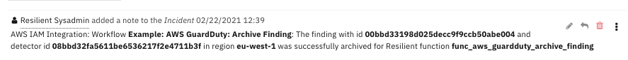
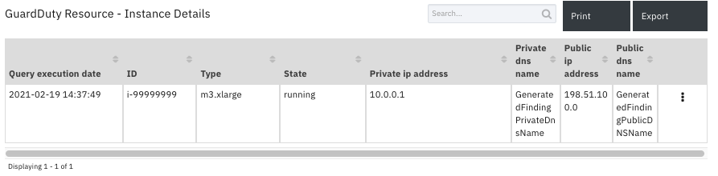
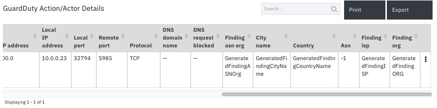

<!--
  This README.md is generated by running:
  "resilient-sdk docgen -p fn_aws_guardduty"

  It is best edited using a Text Editor with a Markdown Previewer. VS Code
  is a good example. Checkout https://guides.github.com/features/mastering-markdown/
  for tips on writing with Markdown

  If you make manual edits and run docgen again, a .bak file will be created

  Store any screenshots in the "doc/screenshots" directory and reference them like:
  

  NOTE: If your app is available in the container-format only, there is no need to mention the integration server in this readme.
-->

# None

## Table of Contents
- [Release Notes](#release-notes)
- [Overview](#overview)
  - [Key Features](#key-features)
- [Requirements](#requirements)
  - [Resilient platform](#resilient-platform)
  - [Cloud Pak for Security](#cloud-pak-for-security)
  - [Proxy Server](#proxy-server)
- [Installation](#installation)
  - [Install](#install)
  - [App Configuration](#app-configuration)
  - [Custom Layouts](#custom-layouts)
- [Poller - AWS GuardDuty: Escalate Findings](#poller---aws-guardduty-escalate-findings)
- [Function - AWS GuardDuty: Refresh Finding](#function---aws-guardduty-refresh-finding)
- [Function - AWS GuardDuty: Archive finding](#function---aws-guardduty-archive-finding)
- [Data Table - GuardDuty Finding Overview](#data-table---guardduty-finding-overview)
- [Data Table - GuardDuty Resource Affected](#data-table---guardduty-resource-affected)
- [Data Table - GuardDuty Resource - Instance Details](#data-table---guardduty-resource---instance-details)
- [Data Table - GuardDuty Resource - Access Key Details](#data-table---guardduty-resource---access-key-details)
- [Data Table - GuardDuty Resource - S3 Bucket Details](#data-table---guardduty-resource---s3-bucket-details)
- [Data Table - GuardDuty Action/Actor Details](#data-table---guardduty-actionactor-details)
- [Custom Fields](#custom-fields)
- [Custom Artifact Types](#custom-artifact-types)
- [Rules](#rules)
- [Troubleshooting & Support](#troubleshooting--support)
---

## Release Notes
<!--
  Specify all changes in this release. Do not remove the release 
  notes of a previous release
-->
| Version | Date | Notes |
| ------- | ---- | ----- |
| 1.0.0 | 02/2021 | Initial Release |

---

## Overview
<!--
  Provide a high-level description of the function itself and its remote software or application.
  The text below is parsed from the "description" and "long_description" attributes in the setup.py file
-->
**Amazon AWS GuardDuty Integration for Resilient.**

 

Amazon AWS GuardDuty is a continuous security monitoring service that identifies unexpected and potentially unauthorized and malicious activity within an AWS environment. 
GuardDuty informs the user of the status of their AWS environment by producing security findings that can be viewed in the GuardDuty console.
A finding is a potential security issue discovered by GuardDuty.

The Amazon AWS GuardDuty Integration for Resilient allows you to process and respond to GuardDuty findings within the IBM Resilient Platform.
        
### Key Features
<!--
  List the Key Features of the Integration
-->
The GuardDuty Integration provides the following functionality:
* A poller which gathers current findings from GuardDuty and escalates to the Resilient platform as incidents.
* A function to archive a GuardDuty finding when the corresponding Resilient incident is closed.
* A function to refresh a Resilient incident with the latest information from the corresponding GuardDuty finding.
* Close Resilient incidents if the corresponding GuardDuty findings are archived.
* Archive GuardDuty findings if the corresponding Resilient incidents are closed.
* Trigger a refresh for a Resilient incident if the corresponding GuardDuty finding gets updated. 
* A refresh of Resilient incidents can be executed manually.
---

## Requirements
<!--
  List any Requirements 
-->
This app supports the IBM Resilient SOAR Platform and the IBM Cloud Pak for Security.

### Resilient platform
The Resilient platform supports two app deployment mechanisms, App Host and integration server.

If deploying to a Resilient platform with an App Host, the requirements are:
* Resilient platform >= `39.0.6328`.
* The app is in a container-based format (available from the AppExchange as a `zip` file).

If deploying to a Resilient platform with an integration server, the requirements are:
* Resilient platform >= `39.0.6328`.
* The app is in the older integration format (available from the AppExchange as a `zip` file which contains a `tar.gz` file).
* Integration server is running `resilient_circuits>=35.0.0,<v39.0.0`.
* If using an API key account, make sure the account provides the following minimum permissions: 
  | Name | Permissions |
  | ---- | ----------- |
  | Org Data | Read |
  | Function | Read |
  | incident | create |
  | all_incidents | Read |

The following Resilient platform guides provide additional information: 
* _App Host Deployment Guide_: provides installation, configuration, and troubleshooting information, including proxy server settings. 
* _Integration Server Guide_: provides installation, configuration, and troubleshooting information, including proxy server settings.
* _System Administrator Guide_: provides the procedure to install, configure and deploy apps. 

The above guides are available on the IBM Knowledge Center at [ibm.biz/resilient-docs](https://ibm.biz/resilient-docs). On this web page, select your Resilient platform version. On the follow-on page, you can find the _App Host Deployment Guide_ or _Integration Server Guide_ by expanding **Resilient Apps** in the Table of Contents pane. The System Administrator Guide is available by expanding **System Administrator**.

### Cloud Pak for Security
If you are deploying to IBM Cloud Pak for Security, the requirements are:
* IBM Cloud Pak for Security >= 1.4.
* Cloud Pak is configured with an App Host.
* The app is in a container-based format (available from the AppExchange as a `zip` file).

The following Cloud Pak guides provide additional information: 
* _App Host Deployment Guide_: provides installation, configuration, and troubleshooting information, including proxy server settings. From the Table of Contents, select Case Management and Orchestration & Automation > **Orchestration and Automation Apps**.
* _System Administrator Guide_: provides information to install, configure, and deploy apps. From the IBM Cloud Pak for Security Knowledge Center table of contents, select Case Management and Orchestration & Automation > **System administrator**.

These guides are available on the IBM Knowledge Center at [ibm.biz/cp4s-docs](https://ibm.biz/cp4s-docs). From this web page, select your IBM Cloud Pak for Security version. From the version-specific Knowledge Center page, select Case Management and Orchestration & Automation.

### Proxy Server
The app **does** support a proxy server.

---

## Installation

### Install
* To install or uninstall an App or Integration on the _Resilient platform_, see the documentation at [ibm.biz/resilient-docs](https://ibm.biz/resilient-docs).
* To install or uninstall an App on _IBM Cloud Pak for Security_, see the documentation at [ibm.biz/cp4s-docs](https://ibm.biz/cp4s-docs) and follow the instructions above to navigate to Orchestration and Automation.

### App Configuration
The following table provides the settings you need to configure the app. These settings are made in the app.config file. See the documentation discussed in the Requirements section for the procedure.

| Config | Required | Example | Description |
| ------ | :------: | ------- | ----------- |
| **aws_gd_access_key_id** | Yes | `ABCD1EFGHI2JK3L4MNOP` | *AWS access key id of user with programmatic (API) access to AWS GuardDuty services for an AWS account. Note: User must have sufficent permissions to be able to manage GuardDuty resources for the AWS account.* |
| **aws_gd_secret_access_key** | Yes | `aBcdeFGH/iJkl1MNo2P3Q4rs5tuV6wXYZAbc+Def` | *AWS secret access key used for programmatic (API) access to AWS services.* |
| **aws_gd_master_region** | Yes | `us-west-1` | *Default or master region for the integration.* |
| **aws_gd_regions** | Yes | `"^us.*"` | *Filter by GuardDuty region names. Can be a string or regular expression.* |
| **aws_gd_regions_interval** | Yes | `60` | *Interval to refresh regions information (in minutes).* |
| **aws_gd_polling_interval** | Yes | `15` | *Interval to poll GuardDuty for findings (in minutes).* |
| **aws_gd_severity_threshold** | No | `7` | *Severity threshold (int) to use in criterion to filter findings .* |
| **aws_gd_lookback_interval** | No | `60` | *How long, (in minutes) to check back for previous findings at startup. Filter to process only more recent findings.* |
| **aws_gd_close_incident_template** | No | `` | *User defined JSON template file to use for closing Resilient incidents.* |
| **http_proxy** | No | `http://proxy:80` | *Optional setting for an http proxy if required.*  |
| **https_proxy** | No | `https://proxy:443` | *Optional setting for an https proxy if required.* |

### Custom Layouts
<!--
  Use this section to provide guidance on where the user should add any custom fields and data tables.
  You may wish to recommend a new incident tab.
  You should save a screenshot "custom_layouts.png" in the doc/screenshots directory and reference it here
-->
Import the Data Tables and Custom Fields as shown in the screenshot below.

Configure the Incident Details tab layout to display the AWS GuardDuty information as follows:
1. Navigate to the ‘Customization Settings’ and select the Layouts tab.
2. Click on ‘Incident Tabs’.
3. Create new heading 'AWS GuardDuty Properties' in the Details tab.
4. Drag and Drop the GuardDuty custom properties under the new heading.

The following screenshot shows the GuardDuty fields added to the Details tab.

  


5. Add a new incident tab named ‘AWS GuardDuty Details’.
6. Drag and drop the GuardDuty data tables under the new tab.
7. Click Save.

The following screenshot shows the GuardDuty data tables added to the GuardDuty tab:

  

---
## Poller - AWS GuardDuty: Escalate Findings
The GuardDuty integration poller starts querying GuardDuty for findings as soon as the app begins running.

The poller provide the following functionality.

* For any new findings discovered, creates a  matching incident in the Resilient platform. 
* Enhances the incidents by adding artifacts, data tables and a note with data from the findings. The note includes the JSON content of the finding.
* Can be configured to filter the findings, which are escalated to the Resilient incidents.  
* Closes Resilient incidents if the corresponding GuardDuty findings are archived.
* Archives GuardDuty findings if the corresponding Resilient incidents are closed.
* Triggers a refresh of GuardDuty information for a Resilient incident if the corresponding GuardDuty finding is updated.

The following screenshot shows examples of Resilient incidents created by the poller from GuardDuty findings:

  
  
The following screenshot shows an example of a Resilient incident Details tab created by the poller:

  
  
The following screenshot shows an example of GuardDuty finding custom properties in the Details tab of a Resilient incident created by the poller:

   

The following screenshot shows examples of artifacts added to a Resilient incident created by the poller:

   

The following screenshot shows an example of a note added to a Resilient incident created by the poller:

   

Note: See the data tables section for examples of data tables added by the poller.

---

## Function - AWS GuardDuty: Refresh Finding
Resilient function to refresh AWS GuardDuty finding details in an incident.

  
  
The function provides the following functionality.

* Updates incident fields such as the `aws_guardduty_count` , `aws_guardduty_finding_updated_at` and  `aws_guardduty_severity`.
* Refreshes all related data tables of the Resilient incident.
* Adds new or missing artifacts discovered in the GuardDuty finding.
* Adds two notes to the Resilient incident. One of the notes includes the JSON refreshed content of the finding.

The following screenshot shows an example of data tables updated by the function:

   

The following screenshot shows an example of notes added to a Resilient incident created by the poller:

   


<details><summary>Inputs:</summary>
<p>

| Name | Type | Required | Example | Tooltip |
| ---- | :--: | :------: | ------- | ------- |
| `aws_gd_detector_id` | `text` | No | `-` | AWS GuardDuty detector ID. |
| `aws_gd_finding_id` | `text` | No | `-` | AWS GuardDuty finding ID. |
| `aws_gd_region` | `text` | No | `-` | AWS GuardDuty region. |
| `incident_id` | `number` | No | `-` | Resilient incident ID. |

</p>
</details>

<details><summary>Outputs:</summary>
<p>

```python
results = {
    # TODO: Copy and paste an example of the Function Output within this code block.
    # To view the output of a Function, run resilient-circuits in DEBUG mode and invoke the Function. 
    # The Function results will be printed in the logs: "resilient-circuits run --loglevel=DEBUG"
}
```

</p>
</details>

<details><summary>Example Pre-Process Script:</summary>
<p>

```python
inputs.aws_gd_region = incident.properties.aws_guardduty_region
inputs.aws_gd_detector_id = incident.properties.aws_guardduty_detector_id
inputs.aws_gd_finding_id = incident.properties.aws_guardduty_finding_id
inputs.incident_id = incident.id
```

</p>
</details>

<details><summary>Example Post-Process Script:</summary>
<p>

```python
##  wf_aws_guardduty_refresh_finding ##
# Example result:
"""
Result: { 'version': '1.0',
          'success': True,
          'reason': None,
          'content': {'payload': {'name': 'AWS GuardDuty: API GeneratedFindingAPIName was invoked from an IP address on a custom threat list.',
                                  'description': {'format': 'text', 'content': 'An API was used to access a bucket from an IP address on a custom threat list.'},
                                  'discovered_date': '2020-11-25T13:46:37.960Z',
                                  'severity_code': 'Low',
                                  'properties': {'aws_guardduty_finding_id': '60baffd3f9042e38640f2300d5c5a631',
                                                 'aws_guardduty_finding_arn': 'arn:aws:guardduty:us-west-2:834299573936:detector/f2baedb0ac74f8f42fc929e15f56da6a/finding/60baffd3f9042e38640f2300d5c5a631',
                                                 'aws_guardduty_finding_type': 'UnauthorizedAccess:S3/MaliciousIPCaller.Custom',
                                                 'aws_guardduty_finding_updated_at': '2020-11-26T15:18:12.620Z', 'aws_guardduty_region': 'us-west-2',
                                                 'aws_guardduty_resource_type': 'S3Bucket', 'aws_guardduty_count': 4,
                                                 'aws_guardduty_detector_id': 'f2baedb0ac74f8f42fc929e15f56da6a'},
                                  'artifacts': [],
                                  'comments': [{'text': {'format': 'text', 'content': "AWS GuardDuty finding Payload:\n<FINDING_PAYLOAD_AS_STRING>"}}]

                                 },
                      "data_tables": {"gd_action_details": [{"cells": {"action_type": {"value": "AWS_API_CALL"},
                                                             "action_api": {"value": "GeneratedFindingAPIName"},
                                                             "event_first_seen": {"value": "2020-11-25T13:46:37.960Z"},
                                                             "event_last_seen": {"value": "2020-11-26T15:18:12.620Z"},
                                                            "actor_caller_type": {"value": "Remote IP"}, "city_name": {"value": "GeneratedFindingCityName"}, "country_name": {"value": "GeneratedFindingCountryName"}, "asn": {"value": "-1"}, "asn_org": {"value": "GeneratedFindingASNOrg"}, "isp": {"value": "GeneratedFindingISP"}, "org": {"value": "GeneratedFindingORG"}, "action_service_name": {"value": "GeneratedFindingAPIServiceName"}, "remote_ip": {"value": "198.51.100.0"}}}],
                                     "gd_resource_affected": [{"cells": {"resource_type": {"value": "S3Bucket"}, "instance_id": {"value": "i-99999999"}, "instance_type": {"value": "m3.xlarge"}, "instance_state": {"value": "running"}, "resource_role": {"value": "TARGET"}, "instance_private_ip": {"value": "10.0.0.1"}, "instance_private_dns": {"value": "GeneratedFindingPrivateName"}, "instance_public_ip": {"value": "198.51.100.0"}, "instance_public_dns": {"value": "GeneratedFindingPublicDNSName"}, "s3bucket_name": {"value": "bucketName"}, "s3bucket_owner": {"value": "CanonicalId of Owner"}}}]

                      }}',
            'inputs': {'incident_id': 2168, 'aws_gd_finding_id': '60baffd3f9042e38640f2300d5c5a631',
                       'aws_gd_region': 'us-west-2', 'aws_gd_detector_id': 'f2baedb0ac74f8f42fc929e15f56da6a'},
            'metrics': {'version': '1.0', 'package': 'fn-aws-guardduty', 'package_version': '1.0.0',
                        'host': 'Johnp-MacBook-Pro-2.galway.ie.ibm.com', 'execution_time_ms': 10739,
                        'timestamp': '2021-01-18 16:51:10'}
}
"""
#  Globals
# List of fields in datatable for wf_aws_guardduty_refresh_finding script
DATA_TABLES = ["gd_action_details", "gd_resource_affected"]
FN_NAME = "func_aws_guardduty_refresh_finding"
WF_NAME = "Example: AWS GuardDuty: Refresh Finding"
# Resilient artifact names to api names.
ARTIFACT_API_TO_TYPE = {
    "aws_iam_access_key_id": "AWS IAM Access Key ID",
    "aws_iam_user_name": "AWS IAM User Name",
    "aws_s3_bucket_name": "AWS S3 Bucket Name",
    "IP Address": "IP Address",
    "DNS Name": "DNS Name",
    "Port": "Port"
}
CONTENT = results.content
QUERY_EXECUTION_DATE = results["metrics"]["timestamp"]
if CONTENT:
    FINDING = CONTENT.finding
    PAYLOAD = CONTENT.payload
    ARTIFACTS = PAYLOAD.artifacts
    DATA_TABLES = CONTENT.data_tables

# Processing

def main():
    note_text = ''
    if CONTENT:
        note_text = "AWS GuardDuty Integration: Workflow <b>{0}</b>: Finding data returned for Resilient function " \
                    "<b>{2}</b>".format(WF_NAME, len(CONTENT), FN_NAME)

        update_fields()
        update_datatables()
        if ARTIFACTS:
            add_artifacts()
    else:
        note_text = "AWS GuardDuty Integration: Workflow <b>{0}</b>: No finding data returned for Resilient function " \
                    "<b>{2}</b>".format(WF_NAME, len(CONTENT), FN_NAME)

    incident.addNote(helper.createRichText(note_text))

def update_fields():
    incident.severity_code = PAYLOAD["severity_code"]
    incident.properties.aws_guardduty_finding_updated_at = PAYLOAD["properties"]["aws_guardduty_finding_updated_at"]
    incident.properties.aws_guardduty_count = str(PAYLOAD["properties"]["aws_guardduty_count"])
    incident.properties.aws_guardduty_archived = str(PAYLOAD["properties"]["aws_guardduty_archived"])
    incident.properties.aws_guardduty_severity = str(PAYLOAD["properties"]["aws_guardduty_severity"])

def update_datatables():
    for data_table in DATA_TABLES:
        for row in DATA_TABLES[data_table]:
            newrow = incident.addRow(data_table)
            newrow.query_execution_date = QUERY_EXECUTION_DATE
            data_table_fields = row["cells"]
            for f, v_info in data_table_fields.items():
                newrow[f] = v_info.value


def add_artifacts():
    for artifact in ARTIFACTS:
        artifact_type = ARTIFACT_API_TO_TYPE[artifact["type"]["name"]]
        artifact_value = artifact["value"]
        description = artifact["description"]["content"]
        incident.addArtifact(artifact_type, artifact_value, description)


if __name__ == "__main__":
    main()

```

</p>
</details>

---
## Function - AWS GuardDuty: Archive finding
Resilient function to archive an AWS GuardDuty finding when the corresponding incident is closed.

  

The function provides the following functionality.

* When a Resilient incident corresponding to a GuardDuty find is closed, an automatic rule `Example: AWS GuardDuty: Archive Finding` is triggered which executes the function.
* Archives the related GuardDuty finding.
* Adds a note to the Resilient incident.

The following screenshot shows an example of a note added to a Resilient incident created by the function:

 

<details><summary>Inputs:</summary>
<p>

| Name | Type | Required | Example | Tooltip |
| ---- | :--: | :------: | ------- | ------- |
| `aws_gd_detector_id` | `text` | No | `-` | AWS GuardDuty detector ID. |
| `aws_gd_finding_id` | `text` | No | `-` | AWS GuardDuty finding ID. |
| `aws_gd_region` | `text` | No | `-` | AWS GuardDuty region. |

</p>
</details>

<details><summary>Outputs:</summary>
<p>

```python
results = {
    # TODO: Copy and paste an example of the Function Output within this code block.
    # To view the output of a Function, run resilient-circuits in DEBUG mode and invoke the Function. 
    # The Function results will be printed in the logs: "resilient-circuits run --loglevel=DEBUG"
}
```

</p>
</details>

<details><summary>Example Pre-Process Script:</summary>
<p>

```python
inputs.aws_gd_region = incident.properties.aws_guardduty_region
inputs.aws_gd_detector_id = incident.properties.aws_guardduty_detector_id
inputs.aws_gd_finding_id = incident.properties.aws_guardduty_finding_id
```

</p>
</details>

<details><summary>Example Post-Process Script:</summary>
<p>

```python
##  wf_aws_guardduty_refresh_finding ##
# Example result:
"""
Good
====
Result: {'version': '1.0', 'success': True, 'reason': None,
         'content': {'status': 'ok'},
         'raw': '{"status": "ok"}',
         'inputs': {'aws_gd_finding_id': 'c2bb95a17b879bffc96c58f8a1689785', 'aws_gd_region': 'us-east-2',
                    'aws_gd_detector_id': '32b7017d2019dfe922abc4e07c3fdded'
                    },
         'metrics': {'version': '1.0', 'package': 'fn-aws-guardduty', 'package_version': '1.0.0',
         'host': 'myhost.ibm.com', 'execution_time_ms': 1310, 'timestamp': '2021-01-28 11:31:30'
        }
}
Error:
Result: {'version': '1.0', 'success': True, 'reason': None,
         'content': {'status': 'error',
                     'msg': 'An error occurred (BadRequestException) when calling the ArchiveFindings operation:
                     The request is rejected because the input detectorId is not owned by the current account.'},
                     'raw': '<content_as_string>',
         'inputs': {'aws_gd_finding_id': 'c2bb95a17b879bffc96c58f8a1689784', 'aws_gd_region': 'us-east-2',
                    'aws_gd_detector_id': '32b7017d2019dfe922abc4e07c3fdfff'
                    },
         'metrics': {'version': '1.0', 'package': 'fn-aws-guardduty', 'package_version': '1.0.0',
         'host': 'myhost.ibm.com', 'execution_time_ms': 1446, 'timestamp': '2021-01-28 11:34:53'
         }
}
"""
#  Globals
FN_NAME = "func_aws_guardduty_archive_finding"
WF_NAME = "Example: AWS GuardDuty: Archive Finding"
# Resilient artifact names to api names.
# Processing
# Processing
CONTENT = results.content
INPUTS = results.inputs
QUERY_EXECUTION_DATE = results["metrics"]["timestamp"]


# Processing

def main():
    note_text = ''
    if CONTENT:
        if CONTENT["status"] == "ok":
            note_text = "AWS IAM Integration: Workflow <b>{0}</b>: The finding with id <b>{1}</b> and detector id " \
                        "<b>{2}</b> in region <b>{3}</b> was successfully archived for Resilient function <b>{4}</b>"\
                .format(WF_NAME, INPUTS["aws_gd_finding_id"], INPUTS["aws_gd_detector_id"], INPUTS["aws_gd_region"], FN_NAME)
            # Update archived property.
            incident.properties.aws_guardduty_archived = "True"  
            

        elif CONTENT["status"] == "error":
            note_text = "AWS IAM Integration: Workflow <b>{0}</b>: The finding with id <b>{1}</b> and detector id " \
                        "<b>{2}</b> in region <b>{3}</b> failed archive with error <b>{4}</b> for Resilient function <b>{5}</b>"\
                .format(WF_NAME, INPUTS["aws_gd_finding_id"], INPUTS["aws_gd_detector_id"], INPUTS["aws_gd_region"],
                        CONTENT["msg"], FN_NAME)

        else:
            note_text = "AWS IAM Integration: Workflow <b>{0}</b>: The finding with id <b>{1}</b> and detector id " \
                        "<b>{2}</b> in region <b>{3}</b> got unexpected status <b>{4}</b> for Resilient function <b>{5}</b>" \
                .format(WF_NAME, INPUTS["aws_gd_finding_id"], INPUTS["aws_gd_detector_id"], CONTENT["status"], INPUTS["aws_gd_region"],
                        FN_NAME)

    else:
        note_text += "AWS IAM Integration: Workflow <b>{0}</b>: There was no result returned for Resilient function <b>{0}</b>"\
            .format(WF_NAME, FN_NAME)

    incident.addNote(helper.createRichText(note_text))

if __name__ == "__main__":
    main()

```

</p>
</details>

---

## Data Table - GuardDuty Finding Overview

 

#### API Name:
gd_finding_overview

#### Columns:
| Column Name | API Access Name | Type | Tooltip |
| ----------- | --------------- | ---- | ------- |
| Account ID | `account_id` | `text` | - |
| Count | `count` | `text` | - |
| Created at | `created_at` | `text` | - |
| Query Execution date | `query_execution_date` | `text` | - |
| Region | `region` | `text` | - |
| Resource ID | `resource_id` | `text` | - |
| Severity | `severity` | `text` | - |
| Updated at | `updated_at` | `text` | - |

---
## Data Table - GuardDuty Resource Affected

 

#### API Name:
gd_resource_affected

#### Columns:
| Column Name | API Access Name | Type | Tooltip |
| ----------- | --------------- | ---- | ------- |
| Instance ID | `instance_id` | `text` | - |
| Instance type | `instance_type` | `text` | - |
| Query execution date | `query_execution_date` | `text` | - |
| Resource role | `resource_role` | `text` | - |
| Resource type | `resource_type` | `text` | - |

---
## Data Table - GuardDuty Resource - Instance Details

 

#### API Name:
gd_instance_details

#### Columns:
| Column Name | API Access Name | Type | Tooltip |
| ----------- | --------------- | ---- | ------- |
| ID | `instance_id` | `text` | - |
| State | `instance_state` | `text` | - |
| Private dns name | `private_dns_name` | `text` | - |
| Private ip address | `private_ip` | `text` | - |
| Public dns name | `public_dns_name` | `text` | - |
| Public ip address | `public_ip` | `text` | - |
| Query execution date | `query_execution_date` | `text` | - |
| Type | `type` | `text` | - |

---
## Data Table - GuardDuty Resource - Access Key Details

 

#### API Name:
gd_access_key_details

#### Columns:
| Column Name | API Access Name | Type | Tooltip |
| ----------- | --------------- | ---- | ------- |
| Access key ID | `access_key_id` | `text` | - |
| Principal ID | `principal_id` | `text` | - |
| Query Execution date | `query_execution_date` | `text` | - |
| User name | `user_name` | `text` | - |
| User type | `user_type` | `text` | - |

---
## Data Table - GuardDuty Resource - S3 Bucket Details

 

#### API Name:
gd_s3_bucket_details

#### Columns:
| Column Name | API Access Name | Type | Tooltip |
| ----------- | --------------- | ---- | ------- |
| Bucket Arn | `bucket_arn` | `text` | - |
| Bucket name | `bucket_name` | `text` | - |
| Bucket owner | `bucket_owner` | `text` | - |
| Bucket Type | `bucket_type` | `text` | - |
| Effective Permission | `effective_permissions` | `text` | - |
| Encryption type | `encryption_type` | `text` | - |
| Kms master key ARN | `kms_master_key_arn` | `text` | - |
| Query execution date | `query_execution_date` | `text` | - |

---
## Data Table - GuardDuty Action/Actor Details

 
 

#### API Name:
gd_action_details

#### Columns:
| Column Name | API Access Name | Type | Tooltip |
| ----------- | --------------- | ---- | ------- |
| Action api | `action_api` | `text` | - |
| Action type | `action_type` | `text` | - |
| Actor caller type | `actor_caller_type` | `text` | - |
| Asn | `asn` | `text` | - |
| Finding asn org | `asn_org` | `text` | - |
| City name | `city_name` | `text` | - |
| Connection direction | `connection_direction` | `text` | - |
| Country | `country_name` | `text` | - |
| DNS request blocked | `dns_blocked` | `text` | - |
| DNS domain name | `dns_domain_name` | `text` | - |
| Event first Seen | `event_first_seen` | `text` | - |
| Event Last Seen | `event_last_seen` | `text` | - |
| Finding isp | `isp` | `text` | - |
| Local IP address | `local_ip` | `text` | - |
| Local port | `local_port` | `text` | - |
| Finding org | `org` | `text` | - |
| Protocol | `protocol` | `text` | - |
| Query Execution date | `query_execution_date` | `text` | - |
| Remote IP address | `remote_ip` | `text` | - |
| Remote port | `remote_port` | `text` | - |
| Service name | `service_name` | `text` | - |

---

## Custom Fields
| Label | API Access Name | Type | Prefix | Placeholder | Tooltip |
| ----- | --------------- | ---- | ------ | ----------- | ------- |
| AWS GuardDuty Finding Arn | `aws_guardduty_finding_arn` | `text` | `properties` | - | Arn of the GuardDuty finding. |
| AWS GuardDuty Resource Updated At | `aws_guardduty_finding_updated_at` | `text` | `properties` | - | The last time this finding was updated with new activity matching the pattern that prompted GuardDuty to generate this finding.  |
| AWS GuardDuty Resource Type | `aws_guardduty_resource_type` | `text` | `properties` | - | The type of the affected resource of the GuardDuty finding. This value is either AccessKey, S3 bucket or Instance.  |
| AWS GuardDuty Finding Id | `aws_guardduty_finding_id` | `text` | `properties` | - | A unique Finding ID for this GuardDuty finding type and set of parameters. New occurrences of activity matching this pattern will be aggregated to the same ID.  |
| AWS GuardDuty Region | `aws_guardduty_region` | `text` | `properties` | - | The AWS Region in which the GuardDuty finding was generated.  |
| AWS GuardDuty Archived | `aws_guardduty_archived` | `text` | `properties` | - |  A true or false value that indicates whether this is GuardDuty finding has been archived.  |
| AWS GuardDuty Detector Id | `aws_guardduty_detector_id` | `text` | `properties` | - | The detector ID where the GuardDuty finding was detected. |
| AWS GuardDuty Count | `aws_guardduty_count` | `text` | `properties` | - | The number of times GuardDuty has aggregated an activity matching this pattern to this finding ID.  |
| AWS GuardDuty Trigger Refresh | `aws_guardduty_trigger_refresh` | `boolean` | `properties` | False | Used by integration to trigger an refresh of GuardDuty incidents. |
| AWS GuardDuty Finding Type | `aws_guardduty_finding_type` | `text` | `properties` | - | The type of activity that triggered the GuardDuty finding. |

---

## Custom Artifact Types
| Display Name | API Access Name | Description |
| ------------ | --------------- | ----------- |
| AWS S3 Bucket Name | `aws_s3_bucket_name` | Amazon Web Services (AWS) S3 bucket name. |
| AWS IAM Access Key ID | `aws_iam_access_key_id` | Amazon Web Services (AWS) IAM access key id. |
| AWS IAM User Name | `aws_iam_user_name` | Amazon Web Services (AWS) IAM user name. |

---

## Rules
| Rule Name | Object | Workflow Triggered |
| --------- | ------ | ------------------ |
| Example: AWS GuardDuty: Refresh Finding Details | incident | `wf_aws_guardduty_refresh_finding` |
| Example: AWS GuardDuty: Archive Finding | incident | `wf_aws_guardduty_archive_finding` |
| Example: AWS GuardDuty: Update Finding Details | incident | `wf_aws_guardduty_refresh_finding` |

---

## Troubleshooting & Support
Refer to the documentation listed in the Requirements section for troubleshooting information.

### For Support
This is an IBM supported app. Please search https://ibm.com/mysupport for assistance.
