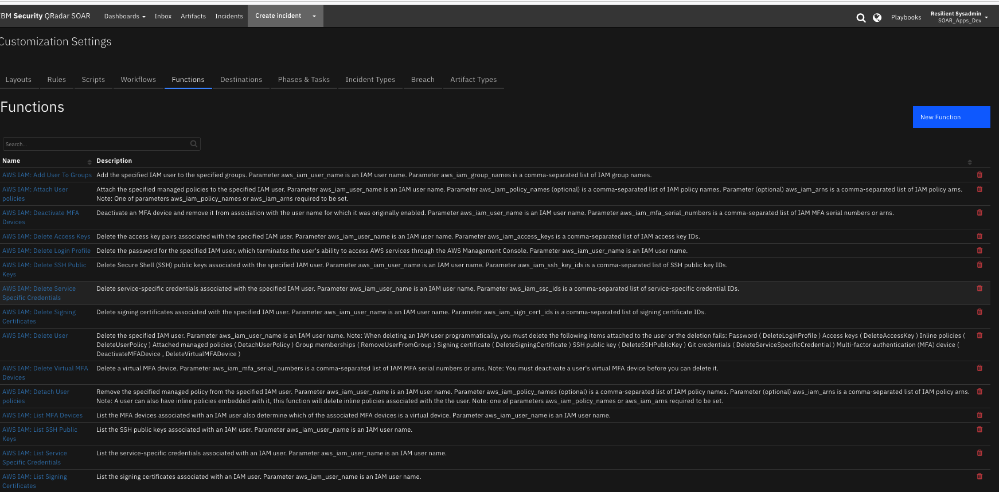

<!--
  This Install README.md is generated by running:
  "resilient-sdk docgen -p fn_aws_iam --only-install-guide"

  It is best edited using a Text Editor with a Markdown Previewer. VS Code
  is a good example. Checkout https://guides.github.com/features/mastering-markdown/
  for tips on writing with Markdown

  If you make manual edits and run docgen again, a .bak file will be created

  Store any screenshots in the "doc/screenshots" directory and reference them like:
  
-->

# fn-aws-iam Functions for IBM Resilient

- [Release Notes](#release-notes)
- [Overview](#overview)
- [Requirements](#requirements)
- [Installation](#installation)
- [Uninstall](#uninstall)
- [Troubleshooting](#troubleshooting)
- [Support](#support)

---

## Release Notes
<!--
  Specify all changes in this release. Do not remove the release 
  notes of a previous release
-->
### v1.0.0
* Initial Release

---

## Overview
<!--
  Provide a high-level description of the function itself and its remote software or application.
  The text below is parsed from the "description" and "long_description" attributes in the setup.py file
-->
**Amazon AWS IAM Integration for Resilient**

Amazon Web Services Identity and Access Management (AWS IAM) allows management of access to AWS services and resources securely. You can use IAM to create and manage AWS users and groups, and use permissions to allow or deny access to AWS resources. 
The AWS IAM integration with the Resilient platform allows you to query and update users or access keys for an AWS account.

You can execute the following types of queries:
* Get a list of users and associated items (login profile, access keys, groups, policies).
* Get a list of access keys.
* List objects associated with a user:
   * Access keys.
   * Groups.
   * Policies.
   * SSH public keys.
   * Service-specific credentials.
   * Signing certificates.
   * Active mfa devices (Virtual devices flagged).
   
You can also use the integration to make the following changes to an AWS IAM environment:
* Delete a user and delete or remove items associated with the user.
* Attach a user policy.
* Detach all policies for a user.
* Add a user to a group.
* Remove a user from all groups.
* Change a user profile password.
* Delete an access key.
* Delete all access keys for a user.
* Delete the login profile for a user.
* Delete all ssh Public Keys for a user.
* Delete all service-specific credentials for a user.
* Delete all signing certificates for a user.
* De-activate all active mfa devices for a user.
* Delete all active mfa virtual devices for a user.

The integration contains the following functions:
 
 
---

## Requirements
<!--
  List any Requirements 
-->
* Resilient platform >= `v35.0.5468`
* An Integration Server running:
  *  `resilient_circuits>=35.0.0`
  *  `resilient_lib>=35.0.0`
 
  * The minimum set of Resilient API permissions for this integration if using an API key account:
    * Edit Org Data
    * Incidents.Edit.Fields
    * Functions.Read
    * Functions.Edit
    * Layouts.Read
    * Other.ReadIncidentsActionInvocations
    * Scripts.Create
    * Scripts.Edit
    * Workflows.Create
    * Workflow.Edit
    
  * To set up an Integration Server see: [ibm.biz/res-int-server-guide](https://ibm.biz/res-int-server-guide)

* The following AWS IAM user permissions are required for this integration:
  * A user account which is not the AWS IAM root account user.
  * The user is added to an "Administrators" group to which is attached the `AdministratorAccess` policy.
  * An access key is created for the user.
  * The user access key ID and secret access key are used by the integration.

---

## Installation
* Download the `fn_aws_iam.zip`.
* Copy the `.zip` to your Integration Server and SSH into it.
* **Unzip** the package:
  ```
  $ unzip fn_aws_iam-x.x.x.zip
  ```
* **Change Directory** into the unzipped directory:
  ```
  $ cd fn_aws_iam-x.x.x
  ```
* **Install** the package:
  ```
  $ pip install fn_aws_iam-x.x.x.tar.gz
  ```
* Import the **configurations** into your app.config file:
  ```
  $ resilient-circuits config -u
  ```
* Import the fn_aws_iam **customizations** into the Resilient platform:
  ```
  $ resilient-circuits customize -y -l fn-aws-iam
  ```
* Open the config file, scroll to the bottom and edit your fn_aws_iam configurations:
  ```
  $ nano ~/.resilient/app.config
  ```
  | Config | Required | Example | Description |
  | ------ | :------: | ------- | ----------- |
  | **aws_iam_access_key_id** | Yes | `ABCD1EFGHI2JK3L4MNOP` | *AWS access key id of user with programmatic (API) access to AWS IAM services for an AWS account. Note: User must have sufficent permissions to be able to manage IAM resources for the AWS account.* |
  | **aws_iam_secret_access_key** | Yes | `aBcdeFGH/iJkl1MNo2P3Q4rs5tuV6wXYZAbc+Def` | *AWS secret access key used for programmatic (API) access to AWS services.* |
  | **http_proxy** | No | `http://proxy:80` | *Optional setting for an http proxy if required.* |
  | **https_proxy** | No | `http://proxy:80` | *Optional setting for an http proxy if required.* |
  
* **Save** and **Close** the app.config file.
* [Optional]: Run selftest to test the Integration you configured:
  ```
  $ resilient-circuits selftest -l fn-aws-iam
  ```
* **Run** resilient-circuits or restart the Service on Windows/Linux:
  ```
  $ resilient-circuits run
  ```

### Custom Layouts
<!--
  Use this section to provide guidance on where the user should add any custom fields and data tables.
  You may wish to recommend a new incident tab.
  You should save a screenshot "custom_layouts.png" in the doc/screenshots directory and reference it here
-->
* To use the functions, the Resilient playbook designer should create a new Incident tab containing the data tables. Drag the AWS IAM data tables on to the layout and click Save as shown in the screenshot below:
  

---

## Uninstall
* SSH into your Integration Server.
* **Uninstall** the package:
  ```
  $ pip uninstall fn-aws-iam
  ```
* Open the config file, scroll to the [fn_aws_iam] section and remove the section or prefix `#` to comment out the section.
* **Save** and **Close** the app.config file.

---

## Troubleshooting
There are several ways to verify the successful operation of a function.

### Resilient Action Status
* When viewing an incident, use the Actions menu to view **Action Status**.
* By default, pending and errors are displayed.
* Modify the filter for actions to also show Completed actions.
* Clicking on an action displays additional information on the progress made or what error occurred.

### Resilient Scripting Log
* A separate log file is available to review scripting errors.
* This is useful when issues occur in the pre-processing or post-processing scripts.
* The default location for this log file is: `/var/log/resilient-scripting/resilient-scripting.log`.

### Resilient Logs
* By default, Resilient logs are retained at `/usr/share/co3/logs`.
* The `client.log` may contain additional information regarding the execution of functions.

### Resilient-Circuits
* The log is controlled in the `.resilient/app.config` file under the section [resilient] and the property `logdir`.
* The default file name is `app.log`.
* Each function will create progress information.
* Failures will show up as errors and may contain python trace statements.

---

## Support
| Name | Version | Author | Support URL |
| ---- | ------- | ------ | ----------- |
| fn_aws_iam | 1.0.0 | IBM Resilient Support | https://ibm.com/mysupport |