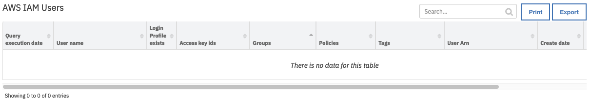

<!--
  This User README.md is generated by running:
  "resilient-circuits docgen -p fn_aws_iam --only-user-guide"

  It is best edited using a Text Editor with a Markdown Previewer. VS Code
  is a good example. Checkout https://guides.github.com/features/mastering-markdown/
  for tips on writing with Markdown

  If you make manual edits and run docgen again, a .bak file will be created

  Store any screenshots in the "doc/screenshots" directory and reference them like:
  
-->

# **User Guide:** fn_aws_iam_v1.0.0

## Table of Contents
- [Key Features](#key-features)
- [Function - AWS IAM: Delete Login Profile](#function---aws-iam-delete-login-profile)
- [Function - AWS IAM: List User Groups](#function---aws-iam-list-user-groups)
- [Function - AWS IAM: List User Tags](#function---aws-iam-list-user-tags)
- [Function - AWS IAM: List Users](#function---aws-iam-list-users)
- [Function - AWS IAM: Update Login Profile](#function---aws-iam-update-login-profile)
- [Data Table - AWS IAM Users](#data-table---aws-iam-users)
- [Rules](#rules)

---

## Key Features
<!--
  List the Key Features of the Integration
-->
* Key Feature 1
* Key Feature 2
* Key Feature 3

---

## Function - AWS IAM: Delete Login Profile
None

 

<details><summary>Inputs:</summary>
<p>

| Name | Type | Required | Example | Tooltip |
| ---- | :--: | :------: | ------- | ------- |
| `aws_iam_user_name` | `text` | No | `-` | - |

</p>
</details>

<details><summary>Outputs:</summary>
<p>

```python
results = {
    # TODO: Copy and paste an example of the Function Output within this code block.
    # To see view the output of a Function, run resilient-circuits in DEBUG mode and invoke the Function. 
    # The Function results will be printed in the logs: "resilient-circuits run --loglevel=DEBUG"
}
```

</p>
</details>

<details><summary>Example Pre-Process Script:</summary>
<p>

```python
inputs.aws_iam_user_name = row.UserName
```

</p>
</details>

<details><summary>Example Post-Process Script:</summary>
<p>

```python
##  AWS IAM - fn_aws_iam_delete_login_profile script ##
# Example result:
"""
OK
Result: {
         'version': '1.0', 'success': True, 'reason': None,
         'content': 'NoSuchEntity', 'raw': '"NoSuchEntity"',
         'inputs': {'aws_iam_user_name': 'iam_test_User'},
         'metrics': {'version': '1.0', 'package': 'fn-aws-iam', 'package_version': '1.0.0',
                     'host': 'myhost.ie.ibm.com', 'execution_time_ms': 9170, 'timestamp': '2019-11-18 16:24:17'
                     }
}
NosuchEntity
Result: {
         'version': '1.0', 'success': True, 'reason': None,
         'content': 'OK', 'raw': '"OK"',
         'inputs': {'aws_iam_user_name': 'iam_test_User'},
         'metrics': {'version': '1.0', 'package': 'fn-aws-iam', 'package_version': '1.0.0',
                     'host': 'myhost.ie.ibm.com', 'execution_time_ms': 9170, 'timestamp': '2019-11-18 16:24:17'
                     }
}
"""
#  Globals
# List of fields in datatable fn_aws_iam_delete_login_profile  script
DATA_TBL_FIELDS = ["Groups"]
FN_NAME = "fn_aws_iam_delete_login_profile"
WF_NAME = "Delete Login Profile"
# Processing
CONTENT = results.content
INPUTS = results.inputs
QUERY_EXECUTION_DATE = results["metrics"]["timestamp"]
note_text = ''

def main():
    note_text = ''
    if CONTENT is not None:
        if CONTENT == "OK":
            note_text = "AWS IAM Integration: : Workflow <b>{0}</b>: Login profile deleted for user <b>{1}</b> for " \
                        "Resilient function <b>{2}</b>".format(WF_NAME, INPUTS["aws_iam_user_name"], FN_NAME)
            row.LoginProfileExists = "NO"
        elif CONTENT == "NoSuchEntity":
            note_text = "AWS IAM Integration: : Workflow <b>{0}</b>: Login profile does not exist for user <b>{1}</b> for " \
                        "Resilient function <b>{2}</b>".format(WF_NAME, INPUTS["aws_iam_user_name"], FN_NAME)
            row.LoginProfileExists = "NO"
    else:
        note_text += "AWS IAM Integration: There were <b>no</b> results returned for Resilient function <b>{0}</b>"\
            .format(FN_NAME)

    incident.addNote(helper.createRichText(note_text))
if __name__ == "__main__":
    main()
```

</p>
</details>

---
## Function - AWS IAM: List User Groups
None

 

<details><summary>Inputs:</summary>
<p>

| Name | Type | Required | Example | Tooltip |
| ---- | :--: | :------: | ------- | ------- |
| `aws_iam_user_name` | `text` | No | `-` | - |

</p>
</details>

<details><summary>Outputs:</summary>
<p>

```python
results = {
    # TODO: Copy and paste an example of the Function Output within this code block.
    # To see view the output of a Function, run resilient-circuits in DEBUG mode and invoke the Function. 
    # The Function results will be printed in the logs: "resilient-circuits run --loglevel=DEBUG"
}
```

</p>
</details>

<details><summary>Example Pre-Process Script:</summary>
<p>

```python
inputs.aws_iam_user_name = row.UserName
```

</p>
</details>

<details><summary>Example Post-Process Script:</summary>
<p>

```python
##  AWS IAM - fn_aws_iam_list_user_groups script ##
# Example result:
"""
Result: {
         'version': '1.0', 'success': True, 'reason': None,
         'content': [{'Path': '/', 'GroupName': 'system-admins', 'GroupId': 'AGPAJUCG3BHM64OGVGCBG',
                      'Arn': 'arn:aws:iam::834299573936:group/system-admins', 'CreateDate': '2017-05-29 20:37:53'}],
                      'raw': '[{"Path": "/", "GroupName": "system-admins", "GroupId": "AGPAJUCG3BHM64OGVGCBG",
                      "Arn": "arn:aws:iam::834299573936:group/system-admins", "CreateDate": "2017-05-29 20:37:53"
                      }
                    ]',
         'inputs': {'aws_iam_user_name': 'iam_test_User'},
         'metrics': {'version': '1.0', 'package': 'fn-aws-iam', 'package_version': '1.0.0', 'host': 'myhost.ibm.com',
                     'execution_time_ms': 1070, 'timestamp': '2019-11-18 10:19:19'
                     }
}
"""
#  Globals
# List of fields in datatable fn_sep_get_command_status script
DATA_TBL_FIELDS = ["Groups"]
FN_NAME = "fn_aws_iam_list_user_groups"
WF_NAME = "List User Groups"
# Processing
CONTENT = results.content
QUERY_EXECUTION_DATE = results["metrics"]["timestamp"]
note_text = ''

def main():
    note_text = ''
    if CONTENT is not None:
        note_text = "AWS IAM Integration: There were <b>{0}</b> results returned for Resilient function " \
                   "<b>{1}</b>".format(len(CONTENT), FN_NAME)
        groups = []
        for g in range(len(CONTENT)):
            if CONTENT[g]["GroupName"] is not None:
                groups.append(CONTENT[g]["GroupName"])
        row.Groups = ",".join(groups)
    else:
        note_text += "AWS IAM Integration: There were <b>no</b> results returned for Resilient function <b>{0}</b>"\
            .format(FN_NAME)

    incident.addNote(helper.createRichText(note_text))
if __name__ == "__main__":
    main()
```

</p>
</details>

---
## Function - AWS IAM: List User Tags
None

 

<details><summary>Inputs:</summary>
<p>

| Name | Type | Required | Example | Tooltip |
| ---- | :--: | :------: | ------- | ------- |
| `aws_iam_user_name` | `text` | No | `-` | - |

</p>
</details>

<details><summary>Outputs:</summary>
<p>

```python
results = {
    # TODO: Copy and paste an example of the Function Output within this code block.
    # To see view the output of a Function, run resilient-circuits in DEBUG mode and invoke the Function. 
    # The Function results will be printed in the logs: "resilient-circuits run --loglevel=DEBUG"
}
```

</p>
</details>

<details><summary>Example Pre-Process Script:</summary>
<p>

```python
inputs.aws_iam_user_name = row.UserName
```

</p>
</details>

<details><summary>Example Post-Process Script:</summary>
<p>

```python
##  AWS IAM - fn_aws_iam_list_user_tags script ##
# Example result:
"""
Result: {
          'version': '1.0', 'success': True, 'reason': None,
          'content': [{'Key': 'Test_tag1', 'Value': 'A test TAG'},
                      {'Key': 'Tes Tag2', 'Value': 'Another test tag'}],
          'raw': '[{"Key": "Test_tag1", "Value": "A test TAG"}, {"Key": "Tes Tag2", "Value": "Another test tag"}]',
          'inputs': {'aws_iam_user_name': 'iam_johnpren_test_User'},
          'metrics': {'version': '1.0', 'package': 'fn-aws-iam', 'package_version': '1.0.0', 'host': 'myhost.ie.ibm.com',
                      'execution_time_ms': 1009, 'timestamp': '2019-11-18 12:19:06'
                     }
}
"""
import re
#  Globals
# List of fields in datatable fn_aws_iam_list_user_tags script
DATA_TBL_FIELDS = ["Groups"]
FN_NAME = "fn_aws_iam_list_user_tags"
WF_NAME = "List User Tags"
# Processing
CONTENT = results.content
QUERY_EXECUTION_DATE = results["metrics"]["timestamp"]
note_text = ''

def check_add_quotes(tag_name):
    # Using regex 
    # If spaces in tag name add quotes
    if re.search(r"\s", tag_name):
        return "'"+tag_name+"'"
    else:
        return tag_name

def main():
    note_text = ''
    if CONTENT is not None:
        note_text = "AWS IAM Integration: There were <b>{0}</b> results returned for Resilient function " \
                   "<b>{1}</b>".format(len(CONTENT), FN_NAME)
        tags = []
        for t in range(len(CONTENT)):
            if CONTENT[t]["Key"] is not None:
                tags.append(CONTENT[t]["Key"])
        row.Tags = ','.join(check_add_quotes(t) for t in tags)
    else:
        note_text += "AWS IAM Integration: There were <b>no</b> results returned for Resilient function <b>{0}</b>"\
            .format(FN_NAME)

    incident.addNote(helper.createRichText(note_text))
if __name__ == "__main__":
    main()
```

</p>
</details>

---
## Function - AWS IAM: List Users
None

 

<details><summary>Inputs:</summary>
<p>

| Name | Type | Required | Example | Tooltip |
| ---- | :--: | :------: | ------- | ------- |
| `aws_iam_user_name` | `text` | No | `-` | - |

</p>
</details>

<details><summary>Outputs:</summary>
<p>

```python
results = {
    # TODO: Copy and paste an example of the Function Output within this code block.
    # To see view the output of a Function, run resilient-circuits in DEBUG mode and invoke the Function. 
    # The Function results will be printed in the logs: "resilient-circuits run --loglevel=DEBUG"
}
```

</p>
</details>

<details><summary>Example Pre-Process Script:</summary>
<p>

```python
note_text = "AWS IAM Integration: There were <b>{0}</b> results returned for Resilient function "
incident.addNote(helper.createRichText(note_text))
```

</p>
</details>

<details><summary>Example Post-Process Script:</summary>
<p>

```python
##  AWS IAM - fn_aws_iam_list_users script ##
# Example result:
"""
Result: {
            'version': '1.0', 'success': True, 'reason': None,
            'content': [{'Path': '/', 'UserName': 'iam_test_User', 'UserId': 'AIDA4EQBBG2YDOLTU6QSM',
                         'Arn': 'arn:aws:iam::123456789123:user/iam_test_User', 'CreateDate': '2019-11-05 15:54:43'},
                        {'Path': '/', 'UserName': 'iam_test_User_2', 'UserId': 'AIDA4EQBBG2YGZOQXT2JB',
                         'Arn': 'arn:aws:iam::123456789123:user/iam_test_User_2',
                         'CreateDate': '2019-10-31 16:23:07', 'PasswordLastUsed': '2019-11-12 10:55:42'}
                       ],
            'raw': '[{"Path": "/", "UserName": "iam_test_User", "UserId": "AIDA4EQBBG2YDOLTU6QSM", "Arn": "arn:aws:iam::834299573936:user/iam_test_User", "CreateDate": "2019-11-05 15:54:43"}, {"Path": "/", "UserName": "iam_test_User_2", "UserId": "AIDA4EQBBG2YGZOQXT2JB", "Arn": "arn:aws:iam::834299573936:user/iam_test_User_2", "CreateDate": "2019-10-31 16:23:07"}]',
            'inputs': {},
            'metrics': {'version': '1.0', 'package': 'fn-aws-iam', 'package_version': '1.0.0',
                        'host': 'myhost.ibm.com', 'execution_time_ms': 7951,
                        'timestamp': '2019-11-14 13:48:30'
                       }
}

"""
#  Globals
# List of fields in datatable fn_aws_iam_list_users script
DATA_TBL_FIELDS = ["query_execution_time", "UserName", "UserId", "Arn", "DefaultUser", "CreateDate", "LoginProfileExists", "PasswordLastUsed"]
FN_NAME = "fn_aws_iam_list_users"
WF_NAME = "List Users"
# Processing
CONTENT = results.content
QUERY_EXECUTION_DATE = results["metrics"]["timestamp"]
note_text = ''


def main():
    note_text = ''
    if CONTENT is not None:
        note_text = "AWS IAM Integration: There were <b>{0}</b> results returned for Resilient function " \
                   "<b>{1}</b>".format(len(CONTENT), FN_NAME)
        for u in range(len(CONTENT)):
            newrow = incident.addRow("aws_iam_users")
            newrow.query_execution_date = QUERY_EXECUTION_DATE
            for f in DATA_TBL_FIELDS:
                if CONTENT[u][f] is not None:
                    if isinstance(CONTENT[u][f], unicode) or isinstance(CONTENT[u][f], int) \
                            or isinstance(CONTENT[u][f], long) or len(CONTENT[u][f]) == 0:
                        if f == "DefaultUser" and not CONTENT[u][f]:
                            pass
                        else:
                          newrow[f] = CONTENT[u][f]
                    else:
                        newrow[f] = ','.join(CONTENT[u][f])
    else:
        note_text += "AWS IAM Integration: There were <b>no</b> results returned for Resilient function <b>{0}</b>"\
            .format(FN_NAME)

    incident.addNote(helper.createRichText(note_text))
if __name__ == "__main__":
    main()
```

</p>
</details>

---
## Function - AWS IAM: Update Login Profile
None

 

<details><summary>Inputs:</summary>
<p>

| Name | Type | Required | Example | Tooltip |
| ---- | :--: | :------: | ------- | ------- |
| `aws_iam_password` | `text` | No | `-` | - |
| `aws_iam_password_reset_required` | `boolean` | No | `-` | - |
| `aws_iam_user_name` | `text` | No | `-` | - |

</p>
</details>

<details><summary>Outputs:</summary>
<p>

```python
results = {
    # TODO: Copy and paste an example of the Function Output within this code block.
    # To see view the output of a Function, run resilient-circuits in DEBUG mode and invoke the Function. 
    # The Function results will be printed in the logs: "resilient-circuits run --loglevel=DEBUG"
}
```

</p>
</details>

<details><summary>Example Pre-Process Script:</summary>
<p>

```python
inputs.aws_iam_user_name = row.UserName
inputs.aws_iam_password = rule.properties.aws_iam_password
inputs.aws_iam_password_reset_required = rule.properties.aws_iam_password_reset_required
```

</p>
</details>

<details><summary>Example Post-Process Script:</summary>
<p>

```python
None
```

</p>
</details>

---

## Data Table - AWS IAM Users

 

#### API Name:
aws_iam_users

#### Columns:
| Column Name | API Access Name | Type | Tooltip |
| ----------- | --------------- | ---- | ------- |
| Arn | `Arn` | `text` | - |
| Create date | `CreateDate` | `text` | - |
| Default user | `DefaultUser` | `text` | - |
| Groups | `Groups` | `text` | - |
| Login Profile exists | `LoginProfileExists` | `text` | - |
| Password last used | `PasswordLastUsed` | `text` | - |
| Tags | `Tags` | `text` | - |
| User id | `UserId` | `text` | - |
| User name | `UserName` | `text` | - |
| Query execution date | `query_execution_date` | `text` | - |

---


## Rules
| Rule Name | Object | Workflow Triggered |
| --------- | ------ | ------------------ |
| Example: AWS IAM: Delete Login Profile | aws_iam_users | `wf_aws_iam_delete_login_profile` |
| Example: AWS IAM: List User Groups | aws_iam_users | `wf_aws_iam_list_user_groups` |
| Example: AWS IAM: List Users | incident | `wf_aws_iam_list_users` |
| Example: AWS IAM: List User Tags | aws_iam_users | `wf_aws_iam_list_user_tags` |
| Example: AWS IAM: Refresh User | aws_iam_users | `wf_aws_iam_refresh_user` |
| Example: AWS IAM: Update Login Profile | aws_iam_users | `wf_aws_iam_update_login_profile` |

---

<!--
## Inform Resilient Users
  Use this section to optionally provide additional information so that Resilient playbook 
  designer can get the maximum benefit of your integration.
-->