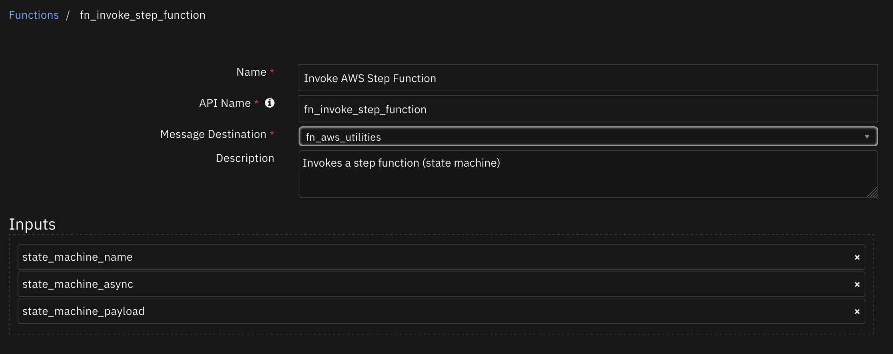
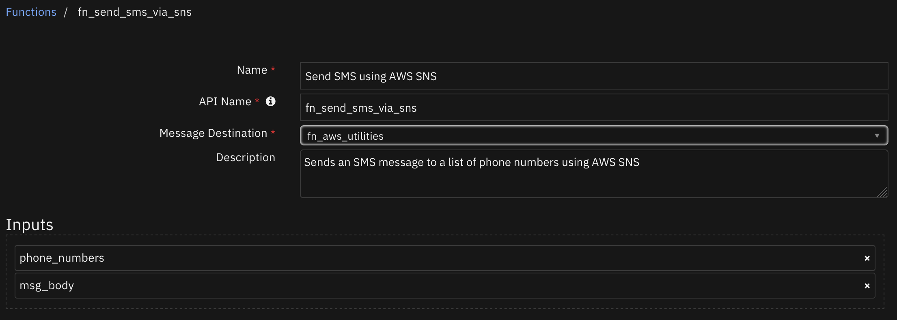
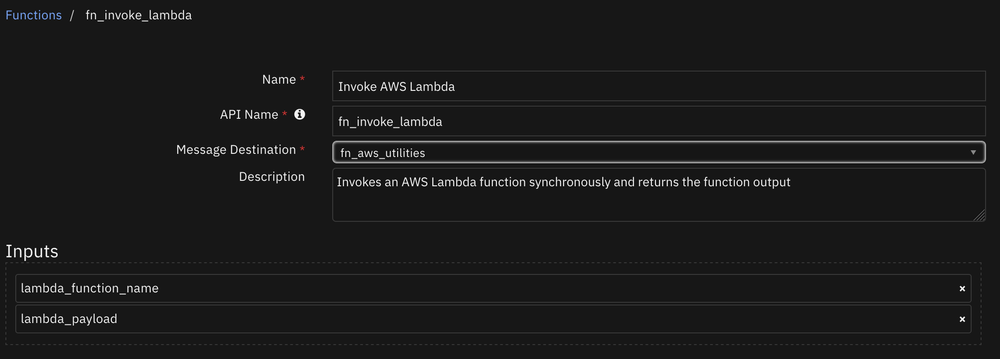
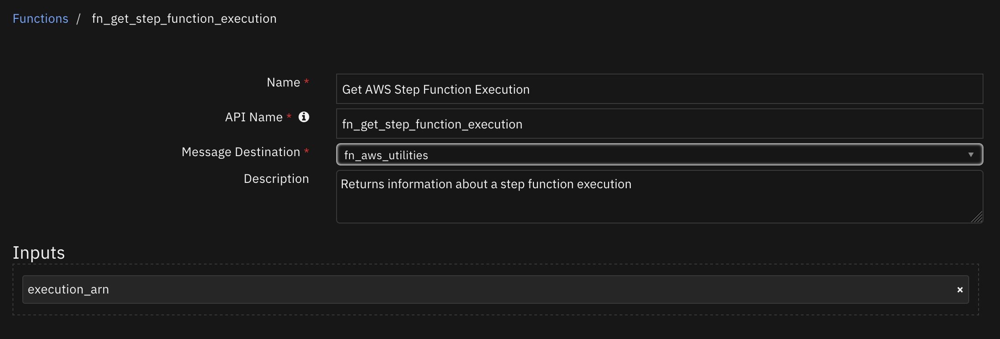

<!--
  This README.md is generated by running:
  "resilient-sdk docgen -p fn_aws_utilities"

  It is best edited using a Text Editor with a Markdown Previewer. VS Code
  is a good example. Checkout https://guides.github.com/features/mastering-markdown/
  for tips on writing with Markdown

  If you make manual edits and run docgen again, a .bak file will be created

  Store any screenshots in the "doc/screenshots" directory and reference them like:
  

  NOTE: If your app is available in the container-format only, there is no need to mention the integration server in this readme.
-->

# AWS Utilities

## Table of Contents
- [Release Notes](#release-notes)
- [Overview](#overview)
  - [Key Features](#key-features)
- [Requirements](#requirements)
  - [Resilient platform](#resilient-platform)
  - [Cloud Pak for Security](#cloud-pak-for-security)
  - [Proxy Server](#proxy-server)
  - [Python Environment](#python-environment)
- [Installation](#installation)
  - [Install](#install)
  - [App Configuration](#app-configuration)
- [Function - Invoke AWS Step Function](#function---invoke-aws-step-function)
- [Function - Send SMS using AWS SNS](#function---send-sms-using-aws-sns)
- [Function - Invoke AWS Lambda](#function---invoke-aws-lambda)
- [Function - Get AWS Step Function Execution](#function---get-aws-step-function-execution)
- [Rules](#rules)
- [Troubleshooting & Support](#troubleshooting--support)
---

## Release Notes
<!--
  Specify all changes in this release. Do not remove the release 
  notes of a previous release
-->
| Version | Date | Notes |
| ------- | ---- | ----- |
| 1.1.0 | 09/2021 | App Host support |
| 1.0.0 | 12/2018 | Initial Release |

---

## Overview
<!--
  Provide a high-level description of the function itself and its remote software or application.
  The text below is parsed from the "description" and "long_description" attributes in the setup.py file
-->
**Resilient Circuits Components for 'fn_aws_utilities'**

This app provides access to three AWS utility functions: lambdas, step functions, and SNS. 

### Key Features
<!--
  List the Key Features of the Integration
-->
* Get AWS Step Function Execution
* Invoke AWS Lambda
* Invoke AWS Step Function
* Send SMS using AWS SNS

---

## Requirements
<!--
  List any Requirements 
-->
This app supports the IBM Resilient SOAR Platform and the IBM Cloud Pak for Security.

### Resilient platform
The Resilient platform supports two app deployment mechanisms, App Host and integration server.

If deploying to a Resilient platform with an App Host, the requirements are:
* Resilient platform >= `41.0.6783`.
* The app is in a container-based format (available from the AppExchange as a `zip` file).

If deploying to a Resilient platform with an integration server, the requirements are:
* Resilient platform >= `41.0.6783`.
* The app is in the older integration format (available from the AppExchange as a `zip` file which contains a `tar.gz` file).
* Integration server is running `resilient_circuits>=30.0.0`.
* If using an API key account, make sure the account provides the following minimum permissions: 
  | Name | Permissions |
  | ---- | ----------- |
  | Org Data | Read |
  | Function | Read |

The following Resilient platform guides provide additional information: 
* _App Host Deployment Guide_: provides installation, configuration, and troubleshooting information, including proxy server settings. 
* _Integration Server Guide_: provides installation, configuration, and troubleshooting information, including proxy server settings.
* _System Administrator Guide_: provides the procedure to install, configure and deploy apps. 

The above guides are available on the IBM Knowledge Center at [ibm.biz/resilient-docs](https://ibm.biz/resilient-docs). On this web page, select your Resilient platform version. On the follow-on page, you can find the _App Host Deployment Guide_ or _Integration Server Guide_ by expanding **Resilient Apps** in the Table of Contents pane. The System Administrator Guide is available by expanding **System Administrator**.

### Cloud Pak for Security
If you are deploying to IBM Cloud Pak for Security, the requirements are:
* IBM Cloud Pak for Security >= 1.4.
* Cloud Pak is configured with an App Host.
* The app is in a container-based format (available from the AppExchange as a `zip` file).

The following Cloud Pak guides provide additional information: 
* _App Host Deployment Guide_: provides installation, configuration, and troubleshooting information, including proxy server settings. From the Table of Contents, select Case Management and Orchestration & Automation > **Orchestration and Automation Apps**.
* _System Administrator Guide_: provides information to install, configure, and deploy apps. From the IBM Cloud Pak for Security Knowledge Center table of contents, select Case Management and Orchestration & Automation > **System administrator**.

These guides are available on the IBM Knowledge Center at [ibm.biz/cp4s-docs](https://ibm.biz/cp4s-docs). From this web page, select your IBM Cloud Pak for Security version. From the version-specific Knowledge Center page, select Case Management and Orchestration & Automation.

### Proxy Server
The app **does** support a proxy server.

### Python Environment
Only Python 3.6 is supported.
Additional package dependencies may exist for each of these packages:
* boto3
* resilient_circuits>=30.0.0

---

## Installation

### Install
* To install or uninstall an App or Integration on the _Resilient platform_, see the documentation at [ibm.biz/resilient-docs](https://ibm.biz/resilient-docs).
* To install or uninstall an App on _IBM Cloud Pak for Security_, see the documentation at [ibm.biz/cp4s-docs](https://ibm.biz/cp4s-docs) and follow the instructions above to navigate to Orchestration and Automation.

### App Configuration
The following table provides the settings you need to configure the app. These settings are made in the app.config file. See the documentation discussed in the Requirements section for the procedure.

| Config | Required | Example | Description |
| ------ | :------: | ------- | ----------- |
| **aws_access_key_id** | Yes | `ABCD1234...` | *An access key ID from AWS* |
| **aws_secret_access_key** | Yes | `5EF6/GHIJK...` | *The AWS secret access key associated with the above access key ID* |
| **aws_region_name** | Yes | `us-east-1` | *Enter a description of the config here.* |
| **aws_sms_topic_name** | No |  | *Enter a description of the config here.* |


---

## Function - Invoke AWS Step Function
Invokes a step function (state machine)

 

<details><summary>Inputs:</summary>
<p>

| Name | Type | Required | Example | Tooltip |
| ---- | :--: | :------: | ------- | ------- |
| `state_machine_async` | `boolean` | No | `-` | Whether or not to wait for execution to complete |
| `state_machine_name` | `text` | Yes | `-` | Name of state machine to invoke |
| `state_machine_payload` | `text` | No | `-` | Payload to give the state machine |

</p>
</details>

<details><summary>Outputs:</summary>
<p>

```python
results = {
    'executionArn': 'string',
    'stateMachineArn': 'string',
    'name': 'string',
    'status': 'RUNNING'|'SUCCEEDED'|'FAILED'|'TIMED_OUT'|'ABORTED',
    'startDate': datetime(2015, 1, 1),
    'stopDate': datetime(2015, 1, 1),
    'input': 'string',
    'inputDetails': {
        'included': True|False
    },
    'output': 'string',
    'outputDetails': {
        'included': True|False
    },
    'traceHeader': 'string'
}
```

</p>
</details>

<details><summary>Example Pre-Process Script:</summary>
<p>

```python
None
```

</p>
</details>

<details><summary>Example Post-Process Script:</summary>
<p>

```python
if results and results.output:
  text = "Step Function (Synchronous) Result: \n\t" + str(results.output)
  note = helper.createPlainText(text)
  incident.addNote(note)
```

</p>
</details>

---
## Function - Send SMS using AWS SNS
Sends an SMS message to a list of phone numbers using AWS SNS

 

<details><summary>Inputs:</summary>
<p>

| Name | Type | Required | Example | Tooltip |
| ---- | :--: | :------: | ------- | ------- |
| `msg_body` | `text` | No | `-` | - |
| `phone_numbers` | `text` | Yes | `["11234567890","19876543211"]` | JSON array of phone numbers to text |

</p>
</details>

<details><summary>Outputs:</summary>
<p>

```python
results = {
    'message_id': "message_id_from_SNS_execution"
}
```

</p>
</details>

<details><summary>Example Pre-Process Script:</summary>
<p>

```python
numbers = []
if workflow.properties.incident_members is not None:
  owner = workflow.properties.incident_members.owner
  members = workflow.properties.incident_members.members
  
  if owner is not None:
    if owner['phone'] is not None and owner['phone'] != '':
      numbers.append(owner['phone'])
      
  for member in members:
    number = member['phone']
    if number is not None and number != '':
      numbers.append(number)
    
inputs.phone_numbers = ','.join(numbers)
inputs.msg_body = "[Example Workflow, Send SMS: Incident] New incident, " + incident.name + ", which you are a member of, has been created."
```

</p>
</details>

<details><summary>Example Post-Process Script:</summary>
<p>

```python
None
```

</p>
</details>

---
## Function - Invoke AWS Lambda
Invokes an AWS Lambda function synchronously and returns the function output

 

<details><summary>Inputs:</summary>
<p>

| Name | Type | Required | Example | Tooltip |
| ---- | :--: | :------: | ------- | ------- |
| `lambda_function_name` | `text` | Yes | `-` | Name of the AWS function to execute |
| `lambda_payload` | `text` | Yes | `-` | The payload to send to the AWS Lambda function |

</p>
</details>

<details><summary>Outputs:</summary>
<p>

```python
results = {
    'response_payload': 'lambda_result'
}
```

</p>
</details>

<details><summary>Example Pre-Process Script:</summary>
<p>

```python
None
```

</p>
</details>

<details><summary>Example Post-Process Script:</summary>
<p>

```python
if results and results.response_payload:
  text = "Python Addition Result: " + str(results.response_payload)
  note = helper.createPlainText(text)
  incident.addNote(note)
```

</p>
</details>

---
## Function - Get AWS Step Function Execution
Returns information about a step function execution

 

<details><summary>Inputs:</summary>
<p>

| Name | Type | Required | Example | Tooltip |
| ---- | :--: | :------: | ------- | ------- |
| `execution_arn` | `text` | Yes | `-` | State machine execution identifier |

</p>
</details>

<details><summary>Outputs:</summary>
<p>

```python
results = {
    'executionArn': 'string',
    'stateMachineArn': 'string',
    'name': 'string',
    'status': 'RUNNING'|'SUCCEEDED'|'FAILED'|'TIMED_OUT'|'ABORTED',
    'startDate': datetime(2015, 1, 1),
    'stopDate': datetime(2015, 1, 1),
    'input': 'string',
    'inputDetails': {
        'included': True|False
    },
    'output': 'string',
    'outputDetails': {
        'included': True|False
    },
    'traceHeader': 'string'
}
```

</p>
</details>

<details><summary>Example Pre-Process Script:</summary>
<p>

```python
if workflow.properties.execution_details is not None and workflow.properties.execution_details.executionArn is not None:
  inputs.execution_arn = workflow.properties.execution_details.executionArn
```

</p>
</details>

<details><summary>Example Post-Process Script:</summary>
<p>

```python
if results and results.output:
  text = "Step Function (Asynchronous) Result: \n\t" + str(results.output)
  note = helper.createPlainText(text)
  incident.addNote(note)
```

</p>
</details>

---


## Rules
| Rule Name | Object | Workflow Triggered |
| --------- | ------ | ------------------ |
| Example: Invoke AWS Lambda: Python Addition | incident | `example_invoke_aws_lambda_python_addition` |
| Example: Invoke AWS Step Function: Asynchronous | incident | `example_invoke_step_function_asynchronous` |
| Example: Send AWS SMS | incident | `example_send_sms_incident` |
| Example: Invoke AWS Step Function: Synchronous | incident | `example_invoke_step_function_synchronous` |

---

## Troubleshooting & Support
Refer to the documentation listed in the Requirements section for troubleshooting information.

### For Support
This is a IBM Community provided App. Please search the Community https://ibm.biz/resilientcommunity for assistance.
