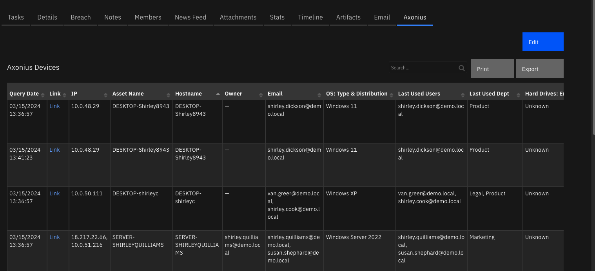
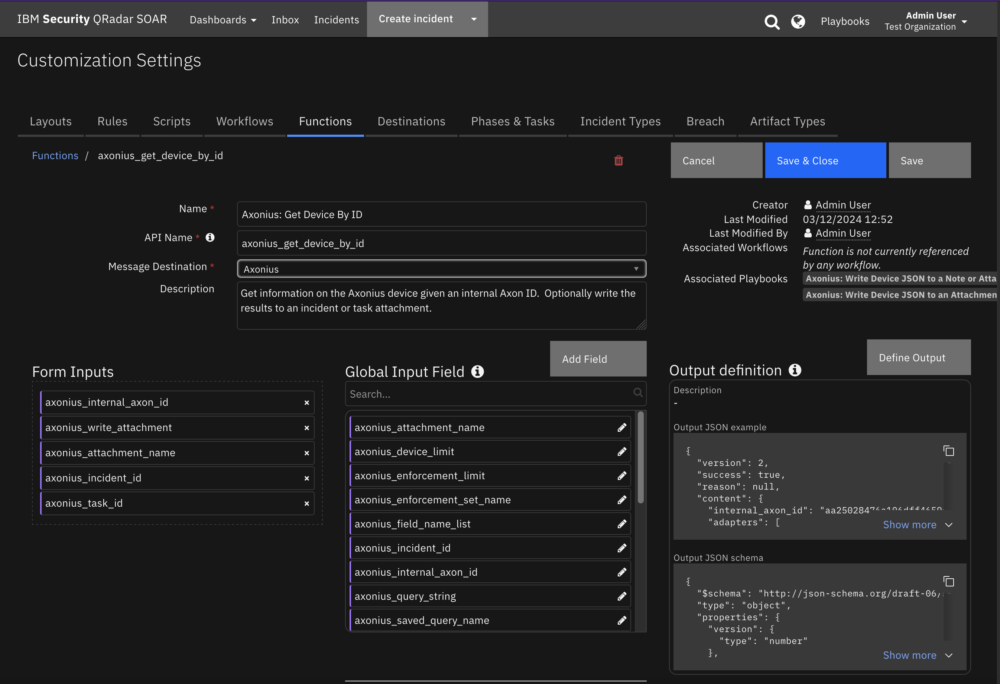
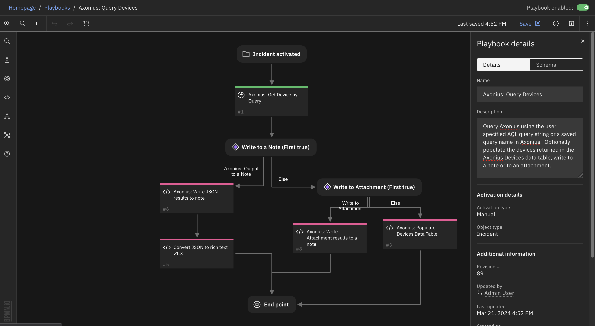
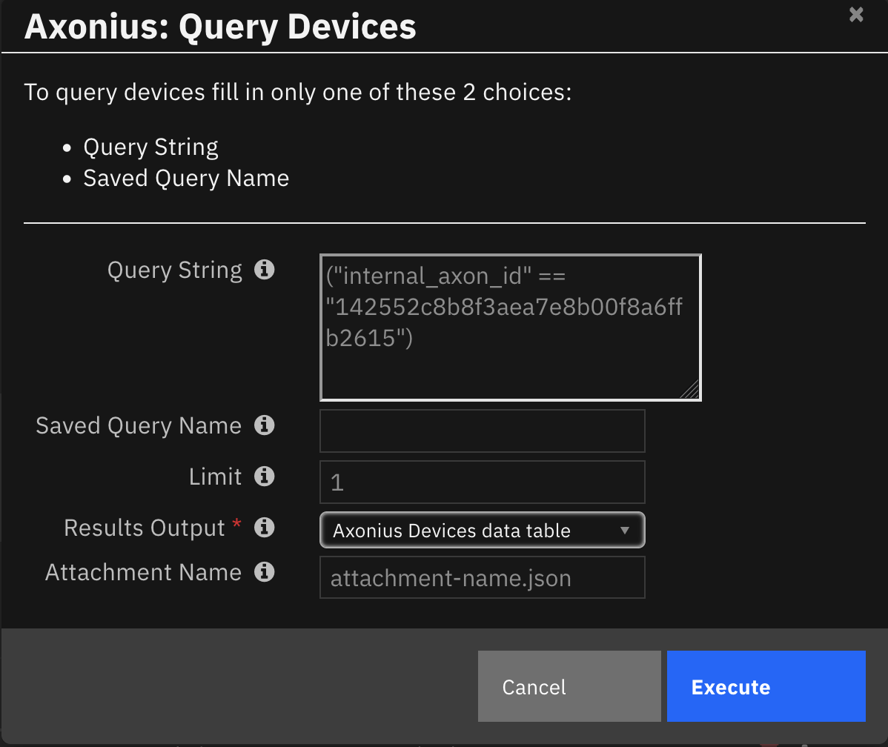
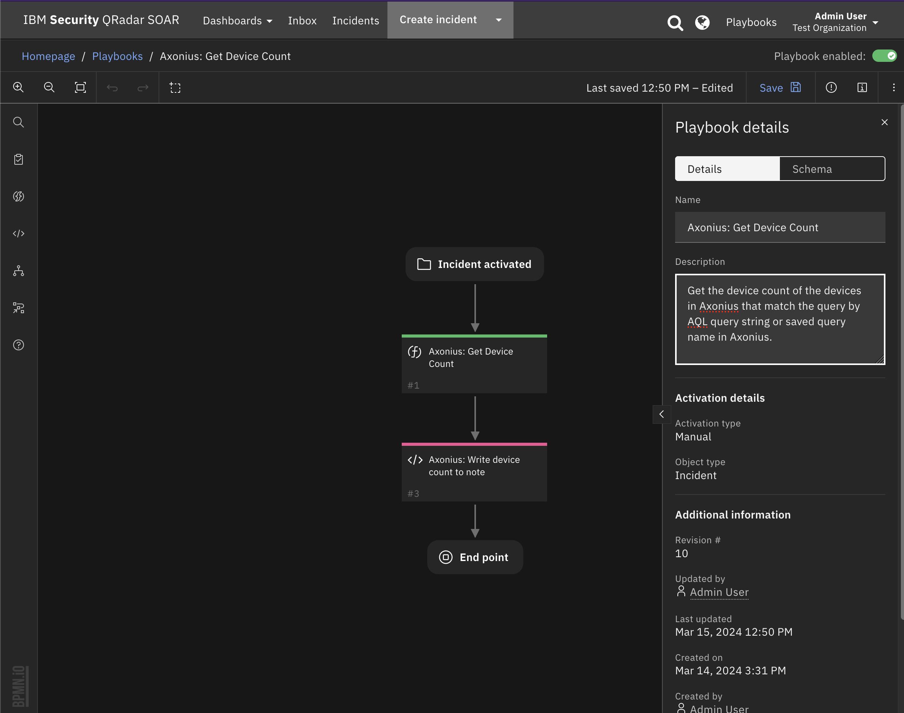
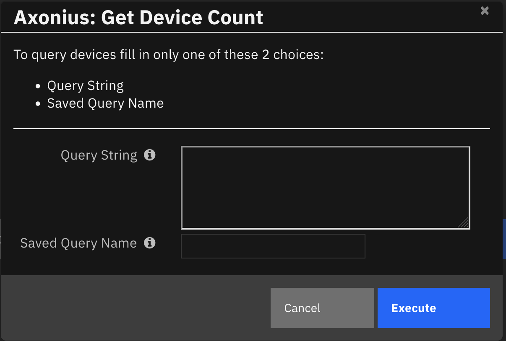
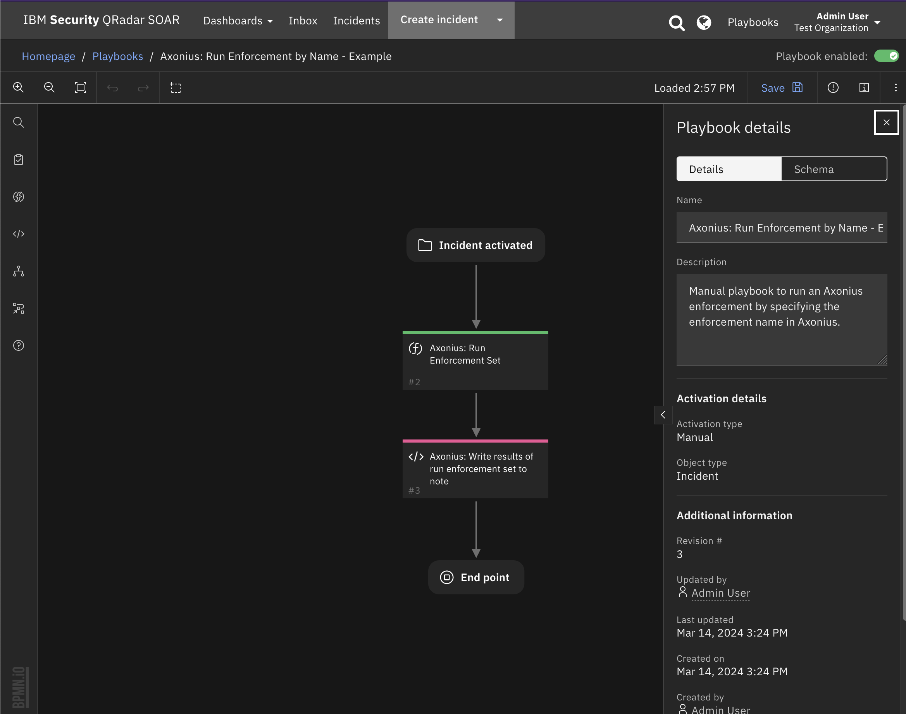
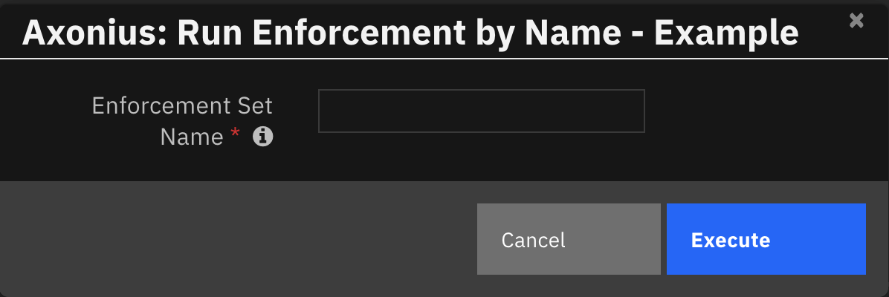
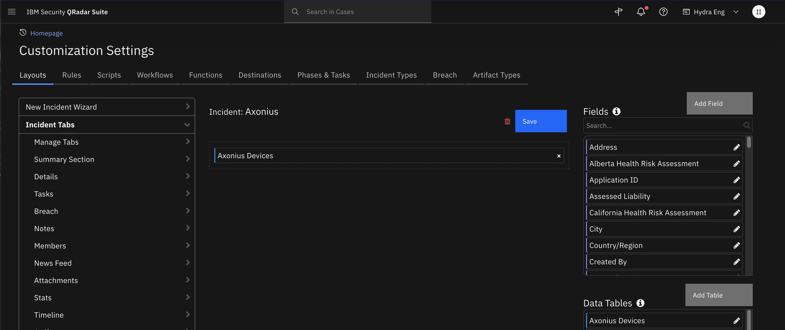

<!--
  This README.md is generated by running:
  "resilient-sdk docgen -p fn_axonius"

  This file was generated with resilient-sdk v51.0.1.0.695

  It is best edited using a Text Editor with a Markdown Previewer. VS Code
  is a good example. Checkout https://guides.github.com/features/mastering-markdown/
  for tips on writing with Markdown

  All fields followed by "::CHANGE_ME::"" should be manually edited

  If you make manual edits and run docgen again, a .bak file will be created

  Store any screenshots in the "doc/screenshots" directory and reference them like:
  

  NOTE: If your app is available in the container-format only, there is no need to mention the integration server in this readme.
-->

# Axonius


## Table of Contents
- [Axonius](#axonius)
  - [Table of Contents](#table-of-contents)
  - [Release Notes](#release-notes)
  - [Overview](#overview)
    - [Key Features](#key-features)
  - [Requirements](#requirements)
    - [SOAR platform](#soar-platform)
    - [Cloud Pak for Security](#cloud-pak-for-security)
    - [Proxy Server](#proxy-server)
    - [Python Environment](#python-environment)
    - [Axonius Development Version](#axonius-development-version)
      - [Prerequisites](#prerequisites)
      - [Configuration](#configuration)
    - [Get the API Key and Secret in Axonius](#get-the-api-key-and-secret-in-axonius)
  - [Installation](#installation)
    - [Install](#install)
    - [App Configuration](#app-configuration)
  - [Function - Axonius: Get Device By ID](#function---axonius-get-device-by-id)
  - [Function - Axonius: Get Device by Query](#function---axonius-get-device-by-query)
  - [Function - Axonius: Get Device Count](#function---axonius-get-device-count)
  - [Function - Axonius: Run Enforcement Set](#function---axonius-run-enforcement-set)
  - [Script - Axonius: Populate Devices Data Table](#script---axonius-populate-devices-data-table)
  - [Script - Convert JSON to rich text v1.3](#script---convert-json-to-rich-text-v13)
  - [Playbooks](#playbooks)
  - [Custom Layouts](#custom-layouts)
  - [Data Table - Axonius Devices](#data-table---axonius-devices)
      - [API Name:](#api-name)
      - [Columns:](#columns)
      - [Axonius Devices Data Table Limit](#axonius-devices-data-table-limit)
      - [Axonius Devices Data Table Field Names](#axonius-devices-data-table-field-names)
  - [Troubleshooting \& Support](#troubleshooting--support)
    - [For Support](#for-support)

---

## Release Notes
<!--
  Specify all changes in this release. Do not remove the release 
  notes of a previous release
-->
| Version | Date | Notes |
| ------- | ---- | ----- |
| 1.0.0 | 3/2024 | Initial Release |

---

## Overview
<!--
  Provide a high-level description of the function itself and its remote software or application.
  The text below is parsed from the "description" and "long_description" attributes in the setup.py file
-->
**Axonius Cybersecurity Asset Management**

This app provide Axonius device data enrichment to SOAR cases.

 

Provide Axonius device data enrichment to SOAR cases.

### Key Features
<!--
  List the Key Features of the Integration
-->
* Retrieve information on Axonius on device assets from artifacts in SOAR and add as a row in the Axonius Devices data table in a SOAR case. The following SOAR artifact types can be used to query devices in Axonius:
  * DNS Name
  * Email Recipient
  * Email Sender
  * IP Address
  * MAC Address
  * Service
* Query Axonius devices using an AQL (Axonius Query Language) string or a saved query name defined in Axonius and to add to the Axonius Devices data table or to a note or attachment in SOAR.
* Get the device count of an AQL device query.
* Access Axonius device data via live links from Axonius Devices data table in SOAR case.
* Write Axonius device JSON data to an attachment or a SOAR note from the Axonius Devices data table in SOAR.
* Refetch Axonius device information from the Axonius Devices data table to compare device query results over time.
* Create the following types of artifacts from a row in the Axonius Devices data table
  * IP Address
  * Service
  * System Name
* Run Axonius Enforcements by Name from a SOAR case.
---

## Requirements
<!--
  List any Requirements 
--> 
This app supports the IBM Security QRadar SOAR Platform and the IBM Security QRadar SOAR for IBM Cloud Pak for Security.

### SOAR platform
The SOAR platform supports two app deployment mechanisms, Edge Gateway (also known as App Host) and integration server.

If deploying to a SOAR platform with an App Host, the requirements are:
* SOAR platform >= `50.0.0`.
* The app is in a container-based format (available from the AppExchange as a `zip` file).

If deploying to a SOAR platform with an integration server, the requirements are:
* SOAR platform >= `50.0.0`.
* The app is in the older integration format (available from the AppExchange as a `zip` file which contains a `tar.gz` file).
* Integration server is running `resilient-circuits>=51.0.0.2.0`.
* If using an API key account, make sure the account provides the following minimum permissions: 
  | Name | Permissions |
  | ---- | ----------- |
  | Org Data | Read |
  | Function | Read |
  | Edit Incidents | Fields |
  | Layouts | Read |
  | Layouts | Edit |

The following SOAR platform guides provide additional information: 
* _Edge Gateway Deployment Guide_ or _App Host Deployment Guide_: provides installation, configuration, and troubleshooting information, including proxy server settings. 
* _Integration Server Guide_: provides installation, configuration, and troubleshooting information, including proxy server settings.
* _System Administrator Guide_: provides the procedure to install, configure and deploy apps. 

The above guides are available on the IBM Documentation website at [ibm.biz/soar-docs](https://ibm.biz/soar-docs). On this web page, select your SOAR platform version. On the follow-on page, you can find the _Edge Gateway Deployment Guide_, _App Host Deployment Guide_, or _Integration Server Guide_ by expanding **Apps** in the Table of Contents pane. The System Administrator Guide is available by expanding **System Administrator**.

### Cloud Pak for Security
If you are deploying to IBM Cloud Pak for Security, the requirements are:
* IBM Cloud Pak for Security >= `1.10.15`.
* Cloud Pak is configured with an Edge Gateway.
* The app is in a container-based format (available from the AppExchange as a `zip` file).

The following Cloud Pak guides provide additional information: 
* _Edge Gateway Deployment Guide_ or _App Host Deployment Guide_: provides installation, configuration, and troubleshooting information, including proxy server settings. From the Table of Contents, select Case Management and Orchestration & Automation > **Orchestration and Automation Apps**.
* _System Administrator Guide_: provides information to install, configure, and deploy apps. From the IBM Cloud Pak for Security IBM Documentation table of contents, select Case Management and Orchestration & Automation > **System administrator**.

These guides are available on the IBM Documentation website at [ibm.biz/cp4s-docs](https://ibm.biz/cp4s-docs). From this web page, select your IBM Cloud Pak for Security version. From the version-specific IBM Documentation page, select Case Management and Orchestration & Automation.

### Proxy Server
The app **does** support a proxy server.

### Python Environment
Python 3.6, Python 3.9 and Python 3.11 are supported.
Additional package dependencies may exist for each of these packages:
* resilient-circuits>=51.0.0.2.0

### Axonius Development Version

This app has been implemented using:
| Product Name | Product Version | API URL | API Version |
| ------------ | --------------- | ------- | ----------- |
| Axonius | 6_1_6_4 | NA | v2 |

#### Prerequisites
<!--
List any prerequisites that are needed to use with this endpoint solution. Remove any section that is unnecessary.
-->
* Axonius user account with an API key and secret.

#### Configuration
<!--
List any steps that are needed to configure the endpoint to use this app.
-->
### Get the API Key and Secret in Axonius
* Click on the `User Settings` in the lower left corner of the Axonius console

* Click on the `API Key` tab to copy the API key and secret.
  
  

---

## Installation

### Install
* To install or uninstall an App or Integration on the _SOAR platform_, see the documentation at [ibm.biz/soar-docs](https://ibm.biz/soar-docs).
* To install or uninstall an App on _IBM Cloud Pak for Security_, see the documentation at [ibm.biz/cp4s-docs](https://ibm.biz/cp4s-docs) and follow the instructions above to navigate to Orchestration and Automation.

### App Configuration
The following table provides the settings you need to configure the app. These settings are made in the app.config file. See the documentation discussed in the Requirements section for the procedure.

| Config | Required | Example | Description |
| ------ | :------: | ------- | ----------- |
| **api_key** | Yes | `<Axonius api-key>` | *Axonius API Key.* |
| **api_secret** | Yes | `<Axonius api-secret>` | *Axonius API Secret.* |
| **api_version** | Yes | `v2` | *REST API version.* |
| **endpoint_url** | Yes | `https://my-axonius-platform.on.axonius.com` | *Axonius Platform URL.* |

 ---

## Function - Axonius: Get Device By ID
Get information on the Axonius device given an internal Axon ID.  Optionally write the results to an incident or task attachment.

NOTE: The the JSON object returned from this function is very large, so the example playbook that uses this function writes the data to an attachment rather than a note.

 

<details><summary>Inputs:</summary>
<p>

| Name | Type | Required | Example | Tooltip |
| ---- | :--: | :------: | ------- | ------- |
| `axonius_attachment_name` | `text` | No | `-` | Name of the attachment to create in SOAR |
| `axonius_incident_id` | `number` | Yes | `-` | - |
| `axonius_internal_axon_id` | `text` | Yes | `-` | Axonius Internal Axon ID |
| `axonius_task_id` | `number` | No | `-` | Task to which attachment is attached. |
| `axonius_write_attachment` | `boolean` | Yes | `-` | Indicate whether the device JSON returned is written to an incident attachment. |

</p>
</details>

<details><summary>Outputs:</summary>
<p>

> **NOTE:** This example might be in JSON format, but `results` is a Python Dictionary on the SOAR platform.

```python
results = {
  "content": {
    "attachment_name": "Axonius-Device-Shirley-Quilliams-iMac.json"
  },
  "inputs": {
    "axonius_attachment_name": "Axonius-Device-Shirley-Quilliams-iMac.json",
    "axonius_incident_id": 2144,
    "axonius_internal_axon_id": "0de1ff00569723b2d11ec84665c4bd06",
    "axonius_task_id": null,
    "axonius_write_attachment": true
  },
  "metrics": {
    "execution_time_ms": 92192,
    "host": "mylaptop",
    "package": "fn-axonius",
    "package_version": "1.0.0",
    "timestamp": "2024-03-12 13:24:06",
    "version": "1.0"
  },
  "raw": null,
  "reason": null,
  "success": true,
  "version": 2.0
}
```

</p>
</details>

<details><summary>Example Function Input Script:</summary>
<p>

```python
inputs.axonius_internal_axon_id = row.axonius_id
inputs.axonius_write_attachment = True
inputs.axonius_attachment_name = "Axonius-Device-{0}.json".format(row.axonius_name)
inputs.axonius_incident_id = incident.id
inputs.axonius_task_id = None
```

</p>
</details>

<details><summary>Example Function Post Process Script:</summary>
<p>

```python
results = playbook.functions.results.get_device_results

inputs = results.get("inputs", None)
axonius_internal_axon_id = inputs.get("axonius_internal_axon_id", None)

if results.get("success", False):
  content = results.get("content", None)
  if content:
    attachment_name = content.get("attachment_name", None)
    note_text = f"<b>Axonius: Write Device JSON to Attachment:</b> wrote attachment: <b>{attachment_name}</b>."
  else:
    note_text = f"<b>Axonius: Write Device JSON to Attachment:</b> attachment was not written (no content) for {axonius_internal_axon_id}."
else:
    reason = results.get("reason", None)
    note_text = f"<b>Axonius: Write Device JSON to Attachment:</b> attachment was not written {reason}<br> for ID {axonius_internal_axon_id}."
    
incident.addNote(note_text)
```

</p>
</details>

---
## Function - Axonius: Get Device by Query
Get the devices in Axonius that match the specified Axonius (AQL) query string.  Optionally specify the list of Axonius field names to return for each device. If no fields names are specified, a default list of field names is returned .  Optionally specify the maximum number of devices to return.  If no limit it specified, the Axonius limit of 1000 is used in the query.  Optional parameters allow for writing the results to an incident or task attachment.

 


Activation form for the manual playbook `Axonius: Query Devices`:

 

<details><summary>Inputs:</summary>
<p>

| Name | Type | Required | Example | Tooltip |
| ---- | :--: | :------: | ------- | ------- |
| `axonius_attachment_name` | `text` | No | `-` | Name of the attachment to create in SOAR |
| `axonius_device_limit` | `number` | No | `-` | Maximum number of devices to return from the query.  |
| `axonius_field_name_list` | `textarea` | No | `List of field names to return.` | - |
| `axonius_incident_id` | `number` | Yes | `-` | - |
| `axonius_query_string` | `text` | No | `-` | Axonius Query string |
| `axonius_saved_query_name` | `text` | No | `-` | An Axonius Saved Query Name that identifies a query of devices in Axonius. |
| `axonius_task_id` | `number` | No | `-` | Task to which attachment is attached. |
| `axonius_write_attachment` | `boolean` | Yes | `-` | Indicate whether the device JSON returned is written to an incident attachment. |

</p>
</details>

<details><summary>Outputs:</summary>
<p>

> **NOTE:** This example might be in JSON format, but `results` is a Python Dictionary on the SOAR platform.

```python
results = {
  "content": {
    "assets": [
      {
        "adapter_list_length": 12,
        "adapters": [
          "cisco_meraki_adapter",
          "counter_act_adapter",
          "crowd_strike_adapter",
          "deep_security_adapter",
          "epo_adapter",
          "google_mdm_adapter",
          "paloalto_panorama_adapter",
          "sccm_adapter",
          "service_now_adapter",
          "tanium_adapter",
          "tanium_asset_adapter",
          "zoom_adapter"
        ],
        "internal_axon_id": "ca1df3031a00e387c8a7da086272f2b6",
        "labels": [
          "Shirley"
        ],
        "specific_data.data.hostname_preferred": "DESKTOP-shirleyc",
        "specific_data.data.last_used_users": [
          "shirley.cook@demo.local",
          "van.greer@demo.local",
          "shirley.cook@demo.local",
          "van.greer@demo.local",
          "shirley.cook@demo.local",
          "van.greer@demo.local",
          "shirley.cook@demo.local",
          "van.greer@demo.local"
        ],
        "specific_data.data.last_used_users_departments_association": [
          "Legal",
          "Product"
        ],
        "specific_data.data.last_used_users_mail_association": [
          "shirley.cook@demo.local",
          "van.greer@demo.local"
        ],
        "specific_data.data.name": [
          "DESKTOP-shirleyc",
          "DESKTOP-shirleyc",
          "DESKTOP-shirleyc",
          "DESKTOP-shirleyc",
          "DESKTOP-shirleyc",
          "DESKTOP-shirleyc"
        ],
        "specific_data.data.network_interfaces.ips_preferred": [
          "10.0.50.111"
        ],
        "specific_data.data.os.type_distribution": [
          "Windows XP",
          "Windows XP",
          "Windows XP",
          "Windows XP",
          "Windows XP",
          "Windows XP",
          "Windows XP"
        ]
      }
    ],
    "device_count": 1,
    "endpoint_url": "https://myaxonius.on.axonius.com"
  },
  "inputs": {
    "axonius_device_limit": 1,
    "axonius_field_name_list": "[\"specific_data.data.network_interfaces.ips_preferred\", \"specific_data.data.name\", \"specific_data.data.hostname_preferred\", \"specific_data.data.owner\", \"specific_data.data.last_used_users_mail_association\", \"specific_data.data.os.type_distribution\", \"specific_data.data.last_used_users\", \"specific_data.data.last_used_users_departments_association\", \"specific_data.data.hard_drives.encryption_status\", \"specific_data.data.device_disabled\", \"specific_data.data.network_interfaces.security_level_preferred\", \"specific_data.data.network_interfaces.region_preferred\", \"specific_data.data.network_interfaces.country_preferred\", \"labels\"]",
    "axonius_incident_id": 2144,
    "axonius_query_string": "(\"specific_data.data.hostname\" == \"DESKTOP-shirleyc\")",
    "axonius_saved_query_name": null,
    "axonius_task_id": null,
    "axonius_write_attachment": false
  },
  "metrics": {
    "execution_time_ms": 24906,
    "host": "mylaptop",
    "package": "fn-axonius",
    "package_version": "1.0.0",
    "timestamp": "2024-03-21 16:41:51",
    "version": "1.0"
  },
  "raw": null,
  "reason": null,
  "success": true,
  "version": 2.0
}
```

</p>
</details>

<details><summary>Example Function Input Script:</summary>
<p>

```python
from json import (dumps)

artifact_map = {
  "Email Sender": f"(\"specific_data.data.last_used_users\" == \"{artifact.value}\")",
  "Email Recipient": f"(\"specific_data.data.last_used_users\" == \"{artifact.value}\")",
  "IP Address":   f"(\"specific_data.data.network_interfaces.ips\" == \"{artifact.value}\")",
  "MAC Address":  f"(\"specific_data.data.network_interfaces.mac\" == \"{artifact.value}\")",
  "DNS Name":     f"(\"specific_data.data.hostname\" == \"{artifact.value}\")",
  "System Name":  f"(\"specific_data.data.hostname\" == \"{artifact.value}\")",
  "Service":      f"(\"specific_data.data.os.type_distribution\" == \"{artifact.value}\") or (\"specific_data.data.os.type\" == \"{artifact.value}\")"
}

inputs.axonius_query_string = artifact_map.get(artifact.type, None)
inputs.axonius_saved_query_name = None
if not inputs.axonius_query_string:
  helper.fail("Artifact Type is not supported for this playbook")
  
field_names = ["specific_data.data.network_interfaces.ips_preferred", 
               "specific_data.data.name",
               "specific_data.data.hostname_preferred",
               "specific_data.data.owner",
               "specific_data.data.last_used_users_mail_association",
               "specific_data.data.os.type_distribution",
               "specific_data.data.last_used_users",
               "specific_data.data.last_used_users_departments_association",
               "specific_data.data.hard_drives.encryption_status",
               "specific_data.data.device_disabled",
               "specific_data.data.network_interfaces.security_level_preferred",
               "specific_data.data.network_interfaces.region_preferred",
               "specific_data.data.network_interfaces.country_preferred",
               "labels"]
               
inputs.axonius_field_name_list = dumps(field_names)

inputs.axonius_device_limit = getattr(playbook.inputs, "axonius_limit", None) if getattr(playbook.inputs, "axonius_limit", None) else 1
inputs.axonius_incident_id = incident.id
inputs.axonius_write_attachment = False
inputs.axonius_task_id = None
```

</p>
</details>

<details><summary>Example Function Post Process Script:</summary>
<p>

```python
from datetime import datetime

DEVICE_URL = "{endpoint_url}/assets/devices/{axonius_id}/asset-profile/all"

def get_non_null_item_from_list(item_list):
    # Return the first non-null item from the list, if any.
    if isinstance(item_list, list):
        non_null_item = next((item for item in item_list if item is not None), None)
        return non_null_item
    elif isinstance(item_list, str):
        return item_list
    else:
        return None

def unique_list_items_to_csv_string(item_list):
    # Return a comma separated list of unique strings from a list of strings.
    if isinstance(item_list, list):
        unique_items = list(set(item_list))
        return ", ".join(unique_items)
    elif isinstance(item_list, str):
        return item_list
    else:
        return None
        
results = playbook.functions.results.get_device_results

inputs = results.get("inputs", None)
query_string = inputs.get("axonius_query_string", None) if inputs else None
saved_query_name = inputs.get("axonius_saved_query_name", None) if inputs else None
axonius_device_limit = inputs.get("axonius_device_limit") if inputs else None
inputs_string = ""
if query_string:
  inputs_string = f"{inputs_string}<br><b>Query String:</b> {query_string}"
if saved_query_name:
  inputs_string = f"{inputs_string}<br><b>Saved Query Name:</b> {saved_query_name}"
inputs_string = f"{inputs_string}<br><b>Limit:</b> {axonius_device_limit}"

if results.get("success", False):
  content = results.get("content", {})
  if content:
    assets_list = content.get("assets", [])
    if assets_list:
      for asset in assets_list:
        asset_row = incident.addRow("axonius_devices_dt")
        asset_row.axonius_query_date = datetime.now()
        asset_row.axonius_id = asset.get("internal_axon_id", None)
        if content.get("endpoint_url"):
          device_url = DEVICE_URL.format(endpoint_url=content.get("endpoint_url"), axonius_id=asset.get("internal_axon_id", None))
          asset_row.axonius_link = "<a href='{0}'>Link</a>".format(device_url)
        asset_row.axonius_ip       = unique_list_items_to_csv_string(asset.get("specific_data.data.network_interfaces.ips_preferred", None))
        asset_row.axonius_name     = get_non_null_item_from_list(asset.get("specific_data.data.name", None))
        asset_row.axonius_hostname = get_non_null_item_from_list(asset.get("specific_data.data.hostname_preferred", None))
        asset_row.axonius_owner = unique_list_items_to_csv_string(asset.get("specific_data.data.owner", None))
        asset_row.axonius_email = unique_list_items_to_csv_string(asset.get("specific_data.data.last_used_users_mail_association", None))
        asset_row.axonius_os_type_distribution = unique_list_items_to_csv_string(asset.get("specific_data.data.os.type_distribution", None))
        asset_row.axonius_last_used_users      = unique_list_items_to_csv_string(asset.get("specific_data.data.last_used_users", None))
        asset_row.axonius_last_used_users_dept = unique_list_items_to_csv_string(asset.get("specific_data.data.last_used_users_departments_association", None))
        asset_row.axonius_hard_drives_encryption_status = get_non_null_item_from_list(asset.get("specific_data.data.hard_drives.encryption_status", None))
        asset_row.axonius_device_disabled = get_non_null_item_from_list(asset.get("specific_data.data.device_disabled", None))
        asset_row.axonius_security_level  = get_non_null_item_from_list(asset.get("specific_data.data.network_interfaces.security_level_preferred", None))
        asset_row.axonius_region          = get_non_null_item_from_list(asset.get("specific_data.data.network_interfaces.region_preferred", None))
        asset_row.axonius_country         = get_non_null_item_from_list(asset.get("specific_data.data.network_interfaces.country_preferred", None))
        asset_row.axonius_tags = unique_list_items_to_csv_string(asset.get("labels", None))
      num_assets = len(assets_list)
      note_text = f"<b>Axonius: Populate Devices Data Table:</b> Added <b>{num_assets}</b> asset to the Axonius Devices data table {inputs_string}"
    else:
      note_text = f"<b>Axonius: Populate Devices Data Table:</b> No device asset found matching inputs: {inputs_string}"  
  else:
    note_text = f"Axonius: Populate Devices Data Table: No asset found (no content): {inputs_string}"
else:
  reason = results.get("reason", None)
  note_text = f"Axonius: Populate Devices Data Table: Failed function to get asset: {inputs_string}<br> Reason = {reason}"
  
incident.addNote(note_text)
```

</p>
</details>

---
## Function - Axonius: Get Device Count
Get the number of devices that match the Axonius query.

 


Activation form for the manual playbook `Axonius: Get Device Count`:

 

<details><summary>Inputs:</summary>
<p>

| Name | Type | Required | Example | Tooltip |
| ---- | :--: | :------: | ------- | ------- |
| `axonius_query_string` | `text` | No | `-` | Axonius Query string |
| `axonius_saved_query_name` | `text` | No | `-` | An Axonius Saved Query Name that identifies a query of devices in Axonius. |

</p>
</details>

<details><summary>Outputs:</summary>
<p>

> **NOTE:** This example might be in JSON format, but `results` is a Python Dictionary on the SOAR platform.

```python
results = {
  "content": {
    "value": 5
  },
  "inputs": {
    "axonius_query_string": "(\"specific_data.data.os.type\" == \"Windows\") and (\"specific_data.data.name\" == regex(\"Shirley\", \"i\"))",
    "axonius_saved_query_name": null
  },
  "metrics": {
    "execution_time_ms": 7309,
    "host": "mylaptop",
    "package": "fn-axonius",
    "package_version": "1.0.0",
    "timestamp": "2024-03-14 14:26:01",
    "version": "1.0"
  },
  "raw": null,
  "reason": null,
  "success": true,
  "version": 2.0
}
```

</p>
</details>

<details><summary>Example Function Input Script:</summary>
<p>

```python
# Fill a default query string or saved query name in case user does not provide inputs.
DEFAULT_QUERY_STRING = None
DEFAULT_QUERY_NAME = None

if getattr(playbook.inputs, "axonius_query_string", None):
  inputs.axonius_query_string = playbook.inputs.axonius_query_string.get("content")
else:
  inputs.axonius_query_string = DEFAULT_QUERY_STRING if DEFAULT_QUERY_STRING else None
  
if getattr(playbook.inputs, "axonius_saved_query_name", None):
  inputs.axonius_saved_query_name = getattr(playbook.inputs, "axonius_saved_query_name", None)
else:
  inputs.axonius_saved_query_name = DEFAULT_QUERY_NAME if DEFAULT_QUERY_NAME else None
  
if not inputs.axonius_query_string and not inputs.axonius_saved_query_name:
  helper.fail("A query string or a saved query_name must be specified")
```

</p>
</details>

<details><summary>Example Function Post Process Script:</summary>
<p>

```python
results = playbook.functions.results.get_device_count_results

inputs = results.get("inputs", None)
query_string = inputs.get("axonius_query_string", None) if inputs else None
saved_query_name = inputs.get("axonius_saved_query_name", None) if inputs else None
inputs_string = ""
if query_string:
  inputs_string = f"{inputs_string}<br><b>Query String:</b> {query_string}"
if saved_query_name:
  inputs_string = f"{inputs_string}<br><b>Saved Query Name:</b> {saved_query_name}"
  

if results.get("success", False):
  content = results.get("content", {})
  if content:
    value = content.get("value")
    note_text = f"<b>Axonius: Get Device Count:</b> Found <b>{value}</b> devices matching:{inputs_string}"
  else:
    note_text = f"<b>Axonius: Get Device Count:</b> Found no devices: no content:{inputs_string}"
else:
  reason = results.get("reason", None)
  note_test = f"<b>Axonius: Get Device Count:</b> Found <b>{value}</b> devices matching:{inputs_string}<br>Reason: {reason}"
  
incident.addNote(note_text)
```

</p>
</details>

---
## Function - Axonius: Run Enforcement Set
Run the Axonius enforcement set given an enforcement set name.

 

Activation form for the manual playbook `Axonius: Run Enforcement by Name - Example`:

 

<details><summary>Inputs:</summary>
<p>

| Name | Type | Required | Example | Tooltip |
| ---- | :--: | :------: | ------- | ------- |
| `axonius_enforcement_set_name` | `text` | Yes | `-` | Axonius Enforcement Set Name to be run. |

</p>
</details>

<details><summary>Outputs:</summary>
<p>

> **NOTE:** This example might be in JSON format, but `results` is a Python Dictionary on the SOAR platform.

```python
results = {
  "content": {
    "value": [
      {
        "id": "65ef47d95cd7f554699537f0",
        "name": "addCustomData_002"
      }
    ]
  },
  "inputs": {
    "axonius_enforcement_set_name": "addCustomData_002"
  },
  "metrics": {
    "execution_time_ms": 28131,
    "host": "mylaptopl",
    "package": "fn-axonius",
    "package_version": "1.0.0",
    "timestamp": "2024-03-11 16:57:29",
    "version": "1.0"
  },
  "raw": null,
  "reason": null,
  "success": true,
  "version": 2.0
}
```

</p>
</details>

<details><summary>Example Function Input Script:</summary>
<p>

```python
inputs.axonius_enforcement_set_name = getattr(playbook.inputs, "axonius_enforcement_set_name", None)

if not inputs.axonius_enforcement_set_name:
  helper.fail("Axonius Enforcement Set Name must be specified.")
  
  
```

</p>
</details>

<details><summary>Example Function Post Process Script:</summary>
<p>

```python
results = playbook.functions.results.run_enforcement_set_results

if results.get("success", False):
  content = results.get("content", {})
  
  if content:
    values = content.get("value")
    note_text = ""
    for value in values:
      enforcement_name = value.get("name", None)
      enforcement_id = value.get("id", None)
      new_text = f"<b>Axonius: Run Enforcement by Name:</b> ran Enforcement Name: <b>{enforcement_name}</b><br> ID: {enforcement_id}<br>"
      note_text = note_text + new_text
  else:
    note_text = f"<b>Axonius: Run Enforcement by Name:</b> did not run: no content"
else:
  note_text = "<b>Axonius: Run Enforcement by Name:</b> failed:<br> {0}".format(results.get("reason", None))
incident.addNote(note_text)
```

</p>
</details>

---

## Script - Axonius: Populate Devices Data Table
Add the results returned from querying devices to the Axonius Devices data table.

**Object:** incident

<details><summary>Script Text:</summary>
<p>

```python
from datetime import datetime

DEVICE_URL = "{endpoint_url}/assets/devices/{axonius_id}/asset-profile/all"

def get_non_null_item_from_list(item_list):
    # Return the first non-null item from the list, if any.
    if isinstance(item_list, list):
        non_null_item = next((item for item in item_list if item is not None), None)
        return non_null_item
    elif isinstance(item_list, str):
        return item_list
    else:
        return None

def unique_list_items_to_csv_string(item_list):
    # Return a comma separated list of unique strings from a list of strings.
    if isinstance(item_list, list):
        unique_items = list(set(item_list))
        return ", ".join(unique_items)
    elif isinstance(item_list, str):
        return item_list
    else:
        return None
        
results = playbook.functions.results.get_device_results

inputs = results.get("inputs", None)
query_string = inputs.get("axonius_query_string", None) if inputs else None
saved_query_name = inputs.get("axonius_saved_query_name", None) if inputs else None
axonius_device_limit = inputs.get("axonius_device_limit") if inputs else None
inputs_string = ""
if query_string:
  inputs_string = f"{inputs_string}<br><b>Query String:</b> {query_string}"
if saved_query_name:
  inputs_string = f"{inputs_string}<br><b>Saved Query Name:</b> {saved_query_name}"
inputs_string = f"{inputs_string}<br><b>Limit:</b> {axonius_device_limit}"

if results.get("success", False):
  content = results.get("content", {})
  if content:
    assets_list = content.get("assets", [])
    if assets_list:
      for asset in assets_list:
        asset_row = incident.addRow("axonius_devices_dt")
        asset_row.axonius_query_date = datetime.now()
        asset_row.axonius_id = asset.get("internal_axon_id", None)
        if content.get("endpoint_url"):
          device_url = DEVICE_URL.format(endpoint_url=content.get("endpoint_url"), axonius_id=asset.get("internal_axon_id", None))
          asset_row.axonius_link = "<a href='{0}'>Link</a>".format(device_url)
        asset_row.axonius_ip       = unique_list_items_to_csv_string(asset.get("specific_data.data.network_interfaces.ips_preferred", None))
        asset_row.axonius_name     = get_non_null_item_from_list(asset.get("specific_data.data.name", None))
        asset_row.axonius_hostname = get_non_null_item_from_list(asset.get("specific_data.data.hostname_preferred", None))
        asset_row.axonius_owner = unique_list_items_to_csv_string(asset.get("specific_data.data.owner", None))
        asset_row.axonius_email = unique_list_items_to_csv_string(asset.get("specific_data.data.last_used_users_mail_association", None))
        asset_row.axonius_os_type_distribution = unique_list_items_to_csv_string(asset.get("specific_data.data.os.type_distribution", None))
        asset_row.axonius_last_used_users      = unique_list_items_to_csv_string(asset.get("specific_data.data.last_used_users", None))
        asset_row.axonius_last_used_users_dept = unique_list_items_to_csv_string(asset.get("specific_data.data.last_used_users_departments_association", None))
        asset_row.axonius_hard_drives_encryption_status = get_non_null_item_from_list(asset.get("specific_data.data.hard_drives.encryption_status", None))
        asset_row.axonius_device_disabled = get_non_null_item_from_list(asset.get("specific_data.data.device_disabled", None))
        asset_row.axonius_security_level  = get_non_null_item_from_list(asset.get("specific_data.data.network_interfaces.security_level_preferred", None))
        asset_row.axonius_region          = get_non_null_item_from_list(asset.get("specific_data.data.network_interfaces.region_preferred", None))
        asset_row.axonius_country         = get_non_null_item_from_list(asset.get("specific_data.data.network_interfaces.country_preferred", None))
        asset_row.axonius_tags = unique_list_items_to_csv_string(asset.get("labels", None))
      num_assets = len(assets_list)
      note_text = f"<b>Axonius: Populate Devices Data Table:</b> Added <b>{num_assets}</b> asset to the Axonius Devices data table {inputs_string}"
    else:
      note_text = f"<b>Axonius: Populate Devices Data Table:</b> No device asset found matching inputs: {inputs_string}"  
  else:
    note_text = f"Axonius: Populate Devices Data Table: No asset found (no content): {inputs_string}"
else:
  reason = results.get("reason", None)
  note_text = f"Axonius: Populate Devices Data Table: Failed function to get asset: {inputs_string}<br> Reason = {reason}"
  
incident.addNote(note_text)
```

</p>
</details>

---
## Script - Convert JSON to rich text v1.3
This script converts a json object into a hierarchical display of rich text and adds the rich text to an incident's rich text (custom) field or an incident note. A workflow property is used to share the json to convert and identify parameters used on how to perform the conversion.
Typically, a function will create workflow property and this script will run after that function to perform the conversion.

Features:

* Display the hierarchical nature of json, presenting the json keys (sorted if specified) as bold labels
* Provide links to found URLs
* Create either an incident note or add results to an incident (custom) rich text field.

**Object:** incident

<details><summary>Script Text:</summary>
<p>

```python
# (c) Copyright IBM Corp. 2010, 2023. All Rights Reserved.
VERSION = 1.3
"""
  This script converts a json object into a hierarchical display of rich text and adds the rich text to an incident's rich text (custom) field or an incident note.
  A workflow property is used to define the json to convert and identify parameters used on how to perform the conversion.
  Typically, a function will create workflow property and this script will run after that function to perform the conversion.
  Features:
    * Display the hierarchical nature of json, presenting the json keys as bold labels
    * Provide links to found URLs
    * Create either an incident note or add results to an incident (custom) rich text field.
  
  In order to use this script, define a workflow property called: convert_json_to_rich_text, to define the json and parameters to use for the conversion.
  Workflow properties can be added using a command similar to this:
  workflow.addProperty('convert_json_to_rich_text', {
    "version": 1.3,
    "header": "Artifact scan results for: {}".format(artifact.value),
    "padding": 10,
    "separator": u"<br />",
    "sort": True,
    "json": results.content,
    "json_omit_list": ["omit"],
    "incident_field": None
  })
  
  Format of workflow.property.convert_json_to_rich_text:
  { 
    "version": 1.3, [this is for future compatibility]
    "header": str, [header line to add to converted json produced or None. Ex: Results from scanning artifact: xxx. The header may contain rich text tags]
    "padding": 10, [padding for nested json elements, or defaults to 10]
    "separator": u"<br />"|list such as ['<span>','</span>'], [html separator between json keys and lists or defaults to html break: '<br />'. 
                                                If a list, then the data is brackets by the pair specified]
    "sort": True|False, [sort the json keys at each level when displayed]
    "json": json, [required json to convert]
    "json_omit_list": [list of json keys to exclude or None]
    "incident_field": "<incident_field>" [indicates a builtin rich text incident field, such as 'description' 
                                          or a custom rich text field in the format: 'properties.<field>'. default: create an incident note]
  }

  For playbooks, use playbook.addProperty() with the same format as workflow.addProperty()

  Playbooks can also use playbook.functions.results.convert_json_to_rich_text using the standard function output which contains the 'content' json element.
  When using playbook.functions.results.convert_json_to_rich_text with standard function results, all the defaults for padding, separator, etc. are used.
"""

import re

# needed for python 3
try:
    unicode("abc") # fails in py3
    py2 = True
except:
    unicode = str
    py2 = False


rc = re.compile(r'http[s]?://(?:[a-zA-Z]|[0-9]|[$-_@.&+#\?]|[!*\(\),]|(?:%[0-9a-fA-F][0-9a-fA-F]))+')

class ConvertJson:
    """Class to hold the conversion parameters and perform the conversion"""

    def __init__(self, omit_keys=[], padding=10, separator=u"<br />", sort_keys=False):
        self.omit_keys = omit_keys
        self.padding = padding
        self.separator = separator
        self.sort_keys = sort_keys


    def format_link(self, item):
        """[summary]
          Find embedded urls (http(s)) and add html anchor tags to display as links
          Args:
              item ([string])

          Returns:
              [str]: None|original text if no links|text with html links
        """
        formatted_item = item
        if py2:
            num_type = bool(item and isinstance(item, (int, long, bool, float)))
        else:
            num_type = bool(item and isinstance(item, (int, bool, float)))

        if item and not num_type:
            list = rc.findall(item)
            if list:
                for link in list:
                    formatted_item = formatted_item.replace(link, u"<a target='blank' href='{0}'>{0}</a>".format(link))

        return formatted_item

    def expand_list(self, list_value, is_list=False):
        """[summary]
          convert items to html, adding indents to nested dictionaries.
          Args:
              list_value ([dict|list]): json element

          Returns:
              [str]: html converted code
        """
        if not isinstance(list_value, list):
            return self.format_link(list_value)
        elif not list_value:
            return u"None<br>"

        try:
            items_list = []  # this will ensure list starts on second line of key label
            for item in list_value:
                if isinstance(item, dict):
                    result = self.convert_json_to_rich_text(item)
                    if is_list:
                        items_list.append(u"<li>{}</li>".format(result))
                    else:
                        items_list.append(result)
                elif isinstance(item, list):
                    items_list.append(self.expand_list(item, is_list=True))
                elif is_list:
                    items_list.append(u"<li>{}</li>".format(self.format_link(unicode(item))))
                else:
                    items_list.append(self.format_link(unicode(item)))

            expand_list_result = self.add_separator(self.separator if not is_list else u"",
                                                    items_list,
                                                    is_list=is_list)

            if is_list:
                return u"<ul>{}</ul>".format(expand_list_result)
            else:
                return u"<div style='padding:5px'>{}</div>".format(expand_list_result)
        except Exception as err:
            return str(err)

    def convert_json_to_rich_text(self, sub_dict):
        """[summary]
          Walk dictionary tree and convert to html for better display
          Args:
              sub_dict ([type]): [description]

          Returns:
              [type]: [description]
        """
        notes = []
        if sub_dict and isinstance(sub_dict, (list, dict)):
            if isinstance(sub_dict, list):
                expanded_list = self.expand_list(sub_dict, is_list=True)
                notes.append(self.add_separator(self.separator, expanded_list))
            else:
                keys = sorted (sub_dict.keys()) if self.sort_keys else sub_dict.keys()

                for key in keys:
                    if key not in self.omit_keys:
                        value = sub_dict[key]
                        is_list = isinstance(value, list)
                        item_list = [u"<strong>{0}</strong>: ".format(key)]
                        if isinstance(value, dict):
                            convert_result = self.convert_json_to_rich_text(value)
                            if convert_result:
                                item_list.append(u"<div style='padding:{}px'>{}</div>".format(self.padding, convert_result))
                            else:
                                item_list.append(u"None<br>")
                        else:
                            item_list.append(self.expand_list(value, is_list=is_list))

                        notes.append(self.add_separator(self.separator, u"".join(make_unicode(v) for v in item_list), is_list=is_list))

        result_notes = u"".join(notes)
        if isinstance(self.separator, list):
            return result_notes
        else:
            return result_notes.replace(
                u"</div>{0}".format(self.separator), u"</div>").replace(
                u"{0}</div>".format(self.separator), u"</div>"
            )  # tighten up result

    def add_separator(self, separator, items, is_list=False):
        """
        apply the separator to the data
        :param separator: None, str or list such as ['<span>', '</span>']
        :param items: str or list to add separator
        :return: text with separator applied
        """
        _items = items

        if not _items:
            return "<br>"

        if not isinstance(_items, list):
            _items = [_items]

        if isinstance(separator, list):
            return u"".join([u"{}{}{}".format(separator[0], item, separator[1]) for item in _items])

        return u"{}{}".format(separator.join(_items), separator if not is_list else u"")

def make_unicode(value):
    if value is None:
        return 'None'

    return unicode(value)

def get_results(property_name):
    if playbook and playbook.functions.results[property_name] is not None:
        return playbook.functions.results[property_name]
    elif playbook and playbook.properties[property_name] is not None:
        return playbook.properties[property_name]
    elif workflow and workflow.properties[property_name] is not None:
        return workflow.properties[property_name]

    return None

def get_properties(property_name):
    """
    Logic to collect the json and parameters from a workflow property.
    Args:
      property_name: workflow property to reference
    Returns:
      padding, separator, header, json_omit_list, incident_field, json, sort_keys
    """
    result_properties = get_results(property_name)
    if not result_properties:
        helper.fail("Playbook/workflow property not found: {}".format(property_name))

    padding = int(result_properties.get("padding", 10))
    separator = result_properties.get("separator", u"<br />")
    if isinstance(separator, list) and len(separator) != 2:
        helper.fail("list of separators should be specified as a pair such as ['<div>', '</div>']: {}".format(separator))

    header = result_properties.get("header")
    sort_keys = bool(result_properties.get("sort", False))
    json_omit_list = result_properties.get("json_omit_list")
    if not json_omit_list:
        json_omit_list = []
    incident_field = result_properties.get("incident_field")
    
    # workflow formatted content is 'json'. Standard functions is 'content'
    json = result_properties.get("json") if result_properties.get("json") else result_properties.get("content")
    json_err = None
    # is there an issue we need handle now?
    if not json and \
        result_properties.get("success") == False and result_properties.get("reason"):
        json_err = result_properties.get("reason")
    
    return padding, separator, header, json_omit_list, incident_field, json, json_err, sort_keys


## S T A R T
padding, separator, header, json_omit_list, incident_field, json, json_err, sort_keys = get_properties('convert_json_to_rich_text')
if json_err:
    result = "Result error: {}".format(json_err)
else:
    if header:
        if isinstance(separator, list):
            hdr = u"{0}{1}{2}".format(separator[0], header, separator[1])
        else:
            hdr = u"{0}{1}".format(header, separator)
    else:
        hdr = u""

    convert = ConvertJson(omit_keys=json_omit_list, padding=padding, separator=separator, sort_keys=sort_keys)
    converted_json = convert.convert_json_to_rich_text(json)
    result = u"{}{}".format(hdr, converted_json if converted_json else "\nNone")

rich_text_note = helper.createRichText(result)
if incident_field:
    incident[incident_field] = rich_text_note
else:
    incident.addNote(rich_text_note)

```

</p>
</details>

---

## Playbooks
| Playbook Name | Description | Activation Type | Object | Status | Condition | 
| ------------- | ----------- | --------------- | ------ | ------ | --------- | 
| Axonius: Add Artifacts to SOAR | Add DNS Name, IP Address, Service, and System Name artifacts to the SOAR case from data in the Axonius Devices data table row. | Manual | axonius_devices_dt | `enabled` | `-` | 
| Axonius: Add to Devices Data Table | Add the specified artifact to the Axonius Devices data table, | Manual | artifact | `enabled` | `artifact.type equals DNS Name OR artifact.type equals Email Recipient OR artifact.type equals Email Sender OR artifact.type equals IP Address OR artifact.type equals MAC Address OR artifact.type equals Service OR artifact.type equals System Name` | 
| Axonius: Get Device Count | Get the device count of the devices in Axonius that match the query by AQL query string or saved query name in Axonius. | Manual | incident | `enabled` | `-` | 
| Axonius: Query Devices | Query Axonius using the user specified AQL query string or a saved query name in Axonius.  Optionally populate the devices returned in the Axonius Devices data table, write to a note or to an attachment. | Manual | incident | `enabled` | `-` | 
| Axonius: Refetch Device in Row | Get the device data on the device in this row and add to a new row in the data table.  Use to compare device query results over time. | Manual | axonius_devices_dt | `enabled` | `-` | 
| Axonius: Run Enforcement by Name - Example | Manual playbook to run an Axonius enforcement by specifying the enforcement name in Axonius. | Manual | incident | `enabled` | `-` | 
| Axonius: Write Device JSON to an Attachment | Write the JSON returned from Axonius device query to an attachment. | Manual | axonius_devices_dt | `enabled` | `-` | 

---

## Custom Layouts
<!--
  Use this section to provide guidance on where the user should add any custom fields and data tables.
  You may wish to recommend a new incident tab.
  You should save a screenshot "custom_layouts.png" in the doc/screenshots directory and reference it here
-->
The app automatically creates a custom `Axonius` tab on first run of either the `axonius_get_device_by_query` or `axonius_get_device_count` functions:

   


## Data Table - Axonius Devices

 

#### API Name:
axonius_devices_dt

#### Columns:
| Column Name | API Access Name | Type | Tooltip |
| ----------- | --------------- | ---- | ------- |
| Asset Name | `axonius_name` | `text` | - |
| Country | `axonius_country` | `text` | - |
| Device Disabled | `axonius_device_disabled` | `boolean` | - |
| Email | `axonius_email` | `text` | - |
| Hard Drives: Encryption Status | `axonius_hard_drives_encryption_status` | `boolean` | - |
| Hostname | `axonius_hostname` | `text` | - |
| ID | `axonius_id` | `text` | - |
| IP | `axonius_ip` | `text` | - |
| Last Used Dept | `axonius_last_used_users_dept` | `text` | - |
| Last Used Users | `axonius_last_used_users` | `text` | - |
| Link | `axonius_link` | `textarea` | - |
| OS: Type & Distribution | `axonius_os_type_distribution` | `text` | - |
| Owner | `axonius_owner` | `text` | - |
| Query Date | `axonius_query_date` | `datetimepicker` | - |
| Region | `axonius_region` | `text` | - |
| Security Level | `axonius_security_level` | `text` | - |
| Tags | `axonius_tags` | `text` | - |

---

#### Axonius Devices Data Table Limit

A large number of results may be returned from Axonius when using the playbook `Axonius: Query Devices`.  In order to avoid hitting maximum number of line limits processed in the python scripting engine and to avoid large unwieldy data tables, there is a variable `DEFAULT_DATA_TABLE_LIMIT` that is defined in the input script of the `Axonius: Query Devices` playbook to implement a hard limit of results (rows) added to the data table in one query.  If need you need to limit results further or if you need to increase the results in the data table, edit this constant variable in the `Axonius: Query Devices` input script.

```python
# Limit number of devices populated in the Axonius Devices data table.
# Change this default value if you want more results in the data table.
DEFAULT_DATA_TABLE_LIMIT = 100
```


---
#### Axonius Devices Data Table Field Names
 When using the Axonius App, if you require Axonius device fields that are not included in the Axonius Devices data table, you can select `Note` or `Attachment` for the `Results Output` when running the playbook `Axonius: Query Devices`. Modify the playbook input script to include the Axonius `field_names` in the list retrieved from Axonius in the `axonius_get_device_by_query` function.  These are the default fields in the input function script:

```python
field_names = ["specific_data.data.network_interfaces.ips_preferred", 
 "specific_data.data.name",
 "specific_data.data.hostname_preferred",
 "specific_data.data.owner",
 "specific_data.data.last_used_users_mail_association",
 "specific_data.data.os.type_distribution",
 "specific_data.data.last_used_users",
 "specific_data.data.last_used_users_departments_association",
 "specific_data.data.hard_drives.encryption_status",
 "specific_data.data.device_disabled",
 "specific_data.data.network_interfaces.security_level_preferred",
 "specific_data.data.network_interfaces.region_preferred",
 "specific_data.data.network_interfaces.country_preferred",
 "labels"]
```
Use the Axonius `Query Wizard` to look-up the field names in Axonius:


## Troubleshooting & Support
Refer to the documentation listed in the Requirements section for troubleshooting information.
 
### For Support
This is an IBM supported app. Please search [ibm.com/mysupport](https://ibm.com/mysupport) for assistance.
