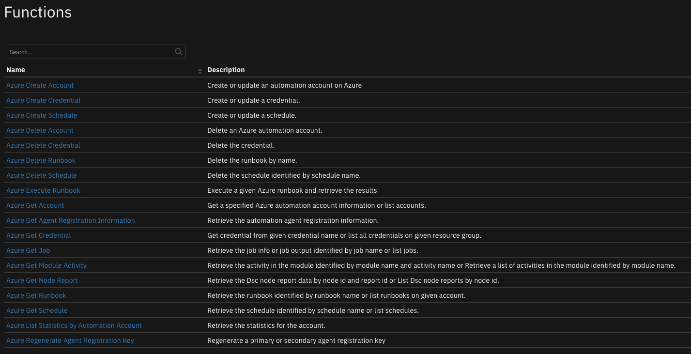
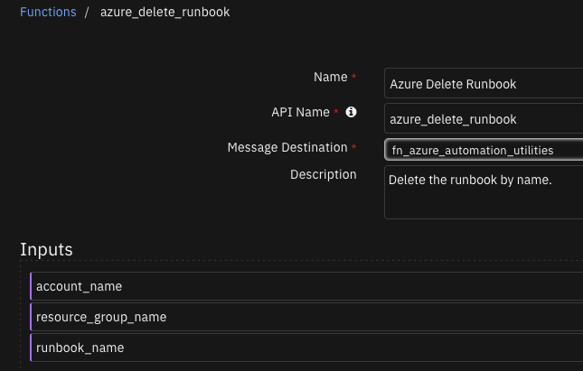
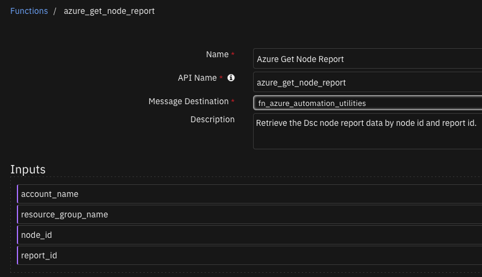
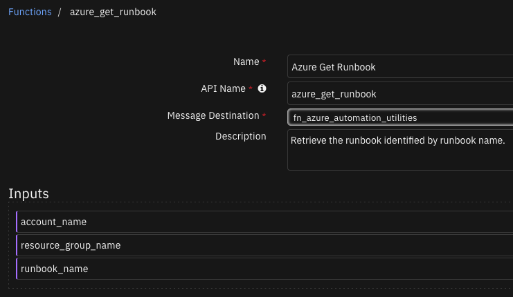
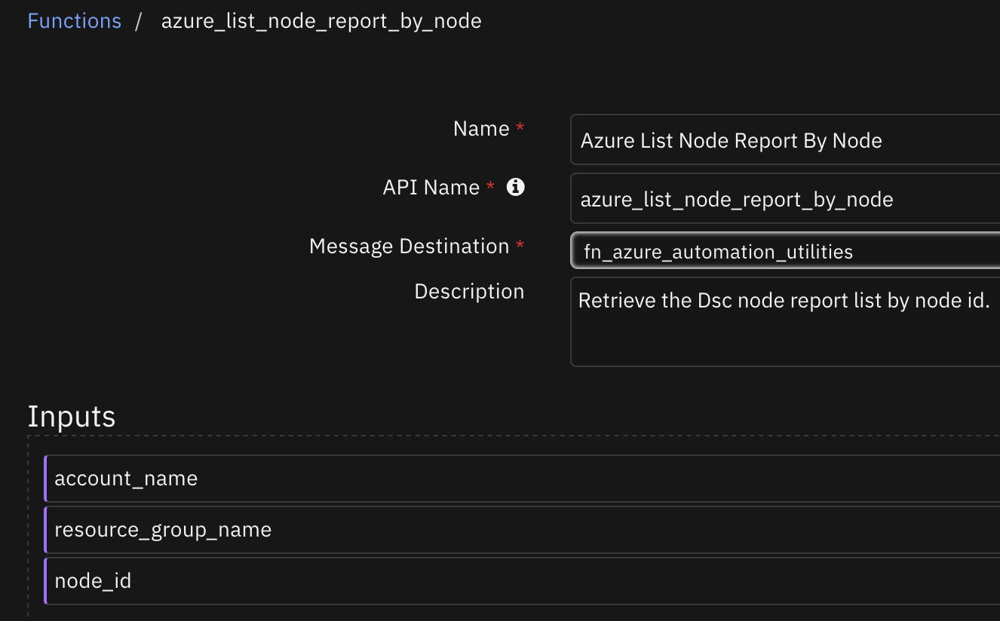
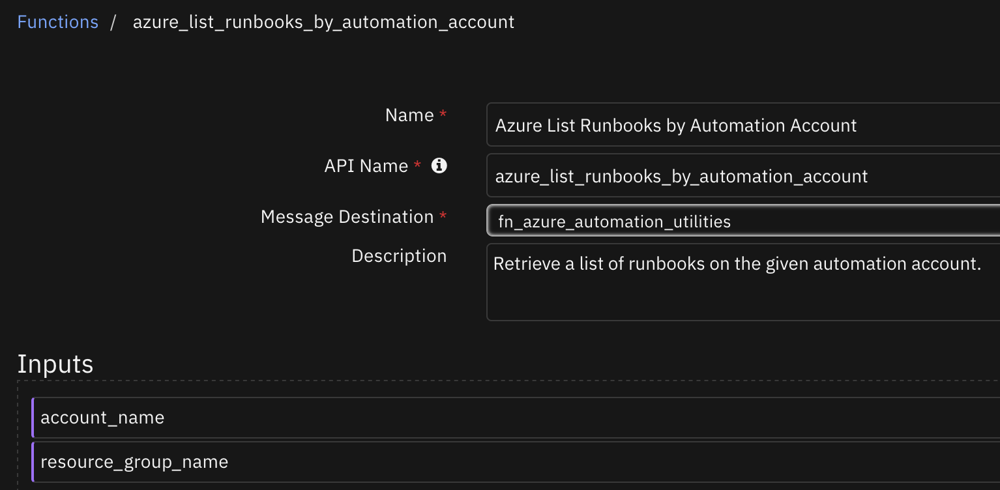
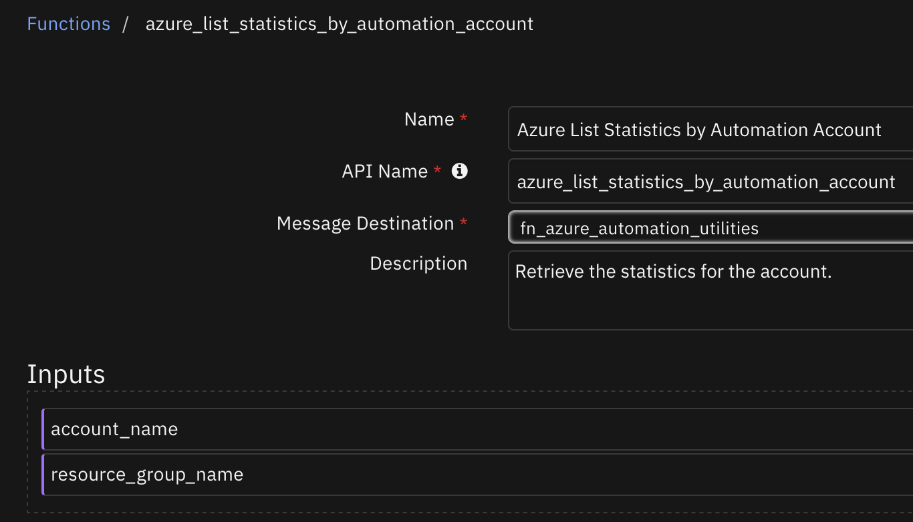
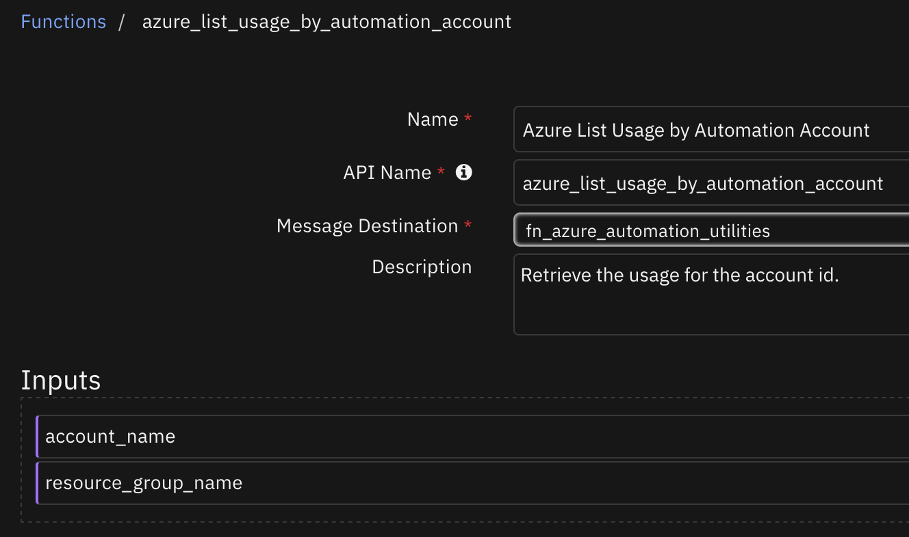

# Azure Automation Utilities

## Table of Contents
- [Release Notes](#release-notes)
- [Overview](#overview)
  - [Key Features](#key-features)
- [Requirements](#requirements)
  - [SOAR platform](#soar-platform)
  - [Cloud Pak for Security](#cloud-pak-for-security)
  - [Proxy Server](#proxy-server)
  - [Python Environment](#python-environment)
- [Installation](#installation)
  - [Install](#install)
  - [App Configuration](#app-configuration)
- [Function - Azure Create Account](#function---azure-create-account)
- [Function - Azure Create Credential](#function---azure-create-credential)
- [Function - Azure Create Schedule](#function---azure-create-schedule)
- [Function - Azure Delete Account](#function---azure-delete-account)
- [Function - Azure Delete Credential](#function---azure-delete-credential)
- [Function - Azure Delete Schedule](#function---azure-delete-schedule)
- [Function - Azure Delete Runbook](#function---azure-delete-runbook)
- [Function - Azure Execute Runbook](#function---azure-execute-runbook)
- [Function - Azure Get Account](#function---azure-get-account)
- [Function - Azure Get Agent Registration Information](#function---azure-get-agent-registration-information)
- [Function - Azure Get Credential](#function---azure-get-credential)
- [Function - Azure Get Job](#function---azure-get-job)
- [Function - Azure Get Job Output](#function---azure-get-job-output)
- [Function - Azure Get Module Activity](#function---azure-get-module-activity)
- [Function - Azure Get Schedule](#function---azure-get-schedule)
- [Function - Azure Get Node Report](#function---azure-get-node-report)
- [Function - Azure Get Runbook](#function---azure-get-runbook)
- [Function - Azure List Accounts](#function---azure-list-accounts)
- [Function - Azure List Accounts By Resource Group](#function---azure-list-accounts-by-resource-group)
- [Function - Azure List Credentials by Automation Account](#function---azure-list-credentials-by-automation-account)
- [Function - Azure List Jobs by Automation Account](#function---azure-list-jobs-by-automation-account)
- [Function - Azure List Module Activities](#function---azure-list-module-activities)
- [Function - Azure List Schedule by Automation Account](#function---azure-list-schedule-by-automation-account)
- [Function - Azure List Node Report By Node](#function---azure-list-node-report-by-node)
- [Function - Azure List Runbooks by Automation Account](#function---azure-list-runbooks-by-automation-account)
- [Function - Azure List Statistics by Automation Account](#function---azure-list-statistics-by-automation-account)
- [Function - Azure List Usage by Automation Account](#function---azure-list-usage-by-automation-account)
- [Function - Azure Regenerate Agent Registration Key](#function---azure-regenerate-agent-registration-key)
- [Function - Azure Resume Job](#function---azure-resume-job)
- [Function - Azure Stop Job](#function---azure-stop-job)
- [Function - Azure Suspend Job](#function---azure-suspend-job)
- [Function - Azure Update Account](#function---azure-update-account)
- [Function - Azure Update Credential](#function---azure-update-credential)
- [Function - Azure Update Schedule](#function---azure-update-schedule)
- [Playbooks](#playbooks)
- [Troubleshooting & Support](#troubleshooting--support)

---

## Release Notes
<!--
  Specify all changes in this release. Do not remove the release 
  notes of a previous release
-->
| Version | Date | Notes |
| ------- | ---- | ----- |
| 1.0.0 | 09/2023 | Initial Release |

---

## Overview

**IBM SOAR App for Azure Automation**

  <!-- ::CHANGE_ME:: -->

This app allows interaction with the following Azure Automation resources:

    - Automation Accounts
    - Activities
    - Jobs
    - Runbooks
    - Nodes
    - Credentials
    - Schedules
    - Modules
    - Agent Registration
    - Statistics
    - Usage

### Key Features
<!--
  List the Key Features of the Integration
-->
* Automation Accounts
* Activities
* Jobs
* Runbooks
* Nodes
* Credentials
* Schedules
* Modules
* Agent Registration
* Statistics
* Usage

---

## Requirements
This app supports the IBM Security QRadar SOAR Platform and the IBM Security QRadar SOAR for IBM Cloud Pak for Security.

### SOAR platform
The SOAR platform supports two app deployment mechanisms, Edge Gateway (formerly App Host) and integration server.

If deploying to a SOAR platform with an Edge Gateway, the requirements are:
* SOAR platform >= `45.0.7899`.
* The app is in a container-based format (available from the AppExchange as a `zip` file).

If deploying to a SOAR platform with an integration server, the requirements are:
* SOAR platform >= `45.0.7899`.
* The app is in the older integration format (available from the AppExchange as a `zip` file which contains a `tar.gz` file).
* Integration server is running `resilient-circuits>=47.0.0`.
* If using an API key account, make sure the account provides the following minimum permissions: 
  | Name | Permissions |
  | ---- | ----------- |
  | Org Data | Read |
  | Function | Read |

The following SOAR platform guides provide additional information:
* _Edge Gateway Deployment Guide_ or _App Host Deployment Guide_: provides installation, configuration, and troubleshooting information, including proxy server settings.
* _Integration Server Guide_: provides installation, configuration, and troubleshooting information, including proxy server settings.
* _System Administrator Guide_: provides the procedure to install, configure and deploy apps.

The above guides are available on the IBM Documentation website at [ibm.biz/soar-docs](https://ibm.biz/soar-docs). On this web page, select your SOAR platform version. On the follow-on page, you can find the _Edge Gateway Deployment Guide_, _App Host Deployment Guide_, or _Integration Server Guide_ by expanding **Apps** in the Table of Contents pane. The System Administrator Guide is available by expanding **System Administrator**.

### Cloud Pak for Security
If you are deploying to IBM Cloud Pak for Security, the requirements are:
* IBM Cloud Pak for Security >= `1.8`.
* Cloud Pak is configured with an Edge Gateway.
* The app is in a container-based format (available from the AppExchange as a `zip` file).

The following Cloud Pak guides provide additional information: 
* _Edge Gateway Deployment Guide_ or _App Host Deployment Guide_: provides installation, configuration, and troubleshooting information, including proxy server settings. From the Table of Contents, select Case Management and Orchestration & Automation > **Orchestration and Automation Apps**.
* _System Administrator Guide_: provides information to install, configure, and deploy apps. From the IBM Cloud Pak for Security IBM Documentation table of contents, select Case Management and Orchestration & Automation > **System administrator**.

These guides are available on the IBM Documentation website at [ibm.biz/cp4s-docs](https://ibm.biz/cp4s-docs). From this web page, select your IBM Cloud Pak for Security version. From the version-specific IBM Documentation page, select Case Management and Orchestration & Automation.

### Proxy Server
The app does support a proxy server.

### Python Environment
Python 3.6 and Python 3.9 are supported.
Additional package dependencies may exist for each of these packages:
* resilient-circuits>=47.0.0

---

## Installation

### Install
* To install or uninstall an App or Integration on the _SOAR platform_, see the documentation at [ibm.biz/soar-docs](https://ibm.biz/soar-docs).
* To install or uninstall an App on _IBM Cloud Pak for Security_, see the documentation at [ibm.biz/cp4s-docs](https://ibm.biz/cp4s-docs) and follow the instructions above to navigate to Orchestration and Automation.

### App Configuration
The following table provides the settings you need to configure the app. These settings are made in the app.config file. See the documentation discussed in the Requirements section for the procedure.

| Config | Required | Example | Description |
| ------ | :------: | ------- | ----------- |
| **auth_url** | Yes | `https://login.microsoftonline.com/(tenant_id)/oauth2/v2.0/authorize` | *Enter a description of the config here.* <!-- ::CHANGE_ME:: --> |
| **client_id** | Yes | `` | *Enter a description of the config here.* <!-- ::CHANGE_ME:: --> |
| **client_secret** | Yes | `` | *Enter a description of the config here.* <!-- ::CHANGE_ME:: --> |
| **refresh_token** | Yes | `` | *Enter a description of the config here.* <!-- ::CHANGE_ME:: --> |
| **scope** | Yes | `https://management.azure.com/user_impersonation openid profile offline_access` | *Enter a description of the config here.* <!-- ::CHANGE_ME:: --> |
| **subscription_id** | Yes | `` | *Enter a description of the config here.* <!-- ::CHANGE_ME:: --> |
| **tenant_id** | Yes | `` | *Enter a description of the config here.* <!-- ::CHANGE_ME:: --> |
| **token_url** | Yes | `https://login.microsoftonline.com/(tenant_id)/oauth2/v2.0/token` | *Enter a description of the config here.* <!-- ::CHANGE_ME:: --> |


---

## Function - Azure Create Account
Create an automation account on Azure

  <!-- ::CHANGE_ME:: -->

<details><summary>Inputs:</summary>
<p>

| Name | Type | Required | Example | Tooltip |
| ---- | :--: | :------: | ------- | ------- |
| `account_name` | `text` | Yes | `-` | Azure Automation Account Name |
| `input_parameters` | `text` | No | `-` | string with dictionary format |
| `resource_group_name` | `text` | Yes | `-` | Azure Automation Resource Group Name  |

</p>
</details>

<details><summary>Outputs:</summary>
<p>

> **NOTE:** This example might be in JSON format, but `results` is a Python Dictionary on the SOAR platform.

```python
results = {
  "content": {
    "etag": null,
    "id": "/subscriptions/abcdefgh-1234-abcd-1234-a1b2c3d4e5f6/resourceGroups/demoassets/providers/Microsoft.Automation/automationAccounts/autotester24",
    "location": "Canada East",
    "name": "autotester24",
    "properties": {
      "RegistrationUrl": "https://55555555-3333-4444-bb0f-030397ea7fc1.agentsvc.yq.azure-automation.net/accounts/55555555-3333-4444-bb0f-030397ea7fc1",
      "RuntimeConfiguration": {
        "powershell": {
          "builtinModules": {
            "Az": "8.0.0"
          }
        },
        "powershell7": {
          "builtinModules": {
            "Az": "8.0.0"
          }
        }
      },
      "automationHybridServiceUrl": "https://55555555-3333-4444-bb0f-030397ea7fc1.jrds.yq.azure-automation.net/automationAccounts/55555555-3333-4444-bb0f-030397ea7fc1",
      "creationTime": "2023-08-22T12:44:27.9+00:00",
      "disableLocalAuth": false,
      "encryption": {
        "identity": {
          "userAssignedIdentity": null
        },
        "keySource": "Microsoft.Automation"
      },
      "lastModifiedBy": null,
      "lastModifiedTime": "2023-08-22T12:44:27.9+00:00",
      "publicNetworkAccess": true,
      "sku": {
        "capacity": null,
        "family": null,
        "name": "Basic"
      },
      "state": "Ok"
    },
    "systemData": {
      "createdAt": "2023-08-22T12:44:27.9+00:00",
      "lastModifiedAt": "2023-08-22T12:44:27.9+00:00"
    },
    "tags": {},
    "type": "Microsoft.Automation/AutomationAccounts"
  },
  "inputs": {
    "account_name": "autotester24",
    "input_parameters": "{\u0027name\u0027: \u0027autotester24\u0027, \u0027location\u0027: \u0027Canada East\u0027, \u0027tags\u0027: None, \u0027properties\u0027: {\u0027publicNetworkAccess\u0027: True, \u0027disableLocalAuth\u0027: False, \u0027sku\u0027: {\u0027name\u0027: \u0027Basic\u0027}}}",
    "resource_group_name": "demoassets"
  },
  "metrics": {
    "execution_time_ms": 4988,
    "host": "local",
    "package": "fn-azure-automation-utilities",
    "package_version": "1.0.0",
    "timestamp": "2023-08-22 08:44:29",
    "version": "1.0"
  },
  "raw": null,
  "reason": null,
  "success": true,
  "version": 2.0
}
```

</p>
</details>

<details><summary>Example Function Input Script:</summary>
<p>

```python
inputs.account_name = playbook.inputs.azure_automation_account_name
inputs.resource_group_name = playbook.inputs.azure_automation_resource_group

payload = {
  "name": playbook.inputs.azure_automation_account_name,
  "location": playbook.inputs.azure_automation_account_location,
  "tags": getattr(playbook.inputs, "azure_automation_account_tags", {}),
  "properties": {
    "publicNetworkAccess": getattr(playbook.inputs, "azure_automation_account_public_network_access", True),
    "disableLocalAuth": getattr(playbook.inputs, "azure_automation_account_disbale_local_auth", False),
    "sku":{
      "name": "Basic"
    }
  }
}

inputs.input_parameters = str(payload)
```

</p>
</details>

<details><summary>Example Function Post Process Script:</summary>
<p>

```python
results = playbook.functions.results.account_results
if results.get("success"):
  incident.addNote(f"Account '{playbook.inputs.azure_automation_account_name}' was created successfully.")
```

</p>
</details>

---
## Function - Azure Create Credential
Create a credential.

  <!-- ::CHANGE_ME:: -->

<details><summary>Inputs:</summary>
<p>

| Name | Type | Required | Example | Tooltip |
| ---- | :--: | :------: | ------- | ------- |
| `account_name` | `text` | Yes | `-` | Azure Automation Account Name |
| `credential_name` | `text` | No | `-` | Name of the Azure automation credential |
| `input_parameters` | `text` | No | `-` | string with dictionary format |
| `resource_group_name` | `text` | Yes | `-` | Azure Automation Resource Group Name  |

</p>
</details>

<details><summary>Outputs:</summary>
<p>

> **NOTE:** This example might be in JSON format, but `results` is a Python Dictionary on the SOAR platform.

```python
results = {
  "content": {
    "id": "/subscriptions/abcdefgh-1234-abcd-1234-a1b2c3d4e5f6/resourceGroups/demoassets/providers/Microsoft.Automation/automationAccounts/automation1/credentials/tes43",
    "name": "tes43",
    "properties": {
      "creationTime": "2023-08-21T18:14:38.87+00:00",
      "description": null,
      "lastModifiedTime": "2023-08-21T18:14:38.87+00:00",
      "userName": "tes43"
    },
    "type": "Microsoft.Automation/AutomationAccounts/Credentials"
  },
  "inputs": {
    "account_name": "automation1",
    "credential_name": "tes43",
    "input_parameters": "{\u0027name\u0027: \u0027tes43\u0027, \u0027properties\u0027: {\u0027userName\u0027: \u0027tes43\u0027, \u0027password\u0027: \u0027password\u0027}}",
    "resource_group_name": "demoassets"
  },
  "metrics": {
    "execution_time_ms": 1506,
    "host": "local",
    "package": "fn-azure-automation-utilities",
    "package_version": "1.0.0",
    "timestamp": "2023-08-21 14:14:38",
    "version": "1.0"
  },
  "raw": null,
  "reason": null,
  "success": true,
  "version": 2.0
}
```

</p>
</details>

<details><summary>Example Function Input Script:</summary>
<p>

```python
inputs.account_name = playbook.inputs.azure_automation_account_name
inputs.resource_group_name = playbook.inputs.azure_automation_resource_group
inputs.credential_name = playbook.inputs.azure_automation_credential_name

payload = {
  "name": playbook.inputs.azure_automation_credential_name,
  "properties": {
    "userName": playbook.inputs.azure_automation_credential_username,
    "password": playbook.inputs.azure_automation_credential_password
  }
}
if getattr(playbook.inputs, "azure_automation_credential_description"):
  payload["properties"]["description"] = getattr(playbook.inputs, "azure_automation_credential_description")
inputs.input_parameters = str(payload)
```

</p>
</details>

<details><summary>Example Function Post Process Script:</summary>
<p>

```python
results = playbook.functions.results.create_results
if results.get("success"):
  incident.addNote(f"Credential '{playbook.inputs.azure_automation_credential_name}' was created successfully.")
```

</p>
</details>

---
## Function - Azure Create Schedule
Create a schedule.

  <!-- ::CHANGE_ME:: -->

<details><summary>Inputs:</summary>
<p>

| Name | Type | Required | Example | Tooltip |
| ---- | :--: | :------: | ------- | ------- |
| `account_name` | `text` | Yes | `-` | Azure Automation Account Name |
| `input_parameters` | `text` | No | `-` | string with dictionary format |
| `resource_group_name` | `text` | Yes | `-` | Azure Automation Resource Group Name  |
| `schedule_name` | `text` | Yes | `The name of the azure automation schedule` | - |

</p>
</details>

<details><summary>Outputs:</summary>
<p>

> **NOTE:** This example might be in JSON format, but `results` is a Python Dictionary on the SOAR platform.

```python
results = {
  "content": {
    "id": "/subscriptions/abcdefgh-1234-abcd-1234-a1b2c3d4e5f6/resourceGroups/demoassets/providers/Microsoft.Automation/automationAccounts/automation1/schedules/tester1324",
    "name": "tester1324",
    "properties": {
      "advancedSchedule": null,
      "creationTime": "2023-08-24T15:31:44.2666667+00:00",
      "description": "something",
      "expiryTime": "2023-08-25T08:40:00+00:00",
      "expiryTimeOffsetMinutes": 0.0,
      "frequency": "OneTime",
      "interval": null,
      "isEnabled": true,
      "lastModifiedTime": "2023-08-24T15:31:44.2666667+00:00",
      "nextRun": "2023-08-25T08:40:00+00:00",
      "nextRunOffsetMinutes": 0.0,
      "startTime": "2023-08-25T08:40:00+00:00",
      "startTimeOffsetMinutes": 0.0,
      "timeZone": "Etc/UTC"
    },
    "type": "Microsoft.Automation/AutomationAccounts/Schedules"
  },
  "inputs": {
    "account_name": "automation1",
    "input_parameters": "{\u0027name\u0027: \u0027tester1324\u0027, \u0027properties\u0027: {\u0027startTime\u0027: 1692967200000, \u0027frequency\u0027: \u0027OneTime\u0027, \u0027description\u0027: \u0027something\u0027}}",
    "resource_group_name": "demoassets",
    "schedule_name": "tester1324"
  },
  "metrics": {
    "execution_time_ms": 30624,
    "host": "local",
    "package": "fn-azure-automation-utilities",
    "package_version": "1.0.0",
    "timestamp": "2023-08-24 11:31:44",
    "version": "1.0"
  },
  "raw": null,
  "reason": null,
  "success": true,
  "version": 2.0
}
```

</p>
</details>

<details><summary>Example Function Input Script:</summary>
<p>

```python
inputs.account_name = playbook.inputs.azure_automation_account_name
inputs.resource_group_name = playbook.inputs.azure_automation_resource_group
inputs.schedule_name = playbook.inputs.azure_automation_schedule_name

payload = {
  "name": playbook.inputs.azure_automation_schedule_name,
  "properties": {
    "startTime": playbook.inputs.azure_automation_schedule_start_time,
    "frequency": "OneTime"
  }
}
if getattr(playbook.inputs, "azure_automation_schedule_description"):
  payload["properties"]["description"] = getattr(playbook.inputs, "azure_automation_schedule_description")
inputs.input_parameters = str(payload)
```

</p>
</details>

<details><summary>Example Function Post Process Script:</summary>
<p>

```python
results = playbook.functions.results.schedule
if results.get("success"):
  incident.addNote(f"Schedule '{playbook.inputs.azure_automation_schedule_name}' was created successfully.")
```

</p>
</details>

---
## Function - Azure Delete Account
Delete an Azure automation account.

  <!-- ::CHANGE_ME:: -->

<details><summary>Inputs:</summary>
<p>

| Name | Type | Required | Example | Tooltip |
| ---- | :--: | :------: | ------- | ------- |
| `account_name` | `text` | Yes | `-` | Azure Automation Account Name |
| `resource_group_name` | `text` | Yes | `-` | Azure Automation Resource Group Name  |

</p>
</details>

<details><summary>Outputs:</summary>
<p>

> **NOTE:** This example might be in JSON format, but `results` is a Python Dictionary on the SOAR platform.

```python
results = {
  "content": {
    "status": 200
  },
  "inputs": {
    "account_name": "test-account",
    "resource_group_name": "DemoAssets"
  },
  "metrics": {
    "execution_time_ms": 5098,
    "host": "local",
    "package": "fn-azure-automation-utilities",
    "package_version": "1.0.0",
    "timestamp": "2023-07-25 08:24:31",
    "version": "1.0"
  },
  "raw": null,
  "reason": "",
  "success": true,
  "version": 2.0
}
```

</p>
</details>

<details><summary>Example Function Input Script:</summary>
<p>

```python
inputs.account_name = playbook.inputs.azure_automation_account_name
inputs.resource_group_name = playbook.inputs.azure_automation_account_resource_group
```

</p>
</details>

<details><summary>Example Function Post Process Script:</summary>
<p>

```python
results = playbook.functions.results.delete_results

if results.get("success"):
  status = results.get("content", {}).get("status")
  if status == 200:
    incident.addNote(f"Azure automation account '{playbook.inputs.azure_automation_account_name}' was deleted.")
  elif status == 204:
    incident.addNote(f"Azure automation account '{playbook.inputs.azure_automation_account_name}' not found.")
```

</p>
</details>

---
## Function - Azure Delete Credential
Delete the credential.

  <!-- ::CHANGE_ME:: -->

<details><summary>Inputs:</summary>
<p>

| Name | Type | Required | Example | Tooltip |
| ---- | :--: | :------: | ------- | ------- |
| `account_name` | `text` | Yes | `-` | Azure Automation Account Name |
| `credential_name` | `text` | No | `-` | Name of the Azure automation credential |
| `resource_group_name` | `text` | Yes | `-` | Azure Automation Resource Group Name  |

</p>
</details>

<details><summary>Outputs:</summary>
<p>

> **NOTE:** This example might be in JSON format, but `results` is a Python Dictionary on the SOAR platform.

```python
results = {
  "content": {
    "status": 200
  },
  "inputs": {
    "account_name": "automation1",
    "credential_name": "tes43",
    "resource_group_name": "demoassets"
  },
  "metrics": {
    "execution_time_ms": 1570,
    "host": "local",
    "package": "fn-azure-automation-utilities",
    "package_version": "1.0.0",
    "timestamp": "2023-08-21 14:16:11",
    "version": "1.0"
  },
  "raw": null,
  "reason": "",
  "success": true,
  "version": 2.0
}
```

</p>
</details>

<details><summary>Example Function Input Script:</summary>
<p>

```python
inputs.account_name = playbook.inputs.azure_automation_account_name
inputs.resource_group_name = playbook.inputs.azure_automation_resource_group
inputs.credential_name = playbook.inputs.azure_automation_credential_name
```

</p>
</details>

<details><summary>Example Function Post Process Script:</summary>
<p>

```python
results = playbook.functions.results.delete_cred

if results.get("success"):
  status = results.get("content", {}).get("status")
  if status == 200:
    incident.addNote(f"Azure automation credential '{playbook.inputs.azure_automation_credential_name}' was deleted.")
  elif status == 204:
    incident.addNote(f"Azure automation credential '{playbook.inputs.azure_automation_credential_name}' not found.")
```

</p>
</details>

---
## Function - Azure Delete Schedule
Delete the schedule identified by schedule name.

  <!-- ::CHANGE_ME:: -->

<details><summary>Inputs:</summary>
<p>

| Name | Type | Required | Example | Tooltip |
| ---- | :--: | :------: | ------- | ------- |
| `account_name` | `text` | Yes | `-` | Azure Automation Account Name |
| `resource_group_name` | `text` | Yes | `-` | Azure Automation Resource Group Name  |
| `schedule_name` | `text` | Yes | `The name of the azure automation schedule` | - |

</p>
</details>

<details><summary>Outputs:</summary>
<p>

> **NOTE:** This example might be in JSON format, but `results` is a Python Dictionary on the SOAR platform.

```python
results = {
  "content": {
    "status": 200
  },
  "inputs": {
    "account_name": "automation1",
    "resource_group_name": "demoassets",
    "schedule_name": "tester1324"
  },
  "metrics": {
    "execution_time_ms": 1244,
    "host": "local",
    "package": "fn-azure-automation-utilities",
    "package_version": "1.0.0",
    "timestamp": "2023-08-24 11:38:33",
    "version": "1.0"
  },
  "raw": null,
  "reason": "",
  "success": true,
  "version": 2.0
}
```

</p>
</details>

<details><summary>Example Function Input Script:</summary>
<p>

```python
inputs.account_name = playbook.inputs.azure_automation_account_name
inputs.resource_group_name = playbook.inputs.azure_automation_resource_group
inputs.schedule_name = playbook.inputs.azure_automation_schedule_name
```

</p>
</details>

<details><summary>Example Function Post Process Script:</summary>
<p>

```python
results = playbook.functions.results.delete_schedule

if results.get("success"):
  status = results.get("content", {}).get("status")
  if status == 200:
    incident.addNote(f"Schedule '{playbook.inputs.azure_automation_schedule_name}' was deleted.")
  elif status == 204:
    incident.addNote(f"Schedule '{playbook.inputs.azure_automation_schedule_name}' not found.")
```

</p>
</details>

---
## Function - Azure Delete Runbook
Delete the runbook by name.

  <!-- ::CHANGE_ME:: -->

<details><summary>Inputs:</summary>
<p>

| Name | Type | Required | Example | Tooltip |
| ---- | :--: | :------: | ------- | ------- |
| `account_name` | `text` | Yes | `-` | Azure Automation Account Name |
| `resource_group_name` | `text` | Yes | `-` | Azure Automation Resource Group Name  |
| `runbook_name` | `text` | Yes | `-` | Runbook name in Azure Automation |

</p>
</details>

<details><summary>Outputs:</summary>
<p>

> **NOTE:** This example might be in JSON format, but `results` is a Python Dictionary on the SOAR platform.

```python
results = {
  "content": {
    "status": 200
  },
  "inputs": {
    "account_name": "automation1",
    "resource_group_name": "demoassets",
    "runbook_name": "test_fail"
  },
  "metrics": {
    "execution_time_ms": 3220,
    "host": "local",
    "package": "fn-azure-automation-utilities",
    "package_version": "1.0.0",
    "timestamp": "2023-08-16 14:09:43",
    "version": "1.0"
  },
  "raw": null,
  "reason": "",
  "success": true,
  "version": 2.0
}
```

</p>
</details>

<details><summary>Example Function Input Script:</summary>
<p>

```python
inputs.account_name = playbook.inputs.azure_automation_account_name
inputs.resource_group_name = playbook.inputs.azure_resource_group
inputs.runbook_name = playbook.inputs.azure_automation_runbook_name
```

</p>
</details>

<details><summary>Example Function Post Process Script:</summary>
<p>

```python
results = playbook.functions.results.delete_runbook
if results.get("success"):
  incident.addNote(f"The runbook {results.get('inputs', {}).get('runbook_name')} was deleted.")
```

</p>
</details>

---
## Function - Azure Execute Runbook
Execute a given Azure runbook and retrieve the results

  <!-- ::CHANGE_ME:: -->

<details><summary>Inputs:</summary>
<p>

| Name | Type | Required | Example | Tooltip |
| ---- | :--: | :------: | ------- | ------- |
| `account_name` | `text` | Yes | `-` | Azure Automation Account Name |
| `input_parameters` | `text` | No | `-` | string with dictionary format |
| `resource_group_name` | `text` | Yes | `-` | Azure Automation Resource Group Name  |
| `runbook_name` | `text` | Yes | `-` | Runbook name in Azure Automation |
| `time_to_wait` | `number` | No | `-` | Amount of seconds to wait in between Azure automation job status checks. This should be hold long it takes the given runbook to complete. |

</p>
</details>

<details><summary>Outputs:</summary>
<p>

> **NOTE:** This example might be in JSON format, but `results` is a Python Dictionary on the SOAR platform.

```python
results = {
  "content": "\r\nLocation              : eastus\r\nTags                  : {}\r\nJobCount              : 0\r\nRunbookType           : PowerShell\r\nParameters            : {}\r\nLogVerbose            : False\r\nLogProgress           : False\r\nLastModifiedBy        : \r\nState                 : Published\r\nResourceGroupName     : DemoAssets\r\nAutomationAccountName : automation1\r\nName                  : get_all_runbooks\r\nCreationTime          : 7/19/2023 3:39:27 PM +00:00\r\nLastModifiedTime      : 7/19/2023 4:03:24 PM +00:00\r\nDescription           : Return all runbooks\r\n\r\n\r\nEnvironments                                                                                                            \r\n------------                                                                                                            \r\n{[AzureChinaCloud, AzureChinaCloud], [AzureCloud, AzureCloud], [AzureGermanCloud, AzureGermanCloud], [AzureUSGovernme...\r\n\r\n",
  "inputs": {
    "account_name": "automation1",
    "input_parameters": "{\u0027runbook_name\u0027: \u0027get_all_runbooks\u0027}",
    "resource_group_name": "DemoAssets",
    "runbook_name": "Get_given_runbook",
    "time_to_wait": 20
  },
  "metrics": {
    "execution_time_ms": 41660,
    "host": "local",
    "package": "fn-azure-automation-utilities",
    "package_version": "1.0.0",
    "timestamp": "2023-07-25 08:29:24",
    "version": "1.0"
  },
  "raw": null,
  "reason": null,
  "success": true,
  "version": 2.0
}
```

</p>
</details>

<details><summary>Example Function Input Script:</summary>
<p>

```python
inputs.account_name = playbook.inputs.azure_automation_account_name
inputs.input_parameters = playbook.inputs.azure_automation_runbook_input_parameters
inputs.resource_group_name = playbook.inputs.azure_resource_group
inputs.runbook_name = playbook.inputs.azure_automation_runbook_name

time_to_wait = getattr(playbook.inputs, "time_to_wait")
# If no time_to_wait is given then default to 30 seconds
inputs.time_to_wait = time_to_wait if time_to_wait else 30
```

</p>
</details>

<details><summary>Example Function Post Process Script:</summary>
<p>

```python
results = playbook.functions.results.runbook_results
if results.get("success"):
  incident.addNote(str(results.get("content", {})))
```

</p>
</details>

---
## Function - Azure Get Account
Get a specified Azure automation account information.

  <!-- ::CHANGE_ME:: -->

<details><summary>Inputs:</summary>
<p>

| Name | Type | Required | Example | Tooltip |
| ---- | :--: | :------: | ------- | ------- |
| `account_name` | `text` | Yes | `-` | Azure Automation Account Name |
| `resource_group_name` | `text` | Yes | `-` | Azure Automation Resource Group Name  |

</p>
</details>

<details><summary>Outputs:</summary>
<p>

> **NOTE:** This example might be in JSON format, but `results` is a Python Dictionary on the SOAR platform.

```python
results = {
  "content": {
    "etag": null,
    "id": "/subscriptions/abcdefgh-1234-abcd-1234-a1b2c3d4e5f6/resourceGroups/DemoAssets/providers/Microsoft.Automation/automationAccounts/testing352",
    "identity": {
      "principalId": "ee616124-e026-4ca0-8c64-d34bae779faf",
      "tenantId": "50ad7d3e-b889-434d-802d-13b87c68047b",
      "type": "SystemAssigned"
    },
    "location": "eastus",
    "name": "testing352",
    "properties": {
      "RegistrationUrl": "https://99f846f3-c84d-4c96-af2b-cd0f7a5bd5d5.agentsvc.eus.azure-automation.net/accounts/99f846f3-c84d-4c96-af2b-cd0f7a5bd5d5",
      "RuntimeConfiguration": {
        "powershell": {
          "builtinModules": {
            "Az": "8.0.0"
          }
        },
        "powershell7": {
          "builtinModules": {
            "Az": "8.0.0"
          }
        }
      },
      "automationHybridServiceUrl": "https://99f846f3-c84d-4c96-af2b-cd0f7a5bd5d5.jrds.eus.azure-automation.net/automationAccounts/99f846f3-c84d-4c96-af2b-cd0f7a5bd5d5",
      "creationTime": "2023-07-25T12:05:22.16+00:00",
      "disableLocalAuth": false,
      "encryption": {
        "identity": {
          "userAssignedIdentity": null
        },
        "keySource": "Microsoft.Automation"
      },
      "lastModifiedBy": null,
      "lastModifiedTime": "2023-07-25T12:05:22.16+00:00",
      "privateEndpointConnections": [],
      "publicNetworkAccess": true,
      "sku": {
        "capacity": null,
        "family": null,
        "name": "Basic"
      },
      "state": "Ok"
    },
    "systemData": {
      "createdAt": "2023-07-25T12:05:22.16+00:00",
      "lastModifiedAt": "2023-07-25T12:05:22.16+00:00"
    },
    "tags": {},
    "type": "Microsoft.Automation/AutomationAccounts"
  },
  "inputs": {
    "account_name": "testing352",
    "resource_group_name": "DemoAssets"
  },
  "metrics": {
    "execution_time_ms": 1433,
    "host": "local",
    "package": "fn-azure-automation-utilities",
    "package_version": "1.0.0",
    "timestamp": "2023-07-27 14:14:45",
    "version": "1.0"
  },
  "raw": null,
  "reason": null,
  "success": true,
  "version": 2.0
}
```

</p>
</details>

<details><summary>Example Function Input Script:</summary>
<p>

```python
inputs.account_name = playbook.inputs.azure_automation_account_name
inputs.resource_group_name = playbook.inputs.azure_automation_resource_group_name
```

</p>
</details>

<details><summary>Example Function Post Process Script:</summary>
<p>

```python
from json import dumps
results = playbook.functions.results.account_info

if results.get("success"):
  incident.addNote(dumps(results.get("content", {}), indent=4))
```

</p>
</details>

---
## Function - Azure Get Agent Registration Information
Retrieve the automation agent registration information.

  <!-- ::CHANGE_ME:: -->

<details><summary>Inputs:</summary>
<p>

| Name | Type | Required | Example | Tooltip |
| ---- | :--: | :------: | ------- | ------- |
| `account_name` | `text` | Yes | `-` | Azure Automation Account Name |
| `resource_group_name` | `text` | Yes | `-` | Azure Automation Resource Group Name  |

</p>
</details>

<details><summary>Outputs:</summary>
<p>

> **NOTE:** This example might be in JSON format, but `results` is a Python Dictionary on the SOAR platform.

```python
results = {
  "content": {
    "dscMetaConfiguration": "\r\n\tinstance of MSFT_WebDownloadManager as $MSFT_WebDownloadManager1ref\r\n\t{\r\n\tResourceID = \"[ConfigurationRepositoryWeb]AzureAutomationDSC\";\r\n\t SourceInfo = \"C:\\\\OaaS-RegistrationMetaConfig2.ps1::20::9::ConfigurationRepositoryWeb\";\r\n\t RegistrationKey = \"1234RYKSRuyfmINzCvic0Oz7DpGskIbty5W12345QbKWlsYT0BGp6qzfwz12345678vuh28cqRMoxDD39Iut7w==\"; \r\n\t ServerURL = \"https://abcdefgh-1234-abcd-1234-a1b2c3d4e5f6.agentsvc.eus.azure-automation.net/accounts/abcdefgh-1234-abcd-1234-a1b2c3d4e5f6\";\r\n\t};\r\n\r\n\tinstance of MSFT_WebResourceManager as $MSFT_WebResourceManager1ref\r\n\t{\r\n\t SourceInfo = \"C:\\\\OaaS-RegistrationMetaConfig2.ps1::27::9::ResourceRepositoryWeb\";\r\n\t ServerURL = \"https://abcdefgh-1234-abcd-1234-a1b2c3d4e5f6.agentsvc.eus.azure-automation.net/accounts/abcdefgh-1234-abcd-1234-a1b2c3d4e5f6\";\r\n\t ResourceID = \"[ResourceRepositoryWeb]AzureAutomationDSC\";\r\n\t RegistrationKey = \"1234RYKSRuyfmINzCvic0Oz7DpGskIbty5W12345QbKWlsYT0BGp6qzfwz12345678vuh28cqRMoxDD39Iut7w==\"; \r\n\t};\r\n\r\n\tinstance of MSFT_WebReportManager as $MSFT_WebReportManager1ref\r\n\t{\r\n\t SourceInfo = \"C:\\\\OaaS-RegistrationMetaConfig2.ps1::34::9::ReportServerWeb\";\r\n\t ServerURL = \"https://abcdefgh-1234-abcd-1234-a1b2c3d4e5f6.agentsvc.eus.azure-automation.net/accounts/abcdefgh-1234-abcd-1234-a1b2c3d4e5f6\";\r\n\t ResourceID = \"[ReportServerWeb]AzureAutomationDSC\";\r\n\t RegistrationKey = \"1234RYKSRuyfmINzCvic0Oz7DpGskIbty5W12345QbKWlsYT0BGp6qzfwz12345678vuh28cqRMoxDD39Iut7w==\"; \r\n\t};\r\n\r\n\tinstance of MSFT_DSCMetaConfiguration as $MSFT_DSCMetaConfiguration1ref\r\n\t{\r\n\t RefreshMode = \"Pull\";\r\n\t AllowModuleOverwrite = False;\r\n\t ActionAfterReboot = \"ContinueConfiguration\";\r\n\t RefreshFrequencyMins = 30;\r\n\t RebootNodeIfNeeded = False;\r\n\t ConfigurationModeFrequencyMins = 15;\r\n\t ConfigurationMode = \"ApplyAndMonitor\";\r\n\r\n\t  ResourceModuleManagers = {\r\n\t  $MSFT_WebResourceManager1ref  \r\n\t};\r\n\t  ReportManagers = {\r\n\t  $MSFT_WebReportManager1ref  \r\n\t };\r\n\t  ConfigurationDownloadManagers = {\r\n\t  $MSFT_WebDownloadManager1ref  \r\n\t };\r\n\t};\r\n\r\n\tinstance of OMI_ConfigurationDocument\r\n\t{\r\n\t Version=\"2.0.0\";\r\n\t MinimumCompatibleVersion = \"2.0.0\";\r\n\t CompatibleVersionAdditionalProperties= { \"MSFT_DSCMetaConfiguration:StatusRetentionTimeInDays\" };\r\n\t Author=\"azureautomation\";\r\n\t GenerationDate=\"04/17/2015 11:41:09\";\r\n\t GenerationHost=\"azureautomation-01\";\r\n\t Name=\"RegistrationMetaConfig\";\r\n\t};\r\n\t",
    "endpoint": "https://abcdefgh-1234-abcd-1234-a1b2c3d4e5f6.agentsvc.eus.azure-automation.net/accounts/abcdefgh-1234-abcd-1234-a1b2c3d4e5f6",
    "id": "/subscriptions/abcdefgh-1234-abcd-1234-a1b2c3d4e5f6/resourceGroups/demoassets/providers/Microsoft.Automation/automationAccounts/automation1/agentRegistrationInformation/https://abcdefgh-1234-abcd-1234-a1b2c3d4e5f6.agentsvc.eus.azure-automation.net/accounts/abcdefgh-1234-abcd-1234-a1b2c3d4e5f6",
    "keys": {
      "primary": "1234RYKSRuyfmINzCvic0Oz7DpGskIbty5W12345QbKWlsYT0BGp6qzfwz12345678vuh28cqRMoxDD39Iut7w==",
      "secondary": "bC6hr123456789qPD2eeowEt9rDRqfJMnJmUOhP123450/x53Vezc3rqDhherrLzb123456MWhub+86IKwxssg=="
    }
  },
  "inputs": {
    "account_name": "automation1",
    "resource_group_name": "demoassets"
  },
  "metrics": {
    "execution_time_ms": 1725,
    "host": "local",
    "package": "fn-azure-automation-utilities",
    "package_version": "1.0.0",
    "timestamp": "2023-08-21 09:45:31",
    "version": "1.0"
  },
  "raw": null,
  "reason": null,
  "success": true,
  "version": 2.0
}
```

</p>
</details>

<details><summary>Example Function Input Script:</summary>
<p>

```python
inputs.account_name = playbook.inputs.azure_automation_account_name
inputs.resource_group_name = playbook.inputs.azure_automation_resource_group_name
```

</p>
</details>

<details><summary>Example Function Post Process Script:</summary>
<p>

```python
from json import dumps
results = playbook.functions.results.registration_info

if results.get("success"):
  incident.addNote(dumps(results.get("content", {}), indent=4))
```

</p>
</details>

---
## Function - Azure Get Credential
Retrieve the credential identified by credential name.

  <!-- ::CHANGE_ME:: -->

<details><summary>Inputs:</summary>
<p>

| Name | Type | Required | Example | Tooltip |
| ---- | :--: | :------: | ------- | ------- |
| `account_name` | `text` | Yes | `-` | Azure Automation Account Name |
| `credential_name` | `text` | No | `-` | Name of the Azure automation credential |
| `resource_group_name` | `text` | Yes | `-` | Azure Automation Resource Group Name  |

</p>
</details>

<details><summary>Outputs:</summary>
<p>

> **NOTE:** This example might be in JSON format, but `results` is a Python Dictionary on the SOAR platform.

```python
results = {
  "content": {
    "id": "/subscriptions/abcdefgh-1234-abcd-1234-a1b2c3d4e5f6/resourceGroups/demoassets/providers/Microsoft.Automation/automationAccounts/automation1/credentials/tes43",
    "name": "tes43",
    "properties": {
      "creationTime": "2023-08-21T18:14:38.87+00:00",
      "description": null,
      "lastModifiedTime": "2023-08-21T18:14:38.87+00:00",
      "userName": "tes43"
    },
    "type": "Microsoft.Automation/AutomationAccounts/Credentials"
  },
  "inputs": {
    "account_name": "automation1",
    "credential_name": "tes43",
    "resource_group_name": "demoassets"
  },
  "metrics": {
    "execution_time_ms": 1393,
    "host": "local",
    "package": "fn-azure-automation-utilities",
    "package_version": "1.0.0",
    "timestamp": "2023-08-21 14:15:23",
    "version": "1.0"
  },
  "raw": null,
  "reason": null,
  "success": true,
  "version": 2.0
}
```

</p>
</details>

<details><summary>Example Function Input Script:</summary>
<p>

```python
inputs.account_name = playbook.inputs.azure_automation_account_name
inputs.resource_group_name = playbook.inputs.azure_automation_resource_group
inputs.credential_name = playbook.inputs.azure_automation_credential_name
```

</p>
</details>

<details><summary>Example Function Post Process Script:</summary>
<p>

```python
from json import dumps
results = playbook.functions.results.cred

if results.get("success"):
  incident.addNote(dumps(results.get("content", {}), indent=4))
```

</p>
</details>

---
## Function - Azure Get Job
Retrieve the job identified by job name

  <!-- ::CHANGE_ME:: -->

<details><summary>Inputs:</summary>
<p>

| Name | Type | Required | Example | Tooltip |
| ---- | :--: | :------: | ------- | ------- |
| `account_name` | `text` | Yes | `-` | Azure Automation Account Name |
| `job_name` | `text` | Yes | `-` | Azure Automation job name |
| `resource_group_name` | `text` | Yes | `-` | Azure Automation Resource Group Name  |

</p>
</details>

<details><summary>Outputs:</summary>
<p>

> **NOTE:** This example might be in JSON format, but `results` is a Python Dictionary on the SOAR platform.

```python
results = {
  "content": {
    "id": "/subscriptions/abcdefgh-1234-abcd-1234-a1b2c3d4e5f6/resourceGroups/demoassets/providers/Microsoft.Automation/automationAccounts/automation1/jobs/1692024049238",
    "name": "1692024049238",
    "properties": {
      "creationTime": "2023-08-14T14:42:29.5306946+00:00",
      "endTime": "2023-08-14T14:42:55.9297673+00:00",
      "exception": null,
      "jobId": "efe4db52-a124-4bea-9582-7b0c7f7133e4",
      "lastModifiedTime": "2023-08-14T14:42:55.9297673+00:00",
      "lastStatusModifiedTime": "2023-08-14T14:42:55.9297673+00:00",
      "parameters": {
        "runbook_name": "get_all_runbooks"
      },
      "provisioningState": "Succeeded",
      "runOn": "",
      "runbook": {
        "name": "Get_given_runbook"
      },
      "startTime": "2023-08-14T14:42:41.9604553+00:00",
      "startedBy": "{scrubbed}",
      "status": "Completed",
      "statusDetails": "None"
    },
    "type": "Microsoft.Automation/AutomationAccounts/Jobs"
  },
  "inputs": {
    "account_name": "automation1",
    "job_name": "1692024049238",
    "resource_group_name": "demoassets"
  },
  "metrics": {
    "execution_time_ms": 533,
    "host": "local",
    "package": "fn-azure-automation-utilities",
    "package_version": "1.0.0",
    "timestamp": "2023-08-16 14:52:41",
    "version": "1.0"
  },
  "raw": null,
  "reason": null,
  "success": true,
  "version": 2.0
}
```

</p>
</details>

<details><summary>Example Function Input Script:</summary>
<p>

```python
inputs.account_name = playbook.inputs.azure_automation_account_name
inputs.job_name = playbook.inputs.azure_automation_job_name
inputs.resource_group_name = playbook.inputs.azure_automation_resource_group_name
```

</p>
</details>

<details><summary>Example Function Post Process Script:</summary>
<p>

```python
from json import dumps
results = playbook.functions.results.job_results
if results.get("success"):
  incident.addNote(dumps(results.get("content", {}), indent=4))
```

</p>
</details>

---
## Function - Azure Get Job Output
Retrieve the job output identified by job name

  <!-- ::CHANGE_ME:: -->

<details><summary>Inputs:</summary>
<p>

| Name | Type | Required | Example | Tooltip |
| ---- | :--: | :------: | ------- | ------- |
| `account_name` | `text` | Yes | `-` | Azure Automation Account Name |
| `job_name` | `text` | Yes | `-` | Azure Automation job name |
| `resource_group_name` | `text` | Yes | `-` | Azure Automation Resource Group Name  |

</p>
</details>

<details><summary>Outputs:</summary>
<p>

> **NOTE:** This example might be in JSON format, but `results` is a Python Dictionary on the SOAR platform.

```python
results = {
  "content": "\r\nEnvironments                                                                                                            \r\n------------                                                                                                            \r\n{[AzureChinaCloud, AzureChinaCloud], [AzureCloud, AzureCloud], [AzureGermanCloud, AzureGermanCloud], [AzureUSGovernme...\r\n\r\n\r\nLocation              : eastus\r\nTags                  : {}\r\nJobCount              : 0\r\nRunbookType           : PowerShell\r\nParameters            : {}\r\nLogVerbose            : False\r\nLogProgress           : False\r\nLastModifiedBy        : \r\nState                 : Published\r\nResourceGroupName     : DemoAssets\r\nAutomationAccountName : automation1\r\nName                  : get_all_runbooks\r\nCreationTime          : 7/19/2023 3:39:27 PM +00:00\r\nLastModifiedTime      : 7/19/2023 4:03:24 PM +00:00\r\nDescription           : Return all runbooks\r\n\r\n",
  "inputs": {
    "account_name": "automation1",
    "job_name": "1692024049238",
    "resource_group_name": "demoassets"
  },
  "metrics": {
    "execution_time_ms": 8047,
    "host": "local",
    "package": "fn-azure-automation-utilities",
    "package_version": "1.0.0",
    "timestamp": "2023-08-16 14:46:30",
    "version": "1.0"
  },
  "raw": null,
  "reason": null,
  "success": true,
  "version": 2.0
}
```

</p>
</details>

<details><summary>Example Function Input Script:</summary>
<p>

```python
inputs.account_name = playbook.inputs.azure_automation_account_name
inputs.job_name = playbook.inputs.azure_automation_job_name
inputs.resource_group_name = playbook.inputs.azure_automation_resource_group_name
```

</p>
</details>

<details><summary>Example Function Post Process Script:</summary>
<p>

```python
results = playbook.functions.results.job_output
if results.get("success"):
  incident.addNote(str(results.get("content", "")))
```

</p>
</details>

---
## Function - Azure Get Module Activity
Retrieve the activity in the module identified by module name and activity name.

  <!-- ::CHANGE_ME:: -->

<details><summary>Inputs:</summary>
<p>

| Name | Type | Required | Example | Tooltip |
| ---- | :--: | :------: | ------- | ------- |
| `account_name` | `text` | Yes | `-` | Azure Automation Account Name |
| `activity_name` | `text` | No | `-` | The Azure automation module activity name |
| `module_name` | `text` | No | `-` | The name of the Azure automation module. |
| `resource_group_name` | `text` | Yes | `-` | Azure Automation Resource Group Name  |

</p>
</details>

<details><summary>Outputs:</summary>
<p>

> **NOTE:** This example might be in JSON format, but `results` is a Python Dictionary on the SOAR platform.

```python
results = {
  "content": {
    "id": "/subscriptions/abcdefgh-1234-abcd-1234-a1b2c3d4e5f6/resourceGroups/demoassets/providers/Microsoft.Automation/automationAccounts/automation1/modules/Az.Advisor/activities/Set-AzAdvisorConfiguration",
    "name": "Set-AzAdvisorConfiguration",
    "properties": {
      "creationTime": "2022-07-06T10:01:53.9133333+00:00",
      "definition": "",
      "description": "Updates or creates the Azure Advisor Configuration. ^https://docs.microsoft.com/powershell/module/az.advisor/set-azadvisorConfiguration^",
      "lastModifiedTime": "2022-07-06T10:01:53.9133333+00:00",
      "outputTypes": [
        {
          "name": "Microsoft.Azure.Commands.Advisor.Cmdlets.Models.PsAzureAdvisorConfigurationData",
          "type": "Microsoft.Azure.Commands.Advisor.Cmdlets.Models.PsAzureAdvisorConfigurationData"
        }
      ],
      "parameterSets": [
        {
          "name": "InputObjectLowCpuExcludeParameterSet",
          "parameters": [
            {
              "description": null,
              "isDynamic": false,
              "isMandatory": false,
              "name": "DefaultProfile",
              "position": -2147483648,
              "type": "Microsoft.Azure.Commands.Common.Authentication.Abstractions.Core.IAzureContextContainer",
              "validationSet": [],
              "valueFromPipeline": false,
              "valueFromPipelineByPropertyName": false,
              "valueFromRemainingArguments": false
            },
            {
              "description": null,
              "isDynamic": false,
              "isMandatory": false,
              "name": "Exclude",
              "position": 2,
              "type": "System.Management.Automation.SwitchParameter",
              "validationSet": [],
              "valueFromPipeline": false,
              "valueFromPipelineByPropertyName": false,
              "valueFromRemainingArguments": false
            },
            {
              "description": null,
              "isDynamic": false,
              "isMandatory": true,
              "name": "LowCpuThreshold",
              "position": 0,
              "type": "System.Int32",
              "validationSet": [],
              "valueFromPipeline": false,
              "valueFromPipelineByPropertyName": false,
              "valueFromRemainingArguments": false
            },
            {
              "description": null,
              "isDynamic": false,
              "isMandatory": false,
              "name": "WhatIf",
              "position": -2147483648,
              "type": "System.Management.Automation.SwitchParameter",
              "validationSet": [],
              "valueFromPipeline": false,
              "valueFromPipelineByPropertyName": false,
              "valueFromRemainingArguments": false
            },
            {
              "description": null,
              "isDynamic": false,
              "isMandatory": false,
              "name": "InputObject",
              "position": 1,
              "type": "Microsoft.Azure.Commands.Advisor.Cmdlets.Models.PsAzureAdvisorConfigurationData",
              "validationSet": [],
              "valueFromPipeline": true,
              "valueFromPipelineByPropertyName": false,
              "valueFromRemainingArguments": false
            },
            {
              "description": null,
              "isDynamic": false,
              "isMandatory": false,
              "name": "Confirm",
              "position": -2147483648,
              "type": "System.Management.Automation.SwitchParameter",
              "validationSet": [],
              "valueFromPipeline": false,
              "valueFromPipelineByPropertyName": false,
              "valueFromRemainingArguments": false
            }
          ]
        },
        {
          "name": "InputObjectRgExcludeParameterSet",
          "parameters": [
            {
              "description": null,
              "isDynamic": false,
              "isMandatory": false,
              "name": "InputObject",
              "position": 1,
              "type": "Microsoft.Azure.Commands.Advisor.Cmdlets.Models.PsAzureAdvisorConfigurationData",
              "validationSet": [],
              "valueFromPipeline": true,
              "valueFromPipelineByPropertyName": false,
              "valueFromRemainingArguments": false
            },
            {
              "description": null,
              "isDynamic": false,
              "isMandatory": false,
              "name": "Exclude",
              "position": 2,
              "type": "System.Management.Automation.SwitchParameter",
              "validationSet": [],
              "valueFromPipeline": false,
              "valueFromPipelineByPropertyName": false,
              "valueFromRemainingArguments": false
            },
            {
              "description": null,
              "isDynamic": false,
              "isMandatory": false,
              "name": "Confirm",
              "position": -2147483648,
              "type": "System.Management.Automation.SwitchParameter",
              "validationSet": [],
              "valueFromPipeline": false,
              "valueFromPipelineByPropertyName": false,
              "valueFromRemainingArguments": false
            },
            {
              "description": null,
              "isDynamic": false,
              "isMandatory": false,
              "name": "ResourceGroupName",
              "position": 0,
              "type": "System.String",
              "validationSet": [],
              "valueFromPipeline": false,
              "valueFromPipelineByPropertyName": false,
              "valueFromRemainingArguments": false
            },
            {
              "description": null,
              "isDynamic": false,
              "isMandatory": false,
              "name": "WhatIf",
              "position": -2147483648,
              "type": "System.Management.Automation.SwitchParameter",
              "validationSet": [],
              "valueFromPipeline": false,
              "valueFromPipelineByPropertyName": false,
              "valueFromRemainingArguments": false
            },
            {
              "description": null,
              "isDynamic": false,
              "isMandatory": false,
              "name": "DefaultProfile",
              "position": -2147483648,
              "type": "Microsoft.Azure.Commands.Common.Authentication.Abstractions.Core.IAzureContextContainer",
              "validationSet": [],
              "valueFromPipeline": false,
              "valueFromPipelineByPropertyName": false,
              "valueFromRemainingArguments": false
            }
          ]
        }
      ],
      "type": null
    },
    "type": null
  },
  "inputs": {
    "account_name": "automation1",
    "activity_name": "Set-AzAdvisorConfiguration",
    "module_name": "Az.Advisor",
    "resource_group_name": "demoassets"
  },
  "metrics": {
    "execution_time_ms": 2203,
    "host": "local",
    "package": "fn-azure-automation-utilities",
    "package_version": "1.0.0",
    "timestamp": "2023-08-14 10:52:19",
    "version": "1.0"
  },
  "raw": null,
  "reason": null,
  "success": true,
  "version": 2.0
}
```

</p>
</details>

<details><summary>Example Function Input Script:</summary>
<p>

```python
inputs.account_name = playbook.inputs.azure_automation_account_name
inputs.activity_name = playbook.inputs.azure_automation_activity_name
inputs.module_name = playbook.inputs.azure_automation_module_name
inputs.resource_group_name = playbook.inputs.azure_automation_resouce_group_name
```

</p>
</details>

<details><summary>Example Function Post Process Script:</summary>
<p>

```python
from json import dumps
results = playbook.functions.results.module_activity

if results.get("success"):
  incident.addNote(dumps(results.get("content", {}), indent=4))
```

</p>
</details>

---
## Function - Azure Get Schedule
Retrieve the schedule identified by schedule name.

  <!-- ::CHANGE_ME:: -->

<details><summary>Inputs:</summary>
<p>

| Name | Type | Required | Example | Tooltip |
| ---- | :--: | :------: | ------- | ------- |
| `account_name` | `text` | Yes | `-` | Azure Automation Account Name |
| `resource_group_name` | `text` | Yes | `-` | Azure Automation Resource Group Name  |
| `schedule_name` | `text` | Yes | `The name of the azure automation schedule` | - |

</p>
</details>

<details><summary>Outputs:</summary>
<p>

> **NOTE:** This example might be in JSON format, but `results` is a Python Dictionary on the SOAR platform.

```python
results = {
  "content": {
    "id": "/subscriptions/abcdefgh-1234-abcd-1234-a1b2c3d4e5f6/resourceGroups/demoassets/providers/Microsoft.Automation/automationAccounts/automation1/schedules/tester1324",
    "name": "tester1324",
    "properties": {
      "advancedSchedule": null,
      "creationTime": "2023-08-24T15:31:44.2666667+00:00",
      "description": "something",
      "expiryTime": "2023-08-25T08:40:00+00:00",
      "expiryTimeOffsetMinutes": 0.0,
      "frequency": "OneTime",
      "interval": null,
      "isEnabled": true,
      "lastModifiedTime": "2023-08-24T15:31:44.2666667+00:00",
      "nextRun": "2023-08-25T08:40:00+00:00",
      "nextRunOffsetMinutes": 0.0,
      "startTime": "2023-08-25T08:40:00+00:00",
      "startTimeOffsetMinutes": 0.0,
      "timeZone": "Etc/UTC"
    },
    "type": "Microsoft.Automation/AutomationAccounts/Schedules"
  },
  "inputs": {
    "account_name": "automation1",
    "resource_group_name": "demoassets",
    "schedule_name": "tester1324"
  },
  "metrics": {
    "execution_time_ms": 1586,
    "host": "local",
    "package": "fn-azure-automation-utilities",
    "package_version": "1.0.0",
    "timestamp": "2023-08-24 11:33:14",
    "version": "1.0"
  },
  "raw": null,
  "reason": null,
  "success": true,
  "version": 2.0
}
```

</p>
</details>

<details><summary>Example Function Input Script:</summary>
<p>

```python
inputs.account_name = playbook.inputs.azure_automation_account_name
inputs.resource_group_name = playbook.inputs.azure_automation_resource_group
inputs.schedule_name = playbook.inputs.azure_automation_schedule_name
```

</p>
</details>

<details><summary>Example Function Post Process Script:</summary>
<p>

```python
from json import dumps
results = playbook.functions.results.get_schedule

if results.get("success"):
  incident.addNote(dumps(results.get("content", {}), indent=4))
```

</p>
</details>

---
## Function - Azure Get Node Report
Retrieve the Dsc node report data by node id and report id.

  <!-- ::CHANGE_ME:: -->

<details><summary>Inputs:</summary>
<p>

| Name | Type | Required | Example | Tooltip |
| ---- | :--: | :------: | ------- | ------- |
| `account_name` | `text` | Yes | `-` | Azure Automation Account Name |
| `node_id` | `text` | Yes | `-` | Azure Automation Dsc node ID |
| `report_id` | `text` | Yes | `-` | Azure Automation Dsc node report ID |
| `resource_group_name` | `text` | Yes | `-` | Azure Automation Resource Group Name  |

</p>
</details>

<details><summary>Outputs:</summary>
<p>

> **NOTE:** This example might be in JSON format, but `results` is a Python Dictionary on the SOAR platform.

```python
results = {
  "content": {
    "configurationVersion": "2.0.0",
    "endTime": "2023-09-06T13:30:02.1606975+00:00",
    "errors": [],
    "hostName": null,
    "iPV4Addresses": [],
    "iPV6Addresses": [],
    "id": "/subscriptions/abcdefgh-1234-abcd-1234-a1b2c3d4e5f6/resourceGroups/DemoAssets/providers/Microsoft.Automation/automationAccounts/automation1/nodes/24939717-e819-4059-aa08-82862c65f3c8/reports/3c47f0b6-aeb7-429a-a656-70f2a19ab22a",
    "lastModifiedTime": "2023-09-06T13:30:02.2533333+00:00",
    "metaConfiguration": null,
    "numberOfResources": 0,
    "rawErrors": null,
    "rebootRequested": null,
    "refreshMode": null,
    "reportFormatVersion": "2.0",
    "reportId": "3c47f0b6-aeb7-429a-a656-70f2a19ab22a",
    "resources": [],
    "startTime": "2023-09-06T13:30:01.9451859+00:00",
    "status": "Compliant",
    "type": "Consistency"
  },
  "inputs": {
    "account_name": "automation1",
    "node_id": "24939717-e819-4059-aa08-82862c65f3c8",
    "report_id": "3c47f0b6-aeb7-429a-a656-70f2a19ab22a",
    "resource_group_name": "DemoAssets"
  },
  "metrics": {
    "execution_time_ms": 1084,
    "host": "local",
    "package": "fn-azure-automation-utilities",
    "package_version": "1.0.0",
    "timestamp": "2023-09-06 09:55:00",
    "version": "1.0"
  },
  "raw": null,
  "reason": null,
  "success": true,
  "version": 2.0
}
```

</p>
</details>

<details><summary>Example Function Input Script:</summary>
<p>

```python
inputs.account_name = playbook.inputs.azure_automation_account_name
inputs.node_id = playbook.inputs.azure_automation_node_id
inputs.report_id = playbook.inputs.azure_automation_report_id
inputs.resource_group_name = playbook.inputs.azure_automation_resource_group_name
```

</p>
</details>

<details><summary>Example Function Post Process Script:</summary>
<p>

```python
from json import dumps
results = playbook.functions.results.node_report

if results.get("success"):
  incident.addNote(dumps(results.get("content", {}), indent=4))
```

</p>
</details>

---
## Function - Azure Get Runbook
Retrieve the runbook identified by runbook name.

  <!-- ::CHANGE_ME:: -->

<details><summary>Inputs:</summary>
<p>

| Name | Type | Required | Example | Tooltip |
| ---- | :--: | :------: | ------- | ------- |
| `account_name` | `text` | Yes | `-` | Azure Automation Account Name |
| `resource_group_name` | `text` | Yes | `-` | Azure Automation Resource Group Name  |
| `runbook_name` | `text` | Yes | `-` | Runbook name in Azure Automation |

</p>
</details>

<details><summary>Outputs:</summary>
<p>

> **NOTE:** This example might be in JSON format, but `results` is a Python Dictionary on the SOAR platform.

```python
results = {
  "content": {
    "etag": "\"638246066435733333\"",
    "id": "/subscriptions/abcdefgh-1234-abcd-1234-a1b2c3d4e5f6/resourceGroups/demoassets/providers/Microsoft.Automation/automationAccounts/automation1/runbooks/Hello_world",
    "location": "eastus",
    "name": "Hello_world",
    "properties": {
      "creationTime": "2023-07-10T17:22:53.7066667+00:00",
      "description": "My first python 3 runbook",
      "draft": null,
      "jobCount": 0,
      "lastModifiedBy": null,
      "lastModifiedTime": "2023-07-10T17:24:03.5733333+00:00",
      "logActivityTrace": 0,
      "logProgress": false,
      "logVerbose": false,
      "outputTypes": [],
      "parameters": {},
      "provisioningState": "Succeeded",
      "runbookType": "Python3",
      "serviceManagementTags": null,
      "state": "Published"
    },
    "tags": {},
    "type": "Microsoft.Automation/AutomationAccounts/Runbooks"
  },
  "inputs": {
    "account_name": "automation1",
    "resource_group_name": "demoassets",
    "runbook_name": "Hello_world"
  },
  "metrics": {
    "execution_time_ms": 7989,
    "host": "local",
    "package": "fn-azure-automation-utilities",
    "package_version": "1.0.0",
    "timestamp": "2023-08-16 10:20:00",
    "version": "1.0"
  },
  "raw": null,
  "reason": null,
  "success": true,
  "version": 2.0
}
```

</p>
</details>

<details><summary>Example Function Input Script:</summary>
<p>

```python
inputs.account_name = playbook.inputs.azure_automation_account_name
inputs.resource_group_name = playbook.inputs.azure_resource_group
inputs.runbook_name = playbook.inputs.azure_automation_runbook_name
```

</p>
</details>

<details><summary>Example Function Post Process Script:</summary>
<p>

```python
from json import dumps
results = playbook.functions.results.runbook_results

if results.get("success"):
  incident.addNote(dumps(results.get("content"), indent=4))
```

</p>
</details>

---
## Function - Azure List Accounts
Lists the Automation Accounts within an Azure subscription

  <!-- ::CHANGE_ME:: -->

<details><summary>Inputs:</summary>
<p>

| Name | Type | Required | Example | Tooltip |
| ---- | :--: | :------: | ------- | ------- |

</p>
</details>

<details><summary>Outputs:</summary>
<p>

> **NOTE:** This example might be in JSON format, but `results` is a Python Dictionary on the SOAR platform.

```python
results = {
  "content": {
    "value": [
      {
        "id": "/subscriptions/abcdefgh-1234-abcd-1234-a1b2c3d4e5f6/resourceGroups/DemoAssets/providers/Microsoft.Automation/automationAccounts/automation1",
        "identity": {
          "principalId": "5c1a54ee-a043-4852-9b87-ed53005d9c62",
          "tenantId": "50ad7d3e-b889-434d-802d-13b87c68047b",
          "type": "SystemAssigned"
        },
        "location": "eastus",
        "name": "automation1",
        "properties": {
          "creationTime": "2023-04-28T14:04:03.0766667+00:00",
          "disableLocalAuth": false,
          "lastModifiedTime": "2023-07-21T14:25:01.7+00:00",
          "publicNetworkAccess": true
        },
        "tags": {
          "client": "sentinel"
        },
        "type": "Microsoft.Automation/AutomationAccounts"
      },
      {
        "id": "/subscriptions/abcdefgh-1234-abcd-1234-a1b2c3d4e5f6/resourceGroups/DemoAssets/providers/Microsoft.Automation/automationAccounts/testing352",
        "identity": {
          "principalId": "ee616124-e026-4ca0-8c64-d34bae779faf",
          "tenantId": "50ad7d3e-b889-434d-802d-13b87c68047b",
          "type": "SystemAssigned"
        },
        "location": "eastus",
        "name": "testing352",
        "properties": {
          "creationTime": "2023-07-25T12:05:22.16+00:00",
          "disableLocalAuth": false,
          "lastModifiedTime": "2023-07-25T12:05:22.16+00:00",
          "publicNetworkAccess": true
        },
        "tags": {},
        "type": "Microsoft.Automation/AutomationAccounts"
      },
      {
        "id": "/subscriptions/abcdefgh-1234-abcd-1234-a1b2c3d4e5f6/resourceGroups/DemoAssets/providers/Microsoft.Automation/automationAccounts/tester183",
        "location": "Canada Central",
        "name": "tester183",
        "properties": {
          "creationTime": "2023-07-25T12:12:11.663+00:00",
          "disableLocalAuth": false,
          "lastModifiedTime": "2023-07-25T12:12:11.663+00:00",
          "publicNetworkAccess": true
        },
        "tags": {},
        "type": "Microsoft.Automation/AutomationAccounts"
      }
    ]
  },
  "inputs": {},
  "metrics": {
    "execution_time_ms": 1200,
    "host": "local",
    "package": "fn-azure-automation-utilities",
    "package_version": "1.0.0",
    "timestamp": "2023-07-28 12:12:31",
    "version": "1.0"
  },
  "raw": null,
  "reason": null,
  "success": true,
  "version": 2.0
}
```

</p>
</details>

<details><summary>Example Function Input Script:</summary>
<p>

```python
None
```

</p>
</details>

<details><summary>Example Function Post Process Script:</summary>
<p>

```python
from json import dumps
results = playbook.functions.results.accounts

if results.get("success"):
  incident.addNote(dumps(results.get("content", {}), indent=4))
```

</p>
</details>

---
## Function - Azure List Accounts By Resource Group
Retrieve a list of accounts within a given resource group

  <!-- ::CHANGE_ME:: -->

<details><summary>Inputs:</summary>
<p>

| Name | Type | Required | Example | Tooltip |
| ---- | :--: | :------: | ------- | ------- |
| `resource_group_name` | `text` | Yes | `-` | Azure Automation Resource Group Name  |

</p>
</details>

<details><summary>Outputs:</summary>
<p>

> **NOTE:** This example might be in JSON format, but `results` is a Python Dictionary on the SOAR platform.

```python
results = {
  "content": {
    "value": [
      {
        "id": "/subscriptions/abcdefgh-1234-abcd-1234-a1b2c3d4e5f6/resourceGroups/DemoAssets/providers/Microsoft.Automation/automationAccounts/automation1",
        "identity": {
          "principalId": "5c1a54ee-a043-4852-9b87-ed53005d9c62",
          "tenantId": "50ad7d3e-b889-434d-802d-13b87c68047b",
          "type": "SystemAssigned"
        },
        "location": "eastus",
        "name": "automation1",
        "properties": {
          "creationTime": "2023-04-28T14:04:03.0766667+00:00",
          "disableLocalAuth": false,
          "lastModifiedTime": "2023-07-21T14:25:01.7+00:00",
          "publicNetworkAccess": true,
          "state": "Ok"
        },
        "tags": {
          "client": "sentinel"
        },
        "type": "Microsoft.Automation/AutomationAccounts"
      },
      {
        "id": "/subscriptions/abcdefgh-1234-abcd-1234-a1b2c3d4e5f6/resourceGroups/DemoAssets/providers/Microsoft.Automation/automationAccounts/testing352",
        "identity": {
          "principalId": "ee616124-e026-4ca0-8c64-d34bae779faf",
          "tenantId": "50ad7d3e-b889-434d-802d-13b87c68047b",
          "type": "SystemAssigned"
        },
        "location": "eastus",
        "name": "testing352",
        "properties": {
          "creationTime": "2023-07-25T12:05:22.16+00:00",
          "disableLocalAuth": false,
          "lastModifiedTime": "2023-07-25T12:05:22.16+00:00",
          "publicNetworkAccess": true,
          "state": "Ok"
        },
        "tags": {},
        "type": "Microsoft.Automation/AutomationAccounts"
      },
      {
        "id": "/subscriptions/abcdefgh-1234-abcd-1234-a1b2c3d4e5f6/resourceGroups/DemoAssets/providers/Microsoft.Automation/automationAccounts/tester183",
        "location": "Canada Central",
        "name": "tester183",
        "properties": {
          "creationTime": "2023-07-25T12:12:11.663+00:00",
          "disableLocalAuth": false,
          "lastModifiedTime": "2023-07-25T12:12:11.663+00:00",
          "publicNetworkAccess": true,
          "state": "Ok"
        },
        "tags": {},
        "type": "Microsoft.Automation/AutomationAccounts"
      }
    ]
  },
  "inputs": {
    "resource_group_name": "DemoAssets"
  },
  "metrics": {
    "execution_time_ms": 1153,
    "host": "local",
    "package": "fn-azure-automation-utilities",
    "package_version": "1.0.0",
    "timestamp": "2023-07-28 12:12:56",
    "version": "1.0"
  },
  "raw": null,
  "reason": null,
  "success": true,
  "version": 2.0
}
```

</p>
</details>

<details><summary>Example Function Input Script:</summary>
<p>

```python
inputs.resource_group_name = playbook.inputs.azure_automation_resource_group_name
```

</p>
</details>

<details><summary>Example Function Post Process Script:</summary>
<p>

```python
from json import dumps
results = playbook.functions.results.accounts

if results.get("success"):
  incident.addNote(dumps(results.get("content", {}), indent=4))
```

</p>
</details>

---
## Function - Azure List Credentials by Automation Account
Retrieve a list of credentials

  <!-- ::CHANGE_ME:: -->

<details><summary>Inputs:</summary>
<p>

| Name | Type | Required | Example | Tooltip |
| ---- | :--: | :------: | ------- | ------- |
| `account_name` | `text` | Yes | `-` | Azure Automation Account Name |
| `resource_group_name` | `text` | Yes | `-` | Azure Automation Resource Group Name  |

</p>
</details>

<details><summary>Outputs:</summary>
<p>

> **NOTE:** This example might be in JSON format, but `results` is a Python Dictionary on the SOAR platform.

```python
results = {
  "content": {
    "value": [
      {
        "id": "/subscriptions/abcdefgh-1234-abcd-1234-a1b2c3d4e5f6/resourceGroups/demoassets/providers/Microsoft.Automation/automationAccounts/automation1/credentials/tes43",
        "name": "tes43",
        "properties": {
          "creationTime": "2023-08-21T18:14:38.87+00:00",
          "description": null,
          "lastModifiedTime": "2023-08-21T18:14:38.87+00:00",
          "userName": "tes43"
        },
        "type": "Microsoft.Automation/AutomationAccounts/Credentials"
      },
      {
        "id": "/subscriptions/abcdefgh-1234-abcd-1234-a1b2c3d4e5f6/resourceGroups/demoassets/providers/Microsoft.Automation/automationAccounts/automation1/credentials/test",
        "name": "test",
        "properties": {
          "creationTime": "2023-07-19T15:33:17.5333333+00:00",
          "description": null,
          "lastModifiedTime": "2023-07-19T15:33:17.5333333+00:00",
          "userName": "tester"
        },
        "type": "Microsoft.Automation/AutomationAccounts/Credentials"
      },
      {
        "id": "/subscriptions/abcdefgh-1234-abcd-1234-a1b2c3d4e5f6/resourceGroups/demoassets/providers/Microsoft.Automation/automationAccounts/automation1/credentials/test12",
        "name": "test12",
        "properties": {
          "creationTime": "2023-08-21T18:12:39.2033333+00:00",
          "description": null,
          "lastModifiedTime": "2023-08-21T18:12:39.2033333+00:00",
          "userName": "test12"
        },
        "type": "Microsoft.Automation/AutomationAccounts/Credentials"
      },
      {
        "id": "/subscriptions/abcdefgh-1234-abcd-1234-a1b2c3d4e5f6/resourceGroups/demoassets/providers/Microsoft.Automation/automationAccounts/automation1/credentials/test22",
        "name": "test22",
        "properties": {
          "creationTime": "2023-08-21T18:10:15.51+00:00",
          "description": null,
          "lastModifiedTime": "2023-08-21T18:10:15.51+00:00",
          "userName": "test22"
        },
        "type": "Microsoft.Automation/AutomationAccounts/Credentials"
      },
      {
        "id": "/subscriptions/abcdefgh-1234-abcd-1234-a1b2c3d4e5f6/resourceGroups/demoassets/providers/Microsoft.Automation/automationAccounts/automation1/credentials/test32",
        "name": "test32",
        "properties": {
          "creationTime": "2023-08-21T17:59:44.38+00:00",
          "description": null,
          "lastModifiedTime": "2023-08-21T17:59:44.38+00:00",
          "userName": "test32"
        },
        "type": "Microsoft.Automation/AutomationAccounts/Credentials"
      }
    ]
  },
  "inputs": {
    "account_name": "automation1",
    "resource_group_name": "demoassets"
  },
  "metrics": {
    "execution_time_ms": 1263,
    "host": "local",
    "package": "fn-azure-automation-utilities",
    "package_version": "1.0.0",
    "timestamp": "2023-08-21 14:15:53",
    "version": "1.0"
  },
  "raw": null,
  "reason": null,
  "success": true,
  "version": 2.0
}
```

</p>
</details>

<details><summary>Example Function Input Script:</summary>
<p>

```python
inputs.account_name = playbook.inputs.azure_automation_account_name
inputs.resource_group_name = playbook.inputs.azure_automation_resource_group
```

</p>
</details>

<details><summary>Example Function Post Process Script:</summary>
<p>

```python
None
```

</p>
</details>

---
## Function - Azure List Jobs by Automation Account
Retrieve a list of jobs

  <!-- ::CHANGE_ME:: -->

<details><summary>Inputs:</summary>
<p>

| Name | Type | Required | Example | Tooltip |
| ---- | :--: | :------: | ------- | ------- |
| `account_name` | `text` | Yes | `-` | Azure Automation Account Name |
| `resource_group_name` | `text` | Yes | `-` | Azure Automation Resource Group Name  |

</p>
</details>

<details><summary>Outputs:</summary>
<p>

> **NOTE:** This example might be in JSON format, but `results` is a Python Dictionary on the SOAR platform.

```python
results = {
  "content": {
    "value": [
      {
        "id": "/subscriptions/abcdefgh-1234-abcd-1234-a1b2c3d4e5f6/resourceGroups/demoassets/providers/Microsoft.Automation/automationAccounts/automation1/jobs/1692024049238",
        "name": "1692024049238",
        "properties": {
          "creationTime": "2023-08-14T14:42:29.5306946+00:00",
          "endTime": "2023-08-14T14:42:55.9297673+00:00",
          "jobId": "efe4db52-a124-4bea-9582-7b0c7f7133e4",
          "lastModifiedTime": "2023-08-14T14:42:55.9297673+00:00",
          "provisioningState": "Succeeded",
          "runOn": "",
          "runbook": {
            "name": "Get_given_runbook"
          },
          "startTime": "2023-08-14T14:42:41.9604553+00:00",
          "status": "Completed"
        },
        "type": "Microsoft.Automation/AutomationAccounts/Jobs"
      },
      {
        "id": "/subscriptions/abcdefgh-1234-abcd-1234-a1b2c3d4e5f6/resourceGroups/demoassets/providers/Microsoft.Automation/automationAccounts/automation1/jobs/1691761457680",
        "name": "1691761457680",
        "properties": {
          "creationTime": "2023-08-11T14:02:36.9532796+00:00",
          "endTime": "2023-08-11T14:03:16.661328+00:00",
          "jobId": "ee72f62a-e732-41ea-a55a-1ae0e9a6d5e5",
          "lastModifiedTime": "2023-08-11T14:03:16.661328+00:00",
          "provisioningState": "Succeeded",
          "runOn": "",
          "runbook": {
            "name": "Get_given_runbook"
          },
          "startTime": "2023-08-11T14:03:03.5818149+00:00",
          "status": "Completed"
        },
        "type": "Microsoft.Automation/AutomationAccounts/Jobs"
      }
    ]
  },
  "inputs": {
    "account_name": "automation1",
    "resource_group_name": "demoassets"
  },
  "metrics": {
    "execution_time_ms": 1485,
    "host": "local",
    "package": "fn-azure-automation-utilities",
    "package_version": "1.0.0",
    "timestamp": "2023-08-16 15:05:07",
    "version": "1.0"
  },
  "raw": null,
  "reason": null,
  "success": true,
  "version": 2.0
}
```

</p>
</details>

<details><summary>Example Function Input Script:</summary>
<p>

```python
inputs.account_name = playbook.inputs.azure_automation_account_name
inputs.resource_group_name = playbook.inputs.azure_automation_resource_group_name
```

</p>
</details>

<details><summary>Example Function Post Process Script:</summary>
<p>

```python
from json import dumps
results = playbook.functions.results.jobs
if results.get("success"):
  incident.addNote(dumps(results.get("content", {}), indent=4))
```

</p>
</details>

---
## Function - Azure List Module Activities
Retrieve a list of activities in the module identified by module name.

  <!-- ::CHANGE_ME:: -->

<details><summary>Inputs:</summary>
<p>

| Name | Type | Required | Example | Tooltip |
| ---- | :--: | :------: | ------- | ------- |
| `account_name` | `text` | Yes | `-` | Azure Automation Account Name |
| `module_name` | `text` | No | `-` | The name of the Azure automation module. |
| `resource_group_name` | `text` | Yes | `-` | Azure Automation Resource Group Name  |

</p>
</details>

<details><summary>Outputs:</summary>
<p>

> **NOTE:** This example might be in JSON format, but `results` is a Python Dictionary on the SOAR platform.

```python
results = {
  "content": {
    "value": [
      {
        "id": "/subscriptions/abcdefgh-1234-abcd-1234-a1b2c3d4e5f6/resourceGroups/demoassets/providers/Microsoft.Automation/automationAccounts/automation1/modules/Az.Advisor/activities/Disable-AzAdvisorRecommendation",
        "name": "Disable-AzAdvisorRecommendation",
        "properties": {
          "creationTime": "2022-07-06T10:01:53.9133333+00:00",
          "definition": "",
          "description": "Disable an Azure Advisor recommendation. ^https://docs.microsoft.com/powershell/module/az.advisor/disable-azadvisorrecommendation^",
          "lastModifiedTime": "2022-07-06T10:01:53.9133333+00:00",
          "outputTypes": null,
          "parameterSets": null,
          "type": null
        },
        "type": null
      },
      {
        "id": "/subscriptions/abcdefgh-1234-abcd-1234-a1b2c3d4e5f6/resourceGroups/demoassets/providers/Microsoft.Automation/automationAccounts/automation1/modules/Az.Advisor/activities/Enable-AzAdvisorRecommendation",
        "name": "Enable-AzAdvisorRecommendation",
        "properties": {
          "creationTime": "2022-07-06T10:01:53.9133333+00:00",
          "definition": "",
          "description": "Enables Azure Advisor recommendation(s). ^https://docs.microsoft.com/powershell/module/az.advisor/enable-azadvisorrecommendation^",
          "lastModifiedTime": "2022-07-06T10:01:53.9133333+00:00",
          "outputTypes": null,
          "parameterSets": null,
          "type": null
        },
        "type": null
      },
      {
        "id": "/subscriptions/abcdefgh-1234-abcd-1234-a1b2c3d4e5f6/resourceGroups/demoassets/providers/Microsoft.Automation/automationAccounts/automation1/modules/Az.Advisor/activities/Get-AzAdvisorConfiguration",
        "name": "Get-AzAdvisorConfiguration",
        "properties": {
          "creationTime": "2022-07-06T10:01:53.9133333+00:00",
          "definition": "",
          "description": "Get the Azure Advisor configurations for the given subscription or resource group. ^https://docs.microsoft.com/powershell/module/az.advisor/get-azadvisorconfiguration^",
          "lastModifiedTime": "2022-07-06T10:01:53.9133333+00:00",
          "outputTypes": null,
          "parameterSets": null,
          "type": null
        },
        "type": null
      },
      {
        "id": "/subscriptions/abcdefgh-1234-abcd-1234-a1b2c3d4e5f6/resourceGroups/demoassets/providers/Microsoft.Automation/automationAccounts/automation1/modules/Az.Advisor/activities/Get-AzAdvisorRecommendation",
        "name": "Get-AzAdvisorRecommendation",
        "properties": {
          "creationTime": "2022-07-06T10:01:53.9133333+00:00",
          "definition": "",
          "description": "Gets a list of Azure Advisor recommendations. ^https://docs.microsoft.com/powershell/module/az.advisor/get-azadvisorrecommendation^",
          "lastModifiedTime": "2022-07-06T10:01:53.9133333+00:00",
          "outputTypes": null,
          "parameterSets": null,
          "type": null
        },
        "type": null
      },
      {
        "id": "/subscriptions/abcdefgh-1234-abcd-1234-a1b2c3d4e5f6/resourceGroups/demoassets/providers/Microsoft.Automation/automationAccounts/automation1/modules/Az.Advisor/activities/Set-AzAdvisorConfiguration",
        "name": "Set-AzAdvisorConfiguration",
        "properties": {
          "creationTime": "2022-07-06T10:01:53.9133333+00:00",
          "definition": "",
          "description": "Updates or creates the Azure Advisor Configuration. ^https://docs.microsoft.com/powershell/module/az.advisor/set-azadvisorConfiguration^",
          "lastModifiedTime": "2022-07-06T10:01:53.9133333+00:00",
          "outputTypes": null,
          "parameterSets": null,
          "type": null
        },
        "type": null
      }
    ]
  },
  "inputs": {
    "account_name": "automation1",
    "module_name": "Az.Advisor",
    "resource_group_name": "demoassets"
  },
  "metrics": {
    "execution_time_ms": 1636,
    "host": "local",
    "package": "fn-azure-automation-utilities",
    "package_version": "1.0.0",
    "timestamp": "2023-08-14 10:54:09",
    "version": "1.0"
  },
  "raw": null,
  "reason": null,
  "success": true,
  "version": 2.0
}
```

</p>
</details>

<details><summary>Example Function Input Script:</summary>
<p>

```python
inputs.account_name = playbook.inputs.azure_automation_account_name
inputs.module_name = playbook.inputs.azure_automation_module_name
inputs.resource_group_name = playbook.inputs.azure_automation_resource_group_name
```

</p>
</details>

<details><summary>Example Function Post Process Script:</summary>
<p>

```python
from json import dumps
results = playbook.functions.results.module_activities

if results.get("success"):
  incident.addNote(dumps(results.get("content", {}), indent=4))
```

</p>
</details>

---
## Function - Azure List Schedule by Automation Account
Retrieve a list of schedules.

  <!-- ::CHANGE_ME:: -->

<details><summary>Inputs:</summary>
<p>

| Name | Type | Required | Example | Tooltip |
| ---- | :--: | :------: | ------- | ------- |
| `account_name` | `text` | Yes | `-` | Azure Automation Account Name |
| `resource_group_name` | `text` | Yes | `-` | Azure Automation Resource Group Name  |

</p>
</details>

<details><summary>Outputs:</summary>
<p>

> **NOTE:** This example might be in JSON format, but `results` is a Python Dictionary on the SOAR platform.

```python
results = {
  "content": {
    "value": [
      {
        "id": "/subscriptions/abcdefgh-1234-abcd-1234-a1b2c3d4e5f6/resourceGroups/demoassets/providers/Microsoft.Automation/automationAccounts/automation1/schedules/s",
        "name": "s",
        "properties": {
          "advancedSchedule": null,
          "creationTime": "2023-08-23T16:05:14.3633333+00:00",
          "description": "",
          "expiryTime": "2023-08-29T12:05:00-04:00",
          "expiryTimeOffsetMinutes": -240.0,
          "frequency": "OneTime",
          "interval": null,
          "isEnabled": true,
          "lastModifiedTime": "2023-08-23T17:09:35.4666667+00:00",
          "nextRun": "2023-08-29T12:05:00-04:00",
          "nextRunOffsetMinutes": -240.0,
          "startTime": "2023-08-29T12:05:00-04:00",
          "startTimeOffsetMinutes": -240.0,
          "timeZone": "America/New_York"
        },
        "type": "Microsoft.Automation/AutomationAccounts/Schedules"
      },
      {
        "id": "/subscriptions/abcdefgh-1234-abcd-1234-a1b2c3d4e5f6/resourceGroups/demoassets/providers/Microsoft.Automation/automationAccounts/automation1/schedules/tester",
        "name": "tester",
        "properties": {
          "advancedSchedule": null,
          "creationTime": "2023-08-08T18:05:08.1333333+00:00",
          "description": "",
          "expiryTime": "2023-08-08T14:35:00-04:00",
          "expiryTimeOffsetMinutes": -240.0,
          "frequency": "OneTime",
          "interval": null,
          "isEnabled": true,
          "lastModifiedTime": "2023-08-08T18:05:08.1333333+00:00",
          "nextRun": null,
          "nextRunOffsetMinutes": 0.0,
          "startTime": "2023-08-08T14:35:00-04:00",
          "startTimeOffsetMinutes": -240.0,
          "timeZone": "America/New_York"
        },
        "type": "Microsoft.Automation/AutomationAccounts/Schedules"
      },
      {
        "id": "/subscriptions/abcdefgh-1234-abcd-1234-a1b2c3d4e5f6/resourceGroups/demoassets/providers/Microsoft.Automation/automationAccounts/automation1/schedules/tester1324",
        "name": "tester1324",
        "properties": {
          "advancedSchedule": null,
          "creationTime": "2023-08-24T15:31:44.2666667+00:00",
          "description": "something",
          "expiryTime": "2023-08-25T08:40:00+00:00",
          "expiryTimeOffsetMinutes": 0.0,
          "frequency": "OneTime",
          "interval": null,
          "isEnabled": true,
          "lastModifiedTime": "2023-08-24T15:31:44.2666667+00:00",
          "nextRun": "2023-08-25T08:40:00+00:00",
          "nextRunOffsetMinutes": 0.0,
          "startTime": "2023-08-25T08:40:00+00:00",
          "startTimeOffsetMinutes": 0.0,
          "timeZone": "Etc/UTC"
        },
        "type": "Microsoft.Automation/AutomationAccounts/Schedules"
      }
    ]
  },
  "inputs": {
    "account_name": "automation1",
    "resource_group_name": "demoassets"
  },
  "metrics": {
    "execution_time_ms": 1400,
    "host": "local",
    "package": "fn-azure-automation-utilities",
    "package_version": "1.0.0",
    "timestamp": "2023-08-24 11:37:57",
    "version": "1.0"
  },
  "raw": null,
  "reason": null,
  "success": true,
  "version": 2.0
}
```

</p>
</details>

<details><summary>Example Function Input Script:</summary>
<p>

```python
inputs.account_name = playbook.inputs.azure_automation_account_name
inputs.resource_group_name = playbook.inputs.azure_automation_resource_group_name
```

</p>
</details>

<details><summary>Example Function Post Process Script:</summary>
<p>

```python
from json import dumps
results = playbook.functions.results.list_schedule

if results.get("success"):
  incident.addNote(dumps(results.get("content", {}), indent=4))
```

</p>
</details>

---
## Function - Azure List Node Report By Node
Retrieve the Dsc node report list by node id.

  <!-- ::CHANGE_ME:: -->

<details><summary>Inputs:</summary>
<p>

| Name | Type | Required | Example | Tooltip |
| ---- | :--: | :------: | ------- | ------- |
| `account_name` | `text` | Yes | `-` | Azure Automation Account Name |
| `node_id` | `text` | Yes | `-` | Azure Automation Dsc node ID |
| `resource_group_name` | `text` | Yes | `-` | Azure Automation Resource Group Name  |

</p>
</details>

<details><summary>Outputs:</summary>
<p>

> **NOTE:** This example might be in JSON format, but `results` is a Python Dictionary on the SOAR platform.

```python
results = {
  "content": {
    "value": [
      {
        "configurationVersion": "2.0.0",
        "endTime": "2023-09-06T13:30:02.1606975+00:00",
        "id": "/subscriptions/abcdefgh-1234-abcd-1234-a1b2c3d4e5f6/resourceGroups/DemoAssets/providers/Microsoft.Automation/automationAccounts/automation1/nodes/24939717-e819-4059-aa08-82862c65f3c8/reports/3c47f0b6-aeb7-429a-a656-70f2a19ab22a",
        "lastModifiedTime": "2023-09-06T13:30:02.2533333+00:00",
        "rebootRequested": null,
        "refreshMode": null,
        "reportFormatVersion": "2.0",
        "reportId": "3c47f0b6-aeb7-429a-a656-70f2a19ab22a",
        "startTime": "2023-09-06T13:30:01.9451859+00:00",
        "status": "Compliant",
        "type": "Consistency"
      },
      {
        "configurationVersion": "2.0.0",
        "endTime": "2023-09-06T13:00:01.591596+00:00",
        "id": "/subscriptions/abcdefgh-1234-abcd-1234-a1b2c3d4e5f6/resourceGroups/DemoAssets/providers/Microsoft.Automation/automationAccounts/automation1/nodes/24939717-e819-4059-aa08-82862c65f3c8/reports/73335fdb-bf2b-4e91-9409-0766b7533424",
        "lastModifiedTime": "2023-09-06T13:00:01.7+00:00",
        "rebootRequested": null,
        "refreshMode": null,
        "reportFormatVersion": "2.0",
        "reportId": "73335fdb-bf2b-4e91-9409-0766b7533424",
        "startTime": "2023-09-06T13:00:01.3984203+00:00",
        "status": "Compliant",
        "type": "Consistency"
      },
      {
        "configurationVersion": "2.0.0",
        "endTime": "2023-09-06T12:30:02.066503+00:00",
        "id": "/subscriptions/abcdefgh-1234-abcd-1234-a1b2c3d4e5f6/resourceGroups/DemoAssets/providers/Microsoft.Automation/automationAccounts/automation1/nodes/24939717-e819-4059-aa08-82862c65f3c8/reports/c9152779-51af-4cc6-8d3e-d09089280beb",
        "lastModifiedTime": "2023-09-06T12:30:02.17+00:00",
        "rebootRequested": null,
        "refreshMode": null,
        "reportFormatVersion": "2.0",
        "reportId": "c9152779-51af-4cc6-8d3e-d09089280beb",
        "startTime": "2023-09-06T12:30:01.4923996+00:00",
        "status": "Compliant",
        "type": "Consistency"
      }
    ]
  },
  "inputs": {
    "account_name": "automation1",
    "node_id": "24939717-e819-4059-aa08-82862c65f3c8",
    "resource_group_name": "DemoAssets"
  },
  "metrics": {
    "execution_time_ms": 837,
    "host": "local",
    "package": "fn-azure-automation-utilities",
    "package_version": "1.0.0",
    "timestamp": "2023-09-06 09:56:43",
    "version": "1.0"
  },
  "raw": null,
  "reason": null,
  "success": true,
  "version": 2.0
}
```

</p>
</details>

<details><summary>Example Function Input Script:</summary>
<p>

```python
inputs.account_name = playbook.inputs.azure_automation_account_name
inputs.node_id = playbook.inputs.azure_automation_node_id
inputs.resource_group_name = playbook.inputs.azure_automation_resource_group_name
```

</p>
</details>

<details><summary>Example Function Post Process Script:</summary>
<p>

```python
from json import dumps
results = playbook.functions.results.node_reports

if results.get("success"):
  incident.addNote(dumps(results.get("content", {}), indent=4))
```

</p>
</details>

---
## Function - Azure List Runbooks by Automation Account
Retrieve a list of runbooks on the given automation account.

  <!-- ::CHANGE_ME:: -->

<details><summary>Inputs:</summary>
<p>

| Name | Type | Required | Example | Tooltip |
| ---- | :--: | :------: | ------- | ------- |
| `account_name` | `text` | Yes | `-` | Azure Automation Account Name |
| `resource_group_name` | `text` | Yes | `-` | Azure Automation Resource Group Name  |

</p>
</details>

<details><summary>Outputs:</summary>
<p>

> **NOTE:** This example might be in JSON format, but `results` is a Python Dictionary on the SOAR platform.

```python
results = {
  "content": {
    "value": [
      {
        "id": "/subscriptions/abcdefgh-1234-abcd-1234-a1b2c3d4e5f6/resourceGroups/demoassets/providers/Microsoft.Automation/automationAccounts/automation1/runbooks/AzureAutomationTutorialWithIdentity",
        "location": "eastus",
        "name": "AzureAutomationTutorialWithIdentity",
        "properties": {
          "creationTime": "2023-04-28T14:04:05.0066667+00:00",
          "lastModifiedTime": "2023-07-19T15:43:27.3633333+00:00",
          "logActivityTrace": 0,
          "logProgress": false,
          "logVerbose": false,
          "runbookType": "PowerShell",
          "state": "Published"
        },
        "tags": {},
        "type": "Microsoft.Automation/AutomationAccounts/Runbooks"
      },
      {
        "id": "/subscriptions/abcdefgh-1234-abcd-1234-a1b2c3d4e5f6/resourceGroups/demoassets/providers/Microsoft.Automation/automationAccounts/automation1/runbooks/AzureAutomationTutorialWithIdentityGraphical",
        "location": "eastus",
        "name": "AzureAutomationTutorialWithIdentityGraphical",
        "properties": {
          "creationTime": "2023-04-28T14:04:05.1166667+00:00",
          "lastModifiedTime": "2023-07-19T15:43:36.2466667+00:00",
          "logActivityTrace": 0,
          "logProgress": false,
          "logVerbose": false,
          "runbookType": "GraphPowerShell",
          "state": "Published"
        },
        "tags": {},
        "type": "Microsoft.Automation/AutomationAccounts/Runbooks"
      }
    ]
  },
  "inputs": {
    "account_name": "automation1",
    "resource_group_name": "demoassets"
  },
  "metrics": {
    "execution_time_ms": 1889,
    "host": "local",
    "package": "fn-azure-automation-utilities",
    "package_version": "1.0.0",
    "timestamp": "2023-08-16 13:44:13",
    "version": "1.0"
  },
  "raw": null,
  "reason": null,
  "success": true,
  "version": 2.0
}
```

</p>
</details>

<details><summary>Example Function Input Script:</summary>
<p>

```python
inputs.account_name = playbook.inputs.azure_automation_account_name
inputs.resource_group_name = playbook.inputs.azure_resource_group
```

</p>
</details>

<details><summary>Example Function Post Process Script:</summary>
<p>

```python
from json import dumps
results = playbook.functions.results.runbooks_result
if results.get("success"):
  incident.addNote(dumps(results.get("content", {}), indent=4))
```

</p>
</details>

---
## Function - Azure List Statistics by Automation Account
Retrieve the statistics for the account.

  <!-- ::CHANGE_ME:: -->

<details><summary>Inputs:</summary>
<p>

| Name | Type | Required | Example | Tooltip |
| ---- | :--: | :------: | ------- | ------- |
| `account_name` | `text` | Yes | `-` | Azure Automation Account Name |
| `resource_group_name` | `text` | Yes | `-` | Azure Automation Resource Group Name  |

</p>
</details>

<details><summary>Outputs:</summary>
<p>

> **NOTE:** This example might be in JSON format, but `results` is a Python Dictionary on the SOAR platform.

```python
results = {
  "content": {
    "value": [
      {
        "counterProperty": "New",
        "counterValue": 0,
        "endTime": "2023-09-06T13:58:01.5985342+00:00",
        "id": "/subscriptions/abcdefgh-1234-abcd-1234-a1b2c3d4e5f6/resourceGroups/DemoAssets/providers/Microsoft.Automation/automationAccounts/automation1/statistics/New",
        "startTime": "2023-08-30T13:58:01.5985342+00:00"
      },
      {
        "counterProperty": "Activating",
        "counterValue": 0,
        "endTime": "2023-09-06T13:58:01.5985342+00:00",
        "id": "/subscriptions/abcdefgh-1234-abcd-1234-a1b2c3d4e5f6/resourceGroups/DemoAssets/providers/Microsoft.Automation/automationAccounts/automation1/statistics/Activating",
        "startTime": "2023-08-30T13:58:01.5985342+00:00"
      },
      {
        "counterProperty": "Running",
        "counterValue": 0,
        "endTime": "2023-09-06T13:58:01.5985342+00:00",
        "id": "/subscriptions/abcdefgh-1234-abcd-1234-a1b2c3d4e5f6/resourceGroups/DemoAssets/providers/Microsoft.Automation/automationAccounts/automation1/statistics/Running",
        "startTime": "2023-08-30T13:58:01.5985342+00:00"
      },
      {
        "counterProperty": "Completed",
        "counterValue": 0,
        "endTime": "2023-09-06T13:58:01.5985342+00:00",
        "id": "/subscriptions/abcdefgh-1234-abcd-1234-a1b2c3d4e5f6/resourceGroups/DemoAssets/providers/Microsoft.Automation/automationAccounts/automation1/statistics/Completed",
        "startTime": "2023-08-30T13:58:01.5985342+00:00"
      },
      {
        "counterProperty": "Failed",
        "counterValue": 0,
        "endTime": "2023-09-06T13:58:01.5985342+00:00",
        "id": "/subscriptions/abcdefgh-1234-abcd-1234-a1b2c3d4e5f6/resourceGroups/DemoAssets/providers/Microsoft.Automation/automationAccounts/automation1/statistics/Failed",
        "startTime": "2023-08-30T13:58:01.5985342+00:00"
      }
    ]
  },
  "inputs": {
    "account_name": "automation1",
    "resource_group_name": "DemoAssets"
  },
  "metrics": {
    "execution_time_ms": 773,
    "host": "local",
    "package": "fn-azure-automation-utilities",
    "package_version": "1.0.0",
    "timestamp": "2023-09-06 09:58:01",
    "version": "1.0"
  },
  "raw": null,
  "reason": null,
  "success": true,
  "version": 2.0
}
```

</p>
</details>

<details><summary>Example Function Input Script:</summary>
<p>

```python
inputs.account_name = playbook.inputs.azure_automation_account_name
inputs.resource_group_name = playbook.inputs.azure_automation_resource_group_name
```

</p>
</details>

<details><summary>Example Function Post Process Script:</summary>
<p>

```python
from json import dumps
results = playbook.functions.results.statistics

if results.get("success"):
  incident.addNote(dumps(results.get("content", {}), indent=4))
```

</p>
</details>

---
## Function - Azure List Usage by Automation Account
Retrieve the usage for the account id.

  <!-- ::CHANGE_ME:: -->

<details><summary>Inputs:</summary>
<p>

| Name | Type | Required | Example | Tooltip |
| ---- | :--: | :------: | ------- | ------- |
| `account_name` | `text` | Yes | `-` | Azure Automation Account Name |
| `resource_group_name` | `text` | Yes | `-` | Azure Automation Resource Group Name  |

</p>
</details>

<details><summary>Outputs:</summary>
<p>

> **NOTE:** This example might be in JSON format, but `results` is a Python Dictionary on the SOAR platform.

```python
results = {
  "content": {
    "value": [
      {
        "currentValue": 0.0,
        "limit": -1,
        "name": {
          "localizedValue": "AccountUsage",
          "value": "AccountUsage"
        },
        "throttleStatus": "NotThrottled",
        "unit": "Minute"
      },
      {
        "currentValue": 0.0,
        "limit": -1,
        "name": {
          "localizedValue": "SubscriptionUsage",
          "value": "SubscriptionUsage"
        },
        "throttleStatus": "NotThrottled",
        "unit": "Minute"
      },
      {
        "currentValue": 0.0,
        "limit": -1,
        "name": {
          "localizedValue": "DscAccountUsage",
          "value": "DscAccountUsage"
        },
        "throttleStatus": "NotThrottled",
        "unit": "Count"
      }
    ]
  },
  "inputs": {
    "account_name": "automation1",
    "resource_group_name": "DemoAssets"
  },
  "metrics": {
    "execution_time_ms": 1331,
    "host": "local",
    "package": "fn-azure-automation-utilities",
    "package_version": "1.0.0",
    "timestamp": "2023-09-06 09:58:55",
    "version": "1.0"
  },
  "raw": null,
  "reason": null,
  "success": true,
  "version": 2.0
}
```

</p>
</details>

<details><summary>Example Function Input Script:</summary>
<p>

```python
inputs.account_name = playbook.inputs.azure_automation_account_name
inputs.resource_group_name = playbook.inputs.azure_automation_resource_group_name
```

</p>
</details>

<details><summary>Example Function Post Process Script:</summary>
<p>

```python
from json import dumps
results = playbook.functions.results.usage

if results.get("success"):
  incident.addNote(dumps(results.get("content", {}), indent=4))
```

</p>
</details>

---
## Function - Azure Regenerate Agent Registration Key
Regenerate a primary or secondary agent registration key

  <!-- ::CHANGE_ME:: -->

<details><summary>Inputs:</summary>
<p>

| Name | Type | Required | Example | Tooltip |
| ---- | :--: | :------: | ------- | ------- |
| `account_name` | `text` | Yes | `-` | Azure Automation Account Name |
| `input_parameters` | `text` | No | `-` | string with dictionary format |
| `resource_group_name` | `text` | Yes | `-` | Azure Automation Resource Group Name  |

</p>
</details>

<details><summary>Outputs:</summary>
<p>

> **NOTE:** This example might be in JSON format, but `results` is a Python Dictionary on the SOAR platform.

```python
results = {
  "content": {
    "dscMetaConfiguration": null,
    "endpoint": "https://abcdefgh-1234-abcd-1234-a1b2c3d4e5f6.agentsvc.eus.azure-automation.net/accounts/abcdefgh-1234-abcd-1234-a1b2c3d4e5f6",
    "id": null,
    "keys": {
      "primary": "g+Z4E/12345678c/YbuFnwTe4yI12EYPRTdmFHVj+SI12345b0R8ghU8YNWe7BM3hjYDCzkqWhZGd0r5V4YHag==",
      "secondary": "bC6hr123456789qPD2eeowEt9rDRqfJMnJmUOhP123450/x53Vezc3rqDhherrLzb123456MWhub+86IKwxssg=="
    }
  },
  "inputs": {
    "account_name": "automation1",
    "input_parameters": "{\u0027keyName\u0027: \u0027primary\u0027}",
    "resource_group_name": "demoassets"
  },
  "metrics": {
    "execution_time_ms": 1104,
    "host": "local",
    "package": "fn-azure-automation-utilities",
    "package_version": "1.0.0",
    "timestamp": "2023-08-21 09:53:13",
    "version": "1.0"
  },
  "raw": null,
  "reason": null,
  "success": true,
  "version": 2.0
}
```

</p>
</details>

<details><summary>Example Function Input Script:</summary>
<p>

```python
inputs.account_name = playbook.inputs.azure_automation_account_name
inputs.resource_group_name = playbook.inputs.azure_automation_resource_group

payload = {"keyName": playbook.inputs.azure_automation_agent_key_to_regenerate}
inputs.input_parameters = str(payload)
```

</p>
</details>

<details><summary>Example Function Post Process Script:</summary>
<p>

```python
from json import dumps
results = playbook.functions.results.registration_key

if results.get("success"):
  incident.addNote(dumps(results.get("content", {}), indent=4))
```

</p>
</details>

---
## Function - Azure Resume Job
Resume the job identified by jobName.

  <!-- ::CHANGE_ME:: -->

<details><summary>Inputs:</summary>
<p>

| Name | Type | Required | Example | Tooltip |
| ---- | :--: | :------: | ------- | ------- |
| `account_name` | `text` | Yes | `-` | Azure Automation Account Name |
| `job_name` | `text` | Yes | `-` | Azure Automation job name |
| `resource_group_name` | `text` | Yes | `-` | Azure Automation Resource Group Name  |

</p>
</details>

<details><summary>Outputs:</summary>
<p>

> **NOTE:** This example might be in JSON format, but `results` is a Python Dictionary on the SOAR platform.

```python
results = {
  "content": {
    "status": 200
  },
  "inputs": {
    "account_name": "automation1",
    "job_name": "0e66ff84-7912-42fe-bfd5-7fbae056d8c9",
    "resource_group_name": "demoassets"
  },
  "metrics": {
    "execution_time_ms": 20691,
    "host": "local",
    "package": "fn-azure-automation-utilities",
    "package_version": "1.0.0",
    "timestamp": "2023-08-17 15:03:57",
    "version": "1.0"
  },
  "raw": null,
  "reason": "",
  "success": true,
  "version": 2.0
}
```

</p>
</details>

<details><summary>Example Function Input Script:</summary>
<p>

```python
inputs.account_name = playbook.inputs.azure_automation_account_name
inputs.job_name = playbook.inputs.azure_automation_job_name
inputs.resource_group_name = playbook.inputs.azure_automation_resource_group_name
```

</p>
</details>

<details><summary>Example Function Post Process Script:</summary>
<p>

```python
results = playbook.functions.results.resume_job
if results.get("success"):
  incident.addNote(f"Job {playbook.inputs.azure_automation_job_name} has resumed.")
```

</p>
</details>

---
## Function - Azure Stop Job
Stop the job identified by jobName.

  <!-- ::CHANGE_ME:: -->

<details><summary>Inputs:</summary>
<p>

| Name | Type | Required | Example | Tooltip |
| ---- | :--: | :------: | ------- | ------- |
| `account_name` | `text` | Yes | `-` | Azure Automation Account Name |
| `job_name` | `text` | Yes | `-` | Azure Automation job name |
| `resource_group_name` | `text` | Yes | `-` | Azure Automation Resource Group Name  |

</p>
</details>

<details><summary>Outputs:</summary>
<p>

> **NOTE:** This example might be in JSON format, but `results` is a Python Dictionary on the SOAR platform.

```python
results = {
  "content": {
    "status": 200
  },
  "inputs": {
    "account_name": "automation1",
    "job_name": "0e66ff84-7912-42fe-bfd5-7fbae056d8c9",
    "resource_group_name": "demoassets"
  },
  "metrics": {
    "execution_time_ms": 20691,
    "host": "local",
    "package": "fn-azure-automation-utilities",
    "package_version": "1.0.0",
    "timestamp": "2023-08-17 15:03:57",
    "version": "1.0"
  },
  "raw": null,
  "reason": "",
  "success": true,
  "version": 2.0
}
```

</p>
</details>

<details><summary>Example Function Input Script:</summary>
<p>

```python
inputs.account_name = playbook.inputs.azure_automation_account_name
inputs.job_name = playbook.inputs.azure_automation_job_name
inputs.resource_group_name = playbook.inputs.azure_automation_resource_group_name
```

</p>
</details>

<details><summary>Example Function Post Process Script:</summary>
<p>

```python
results = playbook.functions.results.stop_job
if results.get("success"):
  incident.addNote(f"Job {playbook.inputs.azure_automation_job_name} was successfully stopped.")
```

</p>
</details>

---
## Function - Azure Suspend Job
Suspend the job identified by job name.

  <!-- ::CHANGE_ME:: -->

<details><summary>Inputs:</summary>
<p>

| Name | Type | Required | Example | Tooltip |
| ---- | :--: | :------: | ------- | ------- |
| `account_name` | `text` | Yes | `-` | Azure Automation Account Name |
| `job_name` | `text` | Yes | `-` | Azure Automation job name |
| `resource_group_name` | `text` | Yes | `-` | Azure Automation Resource Group Name  |

</p>
</details>

<details><summary>Outputs:</summary>
<p>

> **NOTE:** This example might be in JSON format, but `results` is a Python Dictionary on the SOAR platform.

```python
results = {
  "content": {
    "status": 200
  },
  "inputs": {
    "account_name": "automation1",
    "job_name": "0e66ff84-7912-42fe-bfd5-7fbae056d8c9",
    "resource_group_name": "demoassets"
  },
  "metrics": {
    "execution_time_ms": 20691,
    "host": "local",
    "package": "fn-azure-automation-utilities",
    "package_version": "1.0.0",
    "timestamp": "2023-08-17 15:03:57",
    "version": "1.0"
  },
  "raw": null,
  "reason": "",
  "success": true,
  "version": 2.0
}
```

</p>
</details>

<details><summary>Example Function Input Script:</summary>
<p>

```python
inputs.account_name = playbook.inputs.azure_automation_account_name
inputs.job_name = playbook.inputs.azure_automation_job_name
inputs.resource_group_name = playbook.inputs.azure_automation_resource_group_name
```

</p>
</details>

<details><summary>Example Function Post Process Script:</summary>
<p>

```python
results = playbook.functions.results.suspend_job
if results.get("success"):
  incident.addNote(f"Job {playbook.inputs.azure_automation_job_name} has been suspended")
```

</p>
</details>

---
## Function - Azure Update Account
Update an automation account.

  <!-- ::CHANGE_ME:: -->

<details><summary>Inputs:</summary>
<p>

| Name | Type | Required | Example | Tooltip |
| ---- | :--: | :------: | ------- | ------- |
| `account_name` | `text` | Yes | `-` | Azure Automation Account Name |
| `input_parameters` | `text` | No | `-` | string with dictionary format |
| `resource_group_name` | `text` | Yes | `-` | Azure Automation Resource Group Name  |

</p>
</details>

<details><summary>Outputs:</summary>
<p>

> **NOTE:** This example might be in JSON format, but `results` is a Python Dictionary on the SOAR platform.

```python
results = {
  "content": {
    "etag": null,
    "id": "/subscriptions/abcdefgh-1234-abcd-1234-a1b2c3d4e5f6/resourceGroups/demoassets/providers/Microsoft.Automation/automationAccounts/autotester24",
    "location": "Canada East",
    "name": "autotester24",
    "properties": {
      "RegistrationUrl": "https://55555555-3333-4444-bb0f-030397ea7fc1.agentsvc.yq.azure-automation.net/accounts/55555555-3333-4444-bb0f-030397ea7fc1",
      "RuntimeConfiguration": {
        "powershell": {
          "builtinModules": {
            "Az": "8.0.0"
          }
        },
        "powershell7": {
          "builtinModules": {
            "Az": "8.0.0"
          }
        }
      },
      "automationHybridServiceUrl": "https://55555555-3333-4444-bb0f-030397ea7fc1.jrds.yq.azure-automation.net/automationAccounts/55555555-3333-4444-bb0f-030397ea7fc1",
      "creationTime": "2023-08-22T12:44:27.9+00:00",
      "disableLocalAuth": false,
      "encryption": {
        "identity": {
          "userAssignedIdentity": null
        },
        "keySource": "Microsoft.Automation"
      },
      "lastModifiedBy": null,
      "lastModifiedTime": "2023-08-22T13:16:59.3333333+00:00",
      "publicNetworkAccess": false,
      "sku": {
        "capacity": null,
        "family": null,
        "name": "Basic"
      },
      "state": "Ok"
    },
    "systemData": {
      "createdAt": "2023-08-22T12:44:27.9+00:00",
      "lastModifiedAt": "2023-08-22T13:16:59.3333333+00:00"
    },
    "tags": {},
    "type": "Microsoft.Automation/AutomationAccounts"
  },
  "inputs": {
    "account_name": "autotester24",
    "input_parameters": "{\u0027name\u0027: \u0027autotester24\u0027, \u0027properties\u0027: {\u0027sku\u0027: {\u0027name\u0027: \u0027Basic\u0027}, \u0027publicNetworkAccess\u0027: False}}",
    "resource_group_name": "demoassets"
  },
  "metrics": {
    "execution_time_ms": 529,
    "host": "local",
    "package": "fn-azure-automation-utilities",
    "package_version": "1.0.0",
    "timestamp": "2023-08-22 09:16:59",
    "version": "1.0"
  },
  "raw": null,
  "reason": null,
  "success": true,
  "version": 2.0
}
```

</p>
</details>

<details><summary>Example Function Input Script:</summary>
<p>

```python
inputs.account_name = playbook.inputs.azure_automation_account_name
inputs.resource_group_name = playbook.inputs.azure_automation_resource_group

payload = {
  "name": playbook.inputs.azure_automation_account_name,
  "properties": {
    "sku":{
      "name": "Basic"
    }
  }
}
if getattr(playbook.inputs, "azure_automation_account_tags"):
  payload["tags"] = getattr(playbook.inputs, "azure_automation_account_tags", {})
if hasattr(playbook.inputs, "azure_automation_account_public_network_access"):
  payload["properties"]["publicNetworkAccess"] = getattr(playbook.inputs, "azure_automation_account_public_network_access")
if hasattr(playbook.inputs, "azure_automation_account_disbale_local_auth"):
  payload["properties"]["disableLocalAuth"] = getattr(playbook.inputs, "azure_automation_account_disbale_local_auth")

inputs.input_parameters = str(payload)
```

</p>
</details>

<details><summary>Example Function Post Process Script:</summary>
<p>

```python
results = playbook.functions.results.update_account
if results.get("success"):
  incident.addNote(f"Account '{playbook.inputs.azure_automation_account_name}' was updated successfully.")
```

</p>
</details>

---
## Function - Azure Update Credential
Update a credential

  <!-- ::CHANGE_ME:: -->

<details><summary>Inputs:</summary>
<p>

| Name | Type | Required | Example | Tooltip |
| ---- | :--: | :------: | ------- | ------- |
| `account_name` | `text` | Yes | `-` | Azure Automation Account Name |
| `credential_name` | `text` | No | `-` | Name of the Azure automation credential |
| `input_parameters` | `text` | No | `-` | string with dictionary format |
| `resource_group_name` | `text` | Yes | `-` | Azure Automation Resource Group Name  |

</p>
</details>

<details><summary>Outputs:</summary>
<p>

> **NOTE:** This example might be in JSON format, but `results` is a Python Dictionary on the SOAR platform.

```python
results = {
  "content": {
    "id": "/subscriptions/abcdefgh-1234-abcd-1234-a1b2c3d4e5f6/resourceGroups/demoassets/providers/Microsoft.Automation/automationAccounts/automation1/credentials/test32",
    "name": "test32",
    "properties": {
      "creationTime": "2023-08-21T17:59:44.38+00:00",
      "description": "something",
      "lastModifiedTime": "2023-08-21T17:59:44.38+00:00",
      "userName": "tester"
    },
    "type": "Microsoft.Automation/AutomationAccounts/Credentials"
  },
  "inputs": {
    "account_name": "automation1",
    "credential_name": "test32",
    "input_parameters": "{\u0027name\u0027: \u0027test32\u0027, \u0027properties\u0027: {\u0027userName\u0027: \u0027tester\u0027, \u0027description\u0027: \u0027something\u0027}}",
    "resource_group_name": "demoassets"
  },
  "metrics": {
    "execution_time_ms": 4271,
    "host": "local",
    "package": "fn-azure-automation-utilities",
    "package_version": "1.0.0",
    "timestamp": "2023-08-21 14:21:37",
    "version": "1.0"
  },
  "raw": null,
  "reason": null,
  "success": true,
  "version": 2.0
}
```

</p>
</details>

<details><summary>Example Function Input Script:</summary>
<p>

```python
inputs.account_name = playbook.inputs.azure_automation_account_name
inputs.resource_group_name = playbook.inputs.azure_automation_resource_group
inputs.credential_name = playbook.inputs.azure_automation_credential_name

payload = {
  "name": playbook.inputs.azure_automation_credential_name,
  "properties": {
  }
}
if getattr(playbook.inputs, "azure_automation_credential_username"):
  payload["properties"]["userName"] = getattr(playbook.inputs, "azure_automation_credential_username")
if getattr(playbook.inputs, "azure_automation_credential_password"):
  payload["properties"]["password"] = getattr(playbook.inputs, "azure_automation_credential_password")
if getattr(playbook.inputs, "azure_automation_credential_description"):
  payload["properties"]["description"] = getattr(playbook.inputs, "azure_automation_credential_description")

inputs.input_parameters = str(payload)
```

</p>
</details>

<details><summary>Example Function Post Process Script:</summary>
<p>

```python
results = playbook.functions.results.update_cred
if results.get("success"):
  incident.addNote(f"Credential '{playbook.inputs.azure_automation_credential_name}' was updated successfully.")
```

</p>
</details>

---
## Function - Azure Update Schedule
Update the schedule identified by schedule name.

  <!-- ::CHANGE_ME:: -->

<details><summary>Inputs:</summary>
<p>

| Name | Type | Required | Example | Tooltip |
| ---- | :--: | :------: | ------- | ------- |
| `account_name` | `text` | Yes | `-` | Azure Automation Account Name |
| `input_parameters` | `text` | No | `-` | string with dictionary format |
| `resource_group_name` | `text` | Yes | `-` | Azure Automation Resource Group Name  |
| `schedule_name` | `text` | Yes | `The name of the azure automation schedule` | - |

</p>
</details>

<details><summary>Outputs:</summary>
<p>

> **NOTE:** This example might be in JSON format, but `results` is a Python Dictionary on the SOAR platform.

```python
results = {
  "content": {
    "id": "/subscriptions/abcdefgh-1234-abcd-1234-a1b2c3d4e5f6/resourceGroups/demoassets/providers/Microsoft.Automation/automationAccounts/automation1/schedules/s",
    "name": "s",
    "properties": {
      "advancedSchedule": null,
      "creationTime": "2023-08-23T16:05:14.3633333+00:00",
      "description": "",
      "expiryTime": "2023-08-29T12:05:00-04:00",
      "expiryTimeOffsetMinutes": -240.0,
      "frequency": "OneTime",
      "interval": null,
      "isEnabled": false,
      "lastModifiedTime": "2023-08-23T17:09:35.4666667+00:00",
      "nextRun": "2023-08-29T12:05:00-04:00",
      "nextRunOffsetMinutes": -240.0,
      "startTime": "2023-08-29T12:05:00-04:00",
      "startTimeOffsetMinutes": -240.0,
      "timeZone": "America/New_York"
    },
    "type": "Microsoft.Automation/AutomationAccounts/Schedules"
  },
  "inputs": {
    "account_name": "automation1",
    "input_parameters": "{\u0027name\u0027: \u0027s\u0027, \u0027properties\u0027: {\u0027isEnabled\u0027: False}}",
    "resource_group_name": "demoassets",
    "schedule_name": "s"
  },
  "metrics": {
    "execution_time_ms": 1640,
    "host": "local",
    "package": "fn-azure-automation-utilities",
    "package_version": "1.0.0",
    "timestamp": "2023-08-24 14:00:24",
    "version": "1.0"
  },
  "raw": null,
  "reason": null,
  "success": true,
  "version": 2.0
}
```

</p>
</details>

<details><summary>Example Function Input Script:</summary>
<p>

```python
inputs.account_name = playbook.inputs.azure_automation_account_name
inputs.resource_group_name = playbook.inputs.azure_automation_resource_group
inputs.schedule_name = playbook.inputs.azure_automation_schedule_name

payload = {
  "name": playbook.inputs.azure_automation_schedule_name,
  "properties": {
  }
}
if getattr(playbook.inputs, "azure_automation_schedule_description"):
  payload["properties"]["description"] = getattr(playbook.inputs, "azure_automation_schedule_description")
if getattr(playbook.inputs, "azure_automation_schedule_enabled") != None:
  payload["properties"]["isEnabled"] = getattr(playbook.inputs, "azure_automation_schedule_enabled")
inputs.input_parameters = str(payload)
```

</p>
</details>

<details><summary>Example Function Post Process Script:</summary>
<p>

```python
results = playbook.functions.results.update_schedule
if results.get("success"):
  incident.addNote(f"Schedule '{playbook.inputs.azure_automation_schedule_name}' was updated successfully.")
```

</p>
</details>

---


## Playbooks
| Playbook Name | Description | Activation Type | Object | Status | Condition |
| ------------- | ----------- | --------------- | ------ | ------ | ---------- |
| Azure Automation Utilities: Create automation account - Example (PB) | Create an Azure automation account | Manual | incident | `enabled` | `-` |
| Azure Automation Utilities: Create Automation Credential - Example (PB) | Create a credential | Manual | incident | `enabled` | `-` |
| Azure Automation Utilities: Create Automation Schedule - Example (PB) | Create a schedule. | Manual | incident | `enabled` | `-` |
| Azure Automation Utilities: Delete Automation Account - Example (PB) | Delete an Azure automation account | Manual | incident | `enabled` | `-` |
| Azure Automation Utilities: Delete Automation Credential - Example (PB) | Delete a credential | Manual | incident | `enabled` | `-` |
| Azure Automation Utilities: Delete Automation Schedule - Example (PB) | Delete the schedule identified by schedule name. | Manual | incident | `enabled` | `-` |
| Azure Automation Utilities: Delete Runbook - Example (PB) | Delete the runbook by name. | Manual | incident | `enabled` | `-` |
| Azure Automation Utilities: Execute Runbook - Example (PB) | Execute a runbook on Azure | Manual | incident | `enabled` | `-` |
| Azure Automation Utilities: Get Automation Account - Example (PB) | Get the details of the given Azure automation account. | Manual | incident | `enabled` | `-` |
| Azure Automation Utilities: Get Automation Agent Registration Information - Example (PB) | Retrieve the automation agent registration information. | Manual | incident | `enabled` | `-` |
| Azure Automation Utilities: Get Automation Credential - Example (PB) | Get a credential | Manual | incident | `enabled` | `-` |
| Azure Automation Utilities: Get Automation Job - Example (PB) | Retrieve the job identified by job name. | Manual | incident | `enabled` | `-` |
| Azure Automation Utilities: Get Automation Job Output - Example (PB) | Retrieve the job output identified by job name. | Manual | incident | `enabled` | `-` |
| Azure Automation Utilities: Get Automation Module Activity - Example (PB) | Retrieve the activity in the module identified by module name and activity name. | Manual | incident | `enabled` | `-` |
| Azure Automation Utilities: Get Automation Schedule - Example (PB) | Retrieve the schedule identified by schedule name. | Manual | incident | `enabled` | `-` |
| Azure Automation Utilities: Get Node Report - Example (PB) | Retrieve the Dsc node report data by node id and report id. | Manual | incident | `enabled` | `-` |
| Azure Automation Utilities: Get Runbook - Example (PB) | Retrieve the runbook identified by runbook name. | Manual | incident | `enabled` | `-` |
| Azure Automation Utilities: List Automation Accounts - Example (PB) | Lists the Automation Accounts within an Azure subscription | Manual | incident | `enabled` | `-` |
| Azure Automation Utilities: List automation accounts by resource group - Example (PB) | Retrieve a list of accounts within a given resource group | Manual | incident | `enabled` | `-` |
| Azure Automation Utilities: List Automation Credentials by Automation Account - Example (PB) | Retrieve a list of credentials. | Manual | incident | `enabled` | `-` |
| Azure Automation Utilities: List Automation Jobs by Automation Account - Example (PB) | Retrieve a list of jobs | Manual | incident | `enabled` | `-` |
| Azure Automation Utilities: List Automation Module Activities - Example (PB) | Retrieve a list of activities in the module identified by module name. | Manual | incident | `enabled` | `-` |
| Azure Automation Utilities: List Automation Schedule by Automation Account | Retrieve a list of schedules. | Manual | incident | `enabled` | `-` |
| Azure Automation Utilities: List Node Report by Node - Example (PB) | Retrieve the Dsc node report list by node id. | Manual | incident | `enabled` | `-` |
| Azure Automation Utilities: List Runbooks by Automation Account - Example (PB) | Retrieve a list of runbooks on the given automation account. | Manual | incident | `enabled` | `-` |
| Azure Automation Utilities: List Statistics by Automation Account - Example (PB) | Retrieve the statistics for the account. | Manual | incident | `enabled` | `-` |
| Azure Automation Utilities: List Usage by Automation Account - Example (PB) | Retrieve the usage for the account id. | Manual | incident | `enabled` | `-` |
| Azure Automation Utilities: Regenerate Automation Agent Registration Key - Example (PB) | Regenerate a primary or secondary agent registration key | Manual | incident | `enabled` | `-` |
| Azure Automation Utilities: Resume Automation Job - Example (PB) | Resume the job identified by jobName. | Manual | incident | `enabled` | `-` |
| Azure Automation Utilities: Stop Automation Job - Example (PB) | Stop the job identified by jobName | Manual | incident | `enabled` | `-` |
| Azure Automation Utilities: Suspend Automation Job - Example (PB) | Suspend the job identified by job name. | Manual | incident | `enabled` | `-` |
| Azure Automation Utilities: Update Automation Account - Example (PB) | Update an automation account. | Manual | incident | `enabled` | `-` |
| Azure Automation Utilities: Update Automation Credential - Example (PB) | Update a credential. | Manual | incident | `enabled` | `-` |
| Azure Automation Utilities: Update Automation Schedule - Example (PB) | Update the schedule identified by schedule name. | Manual | incident | `enabled` | `-` |

---

## Troubleshooting & Support
Refer to the documentation listed in the Requirements section for troubleshooting information.

### For Support
This is an IBM supported app. Please search [ibm.com/mysupport](https://ibm.com/mysupport) for assistance.
