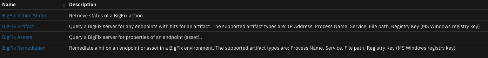
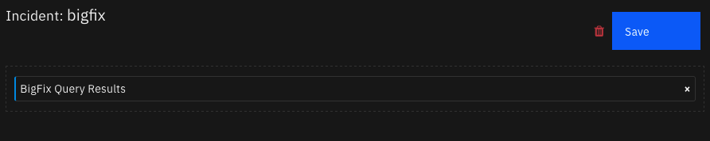
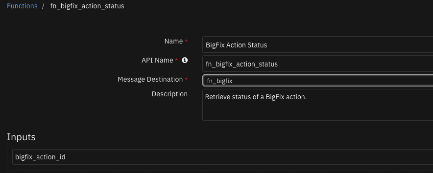
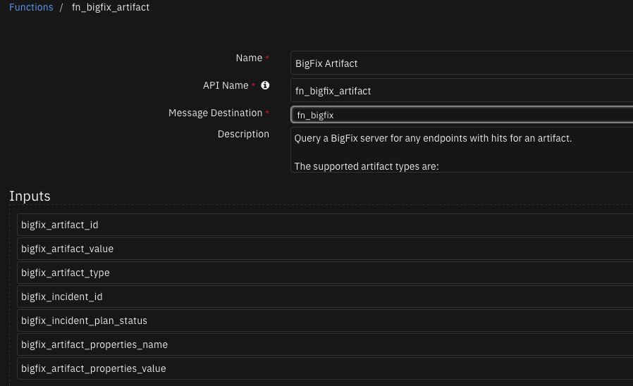
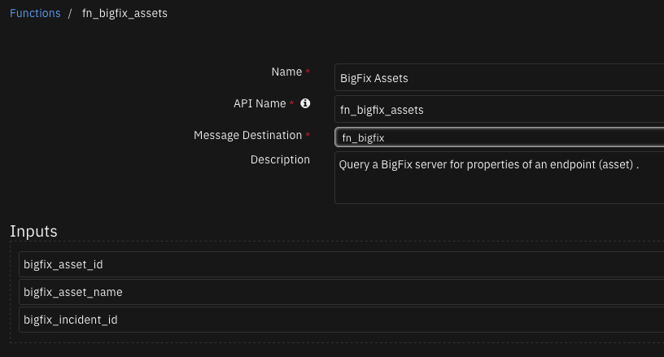
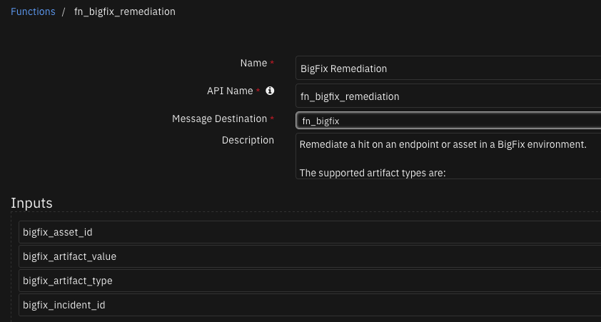
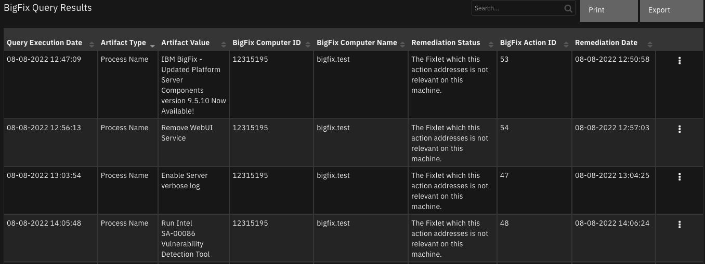

# BigFix Integration for SOAR

## Table of Contents
- [Release Notes](#release-notes)
- [Overview](#overview)
  - [Key Features](#key-features)
- [Requirements](#requirements)
  - [SOAR platform](#soar-platform)
  - [Cloud Pak for Security](#cloud-pak-for-security)
  - [Proxy Server](#proxy-server)
  - [Python Environment](#python-environment)
- [Installation](#installation)
  - [Install](#install)
  - [App Configuration](#app-configuration)
  - [Custom Layouts](#custom-layouts)
- [Function - BigFix Action Status](#function---bigfix-action-status)
- [Function - BigFix Artifact](#function---bigfix-artifact)
- [Function - BigFix Assets](#function---bigfix-assets)
- [Function - BigFix Remediation](#function---bigfix-remediation)
- [Data Table - BigFix Query Results](#data-table---bigfix-query-results)
- [Rules](#rules)
- [Troubleshooting & Support](#troubleshooting--support)
---

## Release Notes
| Version | Date | Notes |
| ------- | ---- | ----- |
| 1.2.0 | 08/2022 | Bug fixes and update code |
| 1.1.2 | 08/2020 | Added support added for App Host and Added proxy support Added selftest functionality |
| 1.1.1 | 08/2019 | New configuration option ‘bigfix_endpoints_wait’. Configuration option ‘hunt_results_limit’ renamed to ‘bigfix_hunt_results_limit’. |
| 1.1.0 | 10/2018 | Bug fixes and redesign for the Resilient Functions feature. Includes Bug fixes. |
| 1.0.0 | 10/2018 | Initial Release |

---

## Overview
**SOAR Components for BigFix**

 

BigFix is a systems-management platform for managing a large numbers of endpoints.
The BigFix integration with the SOAR platform allows for the querying and updating of a BigFix deployment. The integration includes a function to query for IOCs in the BigFix environment. Returned results can be used to remediate issues or hits, such as a malicious path or filename, a service or process name, or a registry key. The integration can also be used to query properties of an endpoint.

### Key Features
<!--
  List the Key Features of the Integration
-->
* Query a BigFix server for any endpoints with IOC hits for an artifact
* Remediate a hit on an endpoint or asset in a BigFix environment.
* Retrieve status of a BigFix action.
* Query a BigFix server for properties of an endpoint (asset).

---

## Requirements
This app supports the IBM Security QRadar SOAR Platform and the IBM Security QRadar SOAR for IBM Cloud Pak for Security.

### SOAR platform
The SOAR platform supports two app deployment mechanisms, App Host and integration server.

If deploying to a SOAR platform with an App Host, the requirements are:
* SOAR platform >= `43.1.49`.
* The app is in a container-based format (available from the AppExchange as a `zip` file).

If deploying to a SOAR platform with an integration server, the requirements are:
* SOAR platform >= `43.1.49`.
* The app is in the older integration format (available from the AppExchange as a `zip` file which contains a `tar.gz` file).
* Integration server is running `resilient_circuits>=43.0.0`.
* If using an API key account, make sure the account provides the following minimum permissions: 
  | Name | Permissions |
  | ---- | ----------- |
  | Org Data | Read |
  | Function | Read |
  | Incident fields | Edit |

The following SOAR platform guides provide additional information: 
* _App Host Deployment Guide_: provides installation, configuration, and troubleshooting information, including proxy server settings. 
* _Integration Server Guide_: provides installation, configuration, and troubleshooting information, including proxy server settings.
* _System Administrator Guide_: provides the procedure to install, configure and deploy apps. 

The above guides are available on the IBM Documentation website at [ibm.biz/soar-docs](https://ibm.biz/soar-docs). On this web page, select your SOAR platform version. On the follow-on page, you can find the _App Host Deployment Guide_ or _Integration Server Guide_ by expanding **Apps** in the Table of Contents pane. The System Administrator Guide is available by expanding **System Administrator**.

### Cloud Pak for Security
If you are deploying to IBM Cloud Pak for Security, the requirements are:
* IBM Cloud Pak for Security >= 1.4.
* Cloud Pak is configured with an App Host.
* The app is in a container-based format (available from the AppExchange as a `zip` file).

The following Cloud Pak guides provide additional information: 
* _App Host Deployment Guide_: provides installation, configuration, and troubleshooting information, including proxy server settings. From the Table of Contents, select Case Management and Orchestration & Automation > **Orchestration and Automation Apps**.
* _System Administrator Guide_: provides information to install, configure, and deploy apps. From the IBM Cloud Pak for Security IBM Documentation table of contents, select Case Management and Orchestration & Automation > **System administrator**.

These guides are available on the IBM Documentation website at [ibm.biz/cp4s-docs](https://ibm.biz/cp4s-docs). From this web page, select your IBM Cloud Pak for Security version. From the version-specific IBM Documentation page, select Case Management and Orchestration & Automation.

### Proxy Server
The app does support a proxy server.

### Python Environment
Both Python 3.9 and Python 3.6 are supported.
Additional package dependencies may exist for each of these packages:
* resilient_circuits>=43.0.0

---

## Installation

### Install
* To install or uninstall an App or Integration on the _SOAR platform_, see the documentation at [ibm.biz/soar-docs](https://ibm.biz/soar-docs).
* To install or uninstall an App on _IBM Cloud Pak for Security_, see the documentation at [ibm.biz/cp4s-docs](https://ibm.biz/cp4s-docs) and follow the instructions above to navigate to Orchestration and Automation.

### App Configuration
The following table provides the settings you need to configure the app. These settings are made in the app.config file. See the documentation discussed in the Requirements section for the procedure.

| Config | Required | Example | Description |
| ------ | :------: | ------- | ----------- |
| **bigfix_endpoints_wait** | Yes | `30` | *Time to wait in seconds for bigfix endpoint to respond to query* |
| **bigfix_hunt_results_limit** | Yes | `200` | *The max number of results to be returned from a query* |
| **bigfix_pass** | Yes | `MyPassword` | *Bigfix user password* |
| **bigfix_polling_interval** | Yes | `30` | *Time to wait in seconds between polling calls* |
| **bigfix_polling_timeout** | Yes | `600` | ** |
| **bigfix_port** | Yes | `12345` | *Port to communicate with bigfix server* |
| **bigfix_url** | Yes | `https://bigfix-url.com` | *URl to the bigfix server* |
| **bigfix_user** | Yes | `BigFixAdmin` | *Bigfix username* |

### Custom Layouts
<!--
  Use this section to provide guidance on where the user should add any custom fields and data tables.
  You may wish to recommend a new incident tab.
  You should save a screenshot "custom_layouts.png" in the doc/screenshots directory and reference it here
-->
* Import the Data Tables and Custom Fields like the screenshot below:

  


---

## Function - BigFix Action Status
Retrieve status of a BigFix action.

 

<details><summary>Inputs:</summary>
<p>

| Name | Type | Required | Example | Tooltip |
| ---- | :--: | :------: | ------- | ------- |
| `bigfix_action_id` | `number` | Yes | `-` | BigFix action id. |

</p>
</details>

<details><summary>Outputs:</summary>
<p>

> **NOTE:** This example might be in JSON format, but `results` is a Python Dictionary on the SOAR platform.

```python
results = {
  "content": {
    "status": "OK",
    "status_message": "The Fixlet which this action addresses is not relevant on this machine."
  },
  "inputs": {
    "bigfix_action_id": 48
  },
  "metrics": {
    "execution_time_ms": 60372,
    "host": "local",
    "package": "fn-bigfix",
    "package_version": "1.2.0",
    "timestamp": "2022-08-08 14:07:26",
    "version": "1.0"
  },
  "raw": null,
  "reason": null,
  "success": true,
  "version": 2.0
}
```

</p>
</details>

<details><summary>Example Pre-Process Script:</summary>
<p>

```python
inputs.bigfix_action_id = row.res_bigfix_action_id
```

</p>
</details>

<details><summary>Example Post-Process Script:</summary>
<p>

```python
result = results.get('content')
status = result.get("status")
status_message = result.get("status_message")
action_id = row.res_bigfix_action_id

if (status and (status == "OK" or status == "Failed")):
  row.res_remediation_status = status_message
  noteText = "Big Fix Integration: Big Fix Action ID <b>'{}'</b> finished with status <b>'{}'</b>." \
              .format(action_id, status_message)
else:
  noteText = "Big Fix Integration: Big Fix Action ID <b>'{}'</b> unsuccessful.".format(action_id)

incident.addNote(helper.createRichText(noteText))
```

</p>
</details>

---
## Function - BigFix Artifact
Query a BigFix server for any endpoints with hits for an artifact.

The supported artifact types are:
IP Address,
Process Name,
Service,
File path,
Registry Key (MS Windows registry key)

 

<details><summary>Inputs:</summary>
<p>

| Name | Type | Required | Example | Tooltip |
| ---- | :--: | :------: | ------- | ------- |
| `bigfix_artifact_id` | `number` | Yes | `-` | Resilient artifact id. |
| `bigfix_artifact_properties_name` | `text` | No | `-` | Resilient artifact property used when artifact type = 'Registry Key'. |
| `bigfix_artifact_properties_value` | `text` | No | `-` | Resilient artifact property used when artifact type = 'Registry Key'. |
| `bigfix_artifact_type` | `text` | Yes | `-` | Resilient artifact type can be assigned from from incident or Datatable row. |
| `bigfix_artifact_value` | `text` | Yes | `-` | Resilient artifact value can be assigned from from incident or Datatable row. |
| `bigfix_incident_id` | `number` | Yes | `-` | Resilient incident id. |
| `bigfix_incident_plan_status` | `text` | Yes | `-` | Resilient incident field. |

</p>
</details>

<details><summary>Outputs:</summary>
<p>

> **NOTE:** This example might be in JSON format, but `results` is a Python Dictionary on the SOAR platform.

```python
results = {
  "content": {
    "endpoint_hits": [
      {
        "computer_id": 12315195,
        "computer_name": "bigfix.test",
        "failure": false,
        "query_id": 1,
        "resp_time": 0,
        "result": "False"
      }
    ],
    "hits_count": 1,
    "hits_over_limit": false,
    "query_execution_date": "08-08-2022 14:05:48"
  },
  "inputs": {
    "bigfix_artifact_id": 30,
    "bigfix_artifact_type": "Process Name",
    "bigfix_artifact_value": "Run Intel SA-00086 Vulnerability Detection Tool",
    "bigfix_incident_id": 2111,
    "bigfix_incident_plan_status": "A"
  },
  "metrics": {
    "execution_time_ms": 15313,
    "host": "local",
    "package": "fn-bigfix",
    "package_version": "1.2.0",
    "timestamp": "2022-08-08 14:05:48",
    "version": "1.0"
  },
  "raw": null,
  "reason": null,
  "success": true,
  "version": 2.0
}
```

</p>
</details>

<details><summary>Example Pre-Process Script:</summary>
<p>

```python
inputs.bigfix_artifact_id = artifact.id
inputs.bigfix_artifact_value = artifact.value
inputs.bigfix_artifact_type = artifact.type
if artifact.properties:
  inputs.bigfix_artifact_properties_name = artifact.properties[0]["name"]
  inputs.bigfix_artifact_properties_value = artifact.properties[0]["value"]
inputs.bigfix_incident_id = incident.id
inputs.bigfix_incident_plan_status = incident.plan_status
```

</p>
</details>

<details><summary>Example Post-Process Script:</summary>
<p>

```python
noteText = u"BigFix Integration: Ran query for artifact id {} of type {} and value {}.".format(artifact.id, artifact.type, artifact.value)

if results.get("content"):
  content = results.get("content")
  endpoint_hits = content.get("endpoint_hits")
  hits_count = content.get("hits_count")
  query_execution_date = content.get("query_execution_date")
  hits_over_limit = content.get("hits_over_limit")
  att_name = content.get("att_name")
  if hits_over_limit:
    noteText += "There were {} hits found. Added as an attachment. Attachment name: {}".format(hits_count, att_name)
  elif endpoint_hits:
    noteText += "There were {} hits found.".format(hits_count)
    for eh in endpoint_hits:
      newrow = incident.addRow('res_bigfix_query_results')
      newrow["res_query_execution_date"] = query_execution_date
      newrow["res_remediation_status"] = "None"
      newrow["res_artifact_type"] = artifact.type
      newrow["res_artifact_value"] = artifact.value
      newrow["res_bigfix_computer_id"] = eh.get("computer_id")
      newrow["res_bigfix_computer_name"] = eh.get("computer_name")
else:
  noteText += "There were no hits found."

incident.addNote(noteText)
```

</p>
</details>

---
## Function - BigFix Assets
Query a BigFix server for properties of an endpoint (asset).

 

<details><summary>Inputs:</summary>
<p>

| Name | Type | Required | Example | Tooltip |
| ---- | :--: | :------: | ------- | ------- |
| `bigfix_asset_id` | `number` | Yes | `-` | BigFix asset or endpoint id, assigned from datatable entry. |
| `bigfix_asset_name` | `text` | Yes | `-` | BigFix asset or endpoint name, assigned from datatable entry. |
| `bigfix_incident_id` | `number` | Yes | `-` | Resilient incident id. |

</p>
</details>

<details><summary>Outputs:</summary>
<p>

> **NOTE:** This example might be in JSON format, but `results` is a Python Dictionary on the SOAR platform.

```python
results = {
  "content": {
    "att_name": "bigfix-properties-bigfix.test-20220808.xml",
    "status": "OK"
  },
  "inputs": {
    "bigfix_asset_id": 12315195,
    "bigfix_asset_name": "bigfix.test",
    "bigfix_incident_id": 2111
  },
  "metrics": {
    "execution_time_ms": 1708,
    "host": "local",
    "package": "fn-bigfix",
    "package_version": "1.2.0",
    "timestamp": "2022-08-08 14:06:13",
    "version": "1.0"
  },
  "raw": null,
  "reason": null,
  "success": true,
  "version": 2.0
}
```

</p>
</details>

<details><summary>Example Pre-Process Script:</summary>
<p>

```python
inputs.bigfix_asset_name = row.res_bigfix_computer_name
inputs.bigfix_asset_id = row.res_bigfix_computer_id
inputs.bigfix_incident_id = incident.id
```

</p>
</details>

<details><summary>Example Post-Process Script:</summary>
<p>

```python
result = results.get("content")
status = result.get("status")
status_note = result.get("status_note")
att_name = result.get("att_name")

if status and status == "OK":
  noteText = u"BigFix Integration: Ran query for BigFix Asset id <b>'{}'</b> and name <b>'{}'</b>. " \
             "Added as an attachment. Attachment name: <b>{}</b> "\
              .format(row.res_bigfix_computer_id, unicode(row.res_bigfix_computer_name), att_name)
else:
  noteText = u"BigFix Integration: Query unsuccessful for BigFix Asset id <b>'{}'</b> and name <b>'{}'</b>."\
              .format(row.res_bigfix_computer_id, unicode(row.res_bigfix_computer_name))

incident.addNote(helper.createRichText(noteText))
```

</p>
</details>

---
## Function - BigFix Remediation
Remediate a hit on an endpoint or asset in a BigFix environment.

The supported artifact types are:
Process Name,
Service,
File path,
Registry Key (MS Windows registry key)

 

<details><summary>Inputs:</summary>
<p>

| Name | Type | Required | Example | Tooltip |
| ---- | :--: | :------: | ------- | ------- |
| `bigfix_artifact_type` | `text` | Yes | `-` | Resilient artifact type can be assigned from from incident or Datatable row. |
| `bigfix_artifact_value` | `text` | Yes | `-` | Resilient artifact value can be assigned from from incident or Datatable row. |
| `bigfix_asset_id` | `number` | Yes | `-` | BigFix asset or endpoint id, assigned from datatable entry. |
| `bigfix_incident_id` | `number` | Yes | `-` | Resilient incident id. |

</p>
</details>

<details><summary>Outputs:</summary>
<p>

> **NOTE:** This example might be in JSON format, but `results` is a Python Dictionary on the SOAR platform.

```python
results = {
  "content": {
    "action_id": "48",
    "remediation_date": "08-08-2022 14:06:24",
    "status": "OK",
    "status_message": "BigFix action created successfully."
  },
  "inputs": {
    "bigfix_artifact_type": "Process Name",
    "bigfix_artifact_value": "Run Intel SA-00086 Vulnerability Detection Tool",
    "bigfix_asset_id": 12315195,
    "bigfix_incident_id": 2111
  },
  "metrics": {
    "execution_time_ms": 412,
    "host": "local",
    "package": "fn-bigfix",
    "package_version": "1.2.0",
    "timestamp": "2022-08-08 14:06:24",
    "version": "1.0"
  },
  "raw": null,
  "reason": null,
  "success": true,
  "version": 2.0
}
```

</p>
</details>

<details><summary>Example Pre-Process Script:</summary>
<p>

```python
inputs.bigfix_asset_id = row.res_bigfix_computer_id
inputs.bigfix_artifact_value = row.res_artifact_value
inputs.bigfix_artifact_type = row.res_artifact_type.content
inputs.bigfix_incident_id = incident.id
```

</p>
</details>

<details><summary>Example Post-Process Script:</summary>
<p>

```python
result = results.get("content")
status = result.get("status")
action_id = result.get("action_id")
if status and status == "OK":
  row.res_remediation_status = result.get("status_message")
  row.res_remediation_date = result.get("remediation_date")
  row.res_bigfix_action_id = action_id
  noteText = u"Big Fix Integration: Action created successfully to remediate artifact value <b>'{}'</b> " \
              "and type <b>'{}'</b> on endpoint <b>'{}'</b>. BigFix Action ID <b>'{}'</b>."\
              .format(unicode(row.res_artifact_value), row.res_artifact_type.content, unicode(row.res_bigfix_computer_name), action_id)
else:
  noteText = u"Big Fix Integration: Action creation unsuccessful to remediate artifact value <b>'{}'</b> " \
             "and type <b>'{}'</b> on endpoint <b>'{}'</b>."\
            .format(unicode(row.res_artifact_value), row.res_artifact_type.content, unicode(row.res_bigfix_computer_name))
incident.addNote(helper.createRichText(noteText))
```

</p>
</details>

---


## Data Table - BigFix Query Results

 

#### API Name:
res_bigfix_query_results

#### Columns:
| Column Name | API Access Name | Type | Tooltip |
| ----------- | --------------- | ---- | ------- |
| Artifact Type | `res_artifact_type` | `textarea` | - |
| Artifact Value | `res_artifact_value` | `text` | - |
| BigFix Action ID | `res_bigfix_action_id` | `text` | - |
| BigFix Computer ID | `res_bigfix_computer_id` | `text` | - |
| BigFix Computer Name | `res_bigfix_computer_name` | `text` | - |
| Query Execution Date | `res_query_execution_date` | `text` | - |
| Remediation Date | `res_remediation_date` | `text` | - |
| Remediation Status | `res_remediation_status` | `text` | - |

---


## Rules
| Rule Name | Object | Workflow Triggered |
| --------- | ------ | ------------------ |
| Example: BigFix Query for Artifact | artifact | `bigfix_query_for_artifact` |
| Example: BigFix Remediate | res_bigfix_query_results | `bigfix_remediate` |
| Example: BigFix Retrieve Resource Details | res_bigfix_query_results | `bigfix_retrieve_resource_details` |
| Example: BigFix Update Action status | res_bigfix_query_results | `bigfix_update_action_status` |

---


## Troubleshooting & Support
Refer to the documentation listed in the Requirements section for troubleshooting information.

### For Support
This is a IBM Community provided App. Please search the Community [ibm.biz/soarcommunity](https://ibm.biz/soarcommunity) for assistance.
