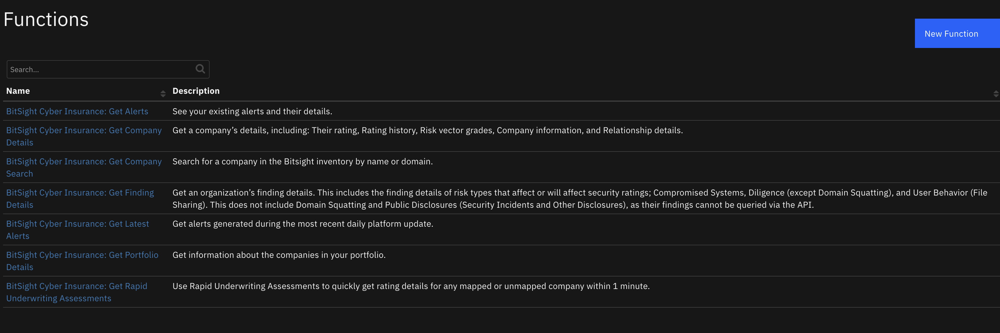
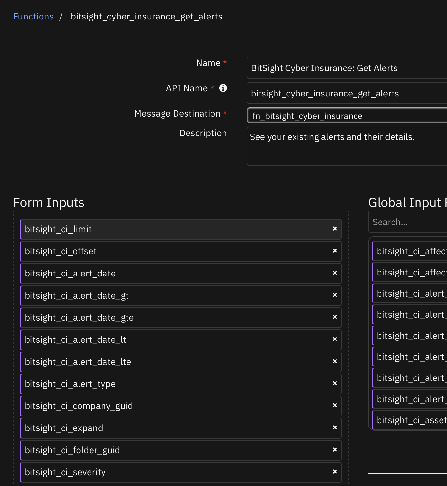
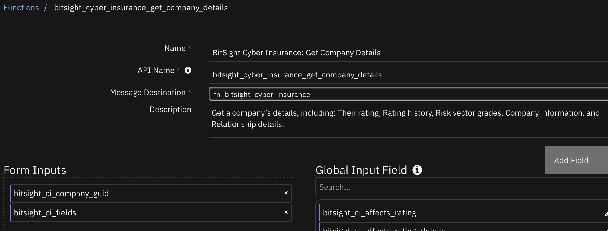
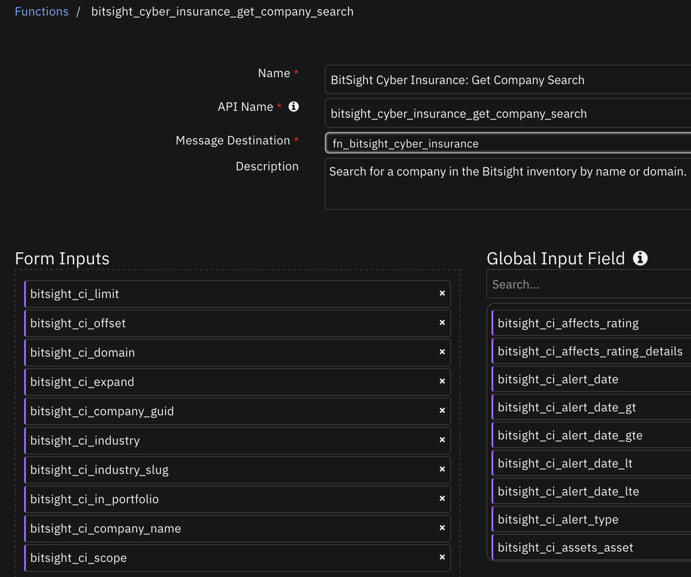
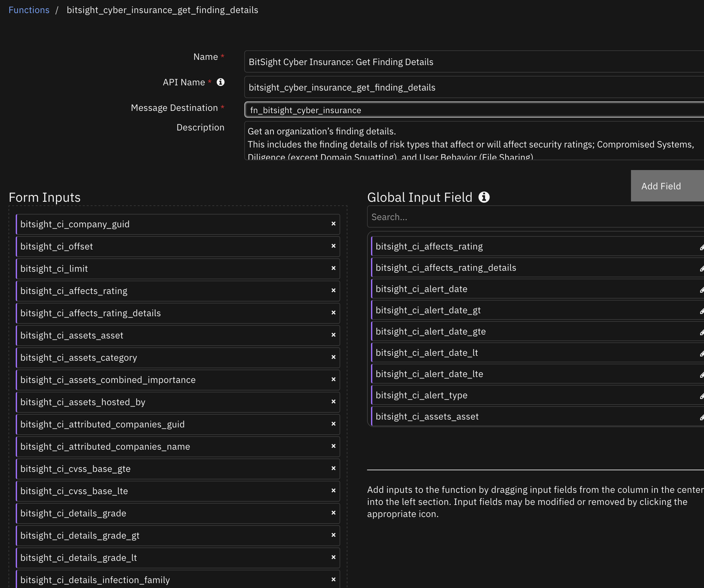
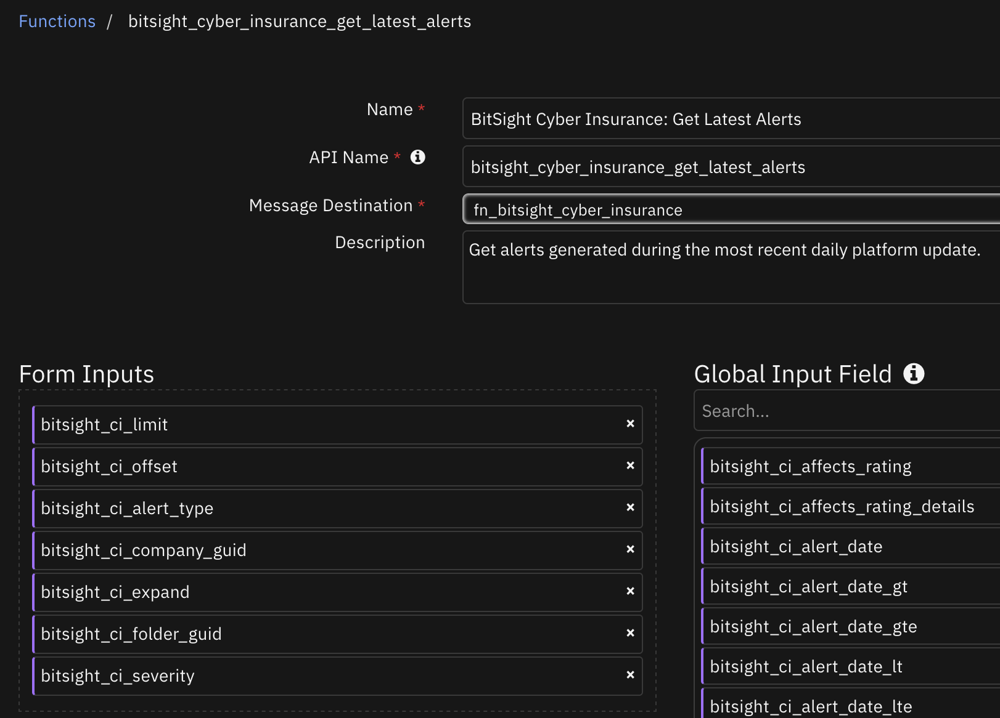
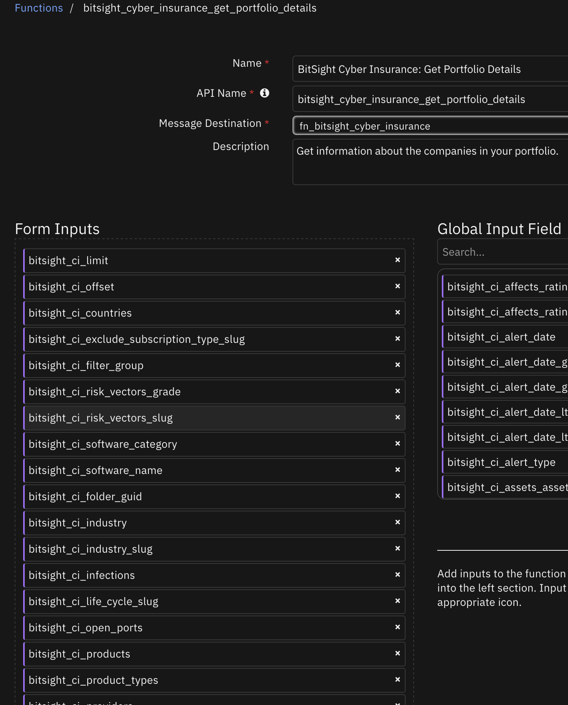
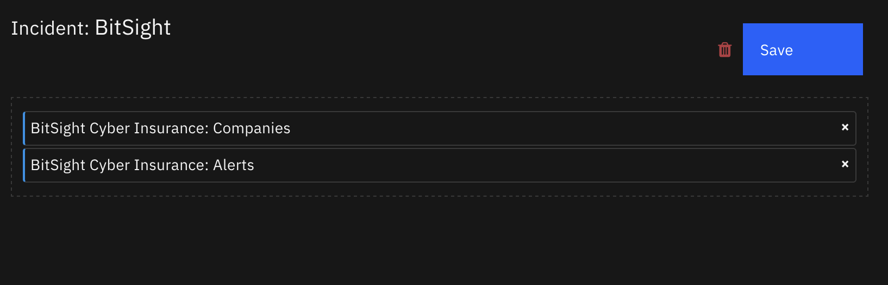
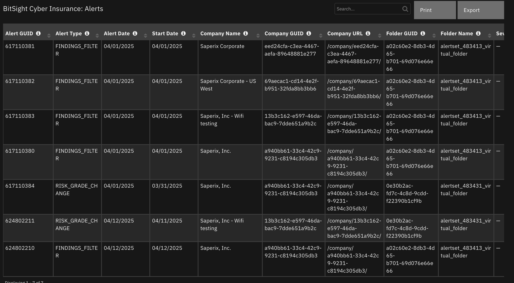
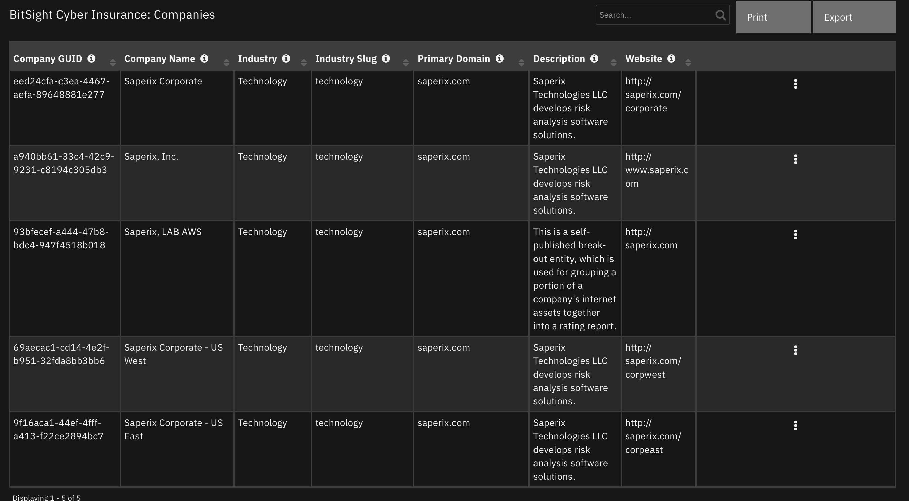

# BitSight Cyber Insurance

## Table of Contents
- [Release Notes](#release-notes)
- [Overview](#overview)
  - [Key Features](#key-features)
- [Requirements](#requirements)
  - [SOAR platform](#soar-platform)
  - [Cloud Pak for Security](#cloud-pak-for-security)
  - [Proxy Server](#proxy-server)
  - [Python Environment](#python-environment)
- [Installation](#installation)
  - [Install](#install)
  - [App Configuration](#app-configuration)
- [Function - BitSight Cyber Insurance: Get Alerts](#function---bitsight-cyber-insurance-get-alerts)
- [Function - BitSight Cyber Insurance: Get Company Details](#function---bitsight-cyber-insurance-get-company-details)
- [Function - BitSight Cyber Insurance: Get Company Search](#function---bitsight-cyber-insurance-get-company-search)
- [Function - BitSight Cyber Insurance: Get Finding Details](#function---bitsight-cyber-insurance-get-finding-details)
- [Function - BitSight Cyber Insurance: Get Latest Alerts](#function---bitsight-cyber-insurance-get-latest-alerts)
- [Function - BitSight Cyber Insurance: Get Portfolio Details](#function---bitsight-cyber-insurance-get-portfolio-details)
  - [Custom Layouts](#custom-layouts)
- [Data Table - BitSight Cyber Insurance: Alerts](#data-table---bitsight-cyber-insurance-alerts)
- [Data Table - BitSight Cyber Insurance: Companies](#data-table---bitsight-cyber-insurance-companies)
- [Playbooks](#playbooks)
- [Troubleshooting & Support](#troubleshooting--support)

---

## Release Notes
<!--
  Specify all changes in this release. Do not remove the release
  notes of a previous release
-->
| Version | Date | Notes |
| ------- | ---- | ----- |
| 1.0.0 | 07/2025 | Initial Release |

---

## Overview
<!--
  Provide a high-level description of the function itself and its remote software or application.
  The text below is parsed from the "description" and "long_description" attributes in the setup.py file
-->
**BitSight Cyber Insurance for IBM SOAR**

 

BitSight Cyber Insurance for IBM SOAR

This integration provides the following functions:
- Get Alerts
- Get Company Details
- Get Company Search
- Get Finding Details
- Get latest Alerts
- Get Portfolio Details
- Get Rapid Underwriting Assessments

Links:
<ul><a target='blank' href='https://ibm.com/mysupport'>Support</a></ul>
<ul><a target='blank' href='https://ideas.ibm.com/'>Enhancement Requests</a></ul>

### Key Features
<!--
  List the Key Features of the Integration
-->
* Get Alerts
* Get Company Details
* Get Company Search
* Get Finding Details
* Get Latest Alerts
* Get Portfolio Details

---

## Requirements
This app supports the IBM Security QRadar SOAR Platform and the IBM Security QRadar SOAR for IBM Cloud Pak for Security.

### SOAR platform
The SOAR platform supports two app deployment mechanisms, Edge Gateway (also known as App Host) and integration server.

If deploying to a SOAR platform with an App Host, the requirements are:
* SOAR platform >= `51.0.0.0.9339`.
* The app is in a container-based format (available from the AppExchange as a `zip` file).

If deploying to a SOAR platform with an integration server, the requirements are:
* SOAR platform >= `51.0.0.0.9339`.
* The app is in the older integration format (available from the AppExchange as a `zip` file which contains a `tar.gz` file).
* Integration server is running `resilient-circuits>=51.0.0.0.0`.
* If using an API key account, make sure the account provides the following minimum permissions:
  | Name | Permissions |
  | ---- | ----------- |
  | Org Data | Read |
  | Function | Read |
  | Incident.Fields | Write |
 

The following SOAR platform guides provide additional information:
* _Edge Gateway Deployment Guide_ or _App Host Deployment Guide_: provides installation, configuration, and troubleshooting information, including proxy server settings.
* _Integration Server Guide_: provides installation, configuration, and troubleshooting information, including proxy server settings.
* _System Administrator Guide_: provides the procedure to install, configure and deploy apps.

The above guides are available on the IBM Documentation website at [ibm.biz/soar-docs](https://ibm.biz/soar-docs). On this web page, select your SOAR platform version. On the follow-on page, you can find the _Edge Gateway Deployment Guide_, _App Host Deployment Guide_, or _Integration Server Guide_ by expanding **Apps** in the Table of Contents pane. The System Administrator Guide is available by expanding **System Administrator**.

### Cloud Pak for Security
If you are deploying to IBM Cloud Pak for Security, the requirements are:
* IBM Cloud Pak for Security >= `1.10.15`.
* Cloud Pak is configured with an Edge Gateway.
* The app is in a container-based format (available from the AppExchange as a `zip` file).

The following Cloud Pak guides provide additional information:
* _Edge Gateway Deployment Guide_ or _App Host Deployment Guide_: provides installation, configuration, and troubleshooting information, including proxy server settings. From the Table of Contents, select Case Management and Orchestration & Automation > **Orchestration and Automation Apps**.
* _System Administrator Guide_: provides information to install, configure, and deploy apps. From the IBM Cloud Pak for Security IBM Documentation table of contents, select Case Management and Orchestration & Automation > **System administrator**.

These guides are available on the IBM Documentation website at [ibm.biz/cp4s-docs](https://ibm.biz/cp4s-docs). From this web page, select your IBM Cloud Pak for Security version. From the version-specific IBM Documentation page, select Case Management and Orchestration & Automation.

### Proxy Server
The app **does** support a proxy server.

### Python Environment
Python 3.9, 3.11, and 3.12 are officially supported. When deployed as an app, the app runs on Python 3.11.
Additional package dependencies may exist for each of these packages:
* resilient-circuits>=51.0.0.0.0

### Development Version

This app has been implemented using:
| Product Name | Product Version | API URL | API Version |
| ------------ | --------------- | ------- | ----------- |
| BitSight Cyber Insurance | v1 | https://help.bitsighttech.com/hc/en-us/articles/8344232732055-Cyber-Insurance-API-Guide | v1 |

---

## Installation

### Install
* To install or uninstall an App or Integration on the _SOAR platform_, see the documentation at [ibm.biz/soar-docs](https://ibm.biz/soar-docs).
* To install or uninstall an App on _IBM Cloud Pak for Security_, see the documentation at [ibm.biz/cp4s-docs](https://ibm.biz/cp4s-docs) and follow the instructions above to navigate to Orchestration and Automation.

### App Configuration
The following table provides the settings you need to configure the app. These settings are made in the app.config file. See the documentation discussed in the Requirements section for the procedure.

| Config | Required | Example | Description |
| ------ | :------: | ------- | ----------- |
| **bitsight_api_token** | Yes | `` | API token from Bitsight. |
| **bitsight_url** | Yes | `https://api.bitsighttech.com/ratings/` | Bitsight ratings API URL. |
| **client_auth_cert** | Yes | `<path_to_cert.pem>` | Path the client authentication certificate. |
| **client_auth_key** | Yes | `<path_to_cert_private_key.pem>` | Path to client authentication Key file. |

 ---

## Function - BitSight Cyber Insurance: Get Alerts
See your existing alerts and their details.

 

<details><summary>Inputs:</summary>
<p>

| Name | Type | Required | Example | Tooltip |
| ---- | :--: | :------: | ------- | ------- |
| `bitsight_ci_alert_date` | `datepicker` | No | `2021-04-18` | Filter alerts by the specified alert date. Format YYYY‑MM‑DD |
| `bitsight_ci_alert_date_gt` | `datepicker` | No | `2021-04-18` | Filter alerts after the requested date. This parameter is incompatible with alert_date. Format YYYY‑MM‑DD |
| `bitsight_ci_alert_date_gte` | `datepicker` | No | `2021-04-18` | Filter alerts after or on the requested date. This parameter is incompatible with alert_date. Format YYYY‑MM‑DD |
| `bitsight_ci_alert_date_lt` | `datepicker` | No | `2021-04-18` | Filter alerts prior to the requested date. This parameter is incompatible with alert_date. Format YYYY‑MM‑DD |
| `bitsight_ci_alert_date_lte` | `datepicker` | No | `2021-04-18` | Filter alerts prior to or on the requested date. This parameter is incompatible with alert_date. Format YYYY‑MM‑DD |
| `bitsight_ci_alert_type` | `select` | No | `-` | Filter alerts by the specified alert category. Allowed values: PERCENT_CHANGE, RATING_THRESHOLD, RISK_CATEGORY, NIST_CATEGORY, INFORMATIONAL, PUBLIC_DISCLOSURE, VULNERABILITY, FINDINGS_FILTER |
| `bitsight_ci_clear_datatable` | `boolean` | No | `-` | Clear a SOAR data table before new data is added to it. |
| `bitsight_ci_company_guid` | `text` | No | `xxxxxxxx-xxxx-xxxx-xxxx-xxxxxxxxxxxx` | The GUID of a company. |
| `bitsight_ci_expand` | `text` | No | `details` |  Include additional alert details. Examples: company_custom_id or details only one can be given. |
| `bitsight_ci_folder_guid` | `text` | No | `xxxxxxxx-xxxx-xxxx-xxxx-xxxxxxxxxxxx` | Filter alerts by the specified folder. Folder unique identifier. |
| `bitsight_ci_limit` | `number` | No | `100` | Set the maximum number of results. The results might include fewer records (even zero), but not more. Defaults to 100. |
| `bitsight_ci_offset` | `number` | No | `0` | Set the starting point of the return. Defaults to 0. |
| `bitsight_ci_severity` | `select` | No | `-` | Filter alerts by the specified change severity. Allowed values: CRITICAL, WARN, INCREASE, INFORMATIONAL |
| `bitsight_ci_soar_datatable_name` | `text` | No | `-` | Name of the SOAR data table to clear. |
| `bitsight_ci_soar_incident_id` | `number` | No | `-` | ID of the SOAR incident |

</p>
</details>

<details><summary>Outputs:</summary>
<p>

> **NOTE:** This example might be in JSON format, but `results` is a Python Dictionary on the SOAR platform.

```python
results = {
  "content": [
    {
      "alert_date": "2025-04-01",
      "alert_set_guid": "xxxxxxxx-xxxx-xxxx-xxxx-xxxxxxxxxxxx",
      "alert_set_name": "New findings",
      "alert_type": "FINDINGS_FILTER",
      "company_guid": "xxxxxxxx-xxxx-xxxx-xxxx-xxxxxxxxxxxx",
      "company_name": "Saperix Corporate",
      "company_url": "/company/xxxxxxxx-xxxx-xxxx-xxxx-xxxxxxxxxxxx/",
      "folder_guid": "xxxxxxxx-xxxx-xxxx-xxxx-xxxxxxxxxxxx",
      "folder_name": "alertset_483413_virtual_folder",
      "guid": 617110381,
      "severity": null,
      "start_date": "2025-04-01",
      "trigger": "FINDINGS_FILTER"
    },
    {
      "alert_date": "2025-04-01",
      "alert_set_guid": "xxxxxxxx-xxxx-xxxx-xxxx-xxxxxxxxxxxx",
      "alert_set_name": "New findings",
      "alert_type": "FINDINGS_FILTER",
      "company_guid": "xxxxxxxx-xxxx-xxxx-xxxx-xxxxxxxxxxxx",
      "company_name": "Saperix Corporate - US West",
      "company_url": "/company/xxxxxxxx-xxxx-xxxx-xxxx-xxxxxxxxxxxx/",
      "folder_guid": "xxxxxxxx-xxxx-xxxx-xxxx-xxxxxxxxxxxx",
      "folder_name": "alertset_483413_virtual_folder",
      "guid": 617110382,
      "severity": null,
      "start_date": "2025-04-01",
      "trigger": "FINDINGS_FILTER"
    },
    {
      "alert_date": "2025-04-01",
      "alert_set_guid": "xxxxxxxx-xxxx-xxxx-xxxx-xxxxxxxxxxxx",
      "alert_set_name": "New findings",
      "alert_type": "FINDINGS_FILTER",
      "company_guid": "xxxxxxxx-xxxx-xxxx-xxxx-xxxxxxxxxxxx",
      "company_name": "Saperix, Inc - Wifi testing",
      "company_url": "/company/xxxxxxxx-xxxx-xxxx-xxxx-xxxxxxxxxxxx/",
      "folder_guid": "xxxxxxxx-xxxx-xxxx-xxxx-xxxxxxxxxxxx",
      "folder_name": "alertset_483413_virtual_folder",
      "guid": 617110383,
      "severity": null,
      "start_date": "2025-04-01",
      "trigger": "FINDINGS_FILTER"
    },
    {
      "alert_date": "2025-04-01",
      "alert_set_guid": "xxxxxxxx-xxxx-xxxx-xxxx-xxxxxxxxxxxx",
      "alert_set_name": "New findings",
      "alert_type": "FINDINGS_FILTER",
      "company_guid": "xxxxxxxx-xxxx-xxxx-xxxx-xxxxxxxxxxxx",
      "company_name": "Saperix, Inc.",
      "company_url": "/company/xxxxxxxx-xxxx-xxxx-xxxx-xxxxxxxxxxxx/",
      "folder_guid": "xxxxxxxx-xxxx-xxxx-xxxx-xxxxxxxxxxxx",
      "folder_name": "alertset_483413_virtual_folder",
      "guid": 617110380,
      "severity": null,
      "start_date": "2025-04-01",
      "trigger": "FINDINGS_FILTER"
    },
    {
      "alert_date": "2025-04-01",
      "alert_set_guid": "xxxxxxxx-xxxx-xxxx-xxxx-xxxxxxxxxxxx",
      "alert_set_name": "Risk Vector Grades",
      "alert_type": "RISK_GRADE_CHANGE",
      "company_guid": "xxxxxxxx-xxxx-xxxx-xxxx-xxxxxxxxxxxx",
      "company_name": "Saperix, Inc.",
      "company_url": "/company/xxxxxxxx-xxxx-xxxx-xxxx-xxxxxxxxxxxx/",
      "folder_guid": "xxxxxxxx-xxxx-xxxx-xxxx-xxxxxxxxxxxx",
      "folder_name": "alertset_483431_virtual_folder",
      "guid": 617110384,
      "severity": null,
      "start_date": "2025-03-31",
      "trigger": "RISK_GRADE_CHANGE"
    }
  ],
  "inputs": {
    "bitsight_ci_alert_date": 1743465600000,
    "bitsight_ci_alert_date_gt": 1740787200000,
    "bitsight_ci_alert_date_gte": 1743552000000,
    "bitsight_ci_limit": 5
  },
  "metrics": {
    "execution_time_ms": 177,
    "host": "local",
    "package": "fn-bitsight-cyber-insurance",
    "package_version": "1.0.0",
    "timestamp": "2025-04-14 09:19:46",
    "version": "1.0"
  },
  "raw": null,
  "reason": null,
  "success": true,
  "version": 2.0
}
```

</p>
</details>

<details><summary>Example Function Input Script:</summary>
<p>

```python
if getattr(playbook.inputs, "bitsight_ci_alert_date", None):
  inputs.bitsight_ci_alert_date = getattr(playbook.inputs, "bitsight_ci_alert_date", None)
if getattr(playbook.inputs, "bitsight_ci_alert_date_gt", None):
  inputs.bitsight_ci_alert_date_gt = getattr(playbook.inputs, "bitsight_ci_alert_date_gt", None)
if getattr(playbook.inputs, "bitsight_ci_alert_date_gte", None):
  inputs.bitsight_ci_alert_date_gte = getattr(playbook.inputs, "bitsight_ci_alert_date_gte", None)
if getattr(playbook.inputs, "bitsight_ci_alert_date_lt", None):
  inputs.bitsight_ci_alert_date_lt = getattr(playbook.inputs, "bitsight_ci_alert_date_lt", None)
if getattr(playbook.inputs, "bitsight_ci_alert_date_lte", None):
  inputs.bitsight_ci_alert_date_lte = getattr(playbook.inputs, "bitsight_ci_alert_date_lte", None)
if getattr(playbook.inputs, "bitsight_ci_company_guid", None):
  inputs.bitsight_ci_company_guid =  getattr(playbook.inputs, "bitsight_ci_company_guid", None)
if getattr(playbook.inputs, "bitsight_ci_alert_type", None):
  inputs.bitsight_ci_alert_type = getattr(playbook.inputs, "bitsight_ci_alert_type", None)
if getattr(playbook.inputs, "bitsight_ci_expand", None):
  inputs.bitsight_ci_expand = getattr(playbook.inputs, "bitsight_ci_expand", None)
if getattr(playbook.inputs, "bitsight_ci_folder_guid", None):
  inputs.bitsight_ci_folder_guid = getattr(playbook.inputs, "bitsight_ci_folder_guid", None)
if getattr(playbook.inputs, "bitsight_ci_limit", 100):
  inputs.bitsight_ci_limit = getattr(playbook.inputs, "bitsight_ci_limit", 100)
if getattr(playbook.inputs, "bitsight_ci_offset", 0):
  inputs.bitsight_ci_offset = getattr(playbook.inputs, "bitsight_ci_offset", 0)
if getattr(playbook.inputs, "bitsight_ci_severity", None):
  inputs.bitsight_ci_severity = getattr(playbook.inputs, "bitsight_ci_severity", None)
if getattr(playbook.inputs, "clear_soar_data_table", None):
  inputs.bitsight_ci_clear_datatable = getattr(playbook.inputs, "clear_soar_data_table", None)
  inputs.bitsight_ci_soar_datatable_name = "bitsight_cyber_insurance_alerts"
  inputs.bitsight_ci_soar_incident_id = incident.id
```

</p>
</details>

<details><summary>Example Function Post Process Script:</summary>
<p>

```python
from datetime import datetime
results = playbook.functions.results.bitsight_ci_get_alerts_return
if results.get("success", None):
  for alert in results.get('content', []):
    row = incident.addRow("bitsight_cyber_insurance_alerts")
    row['bitsight_queried_time'] = int(datetime.now().timestamp()*1000)
    row['bitsight_ci_alert_guid'] = alert.get("guid", None)
    row["bitsight_ci_alert_type"] = alert.get("alert_type", None)
    row["bitsight_ci_alert_date"] = int(datetime.strptime(alert.get("alert_date", None), "%Y-%m-%d").timestamp()*1000) if alert.get("alert_date", None) else None
    row["bitsight_ci_start_date"] = int(datetime.strptime(alert.get("start_date", None), "%Y-%m-%d").timestamp()*1000) if alert.get("start_date", None) else None
    row["bitsight_ci_company_name"] = alert.get("company_name", None)
    row["bitsight_ci_company_guid"] = alert.get("company_guid", None)
    row["bitsight_ci_company_url"] = alert.get("company_url", None)
    row["bitsight_ci_folder_guid"] = alert.get("folder_guid", None)
    row["bitsight_ci_folder_name"] = alert.get("folder_name", None)
    row["bitsight_ci_severity"] = alert.get("severity", None)
    row["bitsight_ci_trigger"] = alert.get("trigger", None)
    row["bitsight_ci_alert_set_name"] = alert.get("alert_set_name", None)
    row["bitsight_ci_alert_set_guid"] = alert.get("alert_set_guid", None)
else:
  incident.addNote(f"BitSight Cyber Insurance: Get Alerts failed with reason:\n{results.get('reason', None)}")
```

</p>
</details>

---
## Function - BitSight Cyber Insurance: Get Company Details
Get a company’s details, including: Their rating, Rating history, Risk vector grades, Company information, and Relationship details.

 

<details><summary>Inputs:</summary>
<p>

| Name | Type | Required | Example | Tooltip |
| ---- | :--: | :------: | ------- | ------- |
| `bitsight_ci_company_guid` | `text` | No | `xxxxxxxx-xxxx-xxxx-xxxx-xxxxxxxxxxxx` | The GUID of a company. |
| `bitsight_ci_fields` | `text` | No | `industry_average, industry_percentile` | Comma-separated field names, which are available in the response. The order of the specific fields might not be reflected in the response when using this parameter. Example: [industry_average, industry_percentile] |
| `bitsight_ci_return_as_attachment` | `boolean` | No | `-` | Return the company details in an attachment. If this is True then a note will not be added with the company details. |
| `bitsight_ci_soar_incident_id` | `number` | No | `-` | ID of the SOAR incident |

</p>
</details>

<details><summary>Outputs:</summary>
<p>

> **NOTE:** This example might be in JSON format, but `results` is a Python Dictionary on the SOAR platform.

```python
results = {
  "content": {
    "available_upgrade_types": [],
    "bulk_email_sender_status": "null",
    "company_features": [],
    "compliance_claim": {
      "certifications": [
        {
          "name": "NIST CSF",
          "slug": "nist-csf"
        }
      ],
      "trust_page": "https://saperix.com"
    },
    "current_rating": 500,
    "custom_id": null,
    "customer_monitoring_count": 186,
    "description": "Saperix Technologies LLC develops risk analysis software solutions.",
    "display_url": "https://service.bitsighttech.com/app/spm/company/xxxxxxxx-xxxx-xxxx-xxxx-xxxxxxxxxxxx/overview/",
    "guid": "xxxxxxxx-xxxx-xxxx-xxxx-xxxxxxxxxxxx",
    "has_company_tree": true,
    "has_delegated_security_controls": false,
    "has_preferred_contact": true,
    "homepage": "http://www.saperix.com",
    "in_spm_portfolio": true,
    "industry": "Technology",
    "industry_slug": "technology",
    "ipv4_count": 15082,
    "is_bundle": false,
    "is_csp": false,
    "is_mycomp_mysubs_bundle": false,
    "is_primary": false,
    "name": "Saperix, Inc.",
    "people_count": 700,
    "permissions": {
      "can_annotate": true,
      "can_download_company_report": true,
      "can_manage_primary_company": true,
      "can_request_self_published_entity": true,
      "can_view_company_reports": true,
      "can_view_forensics": true,
      "can_view_infrastructure": true,
      "can_view_ip_attributions": true,
      "can_view_service_providers": true,
      "has_control": true
    },
    "primary_company": {
      "guid": "xxxxxxxx-xxxx-xxxx-xxxx-xxxxxxxxxxxx",
      "name": "Saperix Corporate"
    },
    "primary_domain": "saperix.com",
    "rating_details": {
      "botnet_infections": {
        "beta": false,
        "category": "Compromised Systems",
        "category_order": 0,
        "display_url": "https://service.bitsighttech.com/app/spm/company/xxxxxxxx-xxxx-xxxx-xxxx-xxxxxxxxxxxx/findings/?affects_rating=true\u0026risk_vector=botnet_infections",
        "grade": "D",
        "grade_color": "#E17141",
        "name": "Botnet Infections",
        "order": 0,
        "percentile": 25,
        "rating": 600
      },
      "spam_propagation": {
        "beta": false,
        "category": "Compromised Systems",
        "category_order": 0,
        "display_url": "https://service.bitsighttech.com/app/spm/company/xxxxxxxx-xxxx-xxxx-xxxx-xxxxxxxxxxxx/findings/?affects_rating=true\u0026risk_vector=spam_propagation",
        "grade": "A",
        "grade_color": "#239563",
        "name": "Spam Propagation",
        "order": 1,
        "percentile": 90,
        "rating": 790
      }
    },
    "rating_industry_median": "below",
    "ratings": [
      {
        "range": "Basic",
        "rating": 500,
        "rating_color": "#C23024",
        "rating_date": "2025-04-15"
      },
      {
        "range": "Basic",
        "rating": 500,
        "rating_color": "#C23024",
        "rating_date": "2025-04-14"
      },
      {
        "range": "Basic",
        "rating": 500,
        "rating_color": "#C23024",
        "rating_date": "2025-04-13"
      }
    ],
    "related_companies": [],
    "search_count": 17880,
    "security_grade": null,
    "service_provider": false,
    "shortname": "Saperix",
    "sparkline": "https://api.bitsighttech.com/ratings/v1/companies/xxxxxxxx-xxxx-xxxx-xxxx-xxxxxxxxxxxx/sparkline?size=small",
    "sub_industry": "Computer \u0026 Network Security",
    "sub_industry_slug": "computer_network_security",
    "subscription_end_date": null,
    "subscription_type": "Total Risk Monitoring",
    "subscription_type_key": "continuous_monitoring",
    "type": "CURATED"
  },
  "inputs": {
    "bitsight_ci_company_guid": "xxxxxxxx-xxxx-xxxx-xxxx-xxxxxxxxxxxx"
  },
  "metrics": {
    "execution_time_ms": 4081,
    "host": "local",
    "package": "fn-bitsight-cyber-insurance",
    "package_version": "1.0.0",
    "timestamp": "2025-04-14 10:37:42",
    "version": "1.0"
  },
  "raw": null,
  "reason": null,
  "success": true,
  "version": 2.0
}
```

</p>
</details>

<details><summary>Example Function Input Script:</summary>
<p>

```python
if getattr(playbook.inputs, "bitsight_ci_company_guid", None):
  inputs.bitsight_ci_company_guid = getattr(playbook.inputs, "bitsight_ci_company_guid", None)
if getattr(playbook.inputs, "bitsight_ci_fields", None):
  inputs.bitsight_ci_fields = getattr(playbook.inputs, "bitsight_ci_fields", None)
if getattr(playbook.inputs, "bitsight_return_as_attachment", None):
  inputs.bitsight_ci_return_as_attachment = getattr(playbook.inputs, "bitsight_return_as_attachment", None)
inputs.bitsight_ci_soar_incident_id = incident.id
```

</p>
</details>

<details><summary>Example Function Post Process Script:</summary>
<p>

```python
from json import dumps
results = playbook.functions.results.bitsight_ci_get_company_details_return
if results.get("success", None):
  if getattr(playbook.inputs, "bitsight_return_as_attachment", None):
    incident.addNote("BitSight Cyber Insurance: Get Company Details have been added as an attachment.")
  else:
    incident.addNote(f"BitSight Cyber Insurance: Get Company Details returned\n{dumps(results.get('content', {}), indent=4)}")
else:
  incident.addNote(f"BitSight Cyber Insurance: Get Company Details failed with reason:\n{results.get('reason', None)}")
```

</p>
</details>

---
## Function - BitSight Cyber Insurance: Get Company Search
Search for a company in the Bitsight inventory by name or domain.

 

<details><summary>Inputs:</summary>
<p>

| Name | Type | Required | Example | Tooltip |
| ---- | :--: | :------: | ------- | ------- |
| `bitsight_ci_clear_datatable` | `boolean` | No | `-` | Clear a SOAR data table before new data is added to it. |
| `bitsight_ci_company_guid` | `text` | No | `xxxxxxxx-xxxx-xxxx-xxxx-xxxxxxxxxxxx` | The GUID of a company. |
| `bitsight_ci_company_name` | `text` | No | `Saperix, Inc.` | The name of a company. |
| `bitsight_ci_domain` | `text` | No | `saperix.com` | The domain of a company. Search by domain name. |
| `bitsight_ci_expand` | `text` | No | `details` |  Include additional alert details. Examples: company_custom_id or details only one can be given. |
| `bitsight_ci_in_portfolio` | `boolean` | No | `-` | true = Limit results to only portfolio companies. |
| `bitsight_ci_industry` | `text` | No | `Technology` | Industry name. Filter companies by their industry. |
| `bitsight_ci_industry_slug` | `text` | No | `-` | Industry slug name. Filter companies by their industry. |
| `bitsight_ci_limit` | `number` | No | `100` | Set the maximum number of results. The results might include fewer records (even zero), but not more. Defaults to 100. |
| `bitsight_ci_offset` | `number` | No | `0` | Set the starting point of the return. Defaults to 0. |
| `bitsight_ci_scope` | `text` | No | `-` | Filter by Security Performance Management and Benchmarking companies. spm. |
| `bitsight_ci_soar_datatable_name` | `text` | No | `-` | Name of the SOAR data table to clear. |
| `bitsight_ci_soar_incident_id` | `number` | No | `-` | ID of the SOAR incident |

</p>
</details>

<details><summary>Outputs:</summary>
<p>

> **NOTE:** This example might be in JSON format, but `results` is a Python Dictionary on the SOAR platform.

```python
results = {
  "content": [
    {
      "description": "Saperix Technologies LLC develops risk analysis software solutions.",
      "guid": "xxxxxxxx-xxxx-xxxx-xxxx-xxxxxxxxxxxx",
      "industry": "Technology",
      "industry_slug": "technology",
      "name": "Saperix Corporate",
      "primary_domain": "saperix.com",
      "website": "http://saperix.com/corporate"
    },
    {
      "description": "Saperix Technologies LLC develops risk analysis software solutions.",
      "guid": "xxxxxxxx-xxxx-xxxx-xxxx-xxxxxxxxxxxx",
      "industry": "Technology",
      "industry_slug": "technology",
      "name": "Saperix, Inc.",
      "primary_domain": "saperix.com",
      "website": "http://www.saperix.com"
    },
    {
      "description": "This is a self-published break-out entity, which is used for grouping a portion of a company\u0027s internet assets together into a rating report.",
      "guid": "xxxxxxxx-xxxx-xxxx-xxxx-xxxxxxxxxxxx",
      "industry": "Technology",
      "industry_slug": "technology",
      "name": "Saperix, LAB AWS",
      "primary_domain": "saperix.com",
      "website": "http://saperix.com"
    },
    {
      "description": "Saperix Technologies LLC develops risk analysis software solutions.",
      "guid": "xxxxxxxx-xxxx-xxxx-xxxx-xxxxxxxxxxxx",
      "industry": "Technology",
      "industry_slug": "technology",
      "name": "Saperix Corporate - US West",
      "primary_domain": "saperix.com",
      "website": "http://saperix.com/corpwest"
    },
    {
      "description": "Saperix Technologies LLC develops risk analysis software solutions.",
      "guid": "xxxxxxxx-xxxx-xxxx-xxxx-xxxxxxxxxxxx",
      "industry": "Technology",
      "industry_slug": "technology",
      "name": "Saperix Corporate - US East",
      "primary_domain": "saperix.com",
      "website": "http://saperix.com/corpeast"
    }
  ],
  "inputs": {
    "bitsight_ci_domain": "saperix.com",
    "bitsight_ci_limit": 5
  },
  "metrics": {
    "execution_time_ms": 4724,
    "host": "local",
    "package": "fn-bitsight-cyber-insurance",
    "package_version": "1.0.0",
    "timestamp": "2025-04-14 10:34:21",
    "version": "1.0"
  },
  "raw": null,
  "reason": null,
  "success": true,
  "version": 2.0
}
```

</p>
</details>

<details><summary>Example Function Input Script:</summary>
<p>

```python
if getattr(playbook.inputs, "bitsight_ci_domain", None):
  inputs.bitsight_ci_domain = getattr(playbook.inputs, "bitsight_ci_domain", None)

if getattr(playbook.inputs, "bitsight_ci_company_guid", None):
  inputs.bitsight_ci_company_guid = getattr(playbook.inputs, "bitsight_ci_company_guid", None)

if getattr(playbook.inputs, "bitsight_ci_industry_slug", None):
  inputs.bitsight_ci_industry_slug = getattr(playbook.inputs, "bitsight_ci_industry_slug", None)

if getattr(playbook.inputs, "bitsight_ci_limit", None):
  inputs.bitsight_ci_limit = getattr(playbook.inputs, "bitsight_ci_limit", None)

if getattr(playbook.inputs, "bitsight_ci_in_portfolio", None):
  inputs.bitsight_ci_in_portfolio = getattr(playbook.inputs, "bitsight_ci_in_portfolio", None)

if getattr(playbook.inputs, "bitsight_ci_offset", None):
  inputs.bitsight_ci_offset = getattr(playbook.inputs, "bitsight_ci_offset", None)

if getattr(playbook.inputs, "bitsight_ci_industry", None):
  inputs.bitsight_ci_industry = getattr(playbook.inputs, "bitsight_ci_industry", None)

if getattr(playbook.inputs, "bitsight_ci_expand", None):
  inputs.bitsight_ci_expand = getattr(playbook.inputs, "bitsight_ci_expand", None)

if getattr(playbook.inputs, "bitsight_ci_company_name", None):
  inputs.bitsight_ci_company_name = getattr(playbook.inputs, "bitsight_ci_company_name", None)

if getattr(playbook.inputs, "bitsight_ci_scope", None):
  inputs.bitsight_ci_scope = getattr(playbook.inputs, "bitsight_ci_scope", None)

if getattr(playbook.inputs, "bitsight_clear_soar_data_table", None):
  inputs.bitsight_ci_clear_datatable = getattr(playbook.inputs, "bitsight_clear_soar_data_table", None)
  inputs.bitsight_ci_soar_datatable_name = "bitsight_cyber_insurance_companies"
  inputs.bitsight_ci_soar_incident_id = incident.id
```

</p>
</details>

<details><summary>Example Function Post Process Script:</summary>
<p>

```python
from datetime import datetime
results = playbook.functions.results.bitsight_ci_get_company_search_return
if results.get("success", None):
  if len(results.get('content', [])):
    for alert in results.get("content", []):
      row = incident.addRow("bitsight_cyber_insurance_companies")
      row['bitsight_queried_time'] = int(datetime.now().timestamp()*1000)
      row["bitsight_ci_company_guid"] = alert.get("guid", None)
      row["bitsight_ci_company_name"] = alert.get("name", None)
      row["bitsight_ci_industry"] = alert.get("industry", None)
      row["bitsight_ci_industry_slug"] = alert.get("industry_slug", None)
      row["bitsight_ci_primary_domain"] = alert.get("primary_domain", None)
      row["bitsight_ci_description"] = alert.get("description", None)
      row["bitsight_ci_website"] = alert.get("website", None)
  else:
    incident.addNote("BitSight Cyber Insurance: Get Company Search returned 0 results.")
else:
  incident.addNote(f"BitSight Cyber Insurance: Get Company Search failed with reason:\n{results.get('reason', None)}")
```

</p>
</details>

---
## Function - BitSight Cyber Insurance: Get Finding Details
Get an organization’s finding details.
This includes the finding details of risk types that affect or will affect security ratings; Compromised Systems, Diligence (except Domain Squatting), and User Behavior (File Sharing).
This does not include Domain Squatting and Public Disclosures (Security Incidents and Other Disclosures), as their findings cannot be queried via the API.

 

<details><summary>Inputs:</summary>
<p>

| Name | Type | Required | Example | Tooltip |
| ---- | :--: | :------: | ------- | ------- |
| `bitsight_ci_affects_rating` | `boolean` | No | `-` | true = Include only the findings that have an impact on the letter grade. Filter by findings that have an impact on the letter grade. |
| `bitsight_ci_affects_rating_details` | `select` | No | `-` | Allowed values are AFFECTS_RATING and LIFETIME_EXPIRED. AFFECTS_RATING - Affects the risk vector grade. LIFETIME_EXPIRED - Does not affect the risk vector grade because the finding has reached the end of its lifetime. |
| `bitsight_ci_assets_asset` | `text` | No | `ibm.com or 1.1.1.1` | Either a Domain or an IP Address. Filter by asset. |
| `bitsight_ci_assets_category` | `select` | No | `-` | Allowed values are low, medium, high, and critical. Filter by asset importance. |
| `bitsight_ci_assets_combined_importance` | `multiselect` | No | `-` | Comma-separated asset importance. Allowed values are low, medium, high, and critical. Filter by combined asset importance. |
| `bitsight_ci_assets_hosted_by` | `text` | No | `xxxxxxxx-xxxx-xxxx-xxxx-xxxxxxxxxxxx` | Hosting provider’s unique identifier entity_guid. Filter by the hosting provider. |
| `bitsight_ci_attributed_companies_guid` | `text` | No | `xxxxxxxx-xxxx-xxxx-xxxx-xxxxxxxxxxxx, xxxxxxxx-xxxx-xxxx-xxxx-xxxxxxxxxxxx` | Comma-separated My Company or My Subsidiary unique identifiers entity_guid. Filter by companies in your Ratings Tree that are attributed to the finding. |
| `bitsight_ci_attributed_companies_name` | `text` | No | `ibm, bitsight` | Comma-separated company names. Filter by companies in your Ratings Tree that are attributed to the finding. |
| `bitsight_ci_company_guid` | `text` | No | `xxxxxxxx-xxxx-xxxx-xxxx-xxxxxxxxxxxx` | The GUID of a company. |
| `bitsight_ci_cvss_base_gte` | `text` | No | `2.4` | Decimal 1 to 10. Include findings with vulnerabilities with a CVSS score greater than or equal to this value. |
| `bitsight_ci_cvss_base_lte` | `text` | No | `2.4` | Decimal 1 to 10. Include findings with vulnerabilities with a CVSS score less than or equal to this value. |
| `bitsight_ci_details_grade` | `select` | No | `-` | Allowed values are GOOD, FAIR, WARN, BAD, NEUTRAL, and NA. Filter by Diligence finding grade or N/A for Compromised Systems and User Behavior findings. Incompatible with grade_lt and grade_gt. |
| `bitsight_ci_details_grade_gt` | `select` | No | `-` | Allowed values are GOOD, FAIR, WARN, BAD, NEUTRAL, and NA. Include a range from the selected Diligence finding grade to GOOD. Incompatible with grade. |
| `bitsight_ci_details_grade_lt` | `select` | No | `-` | Allowed values are GOOD, FAIR, WARN, BAD, NEUTRAL, and NA. Include a range from the selected Diligence finding grade to BAD. Incompatible with grade. |
| `bitsight_ci_details_infection_family` | `text` | No | `Gamarue` | Comma-separated infection names. Example Gamarue. Filter by infections. |
| `bitsight_ci_details_observed_ips_contains` | `text` | No | `1.1.1.1` | IP Address. Include findings from a particular IP address. |
| `bitsight_ci_details_vulnerabilities_severity` | `select` | No | `-` | The Bitsight severity of vulnerabilities. Allowed values are minor, moderate, material, and severe. Filter by vulnerability severity. |
| `bitsight_ci_evidence_key` | `text` | No | `1.1.1.1 or ibm.com` | Either a domain or IP address. Filter by the company’s asset (domain or IP address) that’s attributed to the finding. |
| `bitsight_ci_expand_findings` | `select` | No | `-` | Allowed values are attributed_companies, remediation_history, assets.tag_details, and tag_details. attributed_companies = Include companies that are attributed to the finding. remediation_history = Issue tracking history. assets.tag_details = Tag details associated with each asset that relates to the finding. tag_details = Tag details associated with the finding. Include additional information. |
| `bitsight_ci_first_seen` | `datepicker` | No | `-` | Date in format YYYY-MM-DD. Include findings that were first seen on this date. Incompatible with first_seen_lt and first_seen_gt. |
| `bitsight_ci_first_seen_gt` | `datepicker` | No | `-` | Date in format YYYY-MM-DD. Include findings that were first seen after this date. Incompatible with first_seen. |
| `bitsight_ci_first_seen_gte` | `datepicker` | No | `-` | Date in format YYYY-MM-DD. Include findings that were first seen on and after this date. Incompatible with first_seen. |
| `bitsight_ci_first_seen_lt` | `datepicker` | No | `-` | Date in format YYYY-MM-DD. Include findings that were first seen prior to this date. Incompatible with first_seen. |
| `bitsight_ci_first_seen_lte` | `datepicker` | No | `-` | Date in format YYYY-MM-DD. Include findings that were first seen on and prior to this date. Incompatible with first_seen. |
| `bitsight_ci_last_remediation_status_date` | `datepicker` | No | `-` | Date in format YYYY-MM-DD. Include findings that last had a remediation status change on this date. Incompatible with last_remediation_status_date_lt and last_remediation_status_date_gt. |
| `bitsight_ci_last_remediation_status_date_gt` | `datepicker` | No | `-` | Date in format YYYY-MM-DD. Include findings that last had a remediation status change after this date. Incompatible with last_remediation_status_date. |
| `bitsight_ci_last_remediation_status_date_gte` | `datepicker` | No | `-` | Date in format YYYY-MM-DD. Include findings that last had a remediation status change on and after this date. Incompatible with last_remediation_status_date. |
| `bitsight_ci_last_remediation_status_date_lt` | `datepicker` | No | `-` | Date in format YYYY-MM-DD. Include findings that last had a remediation status change prior to this date. Incompatible with last_remediation_status_date. |
| `bitsight_ci_last_remediation_status_date_lte` | `datepicker` | No | `-` | Date in format YYYY-MM-DD. Include findings that last had a remediation status change prior to and on this date. Incompatible with last_remediation_status_date. |
| `bitsight_ci_last_remediation_status_label` | `select` | No | `-` | The remediation status of the finding. Allowed values are No Status, Open, To Do, Work In Progress, Resolved, and Risk Accepted. Filter by the current remediation status of the finding. |
| `bitsight_ci_last_seen` | `datepicker` | No | `-` | Date in format YYYY-MM-DD. Include findings that were last seen on this date. Incompatible with last_seen_lt and last_seen_gt. |
| `bitsight_ci_last_seen_gt` | `datepicker` | No | `-` | Date in format YYYY-MM-DD. Include findings that were last seen after this date. Incompatible with last_seen. |
| `bitsight_ci_last_seen_gte` | `datepicker` | No | `-` | Date in format YYYY-MM-DD. Include findings that were last seen on and after this date. Incompatible with last_seen. |
| `bitsight_ci_last_seen_lt` | `datepicker` | No | `-` | Date in format YYYY-MM-DD. Include findings that were last seen prior to this date. Incompatible with last_seen. |
| `bitsight_ci_last_seen_lte` | `datepicker` | No | `-` | Date in format YYYY-MM-DD. Include findings that were last seen on and prior to this date. Incompatible with last_seen. |
| `bitsight_ci_limit` | `number` | No | `100` | Set the maximum number of results. The results might include fewer records (even zero), but not more. Defaults to 100. |
| `bitsight_ci_offset` | `number` | No | `0` | Set the starting point of the return. Defaults to 0. |
| `bitsight_ci_remediation_assignments` | `text` | No | `xxxxxxxx-xxxx-xxxx-xxxx-xxxxxxxxxxxx, xxxxxxxx-xxxx-xxxx-xxxx-xxxxxxxxxxxx` | Comma-separated user unique identifier user_guid. Filter by users assigned to the findings. |
| `bitsight_ci_risk_vector_label` | `text` | No | `botnet_infections, spam_propagation` | Comma-separated risk vector slug names. Examples: botnet_infections, spam_propagation, spf_domains, open_ports, and file_sharing. Filter by particular risk vectors. Does not include Domain Squatting, Security Incidents, and Other Disclosures. |
| `bitsight_ci_severity_category` | `text` | No | `6.7` | Decimal severity. 1 to 3.9 is Minor, 4 to 6.9 is Moderate, 7 to 8.9 is Material, and 9 to 10 is Severe. Filter by finding severity. |
| `bitsight_ci_severity_gt` | `text` | No | `6.4` | Decimal severity. 1 to 3.9 is Minor, 4 to 6.9 is Moderate, 7 to 8.9 is Material, and 9 to 10 is Severe. Include finding severity that are of greater severity. |
| `bitsight_ci_severity_gte` | `text` | No | `6.2` | Decimal severity. 1 to 3.9 is Minor, 4 to 6.9 is Moderate, 7 to 8.9 is Material, and 9 to 10 is Severe. Include finding severity that are of greater or equal severity. |
| `bitsight_ci_severity_lt` | `text` | No | `6.4` | Decimal severity. 1 to 3.9 is Minor, 4 to 6.9 is Moderate, 7 to 8.9 is Material, and 9 to 10 is Severe. Include finding severity that are of lesser severity. |
| `bitsight_ci_severity_lte` | `text` | No | `6.3` | Decimal severity. 1 to 3.9 is Minor, 4 to 6.9 is Moderate, 7 to 8.9 is Material, and 9 to 10 is Severe. Include finding severity that are of lesser or equal severity. |
| `bitsight_ci_severity_num` | `text` | No | `2.7` | Decimal severity. 1 to 3.9 is Minor, 4 to 6.9 is Moderate, 7 to 8.9 is Material, and 9 to 10 is Severe. Filter by finding severity. |
| `bitsight_ci_tags_contains` | `text` | No | `-` | Infrastructure tags, which are defined by the company to identify assets that belong to them. Filter by infrastructure tags. |
| `bitsight_ci_unsampled` | `boolean` | No | `-` | true = Enable unsampled findings. false = Sample findings. If you have Unsampled Findings [beta] enabled, get your My Company’s or My Subsidiary’s unsampled findings data. |
| `bitsight_ci_vulnerabilities` | `text` | No | `CVE-2016-10712` | Comma-separated vulnerability names. Example: CVE-2016-10712. Filter companies that have certain vulnerabilities.  |

</p>
</details>

<details><summary>Outputs:</summary>
<p>

> **NOTE:** This example might be in JSON format, but `results` is a Python Dictionary on the SOAR platform.

```python
results = {
  "content": [
    {
      "affects_rating": true,
      "assets": [
        {
          "asset": "saperix.com",
          "asset_type": "Domain",
          "category": "low",
          "identifier": null,
          "importance": 0.0,
          "is_ip": false,
          "is_monitored": false
        }
      ],
      "comments": null,
      "details": {
        "check_pass": "***",
        "cvss": {
          "base": []
        },
        "diligence_annotations": {
          "***": [],
          "annotation_tokens": [
            {
              "***": "dns.no_dnssec_on_domain",
              "values": []
            }
          ],
          "dnskeys": [],
          "dses": [],
          "message": "DNSSEC is not configured on this domain",
          "nsecs": [
            {
              "algorithm": "SHA1",
              "flags": "Opt-out",
              "iterations": 0,
              "nextHash": "xxxxxxxxxxxxxxxxxxxxxxxxxxxxxxxx",
              "prevHash": "xxxxxxxxxxxxxxxxxxxxxxxxxxxxxxxx",
              "recordHash": "xxxxxxxxxxxxxxxxxxxxxxxxxxxxxxxx",
              "recordType": "NSEC3",
              "salt": "-",
              "types": "NS DS RRSIG"
            }
          ],
          "reason": "{{saperix.com./DNSKEY}} does not have a validated chain of trust",
          "security outcome": "Provably Insecure"
        },
        "grade": "NEUTRAL",
        "remediations": [
          {
            "help_text": "This domain is missing a DNSKEY record and therefore cannot be authenticated using DNSSEC.",
            "message": "DNSSEC is not configured on this domain",
            "remediation_tip": "You will need to set up DNSSEC for your domain, including generating necessary keys and updating DNS zone records accordingly. See this \u003ca target=\"new\" href=\"https://www.digitalocean.com/community/tutorials/how-to-setup-dnssec-on-an-authoritative-bind-dns-server--2\"\u003eDigitalOcean guide\u003c/a\u003e for instructions which may be applicable to your server configuration, as well as \u003ca target=\"new\" href=\"http://www.dnssec.net/practical-documents\"\u003ednssec.net\u003c/a\u003e for practical documents related to DNSSEC setup."
          }
        ],
        "rollup_end_date": "2025-04-13",
        "rollup_start_date": "2024-01-20",
        "sample_timestamp": "2025-04-13T12:02:51Z",
        "searchable_details": "DNSSEC is not configured on this domain",
        "vulnerabilities": []
      },
      "duration": null,
      "evidence_key": "***",
      "first_seen": "2024-01-20",
      "grace_period_end_date": null,
      "impacts_risk_vector_details": "AFFECTS_RATING",
      "last_seen": "2025-04-13",
      "related_findings": [],
      "remaining_decay": 59,
      "remediated": null,
      "remediation_history": {
        "last_refresh_reason_code": null,
        "last_refresh_requester": null,
        "last_refresh_status_date": null,
        "last_refresh_status_label": null,
        "last_refresh_status_reason": null,
        "last_requested_refresh_date": null,
        "result_finding_date": null
      },
      "risk_category": "Diligence",
      "risk_vector": "dnssec",
      "risk_vector_label": "DNSSEC",
      "rolledup_observation_id": "rPFFNU9KxWPvS55FgjhbEQ==",
      "severity": 1.0,
      "severity_category": "minor",
      "tags": [],
      "temporary_id": "A9Jq47BBje5203d5b107bb1ef688e5290e3021685f4786023f325d86ef3884fe15d76c14a5"
    },
    {
      "affects_rating": true,
      "assets": [
        {
          "asset": "saperix.com",
          "asset_type": "Domain",
          "category": "low",
          "identifier": null,
          "importance": 0.0,
          "is_ip": false,
          "is_monitored": false
        }
      ],
      "comments": null,
      "details": {
        "check_pass": "***",
        "cvss": {
          "base": []
        },
        "diligence_annotations": {
          "annotation_tokens": [
            {
              "***": "dmarc.no_record",
              "values": []
            }
          ],
          "message": "Record does not exist",
          "percentage": 0,
          "policy": "NOT_SET",
          "record": [
            []
          ],
          "ruaReportEmail": [],
          "rufReportEmail": []
        },
        "grade": "BAD",
        "remediations": [
          {
            "help_text": "The domain does not have a DMARC record in place.",
            "message": "Record does not exist",
            "remediation_tip": "See \u003ca href=\"https://help.bitsight.com/hc/en-us/articles/23007682932247-Setting-a-DMARC-Policy\"\u003ehow to set a DMARC policy\u003c/a\u003e and implement a DMARC policy for this domain."
          }
        ],
        "rollup_end_date": "2025-04-12",
        "rollup_start_date": "2024-03-31",
        "sample_timestamp": "2025-04-12T21:29:39Z",
        "vulnerabilities": []
      },
      "duration": null,
      "evidence_key": "***",
      "first_seen": "2024-03-31",
      "grace_period_end_date": null,
      "impacts_risk_vector_details": "AFFECTS_RATING",
      "last_seen": "2025-04-12",
      "related_findings": [],
      "remaining_decay": 58,
      "remediated": null,
      "remediation_history": {
        "last_refresh_reason_code": null,
        "last_refresh_requester": null,
        "last_refresh_status_date": null,
        "last_refresh_status_label": null,
        "last_refresh_status_reason": null,
        "last_requested_refresh_date": null,
        "result_finding_date": null
      },
      "risk_category": "Diligence",
      "risk_vector": "dmarc",
      "risk_vector_label": "DMARC",
      "rolledup_observation_id": "mwiQBQcVjbtfZ7f95I95Xw==",
      "severity": 8.0,
      "severity_category": "material",
      "tags": [],
      "temporary_id": "A9Jq47BBjeb903751c1ff8a4aaa0329e0ded23d87e940c27bfe5f4b56e0749e18b27f30bee"
    }
  ],
  "inputs": {
    "bitsight_ci_affects_rating": true,
    "bitsight_ci_affects_rating_details": "AFFECTS_RATING",
    "bitsight_ci_company_guid": "xxxxxxxx-xxxx-xxxx-xxxx-xxxxxxxxxxxx",
    "bitsight_ci_limit": 2
  },
  "metrics": {
    "execution_time_ms": 1110,
    "host": "local",
    "package": "fn-bitsight-cyber-insurance",
    "package_version": "1.0.0",
    "timestamp": "2025-04-14 13:50:45",
    "version": "1.0"
  },
  "raw": null,
  "reason": null,
  "success": true,
  "version": 2.0
}
```

</p>
</details>

<details><summary>Example Function Input Script:</summary>
<p>

```python
if getattr(playbook.inputs, "bitsight_ci_company_guid", None):
  inputs.bitsight_ci_company_guid = getattr(playbook.inputs, "bitsight_ci_company_guid", None)
if getattr(playbook.inputs, "bitsight_ci_offset", 0) is not None:
  inputs.bitsight_ci_offset = getattr(playbook.inputs, "bitsight_ci_offset", 0)
if getattr(playbook.inputs, "bitsight_ci_limit", None):
  inputs.bitsight_ci_limit = getattr(playbook.inputs, "bitsight_ci_limit", None)
if getattr(playbook.inputs, "bitsight_ci_affects_rating", None):
  inputs.bitsight_ci_affects_rating = getattr(playbook.inputs, "bitsight_ci_affects_rating", None)
if getattr(playbook.inputs, "bitsight_ci_affects_rating_details", None):
  inputs.bitsight_ci_affects_rating_details = getattr(playbook.inputs, "bitsight_ci_affects_rating_details", None)
if getattr(playbook.inputs, "bitsight_ci_assets_asset", None):
  inputs.bitsight_ci_assets_asset = getattr(playbook.inputs, "bitsight_ci_assets_asset", None)
if getattr(playbook.inputs, "bitsight_ci_assets_category", None):
  inputs.bitsight_ci_assets_category = getattr(playbook.inputs, "bitsight_ci_assets_category", None)
if getattr(playbook.inputs, "bitsight_ci_assets_combined_importance", None):
  inputs.bitsight_ci_assets_combined_importance = getattr(playbook.inputs, "bitsight_ci_assets_combined_importance", None)
if getattr(playbook.inputs, "bitsight_ci_assets_hosted_by", None):
  inputs.bitsight_ci_assets_hosted_by = getattr(playbook.inputs, "bitsight_ci_assets_hosted_by", None)
if getattr(playbook.inputs, "bitsight_ci_attributed_companies_guid", None):
  inputs.bitsight_ci_attributed_companies_guid = getattr(playbook.inputs, "bitsight_ci_attributed_companies_guid", None)
if getattr(playbook.inputs, "bitsight_ci_attributed_companies_name", None):
  inputs.bitsight_ci_attributed_companies_name = getattr(playbook.inputs, "bitsight_ci_attributed_companies_name", None)
if getattr(playbook.inputs, "bitsight_ci_cvss_base_gte", None):
  inputs.bitsight_ci_cvss_base_gte = float(getattr(playbook.inputs, "bitsight_ci_cvss_base_gte", None))
if getattr(playbook.inputs, "bitsight_ci_cvss_base_lte", None):
  inputs.bitsight_ci_cvss_base_lte = float(getattr(playbook.inputs, "bitsight_ci_cvss_base_lte", None))
if getattr(playbook.inputs, "bitsight_ci_details_grade", None):
  inputs.bitsight_ci_details_grade = getattr(playbook.inputs, "bitsight_ci_details_grade", None)
if getattr(playbook.inputs, "bitsight_ci_details_grade_gt", None):
  inputs.bitsight_ci_details_grade_gt = getattr(playbook.inputs, "bitsight_ci_details_grade_gt", None)
if getattr(playbook.inputs, "bitsight_ci_details_grade_lt", None):
  inputs.bitsight_ci_details_grade_lt = getattr(playbook.inputs, "bitsight_ci_details_grade_lt", None)
if getattr(playbook.inputs, "bitsight_ci_details_infection_family", None):
  inputs.bitsight_ci_details_infection_family = getattr(playbook.inputs, "bitsight_ci_details_infection_family", None)
if getattr(playbook.inputs, "bitsight_ci_details_observed_ips_contains", None):
  inputs.bitsight_ci_details_observed_ips_contains = getattr(playbook.inputs, "bitsight_ci_details_observed_ips_contains", None)
if getattr(playbook.inputs, "bitsight_ci_details_vulnerabilities_severity", None):
  inputs.bitsight_ci_details_vulnerabilities_severity = getattr(playbook.inputs, "bitsight_ci_details_vulnerabilities_severity", None)
if getattr(playbook.inputs, "bitsight_ci_evidence_key", None):
  inputs.bitsight_ci_evidence_key = getattr(playbook.inputs, "bitsight_ci_evidence_key", None)
if getattr(playbook.inputs, "bitsight_ci_expand_findings", None):
  inputs.bitsight_ci_expand_findings = getattr(playbook.inputs, "bitsight_ci_expand_findings", None)
if getattr(playbook.inputs, "bitsight_ci_first_seen", None):
  inputs.bitsight_ci_first_seen = getattr(playbook.inputs, "bitsight_ci_first_seen", None)
if getattr(playbook.inputs, "bitsight_ci_first_seen_gt", None):
  inputs.bitsight_ci_first_seen_gt = getattr(playbook.inputs, "bitsight_ci_first_seen_gt", None)
if getattr(playbook.inputs, "bitsight_ci_first_seen_gte", None):
  inputs.bitsight_ci_first_seen_gte = getattr(playbook.inputs, "bitsight_ci_first_seen_gte", None)
if getattr(playbook.inputs, "bitsight_ci_first_seen_lt", None):
  inputs.bitsight_ci_first_seen_lt = getattr(playbook.inputs, "bitsight_ci_first_seen_lt", None)
if getattr(playbook.inputs, "bitsight_ci_first_seen_lte", None):
  inputs.bitsight_ci_first_seen_lte = getattr(playbook.inputs, "bitsight_ci_first_seen_lte", None)
if getattr(playbook.inputs, "bitsight_ci_last_remediation_status_date", None):
  inputs.bitsight_ci_last_remediation_status_date = getattr(playbook.inputs, "bitsight_ci_last_remediation_status_date", None)
if getattr(playbook.inputs, "bitsight_ci_last_remediation_status_date_gt", None):
  inputs.bitsight_ci_last_remediation_status_date_gt = getattr(playbook.inputs, "bitsight_ci_last_remediation_status_date_gt", None)
if getattr(playbook.inputs, "bitsight_ci_last_remediation_status_date_gte", None):
  inputs.bitsight_ci_last_remediation_status_date_gte = getattr(playbook.inputs, "bitsight_ci_last_remediation_status_date_gte", None)
if getattr(playbook.inputs, "bitsight_ci_last_remediation_status_date_lt", None):
  inputs.bitsight_ci_last_remediation_status_date_lt = getattr(playbook.inputs, "bitsight_ci_last_remediation_status_date_lt", None)
if getattr(playbook.inputs, "bitsight_ci_last_remediation_status_date_lte", None):
  inputs.bitsight_ci_last_remediation_status_date_lte = getattr(playbook.inputs, "bitsight_ci_last_remediation_status_date_lte", None)
if getattr(playbook.inputs, "bitsight_ci_last_remediation_status_label", None):
  inputs.bitsight_ci_last_remediation_status_label = getattr(playbook.inputs, "bitsight_ci_last_remediation_status_label", None)
if getattr(playbook.inputs, "bitsight_ci_last_seen", None):
  inputs.bitsight_ci_last_seen = getattr(playbook.inputs, "bitsight_ci_last_seen", None)
if getattr(playbook.inputs, "bitsight_ci_last_seen_gt", None):
  inputs.bitsight_ci_last_seen_gt = getattr(playbook.inputs, "bitsight_ci_last_seen_gt", None)
if getattr(playbook.inputs, "bitsight_ci_last_seen_gte", None):
  inputs.bitsight_ci_last_seen_gte = getattr(playbook.inputs, "bitsight_ci_last_seen_gte", None)
if getattr(playbook.inputs, "bitsight_ci_last_seen_lt", None):
  inputs.bitsight_ci_last_seen_lt = getattr(playbook.inputs, "bitsight_ci_last_seen_lt", None)
if getattr(playbook.inputs, "bitsight_ci_last_seen_lte", None):
  inputs.bitsight_ci_last_seen_lte = getattr(playbook.inputs, "bitsight_ci_last_seen_lte", None)
if getattr(playbook.inputs, "bitsight_ci_remediation_assignments", None):
  inputs.bitsight_ci_remediation_assignments = getattr(playbook.inputs, "bitsight_ci_remediation_assignments", None)
if getattr(playbook.inputs, "bitsight_ci_risk_vector_label", None):
  inputs.bitsight_ci_risk_vector_label = getattr(playbook.inputs, "bitsight_ci_risk_vector_label", None)
if getattr(playbook.inputs, "bitsight_ci_severity_num", None):
  inputs.bitsight_ci_severity_num = float(getattr(playbook.inputs, "bitsight_ci_severity_num", None))
if getattr(playbook.inputs, "bitsight_ci_severity_gt", None):
  inputs.bitsight_ci_severity_gt = float(getattr(playbook.inputs, "bitsight_ci_severity_gt", None))
if getattr(playbook.inputs, "bitsight_ci_severity_gte", None):
  inputs.bitsight_ci_severity_gte = float(getattr(playbook.inputs, "bitsight_ci_severity_gte", None))
if getattr(playbook.inputs, "bitsight_ci_severity_lt", None):
  inputs.bitsight_ci_severity_lt = float(getattr(playbook.inputs, "bitsight_ci_severity_lt", None))
if getattr(playbook.inputs, "bitsight_ci_severity_lte", None):
  inputs.bitsight_ci_severity_lte = float(getattr(playbook.inputs, "bitsight_ci_severity_lte", None))
if getattr(playbook.inputs, "bitsight_ci_severity_category", None):
  inputs.bitsight_ci_severity_category = float(getattr(playbook.inputs, "bitsight_ci_severity_category", None))
if getattr(playbook.inputs, "bitsight_ci_tags_contains", None):
  inputs.bitsight_ci_tags_contains = getattr(playbook.inputs, "bitsight_ci_tags_contains", None)
if getattr(playbook.inputs, "bitsight_ci_vulnerabilities", None):
  inputs.bitsight_ci_vulnerabilities = getattr(playbook.inputs, "bitsight_ci_vulnerabilities", None)
```

</p>
</details>

<details><summary>Example Function Post Process Script:</summary>
<p>

```python
from json import dumps
results = playbook.functions.results.bitsight_ci_get_finding_details_return
if results.get("success", None):
  incident.addNote(f"BitSight Cyber Insurance: Get Finding Details returned:\n{dumps(results.get('content', {}), indent=4)}")
else:
  incident.addNote(f"BitSight Cyber Insurance: Get Finding Details failed with reason:\n{results.get('reason', None)}")
```

</p>
</details>

---
## Function - BitSight Cyber Insurance: Get Latest Alerts
Get alerts generated during the most recent daily platform update.

 

<details><summary>Inputs:</summary>
<p>

| Name | Type | Required | Example | Tooltip |
| ---- | :--: | :------: | ------- | ------- |
| `bitsight_ci_alert_type` | `select` | No | `-` | Filter alerts by the specified alert category. Allowed values: PERCENT_CHANGE, RATING_THRESHOLD, RISK_CATEGORY, NIST_CATEGORY, INFORMATIONAL, PUBLIC_DISCLOSURE, VULNERABILITY, FINDINGS_FILTER |
| `bitsight_ci_clear_datatable` | `boolean` | No | `-` | Clear a SOAR data table before new data is added to it. |
| `bitsight_ci_company_guid` | `text` | No | `xxxxxxxx-xxxx-xxxx-xxxx-xxxxxxxxxxxx` | The GUID of a company. |
| `bitsight_ci_expand` | `text` | No | `details` |  Include additional alert details. Examples: company_custom_id or details only one can be given. |
| `bitsight_ci_folder_guid` | `text` | No | `xxxxxxxx-xxxx-xxxx-xxxx-xxxxxxxxxxxx` | Filter alerts by the specified folder. Folder unique identifier. |
| `bitsight_ci_limit` | `number` | No | `100` | Set the maximum number of results. The results might include fewer records (even zero), but not more. Defaults to 100. |
| `bitsight_ci_offset` | `number` | No | `0` | Set the starting point of the return. Defaults to 0. |
| `bitsight_ci_severity` | `select` | No | `-` | Filter alerts by the specified change severity. Allowed values: CRITICAL, WARN, INCREASE, INFORMATIONAL |
| `bitsight_ci_soar_datatable_name` | `text` | No | `-` | Name of the SOAR data table to clear. |
| `bitsight_ci_soar_incident_id` | `number` | No | `-` | ID of the SOAR incident |

</p>
</details>

<details><summary>Outputs:</summary>
<p>

> **NOTE:** This example might be in JSON format, but `results` is a Python Dictionary on the SOAR platform.

```python
results = {
  "content": [
    {
      "alert_date": "2025-04-12",
      "alert_set_guid": "xxxxxxxx-xxxx-xxxx-xxxx-xxxxxxxxxxxx",
      "alert_set_name": "Risk Vector Grades",
      "alert_type": "RISK_GRADE_CHANGE",
      "company_guid": "xxxxxxxx-xxxx-xxxx-xxxx-xxxxxxxxxxxx",
      "company_name": "Saperix, Inc - Wifi testing",
      "company_url": "/company/xxxxxxxx-xxxx-xxxx-xxxx-xxxxxxxxxxxx/",
      "folder_guid": "xxxxxxxx-xxxx-xxxx-xxxx-xxxxxxxxxxxx",
      "folder_name": "alertset_483431_virtual_folder",
      "guid": 624802211,
      "severity": null,
      "start_date": "2025-04-11",
      "trigger": "RISK_GRADE_CHANGE"
    },
    {
      "alert_date": "2025-04-12",
      "alert_set_guid": "xxxxxxxx-xxxx-xxxx-xxxx-xxxxxxxxxxxx",
      "alert_set_name": "New findings",
      "alert_type": "FINDINGS_FILTER",
      "company_guid": "xxxxxxxx-xxxx-xxxx-xxxx-xxxxxxxxxxxx",
      "company_name": "Saperix, Inc.",
      "company_url": "/company/xxxxxxxx-xxxx-xxxx-xxxx-xxxxxxxxxxxx/",
      "folder_guid": "xxxxxxxx-xxxx-xxxx-xxxx-xxxxxxxxxxxx",
      "folder_name": "alertset_483413_virtual_folder",
      "guid": 624802210,
      "severity": null,
      "start_date": "2025-04-12",
      "trigger": "FINDINGS_FILTER"
    }
  ],
  "inputs": {
    "bitsight_ci_limit": 5
  },
  "metrics": {
    "execution_time_ms": 439,
    "host": "local",
    "package": "fn-bitsight-cyber-insurance",
    "package_version": "1.0.0",
    "timestamp": "2025-04-14 10:06:32",
    "version": "1.0"
  },
  "raw": null,
  "reason": null,
  "success": true,
  "version": 2.0
}
```

</p>
</details>

<details><summary>Example Function Input Script:</summary>
<p>

```python
if getattr(playbook.inputs, "bitsight_ci_alert_type", None):
  inputs.bitsight_ci_alert_type = getattr(playbook.inputs, "bitsight_ci_alert_type", None)
if getattr(playbook.inputs, "bitsight_ci_company_guid", None):
  inputs.bitsight_ci_company_guid = getattr(playbook.inputs, "bitsight_ci_company_guid", None)
if getattr(playbook.inputs, "bitsight_ci_expand", None):
  inputs.bitsight_ci_expand = getattr(playbook.inputs, "bitsight_ci_expand", None)
if getattr(playbook.inputs, "bitsight_ci_folder_guid", None):
  inputs.bitsight_ci_folder_guid = getattr(playbook.inputs, "bitsight_ci_folder_guid", None)
if getattr(playbook.inputs, "bitsight_ci_limit", 100):
  inputs.bitsight_ci_limit = getattr(playbook.inputs, "bitsight_ci_limit", 100)
if getattr(playbook.inputs, "bitsight_ci_offset", None):
  inputs.bitsight_ci_offset = getattr(playbook.inputs, "bitsight_ci_limit", 0)
if getattr(playbook.inputs, "bitsight_ci_severity", None):
  inputs.bitsight_ci_severity = getattr(playbook.inputs, "bitsight_ci_severity", None)
if getattr(playbook.inputs, "bitsight_clear_soar_data_table", None):
  inputs.bitsight_ci_clear_datatable = getattr(playbook.inputs, "bitsight_clear_soar_data_table", None)
  inputs.bitsight_ci_soar_incident_id = incident.id
  inputs.bitsight_ci_soar_datatable_name = "bitsight_cyber_insurance_alerts"
```

</p>
</details>

<details><summary>Example Function Post Process Script:</summary>
<p>

```python
from datetime import datetime
results = playbook.functions.results.bitsight_ci_get_latest_alerts_return
if results.get("success", None):
  if len(results.get("content", [])):
    for alert in results.get('content', []):
      row = incident.addRow("bitsight_cyber_insurance_alerts")
      row['bitsight_queried_time'] = int(datetime.now().timestamp()*1000)
      row['bitsight_ci_alert_guid'] = alert.get("guid", None)
      row["bitsight_ci_alert_type"] = alert.get("alert_type", None)
      row["bitsight_ci_alert_date"] = int(datetime.strptime(alert.get("alert_date", None), "%Y-%m-%d").timestamp()*1000) if alert.get("alert_date", None) else None
      row["bitsight_ci_start_date"] = int(datetime.strptime(alert.get("start_date", None), "%Y-%m-%d").timestamp()*1000) if alert.get("start_date", None) else None
      row["bitsight_ci_company_name"] = alert.get("company_name", None)
      row["bitsight_ci_company_guid"] = alert.get("company_guid", None)
      row["bitsight_ci_company_url"] = alert.get("company_url", None)
      row["bitsight_ci_folder_guid"] = alert.get("folder_guid", None)
      row["bitsight_ci_folder_name"] = alert.get("folder_name", None)
      row["bitsight_ci_severity"] = alert.get("severity", None)
      row["bitsight_ci_trigger"] = alert.get("trigger", None)
      row["bitsight_ci_alert_set_name"] = alert.get("alert_set_name", None)
      row["bitsight_ci_alert_set_guid"] = alert.get("alert_set_guid", None)
  else:
    incident.addNote(f"BitSight Cyber Insurance: Get Latest Alerts returned 0 results.")
else:
  incident.addNote(f"BitSight Cyber Insurance: Get Latest Alerts failed with reason:\n{results.get('reason', None)}")
```

</p>
</details>

---
## Function - BitSight Cyber Insurance: Get Portfolio Details
Get information about the companies in your portfolio.

 

<details><summary>Inputs:</summary>
<p>

| Name | Type | Required | Example | Tooltip |
| ---- | :--: | :------: | ------- | ------- |
| `bitsight_ci_countries` | `text` | No | `US, CA` | Country codes. Use EUU for all EU countries and NEU for all non-EU countries. Example: US,CA. Filter companies by one or more countries in which they have IP addresses. |
| `bitsight_ci_exclude_subscription_type_slug` | `text` | No | `continuous_monitoring, my_subsidiary` | Comma separated subscription slug names. Exclude one or more subscription types. |
| `bitsight_ci_filter_group` | `select` | No | `-` | Group filters and modify the way the filters intersect with each other. |
| `bitsight_ci_folder_guid` | `text` | No | `xxxxxxxx-xxxx-xxxx-xxxx-xxxxxxxxxxxx` | Filter alerts by the specified folder. Folder unique identifier. |
| `bitsight_ci_industry` | `text` | No | `Technology` | Industry name. Filter companies by their industry. |
| `bitsight_ci_industry_slug` | `text` | No | `-` | Industry slug name. Filter companies by their industry. |
| `bitsight_ci_infections` | `text` | No | `GigaClicks` | Comma-separated infection names. Filter companies that have certain infections. |
| `bitsight_ci_life_cycle_slug` | `multiselect` | No | `-` | Life Cycle slug names. null to include companies that have not been assigned to a Life Cycle stage. Filter companies by their Life Cycle stage. |
| `bitsight_ci_limit` | `number` | No | `100` | Set the maximum number of results. The results might include fewer records (even zero), but not more. Defaults to 100. |
| `bitsight_ci_offset` | `number` | No | `0` | Set the starting point of the return. Defaults to 0. |
| `bitsight_ci_open_ports` | `text` | No | `SIP, Port 8081, HTTPS, Port 443` | Comma-separated service names and port numbers. Example: SIP, Port 8081, HTTPS, Port 443. Filter companies by open ports. |
| `bitsight_ci_product_types` | `text` | No | `Order Management` | Comma-separated product types. Example: Order Management. Filter by companies that use certain service provider product types. |
| `bitsight_ci_products` | `text` | No | `Black Hills POS` | Comma-separated product names. Example: Black Hills POS. Filter by companies that use certain service provider products. |
| `bitsight_ci_providers` | `text` | No | `Black Hills Technologies` | The name of the service provider. Example: Black Hills Technologies. Filter companies that rely on certain service providers. |
| `bitsight_ci_rating` | `number` | No | `350` | A 10-point incremental number between 250 and 900. Filter companies by their rating. |
| `bitsight_ci_rating_gt` | `number` | No | `430` | A 10-point incremental number between 250 and 900. Filter companies that have a rating greater than the given value. |
| `bitsight_ci_rating_gte` | `number` | No | `380` | A 10-point incremental number between 250 and 900. Filter companies that have a rating greater than or equal to the given value. |
| `bitsight_ci_rating_lt` | `number` | No | `810` | A 10-point incremental number between 250 and 900. Filter companies that have a rating less than the given value. |
| `bitsight_ci_rating_lte` | `number` | No | `560` | A 10-point incremental number between 250 and 900. Filter companies that have a rating less than or equal to the given value. |
| `bitsight_ci_rating_type` | `select` | No | `-` | Rating type name. Values: CURATED, SELF_PUBLISHED, and PRIVATE. Filter companies by rating type. |
| `bitsight_ci_relationship_slug` | `select` | No | `-` | Relationship slug name. Values: vendor, strategic_partner, fourth_party, subsidiary, benchmark, other, and null. Filter companies of certain relationships. |
| `bitsight_ci_risk_vectors_grade` | `text` | No | `A` | Risk vector letter grades. Use filter_group=risk_vectors to filter by specific grades in specific risk vectors. Filter companies with certain risk vector letter grades. Does not include N/A letter grades. On its own, this includes companies that have any of the specified grades in any risk vector. |
| `bitsight_ci_risk_vectors_slug` | `text` | No | `botnet_infections | spam_propagation` | Risk vector slug names. Use filter_group=risk_vectors to filter by specific grades in specific risk vectors. Filter companies with graded risk vectors. On its own, this includes companies with a grade in any of the specified risk vectors. |
| `bitsight_ci_security_incident_categories` | `multiselect` | No | `-` | Comma-separated Public Disclosure risk type slug names. Values: breach, general, and other. Filter companies (including their subsidiaries) that have been affected by a Public Disclosures event in the past year. |
| `bitsight_ci_software_category` | `select` | No | `-` | The supported status: Supported, Unsupported, Unknown. Use filter_group=software to filter by specific software in specific categories. Filter companies by the supported statuses of their software. |
| `bitsight_ci_software_name` | `text` | No | `WordPress` | Software name. Use filter_group=software to filter by specific software in specific categories. Filter companies with certain software detected on their network. On its own, this includes companies that have any of the specified software, across all software categories. |
| `bitsight_ci_subscription_type_slug` | `multiselect` | No | `-` | Comma-separated subscription slug names. Examples: applicants, countries, one-time, alerts-only, continuous_monitoring, and vendor-selection. Filter companies by subscription type. |
| `bitsight_ci_tier` | `text` | No | `xxxxxxxx-xxxx-xxxx-xxxx-xxxxxxxxxxxx` | Tier unique identifiers tier_guid. null to include companies that are not in a tier. Filter companies by their tier. |
| `bitsight_ci_vendor_action_plan` | `select` | No | `-` | Action plan slug name. Values: monitor, review, and escalate. Filter companies by action plan. |
| `bitsight_ci_vulnerabilities` | `text` | No | `CVE-2016-10712` | Comma-separated vulnerability names. Example: CVE-2016-10712. Filter companies that have certain vulnerabilities.  |

</p>
</details>

<details><summary>Outputs:</summary>
<p>

> **NOTE:** This example might be in JSON format, but `results` is a Python Dictionary on the SOAR platform.

```python
results = {
  "content": [
    {
      "added_date": "2024-04-19",
      "custom_id": null,
      "details": {
        "confidence": "HIGH",
        "is_primary": false,
        "primary_company": null
      },
      "display_url": "https://service.bitsighttech.com/app/tprm/company/xxxxxxxx-xxxx-xxxx-xxxx-xxxxxxxxxxxx/overview/",
      "guid": "xxxxxxxx-xxxx-xxxx-xxxx-xxxxxxxxxxxx",
      "industry": {
        "name": "Media/Entertainment",
        "slug": "mediaentertainment"
      },
      "life_cycle": null,
      "logo": "https://api.bitsighttech.com/ratings/v1/companies/xxxxxxxx-xxxx-xxxx-xxxx-xxxxxxxxxxxx/logo-image",
      "name": "Actors Films",
      "network_size_v4": 512,
      "primary_domain": "actorsfilms.us",
      "rating": 650,
      "rating_date": "2025-04-13",
      "relationship": null,
      "shortname": "Actors Films",
      "sparkline": "https://api.bitsighttech.com/ratings/v1/companies/xxxxxxxx-xxxx-xxxx-xxxx-xxxxxxxxxxxx/sparkline?size=small",
      "sub_industry": {
        "name": "Motion Pictures and Film",
        "slug": "motion_pictures_and_film"
      },
      "subscription_type": {
        "name": "Total Risk Monitoring",
        "slug": "continuous_monitoring"
      },
      "tier": null,
      "tier_name": null,
      "type": [
        "CURATED",
        "PRIVATE"
      ]
    },
    {
      "added_date": "2024-04-19",
      "custom_id": null,
      "details": {
        "confidence": "HIGH",
        "is_primary": false,
        "primary_company": null
      },
      "display_url": "https://service.bitsighttech.com/app/tprm/company/xxxxxxxx-xxxx-xxxx-xxxx-xxxxxxxxxxxx/overview/",
      "guid": "xxxxxxxx-xxxx-xxxx-xxxx-xxxxxxxxxxxx",
      "industry": {
        "name": "Technology",
        "slug": "technology"
      },
      "life_cycle": null,
      "logo": "https://api.bitsighttech.com/ratings/v1/companies/xxxxxxxx-xxxx-xxxx-xxxx-xxxxxxxxxxxx/logo-image",
      "name": "Bitsight Labs",
      "network_size_v4": 438,
      "primary_domain": "bitsight.io",
      "rating": 560,
      "rating_date": "2025-04-13",
      "relationship": null,
      "shortname": "AnubisNetworks - Labs",
      "sparkline": "https://api.bitsighttech.com/ratings/v1/companies/xxxxxxxx-xxxx-xxxx-xxxx-xxxxxxxxxxxx/sparkline?size=small",
      "sub_industry": {
        "name": "Computer Software",
        "slug": "computer_software"
      },
      "subscription_type": {
        "name": "Total Risk Monitoring",
        "slug": "continuous_monitoring"
      },
      "tier": null,
      "tier_name": null,
      "type": [
        "CURATED",
        "SELF-PUBLISHED"
      ]
    }
  ],
  "inputs": {
    "bitsight_ci_limit": 2
  },
  "metrics": {
    "execution_time_ms": 25941,
    "host": "local",
    "package": "fn-bitsight-cyber-insurance",
    "package_version": "1.0.0",
    "timestamp": "2025-04-14 13:53:53",
    "version": "1.0"
  },
  "raw": null,
  "reason": null,
  "success": true,
  "version": 2.0
}
```

</p>
</details>

<details><summary>Example Function Input Script:</summary>
<p>

```python
if getattr(playbook.inputs, "bitsight_ci_limit", None):
  inputs.bitsight_ci_limit = getattr(playbook.inputs, "bitsight_ci_limit", None)
if getattr(playbook.inputs, "bitsight_ci_offset", None):
  inputs.bitsight_ci_offset = getattr(playbook.inputs, "bitsight_ci_offset", None)
if getattr(playbook.inputs, "bitsight_ci_countries", None):
  inputs.bitsight_ci_countries = getattr(playbook.inputs, "bitsight_ci_countries", None)
if getattr(playbook.inputs, "bitsight_ci_exclude_subscription_type_slug", None):
  inputs.bitsight_ci_exclude_subscription_type_slug = getattr(playbook.inputs, "bitsight_ci_exclude_subscription_type_slug", None)
if getattr(playbook.inputs, "bitsight_ci_filter_group", None):
  inputs.bitsight_ci_filter_group = getattr(playbook.inputs, "bitsight_ci_filter_group", None)
if getattr(playbook.inputs, "bitsight_ci_risk_vectors_grade", None):
  inputs.bitsight_ci_risk_vectors_grade = getattr(playbook.inputs, "bitsight_ci_risk_vectors_grade", None)
if getattr(playbook.inputs, "bitsight_ci_risk_vectors_slug", None):
  inputs.bitsight_ci_risk_vectors_slug = getattr(playbook.inputs, "bitsight_ci_risk_vectors_slug", None)
if getattr(playbook.inputs, "bitsight_ci_software_category", None):
  inputs.bitsight_ci_software_category = getattr(playbook.inputs, "bitsight_ci_software_category", None)
if getattr(playbook.inputs, "bitsight_ci_software_name", None):
  inputs.bitsight_ci_software_name = getattr(playbook.inputs, "bitsight_ci_software_name", None)
if getattr(playbook.inputs, "bitsight_ci_folder_guid", None):
  inputs.bitsight_ci_folder_guid = getattr(playbook.inputs, "bitsight_ci_folder_guid", None)
if getattr(playbook.inputs, "bitsight_ci_industry", None):
  inputs.bitsight_ci_industry = getattr(playbook.inputs, "bitsight_ci_industry", None)
if getattr(playbook.inputs, "bitsight_ci_industry_slug", None):
  inputs.bitsight_ci_industry_slug = getattr(playbook.inputs, "bitsight_ci_industry_slug", None)
if getattr(playbook.inputs, "bitsight_ci_infections", None):
  inputs.bitsight_ci_infections = getattr(playbook.inputs, "bitsight_ci_infections", None)
if getattr(playbook.inputs, "bitsight_ci_life_cycle_slug", None):
  inputs.bitsight_ci_life_cycle_slug = getattr(playbook.inputs, "bitsight_ci_life_cycle_slug", None)
if getattr(playbook.inputs, "bitsight_ci_open_ports", None):
  inputs.bitsight_ci_open_ports = getattr(playbook.inputs, "bitsight_ci_open_ports", None)
if getattr(playbook.inputs, "bitsight_ci_products", None):
  inputs.bitsight_ci_products = getattr(playbook.inputs, "bitsight_ci_products", None)
if getattr(playbook.inputs, "bitsight_ci_product_types", None):
  inputs.bitsight_ci_product_types = getattr(playbook.inputs, "bitsight_ci_product_types", None)
if getattr(playbook.inputs, "bitsight_ci_providers", None):
  inputs.bitsight_ci_providers = getattr(playbook.inputs, "bitsight_ci_providers", None)
if getattr(playbook.inputs, "bitsight_ci_rating", None):
  inputs.bitsight_ci_rating = getattr(playbook.inputs, "bitsight_ci_rating", None)
if getattr(playbook.inputs, "bitsight_ci_rating_gt", None):
  inputs.bitsight_ci_rating_gt = getattr(playbook.inputs, "bitsight_ci_rating_gt", None)
if getattr(playbook.inputs, "bitsight_ci_rating_gte", None):
  inputs.bitsight_ci_rating_gte = getattr(playbook.inputs, "bitsight_ci_rating_gte", None)
if getattr(playbook.inputs, "bitsight_ci_rating_lt", None):
  inputs.bitsight_ci_rating_lt = getattr(playbook.inputs, "bitsight_ci_rating_lt", None)
if getattr(playbook.inputs, "bitsight_ci_rating_lte", None):
  inputs.bitsight_ci_rating_lte = getattr(playbook.inputs, "bitsight_ci_rating_lte", None)
if getattr(playbook.inputs, "bitsight_ci_relationship_slug", None):
  inputs.bitsight_ci_relationship_slug = getattr(playbook.inputs, "bitsight_ci_relationship_slug", None)
if getattr(playbook.inputs, "bitsight_ci_security_incident_categories", None):
  inputs.bitsight_ci_security_incident_categories = getattr(playbook.inputs, "bitsight_ci_security_incident_categories", None)
if getattr(playbook.inputs, "bitsight_ci_subscription_type_slug", None):
  inputs.bitsight_ci_subscription_type_slug = getattr(playbook.inputs, "bitsight_ci_subscription_type_slug", None)
if getattr(playbook.inputs, "bitsight_ci_tier", None):
  inputs.bitsight_ci_tier = getattr(playbook.inputs, "bitsight_ci_tier", None)
if getattr(playbook.inputs, "bitsight_ci_rating_type", None):
  inputs.bitsight_ci_rating_type = getattr(playbook.inputs, "bitsight_ci_rating_type", None)
if getattr(playbook.inputs, "bitsight_ci_vendor_action_plan", None):
  inputs.bitsight_ci_vendor_action_plan = getattr(playbook.inputs, "bitsight_ci_vendor_action_plan", None)
if getattr(playbook.inputs, "bitsight_ci_vulnerabilities", None):
  inputs.bitsight_ci_vulnerabilities = getattr(playbook.inputs, "bitsight_ci_vulnerabilities", None)
```

</p>
</details>

<details><summary>Example Function Post Process Script:</summary>
<p>

```python
from json import dumps
results = playbook.functions.results.bitsight_ci_get_portfolio_details_return
if results.get("success", None):
  incident.addNote(f"BitSight Cyber Insurance: Get Portfolio Details returned:\n{dumps(results.get('content', {}), indent=4)}")
else:
  incident.addNote(f"BitSight Cyber Insurance: Get Portfolio Details failed with reason:\n{results.get('reason', None)}")
```

</p>
</details>

---


## Playbooks
| Playbook Name | Description | Activation Type | Object | Status | Condition | 
| ------------- | ----------- | --------------- | ------ | ------ | --------- | 
| BitSight Cyber Insurance: Get Alerts - Example (PB) | See your existing alerts and their details. | Manual | incident | `enabled` | `-` | 
| BitSight Cyber Insurance: Get Company Details - Example (PB) | Get a company’s details, including: Their rating, Rating history, Risk vector grades, Company information, and Relationship details. | Manual | incident | `enabled` | `-` | 
| BitSight Cyber Insurance: Get Company Search - Example (PB) | Search for a company in the Bitsight inventory by name or domain. | Manual | incident | `enabled` | `-` | 
| BitSight Cyber Insurance: Get Finding Details - Example (PB) | Get an organization’s finding details. This includes the finding details of risk types that affect or will affect security ratings; Compromised Systems, Diligence (except Domain Squatting), and User Behavior (File Sharing). This does not include Domain Squatting and Public Disclosures (Security Incidents and Other Disclosures), as their findings cannot be queried via the API. | Manual | incident | `enabled` | `-` | 
| BitSight Cyber Insurance: Get Latest Alerts - Example (PB) | Get alerts generated during the most recent daily platform update. | Manual | incident | `enabled` | `-` | 
| BitSight Cyber Insurance: Get Portfolio Details - Example (PB) | Get information about the companies in your portfolio. | Manual | incident | `enabled` | `-` | 

---

## Custom Layouts

* Import the Data Tables and Custom Fields like the screenshot below:

  


## Data Table - BitSight Cyber Insurance: Alerts

 

#### API Name:
bitsight_cyber_insurance_alerts

#### Columns:
| Column Name | API Access Name | Type | Tooltip |
| ----------- | --------------- | ---- | ------- |
| Alert Date | `bitsight_ci_alert_date` | `datepicker` | The date when the alert is generated. |
| Alert GUID | `bitsight_ci_alert_guid` | `text` | The unique identifier of this alert. |
| Alert Set GUID | `bitsight_ci_alert_set_guid` | `text` | GUID of the set the alert is in. |
| Alert Set Name | `bitsight_ci_alert_set_name` | `text` | Name of the set the alert is in. |
| Alert Type | `bitsight_ci_alert_type` | `text` | The conditions that triggered the alert. |
| Company GUID | `bitsight_ci_company_guid` | `text` | The unique identifier of the company that this alert was generated for. |
| Company Name | `bitsight_ci_company_name` | `text` | The name of the company that triggered the alert. |
| Company URL | `bitsight_ci_company_url` | `text` | The link to this company’s Overview page in the Bitsight platform. |
| Folder GUID | `bitsight_ci_folder_guid` | `text` | The unique identifier of the folder for which the alert was created. This is your “All Companies” folder if the company was not in a specific folder. |
| Folder Name | `bitsight_ci_folder_name` | `text` | The name of this folder. |
| Queried Time | `bitsight_queried_time` | `datetimepicker` | Time the query was ran that returned these results. |
| Severity | `bitsight_ci_severity` | `select` | The level of change that generated this alert. |
| Start Date | `bitsight_ci_start_date` | `datepicker` | The start date of the alert period. |
| Trigger | `bitsight_ci_trigger` | `text` | The type of data that generated this alert. |

---
## Data Table - BitSight Cyber Insurance: Companies

 

#### API Name:
bitsight_cyber_insurance_companies

#### Columns:
| Column Name | API Access Name | Type | Tooltip |
| ----------- | --------------- | ---- | ------- |
| Company GUID | `bitsight_ci_company_guid` | `text` | The unique identifier of this company. |
| Company Name | `bitsight_ci_company_name` | `text` | The name of this company. |
| Description | `bitsight_ci_description` | `text` | A description of this company and its purpose. |
| Industry | `bitsight_ci_industry` | `text` | This company’s industry. |
| Industry Slug | `bitsight_ci_industry_slug` | `text` | The slug name of this company’s industry. |
| Primary Domain | `bitsight_ci_primary_domain` | `text` | The main domain that belongs to this company. |
| Queried time | `bitsight_queried_time` | `datetimepicker` | Time the query was ran that returned these results. |
| Website | `bitsight_ci_website` | `text` | The web address (URL) to this company’s primary domain. |

---

## Troubleshooting & Support
Refer to the documentation listed in the Requirements section for troubleshooting information.

### For Support
This is an IBM supported app. Please search [ibm.com/mysupport](https://ibm.com/mysupport) for assistance.
