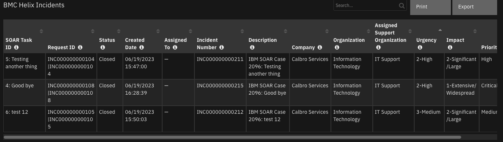

# BMC Helix

## Table of Contents
- [Release Notes](#release-notes)
- [Overview](#overview)
  - [Key Features](#key-features)
- [Requirements](#requirements)
  - [BMC Helix Platform](#bmc-helix-platform)
  - [SOAR platform](#soar-platform)
  - [Cloud Pak for Security](#cloud-pak-for-security)
  - [Proxy Server](#proxy-server)
  - [Python Environment](#python-environment)
- [Installation](#installation)
  - [Install](#install)
  - [App Configuration](#app-configuration)
  - [Custom Layouts](#custom-layouts)
- [Function - Helix: Close Incident](#function---helix-close-incident)
- [Function - Helix: Create Incident](#function---helix-create-incident)
- [Data Table - BMC Helix Incidents](#data-table---bmc-helix-incidents)
- [Custom Fields](#custom-fields)
- [Playbooks](#playbooks)
- [Troubleshooting & Support](#troubleshooting--support)

---

## Release Notes
| Version | Date | Notes |
| ------- | ---- | ----- |
| 1.0.0 | 06/2023 | Initial Release |

---

## Overview

**BMC Helix for IBM SOAR**

 

This integration provides the capability to create new incidents in BMC Helix from SOAR tasks and cases via the HPD:IncidentInterface_Create form over the REST API. Once the task or case is complete, this integration also provides the capability to close existing BMC Helix Incidents.

### Key Features
* Send IBM SOAR Case tasks to BMC Helix as incidents
* Send IBM SOAR Case to BMC Helix as incidents
* Close BMC Helix incidents from linked IBM SOAR case tasks
* Close BMC Helix incidents from linked IBM SOAR case

---

## Requirements
This app supports the IBM Security QRadar SOAR Platform and the IBM Security QRadar SOAR for IBM Cloud Pak for Security.

### BMC Helix Platform
This app requires BMC Helix ITSM 22.x or above with Helix AR System 22.x or above. The REST API must be enabled and exposed on any port. If the REST API is not already enabled on the BMC Helix Platform, consult their documentation on [Configuring the REST API](https://docs.bmc.com/docs/itsm213/enabling-the-simplified-rest-api-1032989970.html).

### SOAR platform
The SOAR platform supports two app deployment mechanisms, Edge Gateway (formerly App Host) and integration server.

If deploying to a SOAR platform with an Edge Gateway, the requirements are:
* SOAR platform >= `45.0.0`.
* The app is in a container-based format (available from the AppExchange as a `zip` file).

If deploying to a SOAR platform with an integration server, the requirements are:
* SOAR platform >= `45.0.0`.
* The app is in the older integration format (available from the AppExchange as a `zip` file which contains a `tar.gz` file).
* Integration server is running `resilient-circuits>=45.0.0`.
* If using an API key account, make sure the account provides the following minimum permissions: 
  | Name | Permissions |
  | ---- | ----------- |
  | Org Data | Read |
  | Function | Read |
  | Incidents |  Read |
  | Incident Notes | Write |
  | Private Tasks | Read |

The following SOAR platform guides provide additional information: 
* _Edge Gateway Deployment Guide_ or _App Host Deployment Guide_: provides installation, configuration, and troubleshooting information, including proxy server settings. 
* _Integration Server Guide_: provides installation, configuration, and troubleshooting information, including proxy server settings.
* _System Administrator Guide_: provides the procedure to install, configure and deploy apps. 

The above guides are available on the IBM Documentation website at [ibm.biz/soar-docs](https://ibm.biz/soar-docs). On this web page, select your SOAR platform version. On the follow-on page, you can find the _Edge Gateway Deployment Guide_, _App Host Deployment Guide_, or _Integration Server Guide_ by expanding **Apps** in the Table of Contents pane. The System Administrator Guide is available by expanding **System Administrator**.

### Cloud Pak for Security
If you are deploying to IBM Cloud Pak for Security, the requirements are:
* IBM Cloud Pak for Security >= `1.8`.
* Cloud Pak is configured with an Edge Gateway.
* The app is in a container-based format (available from the AppExchange as a `zip` file).

The following Cloud Pak guides provide additional information: 
* _Edge Gateway Deployment Guide_ or _App Host Deployment Guide_: provides installation, configuration, and troubleshooting information, including proxy server settings. From the Table of Contents, select Case Management and Orchestration & Automation > **Orchestration and Automation Apps**.
* _System Administrator Guide_: provides information to install, configure, and deploy apps. From the IBM Cloud Pak for Security IBM Documentation table of contents, select Case Management and Orchestration & Automation > **System administrator**.

These guides are available on the IBM Documentation website at [ibm.biz/cp4s-docs](https://ibm.biz/cp4s-docs). From this web page, select your IBM Cloud Pak for Security version. From the version-specific IBM Documentation page, select Case Management and Orchestration & Automation.

### Proxy Server
The app **does** support a proxy server.

### Python Environment
Python 3.6 and Python 3.9 are supported.
Additional package dependencies may exist for each of these packages:
* resilient-circuits>=47.0.0

---

## Installation

### Install
* To install or uninstall an App or Integration on the _SOAR platform_, see the documentation at [ibm.biz/soar-docs](https://ibm.biz/soar-docs).
* To install or uninstall an App on _IBM Cloud Pak for Security_, see the documentation at [ibm.biz/cp4s-docs](https://ibm.biz/cp4s-docs) and follow the instructions above to navigate to Orchestration and Automation.

### App Configuration
The following table provides the settings you need to configure the app. These settings are made in the app.config file. See the documentation discussed in the Requirements section for the procedure.

| Config | Required | Example | Description |
| ------ | :------: | ------- | ----------- |
| **helix_host** | Yes | `<example.domain>` | *Hostname or IP for the BMC Helix instance.* |
| **helix_user** | Yes | `<example_user>` | *Username to use to authenticate with BMC Helix.* |
| **helix_password** | Yes | `xxx` | *Password to use to authenticate with BMC Helix.* |
| **max_datatable_rows** | No | `30` | *Max number of datatable rows to return from the SOAR API when closing an Incident.* |
| **helix_port** | No | `8443` | *Port number over which the BMC Helix REST API is exposed.* |
| **verify** | No | `true|false|/path/to/certificate.crt` | *Set to `true` or `/path/to/cerficate.crt` to make verified requests to BMC Helix, else set to `false`* |
| **https_proxy** | No | `example.domain` | *https proxy for request traffic.* |

### Custom Layouts
* Import the Data Tables and Custom Fields like the screenshot below:

  

---

## Function - Helix: Close Incident
Close an incident ticket in BMC Helix by modifying its status. The function will make an API call to BMC Helix to retrieve the target incident form. If the status of that form is "Resolved," "Closed," or "Cancelled," no change to the incident is made. Otherwise, the status is updated to Resolved with Status Reason "No Further Action Required" and Resolution "Closed from IBM SOAR."

 

<details><summary>Inputs:</summary>
<p>

| Name | Type | Required | Example | Tooltip |
| ---- | :--: | :------: | ------- | ------- |
| `bmc_helix_request_id` | `text` | No | `-` | The request ID for the BMC Helix incident |
| `helix_payload` | `text` | No | `-` | - |
| `incident_id` | `number` | Yes | `-` | - |
| `task_id` | `number` | No | `-` | - |

</p>
</details>

<details><summary>Outputs:</summary>
<p>

> **NOTE:** This example might be in JSON format, but `results` is a Python Dictionary on the SOAR platform.

```python
results = {
  "content": {
    "closed": [],
    "skipped": [
      {
        "_links": {
          "self": [
            {
              "href": "https://bmc.com/api/arsys/v1/entry/HPD:IncidentInterface/INC000000000110%7CINC000000000110"
            }
          ]
        },
        "values": {
          "AccessMode": null,
          "AppInstanceServer": null,
          "AppInterfaceForm": null,
          "AppLogin": null,
          "AppPassword": null,
          "Assigned Group": "Service Desk",
          "Assigned Group ID": "SGP000000000011",
          "Assigned Group Shift ID": null,
          "Assigned Group Shift Name": null,
          "Assigned Support Company": "Calbro Services",
          "Assigned Support Organization": "IT Support",
          "Assignee": "Sally Agent",
          "Assignee Groups": "1000000005;\u0027Ian_Agent\u0027;",
          "Assignee Groups_parent": "",
          "Assignee Login ID": "Sally Agent",
          "AttachmentSourceFormName": null,
          "AttachmentSourceGUID": null,
          "Auto Open Session": null,
          "Broker Vendor Name": null,
          "COG_CognSuppGrpComp": null,
          "COG_CognSuppGrpID": null,
          "COG_CognSuppGrpName": null,
          "COG_CognSuppGrpOrg": null,
          "Categorization Tier 1": null,
          "Categorization Tier 2": null,
          "Categorization Tier 3": null,
          "Chat Session ID": null,
          "City": "Schiphol-Rijk",
          "ClientLocale": null,
          "Closed Date": null,
          "Closure Manufacturer": null,
          "Closure Product Category Tier1": null,
          "Closure Product Category Tier2": null,
          "Closure Product Category Tier3": null,
          "Closure Product Model/Version": null,
          "Closure Product Name": null,
          "Company": "Calbro Services",
          "Component_ID": null,
          "Contact Client Type": "Office-Based Employee",
          "Contact Company": "Calbro Services",
          "Contact Sensitivity": "Standard",
          "Corporate ID": null,
          "Country": "Netherlands",
          "Created_By": null,
          "Customer Login ID": "Ian_Agent",
          "DWP_SRID": null,
          "DWP_SRInstanceID": null,
          "Department": "Customer Service",
          "Description": "IBM SOAR Case 2099: Hello World",
          "Desk Location": null,
          "Detailed Decription": null,
          "Direct Contact Area Code": null,
          "Direct Contact City": null,
          "Direct Contact Company": null,
          "Direct Contact Corporate ID": null,
          "Direct Contact Country": null,
          "Direct Contact Country Code": null,
          "Direct Contact Department": null,
          "Direct Contact Desk Location": null,
          "Direct Contact Extension": null,
          "Direct Contact First Name": null,
          "Direct Contact Internet E-mail": null,
          "Direct Contact Last Name": null,
          "Direct Contact Local Number": null,
          "Direct Contact Location Details": null,
          "Direct Contact Login ID": null,
          "Direct Contact Mail Station": null,
          "Direct Contact Middle Initial": null,
          "Direct Contact Organization": null,
          "Direct Contact Person ID": null,
          "Direct Contact Phone Number": null,
          "Direct Contact Region": null,
          "Direct Contact Site": null,
          "Direct Contact Site Group": null,
          "Direct Contact Site ID": null,
          "Direct Contact State/Province": null,
          "Direct Contact Street": null,
          "Direct Contact Time Zone": null,
          "Direct Contact Zip/Postal Code": null,
          "Entry ID": "INC000000000110",
          "Estimated Resolution Date": null,
          "First Name": "Ian",
          "FirstWIPDate": null,
          "HPD_CI": null,
          "HPD_CI_FormName": null,
          "HPD_CI_ReconID": null,
          "Impact": "3-Moderate/Limited",
          "Impact_OR_Root": null,
          "Incident Number": "INC000000000225",
          "InfrastructureEventType": "None",
          "InstanceId": "AGGADOP1EB0FUARWNNYGRWNNYGE04Q",
          "Internet E-mail": null,
          "KMSGUID": null,
          "Last Acknowledged Date": null,
          "Last Modified By": "Ian_Agent",
          "Last Modified Date": "2023-06-22T14:30:49.000+0000",
          "Last Name": "Agent",
          "Last Resolved Date": "2023-06-22T14:30:48.000+0000",
          "Last _Assigned_Date": null,
          "LastWIPDate": null,
          "Mail Station": null,
          "Manufacturer": null,
          "MaxRetries": null,
          "Middle Initial": null,
          "Modified Chat Session ID": null,
          "Needs Attention": null,
          "NeedsAttentionCCS_Setting": "false",
          "Number of Attachments": null,
          "Organization": "Information Technology",
          "Owner Group": "Service Desk",
          "Owner Group ID": "SGP000000000011",
          "Owner Support Company": "Calbro Services",
          "Owner Support Organization": "IT Support",
          "Person ID": "PPL000000000118",
          "Phone Number": "###",
          "PortNumber": null,
          "Previous_HPD_CI_ReconID": null,
          "Previous_ServiceCI_ReconID": null,
          "Priority": "High",
          "Priority Weight": 18,
          "Product Categorization Tier 1": null,
          "Product Categorization Tier 2": null,
          "Product Categorization Tier 3": null,
          "Product Model/Version": null,
          "Product Name": null,
          "Protocol": null,
          "Record ID": "AGGADOP1EB0FUARWNNYGRWNNYGE04Q|AGGADOP1EB0FUARWNNYGRWNNYGE04Q",
          "Region": "Europe",
          "Reported Date": "2023-06-22T12:56:30.000+0000",
          "Reported Source": "Systems Management",
          "Request ID": "INC000000000110|INC000000000110",
          "RequestCreatedFromDWP": "No",
          "Required Resolution DateTime": null,
          "Resolution": "Closed from IBM SOAR",
          "Resolution Category": null,
          "Resolution Category Tier 2": null,
          "Resolution Category Tier 3": null,
          "Resolution Method": null,
          "Responded Date": "2023-06-22T12:56:30.000+0000",
          "SRAttachment": null,
          "SRID": null,
          "SRInstanceID": "NA",
          "SRMS Registry Instance ID": "SR0011439CCAD4ec8UQwCkOLAQlQAA",
          "SRMSAOIGuid": null,
          "Service Type": "Infrastructure Event",
          "ServiceCI": null,
          "ServiceCI_ReconID": null,
          "Site": "Amsterdam Support Center",
          "Site Group": "Amsterdam",
          "Site ID": "STE_SOLN0002844",
          "State Province": "Amsterdam",
          "Status": "Resolved",
          "Status_Reason": "No Further Action Required",
          "Street": "B Avenue 123",
          "Submit Date": "2023-06-22T12:56:30.000+0000",
          "Submitter": "Ian_Agent",
          "TemplateID": null,
          "TimeOfEvent": "2023-06-22T12:56:30.000+0000",
          "Total Transfers": 1,
          "Urgency": "2-High",
          "VIP": "No",
          "Vendor Assignee Groups": null,
          "Vendor Assignee Groups_parent": null,
          "Vendor Group": null,
          "Vendor Group ID": null,
          "Vendor Name": null,
          "Vendor Organization": null,
          "Vendor Ticket Number": null,
          "Zip/Postal Code": "1234",
          "bOrphanedRoot": null,
          "cell_name": null,
          "mc_ueid": null,
          "policy_name": null,
          "policy_type": null,
          "root_component_id_list": null,
          "root_incident_id_list": null,
          "status_incident": null,
          "status_reason2": null,
          "use_case": null,
          "z1D Action": null,
          "z1D Char01": null,
          "z1D Char02": null,
          "z1D Char03": null,
          "z1D Char04": null,
          "z1D Char27": null,
          "z1D Integer01": null,
          "z1D Integer02": null,
          "z1D Modify All Flag-V": null,
          "z1D Permission Group ID": null,
          "z1D Permission Group List": null,
          "z1D_ActivityDate_tab": null,
          "z1D_Activity_Type": null,
          "z1D_AssociationDescription": null,
          "z1D_CI_FormName": null,
          "z1D_COG_AutoSuppGrpPredRule": null,
          "z1D_COG_SuppGrpWorkInfoTag": null,
          "z1D_Char02": null,
          "z1D_Command": null,
          "z1D_CommunicationSource": null,
          "z1D_ConfirmGroup": null,
          "z1D_CreatedFromBackEndSynchWI": null,
          "z1D_Details": null,
          "z1D_FormName": null,
          "z1D_InterfaceAction": null,
          "z1D_SR_Instanceid": null,
          "z1D_Secure_Log": null,
          "z1D_Summary": null,
          "z1D_View_Access": null,
          "z1D_WorkInfoSubmitter": null,
          "z1D_WorklogDetails": null,
          "z2AF_Act_Attachment_1": null,
          "zTmpEventGUID": null
        }
      }
    ]
  },
  "inputs": {
    "bmc_helix_request_id": "INC000000000110|INC000000000110",
    "helix_payload": "{\"Status_Reason\": \"Done\"}",
    "incident_id": 2099
  },
  "metrics": {
    "execution_time_ms": 442,
    "host": "local",
    "package": "fn-bmc-helix",
    "package_version": "1.0.0",
    "timestamp": "2023-06-22 10:31:44",
    "version": "1.0"
  },
  "raw": null,
  "reason": null,
  "success": true,
  "version": 2.0
}
```

</p>
</details>

<details><summary>Example Pre-Process Script:</summary>
<p>

```python
inputs.incident_id = incident.id
inputs.bmc_helix_request_id = incident.properties.bmc_helix_request_id

# Use this section to add key, value pairs to send to Helix
# These values will be added/updated on the target Helix incident,
# so they must conform with the "HPD:IncidentInterface_Create" schema
payload = {"Status_Reason": "Done"}

inputs.helix_payload = str(payload)
```

</p>
</details>

<details><summary>Example Post-Process Script:</summary>
<p>

```python
results = playbook.functions.results.closed_incident
content = results.get("content", {})
closed = content.get("closed")
skipped = content.get("skipped")
noteText = "<h5>Helix Close Incident:</h5>"

if results.get("success"):
  if closed:
    noteText += "<p>The following incidents were matched in Helix and successfully closed:</p>"
    for item in closed:
      noteText += "<p>    Incident Number {}, Request ID: {}</p>".format(item.get("values", {}).get("Incident Number"), item.get("values", {}).get("Request ID"))
  if skipped:
    noteText += "<p>The following incidents were not able to be closed. Common reasons include that the incident has been previously closed, " \
    "the incident has been deleted, or the payload sent to Helix was incomplete according to the requirements of your specific system:</p>"
    for item in skipped:
      noteText += "<p>    Incident Number {}, Request ID: {}</p>".format(item.get("values", {}).get("Incident Number"), item.get("values", {}).get("Request ID"))
  incident.properties.bmc_helix_status = "Closed"
elif not closed and not skipped:
  # no sync to helix, just exit
  noteText = None
else:
  noteText += "<p>Function failed to complete. Reason: {}</p>".format(results.get("reason"))

if noteText:
  richText = helper.createRichText(noteText)
  incident.addNote(richText)
```

</p>
</details>

---
## Function - Helix: Create Incident
Create a new incident in BMC Helix.

 

### Activity Fields

 

BMC Helix is a highly customizable product, and this integration was designed with those customizations in mind.

Note that when creating an incident in BMC Helix via the REST API, any auto-routing that is configured in the BMC Helix platform will continue to apply as it would when creating
a new incident in the user interface. This can result in a discrepancy between the data that was submitted by the integration and the data that is present in BMC Helix once the incident object is actually created.
For example, the payload sent to BMC Helix by the integration could indicate a Status of New for an incident (either directly or via a [template](#templating).) However, when that ticket is actually created, the auto-routing in BMC Helix could be configured to assign it to a user and update the Status to Assigned. This is expected, and the true status of the created incident will be reflected in the [datatable](#data-table---bmc-helix-incidents) if the BMC Helix incident is linked to a SOAR task or in the incident field bmc_helix_status if the BMC Helix incident is linked to a SOAR case.

**Templating**

To facilitate the use of templates, none of the activity fields are required. If your BMC Helix server has a template defined that provides all required fields to create an incident, you may simply provided the template name and use this function. Note that it is necessary to manually enter the template name(s) so that they are available in the dropdown. We have provided a stock, out-of-the-box template name as an example. Other template names can be added as necessary by modifying this activity field within the Customization Settings of the platform.

**Other Common Fields**

For convenience, several activity fields have been created to handle input for commonly used fields in BMC Helix such as Status, Impact, and Urgency. These activity fields are not required, as templates can also provide those values. Note that if a template and activity field provide the same value, the activity field will take precedence over the template.
Please note that the user has the ability to customize what values appear in the dropdown menu for each activity field. This action will likely be necessary if not taking advantage of the BMC Helix's templating functionality via this integration. Activity fields can be modified within the Customization Settings of the platform.

**Additional Data**

Finally, the Additional Data activity field allows the mapping of any other values to the BMC Helix form not covered in the above activity fields, including custom defined fields. The fields must be provided as a Python-like dictionary. For example:

```python
{"Short Description": "example incident text", "my_custom_field": 1}
```

The keys provided in this dictionary string must match the API names of fields in the `HPD:IncidentInterface` form. To retrieve the schema for this form on the BMC Helix server, send an HTTPS OPTIONS request to `https://serverName/api/arsys/v1/entry/HPD:IncidentInterface_Create`. This is the endpoint used to create BMC Helix incidents over the API, and thus the response will indicate which fields are available to map and any value restrictions.

<details><summary>Inputs:</summary>
<p>

| Name | Type | Required | Example | Tooltip |
| ---- | :--: | :------: | ------- | ------- |
| `helix_incident_name` | `text` | No | `-` | - |
| `helix_payload` | `text` | Yes | `-` | - |
| `incident_id` | `number` | Yes | `-` | - |
| `task_id` | `number` | No | `-` | - |

</p>
</details>

<details><summary>Outputs:</summary>
<p>

> **NOTE:** This example might be in JSON format, but `results` is a Python Dictionary on the SOAR platform.

```python
results = {
  "content": {
    "values": {
      "AccessMode": null,
      "AppInstanceServer": null,
      "AppInterfaceForm": null,
      "AppLogin": null,
      "AppPassword": null,
      "Assigned Group": "Service Desk",
      "Assigned Group ID": "SGP000000000011",
      "Assigned Group Shift ID": null,
      "Assigned Group Shift Name": null,
      "Assigned Support Company": "Calbro Services",
      "Assigned Support Organization": "IT Support",
      "Assignee": null,
      "Assignee Groups": "1000000005;\u0027Ian_Agent\u0027;",
      "Assignee Groups_parent": "",
      "Assignee Login ID": null,
      "AttachmentSourceFormName": null,
      "AttachmentSourceGUID": null,
      "Auto Open Session": null,
      "Broker Vendor Name": null,
      "COG_CognSuppGrpComp": null,
      "COG_CognSuppGrpID": null,
      "COG_CognSuppGrpName": null,
      "COG_CognSuppGrpOrg": null,
      "Categorization Tier 1": null,
      "Categorization Tier 2": null,
      "Categorization Tier 3": null,
      "Chat Session ID": null,
      "City": "Schiphol-Rijk",
      "ClientLocale": null,
      "Closed Date": null,
      "Closure Manufacturer": null,
      "Closure Product Category Tier1": null,
      "Closure Product Category Tier2": null,
      "Closure Product Category Tier3": null,
      "Closure Product Model/Version": null,
      "Closure Product Name": null,
      "Company": "Calbro Services",
      "Component_ID": null,
      "Contact Client Type": "Office-Based Employee",
      "Contact Company": "Calbro Services",
      "Contact Sensitivity": "Standard",
      "Corporate ID": null,
      "Country": "Netherlands",
      "Created_By": null,
      "Customer Login ID": "Ian_Agent",
      "DWP_SRID": null,
      "DWP_SRInstanceID": null,
      "Department": "Customer Service",
      "Description": "IBM SOAR Case 2098: test 23 task",
      "Desk Location": null,
      "Detailed Decription": "testing task creation",
      "Direct Contact Area Code": null,
      "Direct Contact City": null,
      "Direct Contact Company": null,
      "Direct Contact Corporate ID": null,
      "Direct Contact Country": null,
      "Direct Contact Country Code": null,
      "Direct Contact Department": null,
      "Direct Contact Desk Location": null,
      "Direct Contact Extension": null,
      "Direct Contact First Name": null,
      "Direct Contact Internet E-mail": null,
      "Direct Contact Last Name": null,
      "Direct Contact Local Number": null,
      "Direct Contact Location Details": null,
      "Direct Contact Login ID": null,
      "Direct Contact Mail Station": null,
      "Direct Contact Middle Initial": null,
      "Direct Contact Organization": null,
      "Direct Contact Person ID": null,
      "Direct Contact Phone Number": null,
      "Direct Contact Region": null,
      "Direct Contact Site": null,
      "Direct Contact Site Group": null,
      "Direct Contact Site ID": null,
      "Direct Contact State/Province": null,
      "Direct Contact Street": null,
      "Direct Contact Time Zone": null,
      "Direct Contact Zip/Postal Code": null,
      "Entry ID": "INC000000000116",
      "Estimated Resolution Date": null,
      "First Name": "Ian",
      "FirstWIPDate": null,
      "HPD_CI": null,
      "HPD_CI_FormName": null,
      "HPD_CI_ReconID": null,
      "Impact": "2-Significant/Large",
      "Impact_OR_Root": null,
      "Incident Number": "INC000000000232",
      "InfrastructureEventType": "None",
      "InstanceId": "AGGADOP1EB0FUARWNPOIRWNPOIEOE6",
      "Internet E-mail": null,
      "KMSGUID": null,
      "Last Acknowledged Date": null,
      "Last Modified By": "Ian_Agent",
      "Last Modified Date": "2023-06-22T13:33:44.000+0000",
      "Last Name": "Agent",
      "Last Resolved Date": null,
      "Last _Assigned_Date": null,
      "LastWIPDate": null,
      "Mail Station": null,
      "Manufacturer": null,
      "MaxRetries": null,
      "Middle Initial": null,
      "Modified Chat Session ID": null,
      "Needs Attention": null,
      "NeedsAttentionCCS_Setting": "false",
      "Number of Attachments": null,
      "Organization": "Information Technology",
      "Owner Group": "Service Desk",
      "Owner Group ID": "SGP000000000011",
      "Owner Support Company": "Calbro Services",
      "Owner Support Organization": "IT Support",
      "Person ID": "PPL000000000118",
      "Phone Number": "###",
      "PortNumber": null,
      "Previous_HPD_CI_ReconID": null,
      "Previous_ServiceCI_ReconID": null,
      "Priority": "High",
      "Priority Weight": 20,
      "Product Categorization Tier 1": null,
      "Product Categorization Tier 2": null,
      "Product Categorization Tier 3": null,
      "Product Model/Version": null,
      "Product Name": null,
      "Protocol": null,
      "Record ID": "AGGADOP1EB0FUARWNPOIRWNPOIEOE6|AGGADOP1EB0FUARWNPOIRWNPOIEOE6",
      "Region": "Europe",
      "Reported Date": "2023-06-22T13:33:44.000+0000",
      "Reported Source": "External Escalation",
      "Request ID": "INC000000000116|INC000000000116",
      "RequestCreatedFromDWP": "No",
      "Required Resolution DateTime": null,
      "Resolution": null,
      "Resolution Category": null,
      "Resolution Category Tier 2": null,
      "Resolution Category Tier 3": null,
      "Resolution Method": null,
      "Responded Date": "2023-06-22T13:33:44.000+0000",
      "SRAttachment": null,
      "SRID": null,
      "SRInstanceID": "NA",
      "SRMS Registry Instance ID": "SR0011439CCAD4ec8UQwCkOLAQlQAA",
      "SRMSAOIGuid": null,
      "Service Type": "Infrastructure Event",
      "ServiceCI": null,
      "ServiceCI_ReconID": null,
      "Site": "Amsterdam Support Center",
      "Site Group": "Amsterdam",
      "Site ID": "STE_SOLN0002844",
      "State Province": "Amsterdam",
      "Status": "Assigned",
      "Status_Reason": null,
      "Street": "b Avenue 123",
      "Submit Date": "2023-06-22T13:33:44.000+0000",
      "Submitter": "Ian_Agent",
      "TemplateID": null,
      "TimeOfEvent": "2023-06-22T13:33:44.000+0000",
      "Total Transfers": 0,
      "Urgency": "2-High",
      "VIP": "No",
      "Vendor Assignee Groups": null,
      "Vendor Assignee Groups_parent": null,
      "Vendor Group": null,
      "Vendor Group ID": null,
      "Vendor Name": null,
      "Vendor Organization": null,
      "Vendor Ticket Number": null,
      "Zip/Postal Code": "1234",
      "bOrphanedRoot": null,
      "cell_name": null,
      "mc_ueid": null,
      "policy_name": null,
      "policy_type": null,
      "root_component_id_list": null,
      "root_incident_id_list": null,
      "status_incident": null,
      "status_reason2": null,
      "use_case": null,
      "z1D Action": null,
      "z1D Char01": null,
      "z1D Char02": null,
      "z1D Char03": null,
      "z1D Char04": null,
      "z1D Char27": null,
      "z1D Integer01": null,
      "z1D Integer02": null,
      "z1D Modify All Flag-V": null,
      "z1D Permission Group ID": null,
      "z1D Permission Group List": null,
      "z1D_ActivityDate_tab": null,
      "z1D_Activity_Type": null,
      "z1D_AssociationDescription": null,
      "z1D_CI_FormName": null,
      "z1D_COG_AutoSuppGrpPredRule": null,
      "z1D_COG_SuppGrpWorkInfoTag": null,
      "z1D_Char02": null,
      "z1D_Command": null,
      "z1D_CommunicationSource": null,
      "z1D_ConfirmGroup": null,
      "z1D_CreatedFromBackEndSynchWI": null,
      "z1D_Details": null,
      "z1D_FormName": null,
      "z1D_InterfaceAction": null,
      "z1D_SR_Instanceid": null,
      "z1D_Secure_Log": null,
      "z1D_Summary": null,
      "z1D_View_Access": null,
      "z1D_WorkInfoSubmitter": null,
      "z1D_WorklogDetails": null,
      "z2AF_Act_Attachment_1": null,
      "zTmpEventGUID": null
    }
  },
  "inputs": {
    "helix_incident_name": "test 23 task",
    "helix_payload": "{ \"ApplyTemplate\": null,\n  \"First_Name\": \"Ian\",\n  \"Last_Name\": \"Agent\",\n  \"Impact\": \"2-Significant/Large\",\n  \"Urgency\": \"2-High\",\n  \"Service_Type\": \"Infrastructure Event\",\n  \"Status\": \"New\",\n  \"Reported Source\": \"External Escalation\",\n  \"Description\": null,\n  \"Assigned Support Organization\": \"Service Desk\",\n  \"additional_data\": null\n}",
    "incident_id": 2098,
    "task_id": 17
  },
  "metrics": {
    "execution_time_ms": 1450,
    "host": "local",
    "package": "fn-bmc-helix",
    "package_version": "1.0.0",
    "timestamp": "2023-06-22 09:33:44",
    "version": "1.0"
  },
  "raw": null,
  "reason": null,
  "success": true,
  "version": 2.0
}
```

</p>
</details>

<details><summary>Example Pre-Process Script:</summary>
<p>

```python
payload = {
  "First_Name": playbook.inputs.bmc_helix_customer_first_name,
  "Last_Name": playbook.inputs.bmc_helix_customer_last_name,
  "Impact": playbook.inputs.bmc_helix_impact,
  "Urgency": playbook.inputs.bmc_helix_urgency,
  "Service_Type": playbook.inputs.bmc_helix_incident_type,
  "Status": playbook.inputs.bmc_helix_status,
  "Reported Source": playbook.inputs.bmc_helix_reported_source,
  "Assigned Support Organization": playbook.inputs.bmc_helix_support_group
}
if getattr(playbook.inputs, "bmc_helix_additional_data").content:
  payload["additional_data"] = playbook.inputs.bmc_helix_additional_data.content
if getattr(playbook.inputs, "bmc_helix_note"):
  payload["Description"] = playbook.inputs.bmc_helix_note
if getattr(playbook.inputs, "bmc_helix_template"):
  payload["ApplyTemplate"] = playbook.inputs.bmc_helix_template

# set inputs
inputs.incident_id = incident.id
inputs.helix_incident_name = incident.name
inputs.helix_payload = str(payload)
```

</p>
</details>

<details><summary>Example Post-Process Script:</summary>
<p>

```python
from datetime import datetime
results = playbook.functions.results.created_incident

if results.get("success"):
  values = results.get("content", {}).get("values", {})

  incident.properties.bmc_helix_request_id = values.get("Request ID")
  incident.properties.bmc_helix_status = values.get("Status")
  incident.properties.bmc_helix_created_date = int(datetime.now().timestamp()*1000)
  incident.properties.bmc_helix_assigned_to = values.get("Assignee")
  incident.properties.bmc_helix_incident_number = values.get("Incident Number")
  incident.properties.bmc_helix_description = values.get("Description")
  incident.properties.bmc_helix_company = values.get("Company")
  incident.properties.bmc_helix_organization = values.get("Organization")
  incident.properties.bmc_helix_assigned_support_organization = values.get("Assigned Support Organization")
  incident.properties.bmc_helix_urgency = values.get("Urgency")
  incident.properties.bmc_helix_impact = values.get("Impact")
  incident.properties.bmc_helix_priority = values.get("Priority")
```

</p>
</details>

---

## Data Table - BMC Helix Incidents

 

#### API Name:
bmc_helix_incidents

#### Columns:
| Column Name | API Access Name | Type | Tooltip |
| ----------- | --------------- | ---- | ------- |
| Assigned Support Organization | `helix_assigned_support_organization` | `text` | BMC Helix assigned support organization |
| Assigned To | `helix_assigned_to` | `text` | BMC Helix user assigned to the incident |
| Company | `helix_company` | `text` | BMC Helix Company assigned to the incident |
| Created Date | `helix_created_date` | `datetimepicker` | Date BMC Heiix incident was created. |
| Description | `helix_description` | `text` | Description of the incident |
| Impact | `helix_impact` | `text` | BMC Helix impact status assigned to the incident |
| Incident Number | `helix_incident_number` | `text` | BMC Helix incident number |
| Organization | `helix_organization` | `text` | BMC Helix organization assigned to the incident |
| Priority | `helix_priority` | `text` | BMC Helix priority status assigned to the incident |
| Request ID | `helix_request_id` | `text` | Request ID of the BMC Helix form entry |
| SOAR Task ID | `soar_task_id` | `text` | ID of the Task and its description |
| Status | `helix_status` | `text` | Last status applied to the BMC Helix Incident |
| Urgency | `helix_urgency` | `text` | BMC Helix urgency status assigned to the incident |

---

## Custom Fields
| Label | API Access Name | Type | Prefix | Placeholder | Tooltip |
| ----- | --------------- | ---- | ------ | ----------- | ------- |
| BMC Helix Assigned Support Organization | `bmc_helix_assigned_support_organization` | `text` | `properties` | - | The support organization assigned to the BMC Helix incident |
| BMC Helix Assigned to | `bmc_helix_assigned_to` | `text` | `properties` | - | Name of the user assigned to the BMC Helix incident |
| BMC Helix Company | `bmc_helix_company` | `text` | `properties` | - | Company assigned to the BMC Helix incident |
| BMC Helix Created Date | `bmc_helix_created_date` | `datetimepicker` | `properties` | - | Date and time the BMC Helix incident was created |
| BMC Helix Description | `bmc_helix_description` | `text` | `properties` | - | Description of the BMC Helix incident |
| BMC Helix Impact | `bmc_helix_impact` | `select` | `properties` | - | Impact of the BMC Helix incident |
| BMC Helix Incident Number | `bmc_helix_incident_number` | `text` | `properties` | - | BMC Helix Incident Number |
| BMC Helix Organization | `bmc_helix_organization` | `text` | `properties` | - | Organization assigned to the BMC Helix incident |
| BMC Helix Priority | `bmc_helix_priority` | `select` | `properties` | - | Priority of the BMC Helix incident |
| BMC Helix Request ID | `bmc_helix_request_id` | `text` | `properties` | - | Request ID of the BMC Helix Incident |
| BMC Helix Status | `bmc_helix_status` | `select` | `properties` | - | Status of the BMC Helix incident |
| BMC Helix Urgency | `bmc_helix_urgency` | `select` | `properties` | - | Urgency of the BMC Helix incident |

---

## Playbooks
| Playbook Name | Description | Object | Status |
| ------------- | ----------- | ------ | ------ |
| BMC Helix Close Incident | Close a BMC Helix that is linked to a SOAR case. | incident | `enabled` |
| BMC Helix Close Incident from Task | Close a BMC Helix incident that is linked to a SOAR task | task | `enabled` |
| BMC Helix Create Incident | Create a BMC Helix incident from a SOAR case. | incident | `enabled` |
| BMC Helix Create Incident from Task | Create a new Incident in BMC Helix from a SOAR case Task | task | `enabled` |

---

## Troubleshooting & Support
Refer to the documentation listed in the Requirements section for troubleshooting information.

### For Support
This is an IBM supported app. Please search [ibm.com/mysupport](https://ibm.com/mysupport) for assistance.
