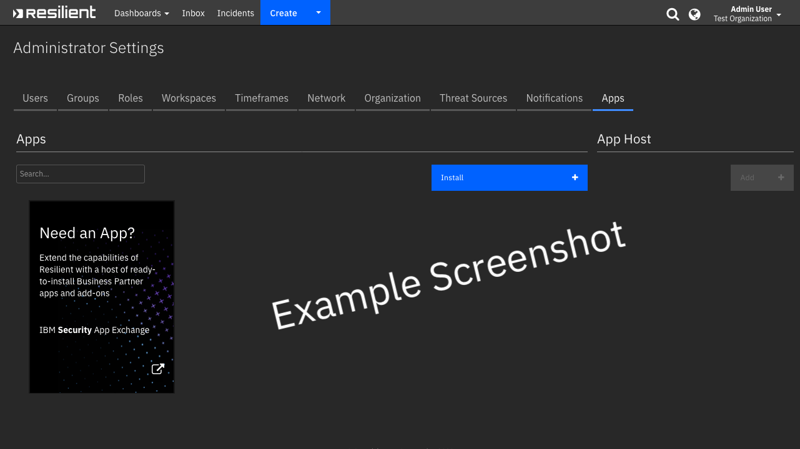
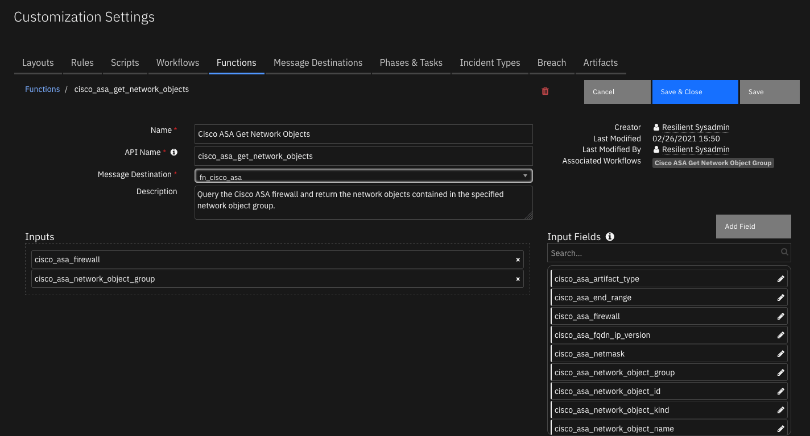
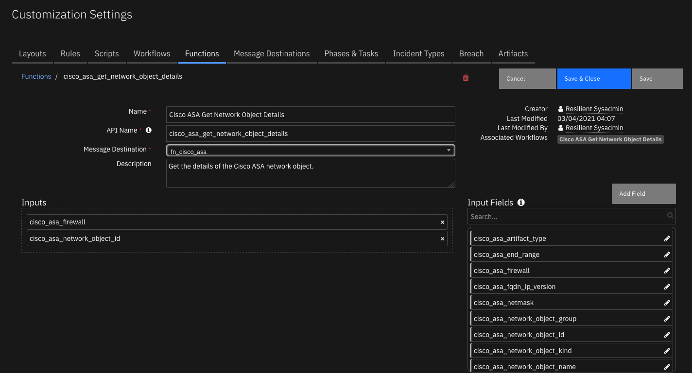
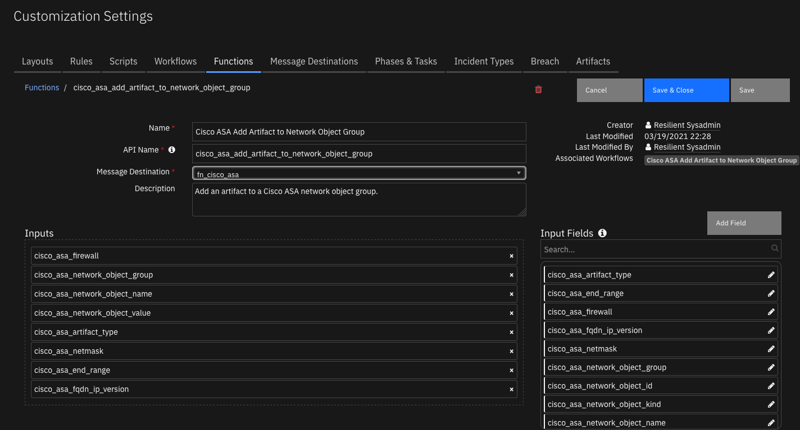

<!--
  This README.md is generated by running:
  "resilient-sdk docgen -p fn_cisco_asa"

  It is best edited using a Text Editor with a Markdown Previewer. VS Code
  is a good example. Checkout https://guides.github.com/features/mastering-markdown/
  for tips on writing with Markdown

  If you make manual edits and run docgen again, a .bak file will be created

  Store any screenshots in the "doc/screenshots" directory and reference them like:
  

  NOTE: If your app is available in the container-format only, there is no need to mention the integration server in this readme.
-->

# IBM Security SOAR Functions for Cisco ASA

## Table of Contents
- [Release Notes](#release-notes)
- [Overview](#overview)
  - [Key Features](#key-features)
- [Requirements](#requirements)
  - [Resilient platform](#resilient-platform)
  - [Cloud Pak for Security](#cloud-pak-for-security)
  - [Proxy Server](#proxy-server)
- [Installation](#installation)
  - [Install](#install)
  - [App Configuration](#app-configuration)
  - [Custom Layouts](#custom-layouts)
- [Function - Cisco ASA Get Network Objects](#function---cisco-asa-get-network-objects)
- [Function - Cisco ASA Remove Network Object from Network Object Group](#function---cisco-asa-remove-network-object-from-network-object-group)
- [Function - Cisco ASA Get Network Object Details](#function---cisco-asa-get-network-object-details)
- [Function - Cisco ASA Add Artifact to Network Object Group](#function---cisco-asa-add-artifact-to-network-object-group)
- [Script - Convert JSON to rich text v1.1](#script---convert-json-to-rich-text-v11)
- [Data Table - Cisco ASA Network Objects](#data-table---cisco-asa-network-objects)
- [Rules](#rules)
- [Troubleshooting & Support](#troubleshooting--support)
---

## Release Notes
<!--
  Specify all changes in this release. Do not remove the release 
  notes of a previous release
-->
| Version | Date | Notes |
| ------- | ---- | ----- |
| 1.0.0 | 04/2021 | Initial Release |

---

## Overview
<!--
  Provide a high-level description of the function itself and its remote software or application.
  The text below is parsed from the "description" and "long_description" attributes in the setup.py file
-->
**IBM Security SOAR Components for 'fn_cisco_asa'**

<p>
The Cisco ASA Family of security devices protects corporate networks and data centers of all sizes. It provides users with highly secure access to data and network resources - anytime, anywhere, using any device. Cisco ASA devices represent more than 15 years of proven firewall and network security engineering and leadership, with more than 1 million security appliances deployed throughout the world.
<p>
Cisco Adaptive Security Appliance (ASA) Software is the core operating system for the Cisco ASA Family. It delivers enterprise-class firewall capabilities for ASA devices in an array of form factors - standalone appliances, blades, and virtual appliances - for any distributed network environment. ASA Software also integrates with other critical security technologies to deliver comprehensive solutions that meet continuously evolving security needs.
<p>
Cisco ASA firewalls are historically managed through the command line, however they do provide a robust REST API for integrating with 3rd party products.  The IBM Security SOAR Cisco ASA app uses the Cisco ASA REST API to allow SOC analyst to controll internet access of machines from the IBM Security SOAR Platform.
<p>
 <!--
 
-->

### Key Features
<!--
  List the Key Features of the Integration
-->
<p>
<b>Use Case:</b> A SOC analyst using the IBM Security SOAR Platform and Cisco ASA firewall(s) would like the ability to block and unblock machines on the network quickly during a security event. 

<p> This app provides the capability to move Cisco ASA network objects in and out of a Cisco ASA network object group. The Cisco ASA device should be pre-configured with Cisco ASA network object groups that are named BLOCKLIST_IN and BLOCKLIST_OUT or similar. The app uses the Cisco ASA REST API to add and remove the network objects from these network object groups.

<p>
Key capabilities include the following:

* Allows a SOC analyst to pre-configure available firewalls with credentials in the app.config file. Each firewall contains a list of Cisco ASA named network object groups for blocking inbound traffic and outbound traffic, also specified in the app.config.
* Provides the ability to display all IP addresses currently in a network object group blocklist in a data table.
* Provides the ability to add IP address to the blocklist (network object group).
* Provides the ability to remove an IP addresses from blocklist (network object group).
* The following IP network objects are can be added/removed from a network object group:
  * IPv4Address
  * IPv4Range
  * IPv4Network
  * IPv4FQDN
  * IPv6Address
  * IPv6Range
  * IPv6Network
  * IPv6FQDN

---

## Requirements
<!--
  List any Requirements 
-->
This app supports the IBM Resilient SOAR Platform and the IBM Cloud Pak for Security.

### Resilient platform
The Resilient platform supports two app deployment mechanisms, App Host and integration server.

If deploying to a Resilient platform with an App Host, the requirements are:
* Resilient platform >= `37.0.5832`.
* The app is in a container-based format (available from the AppExchange as a `zip` file).

If deploying to a Resilient platform with an integration server, the requirements are:
* Resilient platform >= `37.0.5832`.
* The app is in the older integration format (available from the AppExchange as a `zip` file which contains a `tar.gz` file).
* Integration server is running `resilient-circuits>=31.0.0`.
* If using an API key account, make sure the account provides the following minimum permissions: 
  | Name | Permissions |
  | ---- | ----------- |
  | Org Data | Read |
  | Function | Read |
  | Incidents | Read |
  | Edit Incidents | Fields |

The following Resilient platform guides provide additional information: 
* _App Host Deployment Guide_: provides installation, configuration, and troubleshooting information, including proxy server settings. 
* _Integration Server Guide_: provides installation, configuration, and troubleshooting information, including proxy server settings.
* _System Administrator Guide_: provides the procedure to install, configure and deploy apps. 

The above guides are available on the IBM Knowledge Center at [ibm.biz/resilient-docs](https://ibm.biz/resilient-docs). On this web page, select your Resilient platform version. On the follow-on page, you can find the _App Host Deployment Guide_ or _Integration Server Guide_ by expanding **Resilient Apps** in the Table of Contents pane. The System Administrator Guide is available by expanding **System Administrator**.

### Cloud Pak for Security
If you are deploying to IBM Cloud Pak for Security, the requirements are:
* IBM Cloud Pak for Security >= 1.4.
* Cloud Pak is configured with an App Host.
* The app is in a container-based format (available from the AppExchange as a `zip` file).

The following Cloud Pak guides provide additional information: 
* _App Host Deployment Guide_: provides installation, configuration, and troubleshooting information, including proxy server settings. From the Table of Contents, select Case Management and Orchestration & Automation > **Orchestration and Automation Apps**.
* _System Administrator Guide_: provides information to install, configure, and deploy apps. From the IBM Cloud Pak for Security Knowledge Center table of contents, select Case Management and Orchestration & Automation > **System administrator**.

These guides are available on the IBM Knowledge Center at [ibm.biz/cp4s-docs](https://ibm.biz/cp4s-docs). From this web page, select your IBM Cloud Pak for Security version. From the version-specific Knowledge Center page, select Case Management and Orchestration & Automation.

### Proxy Server
The app does support a proxy server.

---

## Installation

### Install
* To install or uninstall an App or Integration on the _Resilient platform_, see the documentation at [ibm.biz/resilient-docs](https://ibm.biz/resilient-docs).
* To install or uninstall an App on _IBM Cloud Pak for Security_, see the documentation at [ibm.biz/cp4s-docs](https://ibm.biz/cp4s-docs) and follow the instructions above to navigate to Orchestration and Automation.

### App Configuration
The following table provides the settings you need to configure the app. These settings are made in the app.config file. See the documentation discussed in the Requirements section for the procedure.

<p>The app.config file for this app contains a high level section denoted by <code>[fn_cisco_asa]</code> and subsections for each firewall denoted as <code>[fn_cisco_asa:firewall_name]</code>, where each firewall_name is unique.

<p>The table below provides the optional high level default settings. The credentials defined in this section are the default credentials used if the credentials are not defined in the individual firewall subsection.

| Config | Required | Example | Description |
| ------ | :------: | ------- | ----------- |
| **username** | No | `<asa_username>` | *Username of the Cisco ASA firewall* |
| **password** | No | `<asa_password>` | *Password of the Cisco ASA firewall.* |
| **https_proxy** | No | `https://your.proxy.com` | - |
| **http_proxy** | No | `http://your.proxy.com` | - |
---
<p>
The table below provides the settings for each Cisco ASA firewall denoted by <code>[fn_cisco_asa:firewall_name]</code> in the app.config file:

| Config | Required | Example | Description |
| ------ | :------: | ------- | ----------- |
| **host** | Yes | `<asa_ip>` | *IP Address of the Cisco ASA firewall.* |
| **username** | No | `<asa_username>` | *Username of the Cisco ASA firewall* |
| **password** | No | `<asa_password>` | *Password of the Cisco ASA firewall.* |
| **network_object_groups** | Yes | `BLOCKLIST_IN, BLOCKLIST_OUT` | *Comma separated list of the Cisco ASA network object groups.* |
| **cafile** | No | - | *Path to certificate file.* |
---

### Custom Layouts
<!--
  Use this section to provide guidance on where the user should add any custom fields and data tables.
  You may wish to recommend a new incident tab.
  You should save a screenshot "custom_layouts.png" in the doc/screenshots directory and reference it here
-->
<p>
Import the Cisco ASA Network Objects Data Tables and drag it onto a Cisco ASA Incident tab as shown in the screenshot below:

  
---

### Cisco ASA Configuration

#### Install and Configure ASA REST API Agent and Client

To run the Cisco ASA app, you must first install and configure the Cisco ASA REST API Agent and Client on each device as described in the 
[Cisco ASA REST API Quick Start Guide](https://www.cisco.com/c/en/us/td/docs/security/asa/api/qsg-asa-api.html).

#### Create Cisco ASA Network Object Groups
<p>
The network object groups defined in the app.config are created by a user before running the app.  The Cisco ASA CLI (command line interface) or the ASDM (Cisco Adaptive Security Device Manager - GUI interface) can be used to create the network object groups.
<p>
Here is an example configuration to create a network object group called BLOCKLIST_IN using the CLI:
<pre><code>hostname(config)# object-group network BLOCKLIST_IN   
hostname(config-network)# network-object host 192.168.10.1  
hostname(config-network)# network-object host 192.168.10.2
hostname(config-network)# network-object host 192.168.10.3
hostname(config-network)# access-list my-internet-access deny ip object-group BLOCKLIST_IN any
hostname(config)# access-list my-internet-access permit ip any any
hostname(config)# access-group my-internet-access in interface inside
</code></pre>

The app makes REST API calls to add and remove network objects from the BLOCKLIST_IN network object group.

## Function - Cisco ASA Get Network Objects
Query the Cisco ASA firewall and return the network objects contained in the specified network object group. The sample post processor script writes the network objects to the Cisco ASA Network Objects data table.

 

<details><summary>Inputs:</summary>
<p>

| Name | Type | Required | Example | Tooltip |
| ---- | :--: | :------: | ------- | ------- |
| `cisco_asa_firewall` | `text` | Yes | `-` | - |
| `cisco_asa_network_object_group` | `text` | Yes | `-` | - |

</p>
</details>

<details><summary>Outputs:</summary>
<p>

```python
results = {'content': 
            {'member_list': [{"kind": "IPv4Address", "value": "192.168.10.1"}, 
                             {"kind": "IPv4Address", "value": "192.168.10.2"}, 
                             {"kind": "IPv4Address", "value": "192.168.10.3"}, 
                             {"kind": "IPv4Network", "value": "7.7.7.0/24"}, 
                             {"kind": "IPv4Address", "value": "8.8.8.8"}]}, 
              'inputs': {'cisco_asa_firewall': 'firewall_1', 
                         'cisco_asa_network_object_group': 'BLOCKLIST_IN'}, 
              'metrics': {'execution_time_ms': 4802, 
                          'host': 'MacBook-Pro.local', 
                          'package': 'fn-cisco-asa', 
                          'package_version': '1.0.0', 'timestamp': '2021-03-29 13:27:04', 
                          'version': '1.0'}, 
              'raw': '{"member_list": [{"kind": "IPv4Address", "value": "192.168.10.1"}, {"kind": "IPv4Address", "value": "192.168.10.2"}, {"kind": "IPv4Address", "value": "192.168.10.3"}, {"kind": "IPv4Network", "value": "7.7.7.0/24"}, {"kind": "IPv4Address", "value": "8.8.8.8"}]}', 
              'reason': None, 
              'success': True, 
              'version': '1.0'
}
```

</p>
</details>

<details><summary>Example Pre-Process Script:</summary>
<p>

```python
# Get the firewall network object group pair
firewall_group_pair = rule.properties.cisco_asa_firewall_network_object_group

# Parse the firewall group pair, which is a string in "firewall:network_object_group" format
firewall_group_pair_list = firewall_group_pair.split(":")
inputs.cisco_asa_firewall = firewall_group_pair_list[0]
inputs.cisco_asa_network_object_group = firewall_group_pair_list[1]

```

</p>
</details>

<details><summary>Example Post-Process Script:</summary>
<p>

```python
from java.util import Date

content = results.get("content")
member_list = content.get("member_list")
firewall = results.inputs.get("cisco_asa_firewall")
network_object_group = results.inputs.get("cisco_asa_network_object_group")

# Add each email as a row in the query results data table
for network_object in member_list:
  network_object_row = incident.addRow("cisco_asa_network_object_dt")
  network_object_row.cisco_asa_query_date = Date()
  network_object_row.cisco_asa_firewall = firewall
  network_object_row.cisco_asa_network_object_group = network_object_group

  if network_object.get("kind")  == 'object#NetworkObj':
    network_object_row.cisco_asa_network_object_id = network_object.get("objectId")
    network_object_row.cisco_asa_network_object_description = network_object.get("description")
    host = network_object.get("host")
    network_object_row.cisco_asa_network_object_kind = host.get("kind")
    network_object_row.cisco_asa_network_object_value = host.get("value")
  else:
    network_object_row.cisco_asa_network_object_kind = network_object.get("kind")
    network_object_row.cisco_asa_network_object_value = network_object.get("value")

  status_text = u"""<p style= "color:{color}">{status}</p>""".format(color="green", status="Active")
  network_object_row.cisco_asa_status = helper.createRichText(status_text)

```

</p>
</details>

---
## Function - Cisco ASA Remove Network Object from Network Object Group
Remove a network object from a Cisco ASA network object group.

 

<details><summary>Inputs:</summary>
<p>

| Name | Type | Required | Example | Tooltip |
| ---- | :--: | :------: | ------- | ------- |
| `cisco_asa_firewall` | `text` | Yes | `-` | - |
| `cisco_asa_network_object_group` | `text` | Yes | `-` | - |
| `cisco_asa_network_object_id` | `text` | No | `-` | - |
| `cisco_asa_network_object_kind` | `text` | Yes | `-` | - |
| `cisco_asa_network_object_value` | `text` | Yes | `-` | - |

</p>
</details>

<details><summary>Outputs:</summary>
<p>

```python
results = {'content': True, 
           'inputs': {'cisco_asa_firewall': 'firewall_1', 
                      'cisco_asa_network_object_group': 'BLOCKLIST_IN', 
                      'cisco_asa_network_object_id': None, 
                      'cisco_asa_network_object_kind': 'IPv4Address', 
                      'cisco_asa_network_object_value': '8.8.8.8'}, 
           'metrics': {'execution_time_ms': 946, 
                       'host': 'MacBook-Pro.local', 
                       'package': 'fn-cisco-asa', 
                       'package_version': '1.0.0', 
                       'timestamp': '2021-03-29 13:41:07', 
                       'version': '1.0'}, 
           'raw': 'true', 
           'reason': None, 
           'success': True, 
           'version': '1.0'
}
```

</p>
</details>

<details><summary>Example Pre-Process Script:</summary>
<p>

```python
inputs.cisco_asa_firewall = row.cisco_asa_firewall
inputs.cisco_asa_network_object_group = row.cisco_asa_network_object_group
inputs.cisco_asa_network_object_kind = row.cisco_asa_network_object_kind
inputs.cisco_asa_network_object_value = row.cisco_asa_network_object_value
inputs.cisco_asa_network_object_id = row.cisco_asa_network_object_id
```

</p>
</details>

<details><summary>Example Post-Process Script:</summary>
<p>

```python
from java.util import Date

if results.success:
  text = "Removed"
else:
  text = "NotFound"
  note = "Remove Network Object From Network Object Group Results:\n\n    {0}".format(results.content)
  incident.addNote(helper.createPlainText(note))
  
status_text = u"""<p style= "color:{color}">{status}</p>""".format(color="red", status=text)
row['cisco_asa_status'] = helper.createRichText(status_text)
row["cisco_asa_query_date"] = Date()

```

</p>
</details>

---
## Function - Cisco ASA Get Network Object Details
Get the details of a Cisco ASA network object. The sample post processor script writes the details to an incident note.

 

<details><summary>Inputs:</summary>
<p>

| Name | Type | Required | Example | Tooltip |
| ---- | :--: | :------: | ------- | ------- |
| `cisco_asa_firewall` | `text` | Yes | `-` | - |
| `cisco_asa_network_object_id` | `text` | No | `-` | - |

</p>
</details>

<details><summary>Outputs:</summary>
<p>

```python
results = {'content': {'host': {'kind': 'IPv4FQDN', 
                                 'value': 'www.fqdn.com'}, 
                        'kind': 'object#NetworkObj', 
                        'name': 'TESTfqdn', 
                        'objectId': 'TESTfqdn', 
                        'selfLink': 'https://192.168.1.162/api/objects/networkobjects/TESTfqdn'},
            'inputs': {'cisco_asa_firewall': 'firewall_1', 
                       'cisco_asa_network_object_id': 'TESTfqdn'}, 
            'metrics': {'execution_time_ms': 83, 
                        'host': 'MacBook-Pro.local', 
                        'package': 'fn-cisco-asa', 
                        'package_version': '1.0.0', 
                        'timestamp': '2021-03-29 13:53:27', 
                        'version': '1.0'},
            'raw': '{"kind": "object#NetworkObj", "selfLink": "https://192.168.1.162/api/objects/networkobjects/TESTfqdn", "name": "TESTfqdn", "host": {"kind": "IPv4FQDN", "value": "www.fqdn.com"}, "objectId": "TESTfqdn"}', 
            'reason': None, 
            'success': True, 
            'version': '1.0'
            }
```

</p>
</details>

<details><summary>Example Pre-Process Script:</summary>
<p>

```python
inputs.cisco_asa_firewall = row.cisco_asa_firewall
inputs.cisco_asa_network_object_id = row.cisco_asa_network_object_id
```

</p>
</details>

<details><summary>Example Post-Process Script:</summary>
<p>

```python
# Put the results json into a workflow property so we can call the 
# convert_json_to_rich_text script to print readable formatted json in an incident note.
inputs = results.get("inputs")
firewall_id = inputs.get("cisco_asa_firewall")
object_id = inputs.get("cisco_asa_network_object_id")
header = u"Cisco ASA Firewall: {0} Network Object ID {1}".format(firewall_id, object_id)

json_note = {
              "version": "1.1",
              "header": header, 
              "json": results.content,
              "sort": False
            }

workflow.addProperty('convert_json_to_rich_text', json_note)
```

</p>
</details>

---
## Function - Cisco ASA Add Artifact to Network Object Group
Add an artifact to a Cisco ASA network object group.

 

<details><summary>Inputs:</summary>
<p>

| Name | Type | Required | Example | Tooltip |
| ---- | :--: | :------: | ------- | ------- |
| `cisco_asa_artifact_type` | `text` | Yes | `-` | - |
| `cisco_asa_end_range` | `text` | No | `-` | - |
| `cisco_asa_firewall` | `text` | Yes | `-` | - |
| `cisco_asa_fqdn_ip_version` | `select` | No | `-` | - |
| `cisco_asa_netmask` | `text` | No | `-` | - |
| `cisco_asa_network_object_group` | `text` | Yes | `-` | - |
| `cisco_asa_network_object_name` | `text` | No | `-` | - |
| `cisco_asa_network_object_value` | `text` | Yes | `-` | - |

</p>
</details>

<details><summary>Outputs:</summary>
<p>

```python
results = {'content': {'firewall': 'firewall_1', 
                       'network_object_group': 'BLOCKLIST_IN', 
                       'network_object_kind': 'IPv4Address', 
                       'network_object_name': None, 
                       'network_object_value': '8.8.8.8'}, 
           'inputs': {'cisco_asa_artifact_type': 'IP Address', 
                      'cisco_asa_end_range': None, 
                      'cisco_asa_firewall': 'firewall_1', 
                      'cisco_asa_fqdn_ip_version': {...}, 
                      'cisco_asa_network_object_group': 'BLOCKLIST_IN', 
                      'cisco_asa_network_object_name': None, 
                      'cisco_asa_network_object_value': '8.8.8.8'}, 
            'metrics': {'execution_time_ms': 8289, 
                        'host': 'MacBook-Pro.local', 
                        'package': 'fn-cisco-asa', 
                        'package_version': '1.0.0', 
                        'timestamp': '2021-03-29 13:34:03', 
                        'version': '1.0'}, 
            'raw': '{"firewall": "firewall_1", "network_object_group": "BLOCKLIST_IN", "network_object_name": null, "network_object_kind": "IPv4Address", "network_object_value": "8.8.8.8"}', 
            'reason': None, 
            'success': True, 
            'version': '1.0'
           }
```

</p>
</details>

<details><summary>Example Pre-Process Script:</summary>
<p>

```python
# Parse the firewall name and network object group from the colon separated string
firewall_group_pair = rule.properties.cisco_asa_firewall_network_object_group

# Parse the firewall group pair, which is a string in "firewall:network_object_group" format
firewall_group_pair_list = firewall_group_pair.split(":")
inputs.cisco_asa_firewall = firewall_group_pair_list[0]
inputs.cisco_asa_network_object_group = firewall_group_pair_list[1]

# Get input from the artifact type and value
inputs.cisco_asa_network_object_value = artifact.value
inputs.cisco_asa_artifact_type = artifact.type

# Optional network object description
if rule.properties.cisco_asa_network_object_description:
  inputs.cisco_asa_network_object_description = rule.properties.cisco_asa_network_object_description
  
# Option params for IP netmask or end IP for IP range
inputs.cisco_asa_end_range = rule.properties.cisco_asa_end_range
if rule.properties.cisco_asa_ipv4_netmask:
  inputs.cisco_asa_netmask = rule.properties.cisco_asa_ipv4_netmask
elif rule.properties.cisco_asa_ipv6_prefix_length:
  inputs.cisco_asa_netmask = rule.properties.cisco_asa_ipv6_prefix_length

# FQDN version
if rule.properties.cisco_asa_fqdn_ip_version:
  inputs.cisco_asa_fqdn_ip_version = rule.properties.cisco_asa_fqdn_ip_version
  
# IPv4FQDN and IPv4Range require a name as input.
if rule.properties.cisco_asa_network_object_name_required:
  inputs.cisco_asa_network_object_name = rule.properties.cisco_asa_network_object_name_required
else:
  inputs.cisco_asa_network_object_name = rule.properties.cisco_asa_network_object_name

```

</p>
</details>

<details><summary>Example Post-Process Script:</summary>
<p>

```python
from java.util import Date

success = results.get("success")
content = results.get("content")
firewall = content.get("firewall")
network_object_group = content.get("network_object_group")
network_object_value = content.get("network_object_value")
network_object_name = content.get("network_object_name")
network_object_kind = content.get("network_object_kind")
if success:
  network_object_description = content.get("network_object_description")
  # Add network object as a row in the network Cisco ASA network objects data table
  network_object_row = incident.addRow("cisco_asa_network_object_dt")
  network_object_row.cisco_asa_query_date = Date()
  network_object_row.cisco_asa_firewall = firewall
  network_object_row.cisco_asa_network_object_group = network_object_group
  network_object_row.cisco_asa_network_object_kind = network_object_kind
  network_object_row.cisco_asa_network_object_value = network_object_value
  network_object_row.cisco_asa_network_object_id = network_object_name
  network_object_row.cisco_asa_network_object_description = network_object_description  
  # Update status field
  status_text = u"""<p style= "color:{color}">{status}</p>""".format(color="green", status="Active")
  network_object_row.cisco_asa_status = helper.createRichText(status_text)
else:
  # Artifact not added to the group so add a note with the reason.
  reason = content.get("reason")
  note = u"Cisco ASA Add Artifact to Network Object Group Results:\n    Artifact value: {0}\n    Object Name: {1} \n    Object Kind: {2} was not added to Firewall: {3}, Network Object Group: {4}\n\n{5}"
  note = note.format(network_object_value, network_object_name, network_object_kind, firewall, network_object_group, reason)
  incident.addNote(helper.createPlainText(note))
```

</p>
</details>

---

## Script - Convert JSON to rich text v1.1
This script converts a json object into a hierarchical display of rich text and adds the rich text to an incident's rich text (custom) field or an incident note. A workflow property is used to share the json to convert and identify parameters used on how to perform the conversion.

Typically, a function will create the workflow property 'convert_json_to_rich_text', and this script will run after that function to perform the conversion.

Features:
* Display the hierarchical nature of json, presenting the json keys (sorted if specified) as bold labels
* Provide links to found URLs
* Create either an incident note or add results to an incident (custom) rich text field.

**Object:** incident

<details><summary>Script Text:</summary>
<p>

```python
# (c) Copyright IBM Corp. 2010, 2020. All Rights Reserved.
VERSION = 1.1
"""
  This script converts a json object into a hierarchical display of rich text and adds the rich text to an incident's rich text (custom) field or an incident note.
  A workflow property is used to define the json to convert and identify parameters used on how to perform the conversion.
  Typically, a function will create workflow property and this script will run after that function to perform the conversion.
  Features:
    * Display the hierarchical nature of json, presenting the json keys as bold labels
    * Provide links to found URLs
    * Create either an incident note or add results to an incident (custom) rich text field.
  
  In order to use this script, define a workflow property called: convert_json_to_rich_text, to define the json and parameters to use for the conversion.
  Workflow properties can be added using a command similar to this:
  workflow.addProperty('convert_json_to_rich_text', {
    "version": 1.1,
    "header": "Artifact scan results for: {}".format(artifact.value),
    "padding": 10,
    "separator": u"<br />",
    "sort": True,
    "json": results.content,
    "json_omit_list": ["omit"],
    "incident_field": None
  })
  
  Format of workflow.property.convert_json_to_rich_text:
  { 
    "version": 1.1, [this is for future compatibility]
    "header": str, [header line to add to converted json produced or None. Ex: Results from scanning artifact: xxx. The header may contain rich text tags]
    "padding": 10, [padding for nested json elements, or defaults to 10]
    "separator": u"<br />"|list such as ['<span>','</span>'], [html separator between json keys and lists or defaults to html break: '<br />'. 
                                                If a list, then the data is brackets by the pair specified]
    "sort": True|False, [sort the json keys at each level when displayed]
    "json": json, [required json to convert]
    "json_omit_list": [list of json keys to exclude or None]
    "incident_field": "<incident_field>" [indicates a builtin rich text incident field, such as 'description' 
                                          or a custom rich text field in the format: 'properties.<field>'. default: create an incident note]
  }
"""

import re

# needed for python 3
try:
    unicode("abc")
except:
    unicode = str


rc = re.compile(r'http[s]?://(?:[a-zA-Z]|[0-9]|[$-_@.&+#\?]|[!*\(\),]|(?:%[0-9a-fA-F][0-9a-fA-F]))+')

class ConvertJson:
    """Class to hold the conversion parameters and perform the conversion"""

    def __init__(self, omit_keys=[], padding=10, separator=u"<br />", sort_keys=False):
        self.omit_keys = omit_keys
        self.padding = padding
        self.separator = separator
        self.sort_keys = sort_keys


    def format_link(self, item):
        """[summary]
          Find embedded urls (http(s)) and add html anchor tags to display as links
          Args:
              item ([string])

          Returns:
              [str]: None|original text if no links|text with html links
        """
        formatted_item = item
        if item and not isinstance(item, (int, bool, float)):
            list = rc.findall(item)
            if list:
                for link in list:
                    formatted_item = formatted_item.replace(link, u"<a target='blank' href='{0}'>{0}</a>".format(link))

        return formatted_item

    def expand_list(self, list_value, is_list=False):
        """[summary]
          convert items to html, adding indents to nested dictionaries.
          Args:
              list_value ([dict|list]): json element

          Returns:
              [str]: html converted code
        """
        if not isinstance(list_value, list):
            return self.format_link(list_value)
        elif not list_value:
            return u"None<br>"

        try:
            items_list = []  # this will ensure list starts on second line of key label
            for item in list_value:
                if isinstance(item, dict):
                    result = self.convert_json_to_rich_text(item)
                    if is_list:
                        items_list.append(u"<li>{}</li>".format(result))
                    else:
                        items_list.append(result)
                elif isinstance(item, list):
                    items_list.append(self.expand_list(item, is_list=True))
                elif is_list:
                    items_list.append(u"<li>{}</li>".format(self.format_link(unicode(item))))
                else:
                    items_list.append(self.format_link(unicode(item)))

            expand_list_result = self.add_separator(self.separator if not is_list else u"",
                                                    items_list,
                                                    is_list=is_list)

            if is_list:
                return u"<ul>{}</ul>".format(expand_list_result)
            else:
                return u"<div style='padding:5px'>{}</div>".format(expand_list_result)
        except Exception as err:
            return str(err)

    def convert_json_to_rich_text(self, sub_dict):
        """[summary]
          Walk dictionary tree and convert to html for better display
          Args:
              sub_dict ([type]): [description]

          Returns:
              [type]: [description]
        """
        notes = []
        if sub_dict:
            if isinstance(sub_dict, list):
                expanded_list = self.expand_list(sub_dict, is_list=True)
                notes.append(self.add_separator(self.separator, expanded_list))
            else:
                keys = sorted (sub_dict.keys()) if self.sort_keys else sub_dict.keys()

                for key in keys:
                    if key not in self.omit_keys:
                        value = sub_dict[key]
                        is_list = isinstance(value, list)
                        item_list = [u"<strong>{0}</strong>: ".format(key)]
                        if isinstance(value, dict):
                            convert_result = self.convert_json_to_rich_text(value)
                            if convert_result:
                                item_list.append(u"<div style='padding:{}px'>{}</div>".format(self.padding, convert_result))
                            else:
                                item_list.append(u"None<br>")
                        else:
                            item_list.append(self.expand_list(value, is_list=is_list))
                        notes.append(self.add_separator(self.separator, u"".join(unicode(v) for v in item_list), is_list=is_list))

        result_notes = u"".join(notes)
        if isinstance(self.separator, list):
            return result_notes
        else:
            return result_notes.replace(
                u"</div>{0}".format(self.separator), u"</div>").replace(
                u"{0}</div>".format(self.separator), u"</div>"
            )  # tighten up result

    def add_separator(self, separator, items, is_list=False):
        """
        apply the separator to the data
        :param separator: None, str or list such as ['<span>', '</span>']
        :param items: str or list to add separator
        :return: text with separator applied
        """
        _items = items

        if not _items:
            return "<br>"

        if not isinstance(_items, list):
            _items = [_items]

        if isinstance(separator, list):
            return u"".join([u"{}{}{}".format(separator[0], item, separator[1]) for item in _items])

        return u"{}{}".format(separator.join(_items), separator if not is_list else u"")

def get_properties(property_name):
    """
    Logic to collect the json and parameters from a workflow property.
    Args:
      property_name: workflow property to reference
    Returns:
      padding, separator, header, json_omit_list, incident_field, json, sort_keys
    """
    if not workflow.properties.get(property_name):
        helper.fail("workflow.properties.{} undefined".format(property_name))

    padding = int(workflow.properties[property_name].get("padding", 10))
    separator = workflow.properties[property_name].get("separator", u"<br />")
    if isinstance(separator, list) and len(separator) != 2:
        helper.fail("list of separators should be specified as a pair such as ['<div>', '</div>']: {}".format(separator))

    header = workflow.properties[property_name].get("header")
    json_omit_list = workflow.properties[property_name].get("json_omit_list")
    if not json_omit_list:
        json_omit_list = []
    incident_field = workflow.properties[property_name].get("incident_field")
    json = workflow.properties[property_name].get("json", {})
    if not isinstance(json, dict) and not isinstance(json, list):
        helper.fail("json element is not formatted correctly: {}".format(json))
    sort_keys = bool(workflow.properties[property_name].get("sort", False))

    return padding, separator, header, json_omit_list, incident_field, json, sort_keys


## S T A R T
if 'workflow' in globals():
    padding, separator, header, json_omit_list, incident_field, json, sort_keys = get_properties('convert_json_to_rich_text')

    if header:
        if isinstance(separator, list):
            hdr = u"{0}{1}{2}".format(separator[0], header, separator[1])
        else:
            hdr = u"{0}{1}".format(header, separator)
    else:
        hdr = u""

    convert = ConvertJson(omit_keys=json_omit_list, padding=padding, separator=separator, sort_keys=sort_keys)
    converted_json = convert.convert_json_to_rich_text(json)
    result = u"{}{}".format(hdr, converted_json if converted_json else "\nNone")

    rich_text_note = helper.createRichText(result)
    if incident_field:
        incident[incident_field] = rich_text_note
    else:
        incident.addNote(rich_text_note)

```

</p>
</details>

---

## Data Table - Cisco ASA Network Objects

 

#### API Name:
cisco_asa_network_object_dt

#### Columns:
| Column Name | API Access Name | Type | Tooltip |
| ----------- | --------------- | ---- | ------- |
| Cisco ASA Firewall | `cisco_asa_firewall` | `text` | - |
| Network Object Group | `cisco_asa_network_object_group` | `text` | - |
| Object Description | `cisco_asa_network_object_description` | `text` | - |
| Object ID | `cisco_asa_network_object_id` | `text` | - |
| Object Kind | `cisco_asa_network_object_kind` | `text` | - |
| Object Value | `cisco_asa_network_object_value` | `text` | - |
| Query Date | `cisco_asa_query_date` | `datetimepicker` | - |
| Status | `cisco_asa_status` | `textarea` | - |

---


## Rules
| Rule Name | Object | Workflow Triggered |
| --------- | ------ | ------------------ |
| Cisco ASA: Get Network Object Group | incident | `cisco_asa_get_network_object_group` |
| Cisco ASA: Add IP Range to Network Object Group | artifact | `cisco_asa_add_artifact_to_network_object_group` |
| Cisco ASA: Add IP Address to Network Object Group | artifact | `cisco_asa_add_artifact_to_network_object_group` |
| Cisco ASA: Add FQDN to Network Object Group | artifact | `cisco_asa_add_artifact_to_network_object_group` |
| Cisco ASA: Get Network Object Details | cisco_asa_network_object_dt | `cisco_asa_get_network_object_details` |
| Cisco ASA: Remove Network Object from Network Object Group | cisco_asa_network_object_dt | `cisco_asa_remove_network_object_from_network_object_group` |
| Cisco ASA: Add IPv6Network to Network Object Group | artifact | `cisco_asa_add_artifact_to_network_object_group` |
| Cisco ASA: Add IPv4Network to Network Object Group | artifact | `cisco_asa_add_artifact_to_network_object_group` |

---

## Troubleshooting & Support
Refer to the documentation listed in the Requirements section for troubleshooting information.

### For Support
This is a IBM Community provided App. Please search the Community https://ibm.biz/soarcommunity for assistance.
