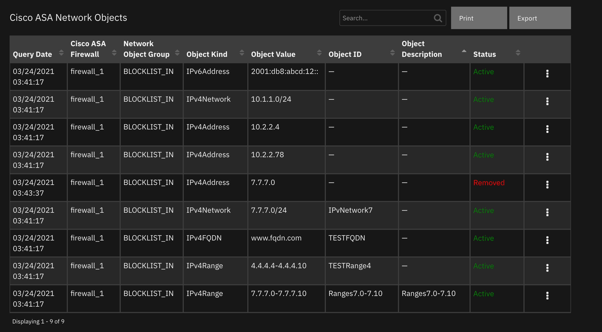

<!--
  This README.md is generated by running:
  "resilient-sdk docgen -p fn_cisco_asa"

  It is best edited using a Text Editor with a Markdown Previewer. VS Code
  is a good example. Checkout https://guides.github.com/features/mastering-markdown/
  for tips on writing with Markdown

  If you make manual edits and run docgen again, a .bak file will be created

  Store any screenshots in the "doc/screenshots" directory and reference them like:
  

  NOTE: If your app is available in the container-format only, there is no need to mention the integration server in this readme.
-->

# None

## Table of Contents
- [Release Notes](#release-notes)
- [Overview](#overview)
  - [Key Features](#key-features)
- [Requirements](#requirements)
  - [Resilient platform](#resilient-platform)
  - [Cloud Pak for Security](#cloud-pak-for-security)
  - [Proxy Server](#proxy-server)
- [Installation](#installation)
  - [Install](#install)
  - [App Configuration](#app-configuration)
  - [Custom Layouts](#custom-layouts)
- [Function - Cisco ASA Get Network Objects](#function---cisco-asa-get-network-objects)
- [Data Table - Cisco ASA Network Objects](#data-table---cisco-asa-network-objects)
- [Rules](#rules)
- [Troubleshooting & Support](#troubleshooting--support)
---

## Release Notes
<!--
  Specify all changes in this release. Do not remove the release 
  notes of a previous release
-->
| Version | Date | Notes |
| ------- | ---- | ----- |
| 1.0.0 | MM/YYYY | Initial Release |

---

## Overview
<!--
  Provide a high-level description of the function itself and its remote software or application.
  The text below is parsed from the "description" and "long_description" attributes in the setup.py file
-->
**Resilient Circuits Components for 'fn_cisco_asa'**

 

Resilient Circuits Components for 'fn_cisco_asa'

### Key Features
<!--
  List the Key Features of the Integration
-->
* Key Feature 1
* Key Feature 2
* Key Feature 3

---

## Requirements
<!--
  List any Requirements 
-->
This app supports the IBM Resilient SOAR Platform and the IBM Cloud Pak for Security.

### Resilient platform
The Resilient platform supports two app deployment mechanisms, App Host and integration server.

If deploying to a Resilient platform with an App Host, the requirements are:
* Resilient platform >= `37.0.5832`.
* The app is in a container-based format (available from the AppExchange as a `zip` file).

If deploying to a Resilient platform with an integration server, the requirements are:
* Resilient platform >= `37.0.5832`.
* The app is in the older integration format (available from the AppExchange as a `zip` file which contains a `tar.gz` file).
* Integration server is running `None`.
* If using an API key account, make sure the account provides the following minimum permissions: 
  | Name | Permissions |
  | ---- | ----------- |
  | Org Data | Read |
  | Function | Read |

The following Resilient platform guides provide additional information: 
* _App Host Deployment Guide_: provides installation, configuration, and troubleshooting information, including proxy server settings. 
* _Integration Server Guide_: provides installation, configuration, and troubleshooting information, including proxy server settings.
* _System Administrator Guide_: provides the procedure to install, configure and deploy apps. 

The above guides are available on the IBM Knowledge Center at [ibm.biz/resilient-docs](https://ibm.biz/resilient-docs). On this web page, select your Resilient platform version. On the follow-on page, you can find the _App Host Deployment Guide_ or _Integration Server Guide_ by expanding **Resilient Apps** in the Table of Contents pane. The System Administrator Guide is available by expanding **System Administrator**.

### Cloud Pak for Security
If you are deploying to IBM Cloud Pak for Security, the requirements are:
* IBM Cloud Pak for Security >= 1.4.
* Cloud Pak is configured with an App Host.
* The app is in a container-based format (available from the AppExchange as a `zip` file).

The following Cloud Pak guides provide additional information: 
* _App Host Deployment Guide_: provides installation, configuration, and troubleshooting information, including proxy server settings. From the Table of Contents, select Case Management and Orchestration & Automation > **Orchestration and Automation Apps**.
* _System Administrator Guide_: provides information to install, configure, and deploy apps. From the IBM Cloud Pak for Security Knowledge Center table of contents, select Case Management and Orchestration & Automation > **System administrator**.

These guides are available on the IBM Knowledge Center at [ibm.biz/cp4s-docs](https://ibm.biz/cp4s-docs). From this web page, select your IBM Cloud Pak for Security version. From the version-specific Knowledge Center page, select Case Management and Orchestration & Automation.

### Proxy Server
The app **does/does not** support a proxy server.

---

## Installation

### Install
* To install or uninstall an App or Integration on the _Resilient platform_, see the documentation at [ibm.biz/resilient-docs](https://ibm.biz/resilient-docs).
* To install or uninstall an App on _IBM Cloud Pak for Security_, see the documentation at [ibm.biz/cp4s-docs](https://ibm.biz/cp4s-docs) and follow the instructions above to navigate to Orchestration and Automation.

### App Configuration
The following table provides the settings you need to configure the app. These settings are made in the app.config file. See the documentation discussed in the Requirements section for the procedure.

| Config | Required | Example | Description |
| ------ | :------: | ------- | ----------- |
| **firewalls** | Yes | `firewall_1` | *Enter a description of the config here.* |
| **network_object_lists** | Yes | `BLACKLIST_IN, BLACKLIST_OUT` | *Enter a description of the config here.* |
| **host** | Yes | `<asa_ip>` | *Enter a description of the config here.* |
| **username** | Yes | `<asa_username>` | *Enter a description of the config here.* |
| **password** | Yes | `<asa_password>` | *Enter a description of the config here.* |

### Custom Layouts
<!--
  Use this section to provide guidance on where the user should add any custom fields and data tables.
  You may wish to recommend a new incident tab.
  You should save a screenshot "custom_layouts.png" in the doc/screenshots directory and reference it here
-->
* Import the Data Tables and Custom Fields like the screenshot below:

  


---

## Function - Cisco ASA Get Network Objects
Query the Cisco ASA firewall and return the network objects contained in the specified network object group.

 

<details><summary>Inputs:</summary>
<p>

| Name | Type | Required | Example | Tooltip |
| ---- | :--: | :------: | ------- | ------- |
| `cisco_asa_firewall` | `text` | Yes | `-` | - |
| `cisco_asa_network_object_group` | `text` | Yes | `-` | - |

</p>
</details>

<details><summary>Outputs:</summary>
<p>

```python
results = {
    # TODO: Copy and paste an example of the Function Output within this code block.
    # To view the output of a Function, run resilient-circuits in DEBUG mode and invoke the Function. 
    # The Function results will be printed in the logs: "resilient-circuits run --loglevel=DEBUG"
}
```

</p>
</details>

<details><summary>Example Pre-Process Script:</summary>
<p>

```python
inputs.cisco_asa_firewall = rule.properties.cisco_asa_firewall
override = rule.properties.cisco_asa_network_object_group_override
if override is "" or override is None:
  inputs.cisco_asa_network_object_group = rule.properties.cisco_asa_network_object_group
else:
  inputs.cisco_asa_network_object_group = override
```

</p>
</details>

<details><summary>Example Post-Process Script:</summary>
<p>

```python
from java.util import Date

content = results.get("content")
member_list = content.get("members")
firewall = results.inputs.get("cisco_asa_firewall")
network_object_group = results.inputs.get("cisco_asa_network_object_group")

# Add each email as a row in the query results data table
for network_object in member_list:
  network_object_row = incident.addRow("cisco_asa_network_object_dt")
  network_object_row.cisco_asa_query_date = Date()
  network_object_row.cisco_asa_firewall = firewall
  network_object_row.cisco_asa_network_object_group = network_object_group
  network_object_row.cisco_asa_network_object_kind = network_object.get("kind")
  network_object_row.cisco_asa_network_object_value = network_object.get("value")  
  network_object_row.cisco_asa_status = "Active"

```

</p>
</details>

---


## Data Table - Cisco ASA Network Objects

 

#### API Name:
cisco_asa_network_object_dt

#### Columns:
| Column Name | API Access Name | Type | Tooltip |
| ----------- | --------------- | ---- | ------- |
| Cisco ASA Firewall | `cisco_asa_firewall` | `text` | - |
| Network Object Group | `cisco_asa_network_object_group` | `text` | - |
| Object Kind | `cisco_asa_network_object_kind` | `text` | - |
| Object Value | `cisco_asa_network_object_value` | `text` | - |
| Query Date | `cisco_asa_query_date` | `datetimepicker` | - |
| Status | `cisco_asa_status` | `text` | - |

---


## Rules
| Rule Name | Object | Workflow Triggered |
| --------- | ------ | ------------------ |
| Example: Cisco ASA Get Network Object Group | incident | `example_cisco_asa_get_network_object_group` |

---

## Troubleshooting & Support
Refer to the documentation listed in the Requirements section for troubleshooting information.

### For Support
This is a IBM Community provided App. Please search the Community https://ibm.biz/resilientcommunity for assistance.
