# fn_cisco_umbrella_inv


## Table of Contents
- [Release Notes](#release-notes)
- [Overview](#overview)
  - [Key Features](#key-features)
- [Requirements](#requirements)
  - [SOAR platform](#soar-platform)
  - [Cloud Pak for Security](#cloud-pak-for-security)
  - [Proxy Server](#proxy-server)
  - [Python Environment](#python-environment)
- [Installation](#installation)
  - [Install](#install)
  - [App Configuration](#app-configuration)
- [Function - umbrella_classifiers](#function---umbrella_classifiers)
- [Function - umbrella_dns_rr_hist](#function---umbrella_dns_rr_hist)
- [Function - umbrella_domain_co_occurrences](#function---umbrella_domain_co_occurrences)
- [Function - umbrella_domain_related_domains](#function---umbrella_domain_related_domains)
- [Function - umbrella_domain_security_info](#function---umbrella_domain_security_info)
- [Function - umbrella_domain_status_and_category](#function---umbrella_domain_status_and_category)
- [Function - umbrella_domain_volume](#function---umbrella_domain_volume)
- [Function - umbrella_domain_whois_info](#function---umbrella_domain_whois_info)
- [Function - umbrella_ip_as_info](#function---umbrella_ip_as_info)
- [Function - umbrella_ip_latest_malicious_domains](#function---umbrella_ip_latest_malicious_domains)
- [Function - umbrella_pattern_search](#function---umbrella_pattern_search)
- [Function - umbrella_threat_grid_sample](#function---umbrella_threat_grid_sample)
- [Function - umbrella_threat_grid_samples](#function---umbrella_threat_grid_samples)
- [Function - umbrella_timeline](#function---umbrella_timeline)
  - [Custom Layouts](#custom-layouts)
- [Data Table - Umbrella Investigate - AS Information for an ip address or ASN](#data-table---umbrella-investigate---as-information-for-an-ip-address-or-asn)
- [Data Table - Umbrella Investigate - Categories for a domain](#data-table---umbrella-investigate---categories-for-a-domain)
- [Data Table - Umbrella Investigate - Category identifiers](#data-table---umbrella-investigate---category-identifiers)
- [Data Table - Umbrella Investigate - Classifiers for a domain](#data-table---umbrella-investigate---classifiers-for-a-domain)
- [Data Table - Umbrella Investigate - Co-occurrences for a domain](#data-table---umbrella-investigate---co-occurrences-for-a-domain)
- [Data Table - Umbrella Investigate - DNS RR history for a domain](#data-table---umbrella-investigate---dns-rr-history-for-a-domain)
- [Data Table - Umbrella Investigate - DNS RR history for an ip address](#data-table---umbrella-investigate---dns-rr-history-for-an-ip-address)
- [Data Table - Umbrella Investigate - Domain Volume](#data-table---umbrella-investigate---domain-volume)
- [Data Table - Umbrella Investigate - Domain WHOIS info for a domain](#data-table---umbrella-investigate---domain-whois-info-for-a-domain)
- [Data Table - Umbrella Investigate - Latest Malicious Domains for an IP](#data-table---umbrella-investigate---latest-malicious-domains-for-an-ip)
- [Data Table - Umbrella Investigate - Pattern search with start epoch](#data-table---umbrella-investigate---pattern-search-with-start-epoch)
- [Data Table - Umbrella Investigate - Pattern search with start relative](#data-table---umbrella-investigate---pattern-search-with-start-relative)
- [Data Table - Umbrella Investigate - Related Domains for a Domain](#data-table---umbrella-investigate---related-domains-for-a-domain)
- [Data Table - Umbrella Investigate - Security information for a domain](#data-table---umbrella-investigate---security-information-for-a-domain)
- [Data Table - Umbrella Investigate - ThreadGrid sample info for a hash](#data-table---umbrella-investigate---threadgrid-sample-info-for-a-hash)
- [Data Table - Umbrella Investigate - ThreadGrid samples for a resource](#data-table---umbrella-investigate---threadgrid-samples-for-a-resource)
- [Data Table - Umbrella Investigate - Timeline for a resource](#data-table---umbrella-investigate---timeline-for-a-resource)
- [Playbooks](#playbooks)
- [Troubleshooting & Support](#troubleshooting--support)

---

## Release Notes
<!--
  Specify all changes in this release. Do not remove the release
  notes of a previous release
-->
| Version | Date | Notes |
| ------- | ---- | ----- |
| Version | Date | Notes |
| ------- | ---- | ----- |
| v1.1.0 | 10/2024 | Add verify to app.config. Update base_url in app.config to API V2. Convert to playbooks. Upgrade to use execute to make API calls. |
| v1.0.3 | September 2020 | Added proxy support |
| v1.0.2 | May 2020 | App Host support |
| v1.0.1 | August 2019 | Configuration settings checking less restrictive |
| v1.0.0 | June 2018 | Initial Release |

* For customers upgrading from a previous release to 1.1.0 or greater, the app.config file must be manually edited to add new settings.

---

## Overview

**IBM QRadar SOAR Integration for Cisco Umbrella Investigate**

 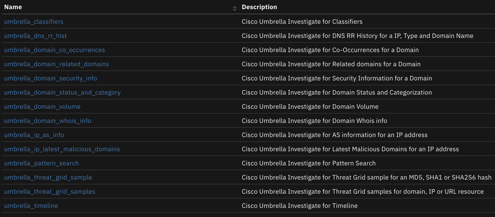

The Cisco Umbrella Investigate integration with the SOAR platform allows for the querying of a Cisco Umbrella Investigate deployment. The integration includes 14 functions that return results which show security events and correlations. The results can be used to make customized updates to the SOAR platform, such as updating incidents, data tables and so on.

### Key Features
* Gets classifiers for a domain (Legacy version of Investigate only)
* Gets DNS RR History for a IP, Type or Domain Name (Legacy version of Investigate only)
* Gets Co-Occurrences for a Domain
* Get domains related to a domain
* Get Security Information for a Domain
* Get Domain Status and Categorization
* Get domain volume
* Get Whois info of a domain
* Get ASA information for an IP address
* Get Latest Malicious Domains for an IP (Legacy version of Investigate only)
* Perform a pattern search
* Get Threat Grid sample for an MD5, SHA1 or SHA256 hash
* Get Threat Grid samples for domain, IP or URL resource
* Get a Timeline

---

## Requirements
This app supports the IBM Security QRadar SOAR Platform and the IBM Security QRadar SOAR for IBM Cloud Pak for Security.

### SOAR platform
The SOAR platform supports two app deployment mechanisms, Edge Gateway (also known as App Host) and integration server.

If deploying to a SOAR platform with an App Host, the requirements are:
* SOAR platform >= `51.0.0.0.9340`.
* The app is in a container-based format (available from the AppExchange as a `zip` file).

If deploying to a SOAR platform with an integration server, the requirements are:
* SOAR platform >= `51.0.0.0.9340`.
* The app is in the older integration format (available from the AppExchange as a `zip` file which contains a `tar.gz` file).
* Integration server is running `resilient_circuits>=51.0.0`.
* If using an API key account, make sure the account provides the following minimum permissions:
  | Name | Permissions |
  | ---- | ----------- |
  | Org Data | Read |
  | Function | Read |
  | Incident Fields | Edit |
 

The following SOAR platform guides provide additional information:
* _Edge Gateway Deployment Guide_ or _App Host Deployment Guide_: provides installation, configuration, and troubleshooting information, including proxy server settings.
* _Integration Server Guide_: provides installation, configuration, and troubleshooting information, including proxy server settings.
* _System Administrator Guide_: provides the procedure to install, configure and deploy apps.

The above guides are available on the IBM Documentation website at [ibm.biz/soar-docs](https://ibm.biz/soar-docs). On this web page, select your SOAR platform version. On the follow-on page, you can find the _Edge Gateway Deployment Guide_, _App Host Deployment Guide_, or _Integration Server Guide_ by expanding **Apps** in the Table of Contents pane. The System Administrator Guide is available by expanding **System Administrator**.

### Cloud Pak for Security
If you are deploying to IBM Cloud Pak for Security, the requirements are:
* IBM Cloud Pak for Security >= `1.10.15`.
* Cloud Pak is configured with an Edge Gateway.
* The app is in a container-based format (available from the AppExchange as a `zip` file).

The following Cloud Pak guides provide additional information:
* _Edge Gateway Deployment Guide_ or _App Host Deployment Guide_: provides installation, configuration, and troubleshooting information, including proxy server settings. From the Table of Contents, select Case Management and Orchestration & Automation > **Orchestration and Automation Apps**.
* _System Administrator Guide_: provides information to install, configure, and deploy apps. From the IBM Cloud Pak for Security IBM Documentation table of contents, select Case Management and Orchestration & Automation > **System administrator**.

These guides are available on the IBM Documentation website at [ibm.biz/cp4s-docs](https://ibm.biz/cp4s-docs). From this web page, select your IBM Cloud Pak for Security version. From the version-specific IBM Documentation page, select Case Management and Orchestration & Automation.

### Proxy Server
The app **does** support a proxy server.

### Python Environment
Python 3.9, 3.11, and 3.12 are officially supported. When deployed as an app, the app runs on Python 3.11.
Additional package dependencies may exist for each of these packages:
* resilient-lib
* resilient_circuits>=51.0.0

---

## Installation

### Install
* To install or uninstall an App or Integration on the _SOAR platform_, see the documentation at [ibm.biz/soar-docs](https://ibm.biz/soar-docs).
* To install or uninstall an App on _IBM Cloud Pak for Security_, see the documentation at [ibm.biz/cp4s-docs](https://ibm.biz/cp4s-docs) and follow the instructions above to navigate to Orchestration and Automation.

### App Configuration
The following table provides the settings you need to configure the app. These settings are made in the app.config file. See the documentation discussed in the Requirements section for the procedure.

| Config | Required | Example | Description |
| ------ | :------: | ------- | ----------- |
| **api_token** | Yes | `<api token>` | *API token from Cisco Umbrella* |
| **base_url** | Yes | `https://api.umbrella.com/investigate/v2/` | *Base URL for Cisco Umbrella investigate.* |
| **results_limit** | Yes | `200` | *The max number of results that should be returned* |
| **verify** | Yes | `True/False` | *True, False, or a path the a certificate file.* |

 ---

## Function - umbrella_classifiers
Cisco Umbrella Investigate for Classifiers. This function only works with the legacy version of Cisco Umbrella Investigate.

 

<details><summary>Inputs:</summary>
<p>

| Name | Type | Required | Example | Tooltip |
| ---- | :--: | :------: | ------- | ------- |
| `umbinv_domain` | `text` | No | `-` | Domain name. |

</p>
</details>

<details><summary>Outputs:</summary>
<p>

> **NOTE:** This example might be in JSON format, but `results` is a Python Dictionary on the SOAR platform.

```python
results = {
  "content": {
    "classifiers_classifiers": {
      "attacks": [
        "Neutrino"
      ],
      "securityCategories": [
        "Malware"
      ],
      "threatTypes": [
        "Exploit Kit"
      ]
    },
    "classifiers_info": {
      "firstQueried": 1479496560000,
      "first_queried_converted": "2016-11-18 19:16:00"
    },
    "domain_name": "cosmos.furnipict.com",
    "query_execution_time": "2018-06-18 11:53:01"
  },
  "reason": null,
  "success": true,
  "version": 2.0
}
```

</p>
</details>

<details><summary>Example Function Input Script:</summary>
<p>

```python
None
```

</p>
</details>

<details><summary>Example Function Post Process Script:</summary>
<p>

```python
results = playbook.functions.results.umbrella_classifier_results
content = results.get("content", {})
classifiers = content.get("classifiers_classifiers", {})
classifiers_info = content.get("classifiers_info", {})

if results.get("success", None):
  if classifiers or classifiers_info:
    newrow = incident.addRow('umbinv_classifiers_for_a_domain')
    newrow.domain_name = content.get("domain_name", None)
    newrow.query_execution_time = content.get("query_execution_time", None)
    if classifiers:
      newrow.security_categories = str(classifiers.get('securityCategories', []))
      newrow.attacks = str(classifiers.get('attacks', []))
      newrow.threat_types = str(classifiers.get('threatTypes', []))
    if classifiers_info:
      newrow.first_queried = str(classifiers_info.get('firstQueried', None))
      newrow.first_queried_converted = str(classifiers_info.get('first_queried_converted', None))
  else:
    incident.addNote("Cisco Umbrella Inv playbook: Classifiers for a domain returned no results.")
else:
  incident.addNote(f"Cisco Umbrella Inv playbook: Classifiers for a domain\nFailed with reason: {results.get('reason', None)}")
```

</p>
</details>

---
## Function - umbrella_dns_rr_hist
Cisco Umbrella Investigate for DNS RR History for a IP, Type and Domain Name. This function only works with the legacy version of Cisco Umbrella Investigate.

 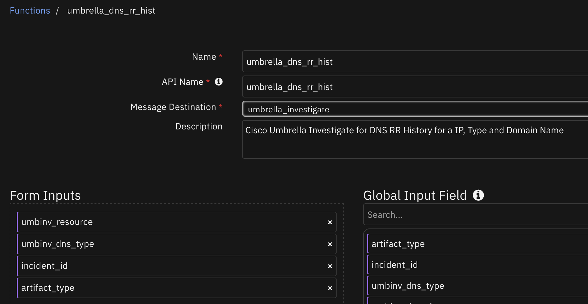

<details><summary>Inputs:</summary>
<p>

| Name | Type | Required | Example | Tooltip |
| ---- | :--: | :------: | ------- | ------- |
| `artifact_type` | `text` | No | `-` | - |
| `incident_id` | `number` | No | `-` | - |
| `umbinv_dns_type` | `select` | No | `-` | NS record query type for a domain or ip address. |
| `umbinv_resource` | `text` | Yes | `-` | IP address, domain , URL, email_address, nameserver or AS number. |

</p>
</details>

<details><summary>Outputs:</summary>
<p>

> **NOTE:** This example might be in JSON format, but `results` is a Python Dictionary on the SOAR platform.

```python
results = {
  "content": {
    "dns_rr_history": {
      "features": {
        "div_ld2": 0.5263157894736842,
        "div_ld2_1": 0.3684210526315789,
        "div_ld2_2": 0.5789473684210527,
        "div_ld3": 0.7368421052631579,
        "ld2_1_count": 7,
        "ld2_2_count": 11,
        "ld2_count": 10,
        "ld3_count": 14,
        "rr_count": 19
      },
      "rrs": [
        {
          "class": "IN",
          "name": "93.184.216.119",
          "rr": "www.example.com.",
          "ttl": 86400,
          "type": "A"
        }
      ]
    },
    "query_execution_time": "2018-05-02 16:03:15",
    "resource_name": "cosmos.furnipict.com"
  },
  "reason": null,
  "success": true,
  "version": 2.0
}
```

</p>
</details>

<details><summary>Example Function Input Script:</summary>
<p>

```python
None
```

</p>
</details>

<details><summary>Example Function Post Process Script:</summary>
<p>

```python
results = playbook.functions.results.umbrell_rr_hist_ip_result
content = results.get("content", {})
dns_rr_history_ip = content.get("dns_rr_history", {})
resource_name = content.get("resource_name", None)
over_limit = content.get("over_limit", None)
query_execution_time = content.get("query_execution_time", None)
att_name = content.get("att_name", None)

if results.get("success", None):
  if over_limit:
    noteText = f"""<br>DNS RR history for {artifact.type} <b>{resource_name}</b> has completed.
    Attachment name : <b>{att_name}</b>"""

    incident.addNote(helper.createRichText(noteText))
  else:
    if dns_rr_history_ip:
      if dns_rr_history_ip.get("features", {}):
        newrow = incident.addRow("umbinv_dns_rr_history_ip")
        newrow["ip_address"] = resource_name
        newrow.query_execution_time = query_execution_time
        newrow["response_class"] = "Features"
        feats = dns_rr_history_ip.get("features", {})
        newrow["rr_count"] = str(feats.get("rr_count"))
        newrow["ld2_count"] = str(feats.get("ld2_count"))
        newrow["ld3_count"] = str(feats.get("ld3_count"))
        newrow["ld2_1_count"] = str(feats.get("ld2_1_count"))
        newrow["ld2_2_count"] = str(feats.get("ld2_2_count"))
        newrow["div_ld2"] = str(feats.get("div_ld2"))
        newrow["div_ld3"] = str(feats.get("div_ld3"))
        newrow["div_ld2_1"] = str(feats.get("div_ld2_1"))
        newrow["div_ld2_2"] = str(feats.get("div_ld2_2"))

      if dns_rr_history_ip.get("rrs", []):
        for r in dns_rr_history_ip.get("rrs", []):
          newrow = incident.addRow("umbinv_dns_rr_history_ip")
          newrow["ip_address"] = resource_name
          newrow.query_execution_time = query_execution_time
          newrow["response_class"] = "Resource Record"
          newrow["ttl"] = str(r.get("ttl"))
          newrow["type"] = r.get("type", None)
          newrow["class"] = r.get("class", None)
          newrow["rr"] = r.get("rr", None)
          newrow["name_rrs"] = r.get("name", None)
    else:
      incident.addNote("Cisco Umbrella Inv playbook: DNS RR history for an ip address returned no results.")
else:
  incident.addNote(f"Cisco Umbrella Inv playbook: DNS RR history for an ip address\nFailed with reason: {results.get('reason', None)}")
```

</p>
</details>

---
## Function - umbrella_domain_co_occurrences
Cisco Umbrella Investigate for Co-Occurrences for a Domain

 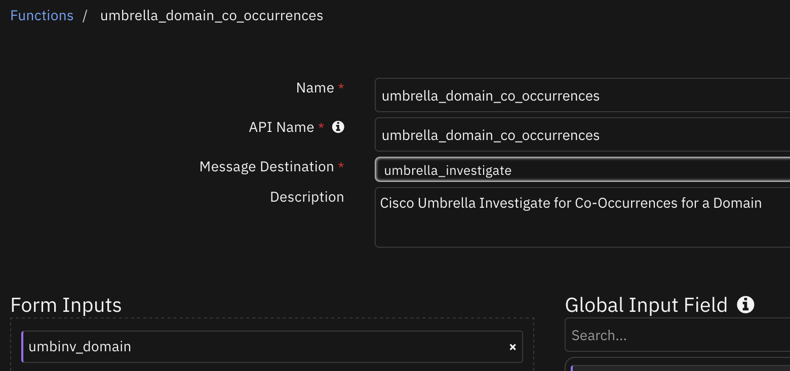

<details><summary>Inputs:</summary>
<p>

| Name | Type | Required | Example | Tooltip |
| ---- | :--: | :------: | ------- | ------- |
| `umbinv_domain` | `text` | No | `-` | Domain name. |

</p>
</details>

<details><summary>Outputs:</summary>
<p>

> **NOTE:** This example might be in JSON format, but `results` is a Python Dictionary on the SOAR platform.

```python
results = {
  "content": {
    "cooccurrences": {
      "found": true,
      "pfs2": [
        [
          "bizlibrary.com",
          0.762127475455211
        ],
        [
          "cpeonlinewebinars.com",
          0.1820483148770022
        ],
        [
          "concursolutions.com",
          0.03536072307668543
        ],
        [
          "us-2.crowdstrike.com",
          0.01458944094084707
        ],
        [
          "cisco.com",
          0.00587404565025434
        ]
      ]
    },
    "domain_name": "ibm.com",
    "query_execution_time": "2024-11-19 10:04:22"
  },
  "inputs": {
    "umbinv_domain": "ibm.com"
  },
  "metrics": {
    "execution_time_ms": 473,
    "host": "local",
    "package": "fn-cisco-umbrella-inv",
    "package_version": "1.1.0",
    "timestamp": "2024-11-19 10:04:22",
    "version": "1.0"
  },
  "raw": null,
  "reason": null,
  "success": true,
  "version": 2.0
}
```

</p>
</details>

<details><summary>Example Function Input Script:</summary>
<p>

```python
None
```

</p>
</details>

<details><summary>Example Function Post Process Script:</summary>
<p>

```python
results = playbook.functions.results.co_occurrences_return
content = results.get("content", {})
cooccurrences = content.get("cooccurrences", {})
domain_name = content.get("domain_name", None)
query_execution_time = content.get("query_execution_time", None)

if results.get("success", None):
  if cooccurrences:
    found = cooccurrences.get("found", False)
    if found and str(found).lower() == 'true':
      co_list = cooccurrences.get("pfs2", [])
      for co_tuple in co_list:
        newrow = incident.addRow('umbinv_domain_co_occurrences')
        newrow.domain_name = domain_name
        newrow.query_execution_time = query_execution_time
        newrow.co_occurence = str(co_tuple[0])
        newrow.score = str(co_tuple[1])
  else:
    incident.addNote("Cisco Umbrella Inv playbook: Co-occurrences for a domain returned no results.")
else:
  incident.addNote(f"Cisco Umbrella Inv playbook: Co-occurrences for a domain\nFailed with reason: {results.get('reason', None)}")
```

</p>
</details>

---
## Function - umbrella_domain_related_domains
Cisco Umbrella Investigate for Related domains for a Domain

 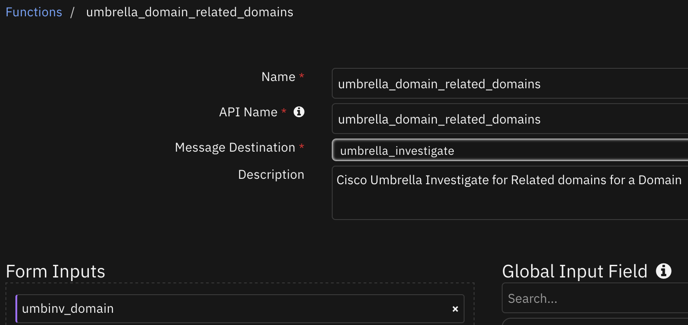

<details><summary>Inputs:</summary>
<p>

| Name | Type | Required | Example | Tooltip |
| ---- | :--: | :------: | ------- | ------- |
| `umbinv_domain` | `text` | No | `-` | Domain name. |

</p>
</details>

<details><summary>Outputs:</summary>
<p>

> **NOTE:** This example might be in JSON format, but `results` is a Python Dictionary on the SOAR platform.

```python
results = {
  "content": {
    "domain_name": "ibm.com",
    "query_execution_time": "2024-11-19 10:09:39",
    "related_domains": {
      "found": true,
      "tb1": [
        [
          "lenovo.com.",
          12
        ]
      ]
    }
  },
  "inputs": {
    "umbinv_domain": "ibm.com"
  },
  "metrics": {
    "execution_time_ms": 709,
    "host": "local",
    "package": "fn-cisco-umbrella-inv",
    "package_version": "1.1.0",
    "timestamp": "2024-11-19 10:09:39",
    "version": "1.0"
  },
  "raw": null,
  "reason": null,
  "success": true,
  "version": 2.0
}
```

</p>
</details>

<details><summary>Example Function Input Script:</summary>
<p>

```python
None
```

</p>
</details>

<details><summary>Example Function Post Process Script:</summary>
<p>

```python
results = playbook.functions.results.related_domains_result
content = results.get("content", {})
related_domains = content.get("related_domains", {})
domain_name = content.get("domain_name", None)
query_execution_time = content.get("query_execution_time", None)

if results.get("success", None):
  if related_domains and related_domains.get("found", False):
    for rd_tuple in related_domains.get("tb1", []):
      newrow = incident.addRow('umbinv_related_domains_for_a_domain')
      newrow.domain_name = domain_name
      newrow.query_execution_time = query_execution_time
      newrow.related_domain = str(rd_tuple[0])
      newrow.score = str(rd_tuple[1])
  else:
    incident.addNote("Cisco Umbrella Inv playbook: Related Domains for a Domain returned no results.")
else:
  incident.addNote(f"Cisco Umbrella Inv playbook: Related Domains for a Domain\nFailed with reason: {results.get('reason', None)}")
```

</p>
</details>

---
## Function - umbrella_domain_security_info
Cisco Umbrella Investigate for Security Information for a Domain

 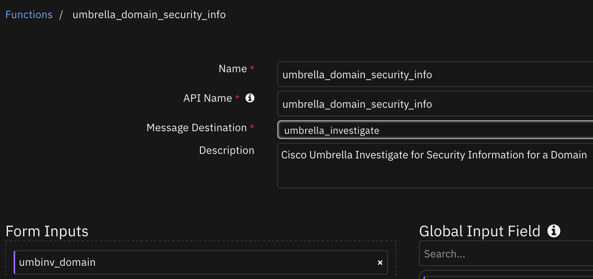

<details><summary>Inputs:</summary>
<p>

| Name | Type | Required | Example | Tooltip |
| ---- | :--: | :------: | ------- | ------- |
| `umbinv_domain` | `text` | No | `-` | Domain name. |

</p>
</details>

<details><summary>Outputs:</summary>
<p>

> **NOTE:** This example might be in JSON format, but `results` is a Python Dictionary on the SOAR platform.

```python
results = {
  "content": {
    "domain_name": "ibm.com",
    "query_execution_time": "2024-11-19 10:12:21",
    "security_info": {
      "asn_score": 0.0,
      "attack": "",
      "dga_score": 0.0,
      "entropy": 1.584962500721156,
      "fastflux": false,
      "found": true,
      "geodiversity": [
        [
          "US",
          0.5011
        ],
        [
          "IN",
          0.0698
        ],
        [
          "SD",
          0.0002
        ],
        [
          "TT",
          0.0002
        ]
      ],
      "geodiversity_normalized": [
        [
          "SC",
          0.13903032793499992
        ],
        [
          "MP",
          0.12901471212527463
        ],
        [
          "BZ",
          0.002746884931839391
        ],
        [
          "CL",
          0.0026719453183492357
        ],
        [
          "HR",
          0.0026574946235601235
        ],
        [
          "SE",
          0.002378747907990022
        ]
      ],
      "geoscore": 0.0,
      "ks_test": 0.0,
      "pagerank": 0.0,
      "perplexity": 0.1098890210137852,
      "popularity": 100.0,
      "prefix_score": 0.0,
      "rip_score": 0.0,
      "securerank2": 0.0,
      "threat_type": "",
      "tld_geodiversity": []
    }
  },
  "inputs": {
    "umbinv_domain": "ibm.com"
  },
  "metrics": {
    "execution_time_ms": 292,
    "host": "local",
    "package": "fn-cisco-umbrella-inv",
    "package_version": "1.1.0",
    "timestamp": "2024-11-19 10:12:21",
    "version": "1.0"
  },
  "raw": null,
  "reason": null,
  "success": true,
  "version": 2.0
}
```

</p>
</details>

<details><summary>Example Function Input Script:</summary>
<p>

```python
None
```

</p>
</details>

<details><summary>Example Function Post Process Script:</summary>
<p>

```python
results = playbook.functions.results.security_info_result
content = results.get("content", {})
security_info = content.get("security_info", {})

if results.get("success", None):
  if security_info and security_info.get("found", False):
    newrow = incident.addRow("umbinv_domain_security_info")
    newrow.domain_name = content.get("domain_name", None)
    newrow.query_execution_time = content.get("query_execution_time", None)
    newrow["dga_score"] = str(security_info.get("dga_score"))
    newrow["rip_score"] = str(security_info.get("rip_score"))
    newrow["asn_score"] = str(security_info.get("asn_score"))
    newrow["securerank2"] = str(security_info.get("securerank2"))
    newrow["popularity"] = str(security_info.get("popularity"))
    newrow["geoscore"] = str(security_info.get("geoscore"))
    newrow["ks_test"] = str(security_info.get("ks_test"))
    newrow["attack"] = security_info.get("attack", None)
    newrow["pagerank"] = str(security_info.get("pagerank"))
    newrow["entropy"] = str(security_info.get("entropy"))
    newrow["prefix_score"] = str(security_info.get("prefix_score"))
    newrow["perplexity"] = str(security_info.get("perplexity"))
    newrow["fastflux"] = str(security_info.get("fastflux"))
    newrow["threat_type"] = security_info.get("threat_type", None)
  else:
    incident.addNote("Cisco Umbrella Inv playbook: Security information for a domain returned no results.")
else:
  incident.addNote("Cisco Umbrella Inv playbook: Security information for a domain\nFailed with reason: {results.get('reason', None)}")
```

</p>
</details>

---
## Function - umbrella_domain_status_and_category
Cisco Umbrella Investigate for Domain Status and Categorization. The categories option of this function only works with the legacy version of Cisco Umbrella Investigate.

 

<details><summary>Inputs:</summary>
<p>

| Name | Type | Required | Example | Tooltip |
| ---- | :--: | :------: | ------- | ------- |
| `umbinv_domains` | `text` | No | `-` | Domain names. |
| `umbinv_status_endpoint` | `select` | Yes | `-` | Chose between list categories or query categorizations. |

</p>
</details>

<details><summary>Outputs:</summary>
<p>

> **NOTE:** This example might be in JSON format, but `results` is a Python Dictionary on the SOAR platform.

```python
results = {
  "version": 2.0,
  "success": true,
  "reason": null,
  "content": {
    "domains": [
      "amazon.com"
    ],
    "query_execution_time": "2018-04-27 11:37:38",
    "statuses": {
      "amazon.com": {
        "status": 1,
        "content_categories": [
          "Ecommerce/Shopping"
        ],
        "security_categories": []
      }
    }
  },
  "raw": null,
  "inputs": {
    "umbinv_domains": "amazon.com",
    "umbinv_status_endpoint": "categorization"
  },
  "metrics": {
    "version": "1.0",
    "package": "fn-cisco-umbrella-inv",
    "package_version": "1.1.0",
    "host": "local",
    "execution_time_ms": 27042,
    "timestamp": "2024-11-19 10:01:55"
  }
}
```

</p>
</details>

<details><summary>Example Function Input Script:</summary>
<p>

```python
None
```

</p>
</details>

<details><summary>Example Function Post Process Script:</summary>
<p>

```python
results = playbook.functions.results.umbrella_domain_categories_result
content = results.get("content", {})
statuses = content.get("statuses", {})
domains = content.get("domains", [])
query_execution_time = content.get("query_execution_time", None)

if results.get("success", None):
  if statuses and domains:
    for domain in domains:
      newrow = incident.addRow("umbinv_categories_for_a_domain")
      status_fields = DATA_TBL_FIELDS[2:]
      newrow.domain_name = domain
      newrow.query_execution_time = query_execution_time
      newrow.status = str(statuses.get(domain, {}).get("status", None))
      newrow.content_categories = str(statuses.get(domain, {}).get("content_categories", []))
      newrow.security_categories = str(statuses.get(domain, {}).get("security_categories", []))
  else:
    incident.addNote("Cisco Umbrella Inv playbook: Categories for a domain returned no results.")
else:
  incident.addNote(f"Cisco Umbrella Inv playbook: Categories for a domain\nFailed with reason: {results.get('reason', None)}")
```

</p>
</details>

---
## Function - umbrella_domain_volume
Cisco Umbrella Investigate for Domain Volume

 

<details><summary>Inputs:</summary>
<p>

| Name | Type | Required | Example | Tooltip |
| ---- | :--: | :------: | ------- | ------- |
| `umbinv_domain` | `text` | No | `-` | Domain name. |
| `umbinv_match` | `select` | Yes | `-` | Chose between exact, component, or all. |
| `umbinv_start_epoch` | `datetimepicker` | No | `-` | Start time. |
| `umbinv_start_relative` | `text` | No | `-` | Start time in relative format. |
| `umbinv_stop_epoch` | `datetimepicker` | No | `-` | Stop time. |
| `umbinv_stop_relative` | `text` | No | `-` | Stop time in relative format. |

</p>
</details>

<details><summary>Outputs:</summary>
<p>

> **NOTE:** This example might be in JSON format, but `results` is a Python Dictionary on the SOAR platform.

```python
results = {
  "content": {
    "domain_name": "ibm.com",
    "domain_volume": {
      "dates": [
        1729450800000,
        1729450800000
      ],
      "dates_converted": [
        "2024-10-20 15:00:00",
        "2024-10-20 15:00:00"
      ],
      "queries": [
        280833
      ]
    },
    "query_execution_time": "2024-11-19 10:04:45"
  },
  "inputs": {
    "umbinv_domain": "ibm.com",
    "umbinv_match": "all",
    "umbinv_start_epoch": null,
    "umbinv_start_relative": "-1days",
    "umbinv_stop_epoch": null,
    "umbinv_stop_relative": "now"
  },
  "metrics": {
    "execution_time_ms": 547,
    "host": "local",
    "package": "fn-cisco-umbrella-inv",
    "package_version": "1.1.0",
    "timestamp": "2024-11-19 10:04:45",
    "version": "1.0"
  },
  "raw": null,
  "reason": null,
  "success": true,
  "version": 2.0
}
```

</p>
</details>

<details><summary>Example Function Input Script:</summary>
<p>

```python
None
```

</p>
</details>

<details><summary>Example Function Post Process Script:</summary>
<p>

```python
results = playbook.functions.results.domain_volume_result
content = results.get("content", {})
domain_volume = content.get("domain_volume", {})

if results.get("success", None):
  if domain_volume:
    newrow = incident.addRow("umbinv_domain_volume")
    newrow.domain_name = content.get("domain_name", None)
    newrow.query_execution_time = content.get("query_execution_time", None)
    #newrow.dates = str(domain_volume["dates"])
    dates_converted = domain_volume.get("dates_converted", [])
    if len(dates_converted) > 1:
      newrow.start_date_dv = str(dates_converted[0])
      newrow.stop_date_dv = str(dates_converted[1])
    newrow.queries = str(domain_volume.get("queries", [])).replace("[", "").replace("]", "")
  else:
    incident.addNote("Cisco Umbrella Inv playbook: Domain volume returned no results.")
else:
  incident.addNote(f"Cisco Umbrella Inv playbook: Domain volume\nFailed with reason: {results.get('reason', None)}")
```

</p>
</details>

---
## Function - umbrella_domain_whois_info
Cisco Umbrella Investigate for Domain Whois info

 

<details><summary>Inputs:</summary>
<p>

| Name | Type | Required | Example | Tooltip |
| ---- | :--: | :------: | ------- | ------- |
| `umbinv_limit` | `number` | No | `-` | Maximum number of results for endpoint |
| `umbinv_offset` | `number` | No | `-` | An offset value where there are a large number of returned values. |
| `umbinv_resource` | `text` | Yes | `-` | IP address, domain , URL, email_address, nameserver or AS number. |
| `umbinv_sortby` | `text` | No | `-` | Sort-by field for returned data. |

</p>
</details>

<details><summary>Outputs:</summary>
<p>

> **NOTE:** This example might be in JSON format, but `results` is a Python Dictionary on the SOAR platform.

```python
results = {
  "content": {
    "domain_whois": [
      {
        "addresses": [
          "new orchard road"
        ],
        "administrativeContactCity": "Armonk",
        "administrativeContactCountry": "UNITED STATES",
        "administrativeContactEmail": "dnsadm@us.ibm.com",
        "administrativeContactFax": null,
        "administrativeContactFaxExt": "",
        "administrativeContactName": "IBM Corporation",
        "administrativeContactOrganization": "International Business Machines (IBM)",
        "administrativeContactPostalCode": "10598",
        "administrativeContactState": "NY",
        "administrativeContactStreet": [
          "new orchard road"
        ],
        "administrativeContactTelephone": "19147654227",
        "administrativeContactTelephoneExt": "",
        "auditUpdatedDate": "2024-06-13 01:26:08 UTC",
        "billingContactCity": "",
        "billingContactCountry": "",
        "billingContactEmail": "",
        "billingContactFax": "",
        "billingContactFaxExt": "",
        "billingContactName": "",
        "billingContactOrganization": "",
        "billingContactPostalCode": "",
        "billingContactState": "",
        "billingContactStreet": [],
        "billingContactTelephone": "",
        "billingContactTelephoneExt": "",
        "created": "1986-03-19",
        "domainName": "ibm.com",
        "emails": [
          "dnsadm@us.ibm.com",
          "dnstech@us.ibm.com"
        ],
        "expires": "2025-03-20",
        "hasRawText": true,
        "nameServers": [
          "asia3.akam.net",
          "eur2.akam.net",
          "eur5.akam.net",
          "ns1-206.akam.net",
          "ns1-99.akam.net",
          "usc2.akam.net",
          "usc3.akam.net",
          "usw2.akam.net"
        ],
        "recordExpired": false,
        "registrantCity": "Armonk",
        "registrantCountry": "UNITED STATES",
        "registrantEmail": "dnsadm@us.ibm.com",
        "registrantFax": "1914765437",
        "registrantFaxExt": "",
        "registrantName": "IBM DNS Admin",
        "registrantOrganization": "International Business Machines Corporation",
        "registrantPostalCode": "10504",
        "registrantState": "NY",
        "registrantStreet": [
          "new orchard road"
        ],
        "registrantTelephone": "19147654227",
        "registrantTelephoneExt": "",
        "registrarIANAID": "299",
        "registrarName": "CSC Corporate Domains, Inc.",
        "status": [
          "clientTransferProhibited serverDeleteProhibited serverTransferProhibited serverUpdateProhibited"
        ],
        "technicalContactCity": "Armonk",
        "technicalContactCountry": "UNITED STATES",
        "technicalContactEmail": "dnstech@us.ibm.com",
        "technicalContactFax": "19147654370",
        "technicalContactFaxExt": "",
        "technicalContactName": "IBM Corporation",
        "technicalContactOrganization": "International Business Machines (IBM)",
        "technicalContactPostalCode": "10598",
        "technicalContactState": "NY",
        "technicalContactStreet": [
          "new orchard road"
        ],
        "technicalContactTelephone": "19192544441",
        "technicalContactTelephoneExt": "",
        "timeOfLatestRealtimeCheck": null,
        "timestamp": null,
        "updated": "2024-03-16",
        "whoisServers": null,
        "zoneContactCity": "",
        "zoneContactCountry": "",
        "zoneContactEmail": "",
        "zoneContactFax": "",
        "zoneContactFaxExt": "",
        "zoneContactName": "",
        "zoneContactOrganization": "",
        "zoneContactPostalCode": "",
        "zoneContactState": "",
        "zoneContactStreet": [],
        "zoneContactTelephone": "",
        "zoneContactTelephoneExt": ""
      },
      {
        "addresses": [
          "new orchard road"
        ],
        "administrativeContactCity": "Armonk",
        "administrativeContactCountry": "UNITED STATES",
        "administrativeContactEmail": "dnsadm@us.ibm.com",
        "administrativeContactFax": null,
        "administrativeContactFaxExt": null,
        "administrativeContactName": "IBM Corporation",
        "administrativeContactOrganization": "International Business Machines (IBM)",
        "administrativeContactPostalCode": "10598",
        "administrativeContactState": "NY",
        "administrativeContactStreet": [
          "new orchard road"
        ],
        "administrativeContactTelephone": "19147654227",
        "administrativeContactTelephoneExt": null,
        "auditUpdatedDate": "2024-05-26 18:42:35 UTC",
        "billingContactCity": null,
        "billingContactCountry": null,
        "billingContactEmail": null,
        "billingContactFax": null,
        "billingContactFaxExt": null,
        "billingContactName": null,
        "billingContactOrganization": null,
        "billingContactPostalCode": null,
        "billingContactState": null,
        "billingContactStreet": [],
        "billingContactTelephone": null,
        "billingContactTelephoneExt": null,
        "created": "1986-03-19",
        "domainName": "ibm.com",
        "emails": [
          "dnstech@us.ibm.com",
          "dnsadm@us.ibm.com"
        ],
        "expires": "2025-03-20",
        "hasRawText": true,
        "nameServers": [
          "asia3.akam.net",
          "eur2.akam.net",
          "eur5.akam.net",
          "ns1-206.akam.net",
          "ns1-99.akam.net",
          "usc2.akam.net",
          "usc3.akam.net",
          "usw2.akam.net"
        ],
        "recordExpired": false,
        "registrantCity": "Armonk",
        "registrantCountry": "UNITED STATES",
        "registrantEmail": "dnsadm@us.ibm.com",
        "registrantFax": "1914765437",
        "registrantFaxExt": null,
        "registrantName": "IBM DNS Admin",
        "registrantOrganization": "International Business Machines Corporation",
        "registrantPostalCode": "10504",
        "registrantState": "NY",
        "registrantStreet": [
          "new orchard road"
        ],
        "registrantTelephone": "19147654227",
        "registrantTelephoneExt": null,
        "registrarIANAID": "299",
        "registrarName": "CSC CORPORATE DOMAINS, INC.",
        "status": [
          "clientTransferProhibited serverDeleteProhibited serverTransferProhibited serverUpdateProhibited"
        ],
        "technicalContactCity": "Armonk",
        "technicalContactCountry": "UNITED STATES",
        "technicalContactEmail": "dnstech@us.ibm.com",
        "technicalContactFax": "19147654370",
        "technicalContactFaxExt": null,
        "technicalContactName": "IBM Corporation",
        "technicalContactOrganization": "International Business Machines (IBM)",
        "technicalContactPostalCode": "10598",
        "technicalContactState": "NY",
        "technicalContactStreet": [
          "new orchard road"
        ],
        "technicalContactTelephone": "19192544441",
        "technicalContactTelephoneExt": null,
        "timeOfLatestRealtimeCheck": 1716802190814,
        "timestamp": null,
        "updated": "2024-03-16",
        "whoisServers": "whois.corporatedomains.com",
        "zoneContactCity": null,
        "zoneContactCountry": null,
        "zoneContactEmail": null,
        "zoneContactFax": null,
        "zoneContactFaxExt": null,
        "zoneContactName": null,
        "zoneContactOrganization": null,
        "zoneContactPostalCode": null,
        "zoneContactState": null,
        "zoneContactStreet": [],
        "zoneContactTelephone": null,
        "zoneContactTelephoneExt": null
      },
      {
        "addresses": [
          "new orchard road"
        ],
        "administrativeContactCity": "Armonk",
        "administrativeContactCountry": "UNITED STATES",
        "administrativeContactEmail": "dnsadm@us.ibm.com",
        "administrativeContactFax": null,
        "administrativeContactFaxExt": "",
        "administrativeContactName": "IBM Corporation",
        "administrativeContactOrganization": "International Business Machines (IBM)",
        "administrativeContactPostalCode": "10598",
        "administrativeContactState": "NY",
        "administrativeContactStreet": [
          "new orchard road"
        ],
        "administrativeContactTelephone": "19147654227",
        "administrativeContactTelephoneExt": "",
        "auditUpdatedDate": "2024-03-10 14:25:15 UTC",
        "billingContactCity": "",
        "billingContactCountry": "",
        "billingContactEmail": "",
        "billingContactFax": "",
        "billingContactFaxExt": "",
        "billingContactName": "",
        "billingContactOrganization": "",
        "billingContactPostalCode": "",
        "billingContactState": "",
        "billingContactStreet": [],
        "billingContactTelephone": "",
        "billingContactTelephoneExt": "",
        "created": "1986-03-19",
        "domainName": "ibm.com",
        "emails": [
          "dnsadm@us.ibm.com",
          "dnstech@us.ibm.com"
        ],
        "expires": "2024-03-20",
        "hasRawText": true,
        "nameServers": [
          "asia3.akam.net",
          "eur2.akam.net",
          "eur5.akam.net",
          "ns1-206.akam.net",
          "ns1-99.akam.net",
          "usc2.akam.net",
          "usc3.akam.net",
          "usw2.akam.net"
        ],
        "recordExpired": true,
        "registrantCity": "Armonk",
        "registrantCountry": "UNITED STATES",
        "registrantEmail": "dnsadm@us.ibm.com",
        "registrantFax": "1914765437",
        "registrantFaxExt": "",
        "registrantName": "IBM DNS Admin",
        "registrantOrganization": "International Business Machines Corporation",
        "registrantPostalCode": "10504",
        "registrantState": "NY",
        "registrantStreet": [
          "new orchard road"
        ],
        "registrantTelephone": "19147654227",
        "registrantTelephoneExt": "",
        "registrarIANAID": "299",
        "registrarName": "CSC Corporate Domains, Inc.",
        "status": [
          "clientTransferProhibited serverDeleteProhibited serverTransferProhibited serverUpdateProhibited"
        ],
        "technicalContactCity": "Armonk",
        "technicalContactCountry": "UNITED STATES",
        "technicalContactEmail": "dnstech@us.ibm.com",
        "technicalContactFax": "19147654370",
        "technicalContactFaxExt": "",
        "technicalContactName": "IBM Corporation",
        "technicalContactOrganization": "International Business Machines (IBM)",
        "technicalContactPostalCode": "10598",
        "technicalContactState": "NY",
        "technicalContactStreet": [
          "new orchard road"
        ],
        "technicalContactTelephone": "19192544441",
        "technicalContactTelephoneExt": "",
        "timeOfLatestRealtimeCheck": null,
        "timestamp": null,
        "updated": "2023-03-16",
        "whoisServers": null,
        "zoneContactCity": "",
        "zoneContactCountry": "",
        "zoneContactEmail": "",
        "zoneContactFax": "",
        "zoneContactFaxExt": "",
        "zoneContactName": "",
        "zoneContactOrganization": "",
        "zoneContactPostalCode": "",
        "zoneContactState": "",
        "zoneContactStreet": [],
        "zoneContactTelephone": "",
        "zoneContactTelephoneExt": ""
      }
    ],
    "ns_whois": {
      "ibm.com": {
        "domains": [
          {
            "current": false,
            "domain": "cardiganmerch.shop"
          }
        ],
        "limit": 500,
        "moreDataAvailable": false,
        "offset": 0,
        "sortField": "created",
        "totalResults": 1
      }
    },
    "query_execution_time": "2024-11-19 10:08:46",
    "resource": "ibm.com",
    "resource_type": "domain_name"
  },
  "inputs": {
    "umbinv_limit": null,
    "umbinv_offset": 0,
    "umbinv_resource": "ibm.com",
    "umbinv_sortby": "created"
  },
  "metrics": {
    "execution_time_ms": 1486,
    "host": "local",
    "package": "fn-cisco-umbrella-inv",
    "package_version": "1.1.0",
    "timestamp": "2024-11-19 10:08:46",
    "version": "1.0"
  },
  "raw": null,
  "reason": null,
  "success": true,
  "version": 2.0
}
```

</p>
</details>

<details><summary>Example Function Input Script:</summary>
<p>

```python
None
```

</p>
</details>

<details><summary>Example Function Post Process Script:</summary>
<p>

```python
results = playbook.functions.results.whois_info_result
content = results.get("content", {})
domain_whois = content.get("domain_whois", {})
email_whois = content.get("email_whois", {})
ns_whois = content.get("ns_whois", {})
query_execution_time = content.get("query_execution_time", None)
resource_name = content.get("resource", None)
resource_type = content.get("resource_type", None)
emails = content.get("emails", None)

if results.get("success", None):
  if domain_whois and resource_name:
    for dwi in domain_whois:
      newrow = incident.addRow("umbinv_domain_whois_info_domain")
      newrow.resource_name = resource_name
      newrow.resource_type = resource_type
      newrow.query_execution_time = query_execution_time
      newrow["administrative_contact_name"] = dwi.get("administrativeContactName", None)
      newrow["administrative_contact_email"] = dwi.get("administrativeContactEmail", None)
      newrow["technical_contact_email"] = dwi.get("technicalContactEmail", None)
      newrow["administrative_contact_city"] = dwi.get("administrativeContactCity", None)
      newrow["administrative_contact_organization"] = dwi.get("administrativeContactOrganization", None)
      newrow["addresses"] = str(dwi.get("addresses", []))
      newrow["name_servers"] = str(dwi.get("nameServers", []))
  
  elif ns_whois and resource_name:
    # Post processing code for name server whois here
    pass
  
  elif email_whois and emails:
    # Post processing code for email whois here
    pass
  else:
    incident.addNote("Cisco Umbrella Inv playbook: Domain WHOIS information for a domain returned no results.")
else:
  incident.addNote(f"Cisco Umbrella Inv playbook: Domain WHOIS information for a domain\nFailed with reason: {results.get('reason', None)}")
```

</p>
</details>

---
## Function - umbrella_ip_as_info
Cisco Umbrella Investigate for AS information for an IP address

 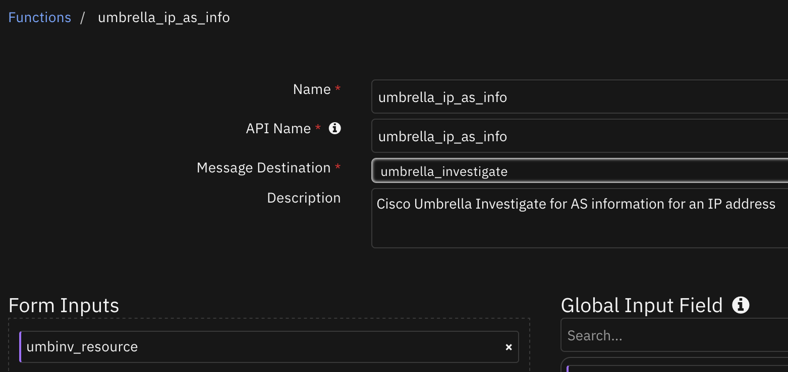

<details><summary>Inputs:</summary>
<p>

| Name | Type | Required | Example | Tooltip |
| ---- | :--: | :------: | ------- | ------- |
| `umbinv_resource` | `text` | Yes | `-` | IP address, domain , URL, email_address, nameserver or AS number. |

</p>
</details>

<details><summary>Outputs:</summary>
<p>

> **NOTE:** This example might be in JSON format, but `results` is a Python Dictionary on the SOAR platform.

```python
results = {
  "content": {
    "as_for_ip": [
      {
        "asn": 13335,
        "cidr": "1.1.1.0/24",
        "creation_date": "2010-07-14",
        "description": "CLOUDFLARENET, US 86400",
        "ir": 3
      }
    ],
    "ip_address": "1.1.1.1",
    "query_execution_time": "2024-11-19 09:28:19"
  },
  "inputs": {
    "umbinv_resource": "1.1.1.1"
  },
  "metrics": {
    "execution_time_ms": 844,
    "host": "local",
    "package": "fn-cisco-umbrella-inv",
    "package_version": "1.1.0",
    "timestamp": "2024-11-19 09:28:19",
    "version": "1.0"
  },
  "raw": null,
  "reason": null,
  "success": true,
  "version": 2.0
}
```

</p>
</details>

<details><summary>Example Function Input Script:</summary>
<p>

```python
None
```

</p>
</details>

<details><summary>Example Function Post Process Script:</summary>
<p>

```python
results = playbook.functions.results.umbrella_ip_as_info_results
content = results.get("content", {})
as_for_ip = content.get("as_for_ip", [])
ip_address = content.get("ip_address", None)
asn = content.get("asn", None)
prefixes_for_asn = content.get("prefixes_for_asn", [])
query_execution_time = content.get("query_execution_time", None)

def update_fields(result, ip_or_asn):
  for r in result:
    newrow = incident.addRow("umbinv_as_for_an_ip_or_asn")
    newrow.ip_address_or_asn = ip_or_asn
    newrow.query_execution_time = query_execution_time
    newrow["description_as"] = r.get("description", None)
    newrow["cidr"] = r.get("cidr", None)
    newrow["ir"] = r.get("ir", None)
    newrow["asn"] = r.get("asn", None)
    newrow["creation_date"] = r.get("creation_date", None)
    if r.get("geo", {}):
      newrow["country_name"] = str(r.get("geo", {}).get("country_name", None))
      newrow["country_code"] = str(r.get("geo", {}).get("country_code", None))

if results.get("success", None):
  if as_for_ip:
    update_fields(as_for_ip, ip_address)
  elif prefixes_for_asn:
    update_fields(prefixes_for_asn, asn)
  else:
    incident.addNote("Cisco Umbrella Inv playbook: AS Information for an ip address or ASN returned no results.")
else:
  incident.addNote(f"Cisco Umbrella Inv playbook: AS Information for an ip address or ASN\nFailed with reason: {results.get('reason', None)}")
```

</p>
</details>

---
## Function - umbrella_ip_latest_malicious_domains
Cisco Umbrella Investigate for Latest Malicious Domains for an IP address. This function only works with the legacy version of Cisco Umbrella Investigate.

 

<details><summary>Inputs:</summary>
<p>

| Name | Type | Required | Example | Tooltip |
| ---- | :--: | :------: | ------- | ------- |
| `umbinv_ipaddr` | `text` | No | `-` | IP address. |

</p>
</details>

<details><summary>Outputs:</summary>
<p>

> **NOTE:** This example might be in JSON format, but `results` is a Python Dictionary on the SOAR platform.

```python
results = {
  "content": {
    "ip_address": "104.27.163.228",
    "latest_malicious_domains": [
      "textspeier.de"
    ],
    "query_execution_time": "2018-05-02 16:22:14"
  },
  "reason": null,
  "success": true,
  "version": 2.0
}
```

</p>
</details>

<details><summary>Example Function Input Script:</summary>
<p>

```python
None
```

</p>
</details>

<details><summary>Example Function Post Process Script:</summary>
<p>

```python
results = playbook.functions.results.malicious_domain_result
content = results.get("content", {})
latest_malicious_domains = content.get("latest_malicious_domains", [])
ip_address = content.get("ip_address", None)
query_execution_time = content.get("query_execution_time", None)

if results.get("success", None):
  if latest_malicious_domains and ip_address:
    newrow = incident.addRow('umbinv_latest_malicious_domains_for_an_ip')
    newrow.ip_address = ip_address
    newrow.query_execution_time = query_execution_time
    newrow.latest_malicious_domains = str(latest_malicious_domains)
  else:
    incident.addNote("Cisco Umbrella Inv playbook: Latest Malicious Domains for an ip address returned no results.")
else:
  incident.addNote(f"Cisco Umbrella Inv playbook: Latest Malicious Domains for an ip address\nFailed with reason: {results.get('reason', None)}")
```

</p>
</details>

---
## Function - umbrella_pattern_search
Cisco Umbrella Investigate for Pattern Search

 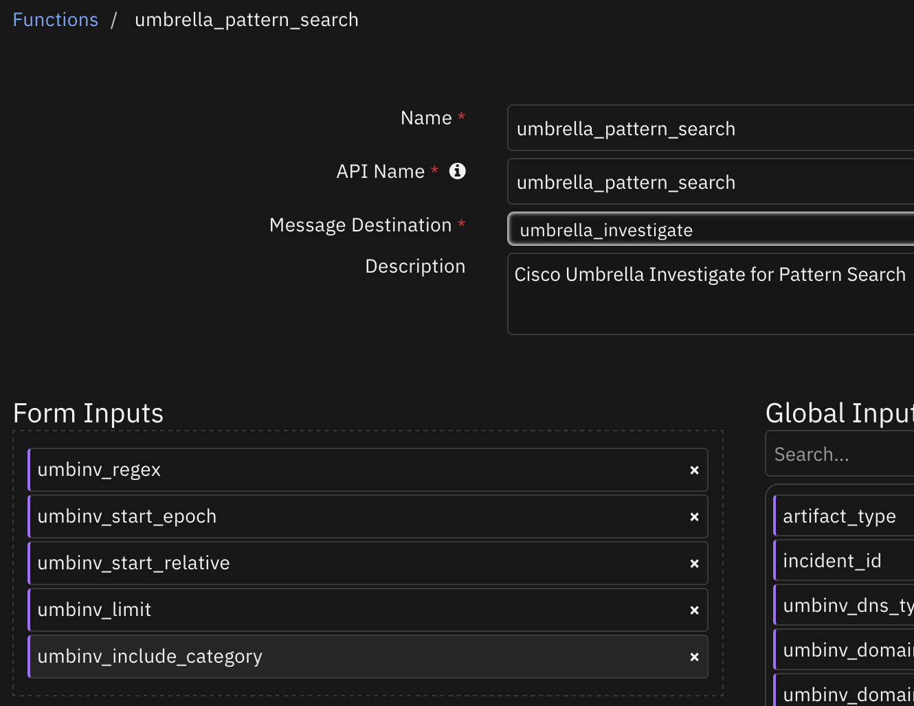

<details><summary>Inputs:</summary>
<p>

| Name | Type | Required | Example | Tooltip |
| ---- | :--: | :------: | ------- | ------- |
| `umbinv_include_category` | `boolean` | No | `-` | If set to true this will include security categories in the results. |
| `umbinv_limit` | `number` | No | `-` | Maximum number of results for endpoint |
| `umbinv_regex` | `text` | No | `-` | Search pattern regular expression. |
| `umbinv_start_epoch` | `datetimepicker` | No | `-` | Start time. |
| `umbinv_start_relative` | `text` | No | `-` | Start time in relative format. |

</p>
</details>

<details><summary>Outputs:</summary>
<p>

> **NOTE:** This example might be in JSON format, but `results` is a Python Dictionary on the SOAR platform.

```python
results = {
  "content": {
    "query_execution_time": "2018-05-02 16:03:15",
    "search_matches": {
      "expression": "exa[a-z]ple.com",
      "limit": 30,
      "matches": [
        {
          "firstSeen": 1432330927421,
          "firstSeenISO": "2015-05-22T21:42:07.421Z",
          "name": "example",
          "securityCategories": [
            "Botnet"
          ]
        }
      ],
      "moreDataAvailable": false,
      "totalResults": 1
    }
  },
  "reason": null,
  "success": true,
  "version": 2.0
}
```

</p>
</details>

<details><summary>Example Function Input Script:</summary>
<p>

```python
None
```

</p>
</details>

<details><summary>Example Function Post Process Script:</summary>
<p>

```python
results = playbook.functions.results.start_epoch_result
content = results.get("content", {})
search_matches = content.get("search_matches", {})
query_execution_time = content.get("query_execution_time", None)

if results.get("success", None):
  if search_matches and int(search_matches.get("totalResults", 0)):
    if search_matches.get("matches", []):
      regex_expression = search_matches.get("expression", None)
      more_data_available = search_matches.get("moreDataAvailable", False)
      for m in search_matches.get("matches", []):
        newrow = incident.addRow("umbinv_pattern_search_start_epoch")
        newrow.regex_expression = regex_expression
        newrow.query_execution_time = query_execution_time
        newrow["security_categories"] = str(m.get("securityCategories", []))
        newrow["name_match"] = m.get("name", None)
        newrow["first_seen"] = str(m.get("first_seen"))
        newrow["first_seen_iso"] = m.get("firstSeenISO", None)
      if more_data_available:
        newrow.more_data_available = str(more_data_available)
  else:
    incident.addNote("Cisco Umbrella Inv playbook: Pattern search start epoch returned no results.")
else:
  incident.addNote(f"Cisco Umbrella Inv playbook: Pattern search start epoch\nFailed with reason: {results.get('reason', None)}")
```

</p>
</details>

---
## Function - umbrella_threat_grid_sample
Cisco Umbrella Investigate for Threat Grid sample for an MD5, SHA1 or SHA256 hash

 

<details><summary>Inputs:</summary>
<p>

| Name | Type | Required | Example | Tooltip |
| ---- | :--: | :------: | ------- | ------- |
| `umbinv_hash` | `text` | Yes | `-` | Valid MD5, sha1 or sha256 hash value. |
| `umbinv_limit` | `number` | No | `-` | Maximum number of results for endpoint |
| `umbinv_offset` | `number` | No | `-` | An offset value where there are a large number of returned values. |
| `umbinv_sample_endpoint` | `select` | No | `-` | Select from different sample api endpoints. |

</p>
</details>

<details><summary>Outputs:</summary>
<p>

> **NOTE:** This example might be in JSON format, but `results` is a Python Dictionary on the SOAR platform.

```python
results = {
  "content": {},
  "inputs": {
    "umbinv_hash": "a0f2a3c1dcd5b1cac71bf0c03f2ff1bd",
    "umbinv_limit": 2,
    "umbinv_offset": 0,
    "umbinv_sample_endpoint": "basic"
  },
  "metrics": {
    "execution_time_ms": 4530,
    "host": "local",
    "package": "fn-cisco-umbrella-inv",
    "package_version": "1.1.0",
    "timestamp": "2024-11-19 10:27:53",
    "version": "1.0"
  },
  "raw": null,
  "reason": null,
  "success": true,
  "version": 2.0
}
```

</p>
</details>

<details><summary>Example Function Input Script:</summary>
<p>

```python
None
```

</p>
</details>

<details><summary>Example Function Post Process Script:</summary>
<p>

```python
results = playbook.functions.results.threatgrid_sample_hash_result
content = results.get("content", {})
sample_basic = content.get("sample_basic", {})

if results.get("success", None):
  if sample_basic:
    newrow = incident.addRow("umbinv_thread_grid_sample_info_for_a_hash_basic")
    newrow["hash"] = content.get("hash", None)
    newrow.query_execution_time = content.get("query_execution_time", None)
    newrow["magic_type"] = sample_basic.get("magicType", None)
    newrow["sha1"] = sample_basic.get("sha1", None)
    newrow["md5"] = sample_basic.get("md5", None)
    newrow["size"] = str(sample_basic.get("size"))
    newrow["threat_score"] = str(sample_basic.get("threatScore"))
    newrow["first_seen"] = str(sample_basic.get("firstSeen"))
    newrow["last_seen"] = str(sample_basic.get("lastSeen"))
    newrow.num_behaviors = len(sample_basic.get("behaviors", []))
    newrow.num_connections = str(sample_basic.get("connections", {}).get("totalResults"))
    newrow.num_samples = str(sample_basic.get("samples", {}).get("totalResults"))
  else:
    incident.addNote("Cisco Umbrella Inv playbook: ThreadGrid sample information for a hash returned no results.")
else:
  incident.addNote(f"Cisco Umbrella Inv playbook: ThreadGrid sample information for a hash\nFailed with reason: {results.get('reason', None)}")
```

</p>
</details>

---
## Function - umbrella_threat_grid_samples
Cisco Umbrella Investigate for Threat Grid samples for domain, IP or URL resource

 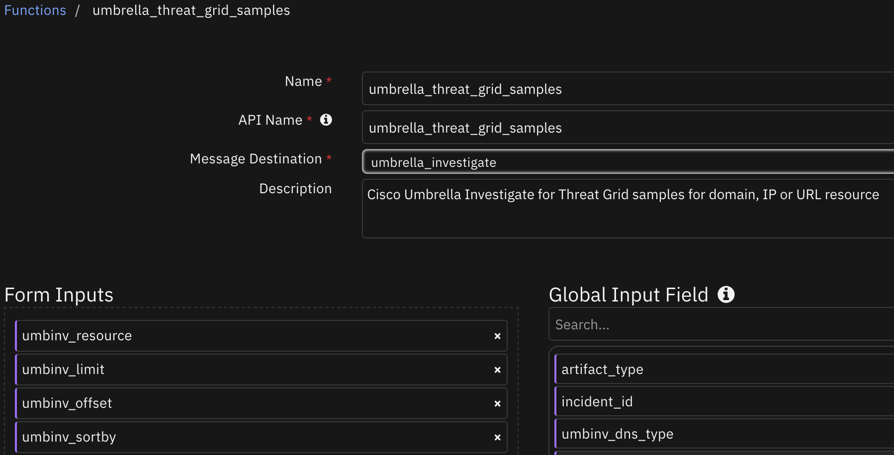

<details><summary>Inputs:</summary>
<p>

| Name | Type | Required | Example | Tooltip |
| ---- | :--: | :------: | ------- | ------- |
| `umbinv_limit` | `number` | No | `-` | Maximum number of results for endpoint |
| `umbinv_offset` | `number` | No | `-` | An offset value where there are a large number of returned values. |
| `umbinv_resource` | `text` | Yes | `-` | IP address, domain , URL, email_address, nameserver or AS number. |
| `umbinv_sortby` | `text` | No | `-` | Sort-by field for returned data. |

</p>
</details>

<details><summary>Outputs:</summary>
<p>

> **NOTE:** This example might be in JSON format, but `results` is a Python Dictionary on the SOAR platform.

```python
results = {
  "content": {
    "query_execution_time": "2024-11-19 09:38:00",
    "resource_name": "1.1.1.1",
    "thread_grid_samples": {
      "limit": 2,
      "moreDataAvailable": true,
      "offset": 0,
      "query": "1.1.1.1",
      "samples": [
        {
          "avresults": [
            {
              "product": "ALYac",
              "signature": "Trojan.GenericKD.31010556"
            },
            {
              "product": "BitDefender",
              "signature": "Trojan.GenericKD.31010556"
            },
            {
              "product": "CAT-QuickHeal",
              "signature": "Trojan.IGENERIC"
            },
            {
              "product": "CrowdStrike",
              "signature": "malicious_confidence_100% (D)"
            },
            {
              "product": "Cybereason",
              "signature": "malicious.a622e9"
            },
            {
              "product": "Cylance",
              "signature": "Unsafe"
            },
            {
              "product": "DrWeb",
              "signature": "Trojan.DownLoader19.14585"
            },
            {
              "product": "GData",
              "signature": "Trojan.GenericKD.31010556"
            },
            {
              "product": "Rising",
              "signature": "Backdoor.Boilod!8.529C (CLOUD)"
            },
          ],
          "firstSeen": null,
          "lastSeen": null,
          "magicType": "PE32 executable (GUI) Intel 80386 Mono/.Net assembly, for MS Windows",
          "md5": "86e788dc3e886821eb103c8b9115e9fb",
          "sha1": "166fbeea622e95bee0549274d8f70f42ca856cb1",
          "sha256": "08483c38fee1dff34d52c23143ac5c3c5f91e00ca6032d4f4e28d1defaa673bf",
          "size": 19908237,
          "threatScore": 100,
          "visible": true
        },
        {
          "avresults": [
            {
              "product": "ALYac",
              "signature": "Gen:Variant.Barys.11488"
            },
            {
              "product": "APEX",
              "signature": "Malicious"
            },
            {
              "product": "McAfee-GW-Edition",
              "signature": "BehavesLike.Win32.Generic.hc"
            },
            {
              "product": "eGambit",
              "signature": "Unsafe.AI_Score_99%"
            }
          ],
          "firstSeen": null,
          "lastSeen": null,
          "magicType": "PE32 executable (GUI) Intel 80386 Mono/.Net assembly, for MS Windows",
          "md5": "d90ef473ca59cb7355071318caa12949",
          "sha1": "f6224cef252aee32c881a2939ed6b85b043d4b52",
          "sha256": "230a07cb6383b97017bc41a846c52ec79c0c33208055e93c6ba9bdceedca4038",
          "size": 517120,
          "threatScore": 100,
          "visible": true
        }
      ],
      "totalResults": 10614
    }
  },
  "inputs": {
    "umbinv_limit": 2,
    "umbinv_offset": 0,
    "umbinv_resource": "1.1.1.1",
    "umbinv_sortby": "score"
  },
  "metrics": {
    "execution_time_ms": 7790,
    "host": "local",
    "package": "fn-cisco-umbrella-inv",
    "package_version": "1.1.0",
    "timestamp": "2024-11-19 09:38:00",
    "version": "1.0"
  },
  "raw": null,
  "reason": null,
  "success": true,
  "version": 2.0
}
```

</p>
</details>

<details><summary>Example Function Input Script:</summary>
<p>

```python
None
```

</p>
</details>

<details><summary>Example Function Post Process Script:</summary>
<p>

```python
results = playbook.functions.results.threatgrid_samples_results
content = results.get("content", {})
thread_grid_samples = content.get("thread_grid_samples", {})
resource_name = content.get("resource_name", None)
query_execution_time = content.get("query_execution_time", None)

if results.get("success", None):
  if thread_grid_samples and thread_grid_samples.get("totalResults", 0):
    if thread_grid_samples.get("samples", []):
      more_data_available = thread_grid_samples.get("moreDataAvailable", False)
      for s in thread_grid_samples.get("samples", []):
        newrow = incident.addRow("umbinv_thread_grid_samples_for_a_resource")
        newrow.resource_name = resource_name
        newrow.query_execution_time = query_execution_time
        newrow["magic_type"] = s.get("magicType", None)
        newrow["sha1"] = s.get("sha1", None)
        newrow["sha256"] = s.get("sha256", None)
        newrow["threat_score"] = s.get("threatScore", None)
        newrow["first_seen"] = s.get("firstSeen", None)
        newrow["last_seen"] = s.get("lastSeen", None)
        newrow["first_seen_converted"] = s.get("first_seen_converted", None)
        newrow["last_seen_converted"] = s.get("last_seen_converted", None)
        newrow["more_data_available"] = s.get("moreDataAvailable", None)
      if more_data_available and str(more_data_available).lower() == 'true':
        newrow.more_data_available = str(more_data_available)
  else:
    incident.addNote("Cisco Umbrella Inv playbook: ThreadGrid samples for a resource returned no results.")
else:
  incident.addNote(f"Cisco Umbrella Inv playbook: ThreadGrid samples for a resource\nFailed with reason: {results.get('reason', None)}")
```

</p>
</details>

---
## Function - umbrella_timeline
Cisco Umbrella Investigate for  Timeline

 

<details><summary>Inputs:</summary>
<p>

| Name | Type | Required | Example | Tooltip |
| ---- | :--: | :------: | ------- | ------- |
| `umbinv_resource` | `text` | Yes | `-` | IP address, domain , URL, email_address, nameserver or AS number. |

</p>
</details>

<details><summary>Outputs:</summary>
<p>

> **NOTE:** This example might be in JSON format, but `results` is a Python Dictionary on the SOAR platform.

```python
results = {
  "content": {
    "query_execution_time": "2024-11-19 09:38:32",
    "resource_name": "1.1.1.1",
    "timeline": [
      {
        "attacks": [],
        "categories": [],
        "threatTypes": [],
        "timestamp": 1505937036011,
        "timestamp_converted": "2017-09-20 15:50:36"
      },
      {
        "attacks": [],
        "categories": [
          "Malware"
        ],
        "threatTypes": [],
        "timestamp": 1505857405526,
        "timestamp_converted": "2017-09-19 17:43:25"
      },
      {
        "attacks": [],
        "categories": [],
        "threatTypes": [],
        "timestamp": 1497604646417,
        "timestamp_converted": "2017-06-16 05:17:26"
      }
    ]
  },
  "inputs": {
    "umbinv_resource": "1.1.1.1"
  },
  "metrics": {
    "execution_time_ms": 9264,
    "host": "local",
    "package": "fn-cisco-umbrella-inv",
    "package_version": "1.1.0",
    "timestamp": "2024-11-19 09:38:32",
    "version": "1.0"
  },
  "raw": null,
  "reason": null,
  "success": true,
  "version": 2.0
}
```

</p>
</details>

<details><summary>Example Function Input Script:</summary>
<p>

```python
None
```

</p>
</details>

<details><summary>Example Function Post Process Script:</summary>
<p>

```python
results = playbook.functions.results.timeline_result
content = results.get("content", {})
timeline = content.get("timeline", [])
resource_name  = content.get("resource_name", None)
query_execution_time = content.get("query_execution_time", None)

if results.get("success", None):
  if timeline:
    for result_timeline in timeline:
      newrow = incident.addRow('umbinv_timeline_for_a_resource')
      newrow.resource_name = resource_name
      newrow.query_execution_time = query_execution_time
      newrow.categories = str(result_timeline.get('categories', [])).replace("[", "").replace("]", "")
      newrow.attacks = str(result_timeline.get('attacks', [])).replace("[", "").replace("]", "")
      newrow.threat_types = str(result_timeline.get('threatTypes', [])).replace("[", "").replace("]", "")
      newrow.timestamp = str(result_timeline.get('timestamp', None))
      newrow.timestamp_converted = result_timeline.get('timestamp_converted', None)
  else:
    incident.addNote("Cisco Umbrella Inv playbook: Timeline for a resource returned no results.")
else:
  incident.addNote(f"Cisco Umbrella Inv playbook: Timeline for a resource\nFailed with reason: {results.get('reason', None)}")
```

</p>
</details>

---


## Playbooks
| Playbook Name | Description | Activation Type | Object | Status | Condition | 
| ------------- | ----------- | --------------- | ------ | ------ | --------- | 
| Cisco Umbrella Inv: AS Information for an ip address or ASN - Example (PB) | Cisco Umbrella Investigate playbook to get AS Information for an ip address or ASN | Manual | artifact | `enabled` | `artifact.type in ['IP Address', 'String']` | 
| Cisco Umbrella Inv: Categories for a domain - Example (PB) | Cisco Umbrella Investigate Playbook to get categories for a domain | Manual | artifact | `enabled` | `artifact.type equals DNS Name` | 
| Cisco Umbrella Inv: Classifiers for a domain - Example (PB) | Cisco Umbrella Investigate Playbook to get the Classifier's information for a domain. This playbook only works with the legacy version of Cisco Umbrella Investigate. | Manual | artifact | `enabled` | `artifact.type equals DNS Name` | 
| Cisco Umbrella Inv: Co-occurrences for a domain - Example (PB) | Cisco Umbrella Investigate Playbook to get list of co-occurrences for a domain | Manual | artifact | `enabled` | `artifact.type equals DNS Name` | 
| Cisco Umbrella Inv: DNS RR history for a domain - Example (PB) | Cisco Umbrella Investigate Playbook to get the DNS RR history for a domain of DNS type 'A'. This playbook only works with the legacy version of Cisco Umbrella Investigate. | Manual | artifact | `enabled` | `artifact.type equals DNS Name` | 
| Cisco Umbrella Inv: DNS RR history for an ip address - Example (PB) | Cisco Umbrella Investigate Playbook to get the DNS RR history for an IP address of DNS type 'A'. This playbook only works with the legacy version of Cisco Umbrella Investigate. | Manual | artifact | `enabled` | `artifact.type equals IP Address` | 
| Cisco Umbrella Inv: Domain volume - Example (PB) | Cisco Umbrella Investigate Playbook to get Domain volume for a domain | Manual | artifact | `enabled` | `artifact.type equals DNS Name` | 
| Cisco Umbrella Inv: Domain WHOIS information for a domain - Example (PB) | Cisco Umbrella Investigate Playbook to get WHOIS information for a domain | Manual | artifact | `enabled` | `artifact.type in ['DNS Name', 'Email Sender', 'Email Recipient']` | 
| Cisco Umbrella Inv: Get list of category identifiers - Example (PB) | Cisco Umbrella Investigate Playbook to get list of category identifiers. This playbook only works with the legacy version of Cisco Umbrella Investigate. | Manual | incident | `enabled` | `-` | 
| Cisco Umbrella Inv: Latest Malicious Domains for an ip address - Example (PB) | Cisco Umbrella Investigate Playbook to get the Latest Malicious Domains for an IP address. This playbook only works with the legacy version of Cisco Umbrella Investigate. | Manual | artifact | `enabled` | `artifact.type equals IP Address` | 
| Cisco Umbrella Inv: Pattern search start epoch - Example (PB) | Cisco Umbrella Investigate Playbook to search using a Regular expression against the Investigate database using start epoch value | Manual | artifact | `enabled` | `artifact.type equals String` | 
| Cisco Umbrella Inv: Related Domains for a Domain - Example (PB) | Cisco Umbrella Investigate Playbook to get the latest domains for a domain | Manual | artifact | `enabled` | `artifact.type equals DNS Name` | 
| Cisco Umbrella Inv: Security information for a domain - Example (PB) | Cisco Umbrella Investigate Playbook to get the security information for a domain | Manual | artifact | `enabled` | `artifact.type equals DNS Name` | 
| Cisco Umbrella Inv: ThreadGrid sample information for a hash - Example (PB) | Cisco Umbrella Investigate Playbook to get the ThreatGrid sample information for a hash | Manual | artifact | `enabled` | `artifact.type in ['Malware MD5 Hash', 'Malware SHA-1 Hash', 'Malware SHA-256 Hash']` | 
| Cisco Umbrella Inv: ThreadGrid samples for a resource - Example (PB) | Cisco Umbrella Investigate Playbook to get the ThreatGrid samples for a domain, IP or URL | Manual | artifact | `enabled` | `artifact.type in ['IP Address', 'DNS Name', 'URL']` | 
| Cisco Umbrella Inv: Timeline for a resource - Example (PB) | Cisco Umbrella Investigate Playbook to get the Timeline information for domain, IP or URL | Manual | artifact | `enabled` | `artifact.type in ['IP Address', 'DNS Name', 'URL']` | 

---

## Custom Layouts
* Import the Data Tables and Custom Fields like the screenshot below:

  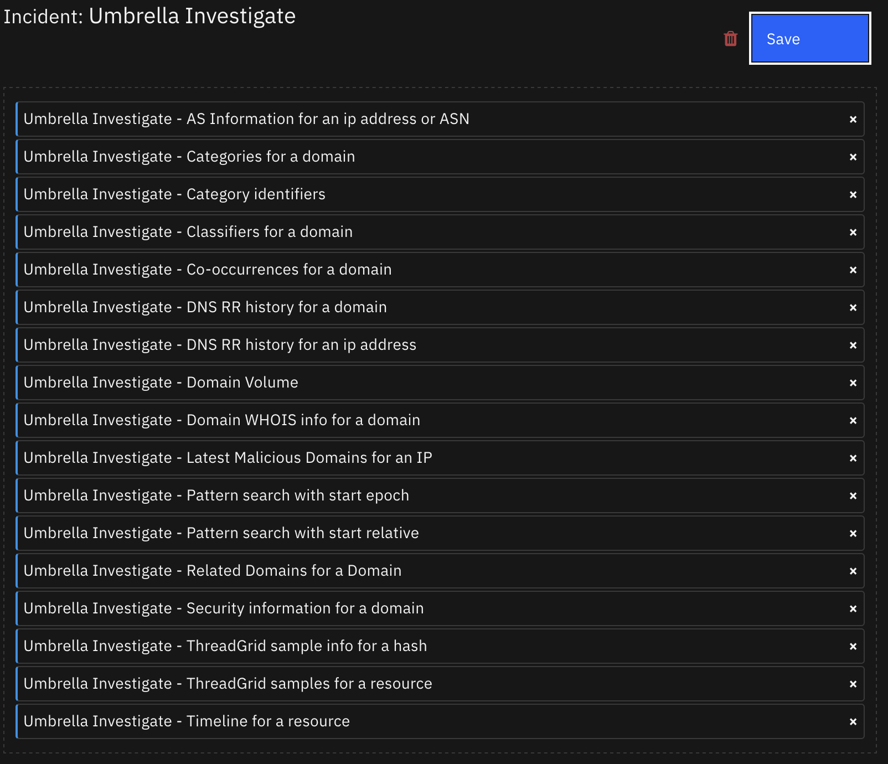


## Data Table - Umbrella Investigate - AS Information for an ip address or ASN

 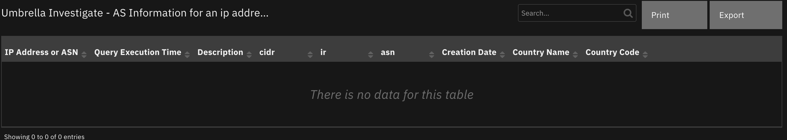

#### API Name:
umbinv_as_for_an_ip_or_asn

#### Columns:
| Column Name | API Access Name | Type | Tooltip |
| ----------- | --------------- | ---- | ------- |
| asn | `asn` | `text` | - |
| cidr | `cidr` | `text` | - |
| Country Code | `country_code` | `text` | - |
| Country Name | `country_name` | `text` | - |
| Creation Date | `creation_date` | `text` | - |
| Description | `description_as` | `text` | - |
| IP Address or ASN | `ip_address_or_asn` | `text` | - |
| ir | `ir` | `text` | - |
| Query Execution Time | `query_execution_time` | `text` | - |

---
## Data Table - Umbrella Investigate - Categories for a domain

 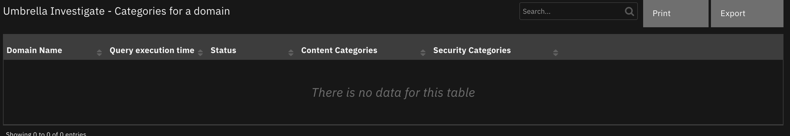

#### API Name:
umbinv_categories_for_a_domain

#### Columns:
| Column Name | API Access Name | Type | Tooltip |
| ----------- | --------------- | ---- | ------- |
| Content Categories | `content_categories` | `text` | - |
| Domain Name | `domain_name` | `text` | - |
| Query execution time | `query_execution_time` | `text` | - |
| Security Categories | `security_categories` | `text` | - |
| Status | `status` | `text` | - |

---
## Data Table - Umbrella Investigate - Category identifiers

 

#### API Name:
umbinv_category_identifiers

#### Columns:
| Column Name | API Access Name | Type | Tooltip |
| ----------- | --------------- | ---- | ------- |
| Category Description | `category_desc` | `text` | - |
| Category Id | `category_id` | `number` | - |
| Query execution time | `query_execution_time` | `text` | - |

---
## Data Table - Umbrella Investigate - Classifiers for a domain

 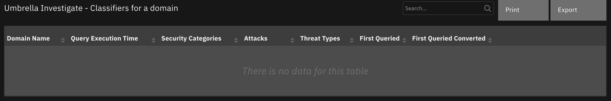

#### API Name:
umbinv_classifiers_for_a_domain

#### Columns:
| Column Name | API Access Name | Type | Tooltip |
| ----------- | --------------- | ---- | ------- |
| Attacks | `attacks` | `text` | - |
| Domain Name | `domain_name` | `text` | - |
| First Queried | `first_queried` | `text` | - |
| First Queried Converted | `first_queried_converted` | `text` | - |
| Query Execution Time | `query_execution_time` | `text` | - |
| Security Categories | `security_categories` | `text` | - |
| Threat Types | `threat_types` | `text` | - |

---
## Data Table - Umbrella Investigate - Co-occurrences for a domain

 

#### API Name:
umbinv_domain_co_occurrences

#### Columns:
| Column Name | API Access Name | Type | Tooltip |
| ----------- | --------------- | ---- | ------- |
| Co-occurence | `co_occurence` | `text` | - |
| Domain Name | `domain_name` | `text` | - |
| Query execution time | `query_execution_time` | `text` | - |
| score | `score` | `text` | - |

---
## Data Table - Umbrella Investigate - DNS RR history for a domain

 

#### API Name:
umbinv_dns_rr_history_domain

#### Columns:
| Column Name | API Access Name | Type | Tooltip |
| ----------- | --------------- | ---- | ------- |
| Age | `age` | `text` | - |
| Base Domain | `base_domain` | `text` | - |
| Class | `class` | `text` | - |
| Cname | `cname` | `text` | - |
| Country Codes | `country_codes` | `text` | - |
| Country Count | `country_count` | `text` | - |
| Domain Name | `domain_name` | `text` | - |
| First Seen | `first_seen` | `text` | - |
| Is Subdomain | `is_subdomain` | `text` | - |
| Last Seen | `last_seen` | `text` | - |
| Mail Exchanger | `mail_exchanger` | `text` | - |
| Name | `name_rrs` | `text` | - |
| Prefixes | `prefixes` | `text` | - |
| Query execution time | `query_execution_time` | `text` | - |
| Response Type | `response_type` | `text` | - |
| Rips | `rips` | `text` | - |
| Rips Stability | `rips_stability` | `text` | - |
| RR | `rr` | `text` | - |
| TTL | `ttl` | `text` | - |
| Type | `type` | `text` | - |

---
## Data Table - Umbrella Investigate - DNS RR history for an ip address

 

#### API Name:
umbinv_dns_rr_history_ip

#### Columns:
| Column Name | API Access Name | Type | Tooltip |
| ----------- | --------------- | ---- | ------- |
| Class | `class` | `text` | - |
| Div Ld2 | `div_ld2` | `text` | - |
| Div ld2_1 | `div_ld2_1` | `text` | - |
| Div ld2_2 | `div_ld2_2` | `text` | - |
| Div Ld3 | `div_ld3` | `text` | - |
| IP Address | `ip_address` | `text` | - |
| L2_1 count | `ld2_1_count` | `text` | - |
| Ld2 count | `ld2_count` | `text` | - |
| Ld2_2 count | `ld2_2_count` | `text` | - |
| Ld3 count | `ld3_count` | `text` | - |
| Name | `name_rrs` | `text` | - |
| Query execution time | `query_execution_time` | `text` | - |
| Response Class | `response_class` | `text` | - |
| RR | `rr` | `text` | - |
| RR Count | `rr_count` | `text` | - |
| TTL | `ttl` | `text` | - |
| Type | `type` | `text` | - |

---
## Data Table - Umbrella Investigate - Domain Volume

 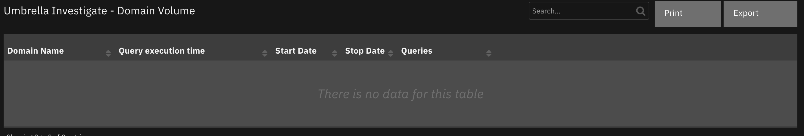

#### API Name:
umbinv_domain_volume

#### Columns:
| Column Name | API Access Name | Type | Tooltip |
| ----------- | --------------- | ---- | ------- |
| Domain Name | `domain_name` | `text` | - |
| Queries | `queries` | `text` | - |
| Query execution time | `query_execution_time` | `text` | - |
| Start Date | `start_date_dv` | `text` | - |
| Stop Date | `stop_date_dv` | `text` | - |

---
## Data Table - Umbrella Investigate - Domain WHOIS info for a domain

 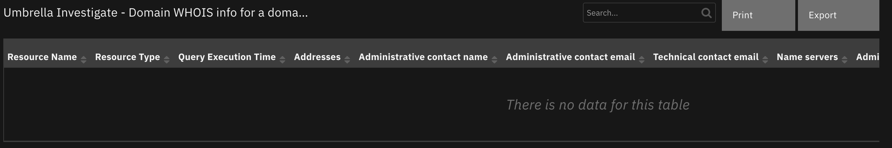

#### API Name:
umbinv_domain_whois_info_domain

#### Columns:
| Column Name | API Access Name | Type | Tooltip |
| ----------- | --------------- | ---- | ------- |
| Addresses | `addresses` | `text` | - |
| Administrative contact city | `administrative_contact_city` | `text` | - |
| Administrative contact email | `administrative_contact_email` | `text` | - |
| Administrative contact name | `administrative_contact_name` | `text` | - |
| administrative_Contact_Organization | `administrative_contact_organization` | `text` | - |
| Name servers | `name_servers` | `text` | - |
| Query Execution Time | `query_execution_time` | `text` | - |
| Resource Name | `resource_name` | `text` | - |
| Resource Type | `resource_type` | `text` | - |
| Technical contact email | `technical_contact_email` | `text` | - |

---
## Data Table - Umbrella Investigate - Latest Malicious Domains for an IP

 

#### API Name:
umbinv_latest_malicious_domains_for_an_ip

#### Columns:
| Column Name | API Access Name | Type | Tooltip |
| ----------- | --------------- | ---- | ------- |
| IP Address | `ip_address` | `text` | - |
| Latest Malicious Domains | `latest_malicious_domains` | `text` | - |
| Query Execution Time | `query_execution_time` | `text` | - |

---
## Data Table - Umbrella Investigate - Pattern search with start epoch

 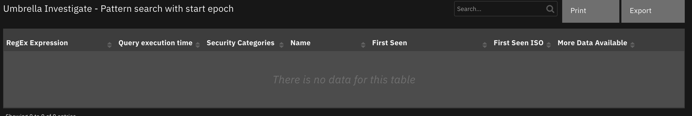

#### API Name:
umbinv_pattern_search_start_epoch

#### Columns:
| Column Name | API Access Name | Type | Tooltip |
| ----------- | --------------- | ---- | ------- |
| First Seen | `first_seen` | `text` | - |
| First Seen ISO | `first_seen_iso` | `text` | - |
| More Data Available | `more_data_available` | `text` | - |
| Name | `name_match` | `text` | - |
| Query execution time | `query_execution_time` | `text` | - |
| RegEx Expression | `regex_expression` | `text` | - |
| Security Categories | `security_categories` | `text` | - |

---
## Data Table - Umbrella Investigate - Pattern search with start relative

 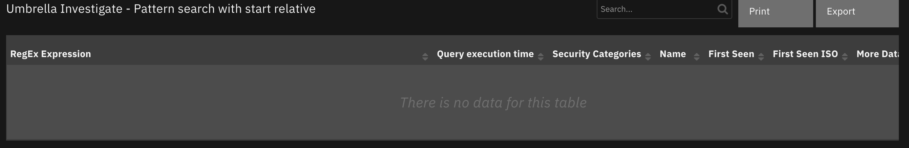

#### API Name:
umbinv_pattern_search_start_relative

#### Columns:
| Column Name | API Access Name | Type | Tooltip |
| ----------- | --------------- | ---- | ------- |
| First Seen | `first_seen` | `text` | - |
| First Seen ISO | `first_seen_iso` | `text` | - |
| More Data Available | `more_data_available` | `text` | - |
| Name | `name_match` | `text` | - |
| Query execution time | `query_execution_time` | `text` | - |
| RegEx Expression | `regex_expression` | `text` | - |
| Security Categories | `security_categories` | `text` | - |

---
## Data Table - Umbrella Investigate - Related Domains for a Domain

 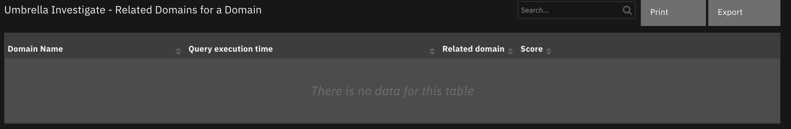

#### API Name:
umbinv_related_domains_for_a_domain

#### Columns:
| Column Name | API Access Name | Type | Tooltip |
| ----------- | --------------- | ---- | ------- |
| Domain Name | `domain_name` | `text` | - |
| Query execution time | `query_execution_time` | `text` | - |
| Related domain | `related_domain` | `text` | - |
| Score | `score` | `text` | - |

---
## Data Table - Umbrella Investigate - Security information for a domain

 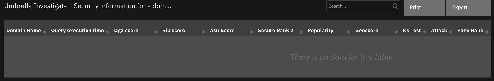

#### API Name:
umbinv_domain_security_info

#### Columns:
| Column Name | API Access Name | Type | Tooltip |
| ----------- | --------------- | ---- | ------- |
| Asn Score | `asn_score` | `text` | - |
| Attack | `attack` | `text` | - |
| Dga score | `dga_score` | `text` | - |
| Domain Name | `domain_name` | `text` | - |
| Entropy | `entropy` | `text` | - |
| Fast Flux | `fastflux` | `text` | - |
| Geoscore | `geoscore` | `text` | - |
| Ks Test | `ks_test` | `text` | - |
| Page Rank | `pagerank` | `text` | - |
| Perplexity | `perplexity` | `text` | - |
| Popularity | `popularity` | `text` | - |
| Prefix Score | `prefix_score` | `text` | - |
| Query execution time | `query_execution_time` | `text` | - |
| Rip score | `rip_score` | `text` | - |
| Secure Rank 2 | `securerank2` | `text` | - |
| Threat Type | `threat_type` | `text` | - |

---
## Data Table - Umbrella Investigate - ThreadGrid sample info for a hash

 

#### API Name:
umbinv_thread_grid_sample_info_for_a_hash_basic

#### Columns:
| Column Name | API Access Name | Type | Tooltip |
| ----------- | --------------- | ---- | ------- |
| First seen | `first_seen` | `text` | - |
| Hash value | `hash` | `text` | - |
| Last seen | `last_seen` | `text` | - |
| Magic type | `magic_type` | `text` | - |
| md5 | `md5` | `text` | - |
| Number of behaviors | `num_behaviors` | `text` | - |
| Number of connections | `num_connections` | `text` | - |
| Number of Samples | `num_samples` | `text` | - |
| Query execution time | `query_execution_time` | `text` | - |
| sha1 | `sha1` | `text` | - |
| size | `size` | `text` | - |
| Threat score | `threat_score` | `text` | - |

---
## Data Table - Umbrella Investigate - ThreadGrid samples for a resource

 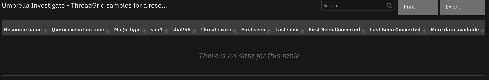

#### API Name:
umbinv_thread_grid_samples_for_a_resource

#### Columns:
| Column Name | API Access Name | Type | Tooltip |
| ----------- | --------------- | ---- | ------- |
| First seen | `first_seen` | `text` | - |
| First Seen Converted | `first_seen_converted` | `text` | - |
| Last seen | `last_seen` | `text` | - |
| Last Seen Converted | `last_seen_converted` | `text` | - |
| Magic type | `magic_type` | `text` | - |
| More data available | `more_data_available` | `text` | - |
| Query execution time | `query_execution_time` | `text` | - |
| Resource name | `resource_name` | `text` | - |
| sha1 | `sha1` | `text` | - |
| sha256 | `sha256` | `text` | - |
| Threat score | `threat_score` | `text` | - |

---
## Data Table - Umbrella Investigate - Timeline for a resource

 

#### API Name:
umbinv_timeline_for_a_resource

#### Columns:
| Column Name | API Access Name | Type | Tooltip |
| ----------- | --------------- | ---- | ------- |
| Attacks | `attacks` | `text` | - |
| Categories | `categories` | `text` | - |
| Query execution time | `query_execution_time` | `text` | - |
| Resource Name | `resource_name` | `text` | - |
| Threat Types | `threat_types` | `text` | - |
| Timestamp | `timestamp` | `text` | - |
| Timestamp(Converted) | `timestamp_converted` | `text` | - |

---

## Troubleshooting & Support
Refer to the documentation listed in the Requirements section for troubleshooting information.

### For Support
This is a IBM supported App. For assistance, see [https://ibm.com/mysupport](https://ibm.com/mysupport).
