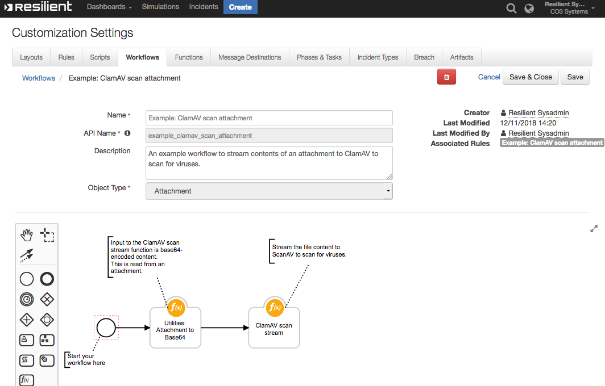
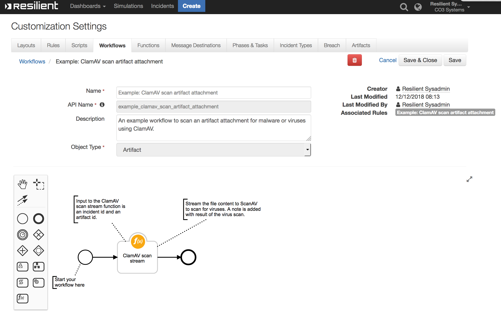

# Resilient Integration with ClamAV
This package contains a single function which uses [ClamAV](http://www.clamav.net/) to scan a file or attachment for viruses and returns the
results of the scan.

#### Function
- clamav_scan_stream

Also included in the package are two example workflows and two exmple rules:

####Workflows
- Example: ClamAV scan attachment


- Example: ClamAV scan artifact attachment



Both workflows create a task or incident note containing the status of the ClamAV malware scan.


#### Rules

| Rule Name | Object Type | Workflow Triggered |
| --------- | :---------: | ------------------ |
| Example: ClamAV scan attachment | `Attachment` | `Example: ClamAV scan attachment` |
| Example: ClamAV scan artifact attachment | `Artifact` | `Example: ClamAV scan artifact attachment` |

## Package Dependences
- resilient_circuits version 30 or later
- Python package [pyclamd](https://xael.org/pages/pyclamd-en.html) >=0.4.0
 ## Installation
1) Install Python pyclamd package:
    ```
	$ pip install pyclamd
    ```
2) Install fn_clamav in "development mode":
    ```
	$ pip install -e  ./fn_clamav/
    ```
   or the distribution file can be installed using:

    ```
	$ pip install fn_clamav-<version>.tar.gz
	```

## Setup

To configure the fn_clamav configuration parameters, run `resilient-circuits config [-u | -c]`.
Then edit the [fn_clamav] section in the app.config file to define the parameters for ClamAV server connectivity:

```
[fn_clamav]
# hostname or ip address of Clamav server
host=localhost
# The TCP port Clamav listens on
port=3310
# Define socket timeout
timeout=500
```
## Customize
To install function definition, message destination, sample workflows, and rules to the Resilient server:

	$ resilient-circuits customize

This package includes the followings customizations:

	Functions:
		- clamav_scan_stream

	Sample Workflows that demostrate how to use fn_clamav:
		- Example: ClamAV scan attachment
		- Example: ClamAV scan artifact attachment

	Sample rules that call the sample Workflows

## Start
To start this function:

	$ resilient-circuits run


## Uninstall
To uninstall this function:

	$ pip uninstall fn_clamav


## Function Inputs:
| Function Name | Type | Required | Example | Info |
| ------------- | :--: | :-------:| ------- | ---- |
| `incident_id` | `Number` | Yes | `2095` | Resilient incident id |
| `attachment_id` | `Number` | No | `25` | Resilient attachment id |
| `task_id` | `Number` | No | `2251251` | Resilient task id |
| `artifact_id` | `Number` | No | `10` | Resilient artifact id |

## Function Output:
```python

# Virus found incident attachment
{ "inputs_params": {"incident_id": 2095, "attachment_id": 3, "artifact_id": null, "task_id": null},
  "response": {"stream": ["FOUND", "Eicar-Test-Signature"]},
  "file_name": "eicar.txt"
}
# Virus found task attachment
{ "inputs_params": {"incident_id": 2095, "attachment_id": 25, "artifact_id": null, "task_id": 2251251},
  "response": {"stream": ["FOUND", "Eicar-Test-Signature"]},
  "file_name": "eicar.txt"
}

# Virus found artifact attachment
{ "inputs_params": {"incident_id": 2095, "attachment_id": null, "artifact_id": 10, "task_id": null},
  "response": {"stream": ["FOUND", "Eicar-Test-Signature"]},
  "file_name": "eicar.txt"
}
```

## Pre-Process Script:
This example sets the inputs for incident or task attachment to run the ClamAV scan.
```python
# Required inputs are: the incident id and attachment id
inputs.incident_id = incident.id
inputs.attachment_id = attachment.id

# If this is a "task attachment" then we will additionally have a task-id
if task is not None:
  inputs.task_id = task.id
```

## Post-Process Script:
This example for incident or task attachment **adds a Note to an Incident**.
```python
##  CLAMAV - clamav_scan_stream script ##
# Example results:
"""
# Virus found incident attachment
Result:    { "inputs_params": {"incident_id": 2095, "attachment_id": 3, "artifact_id": null, "task_id": null},
             "response": {"stream": ["FOUND", "Eicar-Test-Signature"]},
             "file_name": "eicar.txt"
}
# Virus found task attachment
Result:    { "inputs_params": {"incident_id": 2095, "attachment_id": 25, "artifact_id": null, "task_id": 2251251},
             "response": {"stream": ["FOUND", "Eicar-Test-Signature"]},
             "file_name": "eicar.txt"
}

# Virus found artifact attachment
Result:    { "inputs_params": {"incident_id": 2095, "attachment_id": null, "artifact_id": 10, "task_id": null},
             "response": {"stream": ["FOUND", "Eicar-Test-Signature"]},
             "file_name": "eicar.txt"
}
# No malware or  detected
Result:    { "inputs_params": {"incident_id": 2095, "attachment_id": 3, "artifact_id": null, "task_id": null}
             "response": {"stream": ["OK", '']},
             "file_name": "test.txt",
           }

# Got an error
Result:    { "inputs_params": {"incident_id": 2095, "attachment_id": 3, "artifact_id": null, "task_id": null
             "response": {"stream": ["ERROR", '<reason>']},
             "file_name": "test.txt",
           }
"""
# Processing

color = "#45bc27"

response = results.response
file_name = results.file_name
inputs_params = results.inputs_params

if response is not None and response.stream[0] != "ERROR":
    if response.stream[0] == "FOUND":
        color = "#ff402b"

    if inputs_params.incident_id is not None and inputs_params.artifact_id is not None:
        noteText = u"""<br>ClamAV scan complete
                        <br><b>Incident ID:</b></br> '{0}'
                        <br><b>Artifact ID:</b></br> '{1}'
                        <br><b>Attachment Name:</b></br> '{2}'
                        <br><b>Scan Status:</b> <b style="color: {3}">{4}</b></br>""".format(inputs_params.incident_id,
                                                                                    inputs_params.artifact_id,
                                                                                    file_name, color, response.stream[1])
    elif inputs_params.attachment_id is not None:
        if inputs_params.task_id is not None:
            noteText = u"""<br>ClamAV scan complete
                          <br><b>Task ID:</b></br> '{0}'
                          <br><b>Attachment ID:</b></br> '{1}'
                          <br><b>Attachment Name:</b></br> '{2}'
                          <br><b>Scan Status:</b> <b style="color: {3}">{4}</b></br>""".format(inputs_params.task_id,
                                                                                      inputs_params.attachment_id,
                                                                                      file_name, color, response.stream[1])
        elif inputs_params.incident_id is not None:
            noteText = u"""<br>ClamAV scan complete
                          <br><b>Incident ID:</b></br> '{0}'
                          <br><b>Attachment ID:</b></br>'{1}'
                          <br><b>Attachment Name:</b></br> '{2}'
                          <br><b>Scan Status:</b> <b style="color: {3}">{4}</b></br>""".format(inputs_params.incident_id,
                                                                                      inputs_params.attachment_id,
                                                                                      file_name, color, response.stream[1])
    if inputs_params.task_id is not None:
        task.addNote(helper.createRichText(noteText))
    else:
        incident.addNote(helper.createRichText(noteText))
```