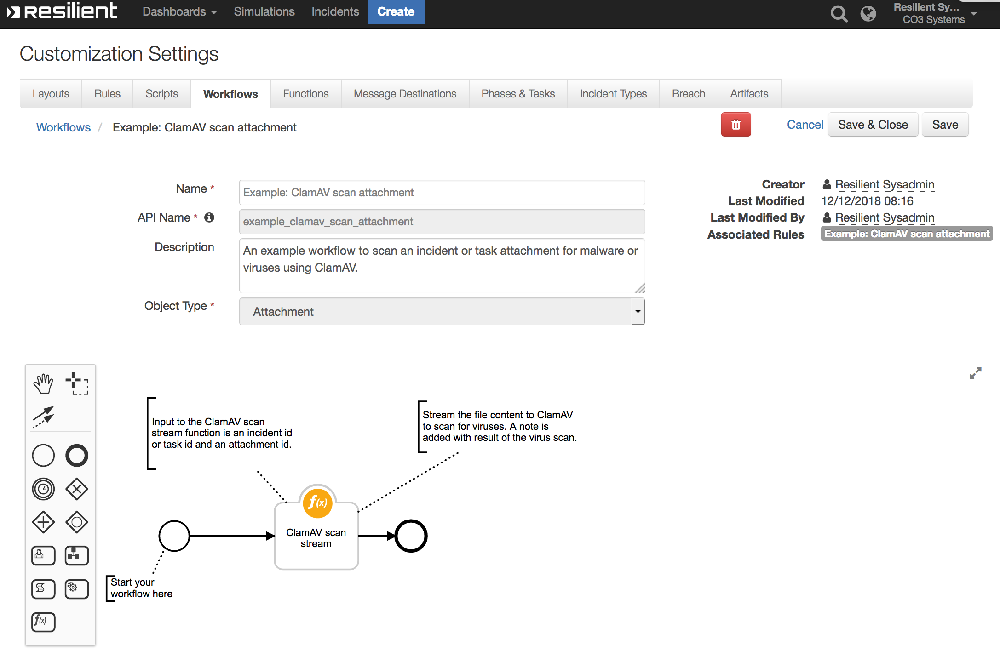

<!--
  This README.md is generated by running:
  "resilient-sdk docgen -p fn_clamav"

  It is best edited using a Text Editor with a Markdown Previewer. VS Code
  is a good example. Checkout https://guides.github.com/features/mastering-markdown/
  for tips on writing with Markdown

  If you make manual edits and run docgen again, a .bak file will be created

  Store any screenshots in the "doc/screenshots" directory and reference them like:
  

  NOTE: If your app is available in the container-format only, there is no need to mention the integration server in this readme.
-->

# fn_clamav

## Table of Contents
- [Release Notes](#release-notes)
- [Overview](#overview)
  - [Key Features](#key-features)
- [Requirements](#requirements)
  - [Resilient platform](#resilient-platform)
  - [Cloud Pak for Security](#cloud-pak-for-security)
  - [Proxy Server](#proxy-server)
  - [Python Environment](#python-environment)
- [Installation](#installation)
  - [Install](#install)
  - [App Configuration](#app-configuration)
- [Function - ClamAV scan stream](#function---clamav-scan-stream)
- [Rules](#rules)
- [Troubleshooting & Support](#troubleshooting--support)
---

## Release Notes
<!--
  Specify all changes in this release. Do not remove the release 
  notes of a previous release
-->
| Version | Date | Notes |
| ------- | ---- | ----- |
| 1.1.0 | 09/2021 | Convert to App Host|
| 1.0.0 | 12/2018 | Initial Release |

---

## Overview
<!--
  Provide a high-level description of the function itself and its remote software or application.
  The text below is parsed from the "description" and "long_description" attributes in the setup.py file
-->
This package contains a single function which uses [ClamAV](http://www.clamav.net/) to scan a file or attachment for viruses and returns the
results of the scan
**Resilient Circuits Components for 'fn_clamav'**
Resilient Circuits Components for 'fn_clamav'

* Example: ClamAV scan attachment



* Example: ClamAV scan artifact attachment


### Key Features
<!--
  List the Key Features of the Integration
-->
* Both workflows create a task or incident note containing the status of the ClamAV malware scan.

---

## Requirements
<!--
  List any Requirements 
-->
* resilient_circuits version 30 or later
* Python package [pyclamd](https://xael.org/pages/pyclamd-en.html) >=0.4.

This app supports the IBM Resilient SOAR Platform and the IBM Cloud Pak for Security.

### Resilient platform
The Resilient platform supports two app deployment mechanisms, App Host and integration server.

If deploying to a Resilient platform with an App Host, the requirements are:
* Resilient platform >= `41.0.6783`.
* The app is in a container-based format (available from the AppExchange as a `zip` file).

If deploying to a Resilient platform with an integration server, the requirements are:
* Resilient platform >= `41.0.6783`.
* The app is in the older integration format (available from the AppExchange as a `zip` file which contains a `tar.gz` file).
* Integration server is running `resilient_circuits>=30.0.0`.
* If using an API key account, make sure the account provides the following minimum permissions: 
  | Name | Permissions |
  | ---- | ----------- |
  | Org Data | Read |
  | Function | Read |

The following Resilient platform guides provide additional information: 
* _App Host Deployment Guide_: provides installation, configuration, and troubleshooting information, including proxy server settings. 
* _Integration Server Guide_: provides installation, configuration, and troubleshooting information, including proxy server settings.
* _System Administrator Guide_: provides the procedure to install, configure and deploy apps. 

The above guides are available on the IBM Knowledge Center at [ibm.biz/resilient-docs](https://ibm.biz/resilient-docs). On this web page, select your Resilient platform version. On the follow-on page, you can find the _App Host Deployment Guide_ or _Integration Server Guide_ by expanding **Resilient Apps** in the Table of Contents pane. The System Administrator Guide is available by expanding **System Administrator**.

### Cloud Pak for Security
If you are deploying to IBM Cloud Pak for Security, the requirements are:
* IBM Cloud Pak for Security >= 1.4.
* Cloud Pak is configured with an App Host.
* The app is in a container-based format (available from the AppExchange as a `zip` file).

The following Cloud Pak guides provide additional information: 
* _App Host Deployment Guide_: provides installation, configuration, and troubleshooting information, including proxy server settings. From the Table of Contents, select Case Management and Orchestration & Automation > **Orchestration and Automation Apps**.
* _System Administrator Guide_: provides information to install, configure, and deploy apps. From the IBM Cloud Pak for Security Knowledge Center table of contents, select Case Management and Orchestration & Automation > **System administrator**.

These guides are available on the IBM Knowledge Center at [ibm.biz/cp4s-docs](https://ibm.biz/cp4s-docs). From this web page, select your IBM Cloud Pak for Security version. From the version-specific Knowledge Center page, select Case Management and Orchestration & Automation.

### Proxy Server
The app **does/does not** support a proxy server.

### Python Environment
Both Python 2.7 and Python 3.6 are supported.
Additional package dependencies may exist for each of these packages:
* pyclamd >= 0.4.0
* resilient_circuits>=30.0.0

---

## Installation

### Install
* To install or uninstall an App or Integration on the _Resilient platform_, see the documentation at [ibm.biz/resilient-docs](https://ibm.biz/resilient-docs).
* To install or uninstall an App on _IBM Cloud Pak for Security_, see the documentation at [ibm.biz/cp4s-docs](https://ibm.biz/cp4s-docs) and follow the instructions above to navigate to Orchestration and Automation.

### App Configuration
The following table provides the settings you need to configure the app. These settings are made in the app.config file. See the documentation discussed in the Requirements section for the procedure.

| Config | Required | Example | Description |
| ------ | :------: | ------- | ----------- |
| **host** | Yes | `localhost` | *Enter a description of the config here.* |
| **port** | Yes | `3310` | *Enter a description of the config here.* |
| **timeout** | Yes | `500` | *Enter a description of the config here.* |


---

## Function - ClamAV scan stream
Function to send the contents of an attachment as a data-stream to a ClamAV server instance, to scan for malware or viruses.

 

<details><summary>Inputs:</summary>
<p>

| Name | Type | Required | Example | Tooltip |
| ---- | :--: | :------: | ------- | ------- |
| `artifact_id` | `number` | No | `-` | - |
| `attachment_id` | `number` | No | `-` | - |
| `incident_id` | `number` | Yes | `-` | - |
| `task_id` | `number` | No | `-` | - |

</p>
</details>

<details><summary>Outputs:</summary>
<p>

```python
results = {
    # TODO: Copy and paste an example of the Function Output within this code block.
    # To view the output of a Function, run resilient-circuits in DEBUG mode and invoke the Function. 
    # The Function results will be printed in the logs: "resilient-circuits run --loglevel=DEBUG"
}
```

</p>
</details>

<details><summary>Example Pre-Process Script:</summary>
<p>

```python
# Required inputs are: the incident id and artifact id
inputs.incident_id = incident.id
inputs.artifact_id = artifact.id

```

</p>
</details>

<details><summary>Example Post-Process Script:</summary>
<p>

```python
##  CLAMAV - clamav_scan_stream script ##
# Example results:
"""
# Virus found incident attachment
Result:    { "inputs": {"incident_id": 2095, "attachment_id": 3, "artifact_id": null, "task_id": null},
             "response": {"stream": ["FOUND", "Eicar-Test-Signature"]},
             "file_name": "eicar.txt"
}
# Virus found task attachment
Result:    { "inputs": {"incident_id": 2095, "attachment_id": 25, "artifact_id": null, "task_id": 2251251},
             "response": {"stream": ["FOUND", "Eicar-Test-Signature"]},
             "file_name": "eicar.txt"
}

# Virus found artifact attachment
Result:    { "inputs": {"incident_id": 2095, "attachment_id": null, "artifact_id": 10, "task_id": null},
             "response": {"stream": ["FOUND", "Eicar-Test-Signature"]},
             "file_name": "eicar.txt"
}
# No malware or  detected
Result:    { "inputs": {"incident_id": 2095, "attachment_id": 3, "artifact_id": null, "task_id": null}
             "response": {"stream": ["OK", '']},
             "file_name": "test.txt",
           }

# Got an error
Result:    { "inputs": {"incident_id": 2095, "attachment_id": 3, "artifact_id": null, "task_id": null
             "response": {"stream": ["ERROR", '<reason>']},
             "file_name": "test.txt",
           }
"""
# Processing

color = "#45bc27"

response = results.response
file_name = results.file_name
inputs = results.inputs

if response is not None and response.stream[0] != "ERROR":
    if response.stream[0] == "FOUND":
        color = "#ff402b"

    if inputs.incident_id is not None and inputs.artifact_id is not None:
        noteText = u"""<br>ClamAV scan complete          
                        <br><b>Incident ID:</b></br> '{0}'
                        <br><b>Artifact ID:</b></br> '{1}'
                        <br><b>Attachment Name:</b></br> '{2}'
                        <br><b>Scan Status:</b> <b style="color: {3}">{4}</b></br>""".format(inputs.incident_id,
                                                                                    inputs.artifact_id,
                                                                                    file_name, color, response.stream[1])
    elif inputs.attachment_id is not None:
        if inputs.task_id is not None:
            noteText = u"""<br>ClamAV scan complete           
                          <br><b>Task ID:</b></br> '{0}'
                          <br><b>Attachment ID:</b></br> '{1}'
                          <br><b>Attachment Name:</b></br> '{2}'
                          <br><b>Scan Status:</b> <b style="color: {3}">{4}</b></br>""".format(inputs.task_id,
                                                                                      inputs.attachment_id,
                                                                                      file_name, color, response.stream[1])
        elif inputs.incident_id is not None:
            noteText = u"""<br>ClamAV scan complete          
                          <br><b>Incident ID:</b></br> '{0}'
                          <br><b>Attachment ID:</b></br>'{1}'
                          <br><b>Attachment Name:</b></br> '{2}'
                          <br><b>Scan Status:</b> <b style="color: {3}">{4}</b></br>""".format(inputs.incident_id,
                                                                                      inputs.attachment_id,
                                                                                      file_name, color, response.stream[1])
    if inputs.task_id is not None:
        task.addNote(helper.createRichText(noteText))
    else:
        incident.addNote(helper.createRichText(noteText))
```

</p>
</details>

---


## Rules
| Rule Name | Object | Workflow Triggered |
| --------- | ------ | ------------------ |
| Example: ClamAV scan attachment | attachment | `example_clamav_scan_attachment` |
| Example: ClamAV scan artifact attachment | artifact | `example_clamav_scan_artifact_attachment` |

---

## Troubleshooting & Support
Refer to the documentation listed in the Requirements section for troubleshooting information.

### For Support
This is a IBM Community provided App. Please search the Community https://ibm.biz/resilientcommunity for assistance.
