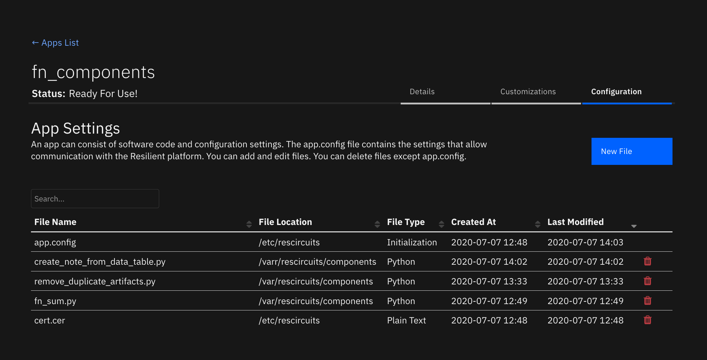
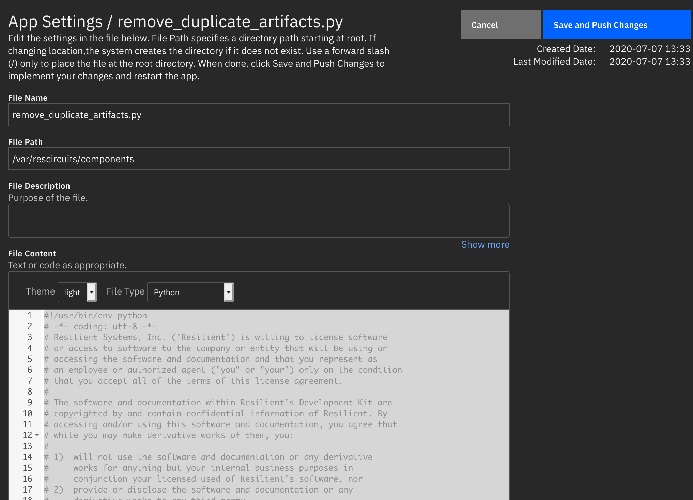
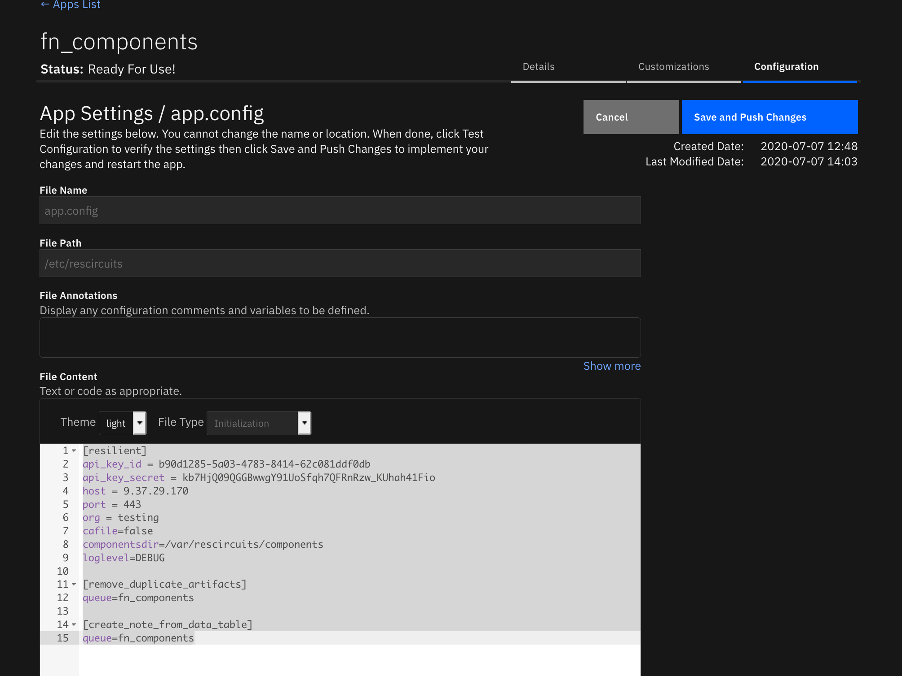
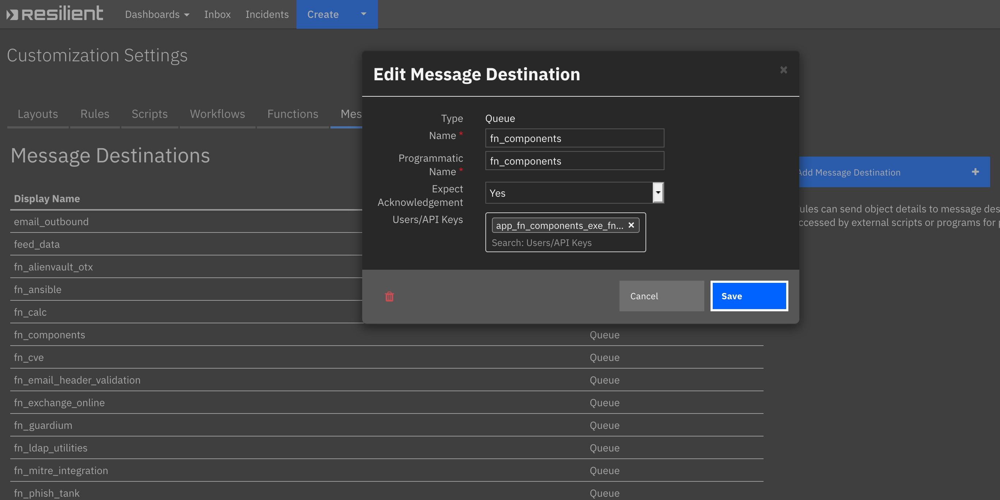
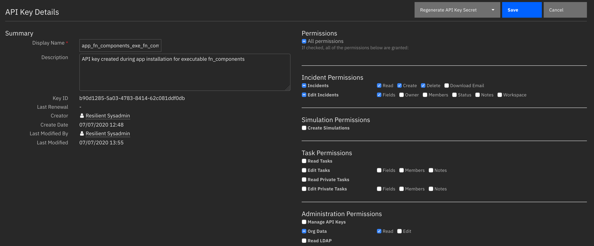
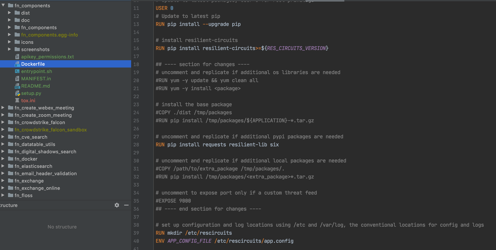

# Component Files for App Host

## Table of Contents  
 
 - [About This Package](#about-this-package)
 - [Container Environment](#container_environment)
 - [Requirements](#requirements)
 - [Installation and Configuration](#installation_and_configuration)
 - [Message Destination Setup](#message_destination_setup)
 - [API Key Permission Setup](#api_key_permission_setup)
 - [Adding Additional Python Files after Deployment](#adding_additional_python_files_after_deployment)
 - [Adding Additional Python Packages](#adding_additional_python_packages)
 
 ---
 
## Revision History
| Version | Date | Notes|
| :-------: | :----: | ----- |
| 1.0.0 | 07/2020 | Initial Release |
 
## About This Package
This package is used to convert existing, single-file Python integrations to use the App Host framework. 
Today, the `componentsdir` parameter in the app.config file references a directory where these files reside.

To use these files in an App Host environment, install this app using the Apps tab within Administrative Settings and, 
through the Configuration tab of the app, add each single-file integration.



## Container Environment
The container runs resilient-circuits similar to an Integration Server and continues to use the `componentsdir`
app.config parameter. The following additional Python packages have been added to the container:

* ldap3
* jinja2 
* json2html 
* pytz 
* requests
* resilient-lib
* six
* tldextract 

If you require additional Python packages, refer to the section below on how to 
[modify the container build enviornment](#adding_additional_python_packages).

## Requirements
This App Host package assumes that the message destination, functions, and rules for each single-file integration are 
already defined in your Resilient platform. If you require moving your integrations between Resilient platform,
consider converting your single-file integrations to fully packaged Apps using the `resilient-sdk codegen` tool and 
capability.

For each single-file integration:
* Each file must be Python 3 compatible.
* Have no additional Python packages required other than those specified in the [container environment](#container_environment).
* Message destinations, functions, and rules used must already exist on your Resilient platform.

# Installation and Configuration
With the app-fn_components-x.x.x.zip file downloaded from the AppExchange, navigate to the 
Apps tab within the Administrative Settings and install the package.

Navigate to the Configuration tab and click the New File button to specify the file name, file path and file contents
of your single-file integration.
Use `/var/rescircuits/components` for the file path and specify the file type as: `Python`.  
Finally, cut and paste the content of the single-file Python code into the File Content window.
Repeat these steps for each single-file Python integration.



Within the app.config file, add the `[resilient]` parameter:
`componentsdir=/var/rescircuits/components`

Each single-file integration may have additional sections and parameters to include in this file similar the settings
you have already specified on your Integration Server's app.config file.



Once all the single-file integrations and configurations added, return to the Details tab and click on the Deploy button.

Note: Once deployed, your single-file integrations are enabled for rule execution. 
It is best to remove these files from your Integration Server and restart resilient-circuits as both will be active otherwise.

## Message Destination Setup
The next step is to add the API Key created for this container, `app_fn_components_exe_fn_components`, 
to each of the message destinations used by your single-file integrations. 
For convenience, all your single-file integrations can share the same message destination.



## API Key Permission Setup
Since it's not known in advance which API key permissions are required for your single-file integrations, it is necessary 
to review each integration for the specific API calls performed for their operation. The base permissions for this API key are:
* read and edit incident data.
* create, edit and delete incident elements, such as artifacts, attachments, notes, milestones and tasks.

If your single-file integrations require more or less permissions, edit the key's permissions set as necessary. 
Insufficient permissions will cause your integration to fail with an error message of `forbidden`.



## Adding Additional Python Files after Deployment
After the initial deployment of your fn_components app, repeat the steps in the 
[Installation and Configuration](#installation_and_configuration) section when adding additional single-file Python integrations. 
Changes to the `app.config` file will trigger the container to restart. Alternatively, click the `Restart` button in the Details tab.

# Adding Additional Python Packages
In order to enable the container to include additional Python packages, it is necessary to rebuild the container. 
This is possible by unzipping the app-fn_components-x.x.x.zip file and then uncompressing 
the `fn_components-x.x.x.tar.gz` archive. Edit the enclosed `Dockerfile` to include additional Python packages. 
See the existing RUN command as an example:

```RUN pip install requests resilient-lib six```

Build the container using either `docker build` or `podman build` in your development environment. 
You will need to push the new container to your
own registry and reference that repository in your App Host. Information on the use of private repositories can reviewed
on the [IBM Knowledge Center](https://www.ibm.com/support/knowledgecenter/SSBRUQ_37.0.0/doc/apps/private_repo.html).


