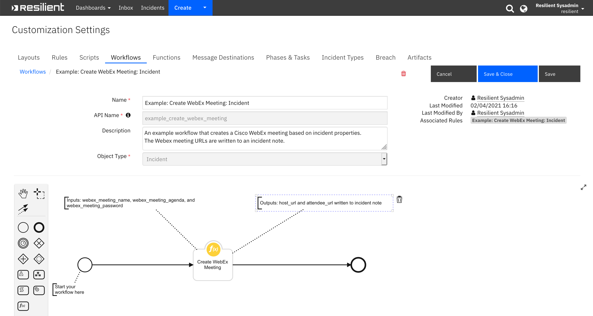
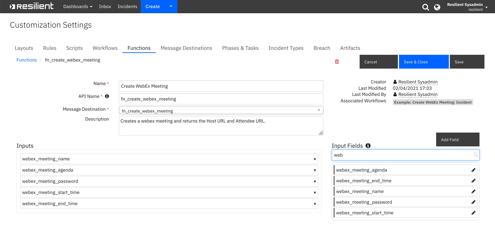
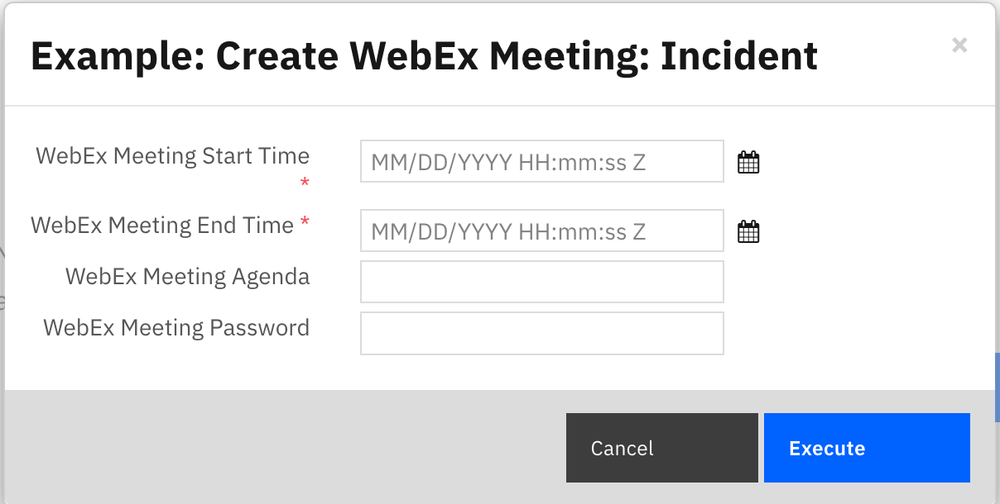

<!--
  This README.md is generated by running:
  "resilient-sdk docgen -p fn_create_webex_meeting"

  It is best edited using a Text Editor with a Markdown Previewer. VS Code
  is a good example. Checkout https://guides.github.com/features/mastering-markdown/
  for tips on writing with Markdown

  If you make manual edits and run docgen again, a .bak file will be created

  Store any screenshots in the "doc/screenshots" directory and reference them like:
  

  NOTE: If your app is available in the container-format only, there is no need to mention the integration server in this readme.
-->

# Cisco WebEx Functions for IBM Security SOAR

## Table of Contents
- [Release Notes](#release-notes)
- [Overview](#overview)
  - [Key Features](#key-features)
- [Requirements](#requirements)
  - [Resilient platform](#resilient-platform)
  - [Cloud Pak for Security](#cloud-pak-for-security)
  - [Proxy Server](#proxy-server)
- [Installation](#installation)
  - [Install](#install)
  - [App Configuration](#app-configuration)
- [Function - Create WebEx Meeting](#function---create-webex-meeting)
- [Rules](#rules)
- [Troubleshooting & Support](#troubleshooting--support)
---

## Release Notes
<!--
  Specify all changes in this release. Do not remove the release 
  notes of a previous release
-->
| Version | Date | Notes |
| ------- | ---- | ----- |
| 1.1.0 | 2/2021 | App Host Support|
| 1.0.0 | 8/2018 | Initial Release |

---

## Overview
<!--
  Provide a high-level description of the function itself and its remote software or application.
  The text below is parsed from the "description" and "long_description" attributes in the setup.py file
-->
**Resilient Circuits Components for 'fn_create_webex_meeting'**

 


### Key Features
<!--
  List the Key Features of the Integration
-->
* This package provides a function that creates Cisco WebEx meeting host URL and attendee URL given the following parameters: meeting start and end time, meeting name and agenda and a WebEx password.

* An example workflow is included that writes the host URL and attendee URL to an incident note as live links to access the meeting.
* An example rule is included that activates an menu popup that prompts the user for a meeting start and end time and an optional meeting agenda and password.

---

## Requirements
<!--
  List any Requirements 
-->
This app supports the IBM Resilient SOAR Platform and the IBM Cloud Pak for Security.

### Resilient platform
The Resilient platform supports two app deployment mechanisms, App Host and integration server.

If deploying to a Resilient platform with an App Host, the requirements are:
* Resilient platform >= `36.0.5634`.
* The app is in a container-based format (available from the AppExchange as a `zip` file).

If deploying to a Resilient platform with an integration server, the requirements are:
* Resilient platform >= `36.0.5634`.
* The app is in the older integration format (available from the AppExchange as a `zip` file which contains a `tar.gz` file).
* Integration server is running `resilient_circuits>=30.0.0`.
* If using an API key account, make sure the account provides the following minimum permissions: 
  | Name | Permissions |
  | ---- | ----------- |
  | Org Data | Read |
  | Function | Read |

The following Resilient platform guides provide additional information: 
* _App Host Deployment Guide_: provides installation, configuration, and troubleshooting information, including proxy server settings. 
* _Integration Server Guide_: provides installation, configuration, and troubleshooting information, including proxy server settings.
* _System Administrator Guide_: provides the procedure to install, configure and deploy apps. 

The above guides are available on the IBM Knowledge Center at [ibm.biz/resilient-docs](https://ibm.biz/resilient-docs). On this web page, select your Resilient platform version. On the follow-on page, you can find the _App Host Deployment Guide_ or _Integration Server Guide_ by expanding **Resilient Apps** in the Table of Contents pane. The System Administrator Guide is available by expanding **System Administrator**.

### Cloud Pak for Security
If you are deploying to IBM Cloud Pak for Security, the requirements are:
* IBM Cloud Pak for Security >= 1.4.
* Cloud Pak is configured with an App Host.
* The app is in a container-based format (available from the AppExchange as a `zip` file).

The following Cloud Pak guides provide additional information: 
* _App Host Deployment Guide_: provides installation, configuration, and troubleshooting information, including proxy server settings. From the Table of Contents, select Case Management and Orchestration & Automation > **Orchestration and Automation Apps**.
* _System Administrator Guide_: provides information to install, configure, and deploy apps. From the IBM Cloud Pak for Security Knowledge Center table of contents, select Case Management and Orchestration & Automation > **System administrator**.

These guides are available on the IBM Knowledge Center at [ibm.biz/cp4s-docs](https://ibm.biz/cp4s-docs). From this web page, select your IBM Cloud Pak for Security version. From the version-specific Knowledge Center page, select Case Management and Orchestration & Automation.

### Proxy Server
The app does support a proxy server.

---

## Installation

### Install
* To install or uninstall an App or Integration on the _Resilient platform_, see the documentation at [ibm.biz/resilient-docs](https://ibm.biz/resilient-docs).
* To install or uninstall an App on _IBM Cloud Pak for Security_, see the documentation at [ibm.biz/cp4s-docs](https://ibm.biz/cp4s-docs) and follow the instructions above to navigate to Orchestration and Automation.

### App Configuration
The following table provides the settings you need to configure the app. These settings are made in the app.config file. See the documentation discussed in the Requirements section for the procedure.

| Config | Required | Example | Description |
| ------ | :------: | ------- | ----------- |
| **webex_email** | Yes | `user@example.com` | *Email address associated with WebEx account.* |
| **webex_password** | Yes | `*****` | *WebEx account password.* |
| **webex_site** | Yes | `meet8` | *WebEx Hostedname.* |
| **webex_site_url** | Yes | `meet8.webex.com` | *WebEx URL.* |
| **webex_timezone** | Yes | `GMT-05:00` | *Timezone in which meeting is created.* |

---

## Function - Create WebEx Meeting
Creates a webex meeting and returns the host URL and the attendee URL for meeting access.

 

<details><summary>Inputs:</summary>
<p>

| Name | Type | Required | Example | Tooltip |
| ---- | :--: | :------: | ------- | ------- |
| `webex_meeting_agenda` | `text` | No | `-` | Meeting agenda |
| `webex_meeting_end_time` | `datetimepicker` | Yes | `-` | - |
| `webex_meeting_name` | `text` | No | `-` | Meeting name |
| `webex_meeting_password` | `text` | No | `-` | Meeting password |
| `webex_meeting_start_time` | `datetimepicker` | Yes | `-` | - |

</p>
</details>

<details><summary>Outputs:</summary>
<p>

```python
results = {
   "version":"1.0",
   "success":true,
   "reason":"None",
   "content":{
      "status":"SUCCESS",
      "host_url":"https://meet8.webex.com/meet8/j.php?MTID=m84f604b5194e7f10e384fe4043aafd",
      "attendee_url":"https://meet8.webex.com/meet8/j.php?MTID=meb86e2013c2d82c3c9dea7b8b27253"
   },
   "raw":"{\"status\": \"SUCCESS\", \"host_url\": \"https://meet8.webex.com/meet8/j.php?MTID=m84f604b5194e7f10e384fe4043aafd\", \"attendee_url\": \"https://meet8.webex.com/meet8/j.php?MTID=meb86e2013c2d82c3c9dea7b8b27253\"}",
   "inputs":{
      "webex_meeting_name":"My Incident",
      "webex_meeting_password":"abcxyzABC!!!",
      "webex_meeting_start_time":1613797200000,
      "webex_meeting_agenda":"",
      "webex_meeting_end_time":1613797620000
   },
   "metrics":{
      "version":"1.0",
      "package":"fn-create-webex-meeting",
      "package_version":"1.1.0",
      "host":"MacBook-Pro.local",
      "execution_time_ms":8725,
      "timestamp":"2021-02-05 10:11:36"
   }
}
```

</p>
</details>

<details><summary>Example Pre-Process Script:</summary>
<p>

```python
# To set meeting name to the workflow inputs, uncomment the following lines
inputs.webex_meeting_name = incident.name

inputs.webex_meeting_start_time = inputs.webex_meeting_start_time if rule.properties.webex_meeting_start_time is None else rule.properties.webex_meeting_start_time
inputs.webex_meeting_end_time = inputs.webex_meeting_end_time if rule.properties.webex_meeting_end_time is None else rule.properties.webex_meeting_end_time

# Get the agenda from the activity field or the incident description
if rule.properties.webex_meeting_agenda is None:
  if incident.description is not None and incident.description.content is not None:
    inputs.webex_meeting_agenda = incident.description.content
  else:
    inputs.webex_meeting_agenda = ""
else:
  inputs.webex_meeting_agenda = rule.properties.webex_meeting_agenda

inputs.webex_meeting_password = inputs.webex_meeting_password if rule.properties.webex_meeting_password is None else rule.properties.webex_meeting_password
  
```

</p>
</details>

<details><summary>Example Post-Process Script:</summary>
<p>

```python
content = results.get("content")

if not results.success:
  text = u"Unable to create Cisco WebEx Meeting"

  fail_reason = content.get("fail_reason")
  if fail_reason:
    text = u"{0}:\n\tFailure reason: {1}".format(text, fail_reason)
else:

  host_url = content.get("host_url")
  attendee_url = content.get("attendee_url")

  if host_url is None:
    host_url = ""

  if attendee_url is None:
    attendee_url = ""
    
  ref_html_host = u"""<a href='{0}'>Link</a>""".format(host_url)
  ref_html_attendee = u"""<a href='{0}'>Link</a>""".format(attendee_url)

  text = u"<b>Cisco WebEx Meeting Links:</b><br />Host URL: {0}<br />Attendee URL: {1}".format(ref_html_host, ref_html_attendee)
  
note = helper.createRichText(text)
incident.addNote(note)
```

</p>
</details>

---


## Rules

| Rule Name | Object | Workflow Triggered |
| --------- | ------ | ------------------ |
| Example: Create WebEx Meeting: Incident | incident | `example_create_webex_meeting` |
<p>

The example incident rule activates the following activity popup menu to allow the user to enter the WebEx meeting information: 


---

## Troubleshooting & Support
Refer to the documentation listed in the Requirements section for troubleshooting information.

### For Support
This is a IBM Community provided App. Please search the Community https://ibm.biz/resilientcommunity for assistance.
