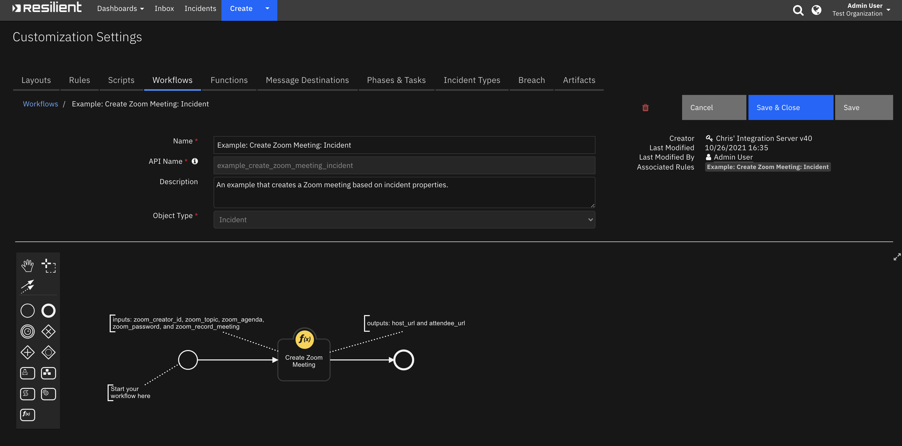
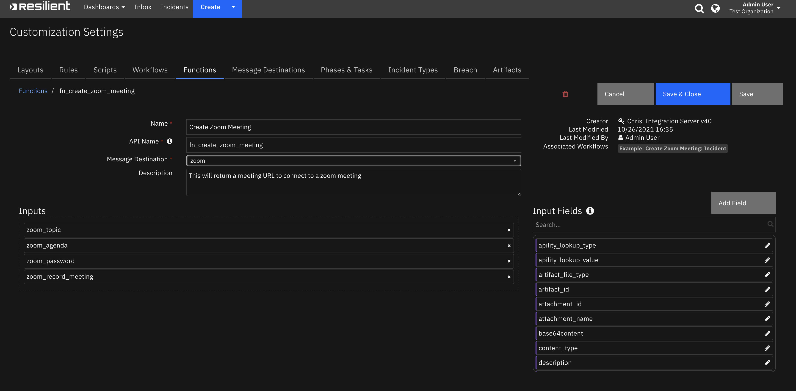

<!--
  This README.md is generated by running:
  "resilient-sdk docgen -p fn_create_zoom_meeting"

  It is best edited using a Text Editor with a Markdown Previewer. VS Code
  is a good example. Checkout https://guides.github.com/features/mastering-markdown/
  for tips on writing with Markdown

  If you make manual edits and run docgen again, a .bak file will be created

  Store any screenshots in the "doc/screenshots" directory and reference them like:
  

  NOTE: If your app is available in the container-format only, there is no need to mention the integration server in this readme.
-->

# Zoom Functions for SOAR

## Table of Contents
- [Release Notes](#release-notes)
- [Overview](#overview)
  - [Key Features](#key-features)
- [Requirements](#requirements)
  - [Resilient platform](#resilient-platform)
  - [Cloud Pak for Security](#cloud-pak-for-security)
  - [Proxy Server](#proxy-server)
  - [Python Environment](#python-environment)
- [Installation](#installation)
  - [Install](#install)
  - [App Configuration](#app-configuration)
- [Function - Create Zoom Meeting](#function---create-zoom-meeting)
- [Rules](#rules)
- [Troubleshooting & Support](#troubleshooting--support)
---

## Release Notes
<!--
  Specify all changes in this release. Do not remove the release 
  notes of a previous release
-->
| Version | Date | Notes |
| ------- | ---- | ----- |
| 1.0.0 | 09/2018 | Initial Release |
| 1.1.0 | 10/2021| Add App Host Support, Section header in app.config has been changed to `fn_create_zoom_meeting`, please make sure to update your app.config |

---

## Overview
<!--
  Provide a high-level description of the function itself and its remote software or application.
  The text below is parsed from the "description" and "long_description" attributes in the setup.py file
-->
**Resilient Circuits Components for 'fn_create_zoom_meeting'**

 

Resilient Circuits Components for 'fn_create_zoom_meeting'

### Key Features
<!--
  List the Key Features of the Integration
-->

* This Resilient Function package can be used to create a Zoom meeting from a workflow using the Functions feature of the Resilient Circuits integration framework.

---

## Requirements
<!--
  List any Requirements 
-->
Go to [https://marketplace.zoom.us/](https://marketplace.zoom.us/), click the develop drop down menu and select build app. From here, choose the JWT app type and use the api key and api secret to fill out the variables in the app.config. The email variable in the app.config wil be the email used for the app marketplace account.

This app supports the IBM Resilient SOAR Platform and the IBM Cloud Pak for Security.

### Resilient platform
The Resilient platform supports two app deployment mechanisms, App Host and integration server.

If deploying to a Resilient platform with an App Host, the requirements are:
* Resilient platform >= `40.0.6554`.
* The app is in a container-based format (available from the AppExchange as a `zip` file).

If deploying to a Resilient platform with an integration server, the requirements are:
* Resilient platform >= `40.0.6554`.
* The app is in the older integration format (available from the AppExchange as a `zip` file which contains a `tar.gz` file).
* Integration server is running `resilient_circuits>=42.0.0`.
* If using an API key account, make sure the account provides the following minimum permissions: 
  | Name | Permissions |
  | ---- | ----------- |
  | Org Data | Read |
  | Function | Read |

The following Resilient platform guides provide additional information: 
* _App Host Deployment Guide_: provides installation, configuration, and troubleshooting information, including proxy server settings. 
* _Integration Server Guide_: provides installation, configuration, and troubleshooting information, including proxy server settings.
* _System Administrator Guide_: provides the procedure to install, configure and deploy apps. 

The above guides are available on the IBM Knowledge Center at [ibm.biz/resilient-docs](https://ibm.biz/resilient-docs). On this web page, select your Resilient platform version. On the follow-on page, you can find the _App Host Deployment Guide_ or _Integration Server Guide_ by expanding **Resilient Apps** in the Table of Contents pane. The System Administrator Guide is available by expanding **System Administrator**.

### Cloud Pak for Security
If you are deploying to IBM Cloud Pak for Security, the requirements are:
* IBM Cloud Pak for Security >= 1.7.
* Cloud Pak is configured with an App Host.
* The app is in a container-based format (available from the AppExchange as a `zip` file).

The following Cloud Pak guides provide additional information: 
* _App Host Deployment Guide_: provides installation, configuration, and troubleshooting information, including proxy server settings. From the Table of Contents, select Case Management and Orchestration & Automation > **Orchestration and Automation Apps**.
* _System Administrator Guide_: provides information to install, configure, and deploy apps. From the IBM Cloud Pak for Security Knowledge Center table of contents, select Case Management and Orchestration & Automation > **System administrator**.

These guides are available on the IBM Knowledge Center at [ibm.biz/cp4s-docs](https://ibm.biz/cp4s-docs). From this web page, select your IBM Cloud Pak for Security version. From the version-specific Knowledge Center page, select Case Management and Orchestration & Automation.

### Proxy Server
The app does support a proxy server.

### Python Environment
Both Python 2.7 and Python 3.6 are supported.
Additional package dependencies may exist for each of these packages:
* bs4
* pyjwt
* pytz
* resilient_circuits>=30.0.0

---

## Installation

### Install
* To install or uninstall an App or Integration on the _Resilient platform_, see the documentation at [ibm.biz/resilient-docs](https://ibm.biz/resilient-docs).
* To install or uninstall an App on _IBM Cloud Pak for Security_, see the documentation at [ibm.biz/cp4s-docs](https://ibm.biz/cp4s-docs) and follow the instructions above to navigate to Orchestration and Automation.

### App Configuration
The following table provides the settings you need to configure the app. These settings are made in the app.config file. See the documentation discussed in the Requirements section for the procedure.

| Config | Required | Example | Description |
| ------ | :------: | ------- | ----------- |
| **zoom_api_url** | Yes | `https://api.zoom.us/v2` | - |
| **zoom_api_key** | Yes | `<zoom api key>` | API key from the app marketplace|
| **zoom_marketplace_account_email** | Yes | `<zoom marketplace account email>` | Host email |
| **zoom_api_secret** | Yes | `<zoom api secret>` | API secret from the app marketplace |
| **zoom_api_timezone** | Yes | `<timezone, i.e America/New_York>` | pytz.timezone |


---

## Function - Create Zoom Meeting
This will return a meeting URL to connect to a zoom meeting

 

<details><summary>Inputs:</summary>
<p>

| Name | Type | Required | Example | Tooltip |
| ---- | :--: | :------: | ------- | ------- |
| `zoom_agenda` | `text` | No | `-` | Agenda for this meeting |
| `zoom_password` | `text` | No | `-` | Meeting password |
| `zoom_record_meeting` | `boolean` | No | `-` | Check this to record the meeting |
| `zoom_topic` | `text` | Yes | `-` | Meeting topic |

</p>
</details>

<details><summary>Outputs:</summary>
<p>

```python
Result: {
  'host_url': 'https://zoom.us/...', 
  'attendee_url': 'https://zoom.us/j/93246004924', 
  'date_created': '10/26/2021 15:12:36'
}
```

</p>
</details>

<details><summary>Example Pre-Process Script:</summary>
<p>

```python
inputs.zoom_host_email = rule.properties.zoom_host_email
inputs.zoom_topic = rule.properties.zoom_topic

inputs.zoom_password = inputs.zoom_password if rule.properties.zoom_password is None else rule.properties.zoom_password

if rule.properties.zoom_agenda is not None:
  inputs.zoom_agenda = rule.properties.zoom_agenda
else:
  if inputs.zoom_agenda is None and incident.description is not None and incident.description.content is not None:
    inputs.zoom_agenda = incident.description.content

inputs.zoom_record_meeting = inputs.zoom_record_meeting if rule.properties.zoom_record_meeting is None else rule.properties.zoom_record_meeting


```

</p>
</details>

<details><summary>Example Post-Process Script:</summary>
<p>

```python
# results:
# {
#   "host_url": "https://zoom.us/s/x?zak=x", 
#   "attendee_url": "https://zoom.us/j/x", 
#   "date_created": "01/01/1971 12:00:00"
# }
if results.host_url is not None and results.attendee_url is not None:
  host_url = results.host_url
  attendee_url = results.attendee_url
  
  if host_url is None:
    host_url = ""
  
  if attendee_url is None:
    attendee_url = ""
  
text = """<b>Zoom Meeting:</b>
          <b>Host URL:</b> <a href='{0}'>{0}</a>
          <b>Attendee URL:</b> <a href='{1}'>{1}</a>""".format(results.host_url, results.attendee_url)

incident.addNote(helper.createRichText(text))
```

</p>
</details>

---


## Rules
| Rule Name | Object | Workflow Triggered |
| --------- | ------ | ------------------ |
| Example: Create Zoom Meeting: Incident | incident | `example_create_zoom_meeting_incident` |

---

## Troubleshooting & Support
Refer to the documentation listed in the Requirements section for troubleshooting information.

### For Support
This is a IBM Community provided App. Please search the Community https://ibm.biz/resilientcommunity for assistance.
