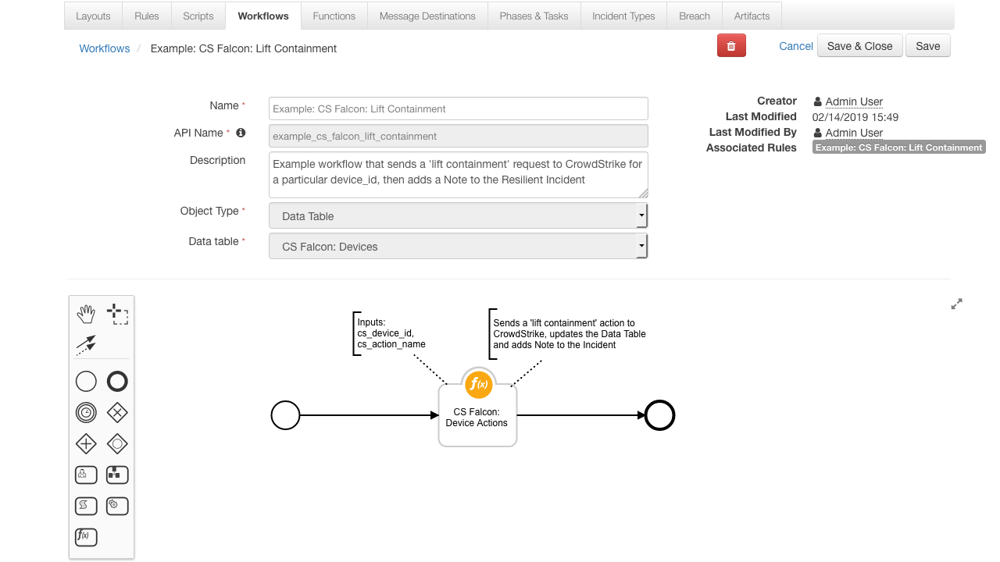

# CrowdStrike Falcon Functions for IBM Resilient

## Table of Contents
  - [Function - CS Falcon: Search](#function---cs-falcon-search)
  - [Function - CS Falcon: Device Actions](#function---cs-falcon-device-actions)
  - [Function - CS Falcon: Get Devices IOC Ran On](#function---cs-falcon-get-devices-ioc-ran-on)
  - [Rules](#rules)
  - [Data Tables](#data-tables)
    - [CS Falcon: Devices](#cs-falcon-devices)
    - [CS Falcon: Devices IOC Ran On Results](#cs-falcon-devices-ioc-ran-on-results)
    - [Display a Data Table in an Incident](#display-the-datatable-in-an-incident)
---

**This package contains 3 functions that help you integrate with CrowdStrike Falcon APIs**

 

* CS Falcon: Search gives you the ability to search your CrowdStrike Falcon platform for a list of Devices
* CS Falcon: Device Actions allows you to 'contain' or 'lift_containment' on a CrowdStrike device
* CS Falcon: Get Devices IOC Ran On returns a list of CrowdStrike devices that the given IOC Ran On

---
## app.config settings:
* At time of development, CrowdStrike Falcon are currently in the process of migrating their APIs. Therefore we are required to provide two different sets of credentials: **API Client** and **API Key**
* See their documentation here [https://falcon.crowdstrike.com/support/documentation/1/crowdstrike-api-introduction-for-developers#before_you_begin](https://falcon.crowdstrike.com/support/documentation/1/crowdstrike-api-introduction-for-developers#before_you_begin) on how to obtain your two sets of API Credentials
* Also, the `base_url` may be different depending on your environment. Below are the common `base_urls` used for each set of credentials
```
[fn_crowdstrike_falcon]

# API Client Authentication, CrowdStrike's newer standard based on OAuth2
cs_falcon_oauth2_base_url=https://api.crowdstrike.com
cs_falcon_oauth2_cid=
cs_falcon_oauth2_key=

# API Key Authentication, CrowdStrike's legacy authentication standard
cs_falcon_bauth_base_url=https://falconapi.crowdstrike.com
cs_falcon_bauth_api_uuid=
cs_falcon_bauth_api_key=

# Number of seconds to wait before next device-action request to CrowdStrike. Default=5
cs_falcon_ping_delay=

# Max number of seconds to wait to get device-action response from CrowdStrike. Default=120
cs_falcon_ping_timeout=
```

---
## Function - CS Falcon: Search
Queries your CrowdStrike Falcon Hosts for a list of Devices using a Filter and/or Query. If Devices are found they are returned as a Python List

 


### Inputs:
| Name | Type | Required | Example | Info |
| ------------- | :--: | :-------:| ------- | ---- |
| `cs_filter_string` | `String` | No | `"hostname:'{0}*'+platform_name:'{1}'" .format(artifact.value, "Linux")` | See: [https://falcon.crowdstrike.com/support/documentation/2/query-api-reference#devicesearch](https://falcon.crowdstrike.com/support/documentation/2/query-api-reference#devicesearch) for filter syntax |
| `cs_query` | `String` | No | `"JohnsMacBook"` | This query searches the meta data of devices after applying the above filter. Here it would search all fields for "JohnsMacBook" |


### Output:
```python
results = {
    "success": True,
    "reason": None,
    "version": "1.0",
    "metrics": {
        "package": "fn-crowdstrike-falcon",
        "timestamp": "2019-02-11 13:23:43",
        "package_version": "1.0.0",
        "host": "localhost",
        "version": "1.0",
        "execution_time_ms": 1619
    },
    "inputs": {
        "cs_query": None,
        "cs_filter_string": "hostname:'localhost*'"
    },
    "content": [{
        "modified_timestamp": 1549891335000,
        "config_id_platform": "8",
        "system_manufacturer": "innotek GmbH",
        "meta": {
            "version": "295"
        },
        "first_seen": 1549548472000,
        "platform_id": "3",
        "local_ip": "192.168.63.3",
        "hostname": "localhost.localdomain",
        "config_id_build": "6703",
        "minor_version": "10",
        "os_version": "CentOS 7",
        "provision_status": "Provisioned",
        "mac_address": "0-0-0-0-0",
        "bios_version": "VirtualBox",
        "agent_load_flags": "0",
        "status": "normal",
        "bios_manufacturer": "innotek GmbH",
        "product_type_desc": "Server",
        "device_policies": {
            "sensor_update": {
                "applied": True,
                "applied_date": "2019-02-07T14:09:24.94667175Z",
                "settings_hash": "65994753|8|2|automatic",
                "policy_type": "sensor-update",
                "assigned_date": "2019-02-07T14:09:24.946671267Z",
                "policy_id": "4eac5ba86b27414098820732fe7876f6"
            },
            "prevention": {
                "applied": True,
                "applied_date": "2019-02-08T14:47:54.526691595Z",
                "settings_hash": "d4cbb29",
                "policy_type": "prevention",
                "assigned_date": "2019-02-08T14:47:47.25675937Z",
                "policy_id": "25291d90954c476d86c6fb2db38d7d72"
            }
        },
        "agent_local_time": 1549859544549,
        "slow_changing_modified_timestamp": "2019-02-11T13:22:15Z",
        "device_id": "606e693c6ac040107c07dcc7c7ed6785",
        "system_product_name": "VirtualBox",
        "cid": "b1e43228990c4bfe8e979969d955b800",
        "external_ip": "0.0.0.0",
        "major_version": "3",
        "platform_name": "Linux",
        "config_id_base": "65994753",
        "policies": [{
            "applied": True,
            "applied_date": "2019-02-08T14:47:54.526691595Z",
            "settings_hash": "d4cbb29",
            "policy_type": "prevention",
            "assigned_date": "2019-02-08T14:47:47.25675937Z",
            "policy_id": "25291d90954c476d86c6fb2db38d7d72"
        }],
        "agent_version": "4.21.6703.0",
        "last_seen": 1549891334000
    }]
}
```

### Pre-Process Script:
This example uses the Artifact Value to create the `cs_filter_string`
```python
# Example: "hostname:'sampleName*'+platform_name:'Windows'" ==> Searches CrowdStrike for devices who's hostname contains 'sampleName' and platform is 'Windows'
inputs.cs_filter_string = "hostname:'{0}*'".format(artifact.value)

# This query searches the meta data of devices after applying the above filter
inputs.cs_query = "JohnsMacBook"
```
### Post-Process Script:
This post-process loops each found device and adds its details to the `cs_falcon_devices_dt` Data Table
```python
# Import Date
from java.util import Date

# If the function found some devices
if results.success:
  
  # Get the current time
  dt_now = Date()
  
  # For each device, add a row to the cs_falcon_devices_dt
  for device in results.content:
    new_row = incident.addRow("cs_falcon_devices_dt")
    new_row.timestamp = dt_now
    new_row.device_id = device.device_id
    new_row.hostname = device.hostname
    new_row.ip = device.local_ip
    new_row.mac = device.mac_address
    new_row.last_seen = device.last_seen
    new_row.status = device.status

else:
  # Else, no devices found, add Note to Incident with reason
  incident.addNote(results.reason)
```

---

## Function - CS Falcon: Device Actions
* Function that uses the CrowdStrike Falcon '/devices/entities/devices-actions/' endpoint to Contain or Lit Containment on a Device
* Sends the `contain` or `life_containment` request to CrowdStrike.
* Then pings every x seconds to get the `device_status`
* Ends when the `device_status` is `normal` or `contained` or when the request times out

**Contain Device:**

 
 
**Lift Containment:**

 


### Inputs:
| Name | Type | Required | Example | Info |
| ------------- | :--: | :-------:| ------- | ---- |
| `cs_device_id` | `String` | Yes | `"b1e43228990c4bfe8e979969d955b800"` | This is a unique ID CrowdStrike Falcon assigns all its devices |
| `cs_action_name` | `Select` | Yes | Select Options: `contain` or `lift_containment` | The name of the action to run on the device. Currently the CrowdStrike Falcon APIs support 'contain' and 'lift_containment'. See [https://assets.falcon.crowdstrike.com/support/api/swagger.html](https://assets.falcon.crowdstrike.com/support/api/swagger.html) for more |


### Output:
```python
results = {
    "success": True,
    "reason": None,
    "version": "1.0",
    "inputs": {
        "cs_device_id": "606e693c6ac040107c07dcc7c7ed6785",
        "cs_action_name": "contain"
    },
    "metrics": {
        "package": "fn-crowdstrike-falcon",
        "timestamp": "2019-02-11 13:42:16",
        "package_version": "1.0.0",
        "host": "localhost",
        "version": "1.0",
        "execution_time_ms": 3920
    },
    "content": {
        "meta": {
            "query_time": 0.725871979,
            "trace_id": "349764c9-721f-4a90-bc48-74d793c0e151",
            "powered_by": "device-api"
        },
        "device_id": "606e693c6ac040107c07dcc7c7ed6785",
        "device_status": "contained"
    }
}
```

### Pre-Process Script:
This example is using a Workflow with a Data Table Object Type. Therefore it can get the device_id from the row this Rule was invoked on
```python
# Set the unique CrowdStrike device_id. Taken here from the CS Falcon: Devices Data Table
inputs.cs_device_id = row.device_id

# inputs.cs_action_name is a select field and is set to "contain" in the Workflow's Input tab
```
### Post-Process Script:
This post-process creates a formatted timestamp, updates the Data Table and adds a Note to the Incident
```python
# Import Date
from java.util import Date

def get_formatted_timestamp():
  """Function that returns the current Resilient Appliance time in the format: mm/dd/yyyy hh:mm:ss"""
  dt = Date()
  return u"{0}/{1}/{2} {3}:{4}:{5}".format(
    dt.getMonth() + 1, dt.getDate(), dt.getYear() + 1900, dt.getHours(), dt.getMinutes(), dt.getSeconds())


# If the function successfully sent a "contain device" request to CrowdStrike, updated the Data Table and add a Note to the Incident
if results.success:
  
  # Get the current time in the format 'mm/dd/yyyy hh:mm:ss'
  formatted_date = get_formatted_timestamp()
  
  # Generate the value we want to update the cell to
  latest_action_text = u"Action: {0}. Time: {1}".format(unicode(workflow.properties.cs_action.inputs.cs_action_name), formatted_date)

  # Update the latest_action Data Table cell
  row.latest_action = latest_action_text
  
  # Update the device_status Data Table cell
  row.status = results.content.device_status
  
  note_text = """<br><b>device-action request sent to CrowdStrike</b>
                 <br><b>Action:</b> {0}
                 <br><b>Device ID:</b> {1}
                 <br><b>Device Status:</b> {2}""".format(results.inputs.cs_action_name, results.content.device_id, results.content.device_status)

  incident.addNote(helper.createRichText(note_text))
```

---
## Function - CS Falcon: Get Devices IOC Ran On
Queries your CrowdStrike Falcon Hosts with a String Representation of an IOC and returns a list of Device IDs that the IOC Ran On

 

### Inputs:
| Name | Type | Required | Example | Info |
| ------------- | :--: | :-------:| ------- | ---- |
| `cs_ioc_type` | `String` | Yes | `"DNS Name"`, `"Malware SHA-256 Hash"`, `"Malware SHA-1 Hash"`, or `"Malware MD5 Hash"` | Normally set using the `artifact.type` property |
| `cs_ioc_value` | `String` | Yes | `"a-malicious-domain.com"`, `"728ee069b76107e9e2930dbffd50dfc52f440823e5f252935eb8607a47b11efc"` | Normally set using the `artifact.value` property |
| `cs_return_limit` | `Number` | No | `10` | Sets the max number of devices to return from the request |


### Output:
```python
results = {
    'version': '1.0',
    'success': True,
    'reason': None,

    'inputs': {
        'cs_ioc_type': 'DNS Name',
        'cs_ioc_value': 'google.com',
        'cs_return_limit': None
    },

    'metrics': {
        'package': 'fn-crowdstrike-falcon',
        'timestamp': '2019-02-18 13:32:52',
        'package_version': '1.0.0',
        'host': 'localhost',
        'version': '1.0',
        'execution_time_ms': 930
    },

    'content': {
        'meta': {
            'query_time': 0.046912103,
            'entity': '/devices/entities/devices/v1{?ids*}',
            'pagination': {
                'limit': 100,
                'offset': ''
            },
            'trace_id': '676d1be7-4d96-4ba0-ae6c-dd8aaae30c54'
        },
        'device_ids': [
            '889e958fb8354a0e4f9f5abcb3016bfa',
            '9fc8f81b962541b26d1e0feaf2c1523e'
        ]
    }
}
```

### Pre-Process Script:
* This example uses the Artifact Value and Type properties when defining the inputs
```python
# Set the ioc type
inputs.cs_ioc_type = artifact.type

# Set the ioc value
inputs.cs_ioc_value = artifact.value

# Set the max number of devices to return
# inputs.cs_return_limit = 10
```
### Post-Process Script:
* This post-process loops each device_id found and adds its details to the `cs_falcon_devices_ioc_ran_on_results_dt` Data Table
* If no devices were found for the IOC or an error occurred, a Note is added to the Incident with the reason why
```python
# Import Date
from java.util import Date

# If the function found some devices
if results.success:
  
  # Get the current time
  dt_now = Date()
  
  # For each device, add a row to the cs_falcon_devices_dt
  for device_id in results.content.device_ids:
    new_row = incident.addRow("cs_falcon_devices_ioc_ran_on_results_dt")
    new_row.timestamp = dt_now
    new_row.ioc_type = results.inputs.cs_ioc_type
    new_row.ioc_value = results.inputs.cs_ioc_value
    new_row.device_id = device_id

else:
  # Else, the function did not get any devices. Add a note with the reason why
  incident.addNote(results.reason)
```

---

## Rules
| Rule Name | Object Type | Conditions | Workflow Triggered |
| --------- | :---------: | ---------- | ------------------ |
| Example: CS Falcon: Search | `Artifact` | `None` | `Example: CS Falcon: Search` |
| Example: CS Falcon: Contain Device | `Data Table` | `cs_falcon_devices_dt.device_id` must have a value | `Example: CS Falcon: Contain Device` |
| Example: CS Falcon: Lift Containment | `Data Table` | `cs_falcon_devices_dt.device_id` must have a value | `Example: CS Falcon: Lift Containment` |
| Example: CS Falcon: Get Latest Device Details | `Data Table` | `cs_falcon_devices_dt.device_id` must have a value | `Example: CS Falcon: Get Latest Device Details` |
| Example: CS Falcon: Get Devices IOC Ran On | `Artifact` | `Type` must be equal to `"DNS Name"`, `"Malware SHA-256 Hash"`, `"Malware SHA-1 Hash"`, or `"Malware MD5 Hash"` | `Example: CS Falcon: Get Devices IOC Ran On` |

---
## Data Tables
### CS Falcon: Devices
 

#### API Name:
cs_falcon_devices_dt

#### Columns:
| Column Name | API Access Name | Type | Info |
| ----------- | --------------- | ---- | ---- |
| Timestamp | `timestamp` | `DateTime` | Timestamp when this entry was added |
| Device ID | `device_id` | `Text` | Unique CrowdStrike ID for the Device |
| Hostname | `hostname` | `Text` | Hostname of the Device |
| IP | `ip` | `Text` | Local IP Address of the Device |
| MAC | `mac` | `Text` | MAC Address of the Device |
| Last Seen | `last_seen` | `DateTime` | Datetime the Device was Last Seen |
| Status | `status` | `Text` | The Containment Status of the Device |
| Latest Action | `latest_action` | `Text` | Name of the latest CrowdStrike action to run on this device |

### CS Falcon: Devices IOC Ran On Results
 

#### API Name:
cs_falcon_devices_ioc_ran_on_results_dt

#### Columns:
| Column Name | API Access Name | Type | Info |
| ----------- | --------------- | ---- | ---- |
| Timestamp | `timestamp` | `DateTime` | Timestamp when this entry was added |
| IOC Type | `ioc_type` | `Text` | The IOC Type |
| IOC Value | `ioc_value` | `Text` | String Representation of the IOC |
| Device ID | `device_id` | `Text` | The unique CrowdStrike ID of the Device|

### Display a Data Table in an Incident
* In order to **display** the Test Data Table in your Incident, you must **modify your Layout Settings**

1. Go to **Customization Settings** > **Layouts** > **Incident Tabs** > **+ Add Tab**
   
 

2. Enter **Tab Text**: `My Test Tab` and click **Add**
 
 

3. **Drag** the Data table into the middle and click **Save**
 
 

4. Create a new Incident and you will now see the **My Test Tab** with the **Test Data Table**
