# CVE Search Function for IBM Resilient

## Table of Contents  
 
 - [About This Package](#about-this-package)
 - [Prerequisites](#prerequisites)
 - [Installation](#installation)
 - [Data Table](#data-table)
 - [Function Inputs](#function-inputs)
 - [Function Output](#function-output)
 - [Pre-Process Script](#pre-process-script)
 - [Post-Process Script](#post-process-script)
 - [Rules](#rules)
 - [CVE Search Function Usage](#using-the-cve-function)
 
 ---
 
## About This Package:
**This package contains Resilient functions that allows one to search for Common Vulnerability Exposures (CVE).**

* This package implements different ways to search the CVE database such as:  
	* Browse product and vendor categories
	* Search CVE's by product and vendor
	* Search by specific CVE ID  
	* Retrieve last 30 CVE's  
	
* This package makes use of the following CVE API call to get information on a given query 
`https://cve.circl.lu/api/{search param}/{vendor name}/{product name}`  
* For more information, see [the circl website](https://www.circl.lu/services/cve-search/)

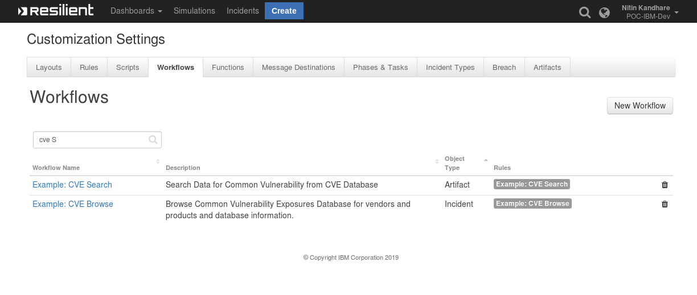
### CVE Search Function Layout:
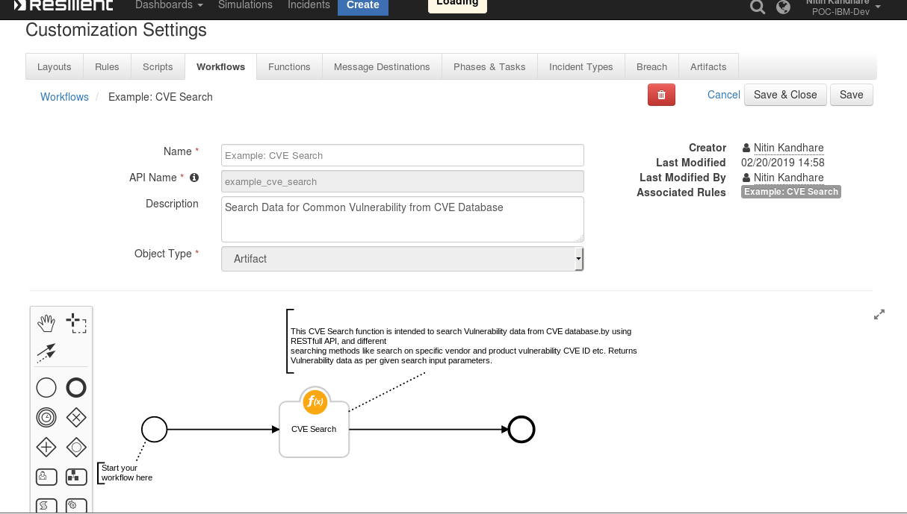
### CVE Search Pre-Process Script 
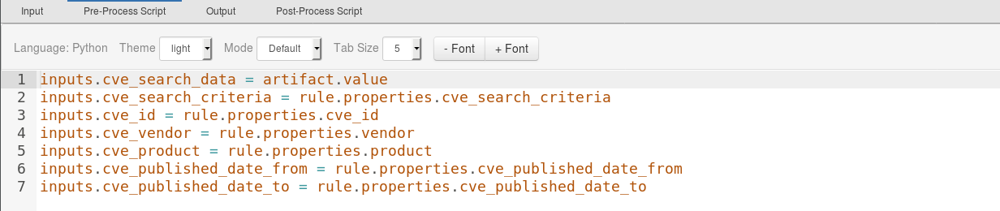
### CVE Search Post-Process Script
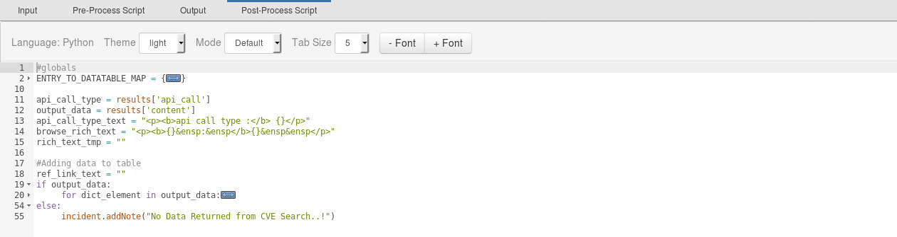
### CVE Browse Function Layout:
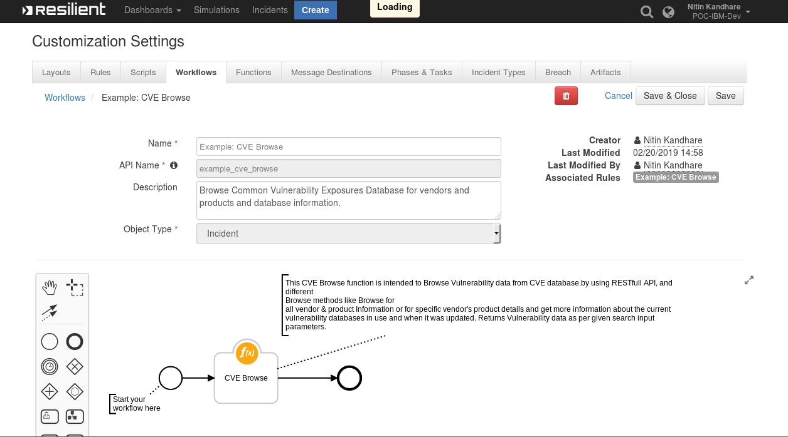
### CVE Browse Pre-Process Script
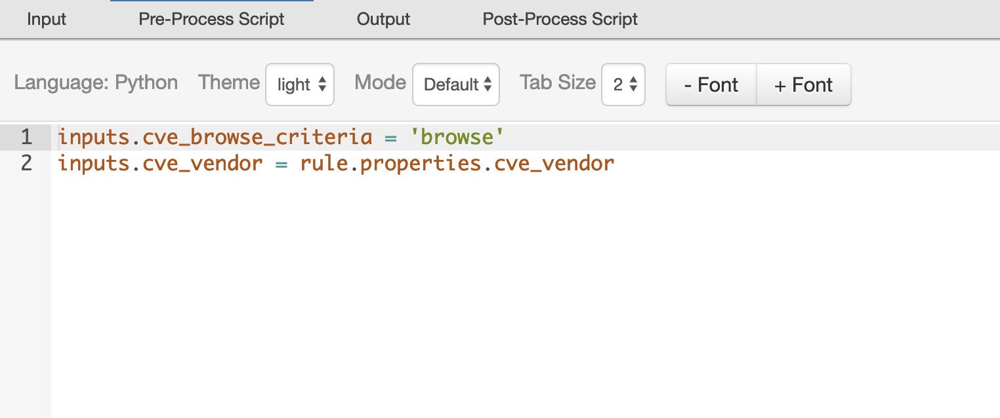
### CVE Browse Post-Process Script
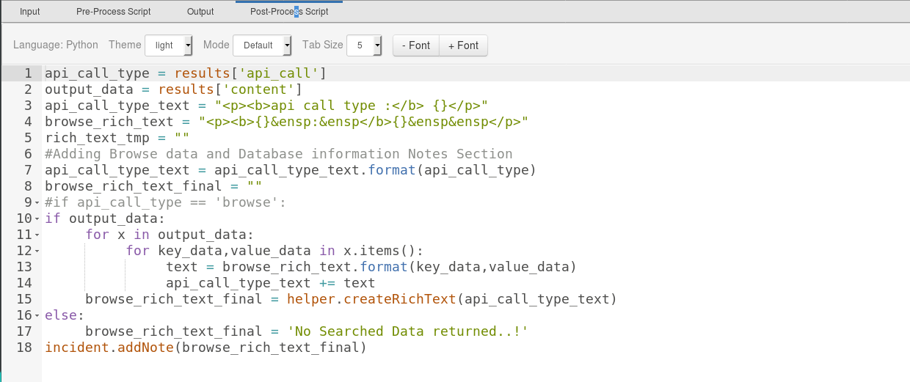
## Prerequisites:  
  
* Resilient Appliance >= v31.0.0
* Integrations Server running resilient_circuits >= v30.0.0
      
## Installation  
  
This package requires that it be installed on a RHEL or CentOS platform using the resilient-circuits framework.  

* Download the `.zip` file from the XForce App Exchange and extract it. You will find a file called: `fn_cve_search-<version>.tar.gz`
* Copy this file to your Integrations Server
* To install the package, run:
    ```
    $ pip install fn_cve_search-<version>.tar.gz
    ```
* To import the function, example rules, data tables and workflows into your Resilient Appliance, run:
    ```
    $ resilient-circuits customize -l fn-cve-search
    ``` 
* To update your `app.config` file with the required CVE Search configurations, run:
    ```
    $ resilient-circuits config -u
    ```
* Access your `app.config` file and review the parameters added. Edit the `max_results_display` counter value to limit the maximum number of search results to display on table.

	```
	[fn_cve_search]
	# Flag display maximum CVE Entries on the resilient table
	max_results_display = 50
	# Base URL of Common Vulnerability Exposures Data Base.
	cve_base_url = https://cve.circl.lu/api
	```  
	
*  To uninstall CVE Function from Resilient, run:

    ```
    $ pip uninstall fn_cve_search
    ``` 

## Data Table
### Data Table Utils: CVE Searched Data
This table will contain the results of the CVE searches.
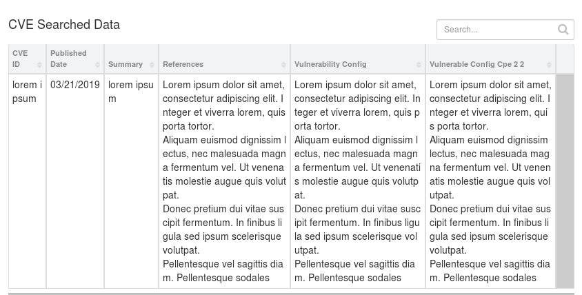

#### Display the Data Table in an incident
* In order to display the CVE Searched datatable in your incident, you must modify your Layout Settings:

1. Go to **Customization Settings** > **Layouts** > **Incident Tabs** > **+ Add Tab**
	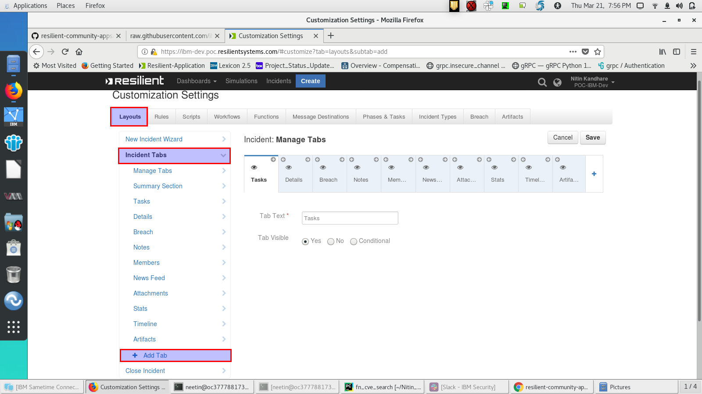
      
2. Enter `CVE SEARCH DATA` and click **Add**
 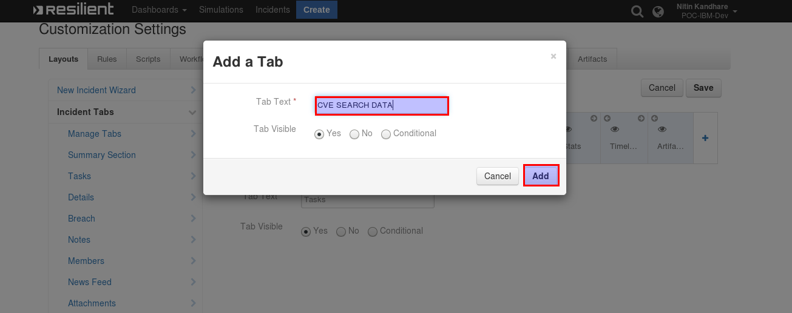
3. **Drag** the Data table into the middle and click **Save**
 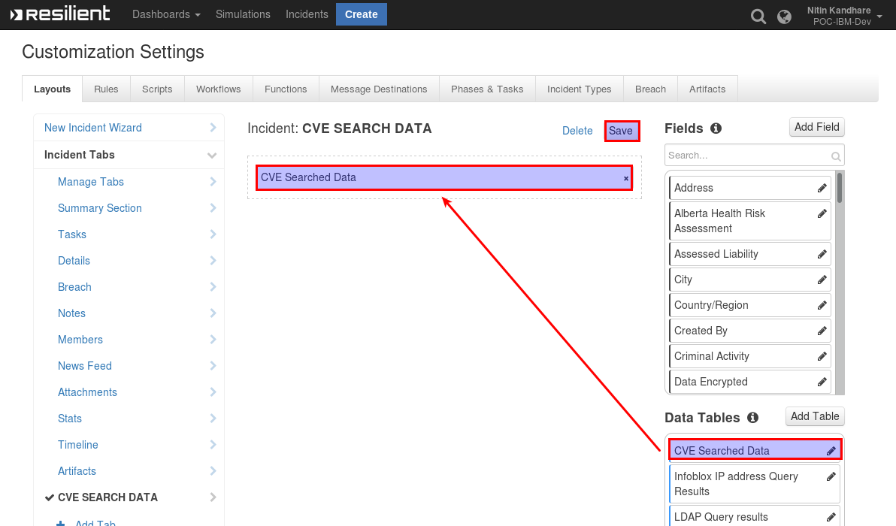
4. Within an incident, the **CVE Search Data** tab contains the CVE Searched Data Table
  
## Function Inputs
 
### CVE Search Function
 
|Input Name |Type  |Example|Info|
|---|---|---|---|---|
|cve_id|String  |CVE-2008-3949 |Specific vulnerability ID |
|cve_vendor|String| microsoft|a vendor name to search for cve |
|cve_product|String|excel|Name of the Product to Search in CVE Database|
|cve_published_date_from|Date Picker|03/01/2019|Select CVE Published Date|
|cve_published_date_to|Date Picker|03/01/2019|End date range to search cve data|

### CVE Browse Function

|Input Name |Type  |Example|Info|
|---|---|---|---|---|
|cve_browse_criteria |select |Browse | CVE Browse Criteria i.e Browse (for vendors & product information)|
|cve_vendor|text|apple|a vendor name to browse for cve |

## Function Output  
* The payload from the function will contain the JSON from the CVE API Call and the name of the API Call

    ```
    results = {
        "content": #JSON returned from CVE API Call,
        "api_call": #"last"/"browse"/"search"/"cve"/"db"
    }
    ```
* To see the output of each of the API calls for this Function, we recommend running `resilient-circuits` in `DEBUG` mode.
* To do this run:
    ```
    $ resilient-circuits run --loglevel=DEBUG
    ```
## Pre-Process Script
* CVE Browse

This example sets the `cve_browse_criteria`, `cve_vendor` inputs to the entered vendor name

```python
inputs.cve_browse_criteria = 'browse'
inputs.cve_vendor = rule.properties.cve_vendor
```

* CVE Search  

This example sets the `cve_id`, `cve_vendor`, `cve_product`, `cve_published_date_from`, `cve_published_date_to` inputs to search selections entered on the rule dialog box. See below for the combinations used in searches.

```python
# Specific CVE ID
inputs.cve_id = rule.properties.cve_id
# Name of the Vendor 
inputs.cve_vendor = rule.properties.vendor
# Name of the product
inputs.cve_product = rule.properties.product
# Search CVE Data from Date
inputs.cve_published_date_from = rule.properties.cve_published_date_from
# Search CVE Data upto Date
inputs.cve_published_date_to = rule.properties.cve_published_date_to
```

## Post-Process Script
Returned results are parsed within the post-process script as `results.get("content")`. Based on the api_call type, the data is represented as follows:
 
* `Example: CVE Browse` function data is displayed on incident notes,   
    and 
* `Example: CVE Search` function data displayed on the `CVE Searched Data` table.

### CVE Search

```python
#globals
ENTRY_TO_DATATABLE_MAP = {
     "cve": "cve_id",
     "pubdte": "published_date",
     "sum": "summary",
     "ref": "references",
     "vc": "vulnerability_configuration",
     "vc2": "vulnerable_configuration_cpe_2_2"
}

api_call_type = results['api_call']
output_data = results['content']
api_call_type_text = "<p><b>api call type :</b> {}</p>"
browse_rich_text = "<p><b>{}&ensp:&ensp</b>{}&ensp&ensp</p>"
rich_text_tmp = ""

#Adding data to table
ref_link_text = ""
if output_data:
     for dict_element in output_data:
          rich_text_tmp = ""
          table_row_object = incident.addRow("cve_data")
          for key_data,value_data in dict_element.items():
               if key_data == 'Published':
                    table_row_object[ENTRY_TO_DATATABLE_MAP["pubdte"]] = int(value_data)
               elif key_data == 'id':
                    table_row_object[ENTRY_TO_DATATABLE_MAP["cve"]] = value_data
               elif key_data == 'summary':
                    table_row_object[ENTRY_TO_DATATABLE_MAP["sum"]] = value_data
               elif key_data == 'references':
                    for link_url in value_data:
                         ref_link_text += '<p><a href="{0}">{0}</a></p>'.format(link_url)
                    table_row_object[ENTRY_TO_DATATABLE_MAP["ref"]] = ref_link_text
               elif key_data == 'vulnerable_configuration':
                    if value_data:
                         for vc_collection in value_data:
                              if isinstance(vc_collection,dict):
                                   for key_data,value_data in vc_collection.items():
                                        text = browse_rich_text.format(key_data,value_data)     
                                        rich_text_tmp += text
                              else:
                                   rich_text_tmp += "<p>{}</p>".format(vc_collection)
                    else:
                         rich_text_tmp = "No Data"
                    table_row_object[ENTRY_TO_DATATABLE_MAP["vc"]] = rich_text_tmp
               elif key_data == 'vulnerable_configuration_cpe_2_2':
                    rich_text_tmp_2 = ''
                    if value_data:
                         for vc_collection in value_data:
                              rich_text_tmp_2 += "<p>{}</p>".format(vc_collection)
                    else:
                         rich_text_tmp_2 = "No Data"
                    table_row_object[ENTRY_TO_DATATABLE_MAP["vc2"]] = rich_text_tmp_2
else:
     incident.addNote(u"No data returned from CVE Search\n\nCVE-ID: {}\nVendor: {}\nProduct: {}".format(rule.properties.cve_id, rule.properties.cve_vendor, rule.properties.cve_product))
```

* CVE Browse 

```python
api_call_type = results['api_call']
output_data = results['content']
api_call_type_text = "<p><b>api call type :</b> {}</p><p><b>vendor :</b> {} </p>"
browse_rich_text = "<p><b>{}&ensp:&ensp</b>{}&ensp&ensp</p>"
rich_text_tmp = ""
#Adding Browse data and Database information Notes Section
api_call_type_text = api_call_type_text.format(api_call_type, rule.properties.cve_vendor)
browse_rich_text_final = ""

if output_data:
     for x in output_data:
          for key_data,value_data in x.items():
               text = browse_rich_text.format(key_data,value_data)
               api_call_type_text += text
     browse_rich_text_final = helper.createRichText(api_call_type_text)
else:
     browse_rich_text_final = 'No searched data returned'
incident.addNote(browse_rich_text_final)
```
## Rules  
  
| Rule Name | Object Type | Workflow Triggered |Activity Fields|  
| --------- | :---------: | ------------------ |---------------|  
| Example: CVE Browse | Incident | Example: CVE Browse |CVE Browse Criteria values : Browse, CVE Vendor|
| Example: CVE Search | Incident | Example: CVE Search |CVE Search Criteria |values : `Search`, `Specific CVE ID`, `Last 30 CVES`, `CVE ID`, `CVE Vendor`, `CVE Product`, `CVE Published Date From`, `CVE Published Date To`|

 **CVE functions perform data searches as follows**  
   
 1. Browse:
    * If all other inputs are empty, all the vendors in the database are returned.
    * If a vendor name is supplied, all the products associated with the vendor are returned.
      
 2. Search: 
    * If a vendor name is supplied, all the vulnerabilities associated with the  
        given vendor are returned up to the given date range and   
        `max_results_display` flag.  
    * If a product name is supplied, all the vulnerabilities associated with the
        given product are returned up to the given date range and   
        `max_results_display` flag.  
    * If vendor and product name are supplied, all the vulnerabilities associated with the  
        given vendor's product are returned up to the given date range and   
        `max_results_display` flag.  
    * If a CVE ID is supplied, data related to specific CVE ID is returned.   
    * If no parameters are supplied, the last 30 latest vulnerabilities from the database are returned up to the `max_results_display` flag.  
