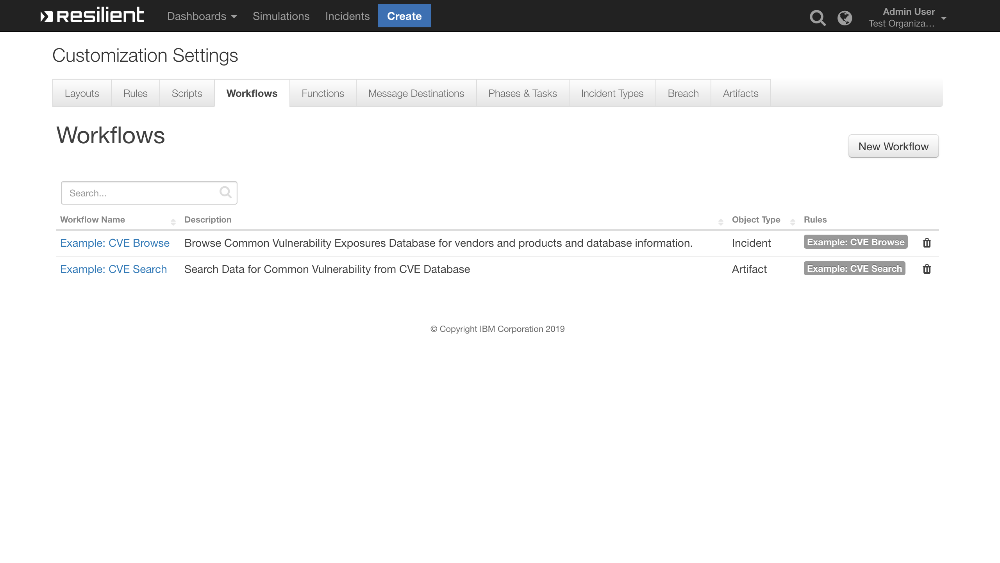

# CVE Search Function for IBM Resilient

 ## Table of Contents  
 - [About This Package](#about-this-package)
 - [Prerequisites](#prerequisites)
 - [Installation](#installation)
 - [Data Table](#data-table)
 - [Function Inputs](#function-inputs)
 - [Function Output](#function-output)
 - [Pre-Process Script](#pre-process-script)
 - [Post-Process Script](#post-process-script)
 - [Rules](#rules)
 - [CVE Search Function Usage](#using-the-cve-function)
 ---
 
 ## About This Package:
**This package contains a Resilient Function that allows you to search for Common Vulnerability Exposures (CVE) from Database.**
* Function implements different ways to search the database such as:  
	* Browse  
	* Search  
	* Specific CVE ID  
	* Last 30 CVE's  
	* CVE Database Information  
	
* The function makes use of the CVE `https://cve.circl.lu/api/{search param}/{vendor name}/{product name}` API call to get  information on a given query   
* More Information on [CVE Search Database](https://www.circl.lu/services/cve-search/)


### CVE Search Function layout:

### CVE Search Pre-Process Script 

### CVE Search Post-Process Script

### CVE Browse Function layout:

### CVE Browse Pre-Process Script

### CVE Browse Post-Process Script

## Prerequisites:  
  
* Resilient Appliance >= v31.0.0
* Integrations Server running resilient_circuits >= v30.0.0
      
## Installation  
  
This package requires that it is installed on a RHEL or CentOS platform and uses the resilient-circuits framework.  
* Download the `.zip` file from our App Exchange and extract it. You will find a file called: `fn_cve_search-<version>.tar.gz`
* Copy this file to your Integrations Server
 * To install the package, run:
`pip install fn_cve_search-<version>.tar.gz`  

* To import the function, example rules,data tables and workflows into your Resilient Appliance, run:
    ```
    $ resilient-circuits customize -y -l fn-cve-search
    ``` 
* To update your `app.config` file with the required CVE Search configurations, run:
 
	 `resilient-circuits config -u`   
* Then open your `app.config` file and check the following configuration data is added:
	```
	[fn_cve_search]
	# Flag display maximum CVE Entries on the resilient table
	max_results_display = 50
	# Base URL of Common Vulnerability Exposures Data Base.
	cve_base_url = https://cve.circl.lu/api
	```  
	Edit the `max_results_display` counter value to limit the maximum no of search results to display on table.
*  To uninstall CVE Function from Resilient Run the following :
 `pip uninstall fn_cve_search` 
 
## Data Table
### Data Table Utils: CVE Searched Data

#### API Name :
cve_data

#### Columns:
| Column Name | API Access Name | Type |
| ----------- | --------------- | -----|
| CVE ID | `cve_id` | `Text` |
|Published Date|`published_date`|`Date Picker`|
|Summary|`summary`|`Text`|
|References|`references`|`Text Area`|
|Vulnerability Config|`vulnerability_configuration`|`Text Area`|
|Vulnerable Config Cpe 2 2|`vulnerable_configuration_cpe_2_2`|`Text Area`|

#### Display the Data table in an Incident
* In order to **display** the CVE Searched Data Table in your Incident, you must **modify your Layout Settings**
1. Go to **Customization Settings** > **Layouts** > **Incident Tabs** > **+ Add Tab**
	
      
2. Enter **Tab Text**: `CVE SEARCH DATA` and click **Add**
 
3. **Drag** the Data table into the middle and click **Save**
 
4. Create a new Incident and you will now see the **My Test Tab** with the ** CVE Searched Data Table**
  
 ## Function Inputs
 
 #### CVE Search Function
|Input Name |Type  |Required|Example|Info|
|--|--|--|--|--|
|`cve_search_data` | `String` |yes | `python`|A artifact data to search for cve |
|`cve_search_criteria`|`Select`| yes|`Search` |CVE Search Criteria i.e Search(For Specific Product from Vendor),CVE ID(get cve per cve id),Last 30 CVES(get last 30 cves including CAPEC CWE and CPE Expansation) |
|`cve_id`|`String`  |yes |`CVE-2008-3949` |Specific vulnerability ID |
|`cve_vendor`|`String`|yes| `microsoft`|a vendor name to search for cve |
|`cve_product`|`String`|yes|`excel`|Name of the Product to Search in CVE Database|
|`cve_published_date_from`|`Date Picker`|yes|`03/01/2019`|Select CVE Published Date|
|`cve_published_date_to`|`Date Picker`|yes|`03/01/2019`|End date range to search cve data|

#### CVE Browse Function
|Input Name |Type  |Required|Example|Info|
|--|--|--|--|--|
| `cve_browse_data` |`Text`|yes  | `Name of the Incident`|A incident Name to be browse for vendor and product |
|`cve_browse_criteria` |`select` |yes |`Browse` | CVE Browse Criteria i.e Browse(For Vendors & Product),CVE DB Info(get information about current cve database)|
|`cve_vendor`|`text`|yes | `apple`|a vendor name to browse for cve |

## Function Output  
* To see the output of each of the API calls for this Function, we recommend running `resilient-circuits` in `DEBUG` mode.
* To do this run:
    ```
    $ resilient-circuits run --loglevel=DEBUG
    ```
## Pre-Process Script
* CVE Browse 
This example sets the `cve_browse_data`, `cve_browse_criteria`, `cve_vendor` inputs to the name of incident and entered vendor name  and selections to user took action on 
```python
# Name of the Incident
inputs.cve_browse_data = incident.name
# Search type browse on CVE Data base (may be Browse, CVE DB Info)
inputs.cve_browse_criteria = rule.properties.cve_browse_criteria
# Name of the vendor
inputs.cve_vendor = rule.properties.vendor
```
* CVE Search  
This example sets the `cve_search_data`, `cve_search_criteria`, `cve_id`, `cve_vendor`, `cve_product`, `cve_published_date_from`, `cve_published_date_to`
inputs to search selections user took on action and name of vendor , product and date range to limit the search results. 
```python
# value of the artifact 
inputs.cve_search_data = artifact.value
# cve search criteria (may be any string Search,CVE ID,Last 30 CVES)
inputs.cve_search_criteria = rule.properties.cve_search_criteria
# Specific CVE ID
inputs.cve_id = rule.properties.cve_id
# Name of the Vendor 
inputs.cve_vendor = rule.properties.vendor
# Name of the product
inputs.cve_product = rule.properties.product
# Search CVE Data from Date
inputs.cve_published_date_from = rule.properties.cve_published_date_from
# Search CVE Data upto Date
inputs.cve_published_date_to = rule.properties.cve_published_date_to
```
## Post-Process Script
 It can be parsed within the post-process script as `results.get("content")`. Based on the api_call type  the data can be represented as user needs.  
 By default `Example: CVE Browse` function data is displayed on incident Notes,   
    and `Example: CVE Search` function data displayed on the `CVE searched Data` Table.
* CVE Search Function
```python
#globals
ENTRY_TO_DATATABLE_MAP = {
     "cve": "cve_id",
     "pubdte": "published_date",
     "sum": "summary",
     "ref": "references",
     "vc": "vulnerability_configuration",
     "vc2": "vulnerable_configuration_cpe_2_2"
}

api_call_type = results['api_call']
output_data = results['content']
api_call_type_text = "<p><b>api call type :</b> {}</p>"
browse_rich_text = "<p><b>{}&ensp:&ensp</b>{}&ensp&ensp</p>"
rich_text_tmp = ""

#Adding data to table
ref_link_text = ""
if output_data:
     for dict_element in output_data:
          rich_text_tmp = ""
          table_row_object = incident.addRow("cve_data")
          for key_data,value_data in dict_element.items():
               if key_data == 'Published':
                    table_row_object[ENTRY_TO_DATATABLE_MAP["pubdte"]] = int(value_data)
               elif key_data == 'id':
                    table_row_object[ENTRY_TO_DATATABLE_MAP["cve"]] = value_data
               elif key_data == 'summary':
                    table_row_object[ENTRY_TO_DATATABLE_MAP["sum"]] = value_data
               elif key_data == 'references':
                    for link_url in value_data:
                         ref_link_text += '<p><a href="{0}">{0}</a></p>'.format(link_url)
                    table_row_object[ENTRY_TO_DATATABLE_MAP["ref"]] = ref_link_text
               elif key_data == 'vulnerable_configuration':
                    if value_data:
                         for vc_collection in value_data:
                              if isinstance(vc_collection,dict):
                                   for key_data,value_data in vc_collection.items():
                                        text = browse_rich_text.format(key_data,value_data)     
                                        rich_text_tmp += text
                              else:
                                   rich_text_tmp += "<p>{}</p>".format(vc_collection)
                    else:
                         rich_text_tmp = "No Data"
                    table_row_object[ENTRY_TO_DATATABLE_MAP["vc"]] = rich_text_tmp
               elif key_data == 'vulnerable_configuration_cpe_2_2':
                    rich_text_tmp_2 = ''
                    if value_data:
                         for vc_collection in value_data:
                              rich_text_tmp_2 += "<p>{}</p>".format(vc_collection)
                    else:
                         rich_text_tmp_2 = "No Data"
                    table_row_object[ENTRY_TO_DATATABLE_MAP["vc2"]] = rich_text_tmp_2
else:
     incident.addNote("No Data Returned from CVE Search..!")
```
* CVE Browse 
```python
api_call_type = results['api_call']
output_data = results['content']
api_call_type_text = "<p><b>api call type :</b> {}</p>"
browse_rich_text = "<p><b>{}&ensp:&ensp</b>{}&ensp&ensp</p>"
rich_text_tmp = ""
#Adding Browse data and Database information Notes Section
api_call_type_text = api_call_type_text.format(api_call_type)
browse_rich_text_final = ""
#if api_call_type == 'browse':
if output_data:
     for x in output_data:
          for key_data,value_data in x.items():
               text = browse_rich_text.format(key_data,value_data)
               api_call_type_text += text
     browse_rich_text_final = helper.createRichText(api_call_type_text)
else:
     browse_rich_text_final = 'No Searched Data returned..!'
incident.addNote(browse_rich_text_final)
```
## Rules  
  
| Rule Name | Object Type | Workflow Triggered |Activity Fields|  
| --------- | :---------: | ------------------ |---------------|  
| Example: CVE Browse | `Incident` | `Example: CVE Browse` |`CVE Browse Criteria` values : Browse, CVE DB Info, `CVE Vendor`  
| Example: CVE Search | `Artifact` | `Example: CVE Search` |`CVE Search Criteria` values : Search, Specific CVE ID, Last 30 CVES, `CVE ID`, `CVE Vendor`, `CVE Product`, `CVE Published Date From`, `CVE Published Date To`

 **CVE Function offers below search configurations to query vulnerabilities from DB**  
   
 1. Browse :   
      
    * Select Browse and all other inputs are empty results all the vendor list from Database  
    * Select Browse with vendor name given returns all the products associated with the vendor  
      
 2. Search :  
    * Select Search with all other inputs are empty results all the vendor list from Database  
    * Select Search with vendor name given returns all the vulnerabilities associated with   
        given vendor and no of results returned will be limited by given date range and   
        `max_results_display` flag.  
    * Select Search with product name given returns all the vulnerabilities associated with   
        given product and no of results returned will be limited by given date range and   
        `max_results_display` flag.  
    * Select Search with vendor, product name given returns all the vulnerabilities associated with   
        given vendor's product, and no of results returned will be limited by given date range and   
        `max_results_display` flag.  
          
 3. Specific CVE ID  
    * Select Specific CVE ID option from CVE Search Criteria with CVE ID of Vulnerability, returns  
      data related to specific CVE ID & populates into CVE table.  
        
 4. Last 30 CVES  
    * Returns last 30 latest Vulnerabilities from Database no of results returned controlled by   
       `max_results_display` flag.  
       
 5. CVE DB Info  
    * To get more information about the current databases in use and when it was updated   
          
       
## Function Payload Data Format  
  The Payload from the function will be always in the JSON format sample out format is given.  
  Basically `api_call` key is used to segregate the data.  
    
 { "content": [list of Retruned JSON Object], "api_call": last/browse/search/cve/db } 
    
## Using the CVE Function  
  
There are two functions a) Example: CVE Browse  b) Example: CVE Search  
  
* Example CVE Browse :   
* 
   This function can be accessed on the incidents. which offers the capabilities to browse 	for vendors and products,  
    current CVE  data base information.  
      
* Example: CVE Search :   
  
   This function can be accessed on the artifacts. which offers the capabilities to search for product & vendor   
    vulnerabilities, search for specific CVE's data, latest vulnerabilities added to databases.  