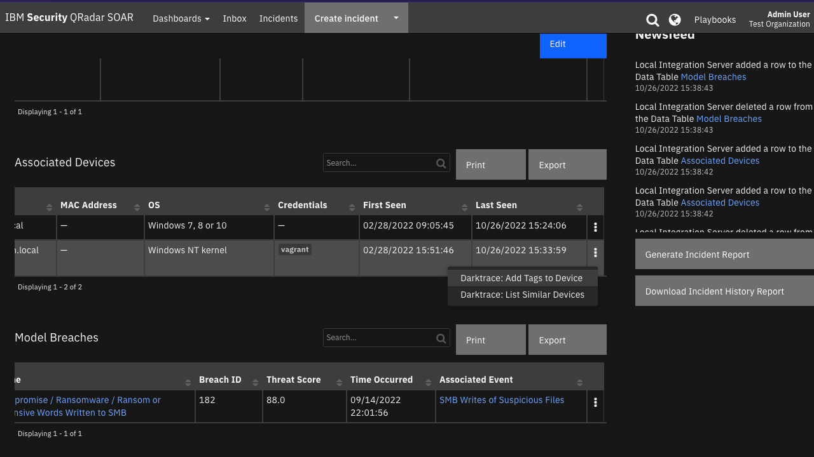

<!--
  This README.md is generated by running:
  "resilient-sdk docgen -p fn_darktrace"

  It is best edited using a Text Editor with a Markdown Previewer. VS Code
  is a good example. Checkout https://guides.github.com/features/mastering-markdown/
  for tips on writing with Markdown

  All fields followed by "::CHANGE_ME::"" should be manually edited

  If you make manual edits and run docgen again, a .bak file will be created

  Store any screenshots in the "doc/screenshots" directory and reference them like:
  

  NOTE: If your app is available in the container-format only, there is no need to mention the integration server in this readme.
-->

# Darktrace <!-- omit in toc -->

## Table of Contents <!-- omit in toc -->

- [Release Notes](#release-notes)
- [Overview](#overview)
  - [Key Features](#key-features)
- [Requirements](#requirements)
  - [SOAR platform](#soar-platform)
  - [Cloud Pak for Security](#cloud-pak-for-security)
  - [Proxy Server](#proxy-server)
  - [Python Environment](#python-environment)
- [Installation](#installation)
  - [Install](#install)
  - [App Configuration](#app-configuration)
  - [Custom Layouts](#custom-layouts)
- [Function - Darktrace: Acknowledge Incident Event](#function---darktrace-acknowledge-incident-event)
- [Function - Darktrace: Acknowledge Model Breach](#function---darktrace-acknowledge-model-breach)
- [Function - Darktrace: Add Device Tags](#function---darktrace-add-device-tags)
- [Function - Darktrace: Clear Data Table](#function---darktrace-clear-data-table)
- [Function - Darktrace: Get Devices](#function---darktrace-get-devices)
- [Function - Darktrace: Get Incident Events](#function---darktrace-get-incident-events)
- [Function - Darktrace: Get Incident Group](#function---darktrace-get-incident-group)
- [Function - Darktrace: List Similar Devices](#function---darktrace-list-similar-devices)
- [Function - Darktrace: Unacknowledge Incident Event](#function---darktrace-unacknowledge-incident-event)
- [Function - Darktrace: Unacknowledge Model Breach](#function---darktrace-unacknowledge-model-breach)
- [Script - Parse Darktrace Details to Incident Properties](#script---parse-darktrace-details-to-incident-properties)
- [Script - Parse Darktrace Device Details to Artifacts](#script---parse-darktrace-device-details-to-artifacts)
- [Script - Parse Darktrace Device Details to Data Table](#script---parse-darktrace-device-details-to-data-table)
- [Script - Parse Darktrace Incident Events Details to Data Table](#script---parse-darktrace-incident-events-details-to-data-table)
- [Script - Parse Darktrace Model Breaches Details to Data Table](#script---parse-darktrace-model-breaches-details-to-data-table)
- [Data Table - Associated Devices](#data-table---associated-devices)
- [Data Table - Incident Events](#data-table---incident-events)
- [Data Table - Model Breaches](#data-table---model-breaches)
- [Custom Fields](#custom-fields)
- [Playbooks](#playbooks)
- [Troubleshooting & Support](#troubleshooting--support)

---

## Release Notes
<!--
  Specify all changes in this release. Do not remove the release 
  notes of a previous release
-->
| Version | Date | Notes |
| ------- | ---- | ----- |
| 1.0.0 | 11/2022 | Initial Release |

---

## Overview
**IBM SOAR app for bi-directional synchronization with Darktrace Threat Visualizer**

 

Bi-directional poller app for Darktrace. A poller provides near real-time pulls of AI Analyst Events as they are created and creates 
a case in SOAR for each group of events.

As new events are added to a group, the case automatically updates with the new data.

Also provides functionality for acknowledging an event, group, or breach,
        sending notes to Darktrace, listing similar devices in Darktrace,
        and getting external endpoint details from Darktrace.

### Key Features
* Automatic syncronization of Incident Events and their associated Model Breaches and Devices from Darktrace to SOAR.
* Manual rules in SOAR to enhance cases with details from Darktrace.
* Manual rules in SOAR to acknowledge or unacknowledge entities in Darktrace.
* Manual rules in SOAR to add new tags to entities in order to trigger certain actions in Darktrace.

---

## Requirements
This app supports the IBM Security QRadar SOAR Platform and the IBM Security QRadar SOAR for IBM Cloud Pak for Security. See [Endpoint Developed With](#endpoint-developed-with) section for details on Darktrace requirements.

### SOAR platform
The SOAR platform supports two app deployment mechanisms, Edge Gateway (formerly App Host) and integration server.

If deploying to a SOAR platform with an Edge Gateway, the requirements are:
* SOAR platform >= `45.0.0`.
* The app is in a container-based format (available from the AppExchange as a `zip` file).

If deploying to a SOAR platform with an integration server, the requirements are:
* SOAR platform >= `45.0.0`.
* The app is in the older integration format (available from the AppExchange as a `zip` file which contains a `tar.gz` file).
* Integration server is running `resilient-circuits>=47.0.0`.
* If using an API key account, make sure the account provides the following minimum permissions: 
  | Name | Permissions |
  | ---- | ----------- |
  | Org Data | Read |
  | Function | Read |
  | Incidents | Read & Create |
  | Edit Incidents | Fields, Status, & Notes |
  | Layouts | Read & Edit |

The following SOAR platform guides provide additional information: 
* _Edge Gateway Deployment Guide_ or _App Host Deployment Guide_: provides installation, configuration, and troubleshooting information, including proxy server settings. 
* _Integration Server Guide_: provides installation, configuration, and troubleshooting information, including proxy server settings.
* _System Administrator Guide_: provides the procedure to install, configure and deploy apps. 

The above guides are available on the IBM Documentation website at [ibm.biz/soar-docs](https://ibm.biz/soar-docs). On this web page, select your SOAR platform version. On the follow-on page, you can find the _Edge Gateway Deployment Guide_, _App Host Deployment Guide_, or _Integration Server Guide_ by expanding **Apps** in the Table of Contents pane. The System Administrator Guide is available by expanding **System Administrator**.

### Cloud Pak for Security
If you are deploying to IBM Cloud Pak for Security, the requirements are:
* IBM Cloud Pak for Security >= `1.9.1`.
* Cloud Pak is configured with an Edge Gateway.
* The app is in a container-based format (available from the AppExchange as a `zip` file).

The following Cloud Pak guides provide additional information: 
* _Edge Gateway Deployment Guide_ or _App Host Deployment Guide_: provides installation, configuration, and troubleshooting information, including proxy server settings. From the Table of Contents, select Case Management and Orchestration & Automation > **Orchestration and Automation Apps**.
* _System Administrator Guide_: provides information to install, configure, and deploy apps. From the IBM Cloud Pak for Security IBM Documentation table of contents, select Case Management and Orchestration & Automation > **System administrator**.

These guides are available on the IBM Documentation website at [ibm.biz/cp4s-docs](https://ibm.biz/cp4s-docs). From this web page, select your IBM Cloud Pak for Security version. From the version-specific IBM Documentation page, select Case Management and Orchestration & Automation.

### Proxy Server
The app supports a proxy server.

### Python Environment
Python 3.6 and Python 3.9 are supported.
Additional package dependencies may exist for each of these packages:
* `resilient-circuits>=47.0.0`

### Darktrace Development Version

This app has been implemented using:
| Product Name | Product Version | API Version |
| ------------ | --------------- | ----------- |
| Darktrace Threat Visualizer | v5.2 | v5.2 |

#### Prerequisites
* Darktrace instance with Threat Visualizer
* API Access Token and Secret generated from an admin account in Darktrace

---

## Installation

### Install
* To install or uninstall an App or Integration on the _SOAR platform_, see the documentation at [ibm.biz/soar-docs](https://ibm.biz/soar-docs).
* To install or uninstall an App on _IBM Cloud Pak for Security_, see the documentation at [ibm.biz/cp4s-docs](https://ibm.biz/cp4s-docs) and follow the instructions above to navigate to Orchestration and Automation.

### App Configuration
The following table provides the settings you need to configure the app. These settings are made in the app.config file. See the documentation discussed in the Requirements section for the procedure.

| Config | Required | Example | Description |
| ------ | :------: | ------- | ----------- |
| **darktrace_base_url** | Yes | `https://<instance>.cloud.darktrace.com` | *URL to your instance of Darktrace.* |
| **api_key** | Yes |  | *API Access Token generated in Darktrace.* |
| **api_secret** | Yes |  | *Secret associated with above API Token.* |
| **polling_interval** | Yes | `60` | *Number of **seconds** between polling queries for new findings. Use value 0 to disable automatic case creation from findings.* |
| **polling_lookback** | Yes | `120` | *Number of **minutes** to look back for new findings the first time the app starts or restarts.* |
| **auto_sync_darktrace_comments** | No | `True` | *Whether or not to sync comments from Darktrace to SOAR. Defaults to `True`.* |
| **exclude_did** | No | `1,4,99` | *Comma separated list of device IDs you wish to be excluded from syncronization.* |
| **locale** | No | `en_US` | *Language locale to use when pulling Incident Events and their descriptions. Defaults to `en_US`. See Darktrace Customer Portal for updated list of locale options.* |
| **min_score** | No | `0.0` | *Minimum incident score for the incident it is associated with to be synced to SOAR. Accepts values between 0 and 100. Defaults to 0.* |
| **saas_only** | No | `False` | *If `True`, restricts synced Darktrace incidents to only those that contain a minimum of one SaaS incident event. Defaults to `False`.* |
| **soar_create_case_template** | No | `/var/rescircuits/create_case.jinja` | *Path to override template for automatic case creation. See [Templates for SOAR Cases](#templates-for-soar-cases).* |
| **soar_update_case_template** | No | `/var/rescircuits/update_case.jinja` | *Path to override template for automatic case updating. See [Templates for SOAR Cases](#templates-for-soar-cases).* |
| **soar_close_case_template** | No | `/var/rescircuits/close_case.jinja` | *Path to override template for automatic case closing. See [Templates for SOAR Cases](#templates-for-soar-cases).* |

### Custom Layouts
* The app automatically creates a custom "Darktrace Incident" tab on first install. But more customization can be made in that tab:

  

### Templates for SOAR Cases
It may be necessary to modify the templates used to create, update, or close SOAR cases based on your required custom fields in SOAR.

This is especially relevant if you have required custom _close_ fields that need to be filled when closing a case in SOAR. If that is the case, be sure to implement a custom `close_case_template` and reference those required close fields in the template.

When overriding the template in App Host, specify the file path for each file as `/var/rescircuits`.

Below are the default templates used which can be copied, modified, and used with app_config's
`soar_create_case_template`, `soar_update_case_template`, and `soar_close_case_template` settings to override the default templates.

<details><summary>soar_create_case_template.jinja</summary>

```jinja
{
  {# JINJA template for creating a new SOAR incident from an endpoint #}
  
  "name": "Darktrace AI Analyst Incident - {{ incidentEvents|map(attribute='title')|join(', ') }}",
  "description": "<a target='_blank' href='{{ groupUrl }}'>AI Analyst Incident Event Group</a> created from Darktrace",
  {# start_date cannot be after discovered_date #}
  "discovered_date": {{ start }},
  "start_date": {{ start }},
  "plan_status": "A",
  "severity_code": "{{ category | soar_substitute(severity_mapping) }}",
  {# specify your custom fields for your endpoint solution #}
  "properties": {
    "darktrace_aianalyst_incident_group_id": "{{ id }}",
    "darktrace_incident_last_modified": {{ end }}
  },
  {# add comments as necessary #}
  "comments": [
    {
      "text": {
        "format": "html",
        "content": "<b>Created by Darktrace</b>"
      }
    }
  ]
}

```
</details>

<details><summary>soar_update_case_template.jinja</summary>

```jinja
{
  {# JINJA template for updating a new SOAR incident from an endpoint #}
  "properties": {
    "darktrace_incident_last_modified": {{ end }}
  }
}

```
</details>

<details><summary>soar_close_case_template.jinja</summary>

```jinja
{
  {# JINJA template for closing a SOAR incident using endpoint data #}
  "plan_status": "C",
  "resolution_id": "Resolved",
  "resolution_summary": "Acknowledged in Darktrace",
  "properties": {
    "darktrace_incident_last_modified": {{ end }},
    "darktrace_incident_group_acknowledged": "YesNo"
  }
}

```
</details>

---

## Function - Darktrace: Acknowledge Incident Event
Function to acknowledge an incident event or a list of incident events.

 

<details><summary>Inputs:</summary>
<p>

| Name | Type | Required | Tooltip |
| ---- | :--: | :------: | ------- |
| `darktrace_incident_event_id` | `text` | Yes | UUID of the incident event to un/acknowledge |

</p>
</details>

<details><summary>Outputs:</summary>
<p>

> **NOTE:** This example might be in JSON format, but `results` is a Python Dictionary on the SOAR platform.

```python
results = {
  "content": {
    "aianalyst": "SUCCESS"
  },
  "inputs": {
    "darktrace_incident_event_id": "da042c57-3e45-4e65-aca5-63dbcdf8df0c"
  },
  "metrics": {
    "execution_time_ms": 116,
    "host": "local",
    "package": "fn-darktrace",
    "package_version": "1.0.0",
    "timestamp": "2022-10-06 16:00:04",
    "version": "1.0"
  },
  "raw": null,
  "reason": null,
  "success": true,
  "version": 2.0
}
```

</p>
</details>

<details><summary>Example Pre-Process Script:</summary>
<p>

```python
inputs.darktrace_incident_event_id = row.darktrace_incident_events_dt_event_id
```

</p>
</details>

<details><summary>Example Post-Process Script:</summary>
<p>

```python
results = playbook.functions.results.acknowledge_inc_output

if results.success:
  unacknowledged = results.content.get("aianalyst")
  
  if unacknowledged.upper() == "SUCCESS":
    row.darktrace_incident_events_dt_acknowledged = "Yes"
    incident.addNote("Successfully acknowledged Incident Event {0}".format(row.darktrace_incident_events_dt_title.get("content")))

else:
  incident.addNote("Failed to acknowledge Incident Event {0}".format(row.darktrace_incident_events_dt_title.get("content")))

```

</p>
</details>

---
## Function - Darktrace: Acknowledge Model Breach
Function to acknowledge a model breach.

 

<details><summary>Inputs:</summary>
<p>

| Name | Type | Required | Tooltip |
| ---- | :--: | :------: | ------- |
| `darktrace_model_breach_pbid` | `text` | Yes | Model Breach ID (PBID) of breach to acknowledge |

</p>
</details>

<details><summary>Outputs:</summary>
<p>

> **NOTE:** This example might be in JSON format, but `results` is a Python Dictionary on the SOAR platform.

```python
results = {
  "content": {
    "response": "SUCCESS"
  },
  "inputs": {
    "darktrace_model_breach_pbid": "182"
  },
  "metrics": {
    "execution_time_ms": 123,
    "host": "local",
    "package": "fn-darktrace",
    "package_version": "1.0.0",
    "timestamp": "2022-10-06 16:00:29",
    "version": "1.0"
  },
  "raw": null,
  "reason": null,
  "success": true,
  "version": 2.0
}
```

</p>
</details>

<details><summary>Example Pre-Process Script:</summary>
<p>

```python
inputs.darktrace_model_breach_pbid = row.darktrace_model_breaches_dt_breach_id
```

</p>
</details>

<details><summary>Example Post-Process Script:</summary>
<p>

```python
results = playbook.functions.results.acknowledge_md_output

if results.success and results.get("content", {}).get("response", "").upper() == "SUCCESS":
  incident.addNote("Successfully acknowledged Darktrace Model Breach {0}".format(row.darktrace_model_breaches_dt_name.get("content")))
  row.darktrace_model_breaches_dt_acknowledged = "Yes"
elif results.success and results.get("content", {}).get("response", "").upper() == "ERROR":
  incident.addNote("Darktrace Model Breach {0} is already acknowledged in Darktrace".format(row.darktrace_model_breaches_dt_name.get("content")))
else:
  incident.addNote("Failed to acknowledge Darktrace Model Breach {0}".format(row.darktrace_model_breaches_dt_name.get("content")))
```

</p>
</details>

---
## Function - Darktrace: Add Device Tags
Function to add tag(s) to a device.

 
 

<details><summary>Inputs:</summary>
<p>

| Name | Type | Required | Example | Tooltip |
| ---- | :--: | :------: | ------- | ------- |
| `darktrace_device_id` | `text` | No | - | Device ID to add tags to |
| `darktrace_device_tags` | `text` | No | `DNS Server, Microsoft Device` | Comma-separated list of tags to add. |

</p>
</details>

<details><summary>Outputs:</summary>
<p>

> **NOTE:** This example might be in JSON format, but `results` is a Python Dictionary on the SOAR platform.

```python
results = {
  "content": {
    "added_tags": [
      "New Tag"
    ],
    "all_tags": [
      "This one already exists",
      "New Tag"
    ],
    "error_tags": [
      "This one already exists"
    ]
  },
  "inputs": {
    "darktrace_device_id": "9",
    "darktrace_device_tags": "Test,This one already exists"
  },
  "metrics": {
    "execution_time_ms": 267,
    "host": "local",
    "package": "fn-darktrace",
    "package_version": "1.0.0",
    "timestamp": "2022-10-10 15:56:42",
    "version": "1.0"
  },
  "raw": null,
  "reason": null,
  "success": true,
  "version": 2.0
}
```

</p>
</details>

<details><summary>Example Pre-Process Script:</summary>
<p>

```python
inputs.darktrace_device_id = row.darktrace_device_dt_id.get("content")
inputs.darktrace_device_tags = playbook.inputs.darktrace_device_tags
```

</p>
</details>

<details><summary>Example Post-Process Script:</summary>
<p>

```python
results = playbook.functions.results.add_tags_output

SPAN_FORMATTER = "<span class='label' rel='tooltip' title='{0}'>{0}</span>"

if results.success:
  added_tags = " ".join(SPAN_FORMATTER.format(tag) for tag in results.content.get("added_tags"))
  error_tags = " ".join(SPAN_FORMATTER.format(tag) for tag in results.content.get("error_tags"))
  all_tags = " ".join(SPAN_FORMATTER.format(tag) for tag in results.content.get("all_tags"))
  
  msg = ""
  if added_tags:
    msg += "Successfully added tag(s) {0} to device {1}.".format(added_tags, row.darktrace_device_dt_id.get("content"))
  if error_tags:
    if msg:
      msg += "\n"
    msg += "Failed to add tag(s) {0} because they weren't found in Darktrace. Create them in Darktrace first then you can add them to the device.".format(error_tags)
    
  incident.addNote(msg)
  row.darktrace_device_dt_tags = all_tags
else:
  incident.addNote("Failed to add tags {0} to device {1}. Error: {2}".format(results.inputs.get("darktrace_device_tags"), row.darktrace_device_dt_id, results.reason))
```

</p>
</details>

---
## Function - Darktrace: Clear Data Table
Clear a given data table so it can be updated

<details><summary>Inputs:</summary>
<p>

| Name | Type | Required |
| ---- | :--: | :------: |
| `darktrace_data_table_name` | `text` | Yes |
| `darktrace_soar_case_id` | `text` | No |

</p>
</details>

<details><summary>Outputs:</summary>
<p>

> **NOTE:** This example might be in JSON format, but `results` is a Python Dictionary on the SOAR platform.

```python
results = {
  "content": {},
  "inputs": {
    "darktrace_data_table_name": "darktrace_associated_devices_dt",
    "darktrace_soar_case_id": "2119"
  },
  "metrics": {
    "execution_time_ms": 976,
    "host": "local",
    "package": "fn-darktrace",
    "package_version": "1.0.0",
    "timestamp": "2022-11-10 16:46:34",
    "version": "1.0"
  },
  "raw": null,
  "reason": null,
  "success": true,
  "version": 2.0
}
```

</p>
</details>

<details><summary>Example Pre-Process Script:</summary>
<p>

```python
inputs.darktrace_soar_case_id = str(incident.id)
inputs.darktrace_data_table_name = "darktrace_associated_devices_dt"
```

</p>
</details>

---
## Function - Darktrace: Get Devices
Get the details of all the devices of an AI Analyst Incident


<details><summary>Inputs:</summary>
<p>

| Name | Type | Required | Example | Tooltip |
| ---- | :--: | :------: | ------- | ------- |
| `darktrace_incident_group_id` | `text` | Yes | `-` | Group ID of the incident to get devices from |

</p>
</details>

<details><summary>Outputs:</summary>
<p>

> **NOTE:** This example might be in JSON format, but `results` is a Python Dictionary on the SOAR platform.

```python
results = {
  "content": {
    "base_device_url": "https://my.darktrace.com/#device/",
    "devices": [
      {
        "did": 4,
        "endtime": 1668116335000,
        "hostname": "dc.windomain.local",
        "id": 4,
        "ip": "0.0.0.0",
        "ips": [
          {
            "ip": "0.0.0.0",
            "sid": 1,
            "time": "2022-11-10 21:00:00",
            "timems": 1668114000000
          }
        ],
        "os": "Windows 7, 8 or 10",
        "sid": 1,
        "tags": [
          {
            "data": {
              "auto": false,
              "color": 200,
              "description": "",
              "visibility": ""
            },
            "expiry": 0,
            "isReferenced": true,
            "name": "Admin",
            "restricted": false,
            "thid": 16,
            "tid": 16
          },
          {
            "data": {
              "auto": false,
              "color": 112,
              "description": "Devices receiving and making DNS queries",
              "visibility": "Public"
            },
            "expiry": 0,
            "isReferenced": true,
            "name": "DNS Server",
            "restricted": false,
            "thid": 22,
            "tid": 22
          },
          {
            "data": {
              "auto": false,
              "color": 168,
              "description": "",
              "visibility": "Public"
            },
            "expiry": 0,
            "isReferenced": true,
            "name": "Microsoft Windows",
            "restricted": false,
            "thid": 29,
            "tid": 29
          },
          {
            "data": {
              "auto": false,
              "color": 0,
              "description": "",
              "visibility": "Public"
            },
            "expiry": 0,
            "isReferenced": false,
            "name": "Test",
            "restricted": false,
            "thid": 113,
            "tid": 113
          }
        ],
        "time": 1646057145000,
        "typelabel": "DNS Server",
        "typename": "dnsserver"
      }
    ]
  },
  "inputs": {
    "darktrace_incident_group_id": "g53091596-76ed-48e3-90d1-7f93ed7954ef"
  },
  "metrics": {
    "execution_time_ms": 239,
    "host": "local",
    "package": "fn-darktrace",
    "package_version": "1.0.0",
    "timestamp": "2022-11-10 16:46:31",
    "version": "1.0"
  },
  "raw": null,
  "reason": null,
  "success": true,
  "version": 2.0
}
```

</p>
</details>

<details><summary>Example Pre-Process Script:</summary>
<p>

```python
inputs.darktrace_incident_group_id = incident.properties.darktrace_aianalyst_incident_group_id
```

</p>
</details>

<details><summary>Example Script to Fill Data Table:</summary>
<p>

```python
DEVICE_DT_NAME = "darktrace_associated_devices_dt"
URL_FORMATTER = "<a target='_blank' href='{0}'>{1}</a>"
SPAN_FORMATTER = "<span class='label' rel='tooltip' title='{0}'>{0}</span>"

devices = playbook.functions.results.devices_output.get("content", {}).get("devices")
base_device_url = playbook.functions.results.devices_output.get("content", {}).get("base_device_url")

for device in devices:
  
  row = incident.addRow(DEVICE_DT_NAME)
  
  row.darktrace_device_dt_id = URL_FORMATTER.format(f"{base_device_url}{str(device.get('id'))}", str(device.get("id"))) if device.get("id") else None
  row.darktrace_device_dt_label = device.get("devicelabel")
  row.darktrace_device_dt_type = device.get("typelabel")
  row.darktrace_device_dt_tags = " ".join([SPAN_FORMATTER.format(t.get("name")) for t in device.get("tags", [])]) if device.get("tags") else None
  row.darktrace_device_dt_ip = device.get("ip")
  row.darktrace_device_dt_hostname = device.get("hostname")
  row.darktrace_device_dt_mac_address = device.get("macaddress")
  row.darktrace_device_dt_os = device.get("os")
  row.darktrace_device_dt_credentials = " ".join([SPAN_FORMATTER.format(c.get("credential")) for c in device.get("credentials", [])]) if device.get("credentials") else None
  row.darktrace_device_dt_first_seen = device.get("time")
  row.darktrace_device_dt_last_seen = device.get("endtime")
```

</p>
</details>

---
## Function - Darktrace: Get Incident Events
Get the details of all the incident events of an AI Analyst Incident Group

<details><summary>Inputs:</summary>
<p>

| Name | Type | Required | Example | Tooltip |
| ---- | :--: | :------: | ------- | ------- |
| `darktrace_incident_group_id` | `text` | Yes | `-` | Group ID to get incident events from |
| `darktrace_include_model_breach_data` | `boolean` | No | `-` | If `True`, detailed Model breach data will be returned. Defaults to `False` |

</p>
</details>

<details><summary>Outputs:</summary>
<p>

> **NOTE:** This example might be in JSON format, but `results` is a Python Dictionary on the SOAR platform.

```python
results = {
  "content": {
    "base_model_breach_url": "https://my.darktrace.com/#modelbreach/",
    "incident_events": [
      {
        "acknowledged": false,
        "activityId": "da39a3ee",
        "aiaScore": 52.0,
        "attackPhases": [
          5
        ],
        "breachDevices": [
          {
            "did": 9,
            "hostname": "win10.windomain.local",
            "identifier": "win10.windomain.local",
            "ip": "0.0.0.0",
            "mac": null,
            "sid": 1,
            "subnet": null
          }
        ],
        "category": "suspicious",
        "children": [
          "da042c57-3e45-4e65-aca5-63dbcdf8df0c"
        ],
        "createdAt": 1663207439360,
        "currentGroup": "gda042c57-3e45-4e65-aca5-63dbcdf8df0c",
        "details": [
          [
            {
              "contents": [
                {
                  "key": "Source device",
                  "type": "device",
                  "values": [
                    {
                      "did": 9,
                      "hostname": "win10.windomain.local",
                      "identifier": "win10.windomain.local",
                      "ip": "0.0.0.0",
                      "mac": null,
                      "sid": 1,
                      "subnet": null
                    }
                  ]
                },
                {
                  "key": "Username observed prior to activity",
                  "type": "string",
                  "values": [
                    "vagrant"
                  ]
                },
                {
                  "key": "Source of username",
                  "type": "string",
                  "values": [
                    "NTLM login"
                  ]
                },
                {
                  "key": "Time observed",
                  "type": "timestamp",
                  "values": [
                    1663207315000
                  ]
                },
                {
                  "key": "Event UID",
                  "type": "string",
                  "values": [
                    "CxC9C21vzm9i5FmHse01"
                  ]
                }
              ],
              "header": "Breaching device"
            }
          ],
          [
            {
              "contents": [
                {
                  "key": "Filename",
                  "type": "string",
                  "values": [
                    "11.txt.txt.txt"
                  ]
                },
                {
                  "key": "Size",
                  "type": "dataVolume",
                  "values": [
                    100
                  ]
                },
                {
                  "key": "Destination device",
                  "type": "device",
                  "values": [
                    {
                      "did": 4,
                      "hostname": "dc.windomain.local",
                      "identifier": "dc.windomain.local",
                      "ip": "0.0.0.0",
                      "mac": null,
                      "sid": 1,
                      "subnet": null
                    }
                  ]
                },
                {
                  "key": "Destination share",
                  "type": "string",
                  "values": [
                    "\\\\0.0.0.00.0.0.0\\dummy_files"
                  ]
                },
                {
                  "key": "Time",
                  "type": "timestamp",
                  "values": [
                    1663207328000
                  ]
                },
                {
                  "key": "Filename",
                  "type": "string",
                  "values": [
                    "11.txt.txt"
                  ]
                },
                {
                  "key": "Size",
                  "type": "dataVolume",
                  "values": [
                    100
                  ]
                },
                {
                  "key": "Destination device",
                  "type": "device",
                  "values": [
                    {
                      "did": 4,
                      "hostname": "dc.windomain.local",
                      "identifier": "dc.windomain.local",
                      "ip": "0.0.0.0",
                      "mac": null,
                      "sid": 1,
                      "subnet": null
                    }
                  ]
                },
                {
                  "key": "Destination share",
                  "type": "string",
                  "values": [
                    "\\\\0.0.0.00.0.0.0\\dummy_files"
                  ]
                },
                {
                  "key": "Time",
                  "type": "timestamp",
                  "values": [
                    1663207328000
                  ]
                },
                {
                  "key": "Filename",
                  "type": "string",
                  "values": [
                    "27.txt.txt.txt"
                  ]
                },
                {
                  "key": "Size",
                  "type": "dataVolume",
                  "values": [
                    100
                  ]
                },
                {
                  "key": "Destination device",
                  "type": "device",
                  "values": [
                    {
                      "did": 4,
                      "hostname": "dc.windomain.local",
                      "identifier": "dc.windomain.local",
                      "ip": "0.0.0.0",
                      "mac": null,
                      "sid": 1,
                      "subnet": null
                    }
                  ]
                },
                {
                  "key": "Destination share",
                  "type": "string",
                  "values": [
                    "\\\\0.0.0.00.0.0.0\\dummy_files"
                  ]
                },
                {
                  "key": "Time",
                  "type": "timestamp",
                  "values": [
                    1663207329000
                  ]
                }
              ],
              "header": "Files Written"
            }
          ]
        ],
        "externalTriggered": false,
        "groupByActivity": false,
        "groupCategory": "suspicious",
        "groupPreviousGroups": [],
        "groupScore": 0.9796746496148376,
        "groupingIds": [
          "0ade7c2c"
        ],
        "id": "da042c57-3e45-4e65-aca5-63dbcdf8df0c",
        "incidentEventUrl": "https://my.darktrace.com/#aiaincidentevent/da042c57-3e45-4e65-aca5-63dbcdf8df0c",
        "periods": [
          {
            "end": 1663207329000,
            "start": 1663207328000
          }
        ],
        "pinned": true,
        "relatedBreaches": [
          {
            "acknowledged": false,
            "aianalystData": [
              {
                "related": [
                  182
                ],
                "summariser": "SmbWriteSummary",
                "uuid": "da042c57-3e45-4e65-aca5-63dbcdf8df0c"
              }
            ],
            "commentCount": 0,
            "creationTime": 1663207327000,
            "device": {
              "credentials": [
                "vagrant"
              ],
              "did": 9,
              "firstSeen": 1646081506000,
              "hostname": "win10.windomain.local",
              "ip": "0.0.0.0",
              "ips": [
                {
                  "ip": "0.0.0.0",
                  "sid": 1,
                  "time": "2022-11-10 21:00:00",
                  "timems": 1668114000000
                }
              ],
              "lastSeen": 1668115594000,
              "sid": 1,
              "typelabel": "Desktop",
              "typename": "desktop"
            },
            "model": {
              "now": {
                "actions": {
                  "alert": true,
                  "antigena": {},
                  "breach": true,
                  "model": true,
                  "setPriority": false,
                  "setTag": false,
                  "setType": false
                },
                "active": true,
                "activeTimes": {
                  "devices": {},
                  "tags": {},
                  "type": "exclusions",
                  "version": 2
                },
                "autoSuppress": true,
                "autoUpdatable": true,
                "autoUpdate": true,
                "behaviour": "decreasing",
                "category": "Suspicious",
                "compliance": false,
                "created": {
                  "by": "System"
                },
                "delay": 0,
                "description": "A device is writing suspicious terms to network file shares that may indicate a threat. This is particularly relevant for ransomware infections that overwrite internal data.\\n\\nAction: Investigate the file writes that are occurring to see if they are overwriting important internal data.",
                "edited": {
                  "by": "System"
                },
                "interval": 300,
                "logic": {
                  "data": [
                    {
                      "cid": 8330,
                      "weight": 1
                    },
                    {
                      "cid": 8328,
                      "weight": 1
                    },
                    {
                      "cid": 8329,
                      "weight": 1
                    }
                  ],
                  "targetScore": 1,
                  "type": "weightedComponentList",
                  "version": 1
                },
                "message": "Added new regex filter to the last component",
                "modified": "2022-09-22 11:48:13",
                "name": "Compromise::Ransomware::Ransom or Offensive Words Written to SMB",
                "phid": 3000,
                "pid": 629,
                "priority": 4,
                "sequenced": false,
                "sharedEndpoints": true,
                "tags": [
                  "AP: Exploit"
                ],
                "throttle": 3600,
                "uuid": "80010119-6d7f-0000-0305-5e0000000325",
                "version": 100
              },
              "then": {
                "actions": {
                  "alert": true,
                  "antigena": {},
                  "breach": true,
                  "model": true,
                  "setPriority": false,
                  "setTag": false,
                  "setType": false
                },
                "active": true,
                "activeTimes": {
                  "devices": {},
                  "tags": {},
                  "type": "exclusions",
                  "version": 2
                },
                "autoSuppress": true,
                "autoUpdatable": true,
                "autoUpdate": true,
                "behaviour": "decreasing",
                "category": "Suspicious",
                "compliance": false,
                "created": {
                  "by": "System"
                },
                "delay": 0,
                "description": "A device is writing suspicious terms to network file shares that may indicate a threat. This is particularly relevant for ransomware infections that overwrite internal data.\\n\\nAction: Investigate the file writes that are occurring to see if they are overwriting important internal data.",
                "edited": {
                  "by": "System"
                },
                "interval": 300,
                "logic": {
                  "data": [
                    {
                      "cid": 8067,
                      "weight": 1
                    },
                    {
                      "cid": 8065,
                      "weight": 1
                    },
                    {
                      "cid": 8066,
                      "weight": 1
                    }
                  ],
                  "targetScore": 1,
                  "type": "weightedComponentList",
                  "version": 1
                },
                "modified": "2022-09-05 15:04:11",
                "name": "Compromise::Ransomware::Ransom or Offensive Words Written to SMB",
                "phid": 2865,
                "pid": 629,
                "priority": 4,
                "sequenced": false,
                "sharedEndpoints": true,
                "tags": [
                  "AP: Exploit"
                ],
                "throttle": 3600,
                "uuid": "80010119-6d7f-0000-0305-5e0000000325",
                "version": 99
              }
            },
            "modelName": "Compromise / Ransomware / Ransom or Offensive Words Written to SMB",
            "pbid": 182,
            "score": 0.871,
            "threatScore": 88.0,
            "time": 1663207316000,
            "timestamp": 1663207316000,
            "triggeredComponents": [
              {
                "cbid": 186,
                "chid": 10353,
                "cid": 8065,
                "interval": 300,
                "logic": {
                  "data": {
                    "left": {
                      "left": "A",
                      "operator": "AND",
                      "right": {
                        "left": "C",
                        "operator": "AND",
                        "right": {
                          "left": "E",
                          "operator": "AND",
                          "right": "F"
                        }
                      }
                    },
                    "operator": "OR",
                    "right": {
                      "left": "B",
                      "operator": "AND",
                      "right": {
                        "left": "C",
                        "operator": "AND",
                        "right": "F"
                      }
                    }
                  },
                  "version": "v0.1"
                },
                "metric": {
                  "label": "SMB Move Success",
                  "mlid": 291,
                  "name": "smbmovesuccess"
                },
                "size": 5,
                "threshold": 4,
                "time": 1663207315000,
                "triggeredFilters": [
                  {
                    "arguments": {
                      "value": "someregex"
                    },
                    "cfid": 71760,
                    "comparatorType": "matches regular expression",
                    "filterType": "Message",
                    "id": "A",
                    "trigger": {
                      "value": "share=\\\\0.0.0.0\\dummy_files file=\u003cn/a\u003e rename=0.txt.txt.txt.txt.txt.txt.txt.txt.txt.txt.txt.lockbit version=smb2 account=vagrant"
                    }
                  },
                  {
                    "arguments": {
                      "value": "out"
                    },
                    "cfid": 71762,
                    "comparatorType": "is",
                    "filterType": "Direction",
                    "id": "C",
                    "trigger": {
                      "value": "out"
                    }
                  },
                  {
                    "arguments": {
                      "value": "BackupData.dat.locked"
                    },
                    "cfid": 71763,
                    "comparatorType": "does not contain",
                    "filterType": "Message",
                    "id": "E",
                    "trigger": {
                      "value": "share=\\\\0.0.0.0\\dummy_files file=\u003cn/a\u003e rename=0.txt.txt.txt.txt.txt.txt.txt.txt.txt.txt.txt.lockbit version=smb2 account=vagrant"
                    }
                  },
                  {
                    "arguments": {},
                    "cfid": 71764,
                    "comparatorType": "is",
                    "filterType": "Unique message fields",
                    "id": "F",
                    "trigger": {
                      "value": "true"
                    }
                  },
                  {
                    "arguments": {},
                    "cfid": 71765,
                    "comparatorType": "display",
                    "filterType": "Message",
                    "id": "d1",
                    "trigger": {
                      "value": "share=\\\\0.0.0.0\\dummy_files file=\u003cn/a\u003e rename=0.txt.txt.txt.txt.txt.txt.txt.txt.txt.txt.txt.lockbit version=smb2 account=vagrant"
                    }
                  }
                ]
              }
            ]
          }
        ],
        "summariser": "SmbWriteSummary",
        "summary": "The device win10.windomain.local was observed transferring suspicious files over SMB to dc.windomain.local.\n\nThis activity was identified as unusual compared to the source device\u0027s normal SMB activity.\n\nSuch transfers may indicate an attempt to move laterally through the network, by transferring malicious software to victim devices before executing it.\n\nConsequently, if this activity was not expected, the security team may wish to determine the reason for these file transfers.",
        "title": "SMB Writes of Suspicious Files",
        "userTriggered": false
      }
    ]
  },
  "inputs": {
    "darktrace_incident_group_id": "gda042c57-3e45-4e65-aca5-63dbcdf8df0c",
    "darktrace_include_model_breach_data": true
  },
  "metrics": {
    "execution_time_ms": 245,
    "host": "local",
    "package": "fn-darktrace",
    "package_version": "1.0.0",
    "timestamp": "2022-11-10 16:41:35",
    "version": "1.0"
  },
  "raw": null,
  "reason": null,
  "success": true,
  "version": 2.0
}
```

</p>
</details>

<details><summary>Example Pre-Process Script:</summary>
<p>

```python
inputs.darktrace_incident_group_id = incident.properties.darktrace_aianalyst_incident_group_id
inputs.darktrace_include_model_breach_data = False
```

</p>
</details>

<details><summary>Example Script to Parse Results to Data Table:</summary>
<p>

```python
EVENT_DT_NAME = "darktrace_incident_events_dt"
URL_FORMATTER = "<a target='_blank' href='{0}'>{1}</a>"

results = playbook.functions.results.incident_events_output

events = results.get("content", {}).get("incident_events")

for event in events:

  row = incident.addRow(EVENT_DT_NAME)

  row.darktrace_incident_events_dt_title = URL_FORMATTER.format(event.get("incidentEventUrl"), event.get("title"))
  row.darktrace_incident_events_dt_summary = event.get("summary")
  row.darktrace_incident_events_dt_acknowledged = "Yes" if event.get("acknowledged") else "No"
  row.darktrace_incident_events_dt_created_at = event.get("createdAt")
  row.darktrace_incident_events_dt_initiating_device_id = ", ".join(str(d.get("did")) for d in event.get("breachDevices"))
  row.darktrace_incident_events_dt_category = event.get("category")
  row.darktrace_incident_events_dt_ai_analyst_score = str(event.get("aiaScore"))
  row.darktrace_incident_events_dt_event_id = str(event.get("id"))
```

</p>
</details>

---
## Function - Darktrace: Get Incident Group
Get the details of all the incident events of an AI Analyst Incident Group

<details><summary>Inputs:</summary>
<p>

| Name | Type | Required | Tooltip |
| ---- | :--: | :------: | ------- |
| `darktrace_incident_group_id` | `text` | Yes | Group ID to get incident events from |

</p>
</details>

<details><summary>Outputs:</summary>
<p>

> **NOTE:** This example might be in JSON format, but `results` is a Python Dictionary on the SOAR platform.

```python
results = {
  "content": {
    "incident_group": {
      "acknowledged": false,
      "active": false,
      "category": "suspicious",
      "devices": [
        9,
        4
      ],
      "edges": [
        {
          "description": "SMB File Write",
          "details": [
            {
              "key": null,
              "type": "string",
              "values": [
                "11.txt.txt.txt",
                "11.txt.txt",
                "27.txt.txt.txt"
              ]
            }
          ],
          "incidentEvent": "da042c57-3e45-4e65-aca5-63dbcdf8df0c",
          "isAction": true,
          "source": {
            "nodeType": "device",
            "value": 9
          },
          "start": 1663207328000,
          "target": {
            "nodeType": "device",
            "value": 4
          }
        }
      ],
      "end": 1663207329000,
      "externalTriggered": false,
      "groupScore": 0.9796746496148376,
      "groupUrl": "https://my.cloud.darktrace.com/#aiagroup/gda042c57-3e45-4e65-aca5-63dbcdf8df0c",
      "id": "gda042c57-3e45-4e65-aca5-63dbcdf8df0c",
      "incidentEvents": [
        {
          "start": 1663207328000,
          "title": "SMB Writes of Suspicious Files",
          "triggerDid": 9,
          "uuid": "da042c57-3e45-4e65-aca5-63dbcdf8df0c",
          "visible": true
        }
      ],
      "initialDevices": [
        9
      ],
      "pinned": true,
      "previousIds": [],
      "start": 1663207328000,
      "userTriggered": false
    }
  },
  "inputs": {
    "darktrace_incident_group_id": "gda042c57-3e45-4e65-aca5-63dbcdf8df0c"
  },
  "metrics": {
    "execution_time_ms": 130,
    "host": "local",
    "package": "fn-darktrace",
    "package_version": "1.0.0",
    "timestamp": "2022-11-15 09:12:30",
    "version": "1.0"
  },
  "raw": null,
  "reason": null,
  "success": true,
  "version": 2.0
}
```

</p>
</details>

<details><summary>Example Pre-Process Script:</summary>
<p>

```python
inputs.darktrace_incident_group_id = incident.properties.darktrace_aianalyst_incident_group_id
```

</p>
</details>

<details><summary>Example Script to Refresh Incident Properties:</summary>
<p>

```python
results = playbook.functions.results.incident_group_output
group_content = results.get("content", {}).get("incident_group")

if results.get("success"):
  incident.properties.darktrace_incident_group_link = f"<a target='_blank' href='{group_content.get('groupUrl')}'>AI Analyst Incident</a>"
  incident.properties.darktrace_incident_group_acknowledged = "Yes" if group_content.get("acknowledged") else "No"
  incident.properties.darktrace_incident_last_modified = group_content.get("end")
  incident.properties.darktrace_incident_group_start_time = group_content.get("start")
  devices = group_content.get("devices")
  incident.properties.darktrace_associated_device_ids = f"{', '.join(map(str, devices))} ({len(devices)} total devices involved)"
  incident.properties.darktrace_initiating_device_ids = ', '.join(map(str, group_content.get('initialDevices', [])))
  category = group_content.get("category")
  incident.properties.darktrace_group_category = f"<span class='label' rel='tooltip' title='{category}'>{category.title()}</span>"
  incident.properties.darktrace_group_score = f"{group_content.get('groupScore', 0):.2f}"
  incident.properties.darktrace_number_of_events_in_group = f"{len(group_content.get('incidentEvents', []))}"

```

</p>
</details>

---
## Function - Darktrace: List Similar Devices
Function to list similar devices to the given device.

 
 

<details><summary>Inputs:</summary>
<p>

| Name | Type | Required | Example | Tooltip |
| ---- | :--: | :------: | ------- | ------- |
| `darktrace_device_count` | `number` | Yes | `4` | Number of similar devices to return |
| `darktrace_device_id` | `text` | No | - | Device ID to search for similar devices against |

</p>
</details>

<details><summary>Outputs:</summary>
<p>

> **NOTE:** This example might be in JSON format, but `results` is a Python Dictionary on the SOAR platform.

```python
results = {
  "content": {
    "base_url": "https://cloud.darktrace.com",
    "similar_devices": [
      {
        "did": 4,
        "firstSeen": 1646057145000,
        "hostname": "dc.windomain.local",
        "ip": "0.0.0.0",
        "ips": [
          {
            "ip": "0.0.0.0",
            "sid": 1,
            "time": "2022-10-11 18:00:00",
            "timems": 1665511200000
          }
        ],
        "lastSeen": 1665514547000,
        "os": "Windows 7, 8 or 10",
        "score": 99,
        "sid": 1,
        "typelabel": "DNS Server",
        "typename": "dnsserver"
      },
      {
        "did": 9,
        "firstSeen": 1646081506000,
        "hostname": "win10.windomain.local",
        "ip": "0.0.0.0",
        "ips": [
          {
            "ip": "0.0.0.0",
            "sid": 1,
            "time": "2022-10-11 18:00:00",
            "timems": 1665511200000
          }
        ],
        "lastSeen": 1665514495000,
        "os": "Windows NT kernel",
        "score": 32,
        "sid": 1,
        "typelabel": "Desktop",
        "typename": "desktop"
      },
      {
        "did": 8,
        "firstSeen": 1646067593000,
        "ip": "0.0.0.0",
        "ips": [
          {
            "ip": "0.0.0.0",
            "sid": 1,
            "time": "2022-10-11 08:00:00",
            "timems": 1665475200000
          }
        ],
        "lastSeen": 1665475311000,
        "os": "Linux 2.2.x-3.x",
        "score": 24,
        "sid": 1,
        "typelabel": "Server",
        "typename": "server"
      }
    ]
  },
  "inputs": {
    "darktrace_device_count": 5,
    "darktrace_device_id": "1"
  },
  "metrics": {
    "execution_time_ms": 421,
    "host": "local",
    "package": "fn-darktrace",
    "package_version": "1.0.0",
    "timestamp": "2022-10-11 14:59:36",
    "version": "1.0"
  },
  "raw": null,
  "reason": null,
  "success": true,
  "version": 2.0
}
```

</p>
</details>

<details><summary>Example Pre-Process Script:</summary>
<p>

```python
inputs.darktrace_device_id = row.darktrace_device_dt_id.get("content")
inputs.darktrace_device_count = playbook.inputs.darktrace_device_count
```

</p>
</details>

<details><summary>Example Post-Process Script:</summary>
<p>

```python
results = playbook.functions.results.similar_devices_output

URL_FORMATTER = "<a target='_blank' href='{0}'>{1}</a>"

if results.success:
  original_device = results.inputs.get("darktrace_device_id")
  similar_devices_list = results.content.get("similar_devices")
  if similar_devices_list:
    link_base = results.content.get("base_url") + "/#device/"
    device_ids = [str(device.get("did")) for device in similar_devices_list]
    similar_devices = ", ".join(URL_FORMATTER.format(link_base + device, device) for device in device_ids)
    
    incident.addNote("Found {0} device(s) similar to device {1}: {2}".format(len(similar_devices_list), original_device, similar_devices))
  else:
    incident.addNote("No similar devices found for device {0}".format(original_device))
else:
  incident.addNote("Failed to list similar devices for device {0}. Error: {1}".format(original_device, results.reason))
```

</p>
</details>

---
## Function - Darktrace: Unacknowledge Incident Event
Function to unacknowledge an incident event

 

<details><summary>Inputs:</summary>
<p>

| Name | Type | Required | Tooltip |
| ---- | :--: | :------: | ------- |
| `darktrace_incident_event_id` | `text` | Yes | UUID of the incident event to un/acknowledge |

</p>
</details>

<details><summary>Outputs:</summary>
<p>

> **NOTE:** This example might be in JSON format, but `results` is a Python Dictionary on the SOAR platform.

```python
results = {
  "content": {
    "aianalyst": "SUCCESS"
  },
  "inputs": {
    "darktrace_incident_event_id": "da042c57-3e45-4e65-aca5-63dbcdf8df0c"
  },
  "metrics": {
    "execution_time_ms": 415,
    "host": "local",
    "package": "fn-darktrace",
    "package_version": "1.0.0",
    "timestamp": "2022-10-06 16:00:12",
    "version": "1.0"
  },
  "raw": null,
  "reason": null,
  "success": true,
  "version": 2.0
}
```

</p>
</details>

<details><summary>Example Pre-Process Script:</summary>
<p>

```python
inputs.darktrace_incident_event_id = row.darktrace_incident_events_dt_event_id
```

</p>
</details>

<details><summary>Example Post-Process Script:</summary>
<p>

```python
results = playbook.functions.results.unack_output

if results.success:
  unacknowledged = results.content.get("aianalyst")
  
  if unacknowledged.upper() == "SUCCESS":
    row.darktrace_incident_events_dt_acknowledged = "No"
    incident.addNote("Successfully unacknowledged Incident Event {0}".format(row.darktrace_incident_events_dt_title.get("content")))
    
else:
  incident.addNote("Failed to unacknowledge Incident Event {0}".format(row.darktrace_incident_events_dt_title.get("content")))
```

</p>
</details>

---
## Function - Darktrace: Unacknowledge Model Breach
Function to unacknowledge a model breach.

<details><summary>Inputs:</summary>
<p>

| Name | Type | Required | Tooltip |
| ---- | :--: | :------: | ------- |
| `darktrace_model_breach_pbid` | `text` | Yes | Model Breach ID (PBID) of breach to acknowledge |

</p>
</details>

<details><summary>Outputs:</summary>
<p>

> **NOTE:** This example might be in JSON format, but `results` is a Python Dictionary on the SOAR platform.

```python
results = {
  "content": {
    "response": "SUCCESS"
  },
  "inputs": {
    "darktrace_model_breach_pbid": "199"
  },
  "metrics": {
    "execution_time_ms": 113,
    "host": "local",
    "package": "fn-darktrace",
    "package_version": "1.0.0",
    "timestamp": "2022-11-10 16:44:26",
    "version": "1.0"
  },
  "raw": null,
  "reason": null,
  "success": true,
  "version": 2.0
}
```

</p>
</details>

<details><summary>Example Pre-Process Script:</summary>
<p>

```python
inputs.darktrace_model_breach_pbid = row.darktrace_model_breaches_dt_breach_id
```

</p>
</details>

<details><summary>Example Post-Process Script:</summary>
<p>

```python
results = playbook.functions.results.unack_output

if results.success and results.get("content", {}).get("response", "").upper() == "SUCCESS":
  incident.addNote("Successfully unacknowledged Darktrace Model Breach {0}".format(row.darktrace_model_breaches_dt_name.get("content")))
  row.darktrace_model_breaches_dt_acknowledged = "No"
elif results.success and results.get("content", {}).get("response", "").upper() == "ERROR":
  incident.addNote("Darktrace Model Breach {0} is already unacknowledged in Darktrace".format(row.darktrace_model_breaches_dt_name.get("content")))
else:
  incident.addNote("Failed to unacknowledge Darktrace Model Breach {0}".format(row.darktrace_model_breaches_dt_name.get("content")))
```

</p>
</details>

---

## Script - Parse Darktrace Details to Incident Properties


**Object:** `incident`

<details><summary>Script Text:</summary>
<p>

```python
results = playbook.functions.results.incident_group_output
group_content = results.get("content", {}).get("incident_group")

if results.get("success"):
  incident.properties.darktrace_incident_group_link = f"<a target='_blank' href='{group_content.get('groupUrl')}'>AI Analyst Incident</a>"
  incident.properties.darktrace_incident_group_acknowledged = "Yes" if group_content.get("acknowledged") else "No"
  incident.properties.darktrace_incident_last_modified = group_content.get("end")
  incident.properties.darktrace_incident_group_start_time = group_content.get("start")
  devices = group_content.get("devices")
  incident.properties.darktrace_associated_device_ids = f"{', '.join(map(str, devices))} ({len(devices)} total devices involved)"
  incident.properties.darktrace_initiating_device_ids = ', '.join(map(str, group_content.get('initialDevices', [])))
  category = group_content.get("category")
  incident.properties.darktrace_group_category = f"<span class='label' rel='tooltip' title='{category}'>{category.title()}</span>"
  incident.properties.darktrace_group_score = f"{group_content.get('groupScore', 0):.2f}"
  incident.properties.darktrace_number_of_events_in_group = f"{len(group_content.get('incidentEvents', []))}"

```

</p>
</details>

---
## Script - Parse Darktrace Device Details to Artifacts


**Object:** `incident`

<details><summary>Script Text:</summary>
<p>

```python
TYPE_MAPPING = {"ip": "IP Address", "macaddress": "MAC Address", "hostname": "System Name"}

devices = playbook.functions.results.devices_output.get("content", {}).get("devices")

if playbook.functions.results.devices_output.get("success"):
  for device in devices:
    device_description = f"Darktrace Device (Type: {device.get('typelabel')}) (ID: {device.get('id')})"
    
    # handle single artifacts
    for artifact_type in TYPE_MAPPING:
      if device.get(artifact_type):
        incident.addArtifact(TYPE_MAPPING.get(artifact_type), device.get(artifact_type), device_description)
    
    # handle list of credentials
    for credential in device.get("credentials", []):
      incident.addArtifact("User Account", credential.get("credential"), device_description)
else:
  incident.addNote("Failed to automatically populate artifacts for this case.")
```

</p>
</details>

---
## Script - Parse Darktrace Device Details to Data Table


**Object:** `incident`

<details><summary>Script Text:</summary>
<p>

```python
DEVICE_DT_NAME = "darktrace_associated_devices_dt"
URL_FORMATTER = "<a target='_blank' href='{0}'>{1}</a>"
SPAN_FORMATTER = "<span class='label' rel='tooltip' title='{0}'>{0}</span>"

devices = playbook.functions.results.devices_output.get("content", {}).get("devices")
base_device_url = playbook.functions.results.devices_output.get("content", {}).get("base_device_url")

for device in devices:
  
  row = incident.addRow(DEVICE_DT_NAME)
  
  row.darktrace_device_dt_id = URL_FORMATTER.format(f"{base_device_url}{str(device.get('id'))}", str(device.get("id"))) if device.get("id") else None
  row.darktrace_device_dt_label = device.get("devicelabel")
  row.darktrace_device_dt_type = device.get("typelabel")
  row.darktrace_device_dt_tags = " ".join([SPAN_FORMATTER.format(t.get("name")) for t in device.get("tags", [])]) if device.get("tags") else None
  row.darktrace_device_dt_ip = device.get("ip")
  row.darktrace_device_dt_hostname = device.get("hostname")
  row.darktrace_device_dt_mac_address = device.get("macaddress")
  row.darktrace_device_dt_os = device.get("os")
  row.darktrace_device_dt_credentials = " ".join([SPAN_FORMATTER.format(c.get("credential")) for c in device.get("credentials", [])]) if device.get("credentials") else None
  row.darktrace_device_dt_first_seen = device.get("time")
  row.darktrace_device_dt_last_seen = device.get("endtime")
```

</p>
</details>

---
## Script - Parse Darktrace Incident Events Details to Data Table


**Object:** `incident`

<details><summary>Script Text:</summary>
<p>

```python
EVENT_DT_NAME = "darktrace_incident_events_dt"
URL_FORMATTER = "<a target='_blank' href='{0}'>{1}</a>"

results = playbook.functions.results.incident_events_output

events = results.get("content", {}).get("incident_events")

for event in events:

  row = incident.addRow(EVENT_DT_NAME)

  row.darktrace_incident_events_dt_title = URL_FORMATTER.format(event.get("incidentEventUrl"), event.get("title"))
  row.darktrace_incident_events_dt_summary = event.get("summary")
  row.darktrace_incident_events_dt_acknowledged = "Yes" if event.get("acknowledged") else "No"
  row.darktrace_incident_events_dt_created_at = event.get("createdAt")
  row.darktrace_incident_events_dt_initiating_device_id = ", ".join(str(d.get("did")) for d in event.get("breachDevices"))
  row.darktrace_incident_events_dt_category = event.get("category")
  row.darktrace_incident_events_dt_ai_analyst_score = str(event.get("aiaScore"))
  row.darktrace_incident_events_dt_event_id = str(event.get("id"))
```

</p>
</details>

---
## Script - Parse Darktrace Model Breaches Details to Data Table


**Object:** `incident`

<details><summary>Script Text:</summary>
<p>

```python
MODEL_BREACHES_DT = "darktrace_model_breaches_dt"
URL_FORMATTER = "<a target='_blank' href='{0}'>{1}</a>"

results = playbook.functions.results.incident_events_output

events = results.get("content", {}).get("incident_events")
base_model_breach_url = results.get("content", {}).get("base_model_breach_url")

for event in events:
  event_title = URL_FORMATTER.format(event.get("incidentEventUrl"), event.get("title"))

  # each event should have a list of related model breaches
  # loop through and add each to the table
  for breach in event.get("relatedBreaches"):

      row = incident.addRow(MODEL_BREACHES_DT)
      
      row.darktrace_model_breaches_dt_name = URL_FORMATTER.format(f"{base_model_breach_url}{str(breach.get('pbid'))}", breach.get("modelName"))
      row.darktrace_model_breaches_dt_acknowledged = "Yes" if breach.get("acknowledged") else "No"
      row.darktrace_model_breaches_dt_breach_id = str(breach.get("pbid"))
      row.darktrace_model_breaches_dt_threat_score = str(breach.get("threatScore"))
      row.darktrace_model_breaches_dt_time_occurred = breach.get("timestamp")
      row.darktrace_model_breaches_dt_associated_event = event_title
```

</p>
</details>

---

## Data Table - Associated Devices

#### API Name: <!-- omit in toc -->
`darktrace_associated_devices_dt`

#### Columns: <!-- omit in toc -->
| Column Name | API Access Name | Type |
| ----------- | --------------- | ---- |
| Credentials | `darktrace_device_dt_credentials` | `textarea` |
| First Seen | `darktrace_device_dt_first_seen` | `datetimepicker` |
| Hostname | `darktrace_device_dt_hostname` | `text` |
| ID | `darktrace_device_dt_id` | `textarea` |
| IP | `darktrace_device_dt_ip` | `text` |
| Label | `darktrace_device_dt_label` | `text` |
| Last Seen | `darktrace_device_dt_last_seen` | `datetimepicker` |
| MAC Address | `darktrace_device_dt_mac_address` | `text` |
| OS | `darktrace_device_dt_os` | `text` |
| Tags | `darktrace_device_dt_tags` | `textarea` |
| Type | `darktrace_device_dt_type` | `text` |

---
## Data Table - Incident Events

#### API Name: <!-- omit in toc -->
`darktrace_incident_events_dt`

#### Columns: <!-- omit in toc -->
| Column Name | API Access Name | Type |
| ----------- | --------------- | ---- |
| Acknowledged | `darktrace_incident_events_dt_acknowledged` | `text` |
| AI Analyst Score | `darktrace_incident_events_dt_ai_analyst_score` | `text` |
| Category | `darktrace_incident_events_dt_category` | `text` |
| ID | `darktrace_incident_events_dt_event_id` | `text` |
| Initiating Device ID | `darktrace_incident_events_dt_initiating_device_id` | `text` |
| Start Time | `darktrace_incident_events_dt_created_at` | `datetimepicker` |
| Summary | `darktrace_incident_events_dt_summary` | `text` |
| Title | `darktrace_incident_events_dt_title` | `textarea` |

---
## Data Table - Model Breaches

#### API Name: <!-- omit in toc -->
`darktrace_model_breaches_dt`

#### Columns: <!-- omit in toc -->
| Column Name | API Access Name | Type |
| ----------- | --------------- | ---- |
| Acknowledged | `darktrace_model_breaches_dt_acknowledged` | `text` |
| Associated Event | `darktrace_model_breaches_dt_associated_event` | `textarea` |
| Breach ID | `darktrace_model_breaches_dt_breach_id` | `text` |
| Name | `darktrace_model_breaches_dt_name` | `textarea` |
| Threat Score | `darktrace_model_breaches_dt_threat_score` | `text` |
| Time Occurred | `darktrace_model_breaches_dt_time_occurred` | `datetimepicker` |

---

## Custom Fields
All custom fields can be access in an incident-level script by accesssing `incident.<prefix>.<api_access_name>`. Example: 
```python
group_category = incident.properties.darktrace_group_category
```

| Label | API Access Name | Type | Prefix | Tooltip |
| ----- | --------------- | ---- | ------ | ------- |
| AI Analyst Incident ID | `darktrace_aianalyst_incident_group_id` | `text` | `properties` | UUID of the incident group in Darktrace |
| Associated Device IDs | `darktrace_associated_device_ids` | `text` | `properties` | A list of unique device ids of devices that triggered the AI Analyst investigations for events contained within this incident |
| Breach Link | `darktrace_breach_link` | `textarea` | `properties` | URL to the given model breach |
| Category | `darktrace_group_category` | `textarea` | `properties` | The behavior category associated with the incident group |
| Score | `darktrace_group_score` | `text` | `properties` | The AI Analyst's overall score for this incident group |
| Incident Acknowledged | `darktrace_incident_group_acknowledged` | `text` | `properties` | Is the incident group as a whole acknowledged in Darktrace? |
| Incident Link | `darktrace_incident_group_link` | `textarea` | `properties` | URL to the given incident group |
| Incident Start | `darktrace_incident_group_start_time` | `datetimepicker` | `properties` | The start time of all activity covered by the incident events |
| Incident Last Modified | `darktrace_incident_last_modified` | `datetimepicker` | `properties` | The end time of all activity covered by the incident events |
| Initiating Device IDs | `darktrace_initiating_device_ids` | `text` | `properties` | The device(s) that initially triggered the first event under this incident |
| Number of Events in Incident Group | `darktrace_number_of_events_in_group` | `text` | `properties` | Count of the number of events in the incident group |

---


## Playbooks
| Playbook Name | Description | Object | Status |
| ------------- | ----------- | ------ | ------ |
| Darktrace: Acknowledge Incident Event | Sets the given incident event to "acknowledged" in Darktrace | darktrace_incident_events_dt | `enabled` |
| Darktrace: Acknowledge Model Breach | Sets the given model breach to "acknowledged" in Darktrace | darktrace_model_breaches_dt | `enabled` |
| Darktrace: Add Tags to Device | Add tag(s) to a device in Darktrace from the "Associated Devices" data table. | darktrace_associated_devices_dt | `enabled` |
| Darktrace: Automatic Populate Incident Events and Model Breaches Tables | This playbook automatically populates the incident events table after a case is created from Darktrace | incident | `enabled` |
| Darktrace: List Similar Devices | Find devices in Darktrace that are similar to the device in the "Associated Devices" data table. | darktrace_associated_devices_dt | `enabled` |
| Darktrace: Automatic Populate Devices Table and Artifacts | Automatic playbook to populate the devices data table and artifacts when a case is created from Darktrace | incident | `enabled` |
| Darktrace: Unacknowledge Incident Event | Sets the given incident event to "unacknowledged" in Darktrace | darktrace_incident_events_dt | `enabled` |
| Darktrace: Unacknowledge Model Breach | Sets the given model breach to "unacknowledged" in Darktrace | darktrace_model_breaches_dt | `enabled` |
| Darktrace: Update All Data Tables | Refreshes all data tables associated with Darktrace | incident | `enabled` |
| Darktrace: Update Devices Data Table | Refreshes data table associated with Darktrace devices | incident | `enabled` |
| Darktrace: Update Incident Events Data Table | Refreshes data table associated with Darktrace incident events | incident | `enabled` |
| Darktrace: Update Model Breaches Data Table | Refreshes data table associated with Darktrace model breaches | incident | `enabled` |
| Dartkrace: Automatic Populate AI Analyst Group Details | Automatic playbook to fill in details of an AI Analyst Incident Group when an event is created in SOAR from Darktrace | incident | `enabled` |

---


## For Support
This is an IBM supported app. Please search [ibm.com/mysupport](https://ibm.com/mysupport) for assistance.
