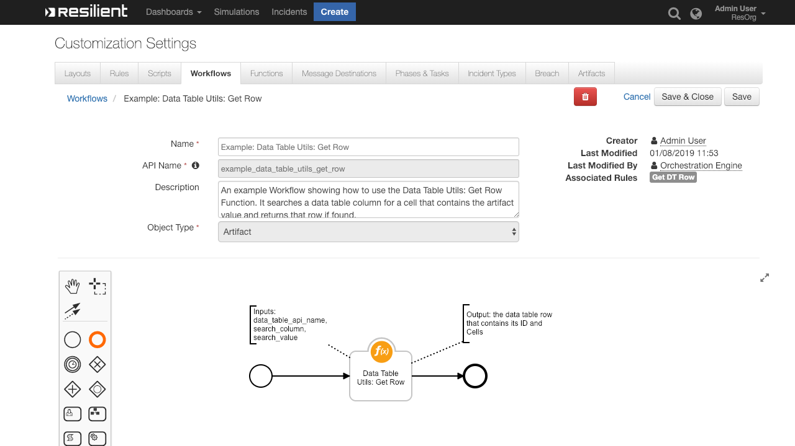
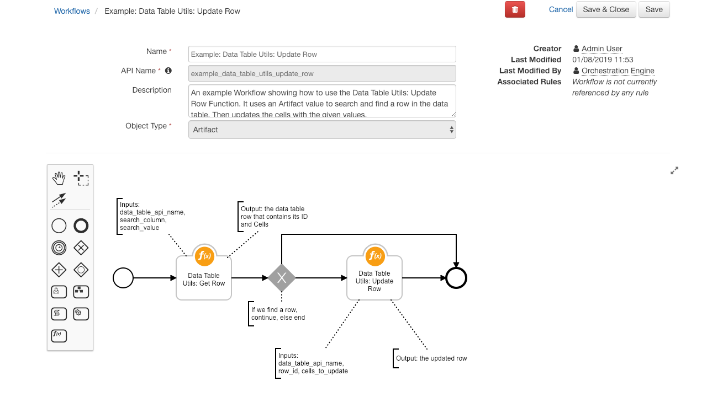
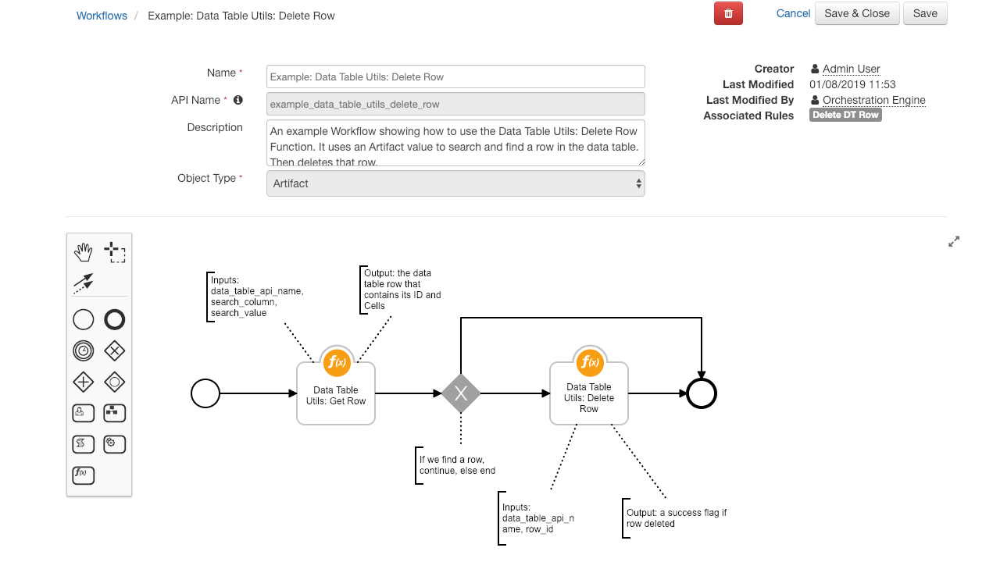
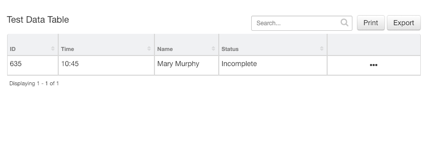
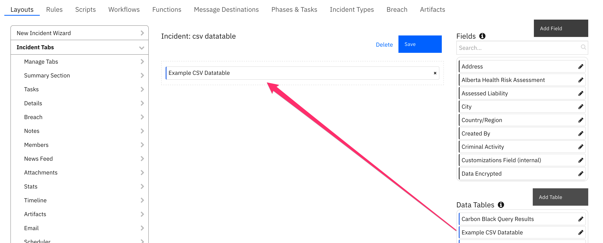

# IBM Resilient - Data Table Helper Functions

## Table of Contents
  - [Function - Get Row](#function---get-row)
  - [Function - Update Row](#function---update-row)
  - [Function - Delete Row](#function---delete-row)
  - [Rules](#rules)
  - [Display the Data Table in an Incident](#display-the-datatable-in-an-incident)
---

**This package contains 3 functions that help you manipulate IBM Resilient Data Tables**

 

The 3 functions allow you to GET, UPDATE and DELETE a row in a Data Table

---
## Function - Get Row:
Gets a row in a Data Table by the row's ID or by searching the column name and cell value

 


### Inputs:
| Name | Type | Required | Example | Info |
| ------------- | :--: | :-------:| ------- | ---- |
| `incident_id` | `Number` | Yes | `2095` | ID of the current Incident |
| `dt_utils_datatable_api_name` | `String` | Yes | `"dt_utils_test_data_table"` | API name of the Data Table to search |
| `dt_utils_row_id` | `Number` | No | `5` | ID of the Row to get |
| `dt_utils_search_column` | `String` | No | `"dt_col_name"` | API name of the column to search |
| `dt_utils_search_value` | `String` | No | `"Mary Murphy"` | Cell value to search for |


### Output:
```python
results = {
    'inputs': {
        'incident_id': 2095,
        'dt_utils_row_id': None,
        'dt_utils_search_column': 'dt_col_name',
        'dt_utils_search_value': 'Mary Murphy',
        'dt_utils_datatable_api_name': 'dt_utils_test_data_table'
    },
    'success': True,
    'row': {
        'type_id': 1000,
        'cells': {
            'dt_col_name': {
                'row_id': 1,
                'id': 'dt_col_name',
                'value': 'Mary Murphy'
            },
            'dt_col_status': {
                'row_id': 1,
                'id': 'dt_col_status',
                'value': 'Incomplete'
            },
            'dt_col_time': {
                'row_id': 1,
                'id': 'dt_col_time',
                'value': '10:45'
            },
            'dt_col_id': {
                'row_id': 1,
                'id': 'dt_col_id',
                'value': '635'
            }
        },
        'actions': [],
        'inc_owner': 'admin@res.com',
        'version': 2,
        'table_name': 'Test Data Table',
        'inc_name': 'Test DT Utils',
        'inc_id': 2095,
        'id': 1
    }
}
```

### Pre-Process Script:
This example uses the Artifact Value as the value to search the data table for
```python
# The ID of this incident
inputs.incident_id = incident.id

# The api name of the Data Table to update
inputs.dt_utils_datatable_api_name = "dt_utils_test_data_table"

# The column api name to search for
inputs.dt_utils_search_column = "dt_col_name"

# The cell value to search for
inputs.dt_utils_search_value = artifact.value

## Alternatively you can get the row by its ID by defining this input:
# inputs.dt_utils_row_id = 3
```
---
## Function - Update Row:
Uses a JSON String of 'column name/cell value' pairs to update a Data Table row

 


### Inputs:
| Name | Type | Required | Example | Info |
| ------------- | :--: | :-------:| ------- | ---- |
| `incident_id` | `Number` | Yes | `2095` | ID of the current Incident |
| `dt_utils_datatable_api_name` | `String` | Yes | `"dt_utils_test_data_table"` | API name of the Data Table to search |
| `dt_utils_row_id` | `Number` | Yes | `5` | ID of the Row to update |
| `dt_utils_cells_to_update` | `JSON String` | Yes | `'{"dt_col_status":"Done", "dt_col_time":"Just Now"}'` | A JSON String of column name and cell value pairs to update |


### Output:
```python
results = {
    'inputs': {
        'incident_id': 2095,
        'dt_utils_row_id': 1,
        'dt_utils_cells_to_update': {
            'dt_col_status': 'Done',
            'dt_col_time': 'Just Now'
        },
        'dt_utils_datatable_api_name': 'dt_utils_test_data_table'
    },
    'success': True,
    'row': {
        'type_id': 1000,
        'cells': {
            'dt_col_name': {
                'row_id': 1,
                'id': 'dt_col_name',
                'value': 'Mary Murphy'
            },
            'dt_col_status': {
                'row_id': 1,
                'id': 'dt_col_status',
                'value': 'Done'
            },
            'dt_col_time': {
                'row_id': 1,
                'id': 'dt_col_time',
                'value': 'Just Now'
            },
            'dt_col_id': {
                'row_id': 1,
                'id': 'dt_col_id',
                'value': '635'
            }
        },
        'actions': [],
        'inc_owner': 'admin@res.com',
        'version': 3,
        'table_name': 'Test Data Table',
        'inc_name': 'Test DT Utils',
        'inc_id': 2095,
        'id': 1
    }
}
```

### Pre-Process Script:
In this example we make use of the **dict_to_json_str** function to allow us to easily form a JSON String to pass column name and cell value pairs to the function in order to update the Data Table
```python
#######################################
### Define pre-processing functions ###
#######################################
def dict_to_json_str(d):
  """Function that converts a dictionary into a JSON string.
     Supports types: basestring, bool, int and nested dicts.
     Does not support lists.
     If the value is None, it sets it to False."""

  json_entry = '"{0}":{1}'
  json_entry_str = '"{0}":"{1}"'
  entries = [] 

  for entry in d:
    key = entry
    value = d[entry]

    if value is None:
      value = False

    if isinstance(value, list):
      helper.fail('dict_to_json_str does not support Python Lists')

    if isinstance(value, basestring):
      value = value.replace(u'"', u'\\"')
      entries.append(json_entry_str.format(key, value))
    
    elif isinstance(value, bool):
      value = 'true' if value == True else 'false'
      entries.append(json_entry.format(key, value))

    elif isinstance(value, dict):
      entries.append(json_entry.format(key, dict_to_json_str(value)))

    else:
      entries.append(json_entry.format(key, value))

  return '{0} {1} {2}'.format('{', ','.join(entries), '}')

#####################
### Define Inputs ###
#####################

# The ID of this incident
inputs.incident_id = incident.id

# The api name of the Data Table to update [here it is taken from previous Get Row Function]
inputs.dt_utils_datatable_api_name = workflow.properties.row_to_update.inputs.dt_utils_datatable_api_name

# The ID of the row to update [again, taken from previous Get Row Function]
inputs.dt_utils_row_id = workflow.properties.row_to_update.row["id"]

# The column api names and the value to update the cell to
inputs.dt_utils_cells_to_update = dict_to_json_str({
  "dt_col_time": "Just Now",
  "dt_col_status": "Done"
})
```
---
## Function - Delete Row:
Deletes a row from a Data Table given the row's ID

 


### Inputs:
| Name | Type | Required | Example | Info |
| ------------- | :--: | :-------:| ------- | ---- |
| `incident_id` | `Number` | Yes | `2095` | ID of the current Incident |
| `dt_utils_datatable_api_name` | `String` | Yes | `"dt_utils_test_data_table"` | API name of the Data Table to search |
| `dt_utils_row_id` | `Number` | Yes | `5` | ID of the Row to delete |


### Output:
```python
results = {
    'inputs': {
        'incident_id': 2095,
        'dt_utils_row_id': 2,
        'dt_utils_datatable_api_name': 'dt_utils_test_data_table'
    },
    'success': True,
    'row': {
        'message': None,
        'hints': [],
        'success': True,
        'title': None
    }
}
```

### Pre-Process Script:
```python
# The ID of this incident
inputs.incident_id = incident.id

# The api name of the Data Table [here it is taken from previous Get Row Function]
inputs.dt_utils_datatable_api_name = workflow.properties.row_to_delete.inputs.dt_utils_datatable_api_name

# The ID of the row to delete [again, taken from previous Get Row Function]
inputs.dt_utils_row_id = workflow.properties.row_to_delete.row["id"]
```
---
## Rules
| Rule Name | Object Type | Workflow Triggered |
| --------- | :---------: | ------------------ |
| Get DT Row | `Artifact` | `Example: Data Table Utils: Get Row` |
| Update DT Row | `Artifact` | `Example: Data Table Utils: Update Row` |
| Delete DT Row | `Artifact` | `Example: Data Table Utils: Delete Row` |
---
## Data table
### Data Table Utils: Test Data Table
 

#### API Name:
dt_utils_test_data_table

#### Columns:
| Column Name | API Access Name | Type |
| ----------- | --------------- | -----|
| ID | `dt_col_id` | `Text` |
| Time | `dt_col_time` | `Text` |
| Name | `dt_col_name` | `Text` |
| Status | `dt_col_status` | `Text` |


#### Display the Datatable in an Incident
* In order to **display** the Test Data Table in your Incident, you must **modify your Layout Settings**

1. Go to **Customization Settings** > **Layouts** > **Incident Tabs** > **+ Add Tab**
 
2. Enter **Tab Text**: `My Test Tab` and click **Add**
 
3. **Drag** the Data table into the middle and click **Save**
 
4. Create a new Incident and you will now see the **My Test Tab** with the **Test Data Table**
