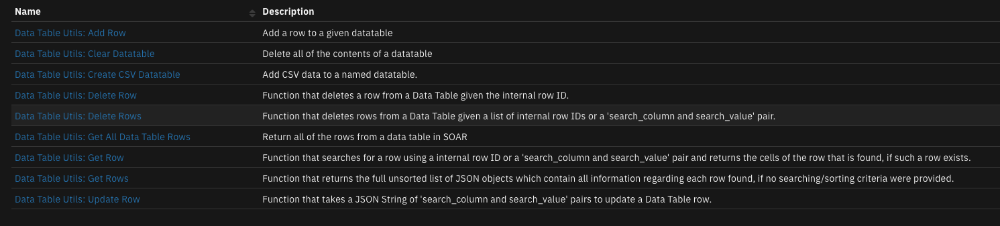
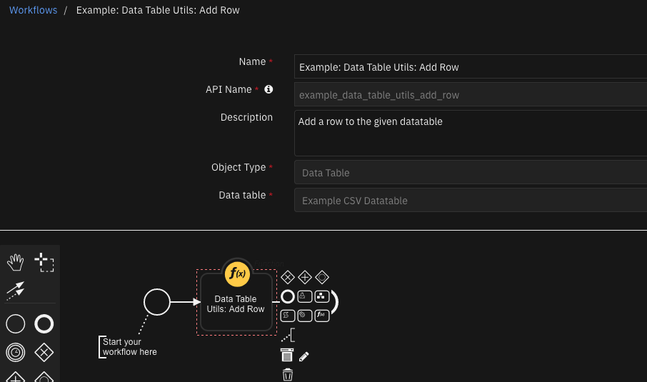
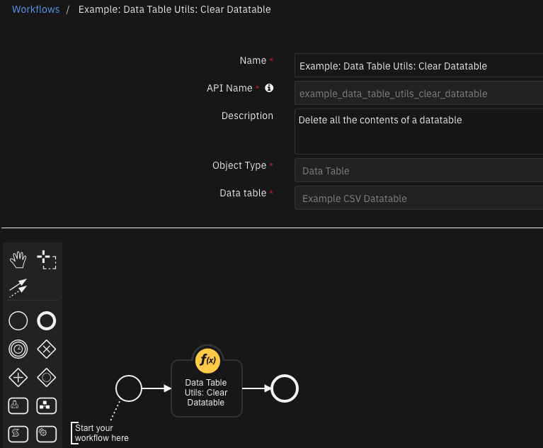
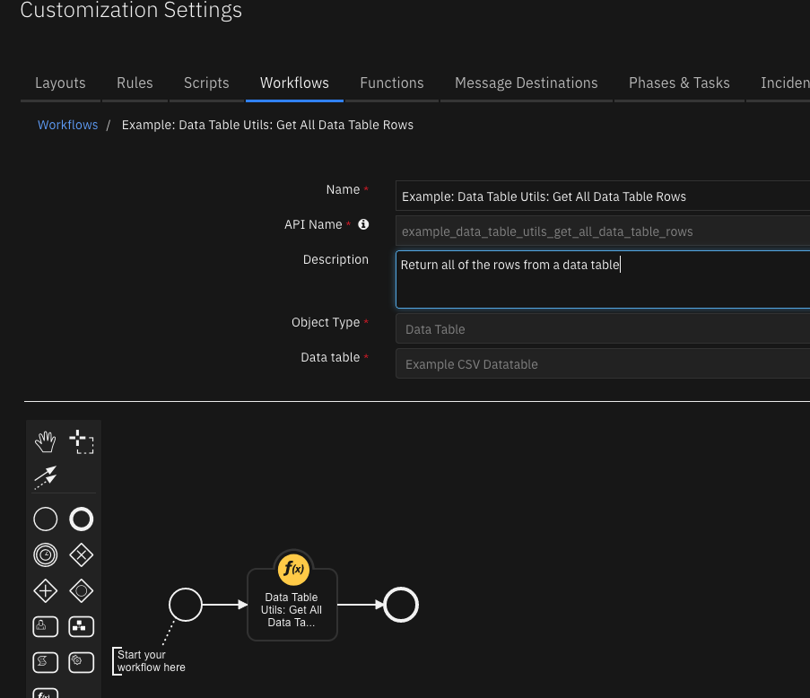

# Datatable Utilities

## Table of Contents
- [Release Notes](#release-notes)
- [Overview](#overview)
- [Requirements](#requirements)
  - [SOAR platform](#soar-platform)
  - [Cloud Pak for Security](#cloud-pak-for-security)
  - [Proxy Server](#proxy-server)
  - [Python Environment](#python-environment)
- [Installation](#installation)
  - [Install](#install)
  - [App Configuration](#app-configuration)
- [Setup](#setup)
- [Function - Data Table Utils: Add Row](#function---data-table-utils-add-row)
- [Function - Data Table Utils: Clear Datatable](#function---data-table-utils-clear-datatable)
- [Function - Data Table Utils: Create CSV Datatable](#function---data-table-utils-create-csv-datatable)
- [Function - Data Table Utils: Delete Row](#function---data-table-utils-delete-row)
- [Function - Data Table Utils: Delete Rows](#function---data-table-utils-delete-rows)
- [Function - Data Table Utils: Get All Data Table Rows](#function---data-table-utils-get-all-data-table-rows)
- [Function - Data Table Utils: Get Row](#function---data-table-utils-get-row)
- [Function - Data Table Utils: Get Rows](#function---data-table-utils-get-rows)
- [Function - Data Table Utils: Update Row](#function---data-table-utils-update-row)
- [Data Table - Example CSV Datatable](#data-table---example-csv-datatable)
- [Rules](#rules)
- [Troubleshooting & Support](#troubleshooting--support)
---

## Release Notes
| Version | Date | Notes |
| ------- | ---- | ----- |
| v2.1.0  | 5/2023 | Add playbooks
| v2.0.0  | 5/2022 | <ul><li>Added function dt_utils_add_row that adds a row to a datatable</li><li>Function dt_utils_get_row can now get a row from menu of a datatable row</li><li>Added function dt_utils_get_all_data_table_rows that gets all rows from a data table in SOAR</li><li>Update example workflows</li><li>Added function dt_utils_clear_datatable that deletes all the contents of a datatable</li></ul> |
| v1.2.0  | 2/2021 | Functions dt_utils_get_rows and dt_utils_delete_rows can now return or delete all datatable rows |
| v1.1.0  | 11/2020 | Added support for App Host. New functions: `dt_utils_get_row`, `dt_utils_get_rows`, `dt_utils_delete_row`, `dt_utils_delete_rows`, `dt_utils_create_csv_table`|
| v1.0.0  | 2/2019 | Initial Release |

### 2.1.0 Changes
In v2.1, the existing rules and workflows have been replaced with playbooks. This change is made to support the ongoing, newer capabilities of playbooks. Each playbook has the same functionality as the previous, corresponding rule/workflow.

If upgrading from a previous release, you'll noticed that the previous release's rules/workflows remain in place. Both sets of rules and playbooks are active. For manual actions, playbooks will have the same name as it's corresponding rule, but with "(PB)" added at the end. For automatic actions, the playbooks will be disabled by default.

You can continue to use the rules/workflows. But migrating to playbooks will provide greater functionality along with future app enhancements and bug fixes.

---

## Overview

**Functions manipulate data in a Datatable**

 

This package contains 8 functions that help you manipulate IBM SOAR Data Tables: Add Row, Clear Datatable, Get Row, Get All Data Table Rows, Get Rows, Update Row, Delete Row, Delete Rows and Convert CSV Data to a datatable.

## Requirements
This app supports the IBM Security QRadar SOAR Platform and the IBM Security QRadar SOAR for IBM Cloud Pak for Security.

### SOAR platform
The SOAR platform supports two app deployment mechanisms, App Host and integration server.

If deploying to a SOAR platform with an App Host, the requirements are:
* SOAR platform >= `41.0.6783`.
* The app is in a container-based format (available from the AppExchange as a `zip` file).

If deploying to a SOAR platform with an integration server, the requirements are:
* SOAR platform >= `41.0.6783`.
* The app is in the older integration format (available from the AppExchange as a `zip` file which contains a `tar.gz` file).
* Integration server is running `resilient_circuits>=41.0.0`.
* If using an API key account, make sure the account provides the following minimum permissions: 
  | Name | Permissions |
  | ---- | ----------- |
  | Org Data | Read |
  | Function | Read |
  | Incidents | Read |
  | Incidents Fields | Edit |
  | Data | Edit |

The following SOAR platform guides provide additional information: 
* _App Host Deployment Guide_: provides installation, configuration, and troubleshooting information, including proxy server settings. 
* _Integration Server Guide_: provides installation, configuration, and troubleshooting information, including proxy server settings.
* _System Administrator Guide_: provides the procedure to install, configure and deploy apps. 

The above guides are available on the IBM Documentation website at [ibm.biz/soar-docs](https://ibm.biz/soar-docs). On this web page, select your SOAR platform version. On the follow-on page, you can find the _App Host Deployment Guide_ or _Integration Server Guide_ by expanding **Apps** in the Table of Contents pane. The System Administrator Guide is available by expanding **System Administrator**.

### Cloud Pak for Security
If you are deploying to IBM Cloud Pak for Security, the requirements are:
* IBM Cloud Pak for Security >= 1.4.
* Cloud Pak is configured with an App Host.
* The app is in a container-based format (available from the AppExchange as a `zip` file).

The following Cloud Pak guides provide additional information: 
* _App Host Deployment Guide_: provides installation, configuration, and troubleshooting information, including proxy server settings. From the Table of Contents, select Case Management and Orchestration & Automation > **Orchestration and Automation Apps**.
* _System Administrator Guide_: provides information to install, configure, and deploy apps. From the IBM Cloud Pak for Security IBM Documentation table of contents, select Case Management and Orchestration & Automation > **System administrator**.

These guides are available on the IBM Documentation website at [ibm.biz/cp4s-docs](https://ibm.biz/cp4s-docs). From this web page, select your IBM Cloud Pak for Security version. From the version-specific IBM Documentation page, select Case Management and Orchestration & Automation.

### Proxy Server
The app does not support a proxy server.

### Python Environment
Both Python 2.7 and Python 3.6 are supported.
Additional package dependencies may exist for each of these packages:
* resilient-lib>=41.0.0
* resilient_circuits>=41.0.0

---

## Installation

### Install
* To install or uninstall an App or Integration on the _SOAR platform_, see the documentation at [ibm.biz/soar-docs](https://ibm.biz/soar-docs).
* To install or uninstall an App on _IBM Cloud Pak for Security_, see the documentation at [ibm.biz/cp4s-docs](https://ibm.biz/cp4s-docs) and follow the instructions above to navigate to Orchestration and Automation.

### App Configuration
The following table provides the settings you need to configure the app. These settings are made in the app.config file. See the documentation discussed in the Requirements section for the procedure.

| Config | Required | Example | Description |
| ------ | :------: | ------- | ----------- |

## Setup
To reference the example datatable, create a new incident tab and drag the `Example CSV DataTable` into the widget area.


---

## Function - Data Table Utils: Add Row
Add a row to a given datatable.

 

<details><summary>Inputs:</summary>
<p>

| Name | Type | Required | Example | Tooltip |
| ---- | :--: | :------: | ------- | ------- |
| `dt_utils_cells_to_update` | `text` | Yes | `-` | A JSON String containing the column names and cell values to update |
| `dt_utils_datatable_api_name` | `text` | Yes | `-` | The API name of the Data Table |
| `incident_id` | `number` | Yes | `-` | - |

</p>
</details>

<details><summary>Outputs:</summary>
<p>

> **NOTE:** This example might be in JSON format, but `results` is a Python Dictionary on the SOAR platform.

```python
results = {
  "content": {
    "row": {
      "boolean": true,
      "datetime": 1654019149216,
      "dt_col_name": "fGzfdhgxj",
      "multi_select": [
        "a",
        "b"
      ],
      "number": 1,
      "select": "1",
      "text": "example add row"
    }
  },
  "inputs": {
    "dt_utils_cells_to_update": "{ \"select\":\"1\",\"number\":1,\"datetime\":1654019149216,\"boolean\":true,\"multi_select\":[\u0027a\u0027, \u0027b\u0027],\"dt_col_name\":\"fGzfdhgxj\",\"text\":\"example add row\" }",
    "dt_utils_datatable_api_name": "dt_utils_test_data_table",
    "incident_id": 2269
  },
  "metrics": {
    "execution_time_ms": 546,
    "host": "local",
    "package": "fn-datatable-utils",
    "package_version": "2.0.0",
    "timestamp": "2022-05-31 13:45:50",
    "version": "1.0"
  },
  "raw": null,
  "reason": null,
  "success": true,
  "version": 2.0
}
```

</p>
</details>

<details><summary>Example Pre-Process Script:</summary>
<p>

```python
import java.util.Date as Date

def dict_to_json_str(d):
  """Function that converts a dictionary into a JSON string.
     Supports types: basestring, bool, int, nested dicts and lists.
     If the value is None, it sets it to False."""

  json_entry = '"{0}":{1}'
  json_entry_str = '"{0}":"{1}"'
  entries = []

  for entry in d:
    key = entry
    value = d[entry]

    if not value:
      value = False

    elif isinstance(value, basestring):
      value = value.replace(u'"', u'\\"')
      entries.append(json_entry_str.format(key, value))

    elif isinstance(value, bool):
      value = 'true' if value else 'false'
      entries.append(json_entry.format(key, value))

    elif isinstance(value, dict):
      entries.append(json_entry.format(key, dict_to_json_str(value)))

    else:
      entries.append(json_entry.format(key, value))

  return '{0} {1} {2}'.format('{', ','.join(entries), '}')

# The ID of this incident
inputs.incident_id = incident.id

# The api name of the Data Table to update
inputs.dt_utils_datatable_api_name = "dt_utils_test_data_table"

# The column api names and the value to update the cell to
# Example: {"dt_col_name": "example", "number": 1, "text": "example", "datetime": Date().getTime(), "boolean": True, "select": "1", "multi_select": ["a", "b"]}
inputs.dt_utils_cells_to_update = dict_to_json_str({"dt_col_name": rule.properties.dt_name_field, "number": rule.properties.dt_number_field, "text": rule.properties.dt_text_field, "datetime": rule.properties.dt_datetime_field, "boolean": rule.properties.dt_boolean_field, "select": rule.properties.dt_select_field, "multi_select": rule.properties.dt_multi_select_field})
```

</p>
</details>

<details><summary>Example Post-Process Script:</summary>
<p>

```python
None
```

</p>
</details>

---
## Function - Data Table Utils: Clear Datatable
Delete all the contents of a datatable.

 **NOTE:** This function can not be used with Rule object type Data Table

 

<details><summary>Inputs:</summary>
<p>

| Name | Type | Required | Example | Tooltip |
| ---- | :--: | :------: | ------- | ------- |
| `dt_utils_datatable_api_name` | `text` | Yes | `-` | The API name of the Data Table |
| `incident_id` | `number` | Yes | `-` | - |

</p>
</details>

<details><summary>Outputs:</summary>
<p>

> **NOTE:** This example might be in JSON format, but `results` is a Python Dictionary on the SOAR platform.

```python
results = {
  "content": {
    "hints": [],
    "message": null,
    "success": true,
    "title": null
  },
  "inputs": {
    "dt_utils_datatable_api_name": "dt_utils_test_data_table",
    "incident_id": 2269
  },
  "metrics": {
    "execution_time_ms": 626,
    "host": "local",
    "package": "fn-datatable-utils",
    "package_version": "2.0.0",
    "timestamp": "2022-05-31 13:46:14",
    "version": "1.0"
  },
  "raw": null,
  "reason": null,
  "success": true,
  "version": 2.0
}
```

</p>
</details>

<details><summary>Example Pre-Process Script:</summary>
<p>

```python
# The ID of this incident
inputs.incident_id = incident.id

# The api name of the Data Table to update
if rule.properties.datatable_api_name:
  inputs.dt_utils_datatable_api_name = rule.properties.datatable_api_name
else:
  # Defaults to example data table
  inputs.dt_utils_datatable_api_name = "dt_utils_test_data_table"
```

</p>
</details>

<details><summary>Example Post-Process Script:</summary>
<p>

```python
if results["success"]:
  incident.addNote("Data table: {} content has been removed.".format(results["inputs"]["dt_utils_datatable_api_name"]))
```

</p>
</details>

---
## Function - Data Table Utils: Create CSV Datatable
Add CVS data to a named datatable. CSV data can originate from another function or from a referenced attachment with CSV encoded data.

A mapping table is used to map CSV header row labels to datatable column (API) names. For csv_data with headers, either a string-encoded list can be used, referencing the column order of the CSV data for the associated datatable column names:

```
'[null, dt_col_nameA, null, null, dt_col_nameC, dt_col_nameB]'
```

Alternatively, a string-encoded dictionary can be used mapping CSV header names to datatable column names:
```
'{
  "hdr1": "dt_col_name1",
  "hdr2": "dt_col_name2",
  "hdr4": "dt_col_name4"
}'
```

For csv data without headers, the mapping table will contain a string-encoded list referencing the column order of the CSV data for the associated datatable column names. For example:

```
'[null, dt_col_nameA, null, null, dt_col_nameC, dt_col_nameB]'
```

Attempts are made to match the field type of the datatable. CSV data matched to `select` and `multi-select` datatables columns must contain the correct values specified for those columns. String-based date fields will be converted into epoch timestamp values based on a date format pattern (ex. '%Y-%m-%d %H:%M:%S.%f') for `datetimepicker` and `datepicker` datatable column types. See [https://strftime.org/](https://strftime.org/) for the formatted values to use. Epoch date field values are also supported.

 

<details><summary>Inputs:</summary>
<p>

| Name | Type | Required | Example | Tooltip |
| ---- | :--: | :------: | ------- | ------- |
| `attachment_id` | `number` | No | `-` | - |
| `dt_csv_data` | `text` | No | `CSV Data` | string of csv data consisting an optional header row followed by rows of comma separated data. each comma separated field may contain quotes to allow for embedded commas |
| `dt_datable_name` | `text` | Yes | `Datatable Name` | string of api name of datatable |
| `dt_date_time_format` | `text` | No | `E.g. dd/mm/yyyy` | If you're data contains date entries, provide the format for the date |
| `dt_has_headers` | `boolean` | No | `-` | boolean True if the csv_data contains header information to match with the column names of the datatable. If False, the data is added to the datatable in column order. |
| `dt_mapping_table` | `text` | Yes | `"""{"csv_hdr1":"datatable_column_name, ...}"""` | String-encoded JSON of csv header to datatable column mappings |
| `dt_max_rows` | `number` | No | `-` | limit the number of rows to include |
| `dt_start_row` | `number` | No | `-` | Row to start adding to datatable. Use 1 if dt_has_headers = True for first data row |
| `incident_id` | `number` | Yes | `-` | - |

</p>
</details>

<details><summary>Outputs:</summary>
<p>

> **NOTE:** This example might be in JSON format, but `results` is a Python Dictionary on the SOAR platform.

```python
results = {
  "content": {
    "data_source": "test_types_utf-8.csv",
    "rows_added": 12,
    "rows_with_errors": 0
  },
  "inputs": {
    "attachment_id": 12,
    "dt_datable_name": "dt_utils_test_data_table",
    "dt_date_time_format": "%m/%d/%y %H:%M",
    "dt_has_headers": true,
    "dt_mapping_table": "{\n  \"hdr_number\": \"number\",\n  \"hdr_text\": \"text\",\n  \"hdr_boolean\": \"boolean\",\n  \"hdr_datetime\": \"datetime\",\n  \"hdr_select\": \"select\",\n  \"hdr_multiselect\": \"multi_select\"\n}",
    "incident_id": 2269
  },
  "metrics": {
    "execution_time_ms": 5471,
    "host": "local",
    "package": "fn-datatable-utils",
    "package_version": "2.0.0",
    "timestamp": "2022-05-31 13:30:04",
    "version": "1.0"
  },
  "raw": null,
  "reason": null,
  "success": true,
  "version": 2.0
}
```

</p>
</details>

<details><summary>Example Pre-Process Script:</summary>
<p>

```python
# The ID of this incident
inputs.incident_id = incident.id
# The api name of the Data Table to update
inputs.dt_datable_name = "dt_utils_test_data_table"
# uncomment attachment_id when reading csv data from an attachmennt
inputs.attachment_id = attachment.id

# A boolean to determine if CSV headers are present
inputs.dt_has_headers = True

## The mapping format should be "csv_header":"dt_column_name"
mapping = '''{
  "hdr_number": "number",
  "hdr_text": "text",
  "hdr_boolean": "boolean",
  "hdr_datetime": "datetime",
  "hdr_select": "select",
  "hdr_multiselect": "multi_select"
}'''
# mappings of csv data without headers will be a list of data_table column names. Use null to bypass a csv data column
mapping_no_headers = '''["number","text","boolean","datetime","select","multi_select","x","y","z"]'''
inputs.dt_mapping_table = mapping
# year - %Y, month - %m, day - %d, hour - %H, minutes - %M, seconds - %S, milliseconds - %f, timezone offset - %z'
inputs.dt_date_time_format = "%m/%d/%y %H:%M"
# optional start row csv data. The first data row = 1
##inputs.dt_start_row = 0
# optional max number of csv rows to add relative to dt_start_row
##inputs.dt_max_rows = 5
```

</p>
</details>

<details><summary>Example Post-Process Script:</summary>
<p>

```python
if results.success:
  note_text = u"""Results from Data Table Utils: Create CSV Datatable\nData Source: {}\nRows added: {}\nRows not added: {}""".format(results.content["data_source"], results.content["rows_added"], results.content["rows_with_errors"])
  incident.addNote(note_text)
else:
  incident.addNote(u"Error: Failed to add rows")
```

</p>
</details>

---
## Function - Data Table Utils: Delete Row
Function that deletes a row from a Data Table given the internal row ID.

When used on a datatable, specify dt_utils_row_id = 0 to reference the currently referenced datatable row. The delete operation will be delayed as the workflow will first terminate before the row is deleted.

An example Rule and Workflow are available for deleting datatable rows based on an artifact value and against a row in the example datatable.

 

<details><summary>Inputs:</summary>
<p>

| Name | Type | Required | Example | Tooltip |
| ---- | :--: | :------: | ------- | ------- |
| `dt_utils_datatable_api_name` | `text` | Yes | `-` | The API name of the Data Table |
| `dt_utils_row_id` | `number` | No | `-` | The internal ID of the row to be retrieved |
| `incident_id` | `number` | Yes | `-` | - |

</p>
</details>

<details><summary>Outputs:</summary>
<p>

> **NOTE:** This example might be in JSON format, but `results` is a Python Dictionary on the SOAR platform.

```python
results = {
  "content": {
    "row": {
      "hints": [],
      "message": null,
      "success": true,
      "title": null
    }
  },
  "inputs": {
    "dt_utils_datatable_api_name": "dt_utils_test_data_table",
    "dt_utils_row_id": 642,
    "incident_id": 2269
  },
  "metrics": {
    "execution_time_ms": 543,
    "host": "local",
    "package": "fn-datatable-utils",
    "package_version": "2.0.0",
    "timestamp": "2022-05-31 13:44:54",
    "version": "1.0"
  },
  "raw": null,
  "reason": null,
  "success": true,
  "version": 2.0
}
```

</p>
</details>

<details><summary>Example Pre-Process Script:</summary>
<p>

```python
# The ID of this incident
inputs.incident_id = incident.id

# The api name of the Data Table [here it is taken from previous Get Row Function]
inputs.dt_utils_datatable_api_name = workflow.properties.row_to_delete.inputs.dt_utils_datatable_api_name

# The ID of the row to delete [again, taken from previous Get Row Function]
inputs.dt_utils_row_id = workflow.properties.row_to_delete.content.row["id"]
```

</p>
</details>

<details><summary>Example Post-Process Script:</summary>
<p>

```python
if results.success:
  note = u"Row id: {} removed from datatable: {} for artifact: {}".format(results.inputs['dt_utils_row_id'], results.inputs['dt_utils_datatable_api_name'], artifact.value)
else:
  note = u"Artifact: {} not found in datatable: {}".format(artifact.value, results.inputs['dt_utils_datatable_api_name'])

incident.addNote(note)
```

</p>
</details>

---
## Function - Data Table Utils: Delete Rows
Function that deletes rows from a Data Table given a list of internal row IDs or a 'search_column and search_value' pair.

An example Rule and Workflow are available for deleting datatable rows based on an artifact value.

 

<details><summary>Inputs:</summary>
<p>

| Name | Type | Required | Example | Tooltip |
| ---- | :--: | :------: | ------- | ------- |
| `dt_utils_datatable_api_name` | `text` | Yes | `-` | The API name of the Data Table |
| `dt_utils_delete_all_rows` | `boolean` | No | `-` | explicitly delete all rows |
| `dt_utils_rows_ids` | `text` | No | `-` | The list of internal rows IDs of a Data Table to delete |
| `dt_utils_search_column` | `text` | No | `-` | The API name of the column to search |
| `dt_utils_search_value` | `text` | No | `-` | The cell value to search for within the search column |
| `incident_id` | `number` | Yes | `-` | - |

</p>
</details>

<details><summary>Outputs:</summary>
<p>

> **NOTE:** This example might be in JSON format, but `results` is a Python Dictionary on the SOAR platform.

```python
results = {
  "content": {
    "rows_ids": [
      643
    ]
  },
  "inputs": {
    "dt_utils_datatable_api_name": "dt_utils_test_data_table",
    "dt_utils_rows_ids": "[643]",
    "incident_id": 2269
  },
  "metrics": {
    "execution_time_ms": 759,
    "host": "local",
    "package": "fn-datatable-utils",
    "package_version": "2.0.0",
    "timestamp": "2022-05-31 13:45:13",
    "version": "1.0"
  },
  "raw": null,
  "reason": null,
  "success": true,
  "version": 2.0
}
```

</p>
</details>

<details><summary>Example Pre-Process Script:</summary>
<p>

```python
# The ID of this incident
inputs.incident_id = incident.id

# The api name of the Data Table, search column, search value [here it is taken from previous Get Rows Function inputs]
inputs.dt_utils_datatable_api_name = workflow.properties.rows_to_delete.inputs.dt_utils_datatable_api_name

# The internal IDs of the rows that will be deleted [again, taken from previous Get Rows Function]
if workflow.properties.rows_to_delete and workflow.properties.rows_to_delete.content.rows:
  rows_ids = []
  for row in workflow.properties.rows_to_delete.content.rows:
    rows_ids.append(row["id"])
  inputs.dt_utils_rows_ids = str(rows_ids)
```

</p>
</details>

<details><summary>Example Post-Process Script:</summary>
<p>

```python
if results.success:
  note = u"<b>Result from Example: Data Table Utils: Artifact: {} Delete Rows</b><br> {}".format(artifact.value, str(results.content["rows_ids"]))
else:
  note = u"<b>Result from Example: Data Table Utils: Artifact: {} not found in datatable: {}".format(artifact.value, results.inputs['dt_utils_datatable_api_name'])

incident.addNote(helper.createRichText(note))
```

</p>
</details>

---
## Function - Data Table Utils: Get All Data Table Rows
Function that returns the information for all the rows in a data table.

An example Rule and Workflow exist for using this function on the example datatable from an artifact value.

 

<details><summary>Inputs:</summary>
<p>

| Name | Type | Required | Example | Tooltip |
| ---- | :--: | :------: | ------- | ------- |
| `dt_utils_datatable_api_name` | `text` | Yes | `-` | The API name of the Data Table |
| `incident_id` | `number` | Yes | `-` | - |

</p>
</details>

<details><summary>Outputs:</summary>
<p>

> **NOTE:** This example might be in JSON format, but `results` is a Python Dictionary on the SOAR platform.

```python
results = {
  "content": {
    "rows": [
      {
        "actions": [
          {
            "enabled": true,
            "id": 43,
            "name": "Get Current Row"
          },
          {
            "enabled": true,
            "id": 56,
            "name": "Get All Rows"
          },
          {
            "enabled": true,
            "id": 38,
            "name": "Delete Current Row"
          },
          {
            "enabled": true,
            "id": 41,
            "name": "Delete Rows by Name"
          },
          {
            "enabled": true,
            "id": 46,
            "name": "Update Current Row"
          },
          {
            "enabled": true,
            "id": 58,
            "name": "Add Row"
          }
        ],
        "cells": {
          "boolean": {
            "id": "boolean",
            "row_id": 641,
            "value": true
          },
          "datetime": {
            "id": "datetime",
            "row_id": 641,
            "value": 1654018496000
          },
          "dt_col_name": {
            "id": "dt_col_name",
            "row_id": 641,
            "value": "dgzsfhcjv"
          },
          "multi_select": {
            "id": "multi_select",
            "row_id": 641,
            "value": [
              "e",
              "g",
              "b"
            ]
          },
          "number": {
            "id": "number",
            "row_id": 641,
            "value": 4598
          },
          "select": {
            "id": "select",
            "row_id": 641,
            "value": "3"
          },
          "text": {
            "id": "text",
            "row_id": 641,
            "value": "Update from datatable"
          }
        },
        "id": 641,
        "inc_id": 2269,
        "inc_name": "f",
        "inc_owner": "admin@example.com",
        "table_name": "Example CSV Datatable",
        "type_id": 1002,
        "version": 2
      },
      {
        "actions": [
          {
            "enabled": true,
            "id": 43,
            "name": "Get Current Row"
          },
          {
            "enabled": true,
            "id": 56,
            "name": "Get All Rows"
          },
          {
            "enabled": true,
            "id": 38,
            "name": "Delete Current Row"
          },
          {
            "enabled": true,
            "id": 41,
            "name": "Delete Rows by Name"
          },
          {
            "enabled": true,
            "id": 46,
            "name": "Update Current Row"
          },
          {
            "enabled": true,
            "id": 58,
            "name": "Add Row"
          }
        ],
        "cells": {
          "boolean": {
            "id": "boolean",
            "row_id": 644,
            "value": true
          },
          "datetime": {
            "id": "datetime",
            "row_id": 644,
            "value": 1654019149216
          },
          "dt_col_name": {
            "id": "dt_col_name",
            "row_id": 644,
            "value": "fGzfdhgxj"
          },
          "multi_select": {
            "id": "multi_select",
            "row_id": 644,
            "value": [
              "b",
              "a"
            ]
          },
          "number": {
            "id": "number",
            "row_id": 644,
            "value": 1
          },
          "select": {
            "id": "select",
            "row_id": 644,
            "value": "1"
          },
          "text": {
            "id": "text",
            "row_id": 644,
            "value": "example add row"
          }
        },
        "id": 644,
        "inc_id": 2269,
        "inc_name": "f",
        "inc_owner": "admin@example.com",
        "table_name": "Example CSV Datatable",
        "type_id": 1002,
        "version": 1
      }
    ]
  },
  "inputs": {
    "dt_utils_datatable_api_name": "dt_utils_test_data_table",
    "incident_id": 2269
  },
  "metrics": {
    "execution_time_ms": 173,
    "host": "local",
    "package": "fn-datatable-utils",
    "package_version": "2.0.0",
    "timestamp": "2022-05-31 13:45:59",
    "version": "1.0"
  },
  "raw": null,
  "reason": null,
  "success": true,
  "version": 2.0
}
```

</p>
</details>

<details><summary>Example Pre-Process Script:</summary>
<p>

```python
inputs.dt_utils_datatable_api_name = "dt_utils_test_data_table"
inputs.incident_id = incident.id
```

</p>
</details>

<details><summary>Example Post-Process Script:</summary>
<p>

```python
note_text = u"<b>Result from Example: Data Table Utils: Get All Data Table Rows</b><br>"
if results.success:
  note_text = u"{0} <br>{1}".format(note_text, str(results.content.rows))
else:
  note_text = u"{0} <br>No rows found.".format(note_text)

incident.addNote(helper.createRichText(note_text))
```

</p>
</details>

---
## Function - Data Table Utils: Get Row
Function that searches for a row using a internal row ID or a search_column and search_value pair, and returns the information on the row that is found, if such a row exists.

An example Rule and Workflow exist for using this function on the example datatable from an artifact value.

 

<details><summary>Inputs:</summary>
<p>

| Name | Type | Required | Example | Tooltip |
| ---- | :--: | :------: | ------- | ------- |
| `dt_utils_datatable_api_name` | `text` | Yes | `-` | The API name of the Data Table |
| `dt_utils_row_id` | `number` | No | `-` | The internal ID of the row to be retrieved |
| `dt_utils_search_column` | `text` | No | `-` | The API name of the column to search |
| `dt_utils_search_value` | `text` | No | `-` | The cell value to search for within the search column |
| `incident_id` | `number` | Yes | `-` | - |

</p>
</details>

<details><summary>Outputs:</summary>
<p>

> **NOTE:** This example might be in JSON format, but `results` is a Python Dictionary on the SOAR platform.

```python
results = {
  "content": {
    "row": {
      "actions": [
        {
          "enabled": true,
          "id": 43,
          "name": "Get Current Row"
        },
        {
          "enabled": true,
          "id": 56,
          "name": "Get All Rows"
        },
        {
          "enabled": true,
          "id": 38,
          "name": "Delete Current Row"
        },
        {
          "enabled": true,
          "id": 41,
          "name": "Delete Rows by Name"
        },
        {
          "enabled": true,
          "id": 46,
          "name": "Update Current Row"
        },
        {
          "enabled": true,
          "id": 58,
          "name": "Add Row"
        }
      ],
      "cells": {
        "boolean": {
          "id": "boolean",
          "row_id": 642,
          "value": true
        },
        "datetime": {
          "id": "datetime",
          "row_id": 642,
          "value": 1654018816842
        },
        "dt_col_name": {
          "id": "dt_col_name",
          "row_id": 642,
          "value": "fgshdsgfjn"
        },
        "multi_select": {
          "id": "multi_select",
          "row_id": 642,
          "value": [
            "a",
            "b"
          ]
        },
        "number": {
          "id": "number",
          "row_id": 642,
          "value": 1
        },
        "select": {
          "id": "select",
          "row_id": 642,
          "value": "1"
        },
        "text": {
          "id": "text",
          "row_id": 642,
          "value": "example add row"
        }
      },
      "id": 642,
      "inc_id": 2269,
      "inc_name": "f",
      "inc_owner": "admin@example.com",
      "table_name": "Example CSV Datatable",
      "type_id": 1002,
      "version": 1
    }
  },
  "inputs": {
    "dt_utils_datatable_api_name": "dt_utils_test_data_table",
    "dt_utils_search_column": "dt_col_name",
    "dt_utils_search_value": "fgshdsgfjn",
    "incident_id": 2269
  },
  "metrics": {
    "execution_time_ms": 329,
    "host": "local",
    "package": "fn-datatable-utils",
    "package_version": "2.0.0",
    "timestamp": "2022-05-31 13:44:52",
    "version": "1.0"
  },
  "raw": null,
  "reason": null,
  "success": true,
  "version": 2.0
}
```

</p>
</details>

<details><summary>Example Pre-Process Script:</summary>
<p>

```python
# The ID of this incident
inputs.incident_id = incident.id

# The api name of the Data Table to update
inputs.dt_utils_datatable_api_name = "dt_utils_test_data_table"

# The column api name to search for
inputs.dt_utils_search_column = "dt_col_name"

# The cell value to search for
inputs.dt_utils_search_value = artifact.value

## Alternatively you can get the row by its ID by defining this input:
# inputs.dt_utils_row_id = 3
```

</p>
</details>

<details><summary>Example Post-Process Script:</summary>
<p>

```python
note_text = u"<b>Result from Example: Data Table Utils: Get Row</b><br>"
if results.success:
  note_text = u"{} <br>{}".format(note_text, str(results.content["row"]))
else:
  note_text = u"{} <br>No row found.".format(note_text)

incident.addNote(helper.createRichText(note_text))
```

</p>
</details>

---
## Function - Data Table Utils: Get Rows
Function that returns the full unsorted list of JSON objects which contain all information regarding each row found, if no searching/sorting criteria were provided.

An example Rule and Workflow exist for searching the example datatable based on an artifact value.

 

<details><summary>Inputs:</summary>
<p>

| Name | Type | Required | Example | Tooltip |
| ---- | :--: | :------: | ------- | ------- |
| `dt_utils_datatable_api_name` | `text` | Yes | `-` | The API name of the Data Table |
| `dt_utils_max_rows` | `number` | No | `-` | The maximum number of rows to be returned |
| `dt_utils_search_column` | `text` | No | `-` | The API name of the column to search |
| `dt_utils_search_value` | `text` | No | `-` | The cell value to search for within the search column |
| `dt_utils_sort_by` | `text` | No | `-` | The API name of the column to sort by |
| `dt_utils_sort_direction` | `select` | No | `-` | - |
| `incident_id` | `number` | Yes | `-` | - |

</p>
</details>

<details><summary>Outputs:</summary>
<p>

> **NOTE:** This example might be in JSON format, but `results` is a Python Dictionary on the SOAR platform.

```python
results = {
  "content": {
    "rows": [
      {
        "actions": [
          {
            "enabled": true,
            "id": 43,
            "name": "Get Current Row"
          },
          {
            "enabled": true,
            "id": 56,
            "name": "Get All Rows"
          },
          {
            "enabled": true,
            "id": 38,
            "name": "Delete Current Row"
          },
          {
            "enabled": true,
            "id": 41,
            "name": "Delete Rows by Name"
          },
          {
            "enabled": true,
            "id": 46,
            "name": "Update Current Row"
          },
          {
            "enabled": true,
            "id": 58,
            "name": "Add Row"
          }
        ],
        "cells": {
          "boolean": {
            "id": "boolean",
            "row_id": 643,
            "value": true
          },
          "datetime": {
            "id": "datetime",
            "row_id": 643,
            "value": 1654019072126
          },
          "dt_col_name": {
            "id": "dt_col_name",
            "row_id": 643,
            "value": "fGzfdhgxj"
          },
          "multi_select": {
            "id": "multi_select",
            "row_id": 643,
            "value": [
              "a",
              "b"
            ]
          },
          "number": {
            "id": "number",
            "row_id": 643,
            "value": 1
          },
          "select": {
            "id": "select",
            "row_id": 643,
            "value": "1"
          },
          "text": {
            "id": "text",
            "row_id": 643,
            "value": "Updated from Artifact"
          }
        },
        "id": 643,
        "inc_id": 2269,
        "inc_name": "f",
        "inc_owner": "admin@example.com",
        "table_name": "Example CSV Datatable",
        "type_id": 1002,
        "version": 2
      }
    ]
  },
  "inputs": {
    "dt_utils_datatable_api_name": "dt_utils_test_data_table",
    "dt_utils_max_rows": 0,
    "dt_utils_search_column": "dt_col_name",
    "dt_utils_search_value": "fGzfdhgxj",
    "dt_utils_sort_by": null,
    "dt_utils_sort_direction": "ASC",
    "incident_id": 2269
  },
  "metrics": {
    "execution_time_ms": 192,
    "host": "local",
    "package": "fn-datatable-utils",
    "package_version": "2.0.0",
    "timestamp": "2022-05-31 13:45:11",
    "version": "1.0"
  },
  "raw": null,
  "reason": null,
  "success": true,
  "version": 2.0
}
```

</p>
</details>

<details><summary>Example Pre-Process Script:</summary>
<p>

```python
# The ID of this incident
inputs.incident_id = incident.id

# The api name of the Data Table to update
inputs.dt_utils_datatable_api_name = "dt_utils_test_data_table"

# The number of max rows to return
if rule.properties.dt_utils_max_rows:
  inputs.dt_utils_max_rows = rule.properties.dt_utils_max_rows
else:
  inputs.dt_utils_max_rows = 0

# The direction of the sort
if rule.properties.dt_utils_sort_direction:
  inputs.dt_utils_sort_direction = rule.properties.dt_utils_sort_direction
else:
  inputs.dt_utils_sort_direction = "ASC"

# The api name of the column to sort by
if rule.properties.dt_utils_sort_by:
  inputs.dt_utils_sort_by = rule.properties.dt_utils_sort_by
else:
  inputs.dt_utils_sort_by = None

# The column api name to search for
inputs.dt_utils_search_column = "dt_col_name"

# The cell value to search for
inputs.dt_utils_search_value = artifact.value
```

</p>
</details>

<details><summary>Example Post-Process Script:</summary>
<p>

```python
if not results.success:
  incident.addNote(helper.createRichText("<b>Result from Example: Data Table Utils: Delete Rows</b><br>No rows found."))
```

</p>
</details>

---
## Function - Data Table Utils: Update Row
Function that takes a JSON String of 'search_column and search_value' pairs to update a Data Table row.

When used on a datatable, specify dt_utils_row_id = 0 to refer to the currently referenced datatable row.

Two sets example Rule and Workflow are available for changing the example datatable from an artifact value and directly from a row in the datatable.

 

<details><summary>Inputs:</summary>
<p>

| Name | Type | Required | Example | Tooltip |
| ---- | :--: | :------: | ------- | ------- |
| `dt_utils_cells_to_update` | `text` | Yes | `-` | A JSON String containing the column names and cell values to update |
| `dt_utils_datatable_api_name` | `text` | Yes | `-` | The API name of the Data Table |
| `dt_utils_row_id` | `number` | No | `-` | The internal ID of the row to be retrieved |
| `incident_id` | `number` | Yes | `-` | - |

</p>
</details>

<details><summary>Outputs:</summary>
<p>

> **NOTE:** This example might be in JSON format, but `results` is a Python Dictionary on the SOAR platform.

```python
results = {
  "content": {
    "row": {
      "actions": [
        {
          "enabled": true,
          "id": 43,
          "name": "Get Current Row"
        },
        {
          "enabled": true,
          "id": 56,
          "name": "Get All Rows"
        },
        {
          "enabled": true,
          "id": 38,
          "name": "Delete Current Row"
        },
        {
          "enabled": true,
          "id": 41,
          "name": "Delete Rows by Name"
        },
        {
          "enabled": true,
          "id": 46,
          "name": "Update Current Row"
        },
        {
          "enabled": true,
          "id": 58,
          "name": "Add Row"
        }
      ],
      "cells": {
        "boolean": {
          "id": "boolean",
          "row_id": 643,
          "value": true
        },
        "datetime": {
          "id": "datetime",
          "row_id": 643,
          "value": 1654019072126
        },
        "dt_col_name": {
          "id": "dt_col_name",
          "row_id": 643,
          "value": "fGzfdhgxj"
        },
        "multi_select": {
          "id": "multi_select",
          "row_id": 643,
          "value": [
            "a",
            "b"
          ]
        },
        "number": {
          "id": "number",
          "row_id": 643,
          "value": 1
        },
        "select": {
          "id": "select",
          "row_id": 643,
          "value": "1"
        },
        "text": {
          "id": "text",
          "row_id": 643,
          "value": "Updated from Artifact"
        }
      },
      "id": 643,
      "inc_id": 2269,
      "inc_name": "f",
      "inc_owner": "admin@example.com",
      "table_name": "Example CSV Datatable",
      "type_id": 1002,
      "version": 2
    }
  },
  "inputs": {
    "dt_utils_cells_to_update": "{ \"datetime\":1654019072126,\"text\":\"Updated from Artifact\" }",
    "dt_utils_datatable_api_name": "dt_utils_test_data_table",
    "dt_utils_row_id": 643,
    "incident_id": 2269
  },
  "metrics": {
    "execution_time_ms": 598,
    "host": "local",
    "package": "fn-datatable-utils",
    "package_version": "2.0.0",
    "timestamp": "2022-05-31 13:44:33",
    "version": "1.0"
  },
  "raw": null,
  "reason": null,
  "success": true,
  "version": 2.0
}
```

</p>
</details>

<details><summary>Example Pre-Process Script:</summary>
<p>

```python
import java.util.Date as Date

def dict_to_json_str(d):
  """Function that converts a dictionary into a JSON string.
     Supports types: basestring, bool, int, nested dicts and lists.
     If the value is None, it sets it to False."""

  json_entry = '"{0}":{1}'
  json_entry_str = '"{0}":"{1}"'
  entries = []

  for entry in d:
    key = entry
    value = d[entry]

    if not value:
      value = False

    elif isinstance(value, basestring):
      value = value.replace(u'"', u'\\"')
      entries.append(json_entry_str.format(key, value))

    elif isinstance(value, bool):
      value = 'true' if value else 'false'
      entries.append(json_entry.format(key, value))

    elif isinstance(value, dict):
      entries.append(json_entry.format(key, dict_to_json_str(value)))

    else:
      entries.append(json_entry.format(key, value))

  return '{0} {1} {2}'.format('{', ','.join(entries), '}')

# The ID of this incident
inputs.incident_id = incident.id

# The api name of the Data Table to update [here it is taken from previous Get Row Function]
inputs.dt_utils_datatable_api_name = "dt_utils_test_data_table"

# Refer to the existing row (value: 0)
inputs.dt_utils_row_id = 0

# The column api names and the value to update the cell to
inputs.dt_utils_cells_to_update = dict_to_json_str({"name": "Updated Example", "text": "Update from datatable", "number": 4598, "multi_select": ["b", "e", "g"], "boolean": True})
```

</p>
</details>

<details><summary>Example Post-Process Script:</summary>
<p>

```python
None
```

</p>
</details>

---

## Data Table - Example CSV Datatable
This datatable is used for testing purposes to run the example Rules and Workflows. It contains all the different datatable column types for function testing.

 

#### API Name:
dt_utils_test_data_table

#### Columns:
| Column Name | API Access Name | Type | Tooltip |
| ----------- | --------------- | ---- | ------- |
| boolean | `boolean` | `boolean` | - |
| datetime | `datetime` | `datetimepicker` | - |
| multi_select | `multi_select` | `multiselect` | - |
| name | `dt_col_name` | `text` | - |
| number | `number` | `number` | - |
| select | `select` | `select` | - |
| text | `text` | `text` | - |

---
## Playbooks
| Playbook Name | Description | Object | Status |
| ------------- | ----------- | ------ | ------ |
| Example: Create CSV Datatable (PB) | None | Attachment | `enabled` |
| Example: Data Table Utils: Add Row (PB) | None | Data Table | `enabled` |
| Example: Data Table Utils: Add Row to Datatable (PB) | None | Artifact | `enabled` |
| Example: Data Table Utils: Clear Datatable (PB) | None | Incident | `enabled` |
| Example: Data Table Utils: Delete Row from Datatable (PB) | None | Data Table | `enabled` |
| Example: Data Table Utils: Delete Row (PB) | None | Artifact | `enabled` |
| Example: Data Table Utils: Delete Rows from Datatable (PB) | None | Data Table | `enabled` |
| Example: Data Table Utils: Delete Rows (PB) | None | Artifact | `enabled` |
| Example: Data Table Utils: Get All Data Table Rows (PB) | None | Data Table | `enabled` |
| Example: Data Table Utils: Get Current Row (PB) | None | Data Table | `enabled` |
| Example: Data Table Utils: Get Row (PB) | None | Artifact | `enabled` |
| Example: Data Table Utils: Get Rows (PB) | None | Artifact | `enabled` |
| Example: Data Table Utils: Update Row (PB) | None | Artifact | `enabled` |
| Example Data Utils: Update Row (PB) | None | Data Table | `enabled` |
---

## Troubleshooting & Support
Refer to the documentation listed in the Requirements section for troubleshooting information.

### For Support
This is a IBM Community provided App. Please search the Community [ibm.biz/soarcommunity](https://ibm.biz/soarcommunity) for assistance.
