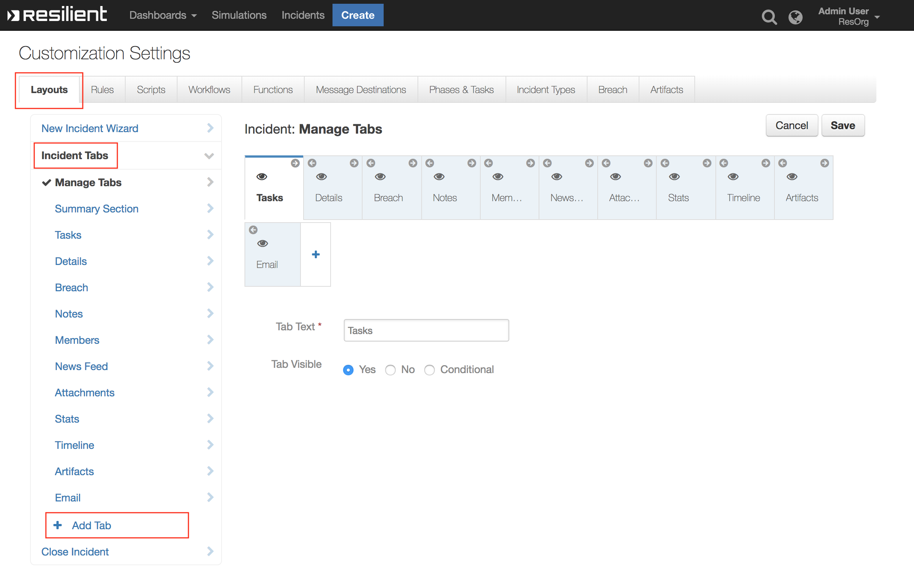
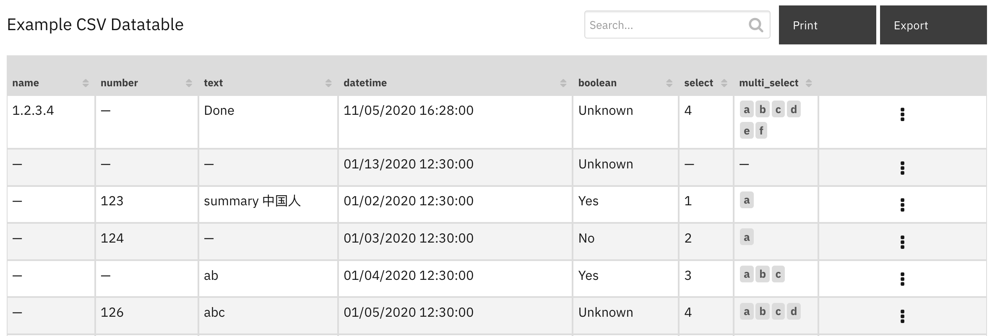

<!--
  This User README.md is generated by running:
  "resilient-sdk docgen -p fn_datatable_utils --user-guide"

  It is best edited using a Text Editor with a Markdown Previewer. VS Code
  is a good example. Checkout https://guides.github.com/features/mastering-markdown/
  for tips on writing with Markdown

  If you make manual edits and run docgen again, a .bak file will be created

  Store any screenshots in the "doc/screenshots" directory and reference them like:
  
-->

# **User Guide:** fn_datatable_utils_v1.1.0

## Table of Contents
- [Setup](#setup)
- [Key Features](#key-features)
- [Function - Data Table Utils: Get Row](#function---data-table-utils-get-row)
- [Function - Data Table Utils: Get Rows](#function---data-table-utils-get-rows)
- [Function - Data Table Utils: Update Row](#function---data-table-utils-update-row)
- [Function - Data Table Utils: Delete Row](#function---data-table-utils-delete-row)
- [Function - Data Table Utils: Delete Rows](#function---data-table-utils-delete-rows)
- [Function - Data Table Utils: Create CSV Datatable](#function---data-table-utils-create-csv-datatable)
- [Data Table - Example CSV Datatable](#data-table---example-csv-datatable)
- [Rules](#rules)

---

## Release Notes
### v1.1.0
* Added support for App Host
Added Functions:
* `dt_utils_get_row`
* `dt_utils_get_rows`
* `dt_utils_delete_row`
* `dt_utils_delete_rows`
* `dt_utils_create_csv_table`

### v1.0.0
* Initial Release

---
**This package contains 6 functions that help you manipulate IBM Resilient Data Tables**

 

The 6 functions allow you to GET, UPDATE, DELETE a row,  GET and DELETE rows in a Data Table, and populate CSV data into a datatable.

---
## Setup
To reference the example datatable, create a new incident tab and drag the `Example CSV DataTable` into the widget area.




---
## Function - Data Table Utils: Get Row
Function that searches for a row using a internal row ID or a search_column and search_value pair, and returns the information on the row that is found, if such a row exists.

An example Rule and Workflow exist for using this function on the example datatable from an artifact value.

 

<details><summary>Inputs:</summary>
<p>

| Name | Type | Required | Example | Tooltip |
| ---- | :--: | :------: | ------- | ------- |
| `dt_utils_datatable_api_name` | `text` | Yes | `-` | The API name of the Data Table |
| `dt_utils_row_id` | `number` | No | `-` | The internal ID of the row to be retrieved |
| `dt_utils_search_column` | `text` | No | `-` | The API name of the column to search |
| `dt_utils_search_value` | `text` | No | `-` | The cell value to search for within the search column |
| `incident_id` | `number` | Yes | `-` | - |

</p>
</details>

<details><summary>Outputs:</summary>
<p>

```python
results = {
    # TODO: Copy and paste an example of the Function Output within this code block.
    # To view the output of a Function, run resilient-circuits in DEBUG mode and invoke the Function. 
    # The Function results will be printed in the logs: "resilient-circuits run --loglevel=DEBUG"
}
```

</p>
</details>

<details><summary>Workflows</summary>

  <details><summary>Example Pre-Process Script:</summary>
  <p>

  ```python
  # Data Table Utils: Example: Get Row

#####################
### Define Inputs ###
#####################

# The ID of this incident
inputs.incident_id = incident.id

# The api name of the Data Table to update
inputs.dt_utils_datatable_api_name = "dt_utils_test_data_table"

# The column api name to search for
inputs.dt_utils_search_column = "dt_col_name"

# The cell value to search for
inputs.dt_utils_search_value = artifact.value

## Alternatively you can get the row by its ID by defining this input:
# inputs.dt_utils_row_id = 3

  ```

  </p>
  </details>

  <details><summary>Example Post-Process Script:</summary>
  <p>

  ```python
  search_value = results.inputs["dt_utils_search_value"]
note_text = u"<b>Result from Example: Data Table Utils: Get Row</b><br> search value: {0}".format(search_value) 
if results.success:
  note_text = u"{0} <br>{1}".format(note_text, str(results["row"]))
else:
  note_text = u"{0} <br>No row found.".format(note_text)

incident.addNote(helper.createRichText(note_text))
  ```

  </p>
  </details>

</details>

---

## Function - Data Table Utils: Get Rows
Function that returns the full list of rows in a datatable based on the search value. List sorting is possible using the sort_by and sort_direction input fields.

An example Rule and Workflow exist for searching the example datatable based on an artifact value.

 

<details><summary>Inputs:</summary>
<p>

| Name | Type | Required | Example | Tooltip |
| ---- | :--: | :------: | ------- | ------- |
| `dt_utils_datatable_api_name` | `text` | Yes | `-` | The API name of the Data Table |
| `dt_utils_max_rows` | `number` | No | `-` | The maximum number of rows to be returned |
| `dt_utils_search_column` | `text` | No | `-` | The API name of the column to search |
| `dt_utils_search_value` | `text` | No | `-` | The cell value to search for within the search column |
| `dt_utils_sort_by` | `text` | No | `-` | The API name of the column to sort by |
| `dt_utils_sort_direction` | `select` | No | `-` | - |
| `incident_id` | `number` | Yes | `-` | - |

</p>
</details>

<details><summary>Outputs:</summary>
<p>

```python
results = {
    # TODO: Copy and paste an example of the Function Output within this code block.
    # To view the output of a Function, run resilient-circuits in DEBUG mode and invoke the Function. 
    # The Function results will be printed in the logs: "resilient-circuits run --loglevel=DEBUG"
}
```

</p>
</details>

<details><summary>Workflows</summary>

  <details><summary>Example Pre-Process Script:</summary>
  <p>

  ```python
  # Data Table Utils: Example: Get Rows

#####################
### Define Inputs ###
#####################

# The ID of this incident
inputs.incident_id = incident.id

# The api name of the Data Table to update
inputs.dt_utils_datatable_api_name = "dt_utils_test_data_table"

# The number of max rows to return
if rule.properties.dt_utils_max_rows:
  inputs.dt_utils_max_rows = rule.properties.dt_utils_max_rows
else:
  inputs.dt_utils_max_rows = 0
  
# The direction of the sort
if rule.properties.dt_utils_sort_direction:
  inputs.dt_utils_sort_direction = rule.properties.dt_utils_sort_direction
else:
  inputs.dt_utils_sort_direction = "ASC"

# The api name of the column to sort by
if rule.properties.dt_utils_sort_by:
  inputs.dt_utils_sort_by = rule.properties.dt_utils_sort_by
else:
  inputs.dt_utils_sort_by = None
  
# The column api name to search for
inputs.dt_utils_search_column = "dt_col_name"

# The cell value to search for
inputs.dt_utils_search_value = artifact.value
  ```

  </p>
  </details>

  <details><summary>Example Post-Process Script:</summary>
  <p>

  ```python
  if not results.success:
  incident.addNote(helper.createRichText("<b>Result from Example: Data Table Utils: Delete Rows</b><br>No rows found."))
  ```

  </p>
  </details>

</details>

---
## Function - Data Table Utils: Update Row
Function that takes a string-encoded JSON String of 'search_column and search_value' pairs to update a Data Table row.

When used on a datatable, specify  dt_utils_row_id = 0 to refer to the currently referenced datatable row.

Two sets example Rule and Workflow are available for changing the example datatable from an artifact value and directly from a row in the datatable.

 

<details><summary>Inputs:</summary>
<p>

| Name | Type | Required | Example | Tooltip |
| ---- | :--: | :------: | ------- | ------- |
| `dt_utils_cells_to_update` | `text` | Yes | `-` | A JSON String containing the column names and cell values to update |
| `dt_utils_datatable_api_name` | `text` | Yes | `-` | The API name of the Data Table |
| `dt_utils_row_id` | `number` | No | `-` | The internal ID of the row to be retrieved |
| `incident_id` | `number` | Yes | `-` | - |

</p>
</details>

<details><summary>Outputs:</summary>
<p>

```python
results = {
    # TODO: Copy and paste an example of the Function Output within this code block.
    # To view the output of a Function, run resilient-circuits in DEBUG mode and invoke the Function. 
    # The Function results will be printed in the logs: "resilient-circuits run --loglevel=DEBUG"
}
```

</p>
</details>

<details><summary>Workflows</summary>

  <details><summary>Example Pre-Process Script:</summary>
  <p>

  ```python
  # Data Table Utils: Example: Update Row
import java.util.Date as Date

#######################################
### Define pre-processing functions ###
#######################################
def dict_to_json_str(d):
  """Function that converts a dictionary into a JSON string.
     Supports types: basestring, bool, int and nested dicts.
     Does not support lists.
     If the value is None, it sets it to False."""

  json_entry = '"{0}":{1}'
  json_entry_str = '"{0}":"{1}"'
  entries = [] 

  for entry in d:
    key = entry
    value = d[entry]

    if value is None:
      value = False

    if isinstance(value, list):
      helper.fail('dict_to_json_str does not support Python Lists')

    if isinstance(value, basestring):
      value = value.replace(u'"', u'\\"')
      entries.append(json_entry_str.format(key, value))
    
    elif isinstance(value, bool):
      value = 'true' if value == True else 'false'
      entries.append(json_entry.format(key, value))

    elif isinstance(value, dict):
      entries.append(json_entry.format(key, dict_to_json_str(value)))

    else:
      entries.append(json_entry.format(key, value))

  return '{0} {1} {2}'.format('{', ','.join(entries), '}')

# S T A R T

# The ID of this incident
inputs.incident_id = incident.id

# The api name of the Data Table to update [here it is taken from previous Get Row Function]
inputs.dt_utils_datatable_api_name = "dt_utils_test_data_table"

# Refer to the existing row (value: 0)
inputs.dt_utils_row_id = 0

# The column api names and the value to update the cell to
inputs.dt_utils_cells_to_update = dict_to_json_str({
  "datetime": Date().getTime(),
  "text": "Done"
})

  ```

  </p>
  </details>

  <details><summary>Example Post-Process Script:</summary>
  <p>

  ```python
  None
  ```

  </p>
  </details>

</details>

---
## Function - Data Table Utils: Delete Row
Function that deletes a row from a Data Table given the internal row ID.

When used on a datatable, specify  dt_utils_row_id = 0 to reference the currently referenced datatable row. The delete operation will be delayed as the workflow will first terminate before the row is deleted.

An example Rule and Workflow are available for deleting datatable rows based on an artifact value and against a row in the example datatable.

  

<details><summary>Inputs:</summary>
<p>

| Name | Type | Required | Example | Tooltip |
| ---- | :--: | :------: | ------- | ------- |
| `dt_utils_datatable_api_name` | `text` | Yes | `-` | The API name of the Data Table |
| `dt_utils_row_id` | `number` | No | `-` | The internal ID of the row to be retrieved. Specify 0 when used on a datatable. |
| `incident_id` | `number` | Yes | `-` | - |

</p>
</details>

<details><summary>Outputs:</summary>
<p>

```python
results = {
    # TODO: Copy and paste an example of the Function Output within this code block.
    # To view the output of a Function, run resilient-circuits in DEBUG mode and invoke the Function. 
    # The Function results will be printed in the logs: "resilient-circuits run --loglevel=DEBUG"
}
```

</p>
</details>

<details><summary>Workflows</summary>

  <details><summary>Example Pre-Process Script:</summary>
  <p>

  ```python
  # Data Table Utils: Example: Delete Row

#####################
### Define Inputs ###
#####################

# The ID of this incident
inputs.incident_id = incident.id

# The api name of the Data Table [here it is taken from previous Get Row Function]
inputs.dt_utils_datatable_api_name = workflow.properties.row_to_delete.inputs.dt_utils_datatable_api_name

# The ID of the row to delete [again, taken from previous Get Row Function]
inputs.dt_utils_row_id = workflow.properties.row_to_delete.row["id"]
  ```

  </p>
  </details>

  <details><summary>Example Post-Process Script:</summary>
  <p>

  ```python
  # {'success': True, 'inputs': {'incident_id': 2150, 'dt_utils_datatable_api_name': 'dt_utils_test_data_table', 'dt_utils_row_id': 821}, 'row': {'success': True, 'title': None, 'message': None, 'hints': []}}
if results.success:
  note = u"Row id: {} removed from datatable: {} for artifact: {}".format(results.inputs['dt_utils_row_id'], results.inputs['dt_utils_datatable_api_name'], artifact.value)
else:
  note = u"Artifact: {} not found in datatable: {}".format(artifact.value, results.inputs['dt_utils_datatable_api_name'])
  
incident.addNote(note)
  ```

  </p>
  </details>

</details>

---
## Function - Data Table Utils: Delete Rows
Function that deletes rows from a Data Table given a list of internal row IDs or a 'search_column and search_value' pair.

An example Rule and Workflow are available for deleting datatable rows based on an artifact value.

 

<details><summary>Inputs:</summary>
<p>

| Name | Type | Required | Example | Tooltip |
| ---- | :--: | :------: | ------- | ------- |
| `dt_utils_datatable_api_name` | `text` | Yes | `-` | The API name of the Data Table |
| `dt_utils_rows_ids` | `text` | No | `-` | The list of internal rows IDs of a Data Table to delete |
| `dt_utils_search_column` | `text` | No | `-` | The API name of the column to search |
| `dt_utils_search_value` | `text` | No | `-` | The cell value to search for within the search column |
| `incident_id` | `number` | Yes | `-` | - |

</p>
</details>

<details><summary>Outputs:</summary>
<p>

```python
results = {
    # TODO: Copy and paste an example of the Function Output within this code block.
    # To view the output of a Function, run resilient-circuits in DEBUG mode and invoke the Function. 
    # The Function results will be printed in the logs: "resilient-circuits run --loglevel=DEBUG"
}
```

</p>
</details>

<details><summary>Workflows</summary>

  <details><summary>Example Pre-Process Script:</summary>
  <p>

  ```python
  # Data Table Utils: Example: Delete Row

#####################
### Define Inputs ###
#####################

# The ID of this incident
inputs.incident_id = incident.id

# The api name of the Data Table, search column, search value [here it is taken from previous Get Rows Function inputs]
inputs.dt_utils_datatable_api_name = workflow.properties.rows_to_delete.inputs.dt_utils_datatable_api_name

# The internal IDs of the rows that will be deleted [again, taken from previous Get Rows Function]
if workflow.properties.rows_to_delete and workflow.properties.rows_to_delete.rows:
  rows_ids = []
  for row in workflow.properties.rows_to_delete.rows:
    rows_ids.append(row["id"])
  inputs.dt_utils_rows_ids = str(rows_ids)
  ```

  </p>
  </details>

  <details><summary>Example Post-Process Script:</summary>
  <p>

  ```python
  if results.success:
  note = u"<b>Result from Example: Data Table Utils: Artifact: {} Delete Rows</b><br> {}".format(artifact.value, str(results["rows_ids"]))
else:
  note = u"<b>Result from Example: Data Table Utils: Artifact: {} not found in datatable: {}".format(artifact.value, results.inputs['dt_utils_datatable_api_name'])
  
incident.addNote(helper.createRichText(note))

"""
# {'success': True, 'inputs': {'incident_id': 2150, 'dt_utils_datatable_api_name': 'dt_utils_test_data_table', 'dt_utils_row_id': 821}, 'row': {'success': True, 'title': None, 'message': None, 'hints': []}}
if results.success:
  note = u"Row id: {} removed from datatable: {} for artifact: {}".format(results.inputs['dt_utils_row_id'], results.inputs['dt_utils_datatable_api_name'], artifact.value])
"""
  ```

  </p>
  </details>

</details>

---
## Function - Data Table Utils: Create CSV Datatable
Add CVS data to a named datatable. CSV data can originate from another function or from a referenced attachment with CSV encoded data. A mapping table is used to map CSV header row labels to datatable column (API) names.

Attempts are made to match the field type of the datatable. CSV data matched to `select` and `multi-select` datatables columns must contain the correct values specified for those columns. String-based date fields will be converted into epoch timestamp values based on a date format pattern (ex. '%Y-%m-%d %H:%M:%S.%f') for `datetimepicker` and `datepicker` datatable column types. See [https://strftime.org/](https://strftime.org/) for the formatted values to use.

 

<details><summary>Inputs:</summary>
<p>

| Name | Type | Required | Example | Tooltip |
| ---- | :--: | :------: | ------- | ------- |
| `attachment_id` | `number` | No | `-` | - |
| `dt_csv_data` | `text` | No | `CSV Data` | string of cvs data consisting an optional header row followed by rows of comma separated data. each comma separated field may contain quotes to allow for embedded commas |
| `dt_datable_name` | `text` | Yes | `Datatable Name` | string of api name of datatable |
| `dt_date_time_format` | `text` | No | `E.g. dd/mm/yyyy` | If the CSV data contains date entries, provide the format for the date for conversion to a epoch timestamp. |
| `dt_has_headers` | `boolean` | No | `-` | boolean True/Yes if the csv_data contains header information to match with the column names of the datatable. If False/No, the data is added to the datatable in column order. |
| `dt_mapping_table` | `text` | No | `Mapping Table` | String formatted json: """{ "column_header": "column_name", ...}""" |
| `dt_max_rows` | `number` | No | `-` | limit the number of rows to include. No value means unlimited. |
| `incident_id` | `number` | Yes | `-` | - |

</p>
</details>

<details><summary>Outputs:</summary>
<p>

```python
results = {
    # TODO: Copy and paste an example of the Function Output within this code block.
    # To view the output of a Function, run resilient-circuits in DEBUG mode and invoke the Function. 
    # The Function results will be printed in the logs: "resilient-circuits run --loglevel=DEBUG"
}
```

</p>
</details>

<details><summary>Workflows</summary>

  <details><summary>Example Pre-Process Script:</summary>
  <p>

  ```python
  # Data Table Utils: Example: CSV Table
#####################
### Define Inputs ###
#####################
# The ID of this incident
inputs.incident_id = incident.id
# The api name of the Data Table to update
inputs.dt_datable_name = "dt_utils_test_data_table"
# uncomment when reading csv data from an attachmennt
### inputs.attachment_id = attachment.id

# The CSV data. Use either dt_csv_data or attachment_id
inputs.dt_csv_data = u"""hdr_number,hdr_text,hdr_datetime,hdr_boolean,hdr_select,hdr_multi_select,hdr_extra 
18023,"summary 中国人",6/6/2020,yes,3,"a, b",中"""
# A boolean to determine if CSV headers should be used
inputs.dt_has_headers = True

## The mapping format should be "cvs_header":"dt_column_name". 
## Or when headers are absent, a numeric csv data position for the column order: 0: "dt_column_name"
mapping = '''{
  "hdr_number": "number",
  "hdr_text": "text",
  "hdr_boolean": "boolean",
  "hdr_datetime": "datetime",
  "hdr_select": "select",
  "hdr_multi_select": "multi_select"
}'''
inputs.dt_mapping_table = mapping
# year - %Y, month - %m, day - %d, hour - %H, minutes - %M, seconds - %S, milliseconds - %f, timezone offset - %z'
inputs.dt_date_time_format = "%d/%m/%Y"
#inputs.dt_max_rows = 10
  ```

  </p>
  </details>

  <details><summary>Example Post-Process Script:</summary>
  <p>

  ```python
  if results.success:
  note_text = u"""Results from Data Table Utils: Create CSV Datatable\nData Source: {0}\nRows added: {1}\nRows not added: {2}""".format( results.content.data_source, results.content.rows_added, results.content.rows_with_errors )
  incident.addNote(note_text)
else:
  incident.addNote(u"Error: Failed to add rows")
  ```

  </p>
  </details>

</details>

---

## Data Table - Example CSV Datatable
This datatable is used for testing purposes to run the example Rules and Workflows. It contains all the different datatable column types for function testing.

 

#### API Name:
dt_utils_test_data_table

#### Columns:
| Column Name | API Access Name | Type | Tooltip |
| ----------- | --------------- | ---- | ------- |
| name | `dt_col_name` | `text` | - |
| text | `text` | `text` | - |
| number | `number` | `number` | - |
| boolean | `boolean` | `boolean` | - |
| datetime | `datetime` | `datetimepicker` | - |
| select | `select` | `select` | - |
| multi_select | `multi_select` | `multiselect` | - |

---

## Rules
| Rule Name | Object | Workflow Triggered |
| --------- | ------ | ------------------ |
| Get Data Table Row | artifact | `example_data_table_utils_get_row` |
| Get Data Table Rows | artifact | `example_data_table_utils_get_rows` |
| Update Data Table Row | artifact | `example_data_table_utils_update_row` |
| Update Current Row | dt_utils_test_data_table | `update_row` |
| Delete Data Table Row | artifact | `example_data_table_utils_delete_row` |
| Delete Current Row | dt_utils_test_data_table | `example_data_table_utils_delete_row_from_datatable` |
| Delete Rows by Name | dt_utils_test_data_table | `example_data_table_utils_delete_rows_from_datatable` |
| Delete Data Table Rows | artifact | 
| Example: Create CSV Datatable | attachment | `example_create_csv_datatable` |

---

<!--
## Inform Resilient Users
  Use this section to optionally provide additional information so that Resilient playbook 
  designer can get the maximum benefit of your integration.
-->