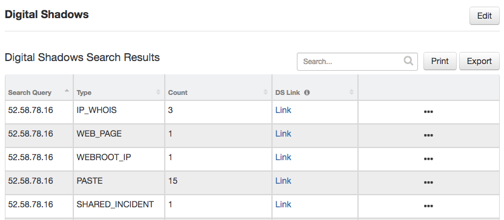

# Digital Shadows Search Function for IBM Resilient

## Table of Contents
  - [app.config settings](#appconfig-settings)
  - [Function Inputs](#function-inputs)
  - [Function Output](#function-output)
  - [Pre-Process Script](#pre-process-script)
  - [Post-Process Script](#post-process-script)
  - [Rules](#rules)
  - [Datatable](#datatable)
    - [Display the Datatable in an Incident](#display-the-datatable-in-an-incident)
---

**This package contains a function that searches your Digital Shadows platform with the given query**

 

The function makes use of the Digital Shadows `/search/find` API call to get information on a given query

## app.config settings:
```
[fn_digital_shadows_search]
ds_api_key=
ds_api_secret=
ds_base_url=https://portal-digitalshadows.com/api
```

## Function Inputs:
| Function Name | Type | Required | Example | Info |
| ------------- | :--: | :-------:| ------- | ---- |
| `ds_search_value` | `String` | Yes | `"192.168.0.1"` | The search value to send to Digital Shadows (may be any String that contains an IP Address, URL etc.) |

## Function Output:
```python
results = {
  "success": True,

  "inputs": {
    "ds_search_value": "192.168.0.1"
  },

  "link": "https://portal-digitalshadows.com/search?q=52.58.78.16&view=List",

  "href": "<a href=https://portal-digitalshadows.com/search?q=52.58.78.16&view=List>Link</a>",

  "data": [{
    "type": "WEBROOT_IP",
    "entity": {
      "reputationScore": 87,
      "ipReputationHistory": [{
        "timestamp": "2017-11-17T01:10:02.000Z",
        "reputation": 86
      }, {
        "timestamp": "2017-11-11T18:59:00.000Z",
        "reputation": 80
      }, {
        "timestamp": "2017-11-10T18:59:00.000Z",
        "reputation": 5
      }],
      "currentlyClassifiedAsThreat": False,
      "ipGeoInfo": {
        "city": "sample string",
        "country": "sample string",
        "region": "",
        "longitude": "sample string",
        "sld": "sample string",
        "state": "sample string",
        "carrier": "sample string",
        "tld": "sample string",
        "latitude": "sample string",
        "organization": "sample string",
        "asn": "sample string"
      },
      "threatCategories": [],
      "ipIncidentHistory": [{
        "scanDetails": [],
        "durationSeconds": 0,
        "threatType": "Mobile Threats",
        "numOfConnectedLowRepApps": 2,
        "eventDescription": "IP is associated with a malicious mobile app",
        "eventType": "Malicious Mobile Activity",
        "numberOfAttempts": 0,
        "observed": "2017-11-07T01:15:11.000Z",
        "applications": [{
          "category": "Adware",
          "description": "Downloads more apps and adware",
          "appName": "sample string",
          "requestedPermissions": ["sample string", "sample string"],
          "packageName": "sample string",
          "md5Hash": "sample string",
          "reputationCategory": "Malicious",
          "firstSeen": "2017-06-10T10:37:42.000Z"
        }],
        "attackDetails": [],
        "hostingPhishUrls": [],
        "startDateTime": "2017-11-07T00:44:12.000Z",
        "classifiedAsThreat": True
      }],
      "updatedDateTime": "2017-11-17T01:10:02.000Z",
      "ipThreatHistory": [{
        "timestamp": "2017-11-11T04:52:39.000Z",
        "classifiedAsThreat": False
      }, {
        "threatTypes": ["phishing", "proxy"],
        "timestamp": "2017-11-10T19:00:13.000Z",
        "classifiedAsThreat": True
      }, {
        "threatTypes": ["phishing", "proxy", "mobile threats"],
        "timestamp": "2017-11-03T01:35:11.000Z",
        "classifiedAsThreat": True
      }],
      "ipAddress": "192.168.0.1",
      "asn": 16509
    }
  }, {
    "snippet": "Metadata match (page text)\n .se (<em>192.168.0.1</em> AT-88-Z US):\n\n\n\n\n\nFigure 3. SMTP header details of wave 2\n\nIn this case the fake",
    "sortDate": "2018-10-18T13:24:43.288Z",
    "type": "SHARED_INCIDENT",
    "entity": {
      "restrictedContent": False,
      "verified": "2018-10-18T13:03:15.731Z",
      "severity": "LOW",
      "title": "sample text",
      "closedSource": False,
      "modified": "2018-10-18T15:56:58.705Z",
      "summary": "sample text",
      "version": 7,
      "occurred": "2018-10-16T23:00:00.000Z",
      "published": "2018-10-18T13:24:43.858Z",
      "indicatorOfCompromiseCount": 16,
      "scope": "GLOBAL",
      "entitySummary": {
        "domain": "sample text",
        "screenshot": {
          "link": "sample text",
          "id": "sample text",
          "thumbnail": {
            "link": "sample text",
            "id": "sample text"
          }
        },
        "contentRemoved": False,
        "summaryText": "sample text",
        "screenshotId": "sample text",
        "source": "sample text",
        "sourceDate": "sample text",
        "screenshotThumbnailId": "sample text",
        "type": "WEB_PAGE"
      },
      "score": 0,
      "type": "CYBER_THREAT",
      "id": 45756395,
      "tags": [{
        "type": "TARGET_SECTORS",
        "id": 1090,
        "name": "Industrial Goods & Services"
      }, {
        "type": "INTENDED_EFFECTS",
        "id": 418,
        "name": "Unauthorised Access"
      }],
      "description": "sample text"
    }
  }, {
    "snippet": "sample text",
    "sortDate": "2018-05-21T17:20:39.415Z",
    "type": "WEB_PAGE",
    "entity": {
      "siteCategories": ["UNCATEGORISED"],
      "title": "sample text",
      "observableCounts": {
        "sha1": {
          "count": 0,
          "exceededMaximum": False
        },
        "cve": {
          "count": 0,
          "exceededMaximum": False
        },
        "host": {
          "count": 61,
          "exceededMaximum": False
        },
        "ipV4": {
          "count": 4,
          "exceededMaximum": False
        },
        "sha256": {
          "count": 0,
          "exceededMaximum": False
        },
        "email": {
          "count": 1,
          "exceededMaximum": False
        },
        "md5": {
          "count": 0,
          "exceededMaximum": False
        }
      },
      "screenshotId": "sample text",
      "discovered": "sample text",
      "source": "sample text",
      "screenshotThumbnailId": "sample text",
      "id": "sample text"
    }
  }, {
    "snippet": "sample text",
    "sortDate": "2018-01-07T07:44:22.000Z",
    "type": "PASTE",
    "entity": {
      "screenshotThumbnail": {
        "link": "sample text",
        "id": "sample text"
      },
      "screenshot": {
        "link": "sample text",
        "id": "sample text"
      },
      "pasted": "2018-01-07T07:44:22.000Z",
      "observableCounts": {
        "sha1": {
          "count": 0,
          "exceededMaximum": False
        },
        "cve": {
          "count": 0,
          "exceededMaximum": False
        },
        "host": {
          "count": 100,
          "exceededMaximum": True
        },
        "ipV4": {
          "count": 90,
          "exceededMaximum": False
        },
        "sha256": {
          "count": 0,
          "exceededMaximum": False
        },
        "email": {
          "count": 0,
          "exceededMaximum": False
        },
        "md5": {
          "count": 0,
          "exceededMaximum": False
        }
      },
      "uri": "sample text",
      "id": "sample text"
    }
  }, {
    "snippet": "sample text",
    "sortDate": "2018-01-09T17:09:55.963Z",
    "type": "CLIENT_INCIDENT",
    "entity": {
      "takedownRequestCount": 0,
      "version": 8,
      "subType": "PHISHING_ATTEMPT",
      "alerted": "2018-01-12T15:21:45.352Z",
      "entitySummary": {
        "domain": "blinkbox.nu",
        "screenshot": {
          "link": "sample text",
          "id": "sample text",
          "thumbnail": {
            "link": "sample text",
            "id": "sample text"
          }
        },
        "screenshotId": "sample text",
        "source": "sample text",
        "sourceDate": "2018-01-09T17:09:55.975Z",
        "screenshotThumbnailId": "sample text",
        "type": "DOMAIN",
        "originalDomains": ["sample text"]
      },
      "id": 2108222,
      "verified": "2018-01-11T15:49:37.486Z",
      "severity": "MEDIUM",
      "title": "Parked domain xxx identified\r\n",
      "review": {},
      "closedSource": False,
      "mitigation": "sample text",
      "scope": "ORGANIZATION",
      "type": "BRAND_PROTECTION",
      "description": "sample text",
      "tags": [{
        "type": "BRAND_PROTECTION",
        "id": 332,
        "name": "Phishing Attempt"
      }],
      "occurred": "2018-01-09T17:09:55.975Z",
      "score": 0,
      "impactDescription": "sample text",
      "modified": "2018-01-15T12:06:02.798Z",
      "published": "2018-01-12T15:21:45.352Z",
      "restrictedContent": False
    }
  }]
}
```

## Pre-Process Script:
This example sets the `ds_search_value` input to the value of the Artifact the user took action on
```python
# The search value to send to Digital Shadows (may be any String that contains an IP Address, URL etc.)
inputs.ds_search_value = artifact.value
```

## Post-Process Script:
This example loops results.data and gets a count of each 'type' of results. Then for each result **adds a row to the DS Datatable**
```python
# If function succeeds
if results.success:
  
  DS_DATATABLE_API_NAME = "ds_search_results"

  # Initialise num_of_each_type dict
  num_of_each_type = {}
  
  # Loop search results
  for result in results.data:
    
    # If this type has already been found, increment num
    if result.type in num_of_each_type:
      num_of_each_type[result.type] = num_of_each_type[result.type] + 1
    
    # Else, first time found, set to 1
    else:
      num_of_each_type[result.type] = 1
  
  # Now loop the num_of_each_type and add a row to the datatable
  for entry in num_of_each_type:
    # Get datatable row
    row = incident.addRow(DS_DATATABLE_API_NAME)
    
    row_type = entry
    row_count = num_of_each_type[entry]
    
    # Set values of row cells
    row["search_query"] = results.inputs.ds_search_value
    row["type"] = row_type
    row["count"] = row_count
```

## Rules
| Rule Name | Object Type | Workflow Triggered |
| --------- | :---------: | ------------------ |
| Example: Digital Shadows Search | `Artifact` | `Example: Digital Shadows Search` |

## Datatable
### Digital Shadows Search Datatable
 

#### API Name:
ds_search_results

#### Columns:
| Column Name | API Access Name | Type |
| ----------- | --------------- | -----|
| Search Query | `search_query` | `Text` |
| Type | `type` | `Text` |
| Count | `count` | `Number` |
| DS Link | `ds_link` | `Rich Text Area` |


#### Display the Datatable in an Incident
* In IBM Resilient, each Incident can have one Digital Shadows Search Datatable
* In order to **display** the Datatable in your Incident, you must **modify your Layout Settings**

1. Go to **Customization Settings** > **Layouts** > **Incident Tabs** > **+ Add Tab**
 
2. Enter **Tab Text**: `Digital Shadows` and click **Add**
 
3. **Drag** the Datatable into the middle and click **Save**
 
4. Create a new Incident and you will now see the **Digital Shadows Tab** with the Datatable
