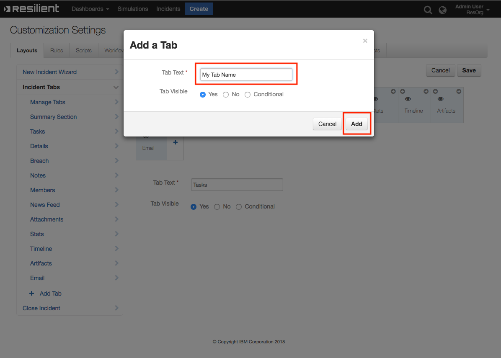

# IBM Resilient Integration with Docker

The Resilient Integration with Docker provides tools to integrate Docker into your Incident Response Plan. The integration brings Automation and Orchestration capabilities for Dockerised tools that can be used for Malware Research and Incident Response.

**This package contains 1 Function, 3 Workflows, 3 Rules and 1 Data Table that help you integrate with Docker**

 
## Table of Contents
- [Integration app.config settings:](#integration-appconfig-settings)
- [Image specific app.config sections](#image-specific-appconfig-sections)
- [Function: Run Docker Container](#1-run-docker-container)
- [Workflow: Send Artifact To Docker Container](#1-send-artifact-to-docker-container)
- [Workflow: Send Attachment To Docker Container](#2-send-attachment-to-docker-container)
- [Rules:](#rules)
- [Datatable:](#datatable)
    - [Docker External Ticket Status Datatable](#docker-external-ticket-status-datatable)
    - [API Name:](#api-name)
    - [Columns:](#columns)
    - [Display the Datatable in an Incident](#display-the-datatable-in-an-incident)

# Pre-Requisite Steps and Info: 

### Install Docker 
This integration requires access to a Docker daemon, in order to run containers and get output. Typically the Docker daemon would be on the same machine that you intend to run the containers from so this would mean installing Docker on your integration server itself.
To install Docker on your Integration Server see [this link](https://docs.docker.com/install/linux/docker-ee/rhel/) for RHEL, [this one](https://docs.docker.com/docker-for-mac/install/) for MacOS or [this one](https://docs.docker.com/install/) for everything else. 


### Pulling Images
This integration package does not pull docker images for you. This is intentional to reduce the chance of downloading an unintended image for use in your organisation. 
Images you wish to use with the integration will need to be pulled separately either from a registry or a Github repo using the `docker pull` command.

Git Repo Example: `docker build -t amass https://github.com/OWASP/Amass.git` 
Dockerhub Example: `docker pull blacktop/nsrl`  
### Connection options and installation:  
There are a number of connection options for this integration. The easiest to setup and maintain is using a local Docker connection by installing Docker on the Integration Server.
Alternatively, if you already have an Docker daemon exposed on a port that you can connect to and use, you may instead opt to connect to and run containers using this daemon instead of installing Docker on your integration server. 
This is done by specifying the `docker_remote_url` value in the app.config section which will specify the location of the Docker daemon and also which remote connection option to use, of which there are two: TCP and SSH.

### SSH Connection Setup 
SSH as a connection option is a relatively new connection option, first announced in [2018](https://blog.docker.com/2018/09/join-the-beta-for-docker-engine-18-09/) 
 is also provided to enable secure connections to a Docker daemon without the need to modify existing Docker setup.
Docker SSH support requires Docker version 18.09 or higher. 

Docker SSH requires using SSH Keys rather than a username and password and use the Paramiko library to do it.

A good tutorial on generating SSH Keys can be found [here](https://help.github.com/en/articles/generating-a-new-ssh-key-and-adding-it-to-the-ssh-agent) 

After you have generated your SSH Key, you will need to ensure it is an authorized key on the machine you intend to connect to. 
For information on copying SSH keys to another machine as an authorized key, [see here](https://www.ssh.com/ssh/copy-id)

### Known Issues 
Currently there is limited support for Attachment Workflows when using remote connections. 
This is due to how the remote volume bindings are established, where if the source directory does not exist on the destination host, it will attempt to create it.
For this reason when using remote connections it is advised your source volume directory is in a common directory such as `/tmp/`.

Additionally, for images which do not run as root, you will need to ensure the attachments have the right permissions on the destination source to be accessible from a remote source. e.g `chmod a+xwr ~/<dest_dir>`

# About the provided UseCases 

## Volatility 
The Volatility Framework is a completely open collection of tools,
implemented in Python, [[source]](https://github.com/volatilityfoundation/volatility) used to analyze volatile memory (RAM) samples.

[View this image on DockerHub](https://hub.docker.com/r/remnux/volatility)
## NSRL Whitelist

The National Software Reference Library (NSRL) is designed to collect software from various sources and incorporate file profiles computed from this software into a Reference Data Set (RDS) of information.
The RDS is a collection of digital signatures of known, traceable software applications.[Source](https://www.nist.gov/software-quality-group/about-nsrl)

[View this image on DockerHub](https://hub.docker.com/r/blacktop/nsrl)

## Amass 
The OWASP Amass tool suite obtains subdomain names by scraping data sources, recursive brute forcing, crawling web archives, permuting/altering names and reverse DNS sweeping.[Source](https://github.com/OWASP/Amass) 

[View this image on Github](https://github.com/OWASP/Amass)

# app.config settings:
There are two ways to configure settings for this Integration. You can choose to configure general settings for the Integration itself such as which method to use for connections. 
Additionally, each image you intend to create containers from can have its own app.config section.

## Integration app.config settings:
The Integration has a number of app.config settings which manage how a connection to a Docker daemon is performed and also which images are approved to be run by the integration. The approved images list includes only the shortname of the docker image e.g remnux/volatility -> volatility is the shortname.

```bash
docker_approved_images=<imagename>,<imagename> # Which images are approved to be run e.g volatility,nsrl
docker_use_remote_conn=<True/False>
docker_remote_url=<URL>
```

## Image specific app.config sections 
Each Docker image has the opportunity to use its own app.config section for getting options which are specific to that image only. This includes the images full name, volume bindings if that container requires volumes and the command which will be sent to the built container.

Image specific app.config sections are found by searching for the image shortname postfixed to `fn_docker_`. This means that to enable image specific options that you need your section should be named this way e.g `fn_docker_volatility`. 
```bash
[fn_docker_volatility]
docker_image=remnux/volatility
primary_output_dir=/tmp/bind_folder
primary_internal_dir=/home/nonroot/memdumps
docker_extra_<argument>=<string> # Allows you to pass an extra argument used for docker container creation. See documentation
cmd_operation=pslist
cmd=vol.py -f {{internal_vol}}/{{attachment_input}} {{operation}}

```

Each image app.config section has the opportunity to include a number of extra arguments which will be used during container creation/invocation. This brings you, the designer, flexibility to configure different aspects of how the container will be run. For a list of which arguments you can modify this way [see here](). 

There are a number of arguments which you cannot modify as they are explicity set by the integration, these are :

+ Image -- The image is set in the app.config
+ Command -- The command is set in the app.config
+ Detach -- This is set to `True`. 
+ Remove -- This is set to `False`, the container is removed after logs and stats are gathered.

## Functions:

## **1: Run Docker Container**

### Function Inputs:

| Input Name | Type | Required | Example | Info |
| ------------- | :--: | :-------:| ------- | ------- |
| `incident_id` | `Number` | Yes | `2105`  | ------- |
| `task_id` | `Number` | No | `None` | ------- |
| `artifact_id` | `Number` | No | `None` | ------- |
| `attachment_id` | `Number` | No | `None` | ------- |
| `docker_image` | `Select` | Yes | `nsrl` | `Which image will be used by the function` |
| `docker_input` | `String` | No | `60B7C0FEAD45F2066E5B805A91F4F0FC` | `The input being fed to the container, only used for artifact level workflows` |
| `docker_artifact_type` | `String` | No | `Malware MD5 Hash` | `The type of artifact that this integration was ran against. Not used for attachment workflows.` |
| `docker_operation` | `String` | No | `pslist` | `A param value to be fed to a container's run command specifying a particular entrypoint or function for that image. Used for containers which have multiple possible operations you can perform in them such as Volatility` |


### Function Output:

```python
results = {
    'content': {'attachment_name': None,
             'container_exit_status': {'Error': None, 'StatusCode': 0},
             'container_id': '2e3760ce9fe8aaafbf41ce0eac49d0a9bf9b030d8840192ce053ff0b52d04b39',
             'container_stats': {'blkio_stats': {'io_merged_recursive': None,
                                                 'io_queue_recursive': None,
                                                 'io_service_bytes_recursive': None,
                                                 'io_service_time_recursive': None,
                                                 'io_serviced_recursive': None,
                                                 'io_time_recursive': None,
                                                 'io_wait_time_recursive': None,
                                                 'sectors_recursive': None},
                                 'cpu_stats': {'cpu_usage': {'total_usage': 0,
                                                             'usage_in_kernelmode': 0,
                                                             'usage_in_usermode': 0},
                                               'throttling_data': {'periods': 0,
                                                                   'throttled_periods': 0,
                                                                   'throttled_time': 0}},
                                 'id': '2e3760ce9fe8aaafbf41ce0eac49d0a9bf9b030d8840192ce053ff0b52d04b39',
                                 'memory_stats': {},
                                 'name': '/zealous_chaplygin',
                                 'num_procs': 0,
                                 'pids_stats': {},
                                 'precpu_stats': {'cpu_usage': {'total_usage': 0,
                                                                'usage_in_kernelmode': 0,
                                                                'usage_in_usermode': 0},
                                                  'throttling_data': {'periods': 0,
                                                                      'throttled_periods': 0,
                                                                      'throttled_time': 0}},
                                 'preread': '0001-01-01T00:00:00Z',
                                 'read': '0001-01-01T00:00:00Z',
                                 'storage_stats': {}},
             'logs': 'Hash 60B7C0FEAD45F2066E5B805A91F4F0FC found in NSRL '
                     'Database.\n',
             'res_links': {'res_object': 'https://192.168.57.101/#incidents/2097'}},
 'inputs': {'docker_artifact_type': 'Malware MD5 Hash',
            'docker_image': {'id': 1851, 'name': 'nsrl'},
            'docker_input': '60B7C0FEAD45F2066E5B805A91F4F0FC',
            'docker_operation': None,
            'incident_id': 2097},
 'metrics': {'execution_time_ms': 2844,
             'host': 'RyanG-MBP-18.local',
             'package': 'fn-docker',
             'package_version': '1.0.0',
             'timestamp': '2019-03-05 11:40:34',
             'timestamp_epoch': 1551786034614,
             'version': '1.0'},
 'raw': '{"logs": "Hash 60B7C0FEAD45F2066E5B805A91F4F0FC found in NSRL '
        'Database.\\n", "container_exit_status": {"Error": null, "StatusCode": '
        '0}, "container_stats": {"read": "0001-01-01T00:00:00Z", "preread": '
        '"0001-01-01T00:00:00Z", "pids_stats": {}, "blkio_stats": '
        '{"io_service_bytes_recursive": null, "io_serviced_recursive": null, '
        '"io_queue_recursive": null, "io_service_time_recursive": null, '
        '"io_wait_time_recursive": null, "io_merged_recursive": null, '
        '"io_time_recursive": null, "sectors_recursive": null}, "num_procs": '
        '0, "storage_stats": {}, "cpu_stats": {"cpu_usage": {"total_usage": 0, '
        '"usage_in_kernelmode": 0, "usage_in_usermode": 0}, "throttling_data": '
        '{"periods": 0, "throttled_periods": 0, "throttled_time": 0}}, '
        '"precpu_stats": {"cpu_usage": {"total_usage": 0, '
        '"usage_in_kernelmode": 0, "usage_in_usermode": 0}, "throttling_data": '
        '{"periods": 0, "throttled_periods": 0, "throttled_time": 0}}, '
        '"memory_stats": {}, "name": "/zealous_chaplygin", "id": '
        '"2e3760ce9fe8aaafbf41ce0eac49d0a9bf9b030d8840192ce053ff0b52d04b39"}, '
        '"container_id": '
        '"2e3760ce9fe8aaafbf41ce0eac49d0a9bf9b030d8840192ce053ff0b52d04b39", '
        '"res_links": {"res_object": '
        '"https://192.168.57.101/#incidents/2097"}, "attachment_name": null}',
 'reason': None,
 'success': False,
 'version': '1.0'
    }

```

## Workflows

### **1: Send Artifact To Docker Container**

An example workflow scoped for Artifacts which will, when invoked, send the artifact to a Docker container, perform some operation on the input and returns information to Resilient.

There are two provided use cases which each have their own Send Artifact To Docker Container workflow, showing how you can customize your own workflow to target a different image and usecase
### Pre-Process Script:

```python
inputs.docker_input = artifact.value
inputs.incident_id = incident.id 
inputs.docker_artifact_type = artifact.type
```

### Post-Process Script:

```python
note_text_start = u"""<b>Docker Integration</b>
              <br><br>A container was ran using the image <b>{0}</b>""".format(results.inputs["docker_image"]["name"])
              
# If the Attachment attribute of the content payload is set; we are dealing with an attachment
if results.content["attachment_name"] != None:
  note_text_attachment = u"""<br> On an Attachment with name {0} """.format(results.content["attachment_name"])
  note_text_start += note_text_attachment

# Otherwise we are dealing with an artifact
else:
  note_text_artifact = u"""<br> On an Artifact of Type: <b>{0}</b>
                          <br> Artifact Value: <b>{1}</b>""".format(results.inputs["docker_artifact_type"], results.inputs["docker_input"])
  note_text_start += note_text_artifact
              
note_text_end = """<br>Container ID : <b>{0}</b>
              <br>Container exit code : <b>{1}</b>
              <br><br> Container Logs have been saved as an attachment.
              Container Stats, Logs, Function Inputs or Run Time Metrics are also available as part of the result payload""".format(
                results.content["container_id"], results.content["container_exit_status"])

note_text = note_text_start+note_text_end
incident.addNote(helper.createRichText(note_text))

try:
    des = artifact.description.content
except Exception:
  des = None
  
if des is None:
  
  artifact.description = u"""<b>Docker Integration:</b><br> Artifact was scanned by docker image {0}  \n{1}""".format(results.inputs["docker_image"]["name"],results.content["logs"])
  # Uncomment this line to NOT have the Amass subdomain results appended to the descript of the artifact
  #artifact.description = u"""<b>Docker Integration:</b><br> Artifact was scanned by docker image {0}""".format(results.inputs["docker_image"]["name"])
else:
  
  artifact.description = des + u"""<b>Docker Integration:</b><br> Artifact was scanned by docker image {0}  \n{1}""".format(results.inputs["docker_image"]["name"],results.content["logs"])
  
  # Uncomment this line to NOT have the Amass subdomain results appended to the descript of the artifact
  #artifact.description = des + u"""<b>Docker Integration:</b><br> Artifact was scanned by docker image {0}""".format(results.inputs["docker_image"]["name"])
  
  
row = incident.addRow("docker_integration_invocations")
row["docker_timestamp"] = results["metrics"]["timestamp_epoch"] or 0
row["docker_container_id"] = results.content["container_id"]
row["docker_image"] = results.inputs["docker_image"]["name"]

row["docker_artifact_type"] = results.inputs["docker_artifact_type"]
row["docker_artifact_value"] = results.inputs["docker_input"]

```


### **2: Send Attachment To Docker Container**

An example workflow scoped for Attachments which will, when invoked, send the attachment to a Docker container, perform some operation on the input and returns information to Resilient.

### 2: Pre-Process Script:

```python
inputs.incident_id = incident.id 

# If this workflow has the task_id available, gather it incase we need it.
if task:
  inputs.task_id = task.id
# If this workflow has the attachment_id available, gather it incase we need it.
if attachment:
  inputs.attachment_id = attachment.id

# If this workflow has the artifact_id available, gather it incase we need it.
try: 
  if artifact:
    inputs.artifact_id = artifact.id
except:
  pass
```

### 2: Post-Process Script:

```python
note_text_start = u"""<b>Docker Integration</b>
              <br><br>A container was ran using the image <b>{0}</b>""".format(results.inputs["docker_image"]["name"])
              
# If the Attachment attribute of the content payload is set; we are dealing with an attachment
if results.content["attachment_name"] != None:
  note_text_attachment = u"""<br> On an Attachment with name {0} """.format(results.content["attachment_name"])
  note_text_start += note_text_attachment

# Otherwise we are dealing with an artifact
else:
  note_text_artifact = u"""<br> On an Artifact of Type: <b>{0}</b>
                          <br> Artifact Value: <b>{1}</b>""".format(results.inputs["docker_artifact_type"], results.inputs["docker_input"])
  note_text_start += note_text_artifact
              
note_text_end = """<br>Container ID : <b>{0}</b>
              <br>Container exit code : <b>{1}</b>
              <br><br> Container Logs have been saved as an attachment.
              Container Stats, Logs, Function Inputs or Run Time Metrics are also available as part of the result payload""".format(
                results.content["container_id"], results.content["container_exit_status"])

note_text = note_text_start+note_text_end

# If we are dealing with a task level attachment, then add a note to the task not the incident
if task:
  task.addNote(helper.createRichText(note_text))
else:
  incident.addNote(helper.createRichText(note_text))

# Add an entry to the docker_integration_invocations Datatable
row = incident.addRow("docker_integration_invocations")

if "task" in results.content["res_links"]["res_object"]:
  row["docker_links"] = u"""<a href="{}">{}</a>""".format(results.content["res_links"]["res_object"], "Task Link")

row["docker_timestamp"] = results["metrics"]["timestamp_epoch"] or 0
row["docker_container_id"] = results.content["container_id"]
row["docker_image"] = u":".join([results.inputs["docker_image"]["name"], results.inputs["docker_operation"]])
row["docker_attachment_name"] = results.content["attachment_name"]

```

## Rules:
| Rule Name | Object Type | Workflow Triggered | Conditions |
| --------- | :---------: | ------------------ | ---------- |
| Docker: Volatility: Analyze Memory Sample | `Attachment` | `Example: Docker: Send Attachment To Docker Container` | `Attachment Name contains '.vmem'` |
| Docker: NSRL: Validate MD5 from Whitelist | `Artifact` | `Example: Docker: Send Artifact To Docker Container (NSRL)` | None |
| Docker: Amass: Search for Subdomains | `Artifact` | `Example: Docker: Send Artifact To Docker Container (Amass)` | None |


## Datatable:


### **Docker Integration Invocations**
 

### API Name:
docker_integration_invocations

#### Columns:
| Column Name | API Access Name | Type | Info |
| ----------- | --------------- | ---- | ---- |
| Integration Run Time | `docker_timestamp` | `DateTime Picker` | The time that the function finished. |
| Artifact Type | `docker_artifact_type` | `Text` | The type of artifact that was used as an input. Will be blank if ran at an attachment level. |
| Artifact Value | `docker_artifact_value` | `Text` | The artifact that was sent to the Docker container. Will be blank if ran at an attachment level. |
| Attachment Name | `docker_attachment_name` | `Text` | The name of the attachment that was sent to the Docker container. Will be blank if ran at an artifact level. |
| Docker Container ID | `docker_container_id` | `Text` | The ID of the container that was used.  |
| Docker Image & Operation | `docker_image` | `Text` | The name of the image that was used. In some cases a specified operation will be sent to the container in cases where there are multiple possible entrypoints. |
| Links | `docker_links` | `Text Area: RichText` | Relevant links back to the task, if task based |

### Display a Data Table in an Incident
* In order to **display** the Test Data Table in your Incident, you must **modify your Layout Settings**

1. Go to **Customization Settings** > **Layouts** > **Incident Tabs** > **+ Add Tab**
   
 

2. Enter **Tab Text**: `My Test Tab` and click **Add**
 
 

3. **Drag** the Data table into the middle and click **Save**
 
 

4. Create a new Incident and you will now see the **My Test Tab** with the **Test Data Table**
