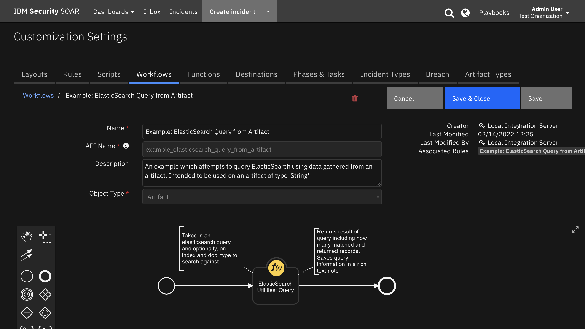
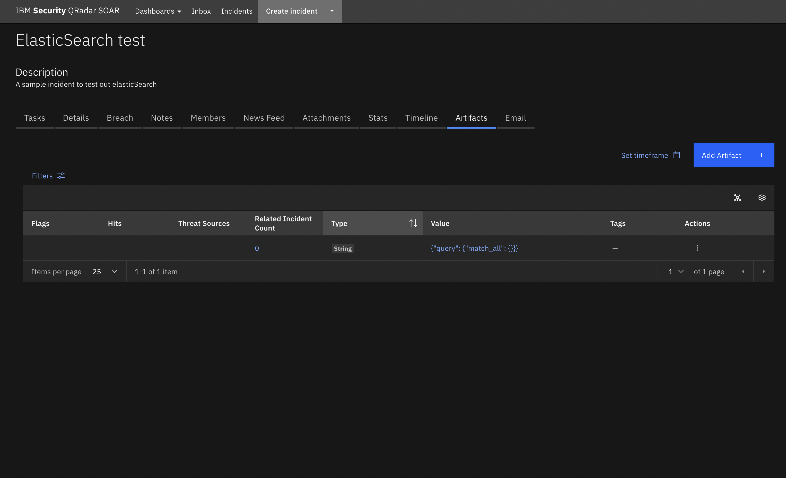

<!--
  This README.md is generated by running:
  "resilient-sdk docgen -p fn_elasticsearch"

  It is best edited using a Text Editor with a Markdown Previewer. VS Code
  is a good example. Checkout https://guides.github.com/features/mastering-markdown/
  for tips on writing with Markdown

  If you make manual edits and run docgen again, a .bak file will be created

  Store any screenshots in the "doc/screenshots" directory and reference them like:
  
-->

# fn-elasticsearch for IBM Resilient

## Table of Contents
- [Release Notes](#release-notes)
- [Overview](#overview)
  - [Key Features](#key-features)
- [Installation](#installation)
  - [Requirements](#requirements)
  - [Install](#install)
  - [App Configuration](#app-configuration)
- [Function - ElasticSearch Utilities: Query](#function---elasticsearch-utilities-query)
- [Rules](#rules)
- [Troubleshooting & Support](#troubleshooting-&-support)
---

## Release Notes
<!--
  Specify all changes in this release. Do not remove the release 
  notes of a previous release
-->
### v1.0.7

* Add support for AppHost
### v1.0.6

* Add resilient-lib dependency to setup.py

### v1.0.5

* Added logic to conditionally use doc_type depending on the major version of ElasticSearch
* Updated documentation

### v1.0.4

* Customer hotfix related to breaking version changes to ElasticSearch library

### v1.0.3

* Bugfix http

### v1.0.2
* Updated documentation
* Added a selftest capability, to enable users to test their Elasticsearch connection before starting the integration server 


---

## Overview
**Resilient Circuits Components for 'fn_elasticsearch'**

 

Allows users of the Resilient Platform to connect to and query an ElasticSearch Database. Users can specify the location of a remote ElasticSearch instance and query this instance for data through the Resilient Platform 

Queries provided to the function must be properly formed to work.
Please review the [ElasticSearch documentation](https://www.elastic.co/guide/en/elasticsearch/reference/6.3/search-request-body.html) for examples on how to form your query.
A number of example queries are available when setting up the function in a workflow.

**Important caveat: Your ElasticSearch library version must match the major ElasticSearch version as breaking changes may be introduced as new releases are announced. This integration handles for recent version changes.**

Two options are available for connection:
HTTP connection to localhost or remote 
HTTPS connection with username:password authentication

### Key Features
<!--
  List the Key Features of the Integration
-->
* Perform queries on an elasticsearch instance


---

## Installation

### Requirements
<!--
  List any Requirements 
-->
* Resilient platform >= `v36.0.0`
* App Host >= `v1.2.132` (if using App Host)
  * To setup up an App Host see:  [ibm.biz/res-app-host-setup](https://ibm.biz/res-app-host-setup)
* An Integration Server running `resilient_circuits>=31.0.0` (if using an Integration Server)
  * To set up an Integration Server see: [ibm.biz/res-int-server-guide](https://ibm.biz/res-int-server-guide)
  * If using an API key account, minimum required permissions are:
    | Name | Permissions |
    | ---- | ----------- |
    | Org Data | Read |
    | Function | Read |
* Proxy supported: Yes

---

### Install
* To install or uninstall an App using the App Host see [ibm.biz/res-install-app](https://ibm.biz/res-install-app)

* To install or uninstall an Integration using the Integration Server see the [ibm.biz/res-install-int](https://ibm.biz/res-install-int)
---

### App Configuration
The following table describes the settings you need to configure in the app.config file. If using App Host, see the Resilient System Administrator Guide. If using the integration server, see the Integration Server Guide.

| Config | Required | Example | Description |
| ------ | :------: | ------- | ----------- |
| **es_datastore_url** | Yes | `localhost` | *The location of the elasticsearch instance.* |
| **es_datastore_scheme** | Yes | `https` | *If HTTPS is provided an SSL Context is setup for the connection.* |
| **es_auth_username** | Yes | `<ELASTICSEARCH_USERNAME>` | *Username of the Elastic User for the query.* |
| **es_use_http** | Yes | `False` | *f true, connection to elasticsearch will be made over HTTP.* |
| **es_auth_password** | Yes | `supersecret` | *Password for the elasticsearch user.* |
| **es_cafile** | No | `path/to/certfile>` | *Location of the certificate file if using https.* |

---


## Function - ElasticSearch Utilities: Query
A function that allows a user to query a specified ElasticSearch datastore for data.

 

<details><summary>Inputs:</summary>
<p>

| Name | Type | Required | Example | Tooltip |
| ---- | :--: | :------: | ------- | ------- |
| `es_doc_type` | `text` | No | `-` | The document type that will be search. |
| `es_index` | `text` | No | `-` | The index that will be searched for data. If left blank all indices will be searched. |
| `es_query` | `textarea` | Yes | `-` | The query that will be submitted to ElasticSearch |

</p>
</details>

<details><summary>Outputs:</summary>
<p>

```python
results = {
        "inputs": {
          "es_query": { "query": { "match_all": {} } },
          "es_doc_type": logs,
          "es_index" : my_logstore
        },
        "query_results": [
          <elasticsearch-record>,
        "success": True / False,
        "matched_records": 1000,
        "returned_records": 100
    }
```

</p>
</details>

<details><summary>Workflows</summary>

  <details><summary>Example Pre-Process Script:</summary>
  <p>

  ```python
  if artifact.value is not None:
  inputs.es_query = artifact.value
  ```

  </p>
  </details>

  <details><summary>Example Post-Process Script:</summary>
  <p>

  ```python
  """
# An Example of the result object 
    results = {
        "inputs": {
          "es_query": { "query": { "match_all": {} } },
          "es_doc_type": logs,
          "es_index" : my_logstore
        },
        "query_results": [
          <elasticsearch-record>,
        "success": True / False,
        "matched_records": 1000,
        "returned_records": 100
    }
    Note: The schema of elasticsearch-record; outlined above, will reflect the structure of your data in Elastic itself
"""

if results.matched_records:
  noteText = """<b>ElasticSearch Query status</b>
                <br> Query supplied: <b>{0}</b>
                <br> Total matched records :<b>{1}</b>""".format(results.inputs["es_query"], results.matched_records)
  
  if results.returned_records != 0:
    noteText += """<br> Total returned records : <b>{0}</b>""".format(results.returned_records)
  incident.addNote(helper.createRichText(noteText))
  ```

  </p>
  </details>

</details>

---


## Rules
| Rule Name | Object | Workflow Triggered |
| --------- | ------ | ------------------ |
| Example: ElasticSearch Query from Artifact | artifact | `example_elasticsearch_query_from_artifact` |
| Example: ElasticSearch Query from Incident | incident | `example_elasticsearch_query_from_incident` |

---

## Troubleshooting & Support
If using the app with an App Host, see the Resilient System Administrator Guide and the App Host Deployment Guide for troubleshooting procedures. You can find these guides on the [IBM Knowledge Center](https://www.ibm.com/support/knowledgecenter/SSBRUQ), where you can select which version of the Resilient platform you are using.

If using the app with an integration server, see the [Integration Server Guide](https://ibm.biz/res-int-server-guide)

### For Support
This is a IBM Community Provided App. Please search the Community https://ibm.biz/resilientcommunity for assistance.
