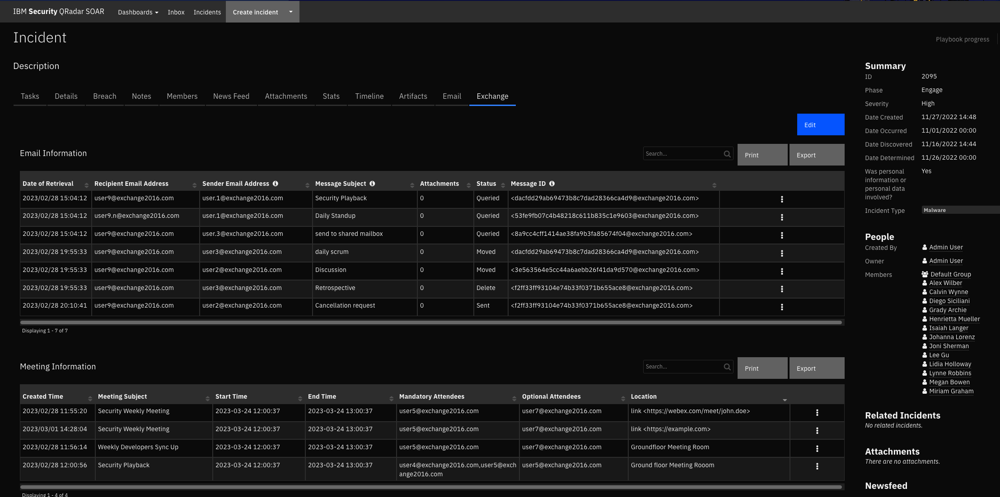

<!--
  This Install README.md is generated by running:
  "resilient-sdk docgen -p fn_mcafee_esm --install-guide"

  It is best edited using a Text Editor with a Markdown Previewer. VS Code
  is a good example. Checkout https://guides.github.com/features/mastering-markdown/
  for tips on writing with Markdown

  If you make manual edits and run docgen again, a .bak file will be created

  Store any screenshots in the "doc/screenshots" directory and reference them like:
  
-->

# fn-exchange Functions for IBM Resilient

- [Release Notes](#release-notes)
- [Overview](#overview)
- [Requirements](#requirements)
- [Installation](#installation)
- [Uninstall](#uninstall)
- [Components](#components)
- [Troubleshooting](#troubleshooting)
- [Support](#support)

---

## Release Notes
<!--
  Specify all changes in this release. Do not remove the release 
  notes of a previous release
-->
| Version | Date | Notes |
| ------: | ---: | ----: |
| v1.0.1 | November 2020 | Added App Host support, Added proxy support. |
| v1.0.0 | August 2018 | Initial Release. |

---

## Overview
<!--
  Provide a high-level description of the function itself and its remote software or application.
  The text below is parsed from the "description" and "long_description" attributes in the setup.py file
-->
**Resilient Circuits Components for 'fn_exchange'**

 

This IBM Resilient Function package can be used to access Microsoft Exchange email and meeting capabilities.
The functions provided have the following capabilities:

* Querying emails
* Deleting queried emails
* Moving queried emails
* Moving the contents of a folder to another folder then deleting the original folder
* Sending emails
* Creating meetings
* Getting mailbox info for a specified user

---

## Requirements
<!--
  List any Requirements 
-->
* Resilient version 31 or later
* To setup up an App Host see:  [ibm.biz/res-app-host-setup](https://ibm.biz/res-app-host-setup)
* An Integration Server running `resilient_circuits>=30.0.0`
  * To set up an Integration Server see: [ibm.biz/res-int-server-guide](https://ibm.biz/res-int-server-guide)
  * If using API Keys, minimum required permissions are:
    | Name | Permissions |
    | ---- | ----------- |
    | Org Data | Read, Edit |
* Proxy supported: Yes

---

## Installation
* To install or uninstall an App using the App Host see [ibm.biz/res-install-app](https://ibm.biz/res-install-app)

* To install or uninstall an Integration using the Integration Server see the [ibm.biz/res-install-int](https://ibm.biz/res-install-int)

### App Configuration
The following table describes the settings you need to configure in the app.config file. If using App Host, see the Resilient System Administrator Guide. If using the integration server, see the Integration Server Guide.
| Config | Required | Example | Description |
| ------ | :------: | ------- | ----------- |
| **verify_cert** | Yes | `True or False` | *Use a CA cert for access to an Exchange server.* |
| **server** | Yes | `domain\\username` | *Exchange server DNS name or ip address.* |
| **username** | Yes | `192.168.190.190` | *Admin account with mailbox access to other accounts.* |
| **email** | Yes | `admin@example.com` | *default account to send emails and create meetings if one was not specified. Specifying an account that is not this one will require impersonation access.* |
| **password** | Yes | `password` | *User password for SEP api access.*  |
| **default_folder_path** | Yes | `Top of Information Store/Inbox` | *Some folder path after root Multiple folderpaths must be separated by commas.*  |
| **http_proxy** | Yes | `https://your.proxy.com:8080` | *Optional setting for an http proxy if required.*  |
| **https_proxy** | Yes | `http://your.proxy.com:8080` | *Optional setting for an https proxy if required.*  |

---

## Uninstall
* SSH into your Integration Server.
* **Uninstall** the package:
  ```
  $ pip uninstall fn-exchange
  ```
* Open the config file, scroll to the [fn_exchange] section and remove the section or prefix `#` to comment out the section.
* **Save** and **Close** the app.config file.

---

## Components
Once the customization data is imported into the Resilient platform the following
cutomization are available.
Please note that version 31 of Resilient is required to use the example workflows.

### Functions:
```
exchange_create_meeting
exchange_delete_emails
exchange_find_emails
exchange_get_mailbox_info
exchange_move_folder_contents_and_delete_folder
exchange_move_emails
exchange_send_email
```

### Sample workflows
```
Example of Exchange Create Meeting
Example of Exchange Delete Emails
Example of Exchange Find Emails
Example of Exchange Get Mailbox Info
Example of Exchange Move Emails
Example of Exchange Move Folder Contents and Delete Folder
Example of Exchange Send Email
```

### Sample Rules [Artifact]
```
Exchange Create Meeting
Exchange Delete Emails
Exchange Find Emails
Exchange Get Mailbox Info
Exchange Move Folder Contents and Delete Folder
Exchange Move Emails
Exchange Send Email
```

### Action fields and Function inputs
```
exchange_delete_if_no_subfolders
exchange_destination_folder_path
exchange_email
exchange_email_ids
exchange_emails
exchange_end_date
exchange_folder_path
exchange_get_email
exchange_hard_delete
exchange_has_attachments
exchange_meeting_body
exchange_meeting_end_time
exchange_meeting_start_time
exchange_meeting_subject
exchange_message_body
exchange_message_subject
exchange_num_emails
exchange_optional_attendees
exchange_order_by_recency
exchange_required_attendees
exchange_search_subfolders
exchange_sender
exchange_start_date
```

### Message Destination: 
`fn_exchange`

---        

## Troubleshooting & Support
If using the app with an App Host, see the Resilient System Administrator Guide and the App Host Deployment Guide for troubleshooting procedures. You can find these guides on the [IBM Knowledge Center](https://www.ibm.com/support/knowledgecenter/SSBRUQ), where you can select which version of the Resilient platform you are using.

If using the app with an integration server, see the [Integration Server Guide](https://ibm.biz/res-int-server-guide)

### For Support
This is an IBM Supported app. Please search https://ibm.com/mysupport for assistance.
