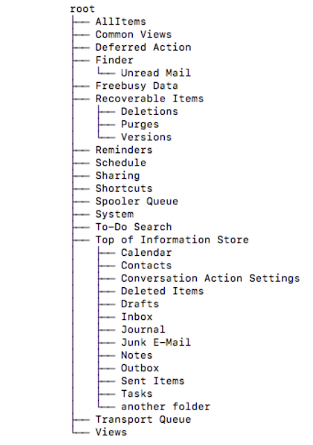

<!--
  This README.md is generated by running:
  "resilient-sdk docgen -p fn_exchange"

  It is best edited using a Text Editor with a Markdown Previewer. VS Code
  is a good example. Checkout https://guides.github.com/features/mastering-markdown/
  for tips on writing with Markdown

  All fields followed by "::CHANGE_ME::"" should be manually edited

  If you make manual edits and run docgen again, a .bak file will be created

  Store any screenshots in the "doc/screenshots" directory and reference them like:
  

  NOTE: If your app is available in the container-format only, there is no need to mention the integration server in this readme.
-->

# Microsoft Exchange

## Table of Contents
- [Release Notes](#release-notes)
- [Overview](#overview)
- [Requirements](#requirements)
  - [SOAR platform](#soar-platform)
  - [Cloud Pak for Security](#cloud-pak-for-security)
  - [Proxy Server](#proxy-server)
  - [Python Environment](#python-environment)
  - [Endpoint Developed With](#endpoint-developed-with)
- [Installation](#installation)
  - [Install](#install)
  - [App Configuration](#app-configuration)
- [Function - Exchange Create Meeting](#function---exchange-create-meeting)
- [Function - Exchange Delete Emails](#function---exchange-delete-emails)
- [Function - Exchange Find Emails](#function---exchange-find-emails)
- [Function - Exchange Get Mailbox Info](#function---exchange-get-mailbox-info)
- [Function - Exchange Move Emails](#function---exchange-move-emails)
- [Function - Exchange Move Folder Contents and Delete Folder](#function---exchange-move-folder-contents-and-delete-folder)
- [Function - Exchange Send Email](#function---exchange-send-email)
- [Rules](#rules)
- [Troubleshooting & Support](#troubleshooting--support)
---

## Release Notes
<!--
  Specify all changes in this release. Do not remove the release 
  notes of a previous release
-->
| Version | Date | Notes |
| ------- | ---- | ----- |
| v1.0.3 | June 2022 | Add support for Python 3.9. |
| v1.0.2 | June 2021 | Fix for ``selftest``. |
| v1.0.1 | December 2020 | Added App Host support, Added proxy support. |
| v1.0.0 | August 2018 | Initial Release. |

---

## Overview
<!--
  Provide a high-level description of the function itself and its remote software or application.
  The text below is parsed from the "description" and "long_description" attributes in the setup.py file
-->
**Integrate with Microsoft Exchange email and meeting functionality**

  <!-- ::CHANGE_ME:: -->

This package provides functions that can be used to access Microsoft 
Exchange email and meeting capabilities. The package provided has the following capabilities:<br>

- Create a meeting in Microsoft Exchange and send out invites<br>

- Delete queried emails from a user's mailbox<br>

- Query emails from a user's mailbox<br>

- Get mailbox info for a sender<br>

- Move the contents of one folder to another folder and deletes the original<br>

- Move queried emails from one folder to another folder<br>

- Send email to a list of recipients

---

## Requirements
<!--
  List any Requirements 
--> 
This app supports the IBM Security QRadar SOAR Platform and the IBM Security QRadar SOAR for IBM Cloud Pak for Security.

### SOAR platform
The SOAR platform supports two app deployment mechanisms, App Host and integration server.

If deploying to a SOAR platform with an App Host, the requirements are:
* SOAR platform >= `43.1.49`.
* The app is in a container-based format (available from the AppExchange as a `zip` file).

If deploying to a SOAR platform with an integration server, the requirements are:
* SOAR platform >= `43.1.49`.
* The app is in the older integration format (available from the AppExchange as a `zip` file which contains a `tar.gz` file).
* Integration server is running `resilient_circuits>=45.0.0`.
* If using an API key account, make sure the account provides the following minimum permissions: 
  | Name | Permissions |
  | ---- | ----------- |
  | Org Data | Read |
  | Function | Read |


The following SOAR platform guides provide additional information: 
* _App Host Deployment Guide_: provides installation, configuration, and troubleshooting information, including proxy server settings. 
* _Integration Server Guide_: provides installation, configuration, and troubleshooting information, including proxy server settings.
* _System Administrator Guide_: provides the procedure to install, configure and deploy apps. 

The above guides are available on the IBM Documentation website at [ibm.biz/soar-docs](https://ibm.biz/soar-docs). On this web page, select your SOAR platform version. On the follow-on page, you can find the _App Host Deployment Guide_ or _Integration Server Guide_ by expanding **Apps** in the Table of Contents pane. The System Administrator Guide is available by expanding **System Administrator**.

### Cloud Pak for Security
If you are deploying to IBM Cloud Pak for Security, the requirements are:
* IBM Cloud Pak for Security >= 1.4.
* Cloud Pak is configured with an App Host.
* The app is in a container-based format (available from the AppExchange as a `zip` file).

The following Cloud Pak guides provide additional information: 
* _App Host Deployment Guide_: provides installation, configuration, and troubleshooting information, including proxy server settings. From the Table of Contents, select Case Management and Orchestration & Automation > **Orchestration and Automation Apps**.
* _System Administrator Guide_: provides information to install, configure, and deploy apps. From the IBM Cloud Pak for Security IBM Documentation table of contents, select Case Management and Orchestration & Automation > **System administrator**.

These guides are available on the IBM Documentation website at [ibm.biz/cp4s-docs](https://ibm.biz/cp4s-docs). From this web page, select your IBM Cloud Pak for Security version. From the version-specific IBM Documentation page, select Case Management and Orchestration & Automation.

### Proxy Server
The app **does** support a proxy server.

### Python Environment
Python 2.7, Python 3.6 and Python 3.9 are supported.
Additional package dependencies may exist for each of these packages:
* exchangelib
* exchangelib==2.2.0; python_version<"3"
* resilient_circuits>=45.0.0

### Endpoint Developed With

This app has been implemented using **Microsoft Exchange Server**

#### Configuration
* The `exchange_folder_path` or `exchange_destination_folder_path` fields may be difficult to configure and are dependent on the Exchange environment. Upon entering an invalid folder path, a tree structure of the folder hierarchy will be printed. Here is an example:

 

* Example folder paths given this folder structure
could be any path following the root path:
  - Top of Information Store/Inbox
  - Top of Information Store/Deleted Items
  - Finder/Unread Mail
  - Finder

* Additionally, if the `exchange_search_subfolders` path is set to true, every folder in its branch will be included in the query. For example if the specified folder is **Recoverable Items**, then the searched folders would be:
  - Recoverable Items
  - Recoverable Items/Deletions
  - Recoverable Items/Purges
  - Recoverable Items/Versions

* To search folder paths, the specified account in config file must have access to the searched folders. Folders that contain `/` or `,` must be wrapped in quotes.
  - Example/"One/With/Quotes"/Folder
  - Example/"One, with, commas"/Folder
  - Example/"One/with, both"/Folder

* Multiple folder paths can be specified by separating them with commas and following the above rules.

* For more information on specific function inputs, check the tooltips.


---

## Installation

### Install
* To install or uninstall an App or Integration on the _SOAR platform_, see the documentation at [ibm.biz/soar-docs](https://ibm.biz/soar-docs).
* To install or uninstall an App on _IBM Cloud Pak for Security_, see the documentation at [ibm.biz/cp4s-docs](https://ibm.biz/cp4s-docs) and follow the instructions above to navigate to Orchestration and Automation.

### App Configuration
The following table provides the settings you need to configure the app. These settings are made in the app.config file. See the documentation discussed in the Requirements section for the procedure.

| Config | Required | Example | Description |
| ------ | :------: | ------- | ----------- |
| **default_folder_path** | Yes | `Top of Information Store/Inbox` |  *Some folder path after root Multiple folder paths must be separated by commas.* |
| **email** | Yes | `admin@example.com` | *default account to send emails and create meetings if one was not specified. Specifying an account that is not this one will require impersonation access.* |
| **password** | Yes | `password` |  *Password of Admin account.*  |
| **server** | Yes | `example.com` |  *Exchange server DNS name or ip address.* |
| **username** | Yes | `domain\username` | *Admin account with mailbox access to other accounts.* |
| **verify_cert** | Yes | `True` | *Use a CA cert for access to an Exchange server.* |

---

## Function - Exchange Create Meeting
Creates a meeting and sends out invitation to required attendees and optional attendees.

  <!-- ::CHANGE_ME:: -->

<details><summary>Inputs:</summary>
<p>

| Name | Type | Required | Example | Tooltip |
| ---- | :--: | :------: | ------- | ------- |
| `exchange_email` | `text` | Yes | `user@example.com` | Email account that is used |
| `exchange_meeting_body` | `text` | No | `Meeting Body` | Body of exchange meeting |
| `exchange_meeting_end_time` | `datetimepicker` | Yes | `-` | When the meeting should end |
| `exchange_meeting_start_time` | `datetimepicker` | Yes | `-` | When the meeting should start |
| `exchange_meeting_subject` | `text` | No | `Meeting Subject` | Subject of exchange meeting |
| `exchange_optional_attendees` | `text` | No | `user1@example.com,user2@example.com` | Comma separated list of optional attendees |
| `exchange_required_attendees` | `text` | No | `user1@example.com,user2@example.com` | Comma separated list of required attendees |

</p>
</details>

<details><summary>Outputs:</summary>
<p>

> **NOTE:** This example might be in JSON format, but `results` is a Python Dictionary on the SOAR platform.

```python
results = {
  "body": null,
  "end_time": 1656025200000,
  "optional_attendees": null,
  "required_attendees": "example@example.com",
  "sender": "t.shelby@example.com",
  "start_time": 1655938800000,
  "subject": "This is a potential malicious link"
}
```

</p>
</details>

<details><summary>Example Pre-Process Script:</summary>
<p>

```python
inputs.exchange_email = rule.properties.exchange_email if rule.properties.exchange_email is not None else inputs.exchange_email
inputs.exchange_meeting_start_time = rule.properties.exchange_meeting_start_time if rule.properties.exchange_meeting_start_time is not None else inputs.exchange_meeting_start_time
inputs.exchange_meeting_end_time = rule.properties.exchange_meeting_end_time if rule.properties.exchange_meeting_end_time is not None else inputs.exchange_meeting_end_time
inputs.exchange_meeting_subject = rule.properties.exchange_meeting_subject if rule.properties.exchange_meeting_subject is not None else inputs.exchange_meeting_subject
inputs.exchange_meeting_body = rule.properties.exchange_meeting_body if rule.properties.exchange_meeting_body is not None else inputs.exchange_meeting_body
inputs.exchange_required_attendees = rule.properties.exchange_required_attendees if rule.properties.exchange_required_attendees is not None else inputs.exchange_required_attendees
inputs.exchange_optional_attendees = rule.properties.exchange_optional_attendees if rule.properties.exchange_optional_attendees is not None else inputs.exchange_optional_attendees
```

</p>
</details>

<details><summary>Example Post-Process Script:</summary>
<p>

```python
# results = {
#                 'required_attendees':required1@example.com,required2@example.com
#                 'optional_attendees': optional1@example.com,...
#                 'sender': sender@example.com
#                 'subject': meeting subject
#                 'body': meeting body
#                 'start_time': epoch start time
#                 'end_time': epoch end time
#             }
from java.util import Date

start_time = Date(results.start_time).toString()
end_time = Date(results.end_time).toString()
noteText = '''Meeting created from Exchange Create Meeting
Subject: {}
From {} to {}
Required Attendees: {}
Optional Attendees: {}
Body: {}'''.format(results.subject, start_time, end_time, results.required_attendees, results.optional_attendees, results.body)

incident.addNote(noteText)
```

</p>
</details>

---
## Function - Exchange Delete Emails
Delete emails with the specified query parameters.

  <!-- ::CHANGE_ME:: -->

<details><summary>Inputs:</summary>
<p>

| Name | Type | Required | Example | Tooltip |
| ---- | :--: | :------: | ------- | ------- |
| `exchange_email` | `text` | Yes | `user@example.com` | Email account that is used |
| `exchange_email_ids` | `text` | No | `-` | Comma separated list of email ids |
| `exchange_end_date` | `datetimepicker` | No | `-` | Get emails until after this date, leave empty to not set an end date |
| `exchange_folder_path` | `text` | No | `Top of Information Store,Top of Information Store/Inbox,Top of Information Store/Drafts,...` | Comma separated list of folder paths to query from |
| `exchange_hard_delete` | `boolean` | Yes | `-` | Yes for hard deletion. No for soft deletion (move to deleted folder) |
| `exchange_has_attachments` | `boolean` | No | `-` | True to include attachments, False to exclude attachments, Unknown to get all |
| `exchange_message_body` | `text` | No | `Hello, how are you?` | Text for the message body of an email to query or to send, depending on the function. |
| `exchange_message_subject` | `text` | No | `Invitation: Security Meeting` | Text for the subject of an email to query or send depending on the function. |
| `exchange_num_emails` | `text` | No | `10` | Maximum number of emails to query |
| `exchange_order_by_recency` | `boolean` | No | `-` | Yes to get newest emails first, No to get oldest emails first, Unknown to ignore time sent |
| `exchange_search_subfolders` | `boolean` | No | `-` | Yes to search subfolders, No or Unknown to not search subfolders |
| `exchange_sender` | `text` | No | `user@example.com` | Only get emails from this sender, leave blank to ignore sender attribute |
| `exchange_start_date` | `datetimepicker` | No | `-` | Get emails on or after this date, leave empty to not set a start date |

</p>
</details>

<details><summary>Outputs:</summary>
<p>

> **NOTE:** This example might be in JSON format, but `results` is a Python Dictionary on the SOAR platform.

```python
results = {
  "email_ids": [
    "\u003c6475dbadd11745c5abf0fb7b1b60d54f@example.com\u003e"
  ],
  "emails": {
    "\u003c6475dbadd11745c5abf0fb7b1b60d54f@example.com\u003e": {
      "attachment_ids": [],
      "attachments": {},
      "body": "\u003chtml\u003e\r\n\u003chead\u003e\r\n\u003cmeta http-equiv=\"Content-Type\" content=\"text/html; charset=utf-8\"\u003e\r\n\u003c/head\u003e\r\n\u003cbody\u003e\r\nExample Body\r\n\u003c/body\u003e\r\n\u003c/html\u003e\r\n",
      "mime_content": "Received: from WIN-L3KDT22U7UJ.example.com (127.0.0.1) by\r\n WIN-L3KDT22U7UJ.example.com (127.0.0.1) with Microsoft SMTP Server\r\n (version=TLS1_2, cipher=TLS_ECDHE_RSA_WITH_AES_128_GCM_SHA256) id\r\n 127.0.0.1 via Mailbox Transport; Thu, 23 Jun 2022 12:48:18 +0100\r\nReceived: from WIN-L3KDT22U7UJ.example.com (127.0.0.1) by\r\n WIN-L3KDT22U7UJ.example.com (127.0.0.1) with Microsoft SMTP Server\r\n (version=TLS1_2, cipher=TLS_ECDHE_RSA_WITH_AES_128_GCM_SHA256) id\r\n 127.0.0.1; Thu, 23 Jun 2022 12:48:18 +0100\r\nReceived: from WIN-L3KDT22U7UJ.example.com ([fe80::533:0000:eca:98d6]) by\r\n WIN-L3KDT22U7UJ.example.com ([fe80::533:0000:eca:98d6%2]) with mapi id\r\n 00.00.2242.012; Thu, 23 Jun 2022 12:48:18 +0100\r\nFrom: Thomas Shelby \u003ct.shelby@example.com\u003e\r\nTo: Thomas Shelby \u003ct.shelby@example.com\u003e\r\nSubject: Warning! Another potential phishing email!\r\nThread-Topic: Warning! Another potential phishing email!\r\nThread-Index: AQHYhvch4pObt1o+A0qCLDlDou3uNw==\r\nDate: Thu, 23 Jun 2022 12:48:18 +0100\r\nMessage-ID: \u003c6475dbadd11745c5abf0fb7b1b60d54f@example.com\u003e\r\nAccept-Language: en-US\r\nContent-Language: en-US\r\nX-MS-Exchange-Organization-AuthAs: Internal\r\nX-MS-Exchange-Organization-AuthMechanism: 04\r\nX-MS-Exchange-Organization-AuthSource: WIN-L3KDT22U7UJ.example.com\r\nX-MS-Has-Attach:\r\nX-MS-Exchange-Organization-Network-Message-Id:\r\n\t7c1c4ee8-4c79-454a-ffbb-08da550e43f6\r\nX-MS-Exchange-Organization-SCL: -1\r\nX-MS-TNEF-Correlator:\r\nX-MS-Exchange-Organization-RecordReviewCfmType: 0\r\nContent-Type: multipart/alternative;\r\n\tboundary=\"_000_6475dbadd11745c5abf0fb7b1b60d54fexamplecom_\"\r\nMIME-Version: 1.0\r\n\r\n--_000_6475dbadd11745c5abf0fb7b1b60d54fexamplecom_\r\nContent-Type: text/plain; charset=\"us-ascii\"\r\n\r\nExample Body\r\n\r\n--_000_6475dbadd11745c5abf0fb7b1b60d54fexamplecom_\r\nContent-Type: text/html; charset=\"us-ascii\"\r\n\r\n\u003chtml\u003e\r\n\u003chead\u003e\r\n\u003cmeta http-equiv=\"Content-Type\" content=\"text/html; charset=us-ascii\"\u003e\r\n\u003c/head\u003e\r\n\u003cbody\u003e\r\nExample Body\r\n\u003c/body\u003e\r\n\u003c/html\u003e\r\n\r\n--_000_6475dbadd11745c5abf0fb7b1b60d54fexamplecom_--\r\n",
      "sender_email": "t.shelby@example.com",
      "sender_name": "Thomas Shelby",
      "subject": "Warning! Another potential phishing email!"
    }
  }
}
```

</p>
</details>

<details><summary>Example Pre-Process Script:</summary>
<p>

```python
# Set inputs
# For for information on input values, read tooltips
inputs.exchange_email = inputs.exchange_email if rule.properties.exchange_email is None else rule.properties.exchange_email
inputs.exchange_folder_path = inputs.exchange_folder_path if rule.properties.exchange_folder_path is None else rule.properties.exchange_folder_path
inputs.exchange_hard_delete = inputs.exchange_hard_delete if rule.properties.exchange_hard_delete is None else rule.properties.exchange_hard_delete
inputs.exchange_email_ids = inputs.exchange_email_ids if rule.properties.exchange_email_ids is None else rule.properties.exchange_email_ids
inputs.exchange_sender = inputs.exchange_sender if rule.properties.exchange_sender is None else rule.properties.exchange_sender
inputs.exchange_message_subject = inputs.exchange_message_subject if rule.properties.exchange_message_subject is None else rule.properties.exchange_message_subject
inputs.exchange_message_body = inputs.exchange_message_body if rule.properties.exchange_message_body is None else rule.properties.exchange_message_body
inputs.exchange_start_date = inputs.exchange_start_date if rule.properties.exchange_start_date is None else rule.properties.exchange_start_date
inputs.exchange_end_date = inputs.exchange_end_date if rule.properties.exchange_end_date is None else rule.properties.exchange_end_date
inputs.exchange_has_attachments = inputs.exchange_has_attachments if rule.properties.exchange_has_attachments is None else rule.properties.exchange_has_attachments
inputs.exchange_order_by_recency = inputs.exchange_order_by_recency if rule.properties.exchange_order_by_recency is None else rule.properties.exchange_order_by_recency
inputs.exchange_num_emails = inputs.exchange_num_emails if rule.properties.exchange_num_emails is None else rule.properties.exchange_num_emails
inputs.exchange_search_subfolders = inputs.exchange_search_subfolders if rule.properties.exchange_search_subfolders is None else rule.properties.exchange_search_subfolders
```

</p>
</details>

<details><summary>Example Post-Process Script:</summary>
<p>

```python
 # Example function results
        # results = {
        #     'email_ids': ['id1', 'idN'],
        #     'emails': {
        #         'id1': {
        #             'subject': 'Email Subject',
        #             'body': 'Subject body in HTML',
        #             'mime_content': mime content of message
        #             'sender_name': 'FirstName LastName',
        #             'sender_email': 'example@example.com',
        #             'attachment_ids': ['attachment_id1', 'attachment_id2'],
        #             'attachments': {
        #                 'attachment_id1': {
        #                     'attachment_name': 'attachment.xslx',
        #                     'attachment_content_type': 'spreadsheet',
        #                     'attachment_size': '8842',
        #                     'attachment_base64': 'attachment encoded in base 64'
        #                 },
        #                 'attachment_id2': {
        #                     'attachment_name': '...',
        #                     'attachment_content_type': '...',
        #                     'attachment_size': '...',
        #                     'attachment_base64': 'attachment encoded in base 64'
        #                 }
        #             }
        #         },
        #         'idN': {
        #             'subject': 'Email Subject',
        #             'body': 'Subject body in HTML',
        #             'mime_content': mime content of message
        #             'sender_name': 'FirstName LastName',
        #             'sender_email': 'example@example.com',
        #             'attachment_ids': ['attachment_id1', 'attachment_id2'],
        #             'attachments': {
        #                 'attachment_id1': {
        #                     'attachment_name': 'attachment.xslx',
        #                     'attachment_content_type': 'spreadsheet',
        #                     'attachment_size': '8842',
        #                     'attachment_base64': 'attachment encoded in base 64'
        #                 },
        #                 'attachment_id2': {
        #                     'attachment_name': '...',
        #                     'attachment_content_type': '...',
        #                     'attachment_size': '...',
        #                     'attachment_base64': 'attachment encoded in base 64'
        #                 }
        #             }
        #         }
        #     }
        # }
        
# Get email ids
email_ids = results.email_ids
# Get emails
emails = results.emails

# Loop through all queried emails
for email_id in email_ids:
  # Get email that corresponds to email_id
  email = emails[email_id]
  # Create artifacts from sender information that isn't None
  if email['sender_name']:
    incident.addArtifact('Email Sender Name', email['sender_name'], 'Sender name for email {}'.format(email_id))
  if email['sender_email']:
    incident.addArtifact('Email Sender', email['sender_email'], 'Sender email address for email {}'.format(email_id))
  if email['subject']:
    incident.addArtifact('Email Subject', email['subject'], 'Email subject for email {}'.format(email_id))
  if email['body']:
    incident.addArtifact('Email Body', email['body'], 'Email body in HTML for email {}'.format(email_id))
    
  # Loop through attachments and create artifacts and notes for them
  attachment_ids = email['attachment_ids']
  attachments = email['attachments']
  for attachment_id in attachment_ids:
    attachment = attachments[attachment_id]
    incident.addArtifact('Email Attachment Name', attachment['attachment_name'], 'Attachment name for attachment {} from email {}'.format(attachment_id, email_id))
    
    # Add note
    noteText = 'base64 attachment of {} from email {}: \n{}'.format(attachment['attachment_name'], email_id, attachment['attachment_base64'])
    incident.addNote(noteText)
```

</p>
</details>

---
## Function - Exchange Find Emails
Find emails with the specified parameters.

  <!-- ::CHANGE_ME:: -->

<details><summary>Inputs:</summary>
<p>

| Name | Type | Required | Example | Tooltip |
| ---- | :--: | :------: | ------- | ------- |
| `exchange_email` | `text` | Yes | `user@example.com` | Email account that is used |
| `exchange_email_ids` | `text` | No | `-` | Comma separated list of email ids |
| `exchange_end_date` | `datetimepicker` | No | `-` | Get emails until after this date, leave empty to not set an end date |
| `exchange_folder_path` | `text` | No | `Top of Information Store,Top of Information Store/Inbox,Top of Information Store/Drafts,...` | Comma separated list of folder paths to query from |
| `exchange_has_attachments` | `boolean` | No | `-` | True to include attachments, False to exclude attachments, Unknown to get all |
| `exchange_message_body` | `text` | No | `Hello, how are you?` | Text for the message body of an email to query or to send, depending on the function. |
| `exchange_message_subject` | `text` | No | `Invitation: Security Meeting` | Text for the subject of an email to query or send depending on the function. |
| `exchange_num_emails` | `text` | No | `10` | Maximum number of emails to query |
| `exchange_order_by_recency` | `boolean` | No | `-` | Yes to get newest emails first, No to get oldest emails first, Unknown to ignore time sent |
| `exchange_search_subfolders` | `boolean` | No | `-` | Yes to search subfolders, No or Unknown to not search subfolders |
| `exchange_sender` | `text` | No | `user@example.com` | Only get emails from this sender, leave blank to ignore sender attribute |
| `exchange_start_date` | `datetimepicker` | No | `-` | Get emails on or after this date, leave empty to not set a start date |

</p>
</details>

<details><summary>Outputs:</summary>
<p>

> **NOTE:** This example might be in JSON format, but `results` is a Python Dictionary on the SOAR platform.

```python
results = {
  "email_ids": [
    "\u003ce71b38b97b994651a034bfe095f5bb1a@example.com\u003e"
  ],
  "emails": {
    "\u003ce71b38b97b994651a034bfe095f5bb1a@example.com\u003e": {
      "attachment_ids": [],
      "attachments": {},
      "body": "\u003chtml\u003e\r\n\u003chead\u003e\r\n\u003cmeta http-equiv=\"Content-Type\" content=\"text/html; charset=utf-8\"\u003e\r\n\u003cstyle type=\"text/css\" style=\"display:none;\"\u003e\u003c!-- P {margin-top:0;margin-bottom:0;} --\u003e\u003c/style\u003e\r\n\u003c/head\u003e\r\n\u003cbody dir=\"ltr\"\u003e\r\n\u003cdiv id=\"divtagdefaultwrapper\" style=\"font-size:12pt;color:#000000;font-family:Calibri,Helvetica,sans-serif;\" dir=\"ltr\"\u003e\r\n\u003cp\u003eWarning!\u003cbr\u003e\r\n\u003c/p\u003e\r\n\u003c/div\u003e\r\n\u003c/body\u003e\r\n\u003c/html\u003e\r\n",
      "mime_content": "Received: from WIN-L3KDT22U7UJ.example.com (127.0.0.1) by\r\n WIN-L3KDT22U7UJ.example.com (127.0.0.1) with Microsoft SMTP Server\r\n (version=TLS1_2, cipher=TLS_ECDHE_RSA_WITH_AES_128_GCM_SHA256) id\r\n 127.0.0.1 via Mailbox Transport; Thu, 23 Jun 2022 12:42:35 +0100\r\nReceived: from WIN-L3KDT22U7UJ.example.com (127.0.0.1) by\r\n WIN-L3KDT22U7UJ.example.com (127.0.0.1) with Microsoft SMTP Server\r\n (version=TLS1_2, cipher=TLS_ECDHE_RSA_WITH_AES_128_GCM_SHA256) id\r\n 127.0.0.1; Thu, 23 Jun 2022 12:42:30 +0100\r\nReceived: from WIN-L3KDT22U7UJ.example.com ([fe80::533:0000:eca:98d6]) by\r\n WIN-L3KDT22U7UJ.example.com ([fe80::533:0000:eca:98d6%2]) with mapi id\r\n 00.00.2242.012; Thu, 23 Jun 2022 12:42:30 +0100\r\nFrom: Thomas Shelby \u003ct.shelby@example.com\u003e\r\nTo: Thomas Shelby \u003ct.shelby@example.com\u003e\r\nSubject: Warning: You may have clicked on a malicious link!\r\nThread-Topic: Warning: You may have clicked on a malicious link!\r\nThread-Index: AQHYhvZRBvk78Xewzkm1r+nXQYlDFQ==\r\nDate: Thu, 23 Jun 2022 12:42:30 +0100\r\nMessage-ID: \u003ce71b38b97b994651a034bfe095f5bb1a@example.com\u003e\r\nAccept-Language: en-US\r\nContent-Language: en-US\r\nX-MS-Exchange-Organization-AuthAs: Internal\r\nX-MS-Exchange-Organization-AuthMechanism: 04\r\nX-MS-Exchange-Organization-AuthSource: WIN-L3KDT22U7UJ.example.com\r\nX-MS-Has-Attach:\r\nX-MS-Exchange-Organization-Network-Message-Id:\r\n\td0ea5374-fac7-437a-aac4-08da550d74ca\r\nX-MS-Exchange-Organization-SCL: -1\r\nX-MS-TNEF-Correlator:\r\nX-MS-Exchange-Organization-RecordReviewCfmType: 0\r\nContent-Type: multipart/alternative;\r\n\tboundary=\"_000_e71b38b97b994651a034bfe095f5bb1aexamplecom_\"\r\nMIME-Version: 1.0\r\n\r\n--_000_e71b38b97b994651a034bfe095f5bb1aexamplecom_\r\nContent-Type: text/plain; charset=\"iso-8859-1\"\r\nContent-Transfer-Encoding: quoted-printable\r\n\r\nWarning!\r\n\r\n--_000_e71b38b97b994651a034bfe095f5bb1aexamplecom_\r\nContent-Type: text/html; charset=\"iso-8859-1\"\r\nContent-Transfer-Encoding: quoted-printable\r\n\r\n\u003chtml\u003e\r\n\u003chead\u003e\r\n\u003cmeta http-equiv=3D\"Content-Type\" content=3D\"text/html; charset=3Diso-8859-=\r\n1\"\u003e\r\n\u003cstyle type=3D\"text/css\" style=3D\"display:none;\"\u003e\u003c!-- P {margin-top:0;margi=\r\nn-bottom:0;} --\u003e\u003c/style\u003e\r\n\u003c/head\u003e\r\n\u003cbody dir=3D\"ltr\"\u003e\r\n\u003cdiv id=3D\"divtagdefaultwrapper\" style=3D\"font-size:12pt;color:#000000;font=\r\n-family:Calibri,Helvetica,sans-serif;\" dir=3D\"ltr\"\u003e\r\n\u003cp\u003eWarning!\u003cbr\u003e\r\n\u003c/p\u003e\r\n\u003c/div\u003e\r\n\u003c/body\u003e\r\n\u003c/html\u003e\r\n\r\n--_000_e71b38b97b994651a034bfe095f5bb1aexamplecom_--\r\n",
      "sender_email": "t.shelby@example.com",
      "sender_name": "Thomas Shelby",
      "subject": "Warning: You may have clicked on a malicious link!"
    }
  }
}
```

</p>
</details>

<details><summary>Example Pre-Process Script:</summary>
<p>

```python
# Set inputs
# For for information on input values, read tooltips
inputs.exchange_email = inputs.exchange_email if rule.properties.exchange_email is None else rule.properties.exchange_email
inputs.exchange_folder_path = inputs.exchange_folder_path if rule.properties.exchange_folder_path is None else rule.properties.exchange_folder_path
inputs.exchange_email_ids = inputs.exchange_email_ids if rule.properties.exchange_email_ids is None else rule.properties.exchange_email_ids
inputs.exchange_sender = inputs.exchange_sender if rule.properties.exchange_sender is None else rule.properties.exchange_sender
inputs.exchange_message_subject = inputs.exchange_message_subject if rule.properties.exchange_message_subject is None else rule.properties.exchange_message_subject
inputs.exchange_message_body = inputs.exchange_message_body if rule.properties.exchange_message_body is None else rule.properties.exchange_message_body
inputs.exchange_start_date = inputs.exchange_start_date if rule.properties.exchange_start_date is None else rule.properties.exchange_start_date
inputs.exchange_end_date = inputs.exchange_end_date if rule.properties.exchange_end_date is None else rule.properties.exchange_end_date
inputs.exchange_has_attachments = inputs.exchange_has_attachments if rule.properties.exchange_has_attachments is None else rule.properties.exchange_has_attachments
inputs.exchange_order_by_recency = inputs.exchange_order_by_recency if rule.properties.exchange_order_by_recency is None else rule.properties.exchange_order_by_recency
inputs.exchange_num_emails = inputs.exchange_num_emails if rule.properties.exchange_num_emails is None else rule.properties.exchange_num_emails
inputs.exchange_search_subfolders = inputs.exchange_search_subfolders if rule.properties.exchange_search_subfolders is None else rule.properties.exchange_search_subfolders
```

</p>
</details>

<details><summary>Example Post-Process Script:</summary>
<p>

```python
# Example function results
        # results = {
        #     'email_ids': ['id1', 'idN'],
        #     'emails': {
        #         'id1': {
        #             'subject': 'Email Subject',
        #             'body': 'Subject body in HTML',
        #             'mime_content': mime content of message
        #             'sender_name': 'FirstName LastName',
        #             'sender_email': 'example@example.com',
        #             'attachment_ids': ['attachment_id1', 'attachment_id2'],
        #             'attachments': {
        #                 'attachment_id1': {
        #                     'attachment_name': 'attachment.xslx',
        #                     'attachment_content_type': 'spreadsheet',
        #                     'attachment_size': '8842',
        #                     'attachment_base64': 'attachment encoded in base 64'
        #                 },
        #                 'attachment_id2': {
        #                     'attachment_name': '...',
        #                     'attachment_content_type': '...',
        #                     'attachment_size': '...',
        #                     'attachment_base64': 'attachment encoded in base 64'
        #                 }
        #             }
        #         },
        #         'idN': {
        #             'subject': 'Email Subject',
        #             'body': 'Subject body in HTML',
        #             'mime_content': mime content of message
        #             'sender_name': 'FirstName LastName',
        #             'sender_email': 'example@example.com',
        #             'attachment_ids': ['attachment_id1', 'attachment_id2'],
        #             'attachments': {
        #                 'attachment_id1': {
        #                     'attachment_name': 'attachment.xslx',
        #                     'attachment_content_type': 'spreadsheet',
        #                     'attachment_size': '8842',
        #                     'attachment_base64': 'attachment encoded in base 64'
        #                 },
        #                 'attachment_id2': {
        #                     'attachment_name': '...',
        #                     'attachment_content_type': '...',
        #                     'attachment_size': '...',
        #                     'attachment_base64': 'attachment encoded in base 64'
        #                 }
        #             }
        #         }
        #     }
        # }
        
# Get email ids
email_ids = results.email_ids
# Get emails
emails = results.emails

# Loop through all queried emails
for email_id in email_ids:
  # Get email that corresponds to email_id
  email = emails[email_id]
  # Create artifacts from sender information that isn't None
  if email['sender_name']:
    incident.addArtifact('Email Sender Name', email['sender_name'], 'Sender name for email {}'.format(email_id))
  if email['sender_email']:
    incident.addArtifact('Email Sender', email['sender_email'], 'Sender email address for email {}'.format(email_id))
  if email['subject']:
    incident.addArtifact('Email Subject', email['subject'], 'Email subject for email {}'.format(email_id))
  if email['body']:
    incident.addArtifact('Email Body', email['body'], 'Email body in HTML for email {}'.format(email_id))
    
  # Loop through attachments and create artifacts and notes for them
  attachment_ids = email['attachment_ids']
  attachments = email['attachments']
  for attachment_id in attachment_ids:
    attachment = attachments[attachment_id]
    incident.addArtifact('Email Attachment Name', attachment['attachment_name'], 'Attachment name for attachment {} from email {}'.format(attachment_id, email_id))
    
    # Add note
    noteText = 'base64 attachment of {} from email {}: \n{}'.format(attachment['attachment_name'], email_id, attachment['attachment_base64'])
    incident.addNote(noteText)
```

</p>
</details>

---
## Function - Exchange Get Mailbox Info
Get mailbox info for specified email.

  <!-- ::CHANGE_ME:: -->

<details><summary>Inputs:</summary>
<p>

| Name | Type | Required | Example | Tooltip |
| ---- | :--: | :------: | ------- | ------- |
| `exchange_get_email` | `text` | Yes | `user@example.com` | Email to get mailbox info from |

</p>
</details>

<details><summary>Outputs:</summary>
<p>

> **NOTE:** This example might be in JSON format, but `results` is a Python Dictionary on the SOAR platform.

```python
results = {
  "email_address": "t.shelby@example.com",
  "mailbox_type": "Mailbox",
  "name": "Thomas Shelby",
  "routing_type": "SMTP",
  "success": true
}
```

</p>
</details>

<details><summary>Example Pre-Process Script:</summary>
<p>

```python
inputs.exchange_get_email = inputs.exchange_get_email if rule.properties.exchange_get_email is None else rule.properties.exchange_get_email
```

</p>
</details>

<details><summary>Example Post-Process Script:</summary>
<p>

```python
# Example results
# results = {
#   'name': 'firstname lastname',
#   'email_address': 'user@example.com',
#   'routing_type': 'SMTP',
#   'mailbox_type': 'Mailbox'
# }

incident.addArtifact('Email Sender', results.email_address, 'Email address from Exchange Get Mailbox Info')
incident.addArtifact('Email Sender Name', results.name, 'Email sender name from Exchange Get Mailbox Info')
```

</p>
</details>

---
## Function - Exchange Move Emails
Move queried emails from a specified folder to another specified folder.

  <!-- ::CHANGE_ME:: -->

<details><summary>Inputs:</summary>
<p>

| Name | Type | Required | Example | Tooltip |
| ---- | :--: | :------: | ------- | ------- |
| `exchange_destination_folder_path` | `text` | Yes | `Top of Information Store, Top of Information Store/Inbox` | Folder path of destination folder from root folder, leave empty for root folder |
| `exchange_email` | `text` | Yes | `user@example.com` | Email account that is used |
| `exchange_email_ids` | `text` | No | `-` | Comma separated list of email ids |
| `exchange_end_date` | `datetimepicker` | No | `-` | Get emails until after this date, leave empty to not set an end date |
| `exchange_folder_path` | `text` | No | `Top of Information Store,Top of Information Store/Inbox,Top of Information Store/Drafts,...` | Comma separated list of folder paths to query from |
| `exchange_has_attachments` | `boolean` | No | `-` | True to include attachments, False to exclude attachments, Unknown to get all |
| `exchange_message_body` | `text` | No | `Hello, how are you?` | Text for the message body of an email to query or to send, depending on the function. |
| `exchange_message_subject` | `text` | No | `Invitation: Security Meeting` | Text for the subject of an email to query or send depending on the function. |
| `exchange_num_emails` | `text` | No | `10` | Maximum number of emails to query |
| `exchange_order_by_recency` | `boolean` | No | `-` | Yes to get newest emails first, No to get oldest emails first, Unknown to ignore time sent |
| `exchange_search_subfolders` | `boolean` | No | `-` | Yes to search subfolders, No or Unknown to not search subfolders |
| `exchange_sender` | `text` | No | `user@example.com` | Only get emails from this sender, leave blank to ignore sender attribute |
| `exchange_start_date` | `datetimepicker` | No | `-` | Get emails on or after this date, leave empty to not set a start date |

</p>
</details>

<details><summary>Outputs:</summary>
<p>

> **NOTE:** This example might be in JSON format, but `results` is a Python Dictionary on the SOAR platform.

```python
results = {
  "email_ids": [
    "\u003ce71b38b97b994651a034bfe095f5bb1a@example.com\u003e"
  ],
  "emails": {
    "\u003ce71b38b97b994651a034bfe095f5bb1a@example.com\u003e": {
      "attachment_ids": [],
      "attachments": {},
      "body": "\u003chtml\u003e\r\n\u003chead\u003e\r\n\u003cmeta http-equiv=\"Content-Type\" content=\"text/html; charset=utf-8\"\u003e\r\n\u003cstyle type=\"text/css\" style=\"display:none;\"\u003e\u003c!-- P {margin-top:0;margin-bottom:0;} --\u003e\u003c/style\u003e\r\n\u003c/head\u003e\r\n\u003cbody dir=\"ltr\"\u003e\r\n\u003cdiv id=\"divtagdefaultwrapper\" style=\"font-size:12pt;color:#000000;font-family:Calibri,Helvetica,sans-serif;\" dir=\"ltr\"\u003e\r\n\u003cp\u003eWarning!\u003cbr\u003e\r\n\u003c/p\u003e\r\n\u003c/div\u003e\r\n\u003c/body\u003e\r\n\u003c/html\u003e\r\n",
      "mime_content": "Received: from WIN-L3KDT22U7UJ.example.com (127.0.0.1) by\r\n WIN-L3KDT22U7UJ.example.com (127.0.0.1) with Microsoft SMTP Server\r\n (version=TLS1_2, cipher=TLS_ECDHE_RSA_WITH_AES_128_GCM_SHA256) id\r\n 127.0.0.1 via Mailbox Transport; Thu, 23 Jun 2022 12:42:35 +0100\r\nReceived: from WIN-L3KDT22U7UJ.example.com (127.0.0.1) by\r\n WIN-L3KDT22U7UJ.example.com (127.0.0.1) with Microsoft SMTP Server\r\n (version=TLS1_2, cipher=TLS_ECDHE_RSA_WITH_AES_128_GCM_SHA256) id\r\n 127.0.0.1; Thu, 23 Jun 2022 12:42:30 +0100\r\nReceived: from WIN-L3KDT22U7UJ.example.com ([fe80::533:0000:eca:98d6]) by\r\n WIN-L3KDT22U7UJ.example.com ([fe80::533:0000:eca:98d6%2]) with mapi id\r\n 00.00.2242.012; Thu, 23 Jun 2022 12:42:30 +0100\r\nFrom: Thomas Shelby \u003ct.shelby@example.com\u003e\r\nTo: Thomas Shelby \u003ct.shelby@example.com\u003e\r\nSubject: Warning: You may have clicked on a malicious link!\r\nThread-Topic: Warning: You may have clicked on a malicious link!\r\nThread-Index: AQHYhvZRBvk78Xewzkm1r+nXQYlDFQ==\r\nDate: Thu, 23 Jun 2022 12:42:30 +0100\r\nMessage-ID: \u003ce71b38b97b994651a034bfe095f5bb1a@example.com\u003e\r\nAccept-Language: en-US\r\nContent-Language: en-US\r\nX-MS-Exchange-Organization-AuthAs: Internal\r\nX-MS-Exchange-Organization-AuthMechanism: 04\r\nX-MS-Exchange-Organization-AuthSource: WIN-L3KDT22U7UJ.example.com\r\nX-MS-Has-Attach:\r\nX-MS-Exchange-Organization-Network-Message-Id:\r\n\td0ea5374-fac7-437a-aac4-08da550d74ca\r\nX-MS-Exchange-Organization-SCL: -1\r\nX-MS-TNEF-Correlator:\r\nX-MS-Exchange-Organization-RecordReviewCfmType: 0\r\nContent-Type: multipart/alternative;\r\n\tboundary=\"_000_e71b38b97b994651a034bfe095f5bb1aexamplecom_\"\r\nMIME-Version: 1.0\r\n\r\n--_000_e71b38b97b994651a034bfe095f5bb1aexamplecom_\r\nContent-Type: text/plain; charset=\"iso-8859-1\"\r\nContent-Transfer-Encoding: quoted-printable\r\n\r\nWarning!\r\n\r\n--_000_e71b38b97b994651a034bfe095f5bb1aexamplecom_\r\nContent-Type: text/html; charset=\"iso-8859-1\"\r\nContent-Transfer-Encoding: quoted-printable\r\n\r\n\u003chtml\u003e\r\n\u003chead\u003e\r\n\u003cmeta http-equiv=3D\"Content-Type\" content=3D\"text/html; charset=3Diso-8859-=\r\n1\"\u003e\r\n\u003cstyle type=3D\"text/css\" style=3D\"display:none;\"\u003e\u003c!-- P {margin-top:0;margi=\r\nn-bottom:0;} --\u003e\u003c/style\u003e\r\n\u003c/head\u003e\r\n\u003cbody dir=3D\"ltr\"\u003e\r\n\u003cdiv id=3D\"divtagdefaultwrapper\" style=3D\"font-size:12pt;color:#000000;font=\r\n-family:Calibri,Helvetica,sans-serif;\" dir=3D\"ltr\"\u003e\r\n\u003cp\u003eWarning!\u003cbr\u003e\r\n\u003c/p\u003e\r\n\u003c/div\u003e\r\n\u003c/body\u003e\r\n\u003c/html\u003e\r\n\r\n--_000_e71b38b97b994651a034bfe095f5bb1aexamplecom_--\r\n",
      "sender_email": "t.shelby@example.com",
      "sender_name": "Thomas Shelby",
      "subject": "Warning: You may have clicked on a malicious link!"
    }
  }
}
```

</p>
</details>

<details><summary>Example Pre-Process Script:</summary>
<p>

```python
# Set inputs
# For for information on input values, read tooltips
inputs.exchange_email = inputs.exchange_email if rule.properties.exchange_email is None else rule.properties.exchange_email
inputs.exchange_folder_path = inputs.exchange_folder_path if rule.properties.exchange_folder_path is None else rule.properties.exchange_folder_path
inputs.exchange_destination_folder_path = inputs.exchange_destination_folder_path if rule.properties.exchange_destination_folder_path is None else rule.properties.exchange_destination_folder_path
inputs.exchange_email_ids = inputs.exchange_email_ids if rule.properties.exchange_email_ids is None else rule.properties.exchange_email_ids
inputs.exchange_sender = inputs.exchange_sender if rule.properties.exchange_sender is None else rule.properties.exchange_sender
inputs.exchange_message_subject = inputs.exchange_message_subject if rule.properties.exchange_message_subject is None else rule.properties.exchange_message_subject
inputs.exchange_message_body = inputs.exchange_message_body if rule.properties.exchange_message_body is None else rule.properties.exchange_message_body
inputs.exchange_start_date = inputs.exchange_start_date if rule.properties.exchange_start_date is None else rule.properties.exchange_start_date
inputs.exchange_end_date = inputs.exchange_end_date if rule.properties.exchange_end_date is None else rule.properties.exchange_end_date
inputs.exchange_has_attachments = inputs.exchange_has_attachments if rule.properties.exchange_has_attachments is None else rule.properties.exchange_has_attachments
inputs.exchange_order_by_recency = inputs.exchange_order_by_recency if rule.properties.exchange_order_by_recency is None else rule.properties.exchange_order_by_recency
inputs.exchange_num_emails = inputs.exchange_num_emails if rule.properties.exchange_num_emails is None else rule.properties.exchange_num_emails
inputs.exchange_search_subfolders = inputs.exchange_search_subfolders if rule.properties.exchange_search_subfolders is None else rule.properties.exchange_search_subfolders
```

</p>
</details>

<details><summary>Example Post-Process Script:</summary>
<p>

```python
 # Example function results
        # results = {
        #     'email_ids': ['id1', 'idN'],
        #     'emails': {
        #         'id1': {
        #             'subject': 'Email Subject',
        #             'body': 'Subject body in HTML',
        #             'mime_content': mime content of message
        #             'sender_name': 'FirstName LastName',
        #             'sender_email': 'example@example.com',
        #             'attachment_ids': ['attachment_id1', 'attachment_id2'],
        #             'attachments': {
        #                 'attachment_id1': {
        #                     'attachment_name': 'attachment.xslx',
        #                     'attachment_content_type': 'spreadsheet',
        #                     'attachment_size': '8842',
        #                     'attachment_base64': 'attachment encoded in base 64'
        #                 },
        #                 'attachment_id2': {
        #                     'attachment_name': '...',
        #                     'attachment_content_type': '...',
        #                     'attachment_size': '...',
        #                     'attachment_base64': 'attachment encoded in base 64'
        #                 }
        #             }
        #         },
        #         'idN': {
        #             'subject': 'Email Subject',
        #             'body': 'Subject body in HTML',
        #             'mime_content': mime content of message
        #             'sender_name': 'FirstName LastName',
        #             'sender_email': 'example@example.com',
        #             'attachment_ids': ['attachment_id1', 'attachment_id2'],
        #             'attachments': {
        #                 'attachment_id1': {
        #                     'attachment_name': 'attachment.xslx',
        #                     'attachment_content_type': 'spreadsheet',
        #                     'attachment_size': '8842',
        #                     'attachment_base64': 'attachment encoded in base 64'
        #                 },
        #                 'attachment_id2': {
        #                     'attachment_name': '...',
        #                     'attachment_content_type': '...',
        #                     'attachment_size': '...',
        #                     'attachment_base64': 'attachment encoded in base 64'
        #                 }
        #             }
        #         }
        #     }
        # }
        
# Get email ids
email_ids = results.email_ids
# Get emails
emails = results.emails

# Loop through all queried emails
for email_id in email_ids:
  # Get email that corresponds to email_id
  email = emails[email_id]
  # Create artifacts from sender information that isn't None
  if email['sender_name']:
    incident.addArtifact('Email Sender Name', email['sender_name'], 'Sender name for email {}'.format(email_id))
  if email['sender_email']:
    incident.addArtifact('Email Sender', email['sender_email'], 'Sender email address for email {}'.format(email_id))
  if email['subject']:
    incident.addArtifact('Email Subject', email['subject'], 'Email subject for email {}'.format(email_id))
  if email['body']:
    incident.addArtifact('Email Body', email['body'], 'Email body in HTML for email {}'.format(email_id))
    
  # Loop through attachments and create artifacts and notes for them
  attachment_ids = email['attachment_ids']
  attachments = email['attachments']
  for attachment_id in attachment_ids:
    attachment = attachments[attachment_id]
    incident.addArtifact('Email Attachment Name', attachment['attachment_name'], 'Attachment name for attachment {} from email {}'.format(attachment_id, email_id))
    
    # Add note
    noteText = 'base64 attachment of {} from email {}: \n{}'.format(attachment['attachment_name'], email_id, attachment['attachment_base64'])
    incident.addNote(noteText)
```

</p>
</details>

---
## Function - Exchange Move Folder Contents and Delete Folder
Move all items from this folder that satisfy the query parameters to the destination folder and then delete the original folder.

  <!-- ::CHANGE_ME:: -->

<details><summary>Inputs:</summary>
<p>

| Name | Type | Required | Example | Tooltip |
| ---- | :--: | :------: | ------- | ------- |
| `exchange_delete_if_no_subfolders` | `boolean` | Yes | `-` | Yes to delete the folder if it has no subfolders. No to delete even if the folder has subfolders. |
| `exchange_destination_folder_path` | `text` | Yes | `Top of Information Store, Top of Information Store/Inbox` | Folder path of destination folder from root folder, leave empty for root folder |
| `exchange_email` | `text` | Yes | `user@example.com` | Email account that is used |
| `exchange_folder_path` | `text` | No | `Top of Information Store,Top of Information Store/Inbox,Top of Information Store/Drafts,...` | Comma separated list of folder paths to query from |

</p>
</details>

<details><summary>Outputs:</summary>
<p>

> **NOTE:** This example might be in JSON format, but `results` is a Python Dictionary on the SOAR platform.

```python
results = {
  "email_ids": [
    "\u003ce71b38b97b994651a034bfe095f5bb1a@example.com\u003e"
  ],
  "emails": {
    "\u003ce71b38b97b994651a034bfe095f5bb1a@example.com\u003e": {
      "attachment_ids": [],
      "attachments": {},
      "body": "\u003chtml\u003e\r\n\u003chead\u003e\r\n\u003cmeta http-equiv=\"Content-Type\" content=\"text/html; charset=utf-8\"\u003e\r\n\u003cstyle type=\"text/css\" style=\"display:none;\"\u003e\u003c!-- P {margin-top:0;margin-bottom:0;} --\u003e\u003c/style\u003e\r\n\u003c/head\u003e\r\n\u003cbody dir=\"ltr\"\u003e\r\n\u003cdiv id=\"divtagdefaultwrapper\" style=\"font-size:12pt;color:#000000;font-family:Calibri,Helvetica,sans-serif;\" dir=\"ltr\"\u003e\r\n\u003cp\u003eWarning!\u003cbr\u003e\r\n\u003c/p\u003e\r\n\u003c/div\u003e\r\n\u003c/body\u003e\r\n\u003c/html\u003e\r\n",
      "mime_content": "Received: from WIN-L3KDT22U7UJ.example.com (127.0.0.1) by\r\n WIN-L3KDT22U7UJ.example.com (127.0.0.1) with Microsoft SMTP Server\r\n (version=TLS1_2, cipher=TLS_ECDHE_RSA_WITH_AES_128_GCM_SHA256) id\r\n 127.0.0.1 via Mailbox Transport; Thu, 23 Jun 2022 12:42:35 +0100\r\nReceived: from WIN-L3KDT22U7UJ.example.com (127.0.0.1) by\r\n WIN-L3KDT22U7UJ.example.com (127.0.0.1) with Microsoft SMTP Server\r\n (version=TLS1_2, cipher=TLS_ECDHE_RSA_WITH_AES_128_GCM_SHA256) id\r\n 127.0.0.1; Thu, 23 Jun 2022 12:42:30 +0100\r\nReceived: from WIN-L3KDT22U7UJ.example.com ([fe80::533:0000:eca:98d6]) by\r\n WIN-L3KDT22U7UJ.example.com ([fe80::533:0000:eca:98d6%2]) with mapi id\r\n 00.00.2242.012; Thu, 23 Jun 2022 12:42:30 +0100\r\nFrom: Thomas Shelby \u003ct.shelby@example.com\u003e\r\nTo: Thomas Shelby \u003ct.shelby@example.com\u003e\r\nSubject: Warning: You may have clicked on a malicious link!\r\nThread-Topic: Warning: You may have clicked on a malicious link!\r\nThread-Index: AQHYhvZRBvk78Xewzkm1r+nXQYlDFQ==\r\nDate: Thu, 23 Jun 2022 12:42:30 +0100\r\nMessage-ID: \u003ce71b38b97b994651a034bfe095f5bb1a@example.com\u003e\r\nAccept-Language: en-US\r\nContent-Language: en-US\r\nX-MS-Exchange-Organization-AuthAs: Internal\r\nX-MS-Exchange-Organization-AuthMechanism: 04\r\nX-MS-Exchange-Organization-AuthSource: WIN-L3KDT22U7UJ.example.com\r\nX-MS-Has-Attach:\r\nX-MS-Exchange-Organization-Network-Message-Id:\r\n\td0ea5374-fac7-437a-aac4-08da550d74ca\r\nX-MS-Exchange-Organization-SCL: -1\r\nX-MS-TNEF-Correlator:\r\nX-MS-Exchange-Organization-RecordReviewCfmType: 0\r\nContent-Type: multipart/alternative;\r\n\tboundary=\"_000_e71b38b97b994651a034bfe095f5bb1aexamplecom_\"\r\nMIME-Version: 1.0\r\n\r\n--_000_e71b38b97b994651a034bfe095f5bb1aexamplecom_\r\nContent-Type: text/plain; charset=\"iso-8859-1\"\r\nContent-Transfer-Encoding: quoted-printable\r\n\r\nWarning!\r\n\r\n--_000_e71b38b97b994651a034bfe095f5bb1aexamplecom_\r\nContent-Type: text/html; charset=\"iso-8859-1\"\r\nContent-Transfer-Encoding: quoted-printable\r\n\r\n\u003chtml\u003e\r\n\u003chead\u003e\r\n\u003cmeta http-equiv=3D\"Content-Type\" content=3D\"text/html; charset=3Diso-8859-=\r\n1\"\u003e\r\n\u003cstyle type=3D\"text/css\" style=3D\"display:none;\"\u003e\u003c!-- P {margin-top:0;margi=\r\nn-bottom:0;} --\u003e\u003c/style\u003e\r\n\u003c/head\u003e\r\n\u003cbody dir=3D\"ltr\"\u003e\r\n\u003cdiv id=3D\"divtagdefaultwrapper\" style=3D\"font-size:12pt;color:#000000;font=\r\n-family:Calibri,Helvetica,sans-serif;\" dir=3D\"ltr\"\u003e\r\n\u003cp\u003eWarning!\u003cbr\u003e\r\n\u003c/p\u003e\r\n\u003c/div\u003e\r\n\u003c/body\u003e\r\n\u003c/html\u003e\r\n\r\n--_000_e71b38b97b994651a034bfe095f5bb1aexamplecom_--\r\n",
      "sender_email": "t.shelby@example.com",
      "sender_name": "Thomas Shelby",
      "subject": "Warning: You may have clicked on a malicious link!"
    }
  }
}
```

</p>
</details>

<details><summary>Example Pre-Process Script:</summary>
<p>

```python
# Set inputs
inputs.exchange_email = inputs.exchange_email if rule.properties.exchange_email is None else rule.properties.exchange_email
inputs.exchange_delete_if_no_subfolders = inputs.exchange_delete_if_no_subfolders if rule.properties.exchange_delete_if_no_subfolders is None else rule.properties.exchange_delete_if_no_subfolders
inputs.exchange_folder_path = inputs.exchange_folder_path if rule.properties.exchange_folder_path is None else rule.properties.exchange_folder_path
inputs.exchange_destination_folder_path = inputs.exchange_destination_folder_path if rule.properties.exchange_destination_folder_path is None else rule.properties.exchange_destination_folder_path
```

</p>
</details>

<details><summary>Example Post-Process Script:</summary>
<p>

```python
 # Example function results
        # results = {
        #     'email_ids': ['id1', 'idN'],
        #     'emails': {
        #         'id1': {
        #             'subject': 'Email Subject',
        #             'body': 'Subject body in HTML',
        #             'mime_content': mime content of message
        #             'sender_name': 'FirstName LastName',
        #             'sender_email': 'example@example.com',
        #             'attachment_ids': ['attachment_id1', 'attachment_id2'],
        #             'attachments': {
        #                 'attachment_id1': {
        #                     'attachment_name': 'attachment.xslx',
        #                     'attachment_content_type': 'spreadsheet',
        #                     'attachment_size': '8842',
        #                     'attachment_base64': 'attachment encoded in base 64'
        #                 },
        #                 'attachment_id2': {
        #                     'attachment_name': '...',
        #                     'attachment_content_type': '...',
        #                     'attachment_size': '...',
        #                     'attachment_base64': 'attachment encoded in base 64'
        #                 }
        #             }
        #         },
        #         'idN': {
        #             'subject': 'Email Subject',
        #             'body': 'Subject body in HTML',
        #             'mime_content': mime content of message
        #             'sender_name': 'FirstName LastName',
        #             'sender_email': 'example@example.com',
        #             'attachment_ids': ['attachment_id1', 'attachment_id2'],
        #             'attachments': {
        #                 'attachment_id1': {
        #                     'attachment_name': 'attachment.xslx',
        #                     'attachment_content_type': 'spreadsheet',
        #                     'attachment_size': '8842',
        #                     'attachment_base64': 'attachment encoded in base 64'
        #                 },
        #                 'attachment_id2': {
        #                     'attachment_name': '...',
        #                     'attachment_content_type': '...',
        #                     'attachment_size': '...',
        #                     'attachment_base64': 'attachment encoded in base 64'
        #                 }
        #             }
        #         }
        #     }
        # }
        
# Get email ids
email_ids = results.email_ids
# Get emails
emails = results.emails

# Loop through all queried emails
for email_id in email_ids:
  # Get email that corresponds to email_id
  email = emails[email_id]
  # Create artifacts from sender information that isn't None
  if email['sender_name']:
    incident.addArtifact('Email Sender Name', email['sender_name'], 'Sender name for email {}'.format(email_id))
  if email['sender_email']:
    incident.addArtifact('Email Sender', email['sender_email'], 'Sender email address for email {}'.format(email_id))
  if email['subject']:
    incident.addArtifact('Email Subject', email['subject'], 'Email subject for email {}'.format(email_id))
  if email['body']:
    incident.addArtifact('Email Body', email['body'], 'Email body in HTML for email {}'.format(email_id))
    
  # Loop through attachments and create artifacts and notes for them
  attachment_ids = email['attachment_ids']
  attachments = email['attachments']
  for attachment_id in attachment_ids:
    attachment = attachments[attachment_id]
    incident.addArtifact('Email Attachment Name', attachment['attachment_name'], 'Attachment name for attachment {} from email {}'.format(attachment_id, email_id))
    
    # Add note
    noteText = 'base64 attachment of {} from email {}: \n{}'.format(attachment['attachment_name'], email_id, attachment['attachment_base64'])
    incident.addNote(noteText)
```

</p>
</details>

---
## Function - Exchange Send Email
Send an email to a list of recipients.

  <!-- ::CHANGE_ME:: -->

<details><summary>Inputs:</summary>
<p>

| Name | Type | Required | Example | Tooltip |
| ---- | :--: | :------: | ------- | ------- |
| `exchange_email` | `text` | Yes | `user@example.com` | Email account that is used |
| `exchange_emails` | `text` | Yes | `user1@example.com,user2@example.com,...` | Comma separated list of emails |
| `exchange_message_body` | `text` | No | `Hello, how are you?` | Text for the message body of an email to query or to send, depending on the function. |
| `exchange_message_subject` | `text` | No | `Invitation: Security Meeting` | Text for the subject of an email to query or send depending on the function. |

</p>
</details>

<details><summary>Outputs:</summary>
<p>

> **NOTE:** This example might be in JSON format, but `results` is a Python Dictionary on the SOAR platform.

```python
results = {
  "body": "Example Body",
  "recipients": "t.shelby@example.com",
  "sender": "t.shelby@example.com",
  "subject": "Warning! Another potential phishing email!"
}
```

</p>
</details>

<details><summary>Example Pre-Process Script:</summary>
<p>

```python
# Set inputs
inputs.exchange_email = inputs.exchange_email if rule.properties.exchange_email is None else rule.properties.exchange_email
inputs.exchange_message_subject = inputs.exchange_message_subject if rule.properties.exchange_message_subject is None else rule.properties.exchange_message_subject
inputs.exchange_message_body = inputs.exchange_message_body if rule.properties.exchange_message_body is None else rule.properties.exchange_message_body
inputs.exchange_emails = inputs.exchange_emails if rule.properties.exchange_emails is None else rule.properties.exchange_emails
```

</p>
</details>

<details><summary>Example Post-Process Script:</summary>
<p>

```python
# Example results
# results = {
#             'recipients': ['user1@example.com', 'user2@example.com'],
#             'sender': 'sender@example.com',
#             'subject': 'Subject',
#             'body': 'HTML Body'
#           }

# Create note with results
note = '''Sender: {}, Recipients: {}
Subject: {}
Body: {}
'''.format(results.sender, results.recipients, results.subject, results.body)

incident.addNote(note)
```

</p>
</details>

---


## Rules
| Rule Name | Object | Workflow Triggered |
| --------- | ------ | ------------------ |
| Exchange Create Meeting | artifact | `example_of_exchange_create_meeting` |
| Exchange Delete Emails | artifact | `example_of_exchange_delete_emails` |
| Exchange Find Emails | artifact | `example_of_exchange_find_emails` |
| Exchange Get Mailbox Info | artifact | `example_of_exchange_get_mailbox_info` |
| Exchange Move Emails | artifact | `example_of_exchange_move_emails` |
| Exchange Move Folder Contents and Delete Folder | artifact | `exchange_move_and_delete_folder` |
| Exchange Send Email | artifact | `example_of_exchange_send_email` |

---


## Troubleshooting & Support
Refer to the documentation listed in the Requirements section for troubleshooting information.

### For Support
This is an IBM supported app. Please search [ibm.com/mysupport](https://ibm.com/mysupport) for assistance.
