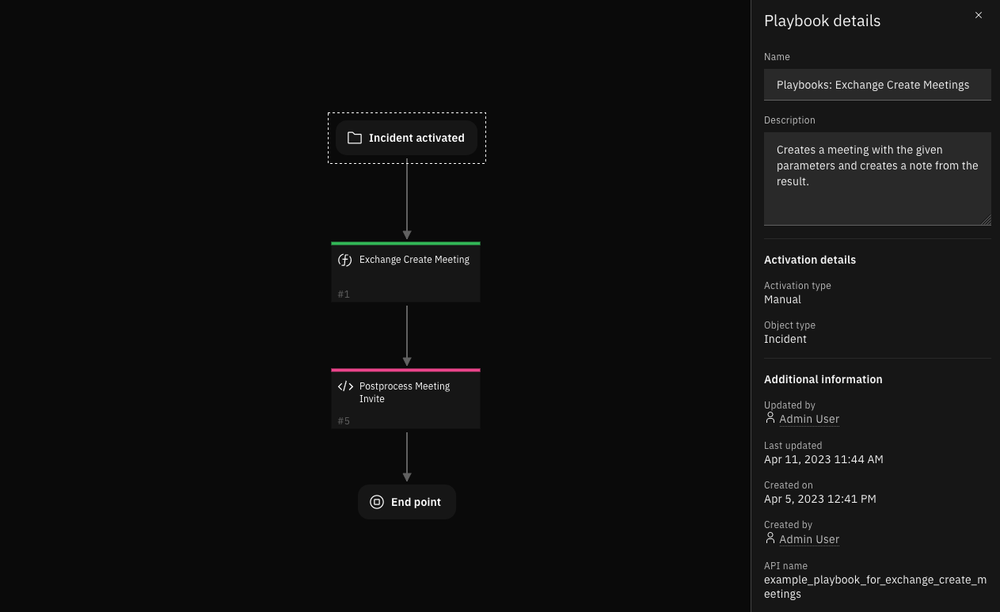
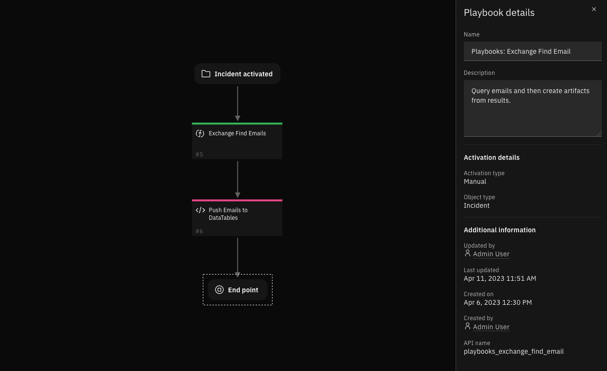
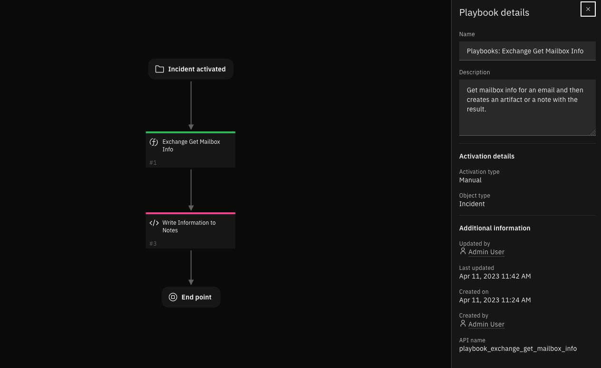

# Microsoft Exchange

## Table of Contents
- [Microsoft Exchange](#microsoft-exchange)
  - [Table of Contents](#table-of-contents)
  - [Release Notes](#release-notes)
  - [Overview](#overview)
    - [Key Features](#key-features)
  - [Requirements](#requirements)
    - [SOAR platform](#soar-platform)
    - [Cloud Pak for Security](#cloud-pak-for-security)
    - [Proxy Server](#proxy-server)
    - [Python Environment](#python-environment)
    - [Development Version](#development-version)
    - [Endpoint Developed With](#endpoint-developed-with)
    - [Configuration](#configuration)
      - [Timezones](#timezones)
      - [Folder Paths](#folder-paths)
      - [Information as Data-tables or Artifacts](#information-as-data-tables-or-artifacts)
  - [Installation](#installation)
    - [Install](#install)
    - [App Configuration](#app-configuration)
    - [Custom Layouts](#custom-layouts)
  - [Function - Exchange Create Meeting](#function---exchange-create-meeting)
  - [Function - Exchange Delete Emails](#function---exchange-delete-emails)
  - [Function - Exchange Find Emails](#function---exchange-find-emails)
  - [Function - Exchange Get Mailbox Info](#function---exchange-get-mailbox-info)
  - [Function - Exchange Move Emails](#function---exchange-move-emails)
  - [Function - Exchange Send Email](#function---exchange-send-email)
  - [Data Table - Email Information](#data-table---email-information)
      - [API Name:](#api-name)
      - [Columns:](#columns)
  - [Data Table - Meeting Information](#data-table---meeting-information)
      - [API Name:](#api-name-1)
      - [Columns:](#columns-1)
  - [Playbook](#playbook)
  - [Troubleshooting \& Support](#troubleshooting--support)
    - [For Support](#for-support)

---

## Release Notes
| Version | Date | Notes |
| ------- | ---- | ----- |
| v2.0.0 | February | UI update, Playbook Migration, Custom Layout, Data-tables, Timezone support and bug fixes |
| v1.0.4 | September 2022 | Bugfix on Selftest |
| v1.0.3 | June 2022 | Add support for Python 3.9. |
| v1.0.2 | June 2021 | Fix for ``selftest``. |
| v1.0.1 | December 2020 | Added App Host support, Added proxy support. |
| v1.0.0 | August 2018 | Initial Release. |

---

## Overview
**Integrate with Microsoft Exchange email and meeting functionality**


  

This application extends the capabilities of the SOAR platform with Microsoft Exchange On-prem services and functionality. Emails from an exchange mailbox can now be read, written, sent, queried, deleted, and moved from within the platform. Both Online and in-person meetings can be scheduled and invites can be sent using this application. All extracted information is now tabulated and neatly displayed in a separate incident tab. <br>

### Key Features

- Compose and send emails to multiple recipients.<br>

- Schedule an Online meeting in Microsoft Exchange and send out invites with links to the meeting.<br>

- Schedule an Offline meeting and send out invites with information regarding meeting venue.<br>

- Saved all scheduled meetings as incident notes or in a separate incident tab called Exchange.<br>

- Get emails from a user's mailbox and filter them based on fundamental attributes including the sender's email address, the location of the email's folder, the subject, the body, and if it contains attachments.<br>

- Conduct a thorough search of the user's mailbox by tunneling subfolders, conducting the search based on the beginning and ending dates of emails received, sorting emails by recency, and limiting the number of emails obtained.

- Save all retrieved information as either artifacts or tabulate in a separate incident tab called Exchange.<br>

- Delete email permanently from a user's mailbox or move them to the Trash folder.<br>

- Migrate all the contents of a folder to another.<br>

- Get mailbox information for a particular sender.<br>


- All the above mentioned functionality has now been incorporated with Playbooks<br>


## Requirements

This app supports the IBM Security QRadar SOAR Platform and the IBM Security QRadar SOAR for IBM Cloud Pak for Security.

### SOAR platform
The SOAR platform supports two app deployment mechanisms, Edge Gateway (formerly App Host) and integration server.

If deploying to a SOAR platform with an integration server, the requirements are:

* SOAR platform >= `46.0`.
* The app is in the older integration format (available from the AppExchange as a `zip` file which contains a `tar.gz` file).
* Integration server is running `resilient_circuits>=48.0.0`.
* If using an API key account, make sure the account provides the following minimum permissions: 
  | Name | Permissions |
  | ---- | ----------- |
  | Org Data | Read |
  | Function | Read |

The following SOAR platform guides provide additional information: 
* _Edge Gateway Deployment Guide_ or _App Host Deployment Guide_: provides installation, configuration, and troubleshooting information, including proxy server settings. 
* _Integration Server Guide_: provides installation, configuration, and troubleshooting information, including proxy server settings.
* _System Administrator Guide_: provides the procedure to install, configure and deploy apps. 

The above guides are available on the IBM Documentation website at [ibm.biz/soar-docs](https://ibm.biz/soar-docs). On this web page, select your SOAR platform version. On the follow-on page, you can find the _Edge Gateway Deployment Guide_, _App Host Deployment Guide_, or _Integration Server Guide_ by expanding **Apps** in the Table of Contents pane. The System Administrator Guide is available by expanding **System Administrator**.

### Cloud Pak for Security
If you are deploying to IBM Cloud Pak for Security, the requirements are:
* IBM Cloud Pak for Security >= `1.10`.
* Cloud Pak is configured with an Edge Gateway.
* The app is in a container-based format (available from the AppExchange as a `zip` file).

The following Cloud Pak guides provide additional information: 
* _Edge Gateway Deployment Guide_ or _App Host Deployment Guide_: provides installation, configuration, and troubleshooting information, including proxy server settings. From the Table of Contents, select Case Management and Orchestration & Automation > **Orchestration and Automation Apps**.
* _System Administrator Guide_: provides information to install, configure, and deploy apps. From the IBM Cloud Pak for Security IBM Documentation table of contents, select Case Management and Orchestration & Automation > **System administrator**.

These guides are available on the IBM Documentation website at [ibm.biz/cp4s-docs](https://ibm.biz/cp4s-docs). From this web page, select your IBM Cloud Pak for Security version. From the version-specific IBM Documentation page, select Case Management and Orchestration & Automation.

### Proxy Server
The app **does** support a proxy server.

### Python Environment
Python 3.6 and Python 3.9 are supported.
Additional package dependencies may exist for each of these packages:
* exchangelib ~= 4.6.2;python_version=='3.6'
* exchangelib ~= 4.9.0;python_version>='3.9'
* resilient_circuits>=48.0.0

### Development Version

This app has been implemented using:
| Product Name | Product Version |
| ------------ | --------------- |
| Microsoft Exchange | 2016 |

### Endpoint Developed With

This app has been implemented using **Microsoft Exchange Server**

### Configuration

Please pay attention to the below mentioned pointers as the application can be slightly complex and confusing to configure.

#### Timezones

* The application now has the ability to set a default timezone from the app.conf. Timezones are to be specified using their `Tz Database name`. Here are a few examples:

- timezone = Europe/Dublin
- timezone = Etc/GMT+2
- timezone = Asia/Kolkata
- timezone = Etc/GMT

#### Folder Paths

* When the `Source location` or the `exchange_folder_path` fields are left empty, they are substituted with the value specified for `default_folder_path` in app.conf 

* The path related fields might be slightly complicated to configure as they tend to vary with the Exchange environment. Upon entering an invalid folder path, a tree structure of the folder hierarchy will be printed. Here is an example:

 

* Example folder paths given this folder structure
could be any path following the root path:
  - Top of Information Store/Inbox
  - Top of Information Store/Deleted Items
  - Finder/Unread Mail
  - Finder

* Additionally, if the `exchange_search_subfolders` path is set to true, every folder in its branch will be included in the query. For example if the specified folder is **Recoverable Items**, then the searched folders would be:
  - Recoverable Items
  - Recoverable Items/Deletions
  - Recoverable Items/Purges
  - Recoverable Items/Versions

* To search folder paths, the specified account in config file must have access to the searched folders. Folders that contain `/` or `,` must be wrapped in quotes.
  - Example/"One/With/Quotes"/Folder
  - Example/"One, with, commas"/Folder
  - Example/"One/with, both"/Folder

* Multiple folder paths can be specified by separating them with commas and following the above rules.
  
#### Information as Data-tables or Artifacts
* Information extracted from emails and meetings can now be either added as artifacts (legacy) or to data-tables present in the Exchange tab of an Incident. This behavior can be changed by toggling the `enable_write_to_datatables` option found in the Post processing scripts of the workflows.

* For more information on specific function inputs, check the tooltips.

---

## Installation

### Install
* To install or uninstall an App or Integration on the _SOAR platform_, see the documentation at [ibm.biz/soar-docs](https://ibm.biz/soar-docs).
* To install or uninstall an App on _IBM Cloud Pak for Security_, see the documentation at [ibm.biz/cp4s-docs](https://ibm.biz/cp4s-docs) and follow the instructions above to navigate to Orchestration and Automation.

### App Configuration
The following table provides the settings you need to configure the app. These settings are made in the app.config file. See the documentation discussed in the Requirements section for the procedure.

| Config | Required | Example | Description |
| ------ | :------: | ------- | ----------- |
| **default_folder_path** | Yes | `Top of Information Store/Inbox` |  *Some folder path after root Multiple folder paths must be separated by commas.* |
| **server** | Yes | `example.com` |*Exchange server DNS name or ip address.* |
| **email** | Yes | `admin@example.com` | *default account to send emails and create meetings if one was not specified. Specifying an account that is not this one will require impersonation access.* |
| **username** | Yes | `domain\username` | *Admin account with mailbox access to other accounts.* |
| **password** | Yes | `password` | *Password of Admin account.* |
| **verify_cert** | Yes | `True` | *Use a CA cert for access to an Exchange server.* |
| **timezone** | No | `Etc/GMT` | *Default Timezone for the application. Used for Meetings and querying emails.* |

### Custom Layouts

* Import the Data Tables and Custom Fields like the screenshot below:

<p align="center">

</p>

<p align="center">

</p>

---

## Function - Exchange Create Meeting
Creates a meeting and sends out invitation to attendees. The user is provided with the option to choose required and optional attendees. If its a virtual meeting, the user now has the ability to specify the URL to the meeting room and mark the invite as an online meeting.

<p align="center">

</p>

<p align="center">

</p>

<details><summary>Inputs:</summary>
<p>

| Name | Type | Required | Example | Tooltip |
| ---- | :--: | :------: | ------- | ------- |
| `exchange_email` | `text` | Yes | `user@example.com` | Email account that is used |
| `exchange_meeting_subject` | `text` | No | `Meeting Subject` | Subject of exchange meeting |
| `exchange_meeting_body` | `text` | No | `Meeting Body` | Body of exchange meeting |
| `exchange_meeting_end_time` | `datetimepicker` | Yes | `-` | When the meeting should end |
| `exchange_meeting_start_time` | `datetimepicker` | Yes | `-` | When the meeting should start |
| `exchange_optional_attendees` | `text` | No | `user1@example.com, user2@example.com` | Comma separated list of optional attendees |
| `exchange_required_attendees` | `text` | No | `user1@example.com, user2@example.com` | Comma separated list of required attendees |
| `exchange_meeting_location` | `text` | No | `https://meeting.room.com/meet/user` | If the meeting is conducted online, then the URL to the Room. Or the name of the physical location of the Meeting Room |
| `exchange_is_online_meeting` | `boolean` | No | `True` | Specifies if the location provided in the above filled is a link or not |

</p>
</details>

<details><summary>Outputs:</summary>
<p>

> **NOTE:** This example might be in JSON format, but `results` is a Python Dictionary on the SOAR platform.

```python
results = {
  "body": "Please be present",
  "content": {
    "body": "Please be present",
    "end_time": "2023-03-24 13:00:37",
    "location": "https://example.com",
    "online_meeting": true,
    "optional_attendees": [
      "johndoe.s.1@exchange2016.com"
    ],
    "required_attendees": [
      "sampleuser@exchange2016.com"
    ],
    "sender": "johndoe.n@exchange2016.com",
    "start_time": "2023-03-24 12:00:37",
    "subject": "Security Weekly Meeting",
    "timezone": "Etc/GMT"
  },
  "end_time": "2023-03-24 13:00:37",
  "inputs": {
    "inputs": {
      "exchange_email": "johndoe.n@exchange2016.com",
      "exchange_is_online_meeting": true,
      "exchange_meeting_body": "Please be present",
      "exchange_meeting_end_time": 1679662837000,
      "exchange_meeting_location": "https://example.com",
      "exchange_meeting_start_time": 1679659237000,
      "exchange_meeting_subject": "Security Weekly Meeting",
      "exchange_optional_attendees": "johndoe.s.1@exchange2016.com",
      "exchange_required_attendees": "sampleuser@exchange2016.com"
    }
  },
  "location": "https://example.com",
  "metrics": {
    "execution_time_ms": 3233,
    "host": "exchange2016",
    "package": "fn-exchange",
    "package_version": "1.1.0",
    "timestamp": "2023-03-01 14:28:03",
    "version": "1.0"
  },
  "online_meeting": true,
  "optional_attendees": [
    "johndoe.s.1@exchange2016.com"
  ],
  "raw": "{\"required_attendees\": [\"sampleuser@exchange2016.com\"], \"optional_attendees\": [\"johndoe.s.1@exchange2016.com\"], \"sender\": \"johndoe.n@exchange2016.com\", \"subject\": \"Security Weekly Meeting\", \"body\": \"Please be present\", \"start_time\": \"2023-03-24 12:00:37\", \"end_time\": \"2023-03-24 13:00:37\", \"timezone\": \"Etc/GMT\", \"location\": \"https://example.com\", \"online_meeting\": true}",
  "reason": null,
  "required_attendees": [
    "sampleuser@exchange2016.com"
  ],
  "sender": "johndoe.n@exchange2016.com",
  "start_time": "2023-03-24 12:00:37",
  "subject": "Security Weekly Meeting",
  "success": true,
  "timezone": "Etc/GMT",
  "version": "1.0"
}
```

</p>
</details>

<details><summary>Example Pre-Process Script:</summary>
<p>

```python
inputs.exchange_email = getattr(playbook.inputs, "exchange_email", None)
inputs.exchange_meeting_start_time = getattr(playbook.inputs, "exchange_meeting_start_time", None)
inputs.exchange_meeting_end_time = getattr(playbook.inputs, "exchange_meeting_end_time", None)
inputs.exchange_meeting_subject = getattr(playbook.inputs, "exchange_meeting_subject", None)
inputs.exchange_required_attendees = getattr(playbook.inputs, "exchange_required_attendees", None)
inputs.exchange_optional_attendees = getattr(playbook.inputs, "exchange_optional_attendees", None)
inputs.exchange_meeting_location = getattr(playbook.inputs, "exchange_meeting_location", None)
inputs.exchange_is_online_meeting = getattr(playbook.inputs, "exchange_is_online_meeting", False)

if playbook.inputs.exchange_meeting_body and playbook.inputs.exchange_meeting_body.content:
  inputs.exchange_meeting_body = playbook.inputs.exchange_meeting_body.content
```

</p>
</details>

<details><summary>Push Meeting Invite to DataTable Script:</summary>
<p>

```python
'''
Results:
--------
   'required_attendees':required1@example.com,required2@example.com
   'optional_attendees': optional1@example.com,...
   'sender': sender@example.com
   'subject': meeting subject
   'body': meeting body
   'start_time': 1655938800000
   'end_time': 1656025200000
   'location': https://meeting.room.com/meet/johndoe
'''
enable_write_to_datatables = True

from datetime import datetime

content = playbook.functions.results.output_exchange_create_meeting.get("content")
success = playbook.functions.results.output_exchange_create_meeting.get("success")
fail_reason = playbook.functions.results.output_exchange_create_meeting.get("reason")

if not success:
  text = u"Unable to create meeting"
  if fail_reason:
    text = u"{0}:\n\tFailure reason: {1}".format(text, fail_reason)
  noteText = helper.createRichText(text)
  incident.addNote(noteText)
    
else:
  required_attendees = ",".join(content.get('required_attendees')) if content.get('required_attendees') else ""
  optional_attendees = ",".join(content.get('optional_attendees')) if content.get('optional_attendees') else ""
  if content.get("online_meeting") is True:
    location = u"""<a href='{0}'>Meeting URL</a>""".format(content.get('location')) if content.get("location") else ""
  else:
    location = content.get('location') if content.get("location") else ""

  if enable_write_to_datatables:
    message_row = incident.addRow("exchange_dt_meeting_information")
    message_row.exchange_dt_created_time = datetime.now().strftime('%Y/%m/%d %H:%M:%S')
    message_row.exchange_dt_meeting_subject = content.get('subject')
    message_row.exchange_dt_start_time = content.get('start_time')
    message_row.exchange_dt_end_time = content.get('end_time')
    message_row.exchange_dt_mandatory_attendees = required_attendees
    message_row.exchange_dt_optional_attendees = optional_attendees
    message_row.exchange_dt_meeting_location = helper.createRichText(location)

  else:
    text  =  "<b>Meeting created from Exchange Create Meeting:</b><br />"
    text += f"<br />Subject: {content.get('subject')}"
    text += f"<br />Start time: {content.get('start_time')}"
    text += f"<br />End time: {content.get('end_time')}"
    text += f"<br />Timezone: {content.get('timezone')}"
    text += f"<br />Required Attendees: {required_attendees}" 
    text += f"<br />Optional Attendees: {optional_attendees}" 
    text += f"<br />Body: {content.get('body')}"
    text += f"<br />Location: {location}"
    text += f"<br />Online Meeting: {content.get('online_meeting')}"
    noteText = helper.createRichText(text)
    incident.addNote(noteText)
```

</p>
</details>

---
## Function - Exchange Delete Emails
Emails can be queried from a user's mailbox and deleted. These emails can be filtered based on fundamental attributes including the sender's email address, the location of the email's folder, the subject, the body, and if it contains attachments. A thorough search can be performed on the user's mailbox by tunneling subfolders, beginning and ending dates of emails received, sorting emails by recency, and limiting the number of emails obtained. Once these emails are selected, the user has an option to either permanently delete the emails or move them to the Trash folder. The email information retrieved form the mailbox is now stored in a data-table available under the Exchange incident tab. The ability to store information as artifacts is also retained. This can be turned on from within the `Push Emails to DataTables` of this Playbook.

<p align="center">

</p>

<p align="center">

</p>


<details><summary>Inputs:</summary>
<p>

| Name | Type | Required | Example | Tooltip |
| ---- | :--: | :------: | ------- | ------- |
| `exchange_email` | `text` | Yes | `user@example.com` | Email account that is used |
| `exchange_message_ids` | `text` | No | `-` | Comma separated list of email ids |
| `exchange_end_date` | `datetimepicker` | No | `03/24/2023 13:00:37 +00:00` | Get emails until after this date, leave empty to not set an end date |
| `exchange_start_date` | `datetimepicker` | No | `03/24/2023 13:00:37 +00:00` | Get emails on or after this date, leave empty to not set a start date |
| `exchange_folder_path` | `text` | No | `Top of Information Store,Top of Information Store/Inbox,Top of Information Store/Drafts,...` | Comma separated list of folder paths to query from |
| `exchange_hard_delete` | `boolean` | Yes | `True` | Yes for hard deletion. No for soft deletion (move to deleted folder) |
| `exchange_has_attachments` | `boolean` | No | `False` | True to include attachments, False to exclude attachments, leave empty to get all |
| `exchange_message_body` | `text` | No | `Hello, how are you?` | Text for the message body of an email to query or to send, depending on the function. |
| `exchange_message_subject` | `text` | No | `Invitation: Security Meeting` | Text for the subject of an email to query or send depending on the function. |
| `exchange_num_emails` | `number` | No | `10` | Number of emails to be selected |
| `exchange_order_by_recency` | `boolean` | No | `False` | Yes to get newest emails first, No to get oldest emails first, leave empty to ignore time sent |
| `exchange_search_subfolders` | `boolean` | No | `True` | Yes to search subfolders, No or leave empty to not search subfolders |
| `exchange_sender` | `text` | No | `user@example.com` | Only get emails from this sender, leave blank to ignore sender attribute |

</p>
</details>

<details><summary>Outputs:</summary>
<p>

> **NOTE:** This example might be in JSON format, but `results` is a Python Dictionary on the SOAR platform.

```python
results = {
  "content": {},
  "inputs": {
    "inputs": {
      "exchange_email": "exampleuser1@outlook2016.com",
      "exchange_message_ids": null,
      "exchange_end_date": null,
      "exchange_folder_path": null,
      "exchange_hard_delete": false,
      "exchange_has_attachments": null,
      "exchange_message_subject": "Security Weekly Meeting",
      "exchange_num_emails": 2,
      "exchange_order_by_recency": null,
      "exchange_search_subfolders": null,
      "exchange_sender": null,
      "exchange_start_date": null
    }
  },
  "metrics": {
    "execution_time_ms": 1293,
    "host": "exchange2016",
    "package": "fn-exchange",
    "package_version": "1.0.5",
    "timestamp": "2023-02-28 20:21:08",
    "version": "1.0"
  },
  "raw": "{}",
  "reason": "The SMTP address has no mailbox associated with it.",
  "success": false,
  "version": "1.0"
}
```

</p>
</details>

<details><summary>Example Pre-Process Script:</summary>
<p>

```python
# Set inputs
# For for information on input values, read tooltips
# For information on input values, read tooltips
inputs.exchange_hard_delete     = getattr(playbook.inputs, "exchange_hard_delete", False)

if inputs.exchange_hard_delete:
  inputs.exchange_email_operation = "DELETED"
else:
  inputs.exchange_email_operation = "TRASHED"

inputs.exchange_email           = getattr(playbook.inputs, "exchange_email", None)
inputs.exchange_email_ids       = getattr(playbook.inputs, "exchange_email_ids", None)
inputs.exchange_sender          = getattr(playbook.inputs, "exchange_sender", None)
inputs.exchange_message_subject = getattr(playbook.inputs, "exchange_message_subject", None)
inputs.exchange_start_date      = getattr(playbook.inputs, "exchange_start_date", None)
inputs.exchange_end_date        = getattr(playbook.inputs, "exchange_end_date", None)
inputs.exchange_num_emails      = getattr(playbook.inputs, "exchange_num_emails", None)
inputs.exchange_folder_path     = getattr(playbook.inputs, "exchange_folder_path", None)

inputs.exchange_order_by_recency  = getattr(playbook.inputs, "exchange_order_by_recency", None)
inputs.exchange_search_subfolders = getattr(playbook.inputs, "exchange_search_subfolders", None)
inputs.exchange_has_attachments   = getattr(playbook.inputs, "exchange_has_attachments", None)

if playbook.inputs.exchange_message_body and playbook.inputs.exchange_message_body.content:
  inputs.exchange_message_body = playbook.inputs.exchange_message_body.content

```

</p>
</details>

<details><summary>Push Emails to DataTables Script:</summary>
<p>

```python
'''

Example function results:
------------------------
    {
      'email_ids': ['id1', 'idN'],
      'emails': {
          'id1': {
              'subject': 'Email Subject',
              'body': 'Subject body in HTML',
              'mime_content': mime content of message
              'sender_name': 'FirstName LastName',
              'sender_email': 'example@example.com',
              'attachment_ids': ['attachment_id1', 'attachment_id2'],
              'attachments': {
                  'attachment_id1': {
                      'attachment_name': 'attachment.xslx',
                      'attachment_content_type': 'spreadsheet',
                      'attachment_size': '8842',
                      'attachment_base64': 'attachment encoded in base 64'},
                  'attachment_id2': {
                      'attachment_name': '...',
                      'attachment_content_type': '...',
                      'attachment_size': '...',
                      'attachment_base64': 'attachment encoded in base 64'}}},

'''

# Enable to add all information to a datatable found in the Exchange tab.
enable_write_to_datatables  = True
# Enable to add attachments found as a base64 encoded value. This option only works when enable_write_to_datatables is set to False
enable_add_attachment_value = False

results = playbook.functions.results.output_exchange_emails

from datetime import datetime

fail_reason = results.get("reason")
content   = results.get("content")
emails    = content.get("emails")
email_ids = content.get("email_ids")
status_colour_map = {
  "QUERIED" : "#B0C4DE", # LightSteelBlue
  "MOVED"   : "#B8860B", # DarkGoldenrod
  "TRASHED" : "#CD5C5C", # IndianRed
  "DELETED" : "#B22222"} # Firebrick

if not results.get("success"):
  text = u"Unable to find emails"
  if fail_reason:
    text = u"{0}:\n\tFailure reason: {1}".format(text, fail_reason)
  noteText = helper.createRichText(text)
  incident.addNote(noteText)

else:
  for email_id in email_ids:
    email = emails.get(email_id)
    attachment_ids = email.get('attachment_ids')
    
    if enable_write_to_datatables:
      
      email_status = results.get("inputs").get("inputs").get("exchange_email_operation")
      email_status = u"""<p style= "color:{color}">{status} </p>""".format(color=status_colour_map[email_status], status=email_status)
        
      message_row = incident.addRow("exchange_email_information_dt")
      message_row.exchange_date_of_retrieval = datetime.now().strftime('%Y/%m/%d %H:%M:%S')
      message_row.exchange_dt_message_id = email_id 
      message_row.exchange_dt_recipient_email = email.get("sender_email", "-")
      message_row.exchange_dt_sender_email = playbook.inputs.exchange_email
      message_row.exchange_dt_email_status = helper.createRichText(email_status)
      message_row.exchange_dt_message_subject = email.get("subject", "-")
      message_row.exchange_dt_count_attachments = len(attachment_ids)

    else:
      attachments = email.get('attachments')
      if email.get("sender_name"):
        incident.addArtifact('Email Sender Name', email['sender_name'], 'Sender name for email {}'.format(email_id))
      if email.get("sender_email"):
        incident.addArtifact('Email Sender', email['sender_email'], 'Sender email address for email {}'.format(email_id))
      if email.get("subject"):
        incident.addArtifact('Email Subject', email['subject'], 'Email subject for email {}'.format(email_id))
      if email.get("body"):
        incident.addArtifact('Email Body', email['body'], 'Email body in HTML for email {}'.format(email_id))

      for attachment_id in attachment_ids:
        attachment = attachments.get(attachment_id)
        incident.addArtifact('Email Attachment Name', attachment['attachment_name'], 'Attachment name for attachment {} from email {}'.format(attachment_id, email_id))
        if enable_add_attachment_value:
          incident.addArtifact('Email Attachment', attachment['attachment_base64'], 'Attachment file {} base64 encoded : {}'.format(attachment['attachment_name'], attachment['attachment_base64']))

```

</p>
</details>

---
## Function - Exchange Find Emails
Emails can be queried from a user's mailbox and deleted. These emails can be filtered based on fundamental attributes including the sender's email address, the location of the email's folder, the subject, the body, and if it contains attachments. A thorough search can be performed on the user's mailbox by tunneling subfolders, beginning and ending dates of emails received, sorting emails by recency, and limiting the number of emails obtained. The email retrieved form the mailbox can now be stored in a data-table available under the Exchange incident tab. The ability to store information as artifacts is also retained. This can be turned on from within the `Push Emails to DataTables Script` of this playbook.

<p align="center">

</p>

<p align="center">

</p>


<details><summary>Inputs:</summary>
<p>

| Name | Type | Required | Example | Tooltip |
| ---- | :--: | :------: | ------- | ------- |
| `exchange_email` | `text` | Yes | `user@example.com` | Email account that is used |
| `exchange_message_ids` | `text` | No | `-` | Comma separated list of email ids |
| `exchange_start_date` | `datetimepicker` | No | `03/24/2023 13:00:37 +00:00` | Get emails on or after this date, leave empty to not set a start date |
| `exchange_end_date` | `datetimepicker` | No | `03/24/2023 13:00:37 +00:00` | Get emails until after this date, leave empty to not set an end date |
| `exchange_folder_path` | `text` | No | `Top of Information Store,Top of Information Store/Inbox,Top of Information Store/Drafts,...` | Comma separated list of folder paths to query from |
| `exchange_has_attachments` | `boolean` | No | `True` | True to include attachments, False to exclude attachments, leave empty to get all |
| `exchange_message_body` | `text` | No | `Hello, how are you?` | Text for the message body of an email to query or to send, depending on the function. |
| `exchange_message_subject` | `text` | No | `Invitation: Security Meeting` | Text for the subject of an email to query or send depending on the function. |
| `exchange_num_emails` | `number` | No | `10` | Number of emails to be selected |
| `exchange_order_by_recency` | `boolean` | No | `False` | Yes to get newest emails first, No to get oldest emails first, leave empty to ignore time sent |
| `exchange_search_subfolders` | `boolean` | No | `True` | Yes to search subfolders, No or leave empty to not search subfolders |
| `exchange_sender` | `text` | No | `user@example.com` | Only get emails from this sender, leave blank to ignore sender attribute |

</p>
</details>

<details><summary>Outputs:</summary>
<p>

> **NOTE:** This example might be in JSON format, but `results` is a Python Dictionary on the SOAR platform.

```python
results = {
  "content": {
    "email_ids": [
      "\u003c8a9cc4cff1414ae38fa9b3fa85674f04@exchange2016.com\u003e",
      "\u003c53fe9fb07c4b48218c611b835c1e9603@exchange2016.com\u003e"
    ],
    "emails": {
      "\u003c53fe9fb07c4b48218c611b835c1e9603@exchange2016.com\u003e": {
        "attachment_ids": [],
        "attachments": {},
        "body": "\u003chtml\u003e\r\n\u003chead\u003e\r\n\u003cmeta http-equiv=\"Content-Type\" content=\"text/html; charset=utf-8\"\u003e\r\n\u003cstyle type=\"text/css\" style=\"display:none;\"\u003e\u003c!-- P {margin-top:0;margin-bottom:0;} --\u003e\u003c/style\u003e\r\n\u003c/head\u003e\r\n\u003cbody dir=\"ltr\"\u003e\r\n\u003cdiv id=\"divtagdefaultwrapper\" style=\"font-size:12pt;color:#000000;font-family:Calibri,Helvetica,sans-serif;\" dir=\"ltr\"\u003e\r\n\u003cp\u003esent from \u003cspan\u003ejohndoe.s.1@exchange2016.com\u003c/span\u003e\u003cbr\u003e\r\n\u003c/p\u003e\r\n\u003c/div\u003e\r\n\u003c/body\u003e\r\n\u003c/html\u003e\r\n",
        "sender_email": "johndoe@exchange2016.com",
        "sender_name": "John Doe",
        "subject": "test shared mailbox"
      },
      "\u003c8a9cc4cff1414ae38fa9b3fa85674f04@exchange2016.com\u003e": {
        "attachment_ids": [],
        "attachments": {},
        "body": "\u003chtml\u003e\r\n\u003chead\u003e\r\n\u003cmeta http-equiv=\"Content-Type\" content=\"text/html; charset=utf-8\"\u003e\r\n\u003cstyle type=\"text/css\" style=\"display:none;\"\u003e\u003c!-- P {margin-top:0;margin-bottom:0;} --\u003e\u003c/style\u003e\r\n\u003c/head\u003e\r\n\u003cbody dir=\"ltr\"\u003e\r\n\u003cdiv id=\"divtagdefaultwrapper\" style=\"font-size:12pt;color:#000000;font-family:Calibri,Helvetica,sans-serif;\" dir=\"ltr\"\u003e\r\n\u003cp\u003e\u003cspan\u003esend to shared mailbox\u003c/span\u003e\u003cbr\u003e\r\n\u003c/p\u003e\r\n\u003c/div\u003e\r\n\u003c/body\u003e\r\n\u003c/html\u003e\r\n",
        "sender_email": "johndoe@exchange2016.com",
        "sender_name": "John Doe",
        "subject": "send to shared mailbox"
      }
    }
  },
  "email_ids": [
    "\u003c8a9cc4cff1414ae38fa9b3fa85674f04@exchange2016.com\u003e",
    "\u003c53fe9fb07c4b48218c611b835c1e9603@exchange2016.com\u003e"
  ],
  "emails": {
    "\u003c53fe9fb07c4b48218c611b835c1e9603@exchange2016.com\u003e": {
      "attachment_ids": [],
      "attachments": {},
      "body": "\u003chtml\u003e\r\n\u003chead\u003e\r\n\u003cmeta http-equiv=\"Content-Type\" content=\"text/html; charset=utf-8\"\u003e\r\n\u003cstyle type=\"text/css\" style=\"display:none;\"\u003e\u003c!-- P {margin-top:0;margin-bottom:0;} --\u003e\u003c/style\u003e\r\n\u003c/head\u003e\r\n\u003cbody dir=\"ltr\"\u003e\r\n\u003cdiv id=\"divtagdefaultwrapper\" style=\"font-size:12pt;color:#000000;font-family:Calibri,Helvetica,sans-serif;\" dir=\"ltr\"\u003e\r\n\u003cp\u003esent from \u003cspan\u003ejohndoe.s.1@exchange2016.com\u003c/span\u003e\u003cbr\u003e\r\n\u003c/p\u003e\r\n\u003c/div\u003e\r\n\u003c/body\u003e\r\n\u003c/html\u003e\r\n",
      "sender_email": "johndoe@exchange2016.com",
      "sender_name": "John Doe",
      "subject": "test shared mailbox"
    },
    "\u003c8a9cc4cff1414ae38fa9b3fa85674f04@exchange2016.com\u003e": {
      "attachment_ids": [],
      "attachments": {},
      "body": "\u003chtml\u003e\r\n\u003chead\u003e\r\n\u003cmeta http-equiv=\"Content-Type\" content=\"text/html; charset=utf-8\"\u003e\r\n\u003cstyle type=\"text/css\" style=\"display:none;\"\u003e\u003c!-- P {margin-top:0;margin-bottom:0;} --\u003e\u003c/style\u003e\r\n\u003c/head\u003e\r\n\u003cbody dir=\"ltr\"\u003e\r\n\u003cdiv id=\"divtagdefaultwrapper\" style=\"font-size:12pt;color:#000000;font-family:Calibri,Helvetica,sans-serif;\" dir=\"ltr\"\u003e\r\n\u003cp\u003e\u003cspan\u003esend to shared mailbox\u003c/span\u003e\u003cbr\u003e\r\n\u003c/p\u003e\r\n\u003c/div\u003e\r\n\u003c/body\u003e\r\n\u003c/html\u003e\r\n",
      "sender_email": "johndoe@exchange2016.com",
      "sender_name": "John Doe",
      "subject": "send to shared mailbox"
    }
  },
  "inputs": {
    "inputs": {
      "exchange_email": "johndoe.s.1@exchange2016.com",
      "exchange_message_ids": null,
      "exchange_end_date": null,
      "exchange_folder_path": null,
      "exchange_has_attachments": null,
      "exchange_message_subject": null,
      "exchange_num_emails": 2,
      "exchange_order_by_recency": null,
      "exchange_search_subfolders": null,
      "exchange_sender": null,
      "exchange_start_date": null
    }
  },
  "metrics": {
    "execution_time_ms": 190199,
    "host": "exchange2016",
    "package": "fn-exchange",
    "package_version": "1.0.5",
    "timestamp": "2023-02-28 15:51:03",
    "version": "1.0"
  },
  "reason": null,
  "success": true,
  "version": "1.0"
}
```

</p>
</details>

<details><summary>Example Pre-Process Script:</summary>
<p>

```python
# For information on input values, read tooltips
inputs.exchange_email_operation = "QUERIED"

inputs.exchange_email           = getattr(playbook.inputs, "exchange_email", None)
inputs.exchange_email_ids       = getattr(playbook.inputs, "exchange_email_ids", None)
inputs.exchange_sender          = getattr(playbook.inputs, "exchange_sender", None)
inputs.exchange_message_subject = getattr(playbook.inputs, "exchange_message_subject", None)
inputs.exchange_start_date      = getattr(playbook.inputs, "exchange_start_date", None)
inputs.exchange_end_date        = getattr(playbook.inputs, "exchange_end_date", None)
inputs.exchange_num_emails      = getattr(playbook.inputs, "exchange_num_emails", None)
inputs.exchange_folder_path     = getattr(playbook.inputs, "exchange_folder_path", None)

inputs.exchange_order_by_recency  = getattr(playbook.inputs, "exchange_order_by_recency", None)
inputs.exchange_search_subfolders = getattr(playbook.inputs, "exchange_search_subfolders", None)
inputs.exchange_has_attachments   = getattr(playbook.inputs, "exchange_has_attachments", None)

if playbook.inputs.exchange_message_body and playbook.inputs.exchange_message_body.content:
  inputs.exchange_message_body = playbook.inputs.exchange_message_body.content
```

</p>
</details>

<details><summary>Push Emails to DataTables Script:</summary>
<p>

```python
'''

Example function results:
------------------------
    {
      'email_ids': ['id1', 'idN'],
      'emails': {
          'id1': {
              'subject': 'Email Subject',
              'body': 'Subject body in HTML',
              'mime_content': mime content of message
              'sender_name': 'FirstName LastName',
              'sender_email': 'example@example.com',
              'attachment_ids': ['attachment_id1', 'attachment_id2'],
              'attachments': {
                  'attachment_id1': {
                      'attachment_name': 'attachment.xslx',
                      'attachment_content_type': 'spreadsheet',
                      'attachment_size': '8842',
                      'attachment_base64': 'attachment encoded in base 64'},
                  'attachment_id2': {
                      'attachment_name': '...',
                      'attachment_content_type': '...',
                      'attachment_size': '...',
                      'attachment_base64': 'attachment encoded in base 64'}}},
'''

# Enable to add all information to a datatable found in the Exchange tab.
enable_write_to_datatables  = True
# Enable to add attachments found as a base64 encoded value. This option only works when enable_write_to_datatables is set to False
enable_add_attachment_value = False

results = playbook.functions.results.output_exchange_emails

from datetime import datetime

fail_reason = results.get("reason")
content   = results.get("content")
emails    = content.get("emails")
email_ids = content.get("email_ids")
status_colour_map = {
  "QUERIED" : "#B0C4DE", # LightSteelBlue
  "MOVED"   : "#B8860B", # DarkGoldenrod
  "TRASHED" : "#CD5C5C", # IndianRed
  "DELETED" : "#B22222"} # Firebrick


if not results.get("success"):
  text = u"Unable to find emails"
  if fail_reason:
    text = u"{0}:\n\tFailure reason: {1}".format(text, fail_reason)
  noteText = helper.createRichText(text)
  incident.addNote(noteText)

else:
  for email_id in email_ids:
    email = emails.get(email_id)
    attachment_ids = email.get('attachment_ids')
    
    if enable_write_to_datatables:
      
      email_status = results.get("inputs").get("inputs").get("exchange_email_operation")
      email_status = u"""<p style= "color:{color}">{status} </p>""".format(color=status_colour_map[email_status], status=email_status)
        
      message_row = incident.addRow("exchange_email_information_dt")
      message_row.exchange_date_of_retrieval = datetime.now().strftime('%Y/%m/%d %H:%M:%S')
      message_row.exchange_dt_message_id = email_id 
      message_row.exchange_dt_recipient_email = email.get("sender_email", "-")
      message_row.exchange_dt_sender_email = playbook.inputs.exchange_email
      message_row.exchange_dt_email_status = helper.createRichText(email_status)
      message_row.exchange_dt_message_subject = email.get("subject", "-")
      message_row.exchange_dt_count_attachments = len(attachment_ids)

    else:
      attachments = email.get('attachments')
      if email.get("sender_name"):
        incident.addArtifact('Email Sender Name', email['sender_name'], 'Sender name for email {}'.format(email_id))
      if email.get("sender_email"):
        incident.addArtifact('Email Sender', email['sender_email'], 'Sender email address for email {}'.format(email_id))
      if email.get("subject"):
        incident.addArtifact('Email Subject', email['subject'], 'Email subject for email {}'.format(email_id))
      if email.get("body"):
        incident.addArtifact('Email Body', email['body'], 'Email body in HTML for email {}'.format(email_id))

      for attachment_id in attachment_ids:
        attachment = attachments.get(attachment_id)
        incident.addArtifact('Email Attachment Name', attachment['attachment_name'], 'Attachment name for attachment {} from email {}'.format(attachment_id, email_id))
        if enable_add_attachment_value:
          incident.addArtifact('Email Attachment', attachment['attachment_base64'], 'Attachment file {} base64 encoded : {}'.format(attachment['attachment_name'], attachment['attachment_base64']))

```

</p>
</details>

---
## Function - Exchange Get Mailbox Info
Get mailbox info for specified email. The information retrieved from the server is saved as a incident note.

 <p align="center">

</p>

<p align="center">

</p>

<details><summary>Inputs:</summary>
<p>

| Name | Type | Required | Example | Tooltip |
| ---- | :--: | :------: | ------- | ------- |
| `exchange_get_email` | `text` | Yes | `user@example.com` | Email to get mailbox info from |

</p>
</details>

<details><summary>Outputs:</summary>
<p>

> **NOTE:** This example might be in JSON format, but `results` is a Python Dictionary on the SOAR platform.

```python
results = {
  "content": {
    "email_address": "johndoe.n@exchange2016.com",
    "mailbox_type": "Mailbox",
    "name": "John Doe",
    "routing_type": "SMTP"
  },
  "email_address": "johndoe.n@exchange2016.com",
  "inputs": {
    "inputs": {
      "exchange_get_email": "johndoe.n@exchange2016.com"
    }
  },
  "mailbox_type": "Mailbox",
  "metrics": {
    "execution_time_ms": 254,
    "host": "exchange2016",
    "package": "fn-exchange",
    "package_version": "1.1.0",
    "timestamp": "2023-03-02 12:21:02",
    "version": "1.0"
  },
  "name": "John Doe",
  "raw": "{\"name\": \"John Doe\", \"email_address\": \"johndoe.n@exchange2016.com\", \"routing_type\": \"SMTP\", \"mailbox_type\": \"Mailbox\"}",
  "reason": null,
  "success": true,
  "version": "1.0"
}
```

</p>
</details>

<details><summary>Example Pre-Process Script:</summary>
<p>

```python
inputs.exchange_get_email = getattr(playbook.inputs, "exchange_get_email", None)
```

</p>
</details>

<details><summary>Example Post-Process Script:</summary>
<p>

```python
'''
Example
-------
response = {
  'name': 'firstname lastname',
  'email_address': 'user@example.com',
  'routing_type': 'SMTP',
  'mailbox_type': 'Mailbox'}
'''
write_to_artifact = False

results = playbook.functions.results.output_exchange_get_mailbox
content = results.get("content")

if not results.get("success"):
  text = u"Unable to create meeting"
  fail_reason = results.get("reason")
  if fail_reason:
    text += u"Failure reason: {}".format(fail_reason)
    
else:
  if write_to_artifact:
    incident.addArtifact('Email Sender', content.get('email_address'), 'Email address from Exchange Get Mailbox Info')
    incident.addArtifact('Email Sender Name', content.get('name'), 'Email sender name from Exchange Get Mailbox Info')
  
  text  =  "<b>Microsoft Exchange Mailbox Information:</b><br />"
  text += f"<br />Name: {content.get('name')}"
  text += f"<br />Email Address: {content.get('email_address')}"
  text += f"<br />Routing Type: {content.get('routing_type')}"
  text += f"<br />Mailbox Type: {content.get('mailbox_type')}"

noteText = helper.createRichText(text)
incident.addNote(noteText)
```

</p>
</details>

---
## Function - Exchange Move Emails
Move queried emails from a specified folder to another specified folder. The `exchange_destination_folder_path` must be specified to perform this action. If the user decides to migrate all contents form one folder to another and delete the source, `exchange_delete_source_folder ` must be enabled. Emails can be queried from a user's mailbox and deleted. These emails can be filtered based on fundamental attributes including the sender's email address, the location of the email's folder, the subject, the body, and if it contains attachments. A thorough search can be performed on the user's mailbox by tunneling subfolders, beginning and ending dates of emails received, sorting emails by recency, and limiting the number of emails obtained. The email retrieved form the mailbox can now be stored in a data-table available under the Exchange incident tab. The ability to store information as artifacts is also retained. This can be turned on from within the `Push Emails to DataTables` script of this playbook.

 <p align="center">

</p>

<p align="center">

</p>


<details><summary>Inputs:</summary>
<p>

| Name | Type | Required | Example | Tooltip |
| ---- | :--: | :------: | ------- | ------- |
| `exchange_delete_source_folder` | `boolean` | Yes | `False` | Move the emails to another folder and delete the current folder |
| `exchange_destination_folder_path` | `text` | Yes | `Top of Information Store, Top of Information Store/Inbox` | Folder path of destination folder from root folder, leave empty for root folder |
| `exchange_email` | `text` | Yes | `user@example.com` | Email account that is used |
| `exchange_message_ids` | `text` | No | `-` | Comma separated list of email ids |
| `exchange_start_date` | `datetimepicker` | No | `03/24/2023 13:00:37 +00:00` | Get emails on or after this date, leave empty to not set a start date |
| `exchange_end_date` | `datetimepicker` | No | `03/24/2023 13:00:37 +00:00` | Get emails until after this date, leave empty to not set an end date |
| `exchange_folder_path` | `text` | No | `Top of Information Store,Top of Information Store/Inbox,Top of Information Store/Drafts,...` | Comma separated list of folder paths to query from |
| `exchange_force_delete_subfolders` | `boolean` | Yes | `False` | Yes to delete even if the folder has subfolders else stops operation |
| `exchange_has_attachments` | `boolean` | No | `True` | True to include attachments, False to exclude attachments, leave empty to get all |
| `exchange_message_body` | `text` | No | `Hello, how are you?` | Text for the message body of an email to query or to send, depending on the function. |
| `exchange_message_subject` | `text` | No | `Invitation: Security Meeting` | Text for the subject of an email to query or send depending on the function. |
| `exchange_num_emails` | `number` | No | `10` | Number of emails to be selected |
| `exchange_order_by_recency` | `boolean` | No | `True` | Yes to get newest emails first, No to get oldest emails first, leave empty to ignore time sent |
| `exchange_search_subfolders` | `boolean` | No | `False` | Yes to search subfolders, No or leave empty to not search subfolders |
| `exchange_sender` | `text` | No | `user@example.com` | Only get emails from this sender, leave blank to ignore sender attribute |
 
</p>
</details>

<details><summary>Outputs:</summary>
<p>

> **NOTE:** This example might be in JSON format, but `results` is a Python Dictionary on the SOAR platform.

```python
results = {
  "content": {
    "dst_folder": "Top of Information Store/Notes",
    "email_ids": [
      "\u003cdacfdd29axxxxxxxxxxxxxxxx4d9@exchange2016.com\u003e",
      "\u003c3e563564exxxxxxxxxxxxxxxx570@exchange2016.com\u003e",
      "\u003cf2ff33ff9xxxxxxxxxxxxxxxxce8@exchange2016.com\u003e",
      "\u003c6c7f6d14axxxxxxxxxxxxxxxx9da@exchange2016.com\u003e"
    ],
    "emails": {
      "\u003c3e563564e5cc44a6aebb26f41da9d570@exchange2016.com\u003e": {
        "attachment_ids": [],
        "attachments": {},
        "body": "\u003chtml\u003e\r\n\u003chead\u003e\r\n\u003cmeta http-equiv=\"Content-Type\" content=\"text/html; charset=utf-8\"\u003e\r\n\u003c/head\u003e\r\n\u003cbody\u003e\r\nbody\r\n\u003c/body\u003e\r\n\u003c/html\u003e\r\n",
        "sender_email": "johndoe.s.n@exchange2016.com",
        "sender_name": "John Doe Norcross",
        "subject": "Security Meeting"
      },
      "\u003c6c7f6d14acca4dc8ab34fd78de50e9da@exchange2016.com\u003e": {
        "attachment_ids": [],
        "attachments": {},
        "body": "\u003chtml\u003e\r\n\u003chead\u003e\r\n\u003cmeta http-equiv=\"Content-Type\" content=\"text/html; charset=utf-8\"\u003e\r\n\u003c/head\u003e\r\n\u003cbody\u003e\r\nhello\r\n\u003c/body\u003e\r\n\u003c/html\u003e\r\n",
        "sender_email": "johndoe.s.n@exchange2016.com",
        "sender_name": "John Doe Norcross",
        "subject": "Security Meeting"
      },
      "\u003cdacfdd29ab69473b8c7dad28366ca4d9@exchange2016.com\u003e": {
        "attachment_ids": [],
        "attachments": {},
        "body": "\u003chtml\u003e\r\n\u003chead\u003e\r\n\u003cmeta http-equiv=\"Content-Type\" content=\"text/html; charset=utf-8\"\u003e\r\n\u003c/head\u003e\r\n\u003cbody\u003e\r\nNone\r\n\u003c/body\u003e\r\n\u003c/html\u003e\r\n",
        "sender_email": "johndoe.s.n@exchange2016.com",
        "sender_name": "John Doe Norcross",
        "subject": "Security Meeting"
      },
      "\u003cf2ff33ff93104e74b33f0371b655ace8@exchange2016.com\u003e": {
        "attachment_ids": [],
        "attachments": {},
        "body": "\u003chtml\u003e\r\n\u003chead\u003e\r\n\u003cmeta http-equiv=\"Content-Type\" content=\"text/html; charset=utf-8\"\u003e\r\n\u003c/head\u003e\r\n\u003cbody\u003e\r\n\u003c/body\u003e\r\n\u003c/html\u003e\r\n",
        "sender_email": "johndoe.s.n@exchange2016.com",
        "sender_name": "John Doe Norcross",
        "subject": "Security Meeting"
      }
    },
    "src_folder": "Top of Information Store/Inbox"
  },
  "dst_folder": "Top of Information Store/Notes",
  "inputs": {
    "inputs": {
      "exchange_delete_source_folder": false,
      "exchange_destination_folder_path": "Top of Information Store/Notes",
      "exchange_email": "johndoe.s@exchange2016.com",
      "exchange_message_ids": null,
      "exchange_end_date": null,
      "exchange_folder_path": null,
      "exchange_force_delete_subfolders": false,
      "exchange_has_attachments": null,
      "exchange_message_subject": "Security Meeting",
      "exchange_num_emails": null,
      "exchange_order_by_recency": null,
      "exchange_search_subfolders": null,
      "exchange_sender": null,
      "exchange_start_date": null
    }
  },
  "metrics": {
    "execution_time_ms": 10386,
    "host": "exchange2016",
    "package": "fn-exchange",
    "package_version": "1.0.5",
    "timestamp": "2023-02-28 19:55:32",
    "version": "1.0"
  },
  "reason": null,
  "src_folder": "Top of Information Store/Inbox",
  "success": true,
  "version": "1.0"
}
```

</p>
</details>

<details><summary>Example Pre-Process Script:</summary>
<p>

```python
# For information on input values, read tooltips
inputs.exchange_email_operation = "MOVED"
inputs.exchange_delete_source_folder = False

inputs.exchange_folder_path = getattr(playbook.inputs, "exchange_folder_path", None)
inputs.exchange_destination_folder_path = getattr(playbook.inputs, "exchange_destination_folder_path", None)
inputs.exchange_force_delete_subfolders = getattr(playbook.inputs, "exchange_force_delete_subfolders", False)

inputs.exchange_email           = getattr(playbook.inputs, "exchange_email", None)
inputs.exchange_email_ids       = getattr(playbook.inputs, "exchange_email_ids", None)
inputs.exchange_sender          = getattr(playbook.inputs, "exchange_sender", None)
inputs.exchange_message_subject = getattr(playbook.inputs, "exchange_message_subject", None)
inputs.exchange_start_date      = getattr(playbook.inputs, "exchange_start_date", None)
inputs.exchange_end_date        = getattr(playbook.inputs, "exchange_end_date", None)
inputs.exchange_num_emails      = getattr(playbook.inputs, "exchange_num_emails", None)

inputs.exchange_order_by_recency  = getattr(playbook.inputs, "exchange_order_by_recency", None)
inputs.exchange_search_subfolders = getattr(playbook.inputs, "exchange_search_subfolders", None)
inputs.exchange_has_attachments   = getattr(playbook.inputs, "exchange_has_attachments", None)

if playbook.inputs.exchange_message_body and playbook.inputs.exchange_message_body.content:
  inputs.exchange_message_body = playbook.inputs.exchange_message_body.content
```

</p>
</details>

<details><summary>Push Emails to DataTables Script:</summary>
<p>

```python
'''

Example function results:
------------------------
    {
      'email_ids': ['id1', 'idN'],
      'emails': {
          'id1': {
              'subject': 'Email Subject',
              'body': 'Subject body in HTML',
              'mime_content': mime content of message
              'sender_name': 'FirstName LastName',
              'sender_email': 'example@example.com',
              'attachment_ids': ['attachment_id1', 'attachment_id2'],
              'attachments': {
                  'attachment_id1': {
                      'attachment_name': 'attachment.xslx',
                      'attachment_content_type': 'spreadsheet',
                      'attachment_size': '8842',
                      'attachment_base64': 'attachment encoded in base 64'},
                  'attachment_id2': {
                      'attachment_name': '...',
                      'attachment_content_type': '...',
                      'attachment_size': '...',
                      'attachment_base64': 'attachment encoded in base 64'}}},

'''

# Enable to add all information to a datatable found in the Exchange tab.
enable_write_to_datatables  = True
# Enable to add attachments found as a base64 encoded value. This option only works when enable_write_to_datatables is set to False
enable_add_attachment_value = False

results = playbook.functions.results.output_exchange_emails

from datetime import datetime

fail_reason = results.get("reason")
content   = results.get("content")
emails    = content.get("emails")
email_ids = content.get("email_ids")
status_colour_map = {
  "QUERIED" : "#B0C4DE", # LightSteelBlue
  "MOVED"   : "#B8860B", # DarkGoldenrod
  "TRASHED" : "#CD5C5C", # IndianRed
  "DELETED" : "#B22222"} # Firebrick

if not results.get("success"):
  text = u"Unable to find emails"
  if fail_reason:
    text = u"{0}:\n\tFailure reason: {1}".format(text, fail_reason)
  noteText = helper.createRichText(text)
  incident.addNote(noteText)

else:
  for email_id in email_ids:
    email = emails.get(email_id)
    attachment_ids = email.get('attachment_ids')
    
    if enable_write_to_datatables:
      
      email_status = results.get("inputs").get("inputs").get("exchange_email_operation")
      email_status = u"""<p style= "color:{color}">{status} </p>""".format(color=status_colour_map[email_status], status=email_status)
        
      message_row = incident.addRow("exchange_email_information_dt")
      message_row.exchange_date_of_retrieval = datetime.now().strftime('%Y/%m/%d %H:%M:%S')
      message_row.exchange_dt_message_id = email_id 
      message_row.exchange_dt_recipient_email = email.get("sender_email", "-")
      message_row.exchange_dt_sender_email = playbook.inputs.exchange_email
      message_row.exchange_dt_email_status = helper.createRichText(email_status)
      message_row.exchange_dt_message_subject = email.get("subject", "-")
      message_row.exchange_dt_count_attachments = len(attachment_ids)

    else:
      attachments = email.get('attachments')
      if email.get("sender_name"):
        incident.addArtifact('Email Sender Name', email['sender_name'], 'Sender name for email {}'.format(email_id))
      if email.get("sender_email"):
        incident.addArtifact('Email Sender', email['sender_email'], 'Sender email address for email {}'.format(email_id))
      if email.get("subject"):
        incident.addArtifact('Email Subject', email['subject'], 'Email subject for email {}'.format(email_id))
      if email.get("body"):
        incident.addArtifact('Email Body', email['body'], 'Email body in HTML for email {}'.format(email_id))

      for attachment_id in attachment_ids:
        attachment = attachments.get(attachment_id)
        incident.addArtifact('Email Attachment Name', attachment['attachment_name'], 'Attachment name for attachment {} from email {}'.format(attachment_id, email_id))
        if enable_add_attachment_value:
          incident.addArtifact('Email Attachment', attachment['attachment_base64'], 'Attachment file {} base64 encoded : {}'.format(attachment['attachment_name'], attachment['attachment_base64']))

```

</p>
</details>

---
## Function - Exchange Send Email
Send an email to a list of recipients. Multiple recipients can be specified in a comma seperated fashion. The email being sent can now be stored in a data-table available under the Exchange incident tab. The ability to store information as artifacts is also retained. This can be turned on from within the `Process Sent Email` script of this playbook.

 <p align="center">

</p>

<p align="center">

</p>

<details><summary>Inputs:</summary>
<p>

| Name | Type | Required | Example | Tooltip |
| ---- | :--: | :------: | ------- | ------- |
| `exchange_email` | `text` | Yes | `user@example.com` | Email account that is used |
| `exchange_email_recipients` | `text` | Yes | `user1@example.com,user2@example.com,...` | Comma separated list of emails |
| `exchange_message_body` | `text` | No | `Hello, how are you?` | Text for the message body of an email to query or to send, depending on the function. |
| `exchange_message_subject` | `text` | No | `Invitation: Security Meeting` | Text for the subject of an email to query or send depending on the function. |

</p>
</details>

<details><summary>Outputs:</summary>
<p>

> **NOTE:** This example might be in JSON format, but `results` is a Python Dictionary on the SOAR platform.

```python
results = {
  "content": {
    "msg_body": "Happy to announce that we have successfully cancelled your insurance",
    "msg_subject": "Cancellation request",
    "recipients": "johndoe.s@exchange2016.com",
    "sender": "johndoe.s.n@exchange2016.com"
  },
  "inputs": {
    "inputs": {
      "exchange_email": "johndoe.s.n@exchange2016.com",
      "exchange_email_recipients": "johndoe.s@exchange2016.com",
      "exchange_message_body": "Happy to announce that we have successfully cancelled your insurance",
      "exchange_message_subject": "Cancellation request"
    }
  },
  "metrics": {
    "execution_time_ms": 3496,
    "host": "exchange2016",
    "package": "fn-exchange",
    "package_version": "1.0.5",
    "timestamp": "2023-02-28 20:10:41",
    "version": "1.0"
  },
  "msg_body": "Happy to announce that we have successfully cancelled your insurance",
  "msg_subject": "Cancellation request",
  "raw": "{\"recipients\": \"johndoe.s@exchange2016.com\", \"sender\": \"johndoe.s.n@exchange2016.com\", \"msg_subject\": \"Cancellation request\", \"msg_body\": \"Happy to announce that we have successfully cancelled your insurance\"}",
  "reason": null,
  "recipients": "johndoe.s@exchange2016.com",
  "sender": "johndoe.s.n@exchange2016.com",
  "success": true,
  "version": "1.0"
}
```
</p>
</details>


<details><summary>Example Pre-Process Script:</summary>
<p>

```python
# Set inputs
inputs.exchange_email            = getattr(playbook.inputs, "exchange_email", None)
inputs.exchange_message_subject  = getattr(playbook.inputs, "exchange_message_subject", None)
inputs.exchange_email_recipients = getattr(playbook.inputs, "exchange_email_recipients", None)

if playbook.inputs.exchange_message_body and playbook.inputs.exchange_message_body.content:
  inputs.exchange_message_body = playbook.inputs.exchange_message_body.content
```

</p>
</details>

<details><summary>Example Post-Process Script:</summary>
<p>

```python
'''
Example
-------
response = {
  'recipients': ['user1@example.com', 'user2@example.com'],
  'sender': 'sender@example.com',
  'subject': 'Subject',
  'body': 'HTML Body'}
'''

# Enable to write the information from the email to the data-table
enable_write_to_datatables = True


from datetime import datetime

results = playbook.functions.results.output_exchange_send_email

content = results.get("content")
if not results.get("success"):
  text = u"Unable to send email"
  fail_reason = results.get("reason")
  if fail_reason:
    text = u"{0}:\n\tFailure reason: {1}".format(text, fail_reason)
  noteText = helper.createRichText(text)
  incident.addNote(noteText)

else:
  if enable_write_to_datatables:
    message_row = incident.addRow("exchange_email_information_dt")
    message_row.exchange_date_of_retrieval    = datetime.now().strftime('%Y/%m/%d %H:%M:%S')
    message_row.exchange_dt_recipient_email   = str(content.get('recipients'))
    message_row.exchange_dt_sender_email      = content.get('sender')
    message_row.exchange_dt_email_status      = helper.createRichText(u"""<p style= "color:{color}">{status} </p>""".format(
                                                    color="#228B22", status="SENT"))
    message_row.exchange_dt_message_subject   = content.get("msg_subject", "-")
    message_row.exchange_dt_count_attachments = 0

  else:
    text  =  "<b>Exchange email:</b><br />"
    text += f"<br />From: {content.get('sender')}"
    text += f"<br />Recipients: {content.get('recipients')}"
    text += f"<br />Subject: {content.get('msg_subject')}"
    text += f"<br />Body: {content.get('msg_body')}"
    noteText = helper.createRichText(text)
    incident.addNote(noteText)

```

</p>
</details>

---


## Data Table - Email Information

<p align="center">

</p>

#### API Name:
exchange_email_information_dt

#### Columns:
| Column Name | API Access Name | Type | Tooltip |
| ----------- | --------------- | ---- | ------- |
| Attachments | `exchange_dt_count_attachments` | `number` | Number of attachments in the email |
| Date of Retrieval | `exchange_date_of_retrieval` | `text` | Date the email was retrieved from the mailbox. Not to be confused with email received date. |
| Message ID | `exchange_dt_message_id` | `text` | Unique ID of the message |
| Message Subject | `exchange_dt_message_subject` | `text` | Subject of the email |
| Recipient Email Address | `exchange_dt_recipient_email` | `text` | Email address of the Recipient |
| Sender Email Address | `exchange_dt_sender_email` | `text` | Email address of the sender |
| Status | `exchange_dt_email_status` | `textArea` | Queried / Sent / Moved / Deleted / Trashed (depends on the action being performed) |

---
## Data Table - Meeting Information

<p align="center">

</p>

#### API Name:
exchange_dt_meeting_information

#### Columns:
| Column Name | API Access Name | Type | Tooltip |
| ----------- | --------------- | ---- | ------- |
| Created Time | `exchange_dt_created_time` | `text` | Date and time of when the meeting was created |
| End Time | `exchange_dt_end_time` | `text` | Meeting end date and time |
| Location | `exchange_dt_meeting_location` | `textArea` | Online meeting URL or offline meeting phsical location |
| Mandatory Attendees | `exchange_dt_mandatory_attendees` | `text` | Required participants |
| Meeting Subject | `exchange_dt_meeting_subject` | `text` | Subject of the invite |
| Optional Attendees | `exchange_dt_optional_attendees` | `text` | Optional participants |
| Start Time | `exchange_dt_start_time` | `text` | Meeting start date and time |

---


## Playbook
| Playbook Name | Object | API Name |
| --------- | ------ | ------------------ |
| Playbooks: Exchange Create Meeting | incident | `playbook_exchange_create_meeting` |
| Playbooks: Exchange Delete Emails | incident | `playbook_exchange_delete_emails` |
| Playbooks: Exchange Find Emails | incident | `playbook_exchange_find_emails` |
| Playbooks: Exchange Move Contents and Delete Folder | incident | `playbook_ve_and_delete_folder` |
| Playbooks: Exchange Move Emails | incident | `playbook_exchange_move_emails` |
| Playbooks: Exchange Retrieve Mailbox Information | incident | `playbook_exchange_get_mailbox_info` |
| Playbooks: Exchange Send Email | incident | `playbook_exchange_send_email` |

---


## Troubleshooting & Support
Refer to the documentation listed in the Requirements section for troubleshooting information.

### For Support
This is an IBM supported app. Please search [ibm.com/mysupport](https://ibm.com/mysupport) for assistance.
