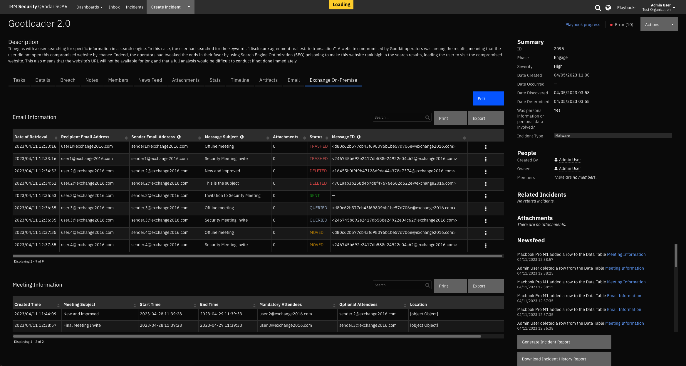

<!--
  This Install README.md is generated by running:
  "resilient-sdk docgen -p fn_mcafee_esm --install-guide"

  It is best edited using a Text Editor with a Markdown Previewer. VS Code
  is a good example. Checkout https://guides.github.com/features/mastering-markdown/
  for tips on writing with Markdown

  If you make manual edits and run docgen again, a .bak file will be created

  Store any screenshots in the "doc/screenshots" directory and reference them like:
  
-->

# fn-exchange Functions for IBM Resilient

- [Release Notes](#release-notes)
- [Overview](#overview)
- [Requirements](#requirements)
- [Installation](#installation)
- [Uninstall](#uninstall)
- [Components](#components)
- [Troubleshooting](#troubleshooting)
- [Support](#support)

---

## Release Notes
<!--
  Specify all changes in this release. Do not remove the release
  notes of a previous release
-->
| Version | Date | Notes |
| ------: | ---: | ----: |
| v1.0.2 | June 2021 | Fix for selftest |
| v1.0.1 | December 2020 | Added App Host support, Added proxy support. |
| v1.0.0 | August 2018 | Initial Release. |

---

## Overview
<!--
  Provide a high-level description of the function itself and its remote software or application.
  The text below is parsed from the "description" and "long_description" attributes in the setup.py file
-->
**Resilient Circuits Components for 'fn_exchange'**

 

This IBM Resilient Function package can be used to access Microsoft Exchange email and meeting capabilities.
The functions provided have the following capabilities:

* Querying emails
* Deleting queried emails
* Moving queried emails
* Moving the contents of a folder to another folder then deleting the original folder
* Sending emails
* Creating meetings
* Getting mailbox info for a specified user

---

## Requirements
<!--
  List any Requirements
-->
This app supports the IBM Resilient SOAR Platform and the IBM Cloud Pak for Security.

### Resilient platform
The Resilient platform supports two app deployment mechanisms, App Host and integration server.

If deploying to a Resilient platform with an App Host, the requirements are:
* Resilient platform >= `37.1`.
* The app is in a container-based format (available from the AppExchange as a `zip` file).

If deploying to a Resilient platform with an integration server, the requirements are:
* Resilient platform >= `31.0.4035`.
* The app is in the older integration format (available from the AppExchange as a `zip` file which contains a `tar.gz` file).
* Integration server is running `resilient_circuits>=30.0.0`.
* If using an API key account, make sure the account provides the following minimum permissions:
  | Name | Permissions |
  | ---- | ----------- |
  | Org Data | Read, Edit |

The following Resilient platform guides provide additional information:
* _App Host Deployment Guide_: provides installation, configuration, and troubleshooting information, including proxy server settings.
* _Integration Server Guide_: provides installation, configuration, and troubleshooting information, including proxy server settings.
* _System Administrator Guide_: provides the procedure to install, configure and deploy apps.

The above guides are available on the IBM Knowledge Center at [ibm.biz/resilient-docs](https://ibm.biz/resilient-docs). On this web page, select your Resilient platform version. On the follow-on page, you can find the _App Host Deployment Guide_ or _Integration Server Guide_ by expanding **Resilient Apps** in the Table of Contents pane. The System Administrator Guide is available by expanding **System Administrator**.

### Cloud Pak for Security
If you are deploying to IBM Cloud Pak for Security, the requirements are:
* IBM Cloud Pak for Security >= 1.4.
* Cloud Pak is configured with an App Host.
* The app is in a container-based format (available from the AppExchange as a `zip` file).

The following Cloud Pak guides provide additional information:
* _App Host Deployment Guide_: provides installation, configuration, and troubleshooting information, including proxy server settings. From the Table of Contents, select Case Management and Orchestration & Automation > **Orchestration and Automation Apps**.
* _System Administrator Guide_: provides information to install, configure, and deploy apps. From the IBM Cloud Pak for Security Knowledge Center table of contents, select Case Management and Orchestration & Automation > **System administrator**.

These guides are available on the IBM Knowledge Center at [ibm.biz/cp4s-docs](https://ibm.biz/cp4s-docs). From this web page, select your IBM Cloud Pak for Security version. From the version-specific Knowledge Center page, select Case Management and Orchestration & Automation.

### Proxy Server
The app supports a proxy server.

---

## Installation

### Install
* To install or uninstall an App or Integration on the _Resilient platform_, see the documentation at [ibm.biz/resilient-docs](https://ibm.biz/resilient-docs).
* To install or uninstall an App on _IBM Cloud Pak for Security_, see the documentation at [ibm.biz/cp4s-docs](https://ibm.biz/cp4s-docs) and follow the instructions above to navigate to Orchestration and Automation.

### App Configuration
The following table provides the settings you need to configure the app. These settings are made in the app.config file. See the documentation discussed in the Requirements section for the procedure.
| Config | Required | Example | Description |
| ------ | :------: | ------- | ----------- |
| **verify_cert** | Yes | `True or False` | *Use a CA cert for access to an Exchange server.* |
| **server** | Yes | `192.168.1.2` | *Exchange server DNS name or ip address.* |
| **username** | Yes | `domain\\username` | *Admin account with mailbox access to other accounts.* |
| **email** | Yes | `admin@example.com` | *default account to send emails and create meetings if one was not specified. Specifying an account that is not this one will require impersonation access.* |
| **password** | Yes | `password` | *User password for SEP api access.*  |
| **default_folder_path** | Yes | `Top of Information Store/Inbox` | *Some folder path after root Multiple folderpaths must be separated by commas.*  |
| **http_proxy** | Yes | `https://your.proxy.com:8080` | *Optional setting for an http proxy if required.*  |
| **https_proxy** | Yes | `http://your.proxy.com:8080` | *Optional setting for an https proxy if required.*  |

---

## Components
Once the customization data is imported into the Resilient platform the following
cutomization are available.
Please note that version 31 of Resilient is required to use the example workflows.

### Functions:
```
exchange_create_meeting
exchange_delete_emails
exchange_find_emails
exchange_get_mailbox_info
exchange_move_folder_contents_and_delete_folder
exchange_move_emails
exchange_send_email
```

### Sample workflows
```
Example of Exchange Create Meeting
Example of Exchange Delete Emails
Example of Exchange Find Emails
Example of Exchange Get Mailbox Info
Example of Exchange Move Emails
Example of Exchange Move Folder Contents and Delete Folder
Example of Exchange Send Email
```

### Sample Rules [Artifact]
```
Exchange Create Meeting
Exchange Delete Emails
Exchange Find Emails
Exchange Get Mailbox Info
Exchange Move Folder Contents and Delete Folder
Exchange Move Emails
Exchange Send Email
```

### Action fields and Function inputs
```
exchange_delete_if_no_subfolders
exchange_destination_folder_path
exchange_email
exchange_email_ids
exchange_emails
exchange_end_date
exchange_folder_path
exchange_get_email
exchange_hard_delete
exchange_has_attachments
exchange_meeting_body
exchange_meeting_end_time
exchange_meeting_start_time
exchange_meeting_subject
exchange_message_body
exchange_message_subject
exchange_num_emails
exchange_optional_attendees
exchange_order_by_recency
exchange_required_attendees
exchange_search_subfolders
exchange_sender
exchange_start_date
```

### Message Destination:
`fn_exchange`

---

## Troubleshooting & Support
Refer to the documentation listed in the Requirements section for troubleshooting information.

### For Support
This is an IBM supported app. Please search https://ibm.com/mysupport for assistance.

