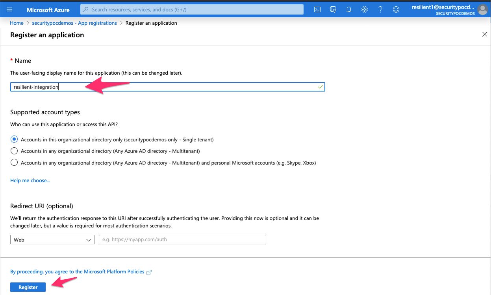

<!--
  This Install README.md is generated by running:
  "resilient-sdk docgen -p fn_exchange_online --only-install-guide"

  It is best edited using a Text Editor with a Markdown Previewer. VS Code
  is a good example. Checkout https://guides.github.com/features/mastering-markdown/
  for tips on writing with Markdown

  If you make manual edits and run docgen again, a .bak file will be created

  Store any screenshots in the "doc/screenshots" directory and reference them like:
  
-->

# Microsoft Exchange Online Functions for IBM Resilient

- [Release Notes](#release-notes)
- [Overview](#overview)
- [Requirements](#requirements)
- [Installation](#installation)
- [Uninstall](#uninstall)
- [Troubleshooting](#troubleshooting)
- [Support](#support)

---

## Release Notes
<!--
  Specify all changes in this release. Do not remove the release 
  notes of a previous release
-->
### v1.0.0
* Initial Release

---

## Overview
<!--
  Provide a high-level description of the function itself and its remote software or application.
  The text below is parsed from the "description" and "long_description" attributes in the setup.py file
-->
**Resilient Circuits Components for 'fn_exchange_online**

 

Resilient Integration with Exchange Online provides the capability to access and manipulate Microsoft Exchange Online messages from Resilient

---

## Requirements
<!--
  List any Requirements 
-->
* Resilient platform >= `v34.2.47`
* An Integration Server running `resilient_circuits>=31.0.0`
  * To set up an Integration Server see: [ibm.biz/res-int-server-guide](https://ibm.biz/res-int-server-guide)

---

## Installation
* Download the `fn_exchange_online.zip`.
* Copy the `.zip` to your Integration Server and SSH into it.
* **Unzip** the package:
  ```
  $ unzip fn_exchange_online-x.x.x.zip
  ```
* **Change Directory** into the unzipped directory:
  ```
  $ cd fn_exchange_online-x.x.x
  ```
* **Install** the package:
  ```
  $ pip install fn_exchange_online-x.x.x.tar.gz
  ```
* Import the **configurations** into your app.config file:
  ```
  $ resilient-circuits config -u
  ```
* Import the fn_exchange_online **customizations** into the Resilient platform:
  ```
  $ resilient-circuits customize -y -l fn-exchange-online
  ```
* Open the config file, scroll to the bottom and edit your fn_exchange_online configurations:
  ```
  $ nano ~/.resilient/app.config
  ```
  | Config | Required | Example | Description |
  | ------ | :------: | ------- | ----------- |
  | **microsoft_graph_token_url** | Yes | `https://login.microsoftonline.com/{tenant}/oauth2/v2.0/token` | *Microsoft Graph URL endpoint for acquring access token* |
  | **microsoft_graph_url** | Yes | `https://graph.microsoft.com/v1.0` | *Microsoft Graph base URL * |
  | **tenant_id** | Yes | `xxx` | *Microsoft Azure Tenant ID* |
  | **client_id** | Yes | `xxx` | *Microsoft Azure Client ID (Application ID)* |
  | **client_secret** | Yes | `xxx` | *Microsoft Azure Client Secret* |
  | **max_messages** | Yes | `100` | *Maximum number of messages that a query will return* |
  | **max_users** | Yes | `2000` | *Maximum number of users searched in a query* |

* **Save** and **Close** the app.config file.
* [Optional]: Run selftest to test the Integration you configured:
  ```
  $ resilient-circuits selftest -l fn-exchange-online
  ```
* **Run** resilient-circuits or restart the Service on Windows/Linux:
  ```
  $ resilient-circuits run
  ```

### Custom Layouts
<!--
  Use this section to provide guidance on where the user should add any custom fields and data tables.
  You may wish to recommend a new incident tab.
  You should save a screenshot "custom_layouts.png" in the doc/screenshots directory and reference it here
-->
Create an Exchange Online custom incident tab and drag the Exchange Online Message Query Results data table on to it as pictured in the screenshot below:

   
Results of any Exchange Online message query will be displayed in this data table.
   

---

## Uninstall
* SSH into your Integration Server.
* **Uninstall** the package:
  ```
  $ pip uninstall fn-exchange-online
  ```
* Open the config file, scroll to the [fn_exchange_online] section and remove the section or prefix `#` to comment out the section.
* **Save** and **Close** the app.config file.

---

## Troubleshooting
There are several ways to verify the successful operation of a function.

### Resilient Action Status
* When viewing an incident, use the Actions menu to view **Action Status**.
* By default, pending and errors are displayed.
* Modify the filter for actions to also show Completed actions.
* Clicking on an action displays additional information on the progress made or what error occurred.

### Resilient Scripting Log
* A separate log file is available to review scripting errors.
* This is useful when issues occur in the pre-processing or post-processing scripts.
* The default location for this log file is: `/var/log/resilient-scripting/resilient-scripting.log`.

### Resilient Logs
* By default, Resilient logs are retained at `/usr/share/co3/logs`.
* The `client.log` may contain additional information regarding the execution of functions.

### Resilient-Circuits
* The log is controlled in the `.resilient/app.config` file under the section [resilient] and the property `logdir`.
* The default file name is `app.log`.
* Each function will create progress information.
* Failures will show up as errors and may contain python trace statements.

---

<!--
  If necessary, use this section to describe how to configure your security application to work with the integration.
  Delete this section if the user does not need to perform any configuration procedures on your product.

## Configure <Product_Name>

* Step One
* Step Two
* Step Three

---
-->
## Azure Active Directory Configuration

To run the Resilient Exchange Online integration you must register the application on Microsoft Azure portal.  The tenant ID, client ID and the client secret that are defined in the fn_exchange_online section of the app.config are assigned by Azure when the application is registered.  

### App Registration
To register the Resilient integration application click "App registrations" in Manage section of your Azure Active Directory domain account.  Then click the "New Registration" button as depicted in the image below.


Enter a name for the integration.  In this example we name the application "resilient-integration".  Then press "Register" button.

Click on the newly created application and the page will appear similar to the screenshot below.  
You can get the tenant and client IDs that should be placed in the app.config.

Next click on the left menu item "Certificates & secrets" and create a secret which will also be placed in the app.config.


### API Permissions
For the Resilient integration app to access data in Microsoft Graph, an administrator 
must grant it the correct permissions via a consent process. Click on "API permissions" on the left menu and then "+ Add a Permission" 


Click on Microsoft Graph 


Select Application permissions (not Delegated permissions):


Add each of the following Microsoft Graph "Application permissions":
* Calendar.ReadWrite
* Mail.ReadWrite
* Mail.Send
* MailboxSetting.Read
* User.Read.All

Once the API Application permissions are added click the "Grant admin consent" button
for your domain 


Log into an admin account to accept these permissions requested on behalf of your organization:

## Support
| Name | Version | Author | Support URL |
| ---- | ------- | ------ | ----------- |
| fn_exchange_online | 1.0.0 | IBM Resilient | https://ibm.com/mysupport |
