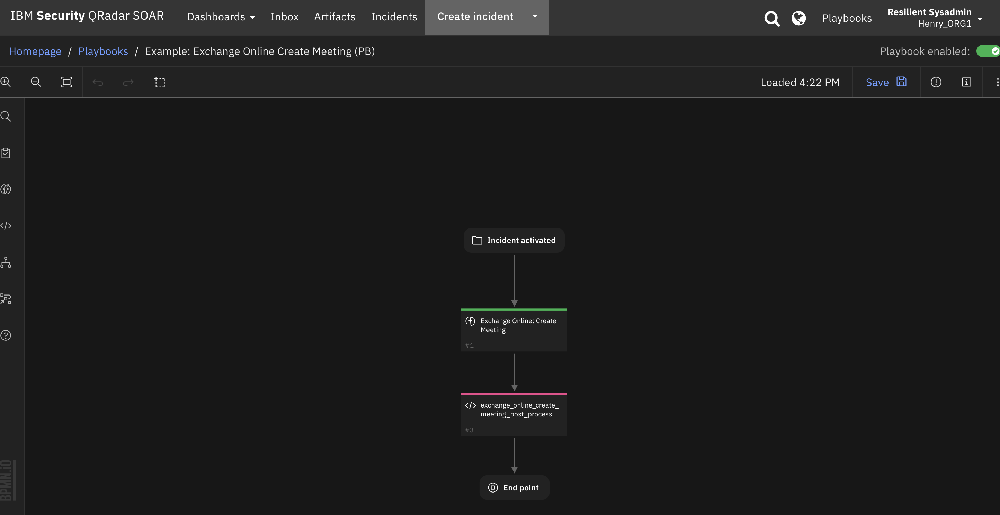
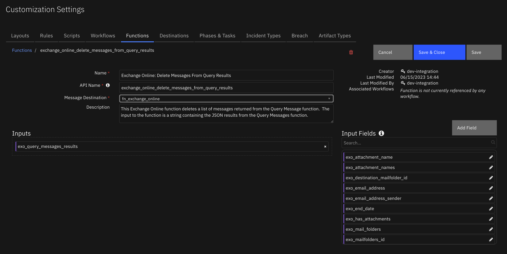
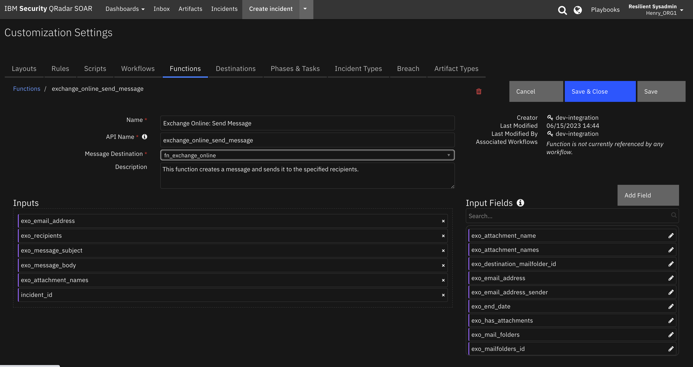

<!--
  This README.md is generated by running:
  "resilient-sdk docgen -p fn_exchange_online"

  This file was generated with resilient-sdk v49.0.4423

  It is best edited using a Text Editor with a Markdown Previewer. VS Code
  is a good example. Checkout https://guides.github.com/features/mastering-markdown/
  for tips on writing with Markdown

  All fields followed by "::CHANGE_ME::"" should be manually edited

  If you make manual edits and run docgen again, a .bak file will be created

  Store any screenshots in the "doc/screenshots" directory and reference them like:
  

  NOTE: If your app is available in the container-format only, there is no need to mention the integration server in this readme.
-->

# fn_exchange_online

## Table of Contents
- [Release Notes](#release-notes)
- [Overview](#overview)
  - [Key Features](#key-features)
- [Requirements](#requirements)
  - [SOAR platform](#soar-platform)
  - [Cloud Pak for Security](#cloud-pak-for-security)
  - [Proxy Server](#proxy-server)
  - [Python Environment](#python-environment)
- [Installation](#installation)
  - [Install](#install)
  - [App Configuration](#app-configuration)
  - [Custom Layouts](#custom-layouts)
- [Function - Exchange Online: Create Meeting](#function---exchange-online-create-meeting)
- [Function - Exchange Online: Delete Message](#function---exchange-online-delete-message)
- [Function - Exchange Online: Delete Messages From Query Results](#function---exchange-online-delete-messages-from-query-results)
- [Function - Exchange Online: Get Message](#function---exchange-online-get-message)
- [Function - Exchange Online: Get User Profile](#function---exchange-online-get-user-profile)
- [Function - Exchange Online: Move Message to Folder](#function---exchange-online-move-message-to-folder)
- [Function - Exchange Online: Query Messages](#function---exchange-online-query-messages)
- [Function - Exchange Online: Send Message](#function---exchange-online-send-message)
- [Function - Exchange Online: Write Message as Attachment](#function---exchange-online-write-message-as-attachment)
- [Script - Exchange Online Create Artifacts from Message](#script---exchange-online-create-artifacts-from-message)
- [Data Table - Exchange Online Message Query Results](#data-table---exchange-online-message-query-results)
- [Playbooks](#playbooks)
- [Troubleshooting & Support](#troubleshooting--support)

---

## Release Notes
<!--

-->
### 1.4.0 

In v1.4.0, the existing rules and workflows have been replaced with playbooks. This change is made to support the ongoing, newer capabilities of playbooks. Each playbook has the same functionality as the previous, corresponding rule/workflow.

If upgrading from a previous release, you'll notice that the previous release's rules/workflows remain in place. Both sets of rules and playbooks are active. For manual actions, playbooks have the same name as it's corresponding rule, but with "(PB)" added at the end.

You can continue to use the rules/workflows. But migrating to playbooks provides greater functionality along with future app enhancements and bug fixes.

### v1.3.0
* Support attaching incident attachments to a message.

### v1.2.0
* Minor performance improvement when query "all" user mailboxes.
* Continue querying "all" users if there is an error returned from a single call to the $batch endpoint.

### v1.1.0
The 1.1.0 release addresses performance issues when querying messages of all Exchange Online users of a tenant.
* Added batching of multiple message query requests into a single Microsoft Graph API request call using the /$batch endpoint.  The maximum number of requests that Microsoft Graph currently supports in the batch endpoint is 20 requests.  Should Microsoft change this value, the <code>max_batch_requests</code>  parameter should be updated in the app.config file.

* Added "max retries" capability to Microsoft Graph API requests. When making many Microsoft Graph API calls, the Microsoft Graph server may throttle the client and return  503 (server unavailable)  or 429 (too many requests) status codes. When this happens, the server may send back a "Retry-After" response header indicating to the client how long to wait and retry sending the request. If this header is not sent to the client, parameters can be set to indicate how long to wait and retry sending the request again.   These parameters are settable in the app.config file:
  * max_retries_total
  * max_retries_backoff_factor

* Added capability to specify a subset of email addresses to search. When querying messages of <code>all</code> tenant email addresses, the user can specify a subset of all user mailboxes to search.  For example, enter <code>all:r</code> in the <code>Email Address</code> select field of the <code>Example: Exchange Online Query Messages</code> activity popup menu  to specify searching all users with PrincipalUserName starting with the letter "r".  Enter <code>all:mc</code> to search all users starting with "mc".  

* The <code>Example: Exchange Online Query Messages</code> and <code>Example: Exchange Online Delete Messages from Query Results</code> menu item rules and workflows allow the user to multi-select where query results are displayed: 
  * Exchange Online data table
  * Incident note
  * Incident attachment 

* Fixed bug in query messages function which resulted in the search not completing when the queried message subject or message body contained single quote, hashtag or ampersand characters.

* Removed Exchange Online Web Link to Outlook message from the Exchange Online Message Query Results data table when the message is deleted or not found.

**NOTE** Existing users running Exchange Online functions on an integration server, should save the [fn_exchange_online] section of their app.config file to another file and delete that section from the app.config file before installing the new version, as this section has changed.  After installation, run the following command to obtain the new configuration:
```
  $ resilient-circuits config -u -l fn-exchange-online
  ```
Edit the required configuration setting as described in the [Integration Server](#integration-server) section.


### v1.0.0
* Initial Release

## History
| Version | Date | Notes |
| ------- | ---- | ----- |
| 1.4.0 | 7/2023 | Convert rules and workflows to playbooks |
| 1.3.0 | 2/2021 | Added attachments to send message |
| 1.2.0 | 12/2020 | Performance improvement when querying a large tenant using the "all" query parameter |
| 1.1.0 | 9/2020 | Numerous performance and functional improvements around querying mailboxes  |
| 1.0.0 | 2/2020 | Initial publication |
 <!-- ::CHANGE_ME:: -->

---

## Overview
<!--
  Provide a high-level description of the function itself and its remote software or application.
  The text below is parsed from the "description" and "long_description" attributes in the setup.py file
-->
Microsoft Exchange Online Functions for IBM Resilient provides the capability to access and manipulate Microsoft Exchange Online messages from the IBM Resilient SOAR Platform.  The integration uses Microsoft Graph API to access the data in Microsoft 365.  Included in the integration are the following capabilities:

* Get the user profile of the specified email address in JSON format.

* Get a specified message and return the results in JSON format.

* Get a specified message in .eml format and write as an incident attachment.

* Move a message to a specified "Well-known" Outlook folder.

* Send a message from the specified email address to the specified recipients with specified message subject and body text.

* Query messages of a single user, a list of users, or the whole tenant and return a list of messages matching the criteria: 
  * message sender
  * messages from a specific Well-known folder
  * message received date
  * text contained in the message subject or the message body
  * whether the message has attachments. 
  
  Detailed results are returned in the Exchange Online Query Message Results data table. Total messages found in each mailbox and the total query time are written to an incident note or attachment.

* Delete a single specified message from a specified email address.

* Delete a list of messages that are the results of a message query.  The messages deleted are written to the Exchange Online Query Messages data table.

* Create a meeting event in the organizer's Outlook calendar and send a calendar event message to meeting participants inviting them to the meeting.

The integration contains the following functions:
 
**Resilient Circuits Components for 'fn_exchange_online'**

  <!-- ::CHANGE_ME:: -->

Resilient Integration with Exchange Online provides the capability to access and manipulate Microsoft Exchange Online messages from Resilient.

### Key Features
<!--
  List the Key Features of the Integration
-->
Resilient Integration with Exchange Online provides the capability to access and manipulate Microsoft Exchange Online (Office 365 in the cloud) messages from the IBM Resilient Soar Platform.  The integration uses Microsoft Graph API to access the data in Office 365.  Included in the integrations are the following capabilities:

* Get the user profile of the specified email address in JSON format.

* Get a specified message and and return the results in JSON format.

* Get a specified message in .eml format and write as an incident attachment.

* Move a message to a specified "Well-known" Outlook folder.

* Send an message: from the specified email address to the specified recipients with specified message subject and body text.

* Query messages of a single user, a list of users, or the whole tenant and return a list of messages matching the criteria: message sender, messages from a specific Well-known folder, a time frame for when the message was received, text contained in the message subject or the message body, whether the message has attachments. Results are returned in the Exchange Online Query Message Results data table.

* Delete a single specified message from a specified email address.

* Delete a list of messages that are the results of a message query.  The messages deleted are written to the Exchange Online Query Messages data table.

* Create a meeting event in the organizer's Outlook calendar and send a calendar event message to meeting participants inviting them to the meeting.

---

## Requirements
<!--
  List any Requirements 
--> 
<!-- ::CHANGE_ME:: -->
This app supports the IBM Security QRadar SOAR Platform and the IBM Security QRadar SOAR for IBM Cloud Pak for Security.

### SOAR platform
The SOAR platform supports two app deployment mechanisms, Edge Gateway (formerly App Host) and integration server.

If deploying to a SOAR platform with an Edge Gateway, the requirements are:
* SOAR platform >= `47.0.8304`.
* The app is in a container-based format (available from the AppExchange as a `zip` file).

If deploying to a SOAR platform with an integration server, the requirements are:
* SOAR platform >= `47.0.8304`.
* The app is in the older integration format (available from the AppExchange as a `zip` file which contains a `tar.gz` file).
* Integration server is running `resilient_circuits>=31.0.0`.
* If using an API key account, make sure the account provides the following minimum permissions: 
  | Name | Permissions |
  | ---- | ----------- |
  | Org Data | Read |
  | Function | Read |
  <!-- ::CHANGE_ME:: -->

The following SOAR platform guides provide additional information: 
* _Edge Gateway Deployment Guide_ or _App Host Deployment Guide_: provides installation, configuration, and troubleshooting information, including proxy server settings. 
* _Integration Server Guide_: provides installation, configuration, and troubleshooting information, including proxy server settings.
* _System Administrator Guide_: provides the procedure to install, configure and deploy apps. 

The above guides are available on the IBM Documentation website at [ibm.biz/soar-docs](https://ibm.biz/soar-docs). On this web page, select your SOAR platform version. On the follow-on page, you can find the _Edge Gateway Deployment Guide_, _App Host Deployment Guide_, or _Integration Server Guide_ by expanding **Apps** in the Table of Contents pane. The System Administrator Guide is available by expanding **System Administrator**.

### Cloud Pak for Security
If you are deploying to IBM Cloud Pak for Security, the requirements are:
* IBM Cloud Pak for Security >= `1.8`.
* Cloud Pak is configured with an Edge Gateway.
* The app is in a container-based format (available from the AppExchange as a `zip` file).

The following Cloud Pak guides provide additional information: 
* _Edge Gateway Deployment Guide_ or _App Host Deployment Guide_: provides installation, configuration, and troubleshooting information, including proxy server settings. From the Table of Contents, select Case Management and Orchestration & Automation > **Orchestration and Automation Apps**.
* _System Administrator Guide_: provides information to install, configure, and deploy apps. From the IBM Cloud Pak for Security IBM Documentation table of contents, select Case Management and Orchestration & Automation > **System administrator**.

These guides are available on the IBM Documentation website at [ibm.biz/cp4s-docs](https://ibm.biz/cp4s-docs). From this web page, select your IBM Cloud Pak for Security version. From the version-specific IBM Documentation page, select Case Management and Orchestration & Automation.

### Proxy Server
If configuring fn_exchange_online with a proxy server, setting both the `http_proxy` and `https_proxy` can lead to connection issues.
Microsoft only supports a secure HTTPS proxy and we recommend only using the `https_proxy` parameter.
The `http_proxy` parameter should be omitted.

### Python Environment
Python 3.6 and Python 3.9 are supported.
Additional package dependencies may exist for each of these packages:
* pytz>=2019.3
* resilient_circuits>=31.0.0
* resilient_lib>=40.0.1rc0
* tzlocal>=2.0.0

### <!-- ::CHANGE_ME:: --> Development Version

This app has been implemented using:
| Product Name | Product Version | API URL | API Version |
| ------------ | --------------- | ------- | ----------- |
| <!-- ::CHANGE_ME:: --> | <!-- ::CHANGE_ME:: --> | <!-- ::CHANGE_ME:: --> | <!-- ::CHANGE_ME:: --> |

#### Prerequisites
<!--
List any prerequisites that are needed to use with this endpoint solution. Remove any section that is unnecessary.
-->


#### Configuration
<!--
List any steps that are needed to configure the endpoint to use this app.
-->
The following table describes the settings you need to configure in the app.config file. If using App Host, see the Resilient System Administrator Guide. If using the integration server, see the Integration Server Guide.

*Note:* if configuring fn_exchange_online with a proxy server, setting both the `http_proxy` and `https_proxy` can lead to connection issues.
Microsoft only supports a secure HTTPS proxy and we recommend only using the `https_proxy` parameter.
The `http_proxy` parameter should be omitted.

  | Config | Required | Example | Description |
  | ------ | :------: | ------- | ----------- |
  | **microsoft_graph_token_url** | Yes | `https://login.microsoftonline.com/{tenant}/oauth2/v2.0/token` | *Microsoft Graph URL endpoint for acquiring access token* |
  | **microsoft_graph_url** | Yes | `https://graph.microsoft.com/v1.0` | *Microsoft Graph base URL* |
  | **tenant_id** | Yes | `xxx` | *Microsoft Azure Tenant ID* |
  | **client_id** | Yes | `xxx` | *Microsoft Azure Client ID (Application ID)* |
  | **client_secret** | Yes | `xxx` | *Microsoft Azure Client Secret* |
  | **max_batched_requests** | Yes | `20` | *Maximum number of requests to send MS Graph API $batch endpoint in single call* |
  | **max_messages** | Yes | `100` | *Maximum number of messages that a query returns* |
  | **max_users** | Yes | `2000` | *Maximum number of users searched in a query* |
  | **max_retries_total** | Yes | `10` | *Maximum number of retries for MS Graph API request* |
  | **max_retries_backoff_factor** | Yes | `5` | *Backoff factor used to determine time to sleep between requests* |


#### Permissions
<!--
List any user permissions that are needed to use this endpoint. For example, list the API key permissions.
-->
For the Resilient integration app to access data in Microsoft Graph, an administrator 
must grant it the correct permissions via a consent process. Click on "API permissions" on the left menu and then "+ Add a Permission".


Click on Microsoft Graph:


Select Application permissions (not Delegated permissions):


Check each of the following Microsoft Graph API "Application permissions":
* Calendar.ReadWrite
* Mail.ReadWrite
* Mail.Send
* MailboxSetting.Read
* User.Read.All


Once the API Application permissions are added, click the "Grant admin consent" button
for your domain:


You may need to log in to an admin account to accept the permissions requested on behalf of your organization:


---

## Installation

### Install
* To install or uninstall an App or Integration on the _SOAR platform_, see the documentation at [ibm.biz/soar-docs](https://ibm.biz/soar-docs).
* To install or uninstall an App on _IBM Cloud Pak for Security_, see the documentation at [ibm.biz/cp4s-docs](https://ibm.biz/cp4s-docs) and follow the instructions above to navigate to Orchestration and Automation.

### App Configuration
The following table provides the settings you need to configure the app. These settings are made in the app.config file. See the documentation discussed in the Requirements section for the procedure.

| Config | Required | Example | Description |
| ------ | :------: | ------- | ----------- |
| **client_id** | Yes | `xxx` | *Enter a description of the config here.* <!-- ::CHANGE_ME:: --> |
| **client_secret** | Yes | `xxx` | *Enter a description of the config here.* <!-- ::CHANGE_ME:: --> |
| **max_batched_requests** | Yes | `20` | *Enter a description of the config here.* <!-- ::CHANGE_ME:: --> |
| **max_messages** | Yes | `100` | *Enter a description of the config here.* <!-- ::CHANGE_ME:: --> |
| **max_retries_backoff_factor** | Yes | `5` | *Enter a description of the config here.* <!-- ::CHANGE_ME:: --> |
| **max_retries_total** | Yes | `10` | *Enter a description of the config here.* <!-- ::CHANGE_ME:: --> |
| **max_users** | Yes | `2000` | *Enter a description of the config here.* <!-- ::CHANGE_ME:: --> |
| **microsoft_graph_token_url** | Yes | `https://login.microsoftonline.com/{tenant}/oauth2/v2.0/token` | *Enter a description of the config here.* <!-- ::CHANGE_ME:: --> |
| **microsoft_graph_url** | Yes | `https://graph.microsoft.com/v1.0` | *Enter a description of the config here.* <!-- ::CHANGE_ME:: --> |
| **tenant_id** | Yes | `xxx` | *Enter a description of the config here.* <!-- ::CHANGE_ME:: --> |

### Custom Layouts
<!--
  Use this section to provide guidance on where the user should add any custom fields and data tables.
  You may wish to recommend a new incident tab.
  You should save a screenshot "custom_layouts.png" in the doc/screenshots directory and reference it here
-->
* Import the Data Tables and Custom Fields like the screenshot below:

   <!-- ::CHANGE_ME:: -->


---

## Function - Exchange Online: Create Meeting
This function creates a meeting event in the organizer's Outlook calendar and sends a calendar event mail message to the meeting participants inviting them to the meeting.

  <!-- ::CHANGE_ME:: -->

<details><summary>Inputs:</summary>
<p>

| Name | Type | Required | Example | Tooltip |
| ---- | :--: | :------: | ------- | ------- |
| `exo_meeting_body` | `text` | Yes | `-` | Meeting message body |
| `exo_meeting_email_address` | `text` | Yes | `user@example.com` | Email address of meeting coordinator |
| `exo_meeting_end_time` | `datetimepicker` | Yes | `-` | End date and time for meeting |
| `exo_meeting_location` | `text` | No | `-` | - |
| `exo_meeting_optional_attendees` | `text` | No | `user1@example.com, user2@example.com` | Comma separated list of optional attendee email addresses |
| `exo_meeting_required_attendees` | `text` | No | `user1@example.com, user2@example.com` | Comma separated list of required attendee email addresses |
| `exo_meeting_start_time` | `datetimepicker` | Yes | `-` | Meeting start date and time |
| `exo_meeting_subject` | `text` | Yes | `-` | Meeting Subject |

</p>
</details>

<details><summary>Outputs:</summary>
<p>

> **NOTE:** This example might be in JSON format, but `results` is a Python Dictionary on the SOAR platform.

```python
results = {
  "content": {
    "@odata.context": "https://graph.microsoft.com/v1.0/$metadata#users(\u0027soartester%40reshydradev.onmicrosoft.com\u0027)/calendar/events/$entity",
    "@odata.etag": "W/\"4uV5MvSh7kOPFHsGsb/3vAAANEMjtA==\"",
    "allowNewTimeProposals": true,
    "attendees": [
      {
        "emailAddress": {},
        "status": {
          "response": "none",
          "time": "0001-01-01T00:00:00Z"
        },
        "type": "required"
      }
    ],
    "body": {
      "content": "\u003chtml\u003e\r\n\u003chead\u003e\r\n\u003cmeta http-equiv=\"Content-Type\" content=\"text/html; charset=utf-8\"\u003e\r\n\u003c/head\u003e\r\n\u003cbody\u003e\r\ntest test\r\n\u003c/body\u003e\r\n\u003c/html\u003e\r\n",
      "contentType": "html"
    },
    "bodyPreview": "test test",
    "categories": [],
    "changeKey": "4uV5MvSh7kOPFHsGsb/3vAAANEMjtA==",
    "createdDateTime": "2023-06-15T11:57:25.2936799Z",
    "end": {
      "dateTime": "2023-06-27T13:00:00.0000000",
      "timeZone": "Eastern Standard Time"
    },
    "hasAttachments": false,
    "hideAttendees": false,
    "iCalUId": "040000008200E00074C5B7101A82E008000000000C57E88C809FD90100000000000000001000000079E26061BC861948905C74B45C5736E5",
    "id": "AAMkAGVhZGFlNDVhLTI0MDAtNGE1Ni05Zjk3LTAxNzllYjFiNDAzYwBGAAAAAADG92SqC8zpQJ1GSk2scH2NBwDi5Xky9KHuQ48Uewaxv-e8AAAAAAENAADi5Xky9KHuQ48Uewaxv-e8AAA0UGB5AAA=",
    "importance": "normal",
    "isAllDay": false,
    "isCancelled": false,
    "isDraft": false,
    "isOnlineMeeting": false,
    "isOrganizer": true,
    "isReminderOn": true,
    "lastModifiedDateTime": "2023-06-15T11:57:25.5084032Z",
    "location": {
      "address": {},
      "coordinates": {},
      "displayName": "",
      "locationType": "default",
      "uniqueIdType": "unknown"
    },
    "locations": [],
    "occurrenceId": null,
    "onlineMeeting": null,
    "onlineMeetingProvider": "unknown",
    "onlineMeetingUrl": null,
    "organizer": {
      "emailAddress": {
        "address": "soartester@reshydradev.onmicrosoft.com",
        "name": "SOAR tester"
      }
    },
    "originalEndTimeZone": "Eastern Standard Time",
    "originalStartTimeZone": "Eastern Standard Time",
    "recurrence": null,
    "reminderMinutesBeforeStart": 15,
    "responseRequested": true,
    "responseStatus": {
      "response": "organizer",
      "time": "0001-01-01T00:00:00Z"
    },
    "sensitivity": "normal",
    "seriesMasterId": null,
    "showAs": "busy",
    "start": {
      "dateTime": "2023-06-27T12:00:00.0000000",
      "timeZone": "Eastern Standard Time"
    },
    "subject": "test",
    "transactionId": null,
    "type": "singleInstance",
    "webLink": "https://outlook.office365.com/owa/?itemid=AAMkAGVhZGFlNDVhLTI0MDAtNGE1Ni05Zjk3LTAxNzllYjFiNDAzYwBGAAAAAADG92SqC8zpQJ1GSk2scH2NBwDi5Xky9KHuQ48Uewaxv%2Fe8AAAAAAENAADi5Xky9KHuQ48Uewaxv%2Fe8AAA0UGB5AAA%3D\u0026exvsurl=1\u0026path=/calendar/item"
  },
  "inputs": {
    "exo_meeting_body": "test test",
    "exo_meeting_email_address": "soartester@reshydradev.onmicrosoft.com",
    "exo_meeting_end_time": 1687885200000,
    "exo_meeting_location": null,
    "exo_meeting_optional_attendees": null,
    "exo_meeting_required_attendees": null,
    "exo_meeting_start_time": 1687881600000,
    "exo_meeting_subject": "test"
  },
  "metrics": {
    "execution_time_ms": 2094,
    "host": "Henry\u0027s IBM 16 inch Macbook Pro",
    "package": "fn-exchange-online",
    "package_version": "1.4.0",
    "timestamp": "2023-06-15 19:57:25",
    "version": "1.0"
  },
  "pretty_string": "{\n    \"@odata.context\": \"https://graph.microsoft.com/v1.0/$metadata#users(\u0027soartester%40reshydradev.onmicrosoft.com\u0027)/calendar/events/$entity\",\n    \"@odata.etag\": \"W/\\\"4uV5MvSh7kOPFHsGsb/3vAAANEMjtA==\\\"\",\n    \"id\": \"AAMkAGVhZGFlNDVhLTI0MDAtNGE1Ni05Zjk3LTAxNzllYjFiNDAzYwBGAAAAAADG92SqC8zpQJ1GSk2scH2NBwDi5Xky9KHuQ48Uewaxv-e8AAAAAAENAADi5Xky9KHuQ48Uewaxv-e8AAA0UGB5AAA=\",\n    \"createdDateTime\": \"2023-06-15T11:57:25.2936799Z\",\n    \"lastModifiedDateTime\": \"2023-06-15T11:57:25.5084032Z\",\n    \"changeKey\": \"4uV5MvSh7kOPFHsGsb/3vAAANEMjtA==\",\n    \"categories\": [],\n    \"transactionId\": null,\n    \"originalStartTimeZone\": \"Eastern Standard Time\",\n    \"originalEndTimeZone\": \"Eastern Standard Time\",\n    \"iCalUId\": \"040000008200E00074C5B7101A82E008000000000C57E88C809FD90100000000000000001000000079E26061BC861948905C74B45C5736E5\",\n    \"reminderMinutesBeforeStart\": 15,\n    \"isReminderOn\": true,\n    \"hasAttachments\": false,\n    \"subject\": \"test\",\n    \"bodyPreview\": \"test test\",\n    \"importance\": \"normal\",\n    \"sensitivity\": \"normal\",\n    \"isAllDay\": false,\n    \"isCancelled\": false,\n    \"isOrganizer\": true,\n    \"responseRequested\": true,\n    \"seriesMasterId\": null,\n    \"showAs\": \"busy\",\n    \"type\": \"singleInstance\",\n    \"webLink\": \"https://outlook.office365.com/owa/?itemid=AAMkAGVhZGFlNDVhLTI0MDAtNGE1Ni05Zjk3LTAxNzllYjFiNDAzYwBGAAAAAADG92SqC8zpQJ1GSk2scH2NBwDi5Xky9KHuQ48Uewaxv%2Fe8AAAAAAENAADi5Xky9KHuQ48Uewaxv%2Fe8AAA0UGB5AAA%3D\u0026exvsurl=1\u0026path=/calendar/item\",\n    \"onlineMeetingUrl\": null,\n    \"isOnlineMeeting\": false,\n    \"onlineMeetingProvider\": \"unknown\",\n    \"allowNewTimeProposals\": true,\n    \"occurrenceId\": null,\n    \"isDraft\": false,\n    \"hideAttendees\": false,\n    \"responseStatus\": {\n        \"response\": \"organizer\",\n        \"time\": \"0001-01-01T00:00:00Z\"\n    },\n    \"body\": {\n        \"contentType\": \"html\",\n        \"content\": \"\u003chtml\u003e\\r\\n\u003chead\u003e\\r\\n\u003cmeta http-equiv=\\\"Content-Type\\\" content=\\\"text/html; charset=utf-8\\\"\u003e\\r\\n\u003c/head\u003e\\r\\n\u003cbody\u003e\\r\\ntest test\\r\\n\u003c/body\u003e\\r\\n\u003c/html\u003e\\r\\n\"\n    },\n    \"start\": {\n        \"dateTime\": \"2023-06-27T12:00:00.0000000\",\n        \"timeZone\": \"Eastern Standard Time\"\n    },\n    \"end\": {\n        \"dateTime\": \"2023-06-27T13:00:00.0000000\",\n        \"timeZone\": \"Eastern Standard Time\"\n    },\n    \"location\": {\n        \"displayName\": \"\",\n        \"locationType\": \"default\",\n        \"uniqueIdType\": \"unknown\",\n        \"address\": {},\n        \"coordinates\": {}\n    },\n    \"locations\": [],\n    \"recurrence\": null,\n    \"attendees\": [\n        {\n            \"type\": \"required\",\n            \"status\": {\n                \"response\": \"none\",\n                \"time\": \"0001-01-01T00:00:00Z\"\n            },\n            \"emailAddress\": {}\n        }\n    ],\n    \"organizer\": {\n        \"emailAddress\": {\n            \"name\": \"SOAR tester\",\n            \"address\": \"soartester@reshydradev.onmicrosoft.com\"\n        }\n    },\n    \"onlineMeeting\": null\n}",
  "raw": "{\"@odata.context\": \"https://graph.microsoft.com/v1.0/$metadata#users(\u0027soartester%40reshydradev.onmicrosoft.com\u0027)/calendar/events/$entity\", \"@odata.etag\": \"W/\\\"4uV5MvSh7kOPFHsGsb/3vAAANEMjtA==\\\"\", \"id\": \"AAMkAGVhZGFlNDVhLTI0MDAtNGE1Ni05Zjk3LTAxNzllYjFiNDAzYwBGAAAAAADG92SqC8zpQJ1GSk2scH2NBwDi5Xky9KHuQ48Uewaxv-e8AAAAAAENAADi5Xky9KHuQ48Uewaxv-e8AAA0UGB5AAA=\", \"createdDateTime\": \"2023-06-15T11:57:25.2936799Z\", \"lastModifiedDateTime\": \"2023-06-15T11:57:25.5084032Z\", \"changeKey\": \"4uV5MvSh7kOPFHsGsb/3vAAANEMjtA==\", \"categories\": [], \"transactionId\": null, \"originalStartTimeZone\": \"Eastern Standard Time\", \"originalEndTimeZone\": \"Eastern Standard Time\", \"iCalUId\": \"040000008200E00074C5B7101A82E008000000000C57E88C809FD90100000000000000001000000079E26061BC861948905C74B45C5736E5\", \"reminderMinutesBeforeStart\": 15, \"isReminderOn\": true, \"hasAttachments\": false, \"subject\": \"test\", \"bodyPreview\": \"test test\", \"importance\": \"normal\", \"sensitivity\": \"normal\", \"isAllDay\": false, \"isCancelled\": false, \"isOrganizer\": true, \"responseRequested\": true, \"seriesMasterId\": null, \"showAs\": \"busy\", \"type\": \"singleInstance\", \"webLink\": \"https://outlook.office365.com/owa/?itemid=AAMkAGVhZGFlNDVhLTI0MDAtNGE1Ni05Zjk3LTAxNzllYjFiNDAzYwBGAAAAAADG92SqC8zpQJ1GSk2scH2NBwDi5Xky9KHuQ48Uewaxv%2Fe8AAAAAAENAADi5Xky9KHuQ48Uewaxv%2Fe8AAA0UGB5AAA%3D\u0026exvsurl=1\u0026path=/calendar/item\", \"onlineMeetingUrl\": null, \"isOnlineMeeting\": false, \"onlineMeetingProvider\": \"unknown\", \"allowNewTimeProposals\": true, \"occurrenceId\": null, \"isDraft\": false, \"hideAttendees\": false, \"responseStatus\": {\"response\": \"organizer\", \"time\": \"0001-01-01T00:00:00Z\"}, \"body\": {\"contentType\": \"html\", \"content\": \"\u003chtml\u003e\\r\\n\u003chead\u003e\\r\\n\u003cmeta http-equiv=\\\"Content-Type\\\" content=\\\"text/html; charset=utf-8\\\"\u003e\\r\\n\u003c/head\u003e\\r\\n\u003cbody\u003e\\r\\ntest test\\r\\n\u003c/body\u003e\\r\\n\u003c/html\u003e\\r\\n\"}, \"start\": {\"dateTime\": \"2023-06-27T12:00:00.0000000\", \"timeZone\": \"Eastern Standard Time\"}, \"end\": {\"dateTime\": \"2023-06-27T13:00:00.0000000\", \"timeZone\": \"Eastern Standard Time\"}, \"location\": {\"displayName\": \"\", \"locationType\": \"default\", \"uniqueIdType\": \"unknown\", \"address\": {}, \"coordinates\": {}}, \"locations\": [], \"recurrence\": null, \"attendees\": [{\"type\": \"required\", \"status\": {\"response\": \"none\", \"time\": \"0001-01-01T00:00:00Z\"}, \"emailAddress\": {}}], \"organizer\": {\"emailAddress\": {\"name\": \"SOAR tester\", \"address\": \"soartester@reshydradev.onmicrosoft.com\"}}, \"onlineMeeting\": null}",
  "reason": null,
  "success": true,
  "version": "1.0"
}
```

</p>
</details>

<details><summary>Example Pre-Process Script:</summary>
<p>

```python
None
```

</p>
</details>

<details><summary>Example Post-Process Script:</summary>
<p>

```python
None
```

</p>
</details>

---
## Function - Exchange Online: Delete Message
Delete a message in the specified user's email address mailbox.  The email address of the mailbox and the message id are required input parameters.  The mail folder is an optional parameter.

  <!-- ::CHANGE_ME:: -->

<details><summary>Inputs:</summary>
<p>

| Name | Type | Required | Example | Tooltip |
| ---- | :--: | :------: | ------- | ------- |
| `exo_email_address` | `text` | Yes | `user@example.com` | User email account |
| `exo_mailfolders_id` | `text` | No | `-` | MailFolders ID |
| `exo_messages_id` | `text` | Yes | `-` | The message ID of the message to be deleted |

</p>
</details>

<details><summary>Outputs:</summary>
<p>

> **NOTE:** This example might be in JSON format, but `results` is a Python Dictionary on the SOAR platform.

```python
results = {
  "content": {
    "value": true
  },
  "inputs": {
    "exo_email_address": "soartester@reshydradev.onmicrosoft.com",
    "exo_mailfolders_id": null,
    "exo_messages_id": "AAMkAGVhZGFlNDVhLTI0MDAtNGE1Ni05Zjk3LTAxNzllYjFiNDAzYwBGAAAAAADG92SqC8zpQJ1GSk2scH2NBwDi5Xky9KHuQ48Uewaxv-e8AAAAAAEMAADi5Xky9KHuQ48Uewaxv-e8AAA0UCmTAAA="
  },
  "metrics": {
    "execution_time_ms": 1426,
    "host": "Henry\u0027s IBM 16 inch Macbook Pro",
    "package": "fn-exchange-online",
    "package_version": "1.4.0",
    "timestamp": "2023-06-15 19:53:56",
    "version": "1.0"
  },
  "raw": "{\"value\": true}",
  "reason": null,
  "success": true,
  "version": "1.0"
}
```

</p>
</details>

<details><summary>Example Pre-Process Script:</summary>
<p>

```python
None
```

</p>
</details>

<details><summary>Example Post-Process Script:</summary>
<p>

```python
None
```

</p>
</details>

---
## Function - Exchange Online: Delete Messages From Query Results
This Exchange Online function deletes a list of messages returned from the Query Message function.  The input to the function is a string containing the JSON results from the Query Messages function.

  <!-- ::CHANGE_ME:: -->

<details><summary>Inputs:</summary>
<p>

| Name | Type | Required | Example | Tooltip |
| ---- | :--: | :------: | ------- | ------- |
| `exo_query_messages_results` | `text` | Yes | `-` | String containing JSON data results from Query Messages function |

</p>
</details>

<details><summary>Outputs:</summary>
<p>

> **NOTE:** This example might be in JSON format, but `results` is a Python Dictionary on the SOAR platform.

```python
results = {
  "content": {
    "delete_results": [
      {
        "deleted_list": [
          {
            "@odata.etag": "W/\"CQAAABYAAADi5Xky9KHuQ48Uewaxv/e8AAApETzf\"",
            "hasAttachments": false,
            "id": "AAMkAGVhZGFlNDVhLTI0MDAtNGE1Ni05Zjk3LTAxNzllYjFiNDAzYwBGAAAAAADG92SqC8zpQJ1GSk2scH2NBwDi5Xky9KHuQ48Uewaxv-e8AAAAAAEMAADi5Xky9KHuQ48Uewaxv-e8AAApGgUgAAA=",
            "receivedDateTime": "2023-05-30T07:49:26Z",
            "sender": {
              "emailAddress": {
                "address": "soartester@reshydradev.onmicrosoft.com",
                "name": "SOAR tester"
              }
            },
            "subject": "test pb",
            "webLink": "https://outlook.office365.com/owa/?ItemID=AAMkAGVhZGFlNDVhLTI0MDAtNGE1Ni05Zjk3LTAxNzllYjFiNDAzYwBGAAAAAADG92SqC8zpQJ1GSk2scH2NBwDi5Xky9KHuQ48Uewaxv%2Fe8AAAAAAEMAADi5Xky9KHuQ48Uewaxv%2Fe8AAApGgUgAAA%3D\u0026exvsurl=1\u0026viewmodel=ReadMessageItem"
          }
        ],
        "email_address": "soartester@reshydradev.onmicrosoft.com",
        "not_deleted_list": []
      }
    ],
    "exo_query_output_format": [
      "Exchange Online data table",
      "Incident note"
    ],
    "incident_id": 2115
  },
  "inputs": {
    "exo_query_messages_results": "{\"incident_id\": 2115, \"exo_query_output_format\": [\"Exchange Online data table\", \"Incident note\"], \"email_results\": [{\"email_address\": \"soartester@reshydradev.onmicrosoft.com\", \"status_code\": 200, \"email_list\": [{\"@odata.etag\": \"W/\\\"CQAAABYAAADi5Xky9KHuQ48Uewaxv/e8AAApETzf\\\"\", \"id\": \"AAMkAGVhZGFlNDVhLTI0MDAtNGE1Ni05Zjk3LTAxNzllYjFiNDAzYwBGAAAAAADG92SqC8zpQJ1GSk2scH2NBwDi5Xky9KHuQ48Uewaxv-e8AAAAAAEMAADi5Xky9KHuQ48Uewaxv-e8AAApGgUgAAA=\", \"receivedDateTime\": \"2023-05-30T07:49:26Z\", \"hasAttachments\": false, \"subject\": \"test pb\", \"webLink\": \"https://outlook.office365.com/owa/?ItemID=AAMkAGVhZGFlNDVhLTI0MDAtNGE1Ni05Zjk3LTAxNzllYjFiNDAzYwBGAAAAAADG92SqC8zpQJ1GSk2scH2NBwDi5Xky9KHuQ48Uewaxv%2Fe8AAAAAAEMAADi5Xky9KHuQ48Uewaxv%2Fe8AAApGgUgAAA%3D\u0026exvsurl=1\u0026viewmodel=ReadMessageItem\", \"sender\": {\"emailAddress\": {\"name\": \"SOAR tester\", \"address\": \"soartester@reshydradev.onmicrosoft.com\"}}}]}]}"
  },
  "metrics": {
    "execution_time_ms": 1423,
    "host": "Henry\u0027s IBM 16 inch Macbook Pro",
    "package": "fn-exchange-online",
    "package_version": "1.4.0",
    "timestamp": "2023-05-30 15:49:57",
    "version": "1.0"
  },
  "raw": "{\"incident_id\": 2115, \"exo_query_output_format\": [\"Exchange Online data table\", \"Incident note\"], \"delete_results\": [{\"email_address\": \"soartester@reshydradev.onmicrosoft.com\", \"deleted_list\": [{\"@odata.etag\": \"W/\\\"CQAAABYAAADi5Xky9KHuQ48Uewaxv/e8AAApETzf\\\"\", \"id\": \"AAMkAGVhZGFlNDVhLTI0MDAtNGE1Ni05Zjk3LTAxNzllYjFiNDAzYwBGAAAAAADG92SqC8zpQJ1GSk2scH2NBwDi5Xky9KHuQ48Uewaxv-e8AAAAAAEMAADi5Xky9KHuQ48Uewaxv-e8AAApGgUgAAA=\", \"receivedDateTime\": \"2023-05-30T07:49:26Z\", \"hasAttachments\": false, \"subject\": \"test pb\", \"webLink\": \"https://outlook.office365.com/owa/?ItemID=AAMkAGVhZGFlNDVhLTI0MDAtNGE1Ni05Zjk3LTAxNzllYjFiNDAzYwBGAAAAAADG92SqC8zpQJ1GSk2scH2NBwDi5Xky9KHuQ48Uewaxv%2Fe8AAAAAAEMAADi5Xky9KHuQ48Uewaxv%2Fe8AAApGgUgAAA%3D\u0026exvsurl=1\u0026viewmodel=ReadMessageItem\", \"sender\": {\"emailAddress\": {\"name\": \"SOAR tester\", \"address\": \"soartester@reshydradev.onmicrosoft.com\"}}}], \"not_deleted_list\": []}]}",
  "reason": null,
  "success": true,
  "version": "1.0"
}
```

</p>
</details>

<details><summary>Example Pre-Process Script:</summary>
<p>

```python
None
```

</p>
</details>

<details><summary>Example Post-Process Script:</summary>
<p>

```python
None
```

</p>
</details>

---
## Function - Exchange Online: Get Message
This function returns the contents of an Exchange Online message in JSON format.

  <!-- ::CHANGE_ME:: -->

<details><summary>Inputs:</summary>
<p>

| Name | Type | Required | Example | Tooltip |
| ---- | :--: | :------: | ------- | ------- |
| `exo_email_address` | `text` | Yes | `user@example.com` | User email account |
| `exo_messages_id` | `text` | Yes | `-` | The message ID of the message to be deleted |

</p>
</details>

<details><summary>Outputs:</summary>
<p>

> **NOTE:** This example might be in JSON format, but `results` is a Python Dictionary on the SOAR platform.

```python
results = {
  "content": {
    "@odata.context": "https://graph.microsoft.com/v1.0/$metadata#users(\u0027soartester%40reshydradev.onmicrosoft.com\u0027)/messages/$entity",
    "@odata.etag": "W/\"CQAAABYAAADi5Xky9KHuQ48Uewaxv/e8AAApET0U\"",
    "bccRecipients": [],
    "body": {
      "content": "\u003chtml\u003e\u003chead\u003e\r\n\u003cmeta http-equiv=\"Content-Type\" content=\"text/html; charset=utf-8\"\u003e\u003c/head\u003e\u003cbody\u003etest pb 123 \u003c/body\u003e\u003c/html\u003e",
      "contentType": "html"
    },
    "bodyPreview": "test pb 123",
    "categories": [],
    "ccRecipients": [],
    "changeKey": "CQAAABYAAADi5Xky9KHuQ48Uewaxv/e8AAApET0U",
    "conversationId": "AAQkAGVhZGFlNDVhLTI0MDAtNGE1Ni05Zjk3LTAxNzllYjFiNDAzYwAQALxVooc96jZPnUrWrWacvYg=",
    "conversationIndex": "AQHZksvjvFWihz3qNk+dStatZpy9iA==",
    "createdDateTime": "2023-05-30T07:53:58Z",
    "flag": {
      "flagStatus": "notFlagged"
    },
    "from": {
      "emailAddress": {
        "address": "soartester@reshydradev.onmicrosoft.com",
        "name": "SOAR tester"
      }
    },
    "hasAttachments": false,
    "id": "AAMkAGVhZGFlNDVhLTI0MDAtNGE1Ni05Zjk3LTAxNzllYjFiNDAzYwBGAAAAAADG92SqC8zpQJ1GSk2scH2NBwDi5Xky9KHuQ48Uewaxv-e8AAAAAAETAADi5Xky9KHuQ48Uewaxv-e8AAApGtroAAA=",
    "importance": "normal",
    "inferenceClassification": "focused",
    "internetMessageId": "\u003cDM6PR08MB60609ABA5A1C0455AFF7C26C954B9@DM6PR08MB6060.namprd08.prod.outlook.com\u003e",
    "isDeliveryReceiptRequested": false,
    "isDraft": false,
    "isRead": true,
    "isReadReceiptRequested": false,
    "lastModifiedDateTime": "2023-05-30T07:55:21Z",
    "parentFolderId": "AQMkAGVhZGFlNDVhLTI0MDAALTRhNTYtOWY5Ny0wMTc5ZWIxYjQwM2MALgAAA8b3ZKoLzOlAnUZKTaxwfY0BAOLleTL0oe5DjxR7BrG-97wAAAIBEwAAAA==",
    "receivedDateTime": "2023-05-30T07:53:58Z",
    "replyTo": [],
    "sender": {
      "emailAddress": {
        "address": "soartester@reshydradev.onmicrosoft.com",
        "name": "SOAR tester"
      }
    },
    "sentDateTime": "2023-05-30T07:53:57Z",
    "subject": "test pb",
    "toRecipients": [
      {
        "emailAddress": {
          "address": "soartester@reshydradev.onmicrosoft.com",
          "name": "SOAR tester"
        }
      }
    ],
    "webLink": "https://outlook.office365.com/owa/?ItemID=AAMkAGVhZGFlNDVhLTI0MDAtNGE1Ni05Zjk3LTAxNzllYjFiNDAzYwBGAAAAAADG92SqC8zpQJ1GSk2scH2NBwDi5Xky9KHuQ48Uewaxv%2Fe8AAAAAAETAADi5Xky9KHuQ48Uewaxv%2Fe8AAApGtroAAA%3D\u0026exvsurl=1\u0026viewmodel=ReadMessageItem"
  },
  "inputs": {
    "exo_email_address": "soartester@reshydradev.onmicrosoft.com",
    "exo_messages_id": "AAMkAGVhZGFlNDVhLTI0MDAtNGE1Ni05Zjk3LTAxNzllYjFiNDAzYwBGAAAAAADG92SqC8zpQJ1GSk2scH2NBwDi5Xky9KHuQ48Uewaxv-e8AAAAAAETAADi5Xky9KHuQ48Uewaxv-e8AAApGtroAAA="
  },
  "metrics": {
    "execution_time_ms": 1437,
    "host": "Henry\u0027s IBM 16 inch Macbook Pro",
    "package": "fn-exchange-online",
    "package_version": "1.4.0",
    "timestamp": "2023-05-30 16:30:46",
    "version": "1.0"
  },
  "pretty_string": "{\n    \"@odata.context\": \"https://graph.microsoft.com/v1.0/$metadata#users(\u0027soartester%40reshydradev.onmicrosoft.com\u0027)/messages/$entity\",\n    \"@odata.etag\": \"W/\\\"CQAAABYAAADi5Xky9KHuQ48Uewaxv/e8AAApET0U\\\"\",\n    \"bccRecipients\": [],\n    \"body\": {\n        \"content\": \"\u003chtml\u003e\u003chead\u003e\\r\\n\u003cmeta http-equiv=\\\"Content-Type\\\" content=\\\"text/html; charset=utf-8\\\"\u003e\u003c/head\u003e\u003cbody\u003etest pb 123 \u003c/body\u003e\u003c/html\u003e\",\n        \"contentType\": \"html\"\n    },\n    \"bodyPreview\": \"test pb 123\",\n    \"categories\": [],\n    \"ccRecipients\": [],\n    \"changeKey\": \"CQAAABYAAADi5Xky9KHuQ48Uewaxv/e8AAApET0U\",\n    \"conversationId\": \"AAQkAGVhZGFlNDVhLTI0MDAtNGE1Ni05Zjk3LTAxNzllYjFiNDAzYwAQALxVooc96jZPnUrWrWacvYg=\",\n    \"conversationIndex\": \"AQHZksvjvFWihz3qNk+dStatZpy9iA==\",\n    \"createdDateTime\": \"2023-05-30T07:53:58Z\",\n    \"flag\": {\n        \"flagStatus\": \"notFlagged\"\n    },\n    \"from\": {\n        \"emailAddress\": {\n            \"address\": \"soartester@reshydradev.onmicrosoft.com\",\n            \"name\": \"SOAR tester\"\n        }\n    },\n    \"hasAttachments\": false,\n    \"id\": \"AAMkAGVhZGFlNDVhLTI0MDAtNGE1Ni05Zjk3LTAxNzllYjFiNDAzYwBGAAAAAADG92SqC8zpQJ1GSk2scH2NBwDi5Xky9KHuQ48Uewaxv-e8AAAAAAETAADi5Xky9KHuQ48Uewaxv-e8AAApGtroAAA=\",\n    \"importance\": \"normal\",\n    \"inferenceClassification\": \"focused\",\n    \"internetMessageId\": \"\u003cDM6PR08MB60609ABA5A1C0455AFF7C26C954B9@DM6PR08MB6060.namprd08.prod.outlook.com\u003e\",\n    \"isDeliveryReceiptRequested\": false,\n    \"isDraft\": false,\n    \"isRead\": true,\n    \"isReadReceiptRequested\": false,\n    \"lastModifiedDateTime\": \"2023-05-30T07:55:21Z\",\n    \"parentFolderId\": \"AQMkAGVhZGFlNDVhLTI0MDAALTRhNTYtOWY5Ny0wMTc5ZWIxYjQwM2MALgAAA8b3ZKoLzOlAnUZKTaxwfY0BAOLleTL0oe5DjxR7BrG-97wAAAIBEwAAAA==\",\n    \"receivedDateTime\": \"2023-05-30T07:53:58Z\",\n    \"replyTo\": [],\n    \"sender\": {\n        \"emailAddress\": {\n            \"address\": \"soartester@reshydradev.onmicrosoft.com\",\n            \"name\": \"SOAR tester\"\n        }\n    },\n    \"sentDateTime\": \"2023-05-30T07:53:57Z\",\n    \"subject\": \"test pb\",\n    \"toRecipients\": [\n        {\n            \"emailAddress\": {\n                \"address\": \"soartester@reshydradev.onmicrosoft.com\",\n                \"name\": \"SOAR tester\"\n            }\n        }\n    ],\n    \"webLink\": \"https://outlook.office365.com/owa/?ItemID=AAMkAGVhZGFlNDVhLTI0MDAtNGE1Ni05Zjk3LTAxNzllYjFiNDAzYwBGAAAAAADG92SqC8zpQJ1GSk2scH2NBwDi5Xky9KHuQ48Uewaxv%2Fe8AAAAAAETAADi5Xky9KHuQ48Uewaxv%2Fe8AAApGtroAAA%3D\u0026exvsurl=1\u0026viewmodel=ReadMessageItem\"\n}",
  "raw": "{\"@odata.context\": \"https://graph.microsoft.com/v1.0/$metadata#users(\u0027soartester%40reshydradev.onmicrosoft.com\u0027)/messages/$entity\", \"@odata.etag\": \"W/\\\"CQAAABYAAADi5Xky9KHuQ48Uewaxv/e8AAApET0U\\\"\", \"id\": \"AAMkAGVhZGFlNDVhLTI0MDAtNGE1Ni05Zjk3LTAxNzllYjFiNDAzYwBGAAAAAADG92SqC8zpQJ1GSk2scH2NBwDi5Xky9KHuQ48Uewaxv-e8AAAAAAETAADi5Xky9KHuQ48Uewaxv-e8AAApGtroAAA=\", \"createdDateTime\": \"2023-05-30T07:53:58Z\", \"lastModifiedDateTime\": \"2023-05-30T07:55:21Z\", \"changeKey\": \"CQAAABYAAADi5Xky9KHuQ48Uewaxv/e8AAApET0U\", \"categories\": [], \"receivedDateTime\": \"2023-05-30T07:53:58Z\", \"sentDateTime\": \"2023-05-30T07:53:57Z\", \"hasAttachments\": false, \"internetMessageId\": \"\u003cDM6PR08MB60609ABA5A1C0455AFF7C26C954B9@DM6PR08MB6060.namprd08.prod.outlook.com\u003e\", \"subject\": \"test pb\", \"bodyPreview\": \"test pb 123\", \"importance\": \"normal\", \"parentFolderId\": \"AQMkAGVhZGFlNDVhLTI0MDAALTRhNTYtOWY5Ny0wMTc5ZWIxYjQwM2MALgAAA8b3ZKoLzOlAnUZKTaxwfY0BAOLleTL0oe5DjxR7BrG-97wAAAIBEwAAAA==\", \"conversationId\": \"AAQkAGVhZGFlNDVhLTI0MDAtNGE1Ni05Zjk3LTAxNzllYjFiNDAzYwAQALxVooc96jZPnUrWrWacvYg=\", \"conversationIndex\": \"AQHZksvjvFWihz3qNk+dStatZpy9iA==\", \"isDeliveryReceiptRequested\": false, \"isReadReceiptRequested\": false, \"isRead\": true, \"isDraft\": false, \"webLink\": \"https://outlook.office365.com/owa/?ItemID=AAMkAGVhZGFlNDVhLTI0MDAtNGE1Ni05Zjk3LTAxNzllYjFiNDAzYwBGAAAAAADG92SqC8zpQJ1GSk2scH2NBwDi5Xky9KHuQ48Uewaxv%2Fe8AAAAAAETAADi5Xky9KHuQ48Uewaxv%2Fe8AAApGtroAAA%3D\u0026exvsurl=1\u0026viewmodel=ReadMessageItem\", \"inferenceClassification\": \"focused\", \"body\": {\"contentType\": \"html\", \"content\": \"\u003chtml\u003e\u003chead\u003e\\r\\n\u003cmeta http-equiv=\\\"Content-Type\\\" content=\\\"text/html; charset=utf-8\\\"\u003e\u003c/head\u003e\u003cbody\u003etest pb 123 \u003c/body\u003e\u003c/html\u003e\"}, \"sender\": {\"emailAddress\": {\"name\": \"SOAR tester\", \"address\": \"soartester@reshydradev.onmicrosoft.com\"}}, \"from\": {\"emailAddress\": {\"name\": \"SOAR tester\", \"address\": \"soartester@reshydradev.onmicrosoft.com\"}}, \"toRecipients\": [{\"emailAddress\": {\"name\": \"SOAR tester\", \"address\": \"soartester@reshydradev.onmicrosoft.com\"}}], \"ccRecipients\": [], \"bccRecipients\": [], \"replyTo\": [], \"flag\": {\"flagStatus\": \"notFlagged\"}}",
  "reason": null,
  "success": true,
  "version": "1.0"
}
```

</p>
</details>

<details><summary>Example Pre-Process Script:</summary>
<p>

```python
None
```

</p>
</details>

<details><summary>Example Post-Process Script:</summary>
<p>

```python
None
```

</p>
</details>

---
## Function - Exchange Online: Get User Profile
This function gets Exchange Online user profile for a given email address.

  <!-- ::CHANGE_ME:: -->

<details><summary>Inputs:</summary>
<p>

| Name | Type | Required | Example | Tooltip |
| ---- | :--: | :------: | ------- | ------- |
| `exo_email_address` | `text` | Yes | `user@example.com` | User email account |

</p>
</details>

<details><summary>Outputs:</summary>
<p>

> **NOTE:** This example might be in JSON format, but `results` is a Python Dictionary on the SOAR platform.

```python
results = {
  "content": {
    "error": {
      "code": "Request_ResourceNotFound",
      "innerError": {
        "client-request-id": "9ae9cd9c-5f59-4525-862a-8eb293471ee7",
        "date": "2023-06-15T11:54:45",
        "request-id": "9ae9cd9c-5f59-4525-862a-8eb293471ee7"
      },
      "message": "Resource \u0027user2\u0027 does not exist or one of its queried reference-property objects are not present."
    }
  },
  "inputs": {
    "exo_email_address": "user2"
  },
  "metrics": {
    "execution_time_ms": 1209,
    "host": "Henry\u0027s IBM 16 inch Macbook Pro",
    "package": "fn-exchange-online",
    "package_version": "1.4.0",
    "timestamp": "2023-06-15 19:54:45",
    "version": "1.0"
  },
  "pretty_string": "{\n    \"error\": {\n        \"code\": \"Request_ResourceNotFound\",\n        \"innerError\": {\n            \"client-request-id\": \"9ae9cd9c-5f59-4525-862a-8eb293471ee7\",\n            \"date\": \"2023-06-15T11:54:45\",\n            \"request-id\": \"9ae9cd9c-5f59-4525-862a-8eb293471ee7\"\n        },\n        \"message\": \"Resource \u0027user2\u0027 does not exist or one of its queried reference-property objects are not present.\"\n    }\n}",
  "raw": "{\"error\": {\"code\": \"Request_ResourceNotFound\", \"message\": \"Resource \u0027user2\u0027 does not exist or one of its queried reference-property objects are not present.\", \"innerError\": {\"date\": \"2023-06-15T11:54:45\", \"request-id\": \"9ae9cd9c-5f59-4525-862a-8eb293471ee7\", \"client-request-id\": \"9ae9cd9c-5f59-4525-862a-8eb293471ee7\"}}}",
  "reason": null,
  "success": true,
  "version": "1.0"
}
```

</p>
</details>

<details><summary>Example Pre-Process Script:</summary>
<p>

```python
None
```

</p>
</details>

<details><summary>Example Post-Process Script:</summary>
<p>

```python
None
```

</p>
</details>

---
## Function - Exchange Online: Move Message to Folder
This function moves an Exchange Online message to the specified folder in the users mailbox.

  <!-- ::CHANGE_ME:: -->

<details><summary>Inputs:</summary>
<p>

| Name | Type | Required | Example | Tooltip |
| ---- | :--: | :------: | ------- | ------- |
| `exo_destination_mailfolder_id` | `select` | Yes | `-` | Destination folder to which message is moved |
| `exo_email_address` | `text` | Yes | `user@example.com` | User email account |
| `exo_mailfolders_id` | `text` | No | `-` | MailFolders ID |
| `exo_messages_id` | `text` | Yes | `-` | The message ID of the message to be deleted |

</p>
</details>

<details><summary>Outputs:</summary>
<p>

> **NOTE:** This example might be in JSON format, but `results` is a Python Dictionary on the SOAR platform.

```python
results = {
  "content": {
    "new_message_id": "AAMkAGVhZGFlNDVhLTI0MDAtNGE1Ni05Zjk3LTAxNzllYjFiNDAzYwBGAAAAAADG92SqC8zpQJ1GSk2scH2NBwDi5Xky9KHuQ48Uewaxv-e8AAAAAAETAADi5Xky9KHuQ48Uewaxv-e8AAApGtroAAA=",
    "new_web_link": "https://outlook.office365.com/owa/?ItemID=AAMkAGVhZGFlNDVhLTI0MDAtNGE1Ni05Zjk3LTAxNzllYjFiNDAzYwBGAAAAAADG92SqC8zpQJ1GSk2scH2NBwDi5Xky9KHuQ48Uewaxv%2Fe8AAAAAAETAADi5Xky9KHuQ48Uewaxv%2Fe8AAApGtroAAA%3D\u0026exvsurl=1\u0026viewmodel=ReadMessageItem"
  },
  "inputs": {
    "exo_destination_mailfolder_id": {
      "id": 185,
      "name": "archive"
    },
    "exo_email_address": "soartester@reshydradev.onmicrosoft.com",
    "exo_mailfolders_id": null,
    "exo_messages_id": "AAMkAGVhZGFlNDVhLTI0MDAtNGE1Ni05Zjk3LTAxNzllYjFiNDAzYwBGAAAAAADG92SqC8zpQJ1GSk2scH2NBwDi5Xky9KHuQ48Uewaxv-e8AAAAAAEMAADi5Xky9KHuQ48Uewaxv-e8AAApGgUhAAA="
  },
  "metrics": {
    "execution_time_ms": 1043,
    "host": "Henry\u0027s IBM 16 inch Macbook Pro",
    "package": "fn-exchange-online",
    "package_version": "1.4.0",
    "timestamp": "2023-05-30 15:55:21",
    "version": "1.0"
  },
  "raw": "{\"new_message_id\": \"AAMkAGVhZGFlNDVhLTI0MDAtNGE1Ni05Zjk3LTAxNzllYjFiNDAzYwBGAAAAAADG92SqC8zpQJ1GSk2scH2NBwDi5Xky9KHuQ48Uewaxv-e8AAAAAAETAADi5Xky9KHuQ48Uewaxv-e8AAApGtroAAA=\", \"new_web_link\": \"https://outlook.office365.com/owa/?ItemID=AAMkAGVhZGFlNDVhLTI0MDAtNGE1Ni05Zjk3LTAxNzllYjFiNDAzYwBGAAAAAADG92SqC8zpQJ1GSk2scH2NBwDi5Xky9KHuQ48Uewaxv%2Fe8AAAAAAETAADi5Xky9KHuQ48Uewaxv%2Fe8AAApGtroAAA%3D\u0026exvsurl=1\u0026viewmodel=ReadMessageItem\"}",
  "reason": null,
  "success": true,
  "version": "1.0"
}
```

</p>
</details>

<details><summary>Example Pre-Process Script:</summary>
<p>

```python
None
```

</p>
</details>

<details><summary>Example Post-Process Script:</summary>
<p>

```python
None
```

</p>
</details>

---
## Function - Exchange Online: Query Messages
This function queries Exchange Online to find messages matching the specified input parameters.  A list of messages is returned from the function.

  <!-- ::CHANGE_ME:: -->

<details><summary>Inputs:</summary>
<p>

| Name | Type | Required | Example | Tooltip |
| ---- | :--: | :------: | ------- | ------- |
| `exo_email_address` | `text` | Yes | `user@example.com` | User email account |
| `exo_email_address_sender` | `text` | No | `user@example.com` | Search messages sent from this email address; leave blank to ignore sender attribute |
| `exo_end_date` | `datetimepicker` | No | `-` | Query messages received ending at this date/time |
| `exo_has_attachments` | `boolean` | No | `-` | True to include attachments, False to exclude attachments, Unknown to get all |
| `exo_mail_folders` | `text` | No | `Inbox` | The folder to search in the users mailbox |
| `exo_message_body` | `text` | No | `message body text` | message body |
| `exo_message_subject` | `text` | No | `message subject` | message subject |
| `exo_query_output_format` | `multiselect` | Yes | `-` | - |
| `exo_start_date` | `datetimepicker` | No | `-` | Query messages received starting at this date/time. |
| `incident_id` | `number` | Yes | `-` | the id of the incident |

</p>
</details>

<details><summary>Outputs:</summary>
<p>

> **NOTE:** This example might be in JSON format, but `results` is a Python Dictionary on the SOAR platform.

```python
results = {
  "content": {
    "email_results": [
      {
        "email_address": "soartester@reshydradev.onmicrosoft.com",
        "email_list": [
          {
            "@odata.etag": "W/\"CQAAABYAAADi5Xky9KHuQ48Uewaxv/e8AAAb4l2O\"",
            "hasAttachments": false,
            "id": "AAMkAGVhZGFlNDVhLTI0MDAtNGE1Ni05Zjk3LTAxNzllYjFiNDAzYwBGAAAAAADG92SqC8zpQJ1GSk2scH2NBwDi5Xky9KHuQ48Uewaxv-e8AAAAAAEJAADi5Xky9KHuQ48Uewaxv-e8AAAb6QY8AAA=",
            "receivedDateTime": "2023-05-15T07:44:34Z",
            "sender": {
              "emailAddress": {
                "address": "/O=EXCHANGELABS/OU=EXCHANGE ADMINISTRATIVE GROUP (FYDIBOHF23SPDLT)/CN=RECIPIENTS/CN=1EAA9DAC99144C61B699D7F3AED52106-47314D20-5A",
                "name": "SOAR tester"
              }
            },
            "subject": "test",
            "webLink": "https://outlook.office365.com/owa/?ItemID=AAMkAGVhZGFlNDVhLTI0MDAtNGE1Ni05Zjk3LTAxNzllYjFiNDAzYwBGAAAAAADG92SqC8zpQJ1GSk2scH2NBwDi5Xky9KHuQ48Uewaxv%2Fe8AAAAAAEJAADi5Xky9KHuQ48Uewaxv%2Fe8AAAb6QY8AAA%3D\u0026exvsurl=1\u0026viewmodel=ReadMessageItem"
          },
          {
            "@odata.etag": "W/\"CQAAABYAAADi5Xky9KHuQ48Uewaxv/e8AAApETUm\"",
            "hasAttachments": false,
            "id": "AAMkAGVhZGFlNDVhLTI0MDAtNGE1Ni05Zjk3LTAxNzllYjFiNDAzYwBGAAAAAADG92SqC8zpQJ1GSk2scH2NBwDi5Xky9KHuQ48Uewaxv-e8AAAAAAEKAADi5Xky9KHuQ48Uewaxv-e8AAApGk_OAAA=",
            "receivedDateTime": "2023-05-18T08:43:22Z",
            "sender": {
              "emailAddress": {
                "address": "/O=EXCHANGELABS/OU=EXCHANGE ADMINISTRATIVE GROUP (FYDIBOHF23SPDLT)/CN=RECIPIENTS/CN=1EAA9DAC99144C61B699D7F3AED52106-47314D20-5A",
                "name": "SOAR tester"
              }
            },
            "subject": "test pb",
            "webLink": "https://outlook.office365.com/owa/?ItemID=AAMkAGVhZGFlNDVhLTI0MDAtNGE1Ni05Zjk3LTAxNzllYjFiNDAzYwBGAAAAAADG92SqC8zpQJ1GSk2scH2NBwDi5Xky9KHuQ48Uewaxv%2Fe8AAAAAAEKAADi5Xky9KHuQ48Uewaxv%2Fe8AAApGk%2BOAAA%3D\u0026exvsurl=1\u0026viewmodel=ReadMessageItem"
          },
          {
            "@odata.etag": "W/\"CQAAABYAAADi5Xky9KHuQ48Uewaxv/e8AAApETUi\"",
            "hasAttachments": false,
            "id": "AAMkAGVhZGFlNDVhLTI0MDAtNGE1Ni05Zjk3LTAxNzllYjFiNDAzYwBGAAAAAADG92SqC8zpQJ1GSk2scH2NBwDi5Xky9KHuQ48Uewaxv-e8AAAAAAEKAADi5Xky9KHuQ48Uewaxv-e8AAApGk_NAAA=",
            "receivedDateTime": "2023-05-18T08:55:41Z",
            "sender": {
              "emailAddress": {
                "address": "/O=EXCHANGELABS/OU=EXCHANGE ADMINISTRATIVE GROUP (FYDIBOHF23SPDLT)/CN=RECIPIENTS/CN=1EAA9DAC99144C61B699D7F3AED52106-47314D20-5A",
                "name": "SOAR tester"
              }
            },
            "subject": "test pb",
            "webLink": "https://outlook.office365.com/owa/?ItemID=AAMkAGVhZGFlNDVhLTI0MDAtNGE1Ni05Zjk3LTAxNzllYjFiNDAzYwBGAAAAAADG92SqC8zpQJ1GSk2scH2NBwDi5Xky9KHuQ48Uewaxv%2Fe8AAAAAAEKAADi5Xky9KHuQ48Uewaxv%2Fe8AAApGk%2BNAAA%3D\u0026exvsurl=1\u0026viewmodel=ReadMessageItem"
          },
          {
            "@odata.etag": "W/\"CQAAABYAAADi5Xky9KHuQ48Uewaxv/e8AAApETUe\"",
            "hasAttachments": false,
            "id": "AAMkAGVhZGFlNDVhLTI0MDAtNGE1Ni05Zjk3LTAxNzllYjFiNDAzYwBGAAAAAADG92SqC8zpQJ1GSk2scH2NBwDi5Xky9KHuQ48Uewaxv-e8AAAAAAEKAADi5Xky9KHuQ48Uewaxv-e8AAApGk_MAAA=",
            "receivedDateTime": "2023-05-22T04:58:14Z",
            "sender": {
              "emailAddress": {
                "address": "/O=EXCHANGELABS/OU=EXCHANGE ADMINISTRATIVE GROUP (FYDIBOHF23SPDLT)/CN=RECIPIENTS/CN=1EAA9DAC99144C61B699D7F3AED52106-47314D20-5A",
                "name": "SOAR tester"
              }
            },
            "subject": "test pb",
            "webLink": "https://outlook.office365.com/owa/?ItemID=AAMkAGVhZGFlNDVhLTI0MDAtNGE1Ni05Zjk3LTAxNzllYjFiNDAzYwBGAAAAAADG92SqC8zpQJ1GSk2scH2NBwDi5Xky9KHuQ48Uewaxv%2Fe8AAAAAAEKAADi5Xky9KHuQ48Uewaxv%2Fe8AAApGk%2BMAAA%3D\u0026exvsurl=1\u0026viewmodel=ReadMessageItem"
          },
          {
            "@odata.etag": "W/\"CQAAABYAAADi5Xky9KHuQ48Uewaxv/e8AAApETUa\"",
            "hasAttachments": false,
            "id": "AAMkAGVhZGFlNDVhLTI0MDAtNGE1Ni05Zjk3LTAxNzllYjFiNDAzYwBGAAAAAADG92SqC8zpQJ1GSk2scH2NBwDi5Xky9KHuQ48Uewaxv-e8AAAAAAEKAADi5Xky9KHuQ48Uewaxv-e8AAApGk_LAAA=",
            "receivedDateTime": "2023-05-26T03:58:50Z",
            "sender": {
              "emailAddress": {
                "address": "/O=EXCHANGELABS/OU=EXCHANGE ADMINISTRATIVE GROUP (FYDIBOHF23SPDLT)/CN=RECIPIENTS/CN=1EAA9DAC99144C61B699D7F3AED52106-47314D20-5A",
                "name": "SOAR tester"
              }
            },
            "subject": "test pb 123",
            "webLink": "https://outlook.office365.com/owa/?ItemID=AAMkAGVhZGFlNDVhLTI0MDAtNGE1Ni05Zjk3LTAxNzllYjFiNDAzYwBGAAAAAADG92SqC8zpQJ1GSk2scH2NBwDi5Xky9KHuQ48Uewaxv%2Fe8AAAAAAEKAADi5Xky9KHuQ48Uewaxv%2Fe8AAApGk%2BLAAA%3D\u0026exvsurl=1\u0026viewmodel=ReadMessageItem"
          },
          {
            "@odata.etag": "W/\"CQAAABYAAADi5Xky9KHuQ48Uewaxv/e8AAApETT8\"",
            "hasAttachments": false,
            "id": "AAMkAGVhZGFlNDVhLTI0MDAtNGE1Ni05Zjk3LTAxNzllYjFiNDAzYwBGAAAAAADG92SqC8zpQJ1GSk2scH2NBwDi5Xky9KHuQ48Uewaxv-e8AAAAAAEKAADi5Xky9KHuQ48Uewaxv-e8AAApGk_KAAA=",
            "receivedDateTime": "2023-05-26T04:55:57Z",
            "sender": {
              "emailAddress": {
                "address": "/O=EXCHANGELABS/OU=EXCHANGE ADMINISTRATIVE GROUP (FYDIBOHF23SPDLT)/CN=RECIPIENTS/CN=1EAA9DAC99144C61B699D7F3AED52106-47314D20-5A",
                "name": "SOAR tester"
              }
            },
            "subject": "test pb 456",
            "webLink": "https://outlook.office365.com/owa/?ItemID=AAMkAGVhZGFlNDVhLTI0MDAtNGE1Ni05Zjk3LTAxNzllYjFiNDAzYwBGAAAAAADG92SqC8zpQJ1GSk2scH2NBwDi5Xky9KHuQ48Uewaxv%2Fe8AAAAAAEKAADi5Xky9KHuQ48Uewaxv%2Fe8AAApGk%2BKAAA%3D\u0026exvsurl=1\u0026viewmodel=ReadMessageItem"
          },
          {
            "@odata.etag": "W/\"CQAAABYAAADi5Xky9KHuQ48Uewaxv/e8AAApETT4\"",
            "hasAttachments": false,
            "id": "AAMkAGVhZGFlNDVhLTI0MDAtNGE1Ni05Zjk3LTAxNzllYjFiNDAzYwBGAAAAAADG92SqC8zpQJ1GSk2scH2NBwDi5Xky9KHuQ48Uewaxv-e8AAAAAAEKAADi5Xky9KHuQ48Uewaxv-e8AAApGk_JAAA=",
            "receivedDateTime": "2023-05-26T04:56:00Z",
            "sender": {
              "emailAddress": {
                "address": "soartester@reshydradev.onmicrosoft.com",
                "name": "SOAR tester"
              }
            },
            "subject": "test pb 456",
            "webLink": "https://outlook.office365.com/owa/?ItemID=AAMkAGVhZGFlNDVhLTI0MDAtNGE1Ni05Zjk3LTAxNzllYjFiNDAzYwBGAAAAAADG92SqC8zpQJ1GSk2scH2NBwDi5Xky9KHuQ48Uewaxv%2Fe8AAAAAAEKAADi5Xky9KHuQ48Uewaxv%2Fe8AAApGk%2BJAAA%3D\u0026exvsurl=1\u0026viewmodel=ReadMessageItem"
          },
          {
            "@odata.etag": "W/\"CQAAABYAAADi5Xky9KHuQ48Uewaxv/e8AAApETVN\"",
            "hasAttachments": false,
            "id": "AAMkAGVhZGFlNDVhLTI0MDAtNGE1Ni05Zjk3LTAxNzllYjFiNDAzYwBGAAAAAADG92SqC8zpQJ1GSk2scH2NBwDi5Xky9KHuQ48Uewaxv-e8AAAAAAEJAADi5Xky9KHuQ48Uewaxv-e8AAApGmcOAAA=",
            "receivedDateTime": "2023-05-30T04:31:18Z",
            "sender": {
              "emailAddress": {
                "address": "/O=EXCHANGELABS/OU=EXCHANGE ADMINISTRATIVE GROUP (FYDIBOHF23SPDLT)/CN=RECIPIENTS/CN=1EAA9DAC99144C61B699D7F3AED52106-47314D20-5A",
                "name": "SOAR tester"
              }
            },
            "subject": "test pb",
            "webLink": "https://outlook.office365.com/owa/?ItemID=AAMkAGVhZGFlNDVhLTI0MDAtNGE1Ni05Zjk3LTAxNzllYjFiNDAzYwBGAAAAAADG92SqC8zpQJ1GSk2scH2NBwDi5Xky9KHuQ48Uewaxv%2Fe8AAAAAAEJAADi5Xky9KHuQ48Uewaxv%2Fe8AAApGmcOAAA%3D\u0026exvsurl=1\u0026viewmodel=ReadMessageItem"
          },
          {
            "@odata.etag": "W/\"CQAAABYAAADi5Xky9KHuQ48Uewaxv/e8AAApETyz\"",
            "hasAttachments": false,
            "id": "AAMkAGVhZGFlNDVhLTI0MDAtNGE1Ni05Zjk3LTAxNzllYjFiNDAzYwBGAAAAAADG92SqC8zpQJ1GSk2scH2NBwDi5Xky9KHuQ48Uewaxv-e8AAAAAAEJAADi5Xky9KHuQ48Uewaxv-e8AAApGmcPAAA=",
            "receivedDateTime": "2023-05-30T07:41:39Z",
            "sender": {
              "emailAddress": {
                "address": "/O=EXCHANGELABS/OU=EXCHANGE ADMINISTRATIVE GROUP (FYDIBOHF23SPDLT)/CN=RECIPIENTS/CN=1EAA9DAC99144C61B699D7F3AED52106-47314D20-5A",
                "name": "SOAR tester"
              }
            },
            "subject": "test pb ",
            "webLink": "https://outlook.office365.com/owa/?ItemID=AAMkAGVhZGFlNDVhLTI0MDAtNGE1Ni05Zjk3LTAxNzllYjFiNDAzYwBGAAAAAADG92SqC8zpQJ1GSk2scH2NBwDi5Xky9KHuQ48Uewaxv%2Fe8AAAAAAEJAADi5Xky9KHuQ48Uewaxv%2Fe8AAApGmcPAAA%3D\u0026exvsurl=1\u0026viewmodel=ReadMessageItem"
          },
          {
            "@odata.etag": "W/\"CQAAABYAAADi5Xky9KHuQ48Uewaxv/e8AAApETzY\"",
            "hasAttachments": false,
            "id": "AAMkAGVhZGFlNDVhLTI0MDAtNGE1Ni05Zjk3LTAxNzllYjFiNDAzYwBGAAAAAADG92SqC8zpQJ1GSk2scH2NBwDi5Xky9KHuQ48Uewaxv-e8AAAAAAEJAADi5Xky9KHuQ48Uewaxv-e8AAApGmcQAAA=",
            "receivedDateTime": "2023-05-30T07:49:23Z",
            "sender": {
              "emailAddress": {
                "address": "/O=EXCHANGELABS/OU=EXCHANGE ADMINISTRATIVE GROUP (FYDIBOHF23SPDLT)/CN=RECIPIENTS/CN=1EAA9DAC99144C61B699D7F3AED52106-47314D20-5A",
                "name": "SOAR tester"
              }
            },
            "subject": "test pb",
            "webLink": "https://outlook.office365.com/owa/?ItemID=AAMkAGVhZGFlNDVhLTI0MDAtNGE1Ni05Zjk3LTAxNzllYjFiNDAzYwBGAAAAAADG92SqC8zpQJ1GSk2scH2NBwDi5Xky9KHuQ48Uewaxv%2Fe8AAAAAAEJAADi5Xky9KHuQ48Uewaxv%2Fe8AAApGmcQAAA%3D\u0026exvsurl=1\u0026viewmodel=ReadMessageItem"
          },
          {
            "@odata.etag": "W/\"CQAAABYAAADi5Xky9KHuQ48Uewaxv/e8AAApET0K\"",
            "hasAttachments": false,
            "id": "AAMkAGVhZGFlNDVhLTI0MDAtNGE1Ni05Zjk3LTAxNzllYjFiNDAzYwBGAAAAAADG92SqC8zpQJ1GSk2scH2NBwDi5Xky9KHuQ48Uewaxv-e8AAAAAAEJAADi5Xky9KHuQ48Uewaxv-e8AAApGmcRAAA=",
            "receivedDateTime": "2023-05-30T07:53:57Z",
            "sender": {
              "emailAddress": {
                "address": "/O=EXCHANGELABS/OU=EXCHANGE ADMINISTRATIVE GROUP (FYDIBOHF23SPDLT)/CN=RECIPIENTS/CN=1EAA9DAC99144C61B699D7F3AED52106-47314D20-5A",
                "name": "SOAR tester"
              }
            },
            "subject": "test pb",
            "webLink": "https://outlook.office365.com/owa/?ItemID=AAMkAGVhZGFlNDVhLTI0MDAtNGE1Ni05Zjk3LTAxNzllYjFiNDAzYwBGAAAAAADG92SqC8zpQJ1GSk2scH2NBwDi5Xky9KHuQ48Uewaxv%2Fe8AAAAAAEJAADi5Xky9KHuQ48Uewaxv%2Fe8AAApGmcRAAA%3D\u0026exvsurl=1\u0026viewmodel=ReadMessageItem"
          },
          {
            "@odata.etag": "W/\"CQAAABYAAADi5Xky9KHuQ48Uewaxv/e8AAAvkuFf\"",
            "hasAttachments": false,
            "id": "AAMkAGVhZGFlNDVhLTI0MDAtNGE1Ni05Zjk3LTAxNzllYjFiNDAzYwBGAAAAAADG92SqC8zpQJ1GSk2scH2NBwDi5Xky9KHuQ48Uewaxv-e8AAAAAAEJAADi5Xky9KHuQ48Uewaxv-e8AAAvnlOMAAA=",
            "receivedDateTime": "2023-06-08T07:04:23Z",
            "sender": {
              "emailAddress": {
                "address": "/O=EXCHANGELABS/OU=EXCHANGE ADMINISTRATIVE GROUP (FYDIBOHF23SPDLT)/CN=RECIPIENTS/CN=1EAA9DAC99144C61B699D7F3AED52106-47314D20-5A",
                "name": "SOAR tester"
              }
            },
            "subject": "123",
            "webLink": "https://outlook.office365.com/owa/?ItemID=AAMkAGVhZGFlNDVhLTI0MDAtNGE1Ni05Zjk3LTAxNzllYjFiNDAzYwBGAAAAAADG92SqC8zpQJ1GSk2scH2NBwDi5Xky9KHuQ48Uewaxv%2Fe8AAAAAAEJAADi5Xky9KHuQ48Uewaxv%2Fe8AAAvnlOMAAA%3D\u0026exvsurl=1\u0026viewmodel=ReadMessageItem"
          },
          {
            "@odata.etag": "W/\"CQAAABYAAADi5Xky9KHuQ48Uewaxv/e8AAAvkuFh\"",
            "hasAttachments": false,
            "id": "AAMkAGVhZGFlNDVhLTI0MDAtNGE1Ni05Zjk3LTAxNzllYjFiNDAzYwBGAAAAAADG92SqC8zpQJ1GSk2scH2NBwDi5Xky9KHuQ48Uewaxv-e8AAAAAAEMAADi5Xky9KHuQ48Uewaxv-e8AAAvnld2AAA=",
            "receivedDateTime": "2023-06-08T07:04:26Z",
            "sender": {
              "emailAddress": {
                "address": "soartester@reshydradev.onmicrosoft.com",
                "name": "SOAR tester"
              }
            },
            "subject": "123",
            "webLink": "https://outlook.office365.com/owa/?ItemID=AAMkAGVhZGFlNDVhLTI0MDAtNGE1Ni05Zjk3LTAxNzllYjFiNDAzYwBGAAAAAADG92SqC8zpQJ1GSk2scH2NBwDi5Xky9KHuQ48Uewaxv%2Fe8AAAAAAEMAADi5Xky9KHuQ48Uewaxv%2Fe8AAAvnld2AAA%3D\u0026exvsurl=1\u0026viewmodel=ReadMessageItem"
          },
          {
            "@odata.etag": "W/\"CQAAABYAAADi5Xky9KHuQ48Uewaxv/e8AAAvkuGD\"",
            "hasAttachments": false,
            "id": "AAMkAGVhZGFlNDVhLTI0MDAtNGE1Ni05Zjk3LTAxNzllYjFiNDAzYwBGAAAAAADG92SqC8zpQJ1GSk2scH2NBwDi5Xky9KHuQ48Uewaxv-e8AAAAAAEJAADi5Xky9KHuQ48Uewaxv-e8AAAvnlONAAA=",
            "receivedDateTime": "2023-06-08T07:04:31Z",
            "sender": {
              "emailAddress": {
                "address": "/O=EXCHANGELABS/OU=EXCHANGE ADMINISTRATIVE GROUP (FYDIBOHF23SPDLT)/CN=RECIPIENTS/CN=1EAA9DAC99144C61B699D7F3AED52106-47314D20-5A",
                "name": "SOAR tester"
              }
            },
            "subject": "456",
            "webLink": "https://outlook.office365.com/owa/?ItemID=AAMkAGVhZGFlNDVhLTI0MDAtNGE1Ni05Zjk3LTAxNzllYjFiNDAzYwBGAAAAAADG92SqC8zpQJ1GSk2scH2NBwDi5Xky9KHuQ48Uewaxv%2Fe8AAAAAAEJAADi5Xky9KHuQ48Uewaxv%2Fe8AAAvnlONAAA%3D\u0026exvsurl=1\u0026viewmodel=ReadMessageItem"
          },
          {
            "@odata.etag": "W/\"CQAAABYAAADi5Xky9KHuQ48Uewaxv/e8AAAvkuF9\"",
            "hasAttachments": false,
            "id": "AAMkAGVhZGFlNDVhLTI0MDAtNGE1Ni05Zjk3LTAxNzllYjFiNDAzYwBGAAAAAADG92SqC8zpQJ1GSk2scH2NBwDi5Xky9KHuQ48Uewaxv-e8AAAAAAEMAADi5Xky9KHuQ48Uewaxv-e8AAAvnld3AAA=",
            "receivedDateTime": "2023-06-08T07:04:31Z",
            "sender": {
              "emailAddress": {
                "address": "soartester@reshydradev.onmicrosoft.com",
                "name": "SOAR tester"
              }
            },
            "subject": "456",
            "webLink": "https://outlook.office365.com/owa/?ItemID=AAMkAGVhZGFlNDVhLTI0MDAtNGE1Ni05Zjk3LTAxNzllYjFiNDAzYwBGAAAAAADG92SqC8zpQJ1GSk2scH2NBwDi5Xky9KHuQ48Uewaxv%2Fe8AAAAAAEMAADi5Xky9KHuQ48Uewaxv%2Fe8AAAvnld3AAA%3D\u0026exvsurl=1\u0026viewmodel=ReadMessageItem"
          },
          {
            "@odata.etag": "W/\"CQAAABYAAADi5Xky9KHuQ48Uewaxv/e8AAAvkuGd\"",
            "hasAttachments": false,
            "id": "AAMkAGVhZGFlNDVhLTI0MDAtNGE1Ni05Zjk3LTAxNzllYjFiNDAzYwBGAAAAAADG92SqC8zpQJ1GSk2scH2NBwDi5Xky9KHuQ48Uewaxv-e8AAAAAAEJAADi5Xky9KHuQ48Uewaxv-e8AAAvnlOOAAA=",
            "receivedDateTime": "2023-06-08T07:04:57Z",
            "sender": {
              "emailAddress": {
                "address": "/O=EXCHANGELABS/OU=EXCHANGE ADMINISTRATIVE GROUP (FYDIBOHF23SPDLT)/CN=RECIPIENTS/CN=1EAA9DAC99144C61B699D7F3AED52106-47314D20-5A",
                "name": "SOAR tester"
              }
            },
            "subject": "123",
            "webLink": "https://outlook.office365.com/owa/?ItemID=AAMkAGVhZGFlNDVhLTI0MDAtNGE1Ni05Zjk3LTAxNzllYjFiNDAzYwBGAAAAAADG92SqC8zpQJ1GSk2scH2NBwDi5Xky9KHuQ48Uewaxv%2Fe8AAAAAAEJAADi5Xky9KHuQ48Uewaxv%2Fe8AAAvnlOOAAA%3D\u0026exvsurl=1\u0026viewmodel=ReadMessageItem"
          },
          {
            "@odata.etag": "W/\"CQAAABYAAADi5Xky9KHuQ48Uewaxv/e8AAAvkuGU\"",
            "hasAttachments": false,
            "id": "AAMkAGVhZGFlNDVhLTI0MDAtNGE1Ni05Zjk3LTAxNzllYjFiNDAzYwBGAAAAAADG92SqC8zpQJ1GSk2scH2NBwDi5Xky9KHuQ48Uewaxv-e8AAAAAAEMAADi5Xky9KHuQ48Uewaxv-e8AAAvnld4AAA=",
            "receivedDateTime": "2023-06-08T07:04:57Z",
            "sender": {
              "emailAddress": {
                "address": "soartester@reshydradev.onmicrosoft.com",
                "name": "SOAR tester"
              }
            },
            "subject": "123",
            "webLink": "https://outlook.office365.com/owa/?ItemID=AAMkAGVhZGFlNDVhLTI0MDAtNGE1Ni05Zjk3LTAxNzllYjFiNDAzYwBGAAAAAADG92SqC8zpQJ1GSk2scH2NBwDi5Xky9KHuQ48Uewaxv%2Fe8AAAAAAEMAADi5Xky9KHuQ48Uewaxv%2Fe8AAAvnld4AAA%3D\u0026exvsurl=1\u0026viewmodel=ReadMessageItem"
          },
          {
            "@odata.etag": "W/\"CQAAABYAAADi5Xky9KHuQ48Uewaxv/e8AAAvkuHc\"",
            "hasAttachments": false,
            "id": "AAMkAGVhZGFlNDVhLTI0MDAtNGE1Ni05Zjk3LTAxNzllYjFiNDAzYwBGAAAAAADG92SqC8zpQJ1GSk2scH2NBwDi5Xky9KHuQ48Uewaxv-e8AAAAAAEJAADi5Xky9KHuQ48Uewaxv-e8AAAvnlOPAAA=",
            "receivedDateTime": "2023-06-08T07:12:43Z",
            "sender": {
              "emailAddress": {
                "address": "/O=EXCHANGELABS/OU=EXCHANGE ADMINISTRATIVE GROUP (FYDIBOHF23SPDLT)/CN=RECIPIENTS/CN=1EAA9DAC99144C61B699D7F3AED52106-47314D20-5A",
                "name": "SOAR tester"
              }
            },
            "subject": "123",
            "webLink": "https://outlook.office365.com/owa/?ItemID=AAMkAGVhZGFlNDVhLTI0MDAtNGE1Ni05Zjk3LTAxNzllYjFiNDAzYwBGAAAAAADG92SqC8zpQJ1GSk2scH2NBwDi5Xky9KHuQ48Uewaxv%2Fe8AAAAAAEJAADi5Xky9KHuQ48Uewaxv%2Fe8AAAvnlOPAAA%3D\u0026exvsurl=1\u0026viewmodel=ReadMessageItem"
          },
          {
            "@odata.etag": "W/\"CQAAABYAAADi5Xky9KHuQ48Uewaxv/e8AAAvkuHn\"",
            "hasAttachments": false,
            "id": "AAMkAGVhZGFlNDVhLTI0MDAtNGE1Ni05Zjk3LTAxNzllYjFiNDAzYwBGAAAAAADG92SqC8zpQJ1GSk2scH2NBwDi5Xky9KHuQ48Uewaxv-e8AAAAAAEMAADi5Xky9KHuQ48Uewaxv-e8AAAvnld5AAA=",
            "receivedDateTime": "2023-06-08T07:12:48Z",
            "sender": {
              "emailAddress": {
                "address": "soartester@reshydradev.onmicrosoft.com",
                "name": "SOAR tester"
              }
            },
            "subject": "123",
            "webLink": "https://outlook.office365.com/owa/?ItemID=AAMkAGVhZGFlNDVhLTI0MDAtNGE1Ni05Zjk3LTAxNzllYjFiNDAzYwBGAAAAAADG92SqC8zpQJ1GSk2scH2NBwDi5Xky9KHuQ48Uewaxv%2Fe8AAAAAAEMAADi5Xky9KHuQ48Uewaxv%2Fe8AAAvnld5AAA%3D\u0026exvsurl=1\u0026viewmodel=ReadMessageItem"
          },
          {
            "@odata.etag": "W/\"CQAAABYAAADi5Xky9KHuQ48Uewaxv/e8AAAvkuIA\"",
            "hasAttachments": false,
            "id": "AAMkAGVhZGFlNDVhLTI0MDAtNGE1Ni05Zjk3LTAxNzllYjFiNDAzYwBGAAAAAADG92SqC8zpQJ1GSk2scH2NBwDi5Xky9KHuQ48Uewaxv-e8AAAAAAEJAADi5Xky9KHuQ48Uewaxv-e8AAAvnlOQAAA=",
            "receivedDateTime": "2023-06-08T07:13:06Z",
            "sender": {
              "emailAddress": {
                "address": "/O=EXCHANGELABS/OU=EXCHANGE ADMINISTRATIVE GROUP (FYDIBOHF23SPDLT)/CN=RECIPIENTS/CN=1EAA9DAC99144C61B699D7F3AED52106-47314D20-5A",
                "name": "SOAR tester"
              }
            },
            "subject": null,
            "webLink": "https://outlook.office365.com/owa/?ItemID=AAMkAGVhZGFlNDVhLTI0MDAtNGE1Ni05Zjk3LTAxNzllYjFiNDAzYwBGAAAAAADG92SqC8zpQJ1GSk2scH2NBwDi5Xky9KHuQ48Uewaxv%2Fe8AAAAAAEJAADi5Xky9KHuQ48Uewaxv%2Fe8AAAvnlOQAAA%3D\u0026exvsurl=1\u0026viewmodel=ReadMessageItem"
          },
          {
            "@odata.etag": "W/\"CQAAABYAAADi5Xky9KHuQ48Uewaxv/e8AAAvkuH7\"",
            "hasAttachments": false,
            "id": "AAMkAGVhZGFlNDVhLTI0MDAtNGE1Ni05Zjk3LTAxNzllYjFiNDAzYwBGAAAAAADG92SqC8zpQJ1GSk2scH2NBwDi5Xky9KHuQ48Uewaxv-e8AAAAAAEMAADi5Xky9KHuQ48Uewaxv-e8AAAvnld6AAA=",
            "receivedDateTime": "2023-06-08T07:13:06Z",
            "sender": {
              "emailAddress": {
                "address": "soartester@reshydradev.onmicrosoft.com",
                "name": "SOAR tester"
              }
            },
            "subject": "",
            "webLink": "https://outlook.office365.com/owa/?ItemID=AAMkAGVhZGFlNDVhLTI0MDAtNGE1Ni05Zjk3LTAxNzllYjFiNDAzYwBGAAAAAADG92SqC8zpQJ1GSk2scH2NBwDi5Xky9KHuQ48Uewaxv%2Fe8AAAAAAEMAADi5Xky9KHuQ48Uewaxv%2Fe8AAAvnld6AAA%3D\u0026exvsurl=1\u0026viewmodel=ReadMessageItem"
          },
          {
            "@odata.etag": "W/\"CQAAABYAAADi5Xky9KHuQ48Uewaxv/e8AAA0Qx/Z\"",
            "hasAttachments": false,
            "id": "AAMkAGVhZGFlNDVhLTI0MDAtNGE1Ni05Zjk3LTAxNzllYjFiNDAzYwBGAAAAAADG92SqC8zpQJ1GSk2scH2NBwDi5Xky9KHuQ48Uewaxv-e8AAAAAAEMAADi5Xky9KHuQ48Uewaxv-e8AAA0UCmSAAA=",
            "receivedDateTime": "2023-06-08T07:21:41Z",
            "sender": {
              "emailAddress": {
                "address": "/O=EXCHANGELABS/OU=EXCHANGE ADMINISTRATIVE GROUP (FYDIBOHF23SPDLT)/CN=RECIPIENTS/CN=1EAA9DAC99144C61B699D7F3AED52106-47314D20-5A",
                "name": "SOAR tester"
              }
            },
            "subject": null,
            "webLink": "https://outlook.office365.com/owa/?ItemID=AAMkAGVhZGFlNDVhLTI0MDAtNGE1Ni05Zjk3LTAxNzllYjFiNDAzYwBGAAAAAADG92SqC8zpQJ1GSk2scH2NBwDi5Xky9KHuQ48Uewaxv%2Fe8AAAAAAEMAADi5Xky9KHuQ48Uewaxv%2Fe8AAA0UCmSAAA%3D\u0026exvsurl=1\u0026viewmodel=ReadMessageItem"
          },
          {
            "@odata.etag": "W/\"CQAAABYAAADi5Xky9KHuQ48Uewaxv/e8AAA0Qx/6\"",
            "hasAttachments": false,
            "id": "AAMkAGVhZGFlNDVhLTI0MDAtNGE1Ni05Zjk3LTAxNzllYjFiNDAzYwBGAAAAAADG92SqC8zpQJ1GSk2scH2NBwDi5Xky9KHuQ48Uewaxv-e8AAAAAAEJAADi5Xky9KHuQ48Uewaxv-e8AAA0UETzAAA=",
            "receivedDateTime": "2023-06-15T07:56:32Z",
            "sender": {
              "emailAddress": {
                "address": "/O=EXCHANGELABS/OU=EXCHANGE ADMINISTRATIVE GROUP (FYDIBOHF23SPDLT)/CN=RECIPIENTS/CN=1EAA9DAC99144C61B699D7F3AED52106-47314D20-5A",
                "name": "SOAR tester"
              }
            },
            "subject": "test123456",
            "webLink": "https://outlook.office365.com/owa/?ItemID=AAMkAGVhZGFlNDVhLTI0MDAtNGE1Ni05Zjk3LTAxNzllYjFiNDAzYwBGAAAAAADG92SqC8zpQJ1GSk2scH2NBwDi5Xky9KHuQ48Uewaxv%2Fe8AAAAAAEJAADi5Xky9KHuQ48Uewaxv%2Fe8AAA0UETzAAA%3D\u0026exvsurl=1\u0026viewmodel=ReadMessageItem"
          }
        ],
        "status_code": 200
      }
    ],
    "exo_query_output_format": [
      "Exchange Online data table"
    ],
    "incident_id": 2102
  },
  "inputs": {
    "exo_email_address": "soartester@reshydradev.onmicrosoft.com",
    "exo_email_address_sender": "soartester@reshydradev.onmicrosoft.com",
    "exo_end_date": null,
    "exo_has_attachments": null,
    "exo_mail_folders": null,
    "exo_message_body": null,
    "exo_message_subject": null,
    "exo_query_output_format": [
      {
        "id": 206,
        "name": "Exchange Online data table"
      }
    ],
    "exo_start_date": null,
    "incident_id": 2102
  },
  "metrics": {
    "execution_time_ms": 2118,
    "host": "Henry\u0027s IBM 16 inch Macbook Pro",
    "package": "fn-exchange-online",
    "package_version": "1.4.0",
    "timestamp": "2023-06-15 19:55:23",
    "version": "1.0"
  },
  "raw": "{\"incident_id\": 2102, \"exo_query_output_format\": [\"Exchange Online data table\"], \"email_results\": [{\"email_address\": \"soartester@reshydradev.onmicrosoft.com\", \"status_code\": 200, \"email_list\": [{\"@odata.etag\": \"W/\\\"CQAAABYAAADi5Xky9KHuQ48Uewaxv/e8AAAb4l2O\\\"\", \"id\": \"AAMkAGVhZGFlNDVhLTI0MDAtNGE1Ni05Zjk3LTAxNzllYjFiNDAzYwBGAAAAAADG92SqC8zpQJ1GSk2scH2NBwDi5Xky9KHuQ48Uewaxv-e8AAAAAAEJAADi5Xky9KHuQ48Uewaxv-e8AAAb6QY8AAA=\", \"receivedDateTime\": \"2023-05-15T07:44:34Z\", \"hasAttachments\": false, \"subject\": \"test\", \"webLink\": \"https://outlook.office365.com/owa/?ItemID=AAMkAGVhZGFlNDVhLTI0MDAtNGE1Ni05Zjk3LTAxNzllYjFiNDAzYwBGAAAAAADG92SqC8zpQJ1GSk2scH2NBwDi5Xky9KHuQ48Uewaxv%2Fe8AAAAAAEJAADi5Xky9KHuQ48Uewaxv%2Fe8AAAb6QY8AAA%3D\u0026exvsurl=1\u0026viewmodel=ReadMessageItem\", \"sender\": {\"emailAddress\": {\"name\": \"SOAR tester\", \"address\": \"/O=EXCHANGELABS/OU=EXCHANGE ADMINISTRATIVE GROUP (FYDIBOHF23SPDLT)/CN=RECIPIENTS/CN=1EAA9DAC99144C61B699D7F3AED52106-47314D20-5A\"}}}, {\"@odata.etag\": \"W/\\\"CQAAABYAAADi5Xky9KHuQ48Uewaxv/e8AAApETUm\\\"\", \"id\": \"AAMkAGVhZGFlNDVhLTI0MDAtNGE1Ni05Zjk3LTAxNzllYjFiNDAzYwBGAAAAAADG92SqC8zpQJ1GSk2scH2NBwDi5Xky9KHuQ48Uewaxv-e8AAAAAAEKAADi5Xky9KHuQ48Uewaxv-e8AAApGk_OAAA=\", \"receivedDateTime\": \"2023-05-18T08:43:22Z\", \"hasAttachments\": false, \"subject\": \"test pb\", \"webLink\": \"https://outlook.office365.com/owa/?ItemID=AAMkAGVhZGFlNDVhLTI0MDAtNGE1Ni05Zjk3LTAxNzllYjFiNDAzYwBGAAAAAADG92SqC8zpQJ1GSk2scH2NBwDi5Xky9KHuQ48Uewaxv%2Fe8AAAAAAEKAADi5Xky9KHuQ48Uewaxv%2Fe8AAApGk%2BOAAA%3D\u0026exvsurl=1\u0026viewmodel=ReadMessageItem\", \"sender\": {\"emailAddress\": {\"name\": \"SOAR tester\", \"address\": \"/O=EXCHANGELABS/OU=EXCHANGE ADMINISTRATIVE GROUP (FYDIBOHF23SPDLT)/CN=RECIPIENTS/CN=1EAA9DAC99144C61B699D7F3AED52106-47314D20-5A\"}}}, {\"@odata.etag\": \"W/\\\"CQAAABYAAADi5Xky9KHuQ48Uewaxv/e8AAApETUi\\\"\", \"id\": \"AAMkAGVhZGFlNDVhLTI0MDAtNGE1Ni05Zjk3LTAxNzllYjFiNDAzYwBGAAAAAADG92SqC8zpQJ1GSk2scH2NBwDi5Xky9KHuQ48Uewaxv-e8AAAAAAEKAADi5Xky9KHuQ48Uewaxv-e8AAApGk_NAAA=\", \"receivedDateTime\": \"2023-05-18T08:55:41Z\", \"hasAttachments\": false, \"subject\": \"test pb\", \"webLink\": \"https://outlook.office365.com/owa/?ItemID=AAMkAGVhZGFlNDVhLTI0MDAtNGE1Ni05Zjk3LTAxNzllYjFiNDAzYwBGAAAAAADG92SqC8zpQJ1GSk2scH2NBwDi5Xky9KHuQ48Uewaxv%2Fe8AAAAAAEKAADi5Xky9KHuQ48Uewaxv%2Fe8AAApGk%2BNAAA%3D\u0026exvsurl=1\u0026viewmodel=ReadMessageItem\", \"sender\": {\"emailAddress\": {\"name\": \"SOAR tester\", \"address\": \"/O=EXCHANGELABS/OU=EXCHANGE ADMINISTRATIVE GROUP (FYDIBOHF23SPDLT)/CN=RECIPIENTS/CN=1EAA9DAC99144C61B699D7F3AED52106-47314D20-5A\"}}}, {\"@odata.etag\": \"W/\\\"CQAAABYAAADi5Xky9KHuQ48Uewaxv/e8AAApETUe\\\"\", \"id\": \"AAMkAGVhZGFlNDVhLTI0MDAtNGE1Ni05Zjk3LTAxNzllYjFiNDAzYwBGAAAAAADG92SqC8zpQJ1GSk2scH2NBwDi5Xky9KHuQ48Uewaxv-e8AAAAAAEKAADi5Xky9KHuQ48Uewaxv-e8AAApGk_MAAA=\", \"receivedDateTime\": \"2023-05-22T04:58:14Z\", \"hasAttachments\": false, \"subject\": \"test pb\", \"webLink\": \"https://outlook.office365.com/owa/?ItemID=AAMkAGVhZGFlNDVhLTI0MDAtNGE1Ni05Zjk3LTAxNzllYjFiNDAzYwBGAAAAAADG92SqC8zpQJ1GSk2scH2NBwDi5Xky9KHuQ48Uewaxv%2Fe8AAAAAAEKAADi5Xky9KHuQ48Uewaxv%2Fe8AAApGk%2BMAAA%3D\u0026exvsurl=1\u0026viewmodel=ReadMessageItem\", \"sender\": {\"emailAddress\": {\"name\": \"SOAR tester\", \"address\": \"/O=EXCHANGELABS/OU=EXCHANGE ADMINISTRATIVE GROUP (FYDIBOHF23SPDLT)/CN=RECIPIENTS/CN=1EAA9DAC99144C61B699D7F3AED52106-47314D20-5A\"}}}, {\"@odata.etag\": \"W/\\\"CQAAABYAAADi5Xky9KHuQ48Uewaxv/e8AAApETUa\\\"\", \"id\": \"AAMkAGVhZGFlNDVhLTI0MDAtNGE1Ni05Zjk3LTAxNzllYjFiNDAzYwBGAAAAAADG92SqC8zpQJ1GSk2scH2NBwDi5Xky9KHuQ48Uewaxv-e8AAAAAAEKAADi5Xky9KHuQ48Uewaxv-e8AAApGk_LAAA=\", \"receivedDateTime\": \"2023-05-26T03:58:50Z\", \"hasAttachments\": false, \"subject\": \"test pb 123\", \"webLink\": \"https://outlook.office365.com/owa/?ItemID=AAMkAGVhZGFlNDVhLTI0MDAtNGE1Ni05Zjk3LTAxNzllYjFiNDAzYwBGAAAAAADG92SqC8zpQJ1GSk2scH2NBwDi5Xky9KHuQ48Uewaxv%2Fe8AAAAAAEKAADi5Xky9KHuQ48Uewaxv%2Fe8AAApGk%2BLAAA%3D\u0026exvsurl=1\u0026viewmodel=ReadMessageItem\", \"sender\": {\"emailAddress\": {\"name\": \"SOAR tester\", \"address\": \"/O=EXCHANGELABS/OU=EXCHANGE ADMINISTRATIVE GROUP (FYDIBOHF23SPDLT)/CN=RECIPIENTS/CN=1EAA9DAC99144C61B699D7F3AED52106-47314D20-5A\"}}}, {\"@odata.etag\": \"W/\\\"CQAAABYAAADi5Xky9KHuQ48Uewaxv/e8AAApETT8\\\"\", \"id\": \"AAMkAGVhZGFlNDVhLTI0MDAtNGE1Ni05Zjk3LTAxNzllYjFiNDAzYwBGAAAAAADG92SqC8zpQJ1GSk2scH2NBwDi5Xky9KHuQ48Uewaxv-e8AAAAAAEKAADi5Xky9KHuQ48Uewaxv-e8AAApGk_KAAA=\", \"receivedDateTime\": \"2023-05-26T04:55:57Z\", \"hasAttachments\": false, \"subject\": \"test pb 456\", \"webLink\": \"https://outlook.office365.com/owa/?ItemID=AAMkAGVhZGFlNDVhLTI0MDAtNGE1Ni05Zjk3LTAxNzllYjFiNDAzYwBGAAAAAADG92SqC8zpQJ1GSk2scH2NBwDi5Xky9KHuQ48Uewaxv%2Fe8AAAAAAEKAADi5Xky9KHuQ48Uewaxv%2Fe8AAApGk%2BKAAA%3D\u0026exvsurl=1\u0026viewmodel=ReadMessageItem\", \"sender\": {\"emailAddress\": {\"name\": \"SOAR tester\", \"address\": \"/O=EXCHANGELABS/OU=EXCHANGE ADMINISTRATIVE GROUP (FYDIBOHF23SPDLT)/CN=RECIPIENTS/CN=1EAA9DAC99144C61B699D7F3AED52106-47314D20-5A\"}}}, {\"@odata.etag\": \"W/\\\"CQAAABYAAADi5Xky9KHuQ48Uewaxv/e8AAApETT4\\\"\", \"id\": \"AAMkAGVhZGFlNDVhLTI0MDAtNGE1Ni05Zjk3LTAxNzllYjFiNDAzYwBGAAAAAADG92SqC8zpQJ1GSk2scH2NBwDi5Xky9KHuQ48Uewaxv-e8AAAAAAEKAADi5Xky9KHuQ48Uewaxv-e8AAApGk_JAAA=\", \"receivedDateTime\": \"2023-05-26T04:56:00Z\", \"hasAttachments\": false, \"subject\": \"test pb 456\", \"webLink\": \"https://outlook.office365.com/owa/?ItemID=AAMkAGVhZGFlNDVhLTI0MDAtNGE1Ni05Zjk3LTAxNzllYjFiNDAzYwBGAAAAAADG92SqC8zpQJ1GSk2scH2NBwDi5Xky9KHuQ48Uewaxv%2Fe8AAAAAAEKAADi5Xky9KHuQ48Uewaxv%2Fe8AAApGk%2BJAAA%3D\u0026exvsurl=1\u0026viewmodel=ReadMessageItem\", \"sender\": {\"emailAddress\": {\"name\": \"SOAR tester\", \"address\": \"soartester@reshydradev.onmicrosoft.com\"}}}, {\"@odata.etag\": \"W/\\\"CQAAABYAAADi5Xky9KHuQ48Uewaxv/e8AAApETVN\\\"\", \"id\": \"AAMkAGVhZGFlNDVhLTI0MDAtNGE1Ni05Zjk3LTAxNzllYjFiNDAzYwBGAAAAAADG92SqC8zpQJ1GSk2scH2NBwDi5Xky9KHuQ48Uewaxv-e8AAAAAAEJAADi5Xky9KHuQ48Uewaxv-e8AAApGmcOAAA=\", \"receivedDateTime\": \"2023-05-30T04:31:18Z\", \"hasAttachments\": false, \"subject\": \"test pb\", \"webLink\": \"https://outlook.office365.com/owa/?ItemID=AAMkAGVhZGFlNDVhLTI0MDAtNGE1Ni05Zjk3LTAxNzllYjFiNDAzYwBGAAAAAADG92SqC8zpQJ1GSk2scH2NBwDi5Xky9KHuQ48Uewaxv%2Fe8AAAAAAEJAADi5Xky9KHuQ48Uewaxv%2Fe8AAApGmcOAAA%3D\u0026exvsurl=1\u0026viewmodel=ReadMessageItem\", \"sender\": {\"emailAddress\": {\"name\": \"SOAR tester\", \"address\": \"/O=EXCHANGELABS/OU=EXCHANGE ADMINISTRATIVE GROUP (FYDIBOHF23SPDLT)/CN=RECIPIENTS/CN=1EAA9DAC99144C61B699D7F3AED52106-47314D20-5A\"}}}, {\"@odata.etag\": \"W/\\\"CQAAABYAAADi5Xky9KHuQ48Uewaxv/e8AAApETyz\\\"\", \"id\": \"AAMkAGVhZGFlNDVhLTI0MDAtNGE1Ni05Zjk3LTAxNzllYjFiNDAzYwBGAAAAAADG92SqC8zpQJ1GSk2scH2NBwDi5Xky9KHuQ48Uewaxv-e8AAAAAAEJAADi5Xky9KHuQ48Uewaxv-e8AAApGmcPAAA=\", \"receivedDateTime\": \"2023-05-30T07:41:39Z\", \"hasAttachments\": false, \"subject\": \"test pb \", \"webLink\": \"https://outlook.office365.com/owa/?ItemID=AAMkAGVhZGFlNDVhLTI0MDAtNGE1Ni05Zjk3LTAxNzllYjFiNDAzYwBGAAAAAADG92SqC8zpQJ1GSk2scH2NBwDi5Xky9KHuQ48Uewaxv%2Fe8AAAAAAEJAADi5Xky9KHuQ48Uewaxv%2Fe8AAApGmcPAAA%3D\u0026exvsurl=1\u0026viewmodel=ReadMessageItem\", \"sender\": {\"emailAddress\": {\"name\": \"SOAR tester\", \"address\": \"/O=EXCHANGELABS/OU=EXCHANGE ADMINISTRATIVE GROUP (FYDIBOHF23SPDLT)/CN=RECIPIENTS/CN=1EAA9DAC99144C61B699D7F3AED52106-47314D20-5A\"}}}, {\"@odata.etag\": \"W/\\\"CQAAABYAAADi5Xky9KHuQ48Uewaxv/e8AAApETzY\\\"\", \"id\": \"AAMkAGVhZGFlNDVhLTI0MDAtNGE1Ni05Zjk3LTAxNzllYjFiNDAzYwBGAAAAAADG92SqC8zpQJ1GSk2scH2NBwDi5Xky9KHuQ48Uewaxv-e8AAAAAAEJAADi5Xky9KHuQ48Uewaxv-e8AAApGmcQAAA=\", \"receivedDateTime\": \"2023-05-30T07:49:23Z\", \"hasAttachments\": false, \"subject\": \"test pb\", \"webLink\": \"https://outlook.office365.com/owa/?ItemID=AAMkAGVhZGFlNDVhLTI0MDAtNGE1Ni05Zjk3LTAxNzllYjFiNDAzYwBGAAAAAADG92SqC8zpQJ1GSk2scH2NBwDi5Xky9KHuQ48Uewaxv%2Fe8AAAAAAEJAADi5Xky9KHuQ48Uewaxv%2Fe8AAApGmcQAAA%3D\u0026exvsurl=1\u0026viewmodel=ReadMessageItem\", \"sender\": {\"emailAddress\": {\"name\": \"SOAR tester\", \"address\": \"/O=EXCHANGELABS/OU=EXCHANGE ADMINISTRATIVE GROUP (FYDIBOHF23SPDLT)/CN=RECIPIENTS/CN=1EAA9DAC99144C61B699D7F3AED52106-47314D20-5A\"}}}, {\"@odata.etag\": \"W/\\\"CQAAABYAAADi5Xky9KHuQ48Uewaxv/e8AAApET0K\\\"\", \"id\": \"AAMkAGVhZGFlNDVhLTI0MDAtNGE1Ni05Zjk3LTAxNzllYjFiNDAzYwBGAAAAAADG92SqC8zpQJ1GSk2scH2NBwDi5Xky9KHuQ48Uewaxv-e8AAAAAAEJAADi5Xky9KHuQ48Uewaxv-e8AAApGmcRAAA=\", \"receivedDateTime\": \"2023-05-30T07:53:57Z\", \"hasAttachments\": false, \"subject\": \"test pb\", \"webLink\": \"https://outlook.office365.com/owa/?ItemID=AAMkAGVhZGFlNDVhLTI0MDAtNGE1Ni05Zjk3LTAxNzllYjFiNDAzYwBGAAAAAADG92SqC8zpQJ1GSk2scH2NBwDi5Xky9KHuQ48Uewaxv%2Fe8AAAAAAEJAADi5Xky9KHuQ48Uewaxv%2Fe8AAApGmcRAAA%3D\u0026exvsurl=1\u0026viewmodel=ReadMessageItem\", \"sender\": {\"emailAddress\": {\"name\": \"SOAR tester\", \"address\": \"/O=EXCHANGELABS/OU=EXCHANGE ADMINISTRATIVE GROUP (FYDIBOHF23SPDLT)/CN=RECIPIENTS/CN=1EAA9DAC99144C61B699D7F3AED52106-47314D20-5A\"}}}, {\"@odata.etag\": \"W/\\\"CQAAABYAAADi5Xky9KHuQ48Uewaxv/e8AAAvkuFf\\\"\", \"id\": \"AAMkAGVhZGFlNDVhLTI0MDAtNGE1Ni05Zjk3LTAxNzllYjFiNDAzYwBGAAAAAADG92SqC8zpQJ1GSk2scH2NBwDi5Xky9KHuQ48Uewaxv-e8AAAAAAEJAADi5Xky9KHuQ48Uewaxv-e8AAAvnlOMAAA=\", \"receivedDateTime\": \"2023-06-08T07:04:23Z\", \"hasAttachments\": false, \"subject\": \"123\", \"webLink\": \"https://outlook.office365.com/owa/?ItemID=AAMkAGVhZGFlNDVhLTI0MDAtNGE1Ni05Zjk3LTAxNzllYjFiNDAzYwBGAAAAAADG92SqC8zpQJ1GSk2scH2NBwDi5Xky9KHuQ48Uewaxv%2Fe8AAAAAAEJAADi5Xky9KHuQ48Uewaxv%2Fe8AAAvnlOMAAA%3D\u0026exvsurl=1\u0026viewmodel=ReadMessageItem\", \"sender\": {\"emailAddress\": {\"name\": \"SOAR tester\", \"address\": \"/O=EXCHANGELABS/OU=EXCHANGE ADMINISTRATIVE GROUP (FYDIBOHF23SPDLT)/CN=RECIPIENTS/CN=1EAA9DAC99144C61B699D7F3AED52106-47314D20-5A\"}}}, {\"@odata.etag\": \"W/\\\"CQAAABYAAADi5Xky9KHuQ48Uewaxv/e8AAAvkuFh\\\"\", \"id\": \"AAMkAGVhZGFlNDVhLTI0MDAtNGE1Ni05Zjk3LTAxNzllYjFiNDAzYwBGAAAAAADG92SqC8zpQJ1GSk2scH2NBwDi5Xky9KHuQ48Uewaxv-e8AAAAAAEMAADi5Xky9KHuQ48Uewaxv-e8AAAvnld2AAA=\", \"receivedDateTime\": \"2023-06-08T07:04:26Z\", \"hasAttachments\": false, \"subject\": \"123\", \"webLink\": \"https://outlook.office365.com/owa/?ItemID=AAMkAGVhZGFlNDVhLTI0MDAtNGE1Ni05Zjk3LTAxNzllYjFiNDAzYwBGAAAAAADG92SqC8zpQJ1GSk2scH2NBwDi5Xky9KHuQ48Uewaxv%2Fe8AAAAAAEMAADi5Xky9KHuQ48Uewaxv%2Fe8AAAvnld2AAA%3D\u0026exvsurl=1\u0026viewmodel=ReadMessageItem\", \"sender\": {\"emailAddress\": {\"name\": \"SOAR tester\", \"address\": \"soartester@reshydradev.onmicrosoft.com\"}}}, {\"@odata.etag\": \"W/\\\"CQAAABYAAADi5Xky9KHuQ48Uewaxv/e8AAAvkuGD\\\"\", \"id\": \"AAMkAGVhZGFlNDVhLTI0MDAtNGE1Ni05Zjk3LTAxNzllYjFiNDAzYwBGAAAAAADG92SqC8zpQJ1GSk2scH2NBwDi5Xky9KHuQ48Uewaxv-e8AAAAAAEJAADi5Xky9KHuQ48Uewaxv-e8AAAvnlONAAA=\", \"receivedDateTime\": \"2023-06-08T07:04:31Z\", \"hasAttachments\": false, \"subject\": \"456\", \"webLink\": \"https://outlook.office365.com/owa/?ItemID=AAMkAGVhZGFlNDVhLTI0MDAtNGE1Ni05Zjk3LTAxNzllYjFiNDAzYwBGAAAAAADG92SqC8zpQJ1GSk2scH2NBwDi5Xky9KHuQ48Uewaxv%2Fe8AAAAAAEJAADi5Xky9KHuQ48Uewaxv%2Fe8AAAvnlONAAA%3D\u0026exvsurl=1\u0026viewmodel=ReadMessageItem\", \"sender\": {\"emailAddress\": {\"name\": \"SOAR tester\", \"address\": \"/O=EXCHANGELABS/OU=EXCHANGE ADMINISTRATIVE GROUP (FYDIBOHF23SPDLT)/CN=RECIPIENTS/CN=1EAA9DAC99144C61B699D7F3AED52106-47314D20-5A\"}}}, {\"@odata.etag\": \"W/\\\"CQAAABYAAADi5Xky9KHuQ48Uewaxv/e8AAAvkuF9\\\"\", \"id\": \"AAMkAGVhZGFlNDVhLTI0MDAtNGE1Ni05Zjk3LTAxNzllYjFiNDAzYwBGAAAAAADG92SqC8zpQJ1GSk2scH2NBwDi5Xky9KHuQ48Uewaxv-e8AAAAAAEMAADi5Xky9KHuQ48Uewaxv-e8AAAvnld3AAA=\", \"receivedDateTime\": \"2023-06-08T07:04:31Z\", \"hasAttachments\": false, \"subject\": \"456\", \"webLink\": \"https://outlook.office365.com/owa/?ItemID=AAMkAGVhZGFlNDVhLTI0MDAtNGE1Ni05Zjk3LTAxNzllYjFiNDAzYwBGAAAAAADG92SqC8zpQJ1GSk2scH2NBwDi5Xky9KHuQ48Uewaxv%2Fe8AAAAAAEMAADi5Xky9KHuQ48Uewaxv%2Fe8AAAvnld3AAA%3D\u0026exvsurl=1\u0026viewmodel=ReadMessageItem\", \"sender\": {\"emailAddress\": {\"name\": \"SOAR tester\", \"address\": \"soartester@reshydradev.onmicrosoft.com\"}}}, {\"@odata.etag\": \"W/\\\"CQAAABYAAADi5Xky9KHuQ48Uewaxv/e8AAAvkuGd\\\"\", \"id\": \"AAMkAGVhZGFlNDVhLTI0MDAtNGE1Ni05Zjk3LTAxNzllYjFiNDAzYwBGAAAAAADG92SqC8zpQJ1GSk2scH2NBwDi5Xky9KHuQ48Uewaxv-e8AAAAAAEJAADi5Xky9KHuQ48Uewaxv-e8AAAvnlOOAAA=\", \"receivedDateTime\": \"2023-06-08T07:04:57Z\", \"hasAttachments\": false, \"subject\": \"123\", \"webLink\": \"https://outlook.office365.com/owa/?ItemID=AAMkAGVhZGFlNDVhLTI0MDAtNGE1Ni05Zjk3LTAxNzllYjFiNDAzYwBGAAAAAADG92SqC8zpQJ1GSk2scH2NBwDi5Xky9KHuQ48Uewaxv%2Fe8AAAAAAEJAADi5Xky9KHuQ48Uewaxv%2Fe8AAAvnlOOAAA%3D\u0026exvsurl=1\u0026viewmodel=ReadMessageItem\", \"sender\": {\"emailAddress\": {\"name\": \"SOAR tester\", \"address\": \"/O=EXCHANGELABS/OU=EXCHANGE ADMINISTRATIVE GROUP (FYDIBOHF23SPDLT)/CN=RECIPIENTS/CN=1EAA9DAC99144C61B699D7F3AED52106-47314D20-5A\"}}}, {\"@odata.etag\": \"W/\\\"CQAAABYAAADi5Xky9KHuQ48Uewaxv/e8AAAvkuGU\\\"\", \"id\": \"AAMkAGVhZGFlNDVhLTI0MDAtNGE1Ni05Zjk3LTAxNzllYjFiNDAzYwBGAAAAAADG92SqC8zpQJ1GSk2scH2NBwDi5Xky9KHuQ48Uewaxv-e8AAAAAAEMAADi5Xky9KHuQ48Uewaxv-e8AAAvnld4AAA=\", \"receivedDateTime\": \"2023-06-08T07:04:57Z\", \"hasAttachments\": false, \"subject\": \"123\", \"webLink\": \"https://outlook.office365.com/owa/?ItemID=AAMkAGVhZGFlNDVhLTI0MDAtNGE1Ni05Zjk3LTAxNzllYjFiNDAzYwBGAAAAAADG92SqC8zpQJ1GSk2scH2NBwDi5Xky9KHuQ48Uewaxv%2Fe8AAAAAAEMAADi5Xky9KHuQ48Uewaxv%2Fe8AAAvnld4AAA%3D\u0026exvsurl=1\u0026viewmodel=ReadMessageItem\", \"sender\": {\"emailAddress\": {\"name\": \"SOAR tester\", \"address\": \"soartester@reshydradev.onmicrosoft.com\"}}}, {\"@odata.etag\": \"W/\\\"CQAAABYAAADi5Xky9KHuQ48Uewaxv/e8AAAvkuHc\\\"\", \"id\": \"AAMkAGVhZGFlNDVhLTI0MDAtNGE1Ni05Zjk3LTAxNzllYjFiNDAzYwBGAAAAAADG92SqC8zpQJ1GSk2scH2NBwDi5Xky9KHuQ48Uewaxv-e8AAAAAAEJAADi5Xky9KHuQ48Uewaxv-e8AAAvnlOPAAA=\", \"receivedDateTime\": \"2023-06-08T07:12:43Z\", \"hasAttachments\": false, \"subject\": \"123\", \"webLink\": \"https://outlook.office365.com/owa/?ItemID=AAMkAGVhZGFlNDVhLTI0MDAtNGE1Ni05Zjk3LTAxNzllYjFiNDAzYwBGAAAAAADG92SqC8zpQJ1GSk2scH2NBwDi5Xky9KHuQ48Uewaxv%2Fe8AAAAAAEJAADi5Xky9KHuQ48Uewaxv%2Fe8AAAvnlOPAAA%3D\u0026exvsurl=1\u0026viewmodel=ReadMessageItem\", \"sender\": {\"emailAddress\": {\"name\": \"SOAR tester\", \"address\": \"/O=EXCHANGELABS/OU=EXCHANGE ADMINISTRATIVE GROUP (FYDIBOHF23SPDLT)/CN=RECIPIENTS/CN=1EAA9DAC99144C61B699D7F3AED52106-47314D20-5A\"}}}, {\"@odata.etag\": \"W/\\\"CQAAABYAAADi5Xky9KHuQ48Uewaxv/e8AAAvkuHn\\\"\", \"id\": \"AAMkAGVhZGFlNDVhLTI0MDAtNGE1Ni05Zjk3LTAxNzllYjFiNDAzYwBGAAAAAADG92SqC8zpQJ1GSk2scH2NBwDi5Xky9KHuQ48Uewaxv-e8AAAAAAEMAADi5Xky9KHuQ48Uewaxv-e8AAAvnld5AAA=\", \"receivedDateTime\": \"2023-06-08T07:12:48Z\", \"hasAttachments\": false, \"subject\": \"123\", \"webLink\": \"https://outlook.office365.com/owa/?ItemID=AAMkAGVhZGFlNDVhLTI0MDAtNGE1Ni05Zjk3LTAxNzllYjFiNDAzYwBGAAAAAADG92SqC8zpQJ1GSk2scH2NBwDi5Xky9KHuQ48Uewaxv%2Fe8AAAAAAEMAADi5Xky9KHuQ48Uewaxv%2Fe8AAAvnld5AAA%3D\u0026exvsurl=1\u0026viewmodel=ReadMessageItem\", \"sender\": {\"emailAddress\": {\"name\": \"SOAR tester\", \"address\": \"soartester@reshydradev.onmicrosoft.com\"}}}, {\"@odata.etag\": \"W/\\\"CQAAABYAAADi5Xky9KHuQ48Uewaxv/e8AAAvkuIA\\\"\", \"id\": \"AAMkAGVhZGFlNDVhLTI0MDAtNGE1Ni05Zjk3LTAxNzllYjFiNDAzYwBGAAAAAADG92SqC8zpQJ1GSk2scH2NBwDi5Xky9KHuQ48Uewaxv-e8AAAAAAEJAADi5Xky9KHuQ48Uewaxv-e8AAAvnlOQAAA=\", \"receivedDateTime\": \"2023-06-08T07:13:06Z\", \"hasAttachments\": false, \"subject\": null, \"webLink\": \"https://outlook.office365.com/owa/?ItemID=AAMkAGVhZGFlNDVhLTI0MDAtNGE1Ni05Zjk3LTAxNzllYjFiNDAzYwBGAAAAAADG92SqC8zpQJ1GSk2scH2NBwDi5Xky9KHuQ48Uewaxv%2Fe8AAAAAAEJAADi5Xky9KHuQ48Uewaxv%2Fe8AAAvnlOQAAA%3D\u0026exvsurl=1\u0026viewmodel=ReadMessageItem\", \"sender\": {\"emailAddress\": {\"name\": \"SOAR tester\", \"address\": \"/O=EXCHANGELABS/OU=EXCHANGE ADMINISTRATIVE GROUP (FYDIBOHF23SPDLT)/CN=RECIPIENTS/CN=1EAA9DAC99144C61B699D7F3AED52106-47314D20-5A\"}}}, {\"@odata.etag\": \"W/\\\"CQAAABYAAADi5Xky9KHuQ48Uewaxv/e8AAAvkuH7\\\"\", \"id\": \"AAMkAGVhZGFlNDVhLTI0MDAtNGE1Ni05Zjk3LTAxNzllYjFiNDAzYwBGAAAAAADG92SqC8zpQJ1GSk2scH2NBwDi5Xky9KHuQ48Uewaxv-e8AAAAAAEMAADi5Xky9KHuQ48Uewaxv-e8AAAvnld6AAA=\", \"receivedDateTime\": \"2023-06-08T07:13:06Z\", \"hasAttachments\": false, \"subject\": \"\", \"webLink\": \"https://outlook.office365.com/owa/?ItemID=AAMkAGVhZGFlNDVhLTI0MDAtNGE1Ni05Zjk3LTAxNzllYjFiNDAzYwBGAAAAAADG92SqC8zpQJ1GSk2scH2NBwDi5Xky9KHuQ48Uewaxv%2Fe8AAAAAAEMAADi5Xky9KHuQ48Uewaxv%2Fe8AAAvnld6AAA%3D\u0026exvsurl=1\u0026viewmodel=ReadMessageItem\", \"sender\": {\"emailAddress\": {\"name\": \"SOAR tester\", \"address\": \"soartester@reshydradev.onmicrosoft.com\"}}}, {\"@odata.etag\": \"W/\\\"CQAAABYAAADi5Xky9KHuQ48Uewaxv/e8AAA0Qx/Z\\\"\", \"id\": \"AAMkAGVhZGFlNDVhLTI0MDAtNGE1Ni05Zjk3LTAxNzllYjFiNDAzYwBGAAAAAADG92SqC8zpQJ1GSk2scH2NBwDi5Xky9KHuQ48Uewaxv-e8AAAAAAEMAADi5Xky9KHuQ48Uewaxv-e8AAA0UCmSAAA=\", \"receivedDateTime\": \"2023-06-08T07:21:41Z\", \"hasAttachments\": false, \"subject\": null, \"webLink\": \"https://outlook.office365.com/owa/?ItemID=AAMkAGVhZGFlNDVhLTI0MDAtNGE1Ni05Zjk3LTAxNzllYjFiNDAzYwBGAAAAAADG92SqC8zpQJ1GSk2scH2NBwDi5Xky9KHuQ48Uewaxv%2Fe8AAAAAAEMAADi5Xky9KHuQ48Uewaxv%2Fe8AAA0UCmSAAA%3D\u0026exvsurl=1\u0026viewmodel=ReadMessageItem\", \"sender\": {\"emailAddress\": {\"name\": \"SOAR tester\", \"address\": \"/O=EXCHANGELABS/OU=EXCHANGE ADMINISTRATIVE GROUP (FYDIBOHF23SPDLT)/CN=RECIPIENTS/CN=1EAA9DAC99144C61B699D7F3AED52106-47314D20-5A\"}}}, {\"@odata.etag\": \"W/\\\"CQAAABYAAADi5Xky9KHuQ48Uewaxv/e8AAA0Qx/6\\\"\", \"id\": \"AAMkAGVhZGFlNDVhLTI0MDAtNGE1Ni05Zjk3LTAxNzllYjFiNDAzYwBGAAAAAADG92SqC8zpQJ1GSk2scH2NBwDi5Xky9KHuQ48Uewaxv-e8AAAAAAEJAADi5Xky9KHuQ48Uewaxv-e8AAA0UETzAAA=\", \"receivedDateTime\": \"2023-06-15T07:56:32Z\", \"hasAttachments\": false, \"subject\": \"test123456\", \"webLink\": \"https://outlook.office365.com/owa/?ItemID=AAMkAGVhZGFlNDVhLTI0MDAtNGE1Ni05Zjk3LTAxNzllYjFiNDAzYwBGAAAAAADG92SqC8zpQJ1GSk2scH2NBwDi5Xky9KHuQ48Uewaxv%2Fe8AAAAAAEJAADi5Xky9KHuQ48Uewaxv%2Fe8AAA0UETzAAA%3D\u0026exvsurl=1\u0026viewmodel=ReadMessageItem\", \"sender\": {\"emailAddress\": {\"name\": \"SOAR tester\", \"address\": \"/O=EXCHANGELABS/OU=EXCHANGE ADMINISTRATIVE GROUP (FYDIBOHF23SPDLT)/CN=RECIPIENTS/CN=1EAA9DAC99144C61B699D7F3AED52106-47314D20-5A\"}}}]}]}",
  "reason": null,
  "success": true,
  "version": "1.0"
}
```

</p>
</details>

<details><summary>Example Pre-Process Script:</summary>
<p>

```python
None
```

</p>
</details>

<details><summary>Example Post-Process Script:</summary>
<p>

```python
None
```

</p>
</details>

---
## Function - Exchange Online: Send Message
This function creates a message and sends it to the specified recipients.

  <!-- ::CHANGE_ME:: -->

<details><summary>Inputs:</summary>
<p>

| Name | Type | Required | Example | Tooltip |
| ---- | :--: | :------: | ------- | ------- |
| `exo_attachment_names` | `text` | No | `-` | - |
| `exo_email_address` | `text` | Yes | `user@example.com` | User email account |
| `exo_message_body` | `text` | No | `message body text` | message body |
| `exo_message_subject` | `text` | No | `message subject` | message subject |
| `exo_recipients` | `text` | Yes | `-` | Comma separated list of message recipients |
| `incident_id` | `number` | Yes | `-` | the id of the incident |

</p>
</details>

<details><summary>Outputs:</summary>
<p>

> **NOTE:** This example might be in JSON format, but `results` is a Python Dictionary on the SOAR platform.

```python
results = {
  "content": {
    "failed_attachments": null,
    "value": true
  },
  "inputs": {
    "exo_attachment_names": null,
    "exo_email_address": "soartester@reshydradev.onmicrosoft.com",
    "exo_message_body": "test123456",
    "exo_message_subject": "test123456",
    "exo_recipients": "soartester@reshydradev.onmicrosoft.com",
    "incident_id": 2099
  },
  "metrics": {
    "execution_time_ms": 2834,
    "host": "Henry\u0027s IBM 16 inch Macbook Pro",
    "package": "fn-exchange-online",
    "package_version": "1.4.0",
    "timestamp": "2023-06-15 15:56:30",
    "version": "1.0"
  },
  "raw": "{\"value\": true, \"failed_attachments\": null}",
  "reason": null,
  "success": true,
  "version": "1.0"
}
```

</p>
</details>

<details><summary>Example Pre-Process Script:</summary>
<p>

```python
None
```

</p>
</details>

<details><summary>Example Post-Process Script:</summary>
<p>

```python
None
```

</p>
</details>

---
## Function - Exchange Online: Write Message as Attachment
This function gets the mime content of an Exchange Online message and writes it as an incident attachment.

  <!-- ::CHANGE_ME:: -->

<details><summary>Inputs:</summary>
<p>

| Name | Type | Required | Example | Tooltip |
| ---- | :--: | :------: | ------- | ------- |
| `exo_attachment_name` | `text` | No | `-` | The attachment file to which message is written |
| `exo_email_address` | `text` | Yes | `user@example.com` | User email account |
| `exo_messages_id` | `text` | Yes | `-` | The message ID of the message to be deleted |
| `incident_id` | `number` | Yes | `-` | the id of the incident |
| `task_id` | `number` | No | `-` | - |

</p>
</details>

<details><summary>Outputs:</summary>
<p>

> **NOTE:** This example might be in JSON format, but `results` is a Python Dictionary on the SOAR platform.

```python
results = {
  "content": {
    "attachment_name": "test"
  },
  "inputs": {
    "exo_attachment_name": "test",
    "exo_email_address": "soartester@reshydradev.onmicrosoft.com",
    "exo_messages_id": "AAMkAGVhZGFlNDVhLTI0MDAtNGE1Ni05Zjk3LTAxNzllYjFiNDAzYwBGAAAAAADG92SqC8zpQJ1GSk2scH2NBwDi5Xky9KHuQ48Uewaxv-e8AAAAAAETAADi5Xky9KHuQ48Uewaxv-e8AAApGtroAAA=",
    "incident_id": 2115
  },
  "metrics": {
    "execution_time_ms": 3941,
    "host": "Henry\u0027s IBM 16 inch Macbook Pro",
    "package": "fn-exchange-online",
    "package_version": "1.4.0",
    "timestamp": "2023-05-30 16:30:35",
    "version": "1.0"
  },
  "raw": "{\"attachment_name\": \"test\"}",
  "reason": null,
  "success": true,
  "version": "1.0"
}
```

</p>
</details>

<details><summary>Example Pre-Process Script:</summary>
<p>

```python
None
```

</p>
</details>

<details><summary>Example Post-Process Script:</summary>
<p>

```python
None
```

</p>
</details>

---

## Script - Exchange Online Create Artifacts from Message
Create "Email Recipient", "Email Sender" and "Email Subject" artifacts from a message row-entry in the Exchange Online Message Query Results data table.

**Object:** exo_message_query_results_dt

<details><summary>Script Text:</summary>
<p>

```python
artifact_description = u"Created by Exchange Online Query Results for artifact value: {}".format(row.exo_dt_email_address)
artifact_type = "Email Recipient"
artifact_value = row.exo_dt_email_address
if artifact_value:
  incident.addArtifact(artifact_type, artifact_value, artifact_description)
  
artifact_description = u"Created by Exchange Online Query Results for artifact value: {}".format(row.exo_dt_sender_email)
artifact_type = "Email Sender"
artifact_value = row.exo_dt_sender_email
if artifact_value:
  incident.addArtifact(artifact_type, artifact_value, artifact_description)
  
artifact_description = u"Created by Exchange Online Query Results for artifact value: {}".format(row.exo_dt_message_subject)
artifact_type = "Email Subject"
artifact_value = row.exo_dt_message_subject
if artifact_value:
  incident.addArtifact(artifact_type, artifact_value, artifact_description)


```

</p>
</details>

---

## Data Table - Exchange Online Message Query Results

  <!-- ::CHANGE_ME:: -->

#### API Name:
exo_message_query_results_dt

#### Columns:
| Column Name | API Access Name | Type | Tooltip |
| ----------- | --------------- | ---- | ------- |
| Folder | `exo_dt_message_folder` | `text` | Only has value when user inputs a folder ID |
| Has Attachments | `exo_dt_has_attachments` | `boolean` | - |
| Message ID | `exo_dt_message_id` | `text` | - |
| Message Subject | `exo_dt_message_subject` | `text` | - |
| Queried Email Address | `exo_dt_email_address` | `text` | - |
| Query Date | `exo_dt_query_date` | `datetimepicker` | - |
| Received Date | `exo_dt_received_date` | `text` | - |
| Sender Email | `exo_dt_sender_email` | `text` | - |
| Status | `exo_dt_status` | `textarea` | - |
| Web Link | `exo_dt_web_link` | `textarea` | - |

---


## Playbooks
| Playbook Name | Description | Object | Status |
| ------------- | ----------- | ------ | ------ |
| Example: Exchange Online Create Artifacts (PB) | Create an artifact for the selected observable. | exo_message_query_results_dt | `enabled` |
| Example: Exchange Online Create Meeting (PB) | This Playbook will create a meeting event in the meeting organizer's calendar and send email to the required and optional attendees informing them of the event.  An incident note is added containing the status of creating the meeting. | incident | `enabled` |
| Example: Exchange Online Delete Message (PB) | Delete an message that is entered as a row in the Exchange Online Message Query Results data table. | exo_message_query_results_dt | `enabled` |
| Example: Exchange Online Delete Messages from Query Results (PB) | This playbook calls the Query Messages function to find messages that meet user input search criteria.  The results of the query are passed to the Delete Messages From Query Function.  The list of messages is deleted and placed in the data table, an incident note and/or an incident attachment, depending on the user input for the query results output format. | incident | `enabled` |
| Example: Exchange Online Get User Profile (PB) | This example playbook gets the Exchange Online user profile that matches the input email address and writes the information to a note. | artifact | `enabled` |
| Example: Exchange Online Move Message to Folder (PB) | This playbook will move a row-entry message in the Exchange Online Message Query Results data table to the specified user mail folder. | exo_message_query_results_dt | `enabled` |
| Example: Exchange Online Query Messages (PB) | This playbook will query the Exchange Online messages for a list of email address and write a row entry into the Exchange Message Query Results data table for each email that matches the search criteria.  If the string "ALL" or "all" is specified, all user mailboxes of the tenant are queried for the specified messages. The user can also specify the all users starting with specific characters.  For example: "all:r" will search all users whose email address begins with the letter "r". | incident | `enabled` |
| Example: Exchange Online Query Messages on Artifact (PB) | This playbook will query the Exchange Online messages of the specified artifact value email address and write a row entry into the Exchange Message Query Result | artifact | `enabled` |
| Example: Exchange Online Send Message (PB) | This playbook will send a message from a specified email address with specified message subject and body to the specified recipients. | incident | `enabled` |
| Example: Exchange Online Write Message EML as Attachment (PB) | This playbook will get the mime content of an Exchange Online message and write it to an incident attachment. | exo_message_query_results_dt | `enabled` |
| Example: Exchange Online Write Message JSON as Note (PB) | Get an Exchange Online message and write the JSON content to an incident note. | exo_message_query_results_dt | `enabled` |

---

## Troubleshooting & Support
Refer to the documentation listed in the Requirements section for troubleshooting information.

### For Support
This is an IBM supported app. Please search [ibm.com/mysupport](https://ibm.com/mysupport) for assistance.
