<!--
  This User README.md is generated by running:
  "resilient-sdk docgen -p fn_exchange_online --only-user-guide"

  It is best edited using a Text Editor with a Markdown Previewer. VS Code
  is a good example. Checkout https://guides.github.com/features/mastering-markdown/
  for tips on writing with Markdown

  If you make manual edits and run docgen again, a .bak file will be created

  Store any screenshots in the "doc/screenshots" directory and reference them like:
  
-->

# **User Guide:** Microsoft Exchange Online Functions for IBM Resilient v1.0.0

## Table of Contents
- [Key Features](#key-features)
- [Function - Exchange Online: Create Meeting](#function---exchange-online-create-meeting)
- [Function - Exchange Online: Delete Message](#function---exchange-online-delete-message)
- [Function - Exchange Online: Delete Messages From Query Results](#function---exchange-online-delete-messages-from-query-results)
- [Function - Exchange Online: Get Message](#function---exchange-online-get-message)
- [Function - Exchange Online: Get User Profile](#function---exchange-online-get-user-profile)
- [Function - Exchange Online: Move Message to Folder](#function---exchange-online-move-message-to-folder)
- [Function - Exchange Online: Query Messages](#function---exchange-online-query-messages)
- [Function - Exchange Online: Send Message](#function---exchange-online-send-message)
- [Function - Exchange Online: Write Message as Attachment](#function---exchange-online-write-message-as-attachment)
- [Data Table - Exchange Online Message Query Results](#data-table---exchange-online-message-query-results)
- [Rules](#rules)

---

## Key Features
<!--
  List the Key Features of the Integration
-->
Resilient Integration with Exchange Online provides the capability to access and manipulate Microsoft Exchange Online (Office 365 in the cloud) messages from the IBM Resilient Soar Platform.  The integration uses Microsoft Graph API to access the data in Office 365.  Included in the integrations are the following capabilities:

* Get the user profile of the specified email address in JSON format.

* Get a specified message and and return the results in JSON format.

* Get a specified message .eml format write as an incident attachment.

* Move a message to a specified "Well-known" Outlook folder.

* Send an message: from the specified email address to the specified recipients with specified message subject and body text.

* Query messages of a single user, a list of users, or the whole tenant and return a list of messages matching the criteria: message sender, messages from a specific Well-known folder, a time frame for when the message was received, text contained in the message subject or the message body, whether the message has attachments. Results are returned in the Exchange Online Query Message Results data table.

* Delete a single specified message from a specified email address.

* Delete a list of messages that are the results of a message query.  The messages deleted are written to the Exchange Online Query Messages data table.

* Create a meeting event in the organizer's Outlook calendar and send a calendar event message to meeting participants inviting them to the meeting.

---
## Integration Flow for Phishing Investigation Use Case

<p>
The Exchange Online integration primary use case is monitoring and controling email activities in Exchange Online (Office 365 Outlook in the cloud) and to protect against inbound malicious emails.
<p>
To use the integration, you can run the Query Messages rule from the Action menu of an Incident.  From this rule you can search a single email address, a list of email addresses or the entire tenant.  Results of the query will be returned in the Exchange Online Message Query Results data table on the Exchange Online incident tab. Each row in the data table contains information from one message and the following actions can be performed on each message when it's state is Active in the Status column :  

* Create artifacts: Email Recipient, Email Sender, Email Subject
* Delete the message
* Move the message to a Well-known folder
* Write the message .eml as an incident
* Write the message JSON returned from MS Graph to an incident note 

<p>
The data table Status column is set to Active when the message is entered in the table.  Any time after that, the message may be deleted by a user, so in some cases the Status field may be updated to Not Found, or Deleted if it is deleted when running one of the above data table rules/workflows.

<p>The time the query takes places is the first column of the data table and you can use this value to sort through data if multiple queries are run and entered into the data table.  You may want to empty the data table after each query.

<p>Because the number of messages returned from a query can be very big, the integration has two parameters in the app.config to limit the number of messages returned:

* max_messages
* max_users

max_messages will limit the number of messages returned from a query.  max_users will limit the number of user mailboxes searched in a query.  Take these parameters in to consideration when performing queries and performance.

<p>
More investigation, including using other email analysis scripts and integrations, can be done on messages after writing the message to a note or attachment.  

<p>Once the investigation of the messages is complete and you know for sure there are problematic messages that you want to delete, use the Example: Exchange Online Delete Message rule from the incident Actions menu.  This rule is very powerful and should be used with caution as you can delete many user messages.  The rule starts a workflow that performs a query of messages and sends the matching results to a function that will delete a list of messages.  The results are written to the Exchange Online Message Query Results data table with a Status column of "Deleted" in red.  An incident note is also written that indicates the number of messages deleted.

<p>
At anytime the user can send a message or schedule a meeting using the Exchange OPnline: Send MEssage and 
---
## Function - Exchange Online: Create Meeting

The Exchange Online: Create Meeting function will create a meeting event in the organizer's Outlook calendar and send a calendar event invitation message to the meeting participants.

 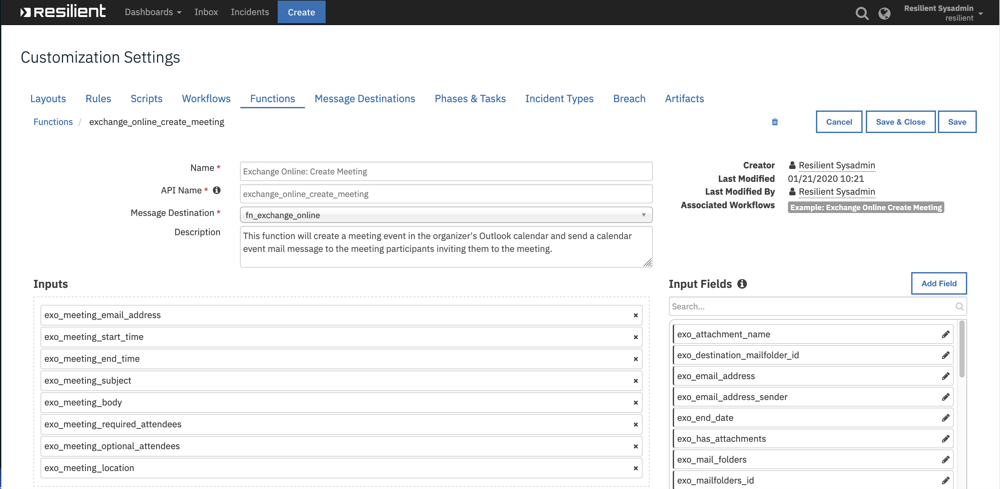

<details><summary>Inputs:</summary>
<p>

| Name | Type | Required | Example | Tooltip |
| ---- | :--: | :------: | ------- | ------- |
| `exo_meeting_body` | `text` | Yes | `meeting message body` | Meeting message body |
| `exo_meeting_email_address` | `text` | Yes | `user@example.com` | Email address of meeting coordinator |
| `exo_meeting_end_time` | `datetimepicker` | Yes | `-` | End date and time for meeting |
| `exo_meeting_location` | `text` | No | `-` | - |
| `exo_meeting_optional_attendees` | `text` | No | `user1@example.com, user2@example.com` | Comma separated list of optional attendee email addresses |
| `exo_meeting_required_attendees` | `text` | No | `user1@example.com, user2@example.com` | Comma separated list of required attendee email addresses |
| `exo_meeting_start_time` | `datetimepicker` | Yes | `-` | Meeting start date and time |
| `exo_meeting_subject` | `text` | Yes | `-` | Meeting Subect |

</p>
</details>

<details><summary>Outputs:</summary>
<p>

```python
results = {
    'inputs': {
          u'exo_meeting_end_time': 1581022800000, 
          u'exo_meeting_optional_attendees': None, 
          u'exo_meeting_subject': u'phishing meeting', 
          u'exo_meeting_body': u'<div class="rte"><div>We need to talk about this!</div></div>', u'exo_meeting_required_attendees': u'resilient3@securitypocdemos.onmicrosoft.com, resilient2@securitypocdemos.onmicrosoft.com', 
          u'exo_meeting_start_time': 1581004800000, 
          u'exo_meeting_email_address': u'resilient2@securitypocdemos.onmicrosoft.com', u'exo_meeting_location': None}, 
    'metrics': {'package': 'fn-exchange-online', 
          'timestamp': '2020-02-04 13:30:45', 
          'package_version': '1.0.0', 
          'host': 'MacBook-Pro.local', 
          'version': '1.0', 
          'execution_time_ms': 1728}, 
    'success': True, 
      'content': {u'body': {u'content': u'', u'contentType': u'html'}, u'sensitivity': u'normal', u'locations': [], .....}', 
    'reason': None, 
    'version': '1.0',
    'pretty_string': u'{\n    "body": {\n        "content": "",\n        "contentType": "html"\n    },\n    "sensitivity": "normal",\n    "locations": []"040000008200E00074C5B7101A82E0080000000096E4493689DBD501000000000000000010000000ADDA5C7497FB60469CE3850456D898C5",\n    "seriesMasterId": null,\n    "responseStatus": {\n        "response": "organizer",\n        "time": "0001-01-01T00:00:00Z"\n    },\n    "@odata.etag": "W/\\"SX/wDQMKnESReIRb/seOFAAAJWnN6Q==\\""\n}', 
    'content': {u'body': {u'content': u'', u'contentType': u'html'}, u'sensitivity': u'normal', u'locations': [],..... "}'
}
```

</p>
</details>

<details><summary>Workflows:</summary>
<p>

The Example: Exchange Online Create Meeting workflow calls the create meeting function and then write the results to an incident note.

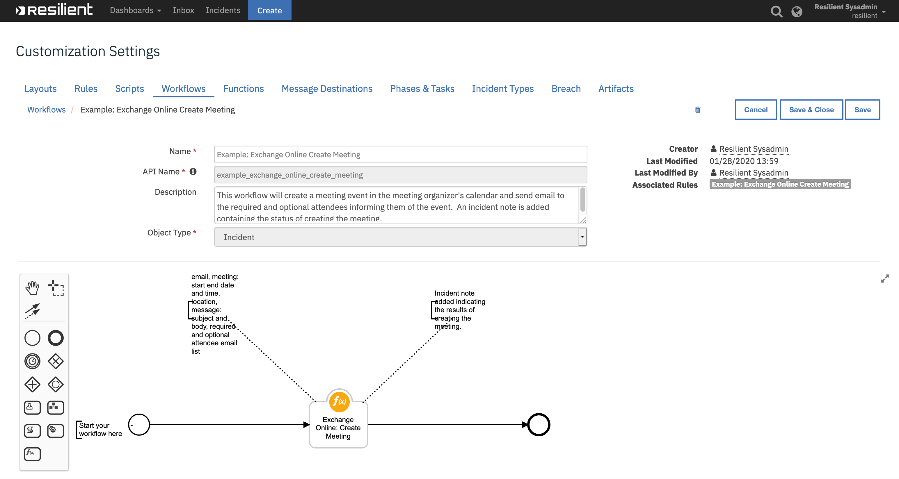

<details><summary>Example Pre-Process Script:</summary>
<p>

```python
inputs.exo_meeting_email_address = inputs.exo_meeting_email_address  if rule.properties.exo_meeting_email_address is None else rule.properties.exo_meeting_email_address
inputs.exo_meeting_start_time = inputs.exo_meeting_start_time if rule.properties.exo_meeting_start_time is None else rule.properties.exo_meeting_start_time
inputs.exo_meeting_end_time = inputs.exo_meeting_end_time if rule.properties.exo_meeting_end_time is None else rule.properties.exo_meeting_end_time
inputs.exo_meeting_subject = inputs.exo_meeting_subject if rule.properties.exo_meeting_subject is None else rule.properties.exo_meeting_subject
inputs.exo_meeting_body = inputs.exo_meeting_body if rule.properties.exo_meeting_body.content is None else rule.properties.exo_meeting_body.content
inputs.exo_meeting_required_attendees = inputs.exo_meeting_required_attendees if rule.properties.exo_meeting_required_attendees is None else rule.properties.exo_meeting_required_attendees
inputs.exo_meeting_optional_attendees = inputs.exo_meeting_optional_attendees if rule.properties.exo_meeting_optional_attendees is None else rule.properties.exo_meeting_optional_attendees
inputs.exo_meeting_location = inputs.exo_meeting_location if rule.properties.exo_meeting_location is None else rule.properties.exo_meeting_location
```

</p>
</details>

<details><summary>Example Post-Process Script:</summary>
<p>

```python
if results.success:
  noteText = u"Exchange Online created meeting\n   From: {0}\n{1}".format(results.inputs["exo_meeting_email_address"],results.pretty_string)
else:
  noteText = u"Exchange Online meeting was NOT created\n   From: {0}\n{1}".format(results.inputs["exo_meeting_email_address"], results.pretty_string)

incident.addNote(noteText)
```

</p>
</details>

<details><summary>Example Rule:</summary>
<p>
The following Example: Exchange Online Create Meeting incident menu item rule is included to create a meeting via Exchange Online:

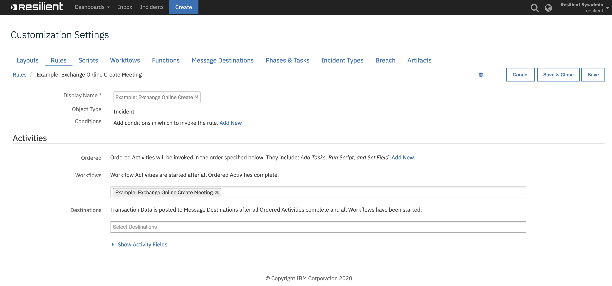


When the Example: Exchange Online Create Meeting rule is activated the following rule activity popup dialog will appear prompting for input for creating the meeting and sending a message to the invitees:


</p>
</details>

</p>
</details>

---
## Function - Exchange Online: Delete Message
Delete a message in the specified user's email address mailbox.  The email address of the mailbox and the message id are required input parameters.  The mail folder is an optional parameter.

 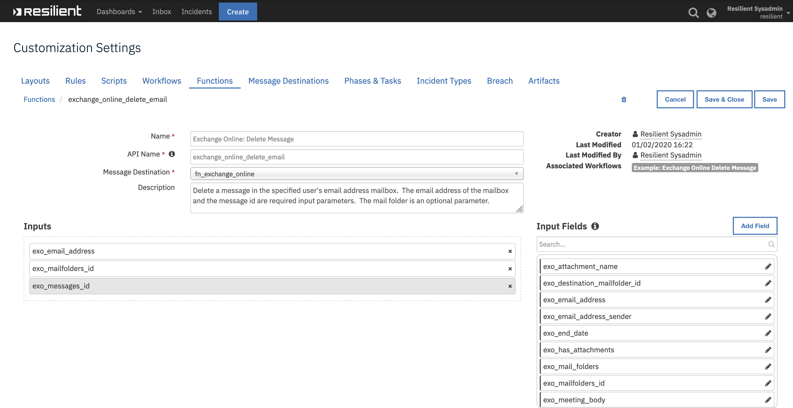

<details><summary>Inputs:</summary>
<p>

| Name | Type | Required | Example | Tooltip |
| ---- | :--: | :------: | ------- | ------- |
| `exo_email_address` | `text` | Yes | `user@example.com` | Get information on this user email account |
| `exo_mailfolders_id` | `text` | No | `inbox` | MailFolders id  |
| `exo_messages_id` | `text` | Yes | `-` | The message id of the message to be deleted |

</p>
</details>

<details><summary>Outputs:</summary>
<p>

```python
results = {
   'inputs': {u'exo_mailfolders_id': None, 
              u'exo_messages_id': u'AAMkAGFmNDE0ZDA1LTFmOGMtNGU2MS04Y2IwLTJhMmViNWU3Y2VhMABGAAAAAAD45IEka4IVS4DBeEtMPuSEBwBJf-ANAwqcRJF4hFv_x44UAAAinByvAABJf-ANAwqcRJF4hFv_x44UAAAinIROAAA=', u'exo_email_address': u'resilient2@securitypocdemos.onmicrosoft.com'},           
    'metrics': {'package': 'fn-exchange-online', 
                'timestamp': '2020-02-04 09:08:13', 
                'package_version': '1.0.0', 
                'host': 'MacBook-Pro.local', 
                'version': '1.0', 
                'execution_time_ms': 1300},
    'success': True,
    'content': {'value': True}, 
    'raw': '{"value": true}', 
    'reason': None, 
    'version': '1.0'
}
```

</p>
</details>

<details><summary>Workflows:</summary>
<p>
The example Delete Message workflow works off the Query Results data table.
After the message is deleted using the Example: Exchange Online Delete Message workflow, the "Status" column in the data table will be updated from Active to Deleted in red text.  At this point other data table rules that work on a message will not be active because the message is deleted.


<details><summary>Example Pre-Process Script:</summary>
<p>

```python
inputs.exo_email_address = row.exo_dt_email_address
inputs.exo_messages_id = row.exo_dt_message_id
inputs.exo_mailfolders_id = None
```

</p>
</details>

<details><summary>Example Post-Process Script:</summary>
<p>

```python
if results.success:
  # The message was deleted, so update "status" column in data table.
  text = u"""<p style= "color:{color}">{status} </p>""".format(color="red", status="Deleted")
  row['exo_dt_status'] = helper.createRichText(text)
elif results.content["error"] is not None: 
  # There is an "item not found" error mostly likely here
  row['exo_dt_status'] = helper.createRichText(results.content["error"]["code"])
```

</p>
</details>
<details><summary>Example Workflow Output:</summary>
<p>

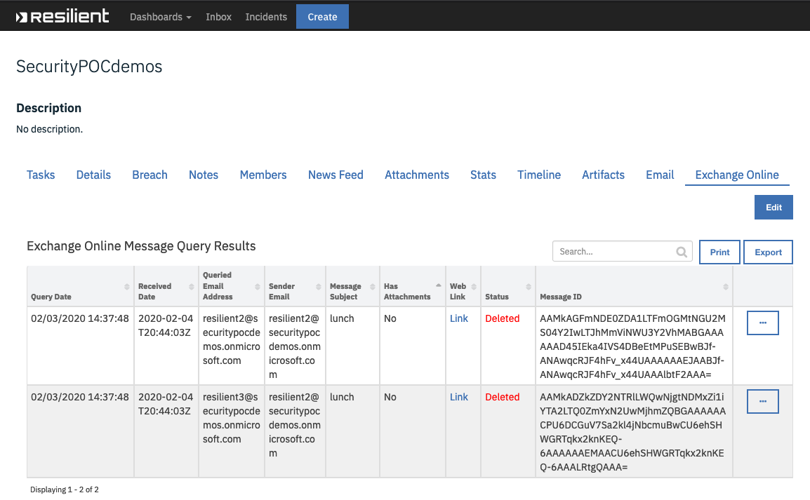

</p>
</details>

<details><summary>Example Rule:</summary>
<p>
The Example: Exchange Online Delete Message rule works off the Query Results data table.  The Delete Message rule is available when the "Status" column of the message row-entry is set to Active.

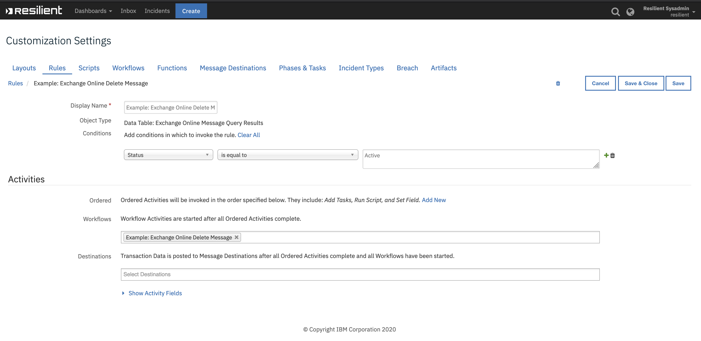

</p>
</details>

</p>
</details>

---
## Function - Exchange Online: Delete Messages From Query Results
This Exchange Online function will delete a list of messages returned from the Query Message function.  The input to the function is a string containing the JSON results from the Query Messages function.

 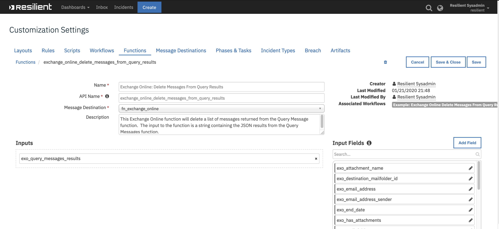


<details><summary>Inputs:</summary>
<p>

| Name | Type | Required | Example | Tooltip |
| ---- | :--: | :------: | ------- | ------- |
| `exo_query_messages_results` | `text` | Yes | `-` | String containing JSON data results from Query Messages function |

</p>
</details>

<details><summary>Outputs:</summary>
<p>

```python
results = {'inputs': {u'exo_query_messages_results': u'[{"status_code": 200, "email_address": "resilient3@securitypocdemos.onmicrosoft.com", "email_list": [{"sentDateTime": "2020-02-05T20:03:21Z", "conversationId": "AAQkADZkZDY2NTRlLWQwNjgtNDMxZi1iYTA2LTQ0ZmYxN2UwMjhmZQAQAExiSXKQgttDm_-WozAl5As=", "internetMessageId": "<MWHPR2201MB11357FA62DE5F7C1B1EBCF53B1020@MWHPR2201MB1135.namprd22.prod.outlook.com>", "id": "AAMkADZkZDY2NTRlLWQwNjgtNDMxZi1iYTA2LTQ0ZmYxN2UwMjhmZQBGAAAAAACPU6DCGuV7Sa2kl4jNbcmuBwCU6ehSHWGRTqkx2knKEQ-6AAAAAAEMAACU6ehSHWGRTqkx2knKEQ-6AAALRtgSAAA=", "isReadReceiptRequested": false, "subject": "lunch", "lastModifiedDateTime": "2020-02-05T20:05:13Z", "bodyPreview": "Do you want to meet for lunch?", "from": {"emailAddress": {"name": "Resilient User 2", "address": "resilient2@securitypocdemos.onmicrosoft.com"}}, "flag": {"flagStatus": "notFlagged"}, "isDraft": false, "replyTo": [], "changeKey": "CQAAABYAAACU6ehSHWGRTqkx2knKEQ/6AAALRVqT", "receivedDateTime": "2020-02-05T20:03:24Z", "parentFolderId": "AAMkADZkZDY2NTRlLWQwNjgtNDMxZi1iYTA2LTQ0ZmYxN2UwMjhmZQAuAAAAAACPU6DCGuV7Sa2kl4jNbcmuAQCU6ehSHWGRTqkx2knKEQ-6AAAAAAEMAAA=", "body": {"content": "<html>\\r\\n<head>\\r\\n<meta http-equiv=\\"Content-Type\\" content=\\"text/html; charset=utf-8\\">\\r\\n<meta content=\\"text/html; charset=iso-8859-1\\">\\r\\n<style type=\\"text/css\\" style=\\"display:none\\">\\r\\n<!--\\r\\np\\r\\n\\t{margin-top:0;\\r\\n\\tmargin-bottom:0}\\r\\n-->\\r\\n</style>\\r\\n</head>\\r\\n<body dir=\\"ltr\\">\\r\\n<div style=\\"font-family:Calibri,Arial,Helvetica,sans-serif; font-size:12pt; color:rgb(0,0,0)\\">\\r\\nDo you want to meet for lunch?<br>\\r\\n</div>\\r\\n</body>\\r\\n</html>\\r\\n", "contentType": "html"}, "isDeliveryReceiptRequested": false, "importance": "normal", "toRecipients": [{"emailAddress": {"name": "Resilient User 3", "address": "resilient3@securitypocdemos.onmicrosoft.com"}}], "ccRecipients": [], "isRead": false, "categories": [], "sender": {"emailAddress": {"name": "Resilient User 2", "address": "resilient2@securitypocdemos.onmicrosoft.com"}}, "createdDateTime": "2020-02-05T20:03:23Z", "webLink": "https://outlook.office365.com/owa/?ItemID=AAMkADZkZDY2NTRlLWQwNjgtNDMxZi1iYTA2LTQ0ZmYxN2UwMjhmZQBGAAAAAACPU6DCGuV7Sa2kl4jNbcmuBwCU6ehSHWGRTqkx2knKEQ%2F6AAAAAAEMAACU6ehSHWGRTqkx2knKEQ%2F6AAALRtgSAAA%3D&exvsurl=1&viewmodel=ReadMessageItem", "conversationIndex": "AQHV3F9QTGJJcpCC20Ob79ajMCXkCw==", "hasAttachments": false, "bccRecipients": [], "inferenceClassification": "focused", "@odata.etag": "W/\\"CQAAABYAAACU6ehSHWGRTqkx2knKEQ/6AAALRVqT\\""}]}]'}, 

'metrics': {'package': 'fn-exchange-online', 
            'timestamp': '2020-02-05 15:06:25', 
            'package_version': '1.0.0', 
            'host': 'MacBook-Pro.local', 
            'version': '1.0', 
            'execution_time_ms': 4869}, 
            
'success': True, 
'content': [{'not_deleted_list': [], 'deleted_list': [{u'sentDateTime': u'2020-02-05T20:03:21Z', u'webLink': u'https://outlook.office365.com/owa/?ItemID=AAMkADZkZDY2NTRlLWQwNjgtNDMxZi1iYTA2LTQ0ZmYxN2UwMjhmZQBGAAAAAACPU6DCGuV7Sa2kl4jNbcmuBwCU6ehSHWGRTqkx2knKEQ%2F6AAAAAAEMAACU6ehSHWGRTqkx2knKEQ%2F6AAALRtgSAAA%3D&exvsurl=1&viewmodel=ReadMessageItem', u'conversationId': u'AAQkADZkZDY2NTRlLWQwNjgtNDMxZi1iYTA2LTQ0ZmYxN2UwMjhmZQAQAExiSXKQgttDm_-WozAl5As=', u'internetMessageId': u'<MWHPR2201MB11357FA62DE5F7C1B1EBCF53B1020@MWHPR2201MB1135.namprd22.prod.outlook.com>', u'id': u'AAMkADZkZDY2NTRlLWQwNjgtNDMxZi1iYTA2LTQ0ZmYxN2UwMjhmZQBGAAAAAACPU6DCGuV7Sa2kl4jNbcmuBwCU6ehSHWGRTqkx2knKEQ-6AAAAAAEMAACU6ehSHWGRTqkx2knKEQ-6AAALRtgSAAA=', u'isReadReceiptRequested': False, u'subject': u'lunch', u'lastModifiedDateTime': u'2020-02-05T20:05:13Z', u'bodyPreview': u'Do you want to meet for lunch?', u'from': {u'emailAddress': {u'name': u'Resilient User 2', u'address': u'resilient2@securitypocdemos.onmicrosoft.com'}}, u'isDraft': False, u'importance': u'normal', u'changeKey': u'CQAAABYAAACU6ehSHWGRTqkx2knKEQ/6AAALRVqT', u'receivedDateTime': u'2020-02-05T20:03:24Z', u'parentFolderId': u'AAMkADZkZDY2NTRlLWQwNjgtNDMxZi1iYTA2LTQ0ZmYxN2UwMjhmZQAuAAAAAACPU6DCGuV7Sa2kl4jNbcmuAQCU6ehSHWGRTqkx2knKEQ-6AAAAAAEMAAA=', u'body': {u'content': u'<html>\r\n<head>\r\n<meta http-equiv="Content-Type" content="text/html; charset=utf-8">\r\n<meta content="text/html; charset=iso-8859-1">\r\n<style type="text/css" style="display:none">\r\n<!--\r\np\r\n\t{margin-top:0;\r\n\tmargin-bottom:0}\r\n-->\r\n</style>\r\n</head>\r\n<body dir="ltr">\r\n<div style="font-family:Calibri,Arial,Helvetica,sans-serif; font-size:12pt; color:rgb(0,0,0)">\r\nDo you want to meet for lunch?<br>\r\n</div>\r\n</body>\r\n</html>\r\n', u'contentType': u'html'}, u'isDeliveryReceiptRequested': False, u'replyTo': [], u'toRecipients': [{u'emailAddress': {u'name': u'Resilient User 3', u'address': u'resilient3@securitypocdemos.onmicrosoft.com'}}], u'ccRecipients': [], u'flag': {u'flagStatus': u'notFlagged'}, u'categories': [], u'sender': {u'emailAddress': {u'name': u'Resilient User 2', u'address': u'resilient2@securitypocdemos.onmicrosoft.com'}}, u'createdDateTime': u'2020-02-05T20:03:23Z', u'isRead': False, u'conversationIndex': u'AQHV3F9QTGJJcpCC20Ob79ajMCXkCw==', u'hasAttachments': False, u'bccRecipients': [], u'inferenceClassification': u'focused', u'@odata.etag': u'W/"CQAAABYAAACU6ehSHWGRTqkx2knKEQ/6AAALRVqT"'}], 'email_address': u'resilient3@securitypocdemos.onmicrosoft.com'}], 'raw': '[{"not_deleted_list": [], "deleted_list": [{"sentDateTime": "2020-02-05T20:03:21Z", "webLink": "https://outlook.office365.com/owa/?ItemID=AAMkADZkZDY2NTRlLWQwNjgtNDMxZi1iYTA2LTQ0ZmYxN2UwMjhmZQBGAAAAAACPU6DCGuV7Sa2kl4jNbcmuBwCU6ehSHWGRTqkx2knKEQ%2F6AAAAAAEMAACU6ehSHWGRTqkx2knKEQ%2F6AAALRtgSAAA%3D&exvsurl=1&viewmodel=ReadMessageItem", "conversationId": "AAQkADZkZDY2NTRlLWQwNjgtNDMxZi1iYTA2LTQ0ZmYxN2UwMjhmZQAQAExiSXKQgttDm_-WozAl5As=", "internetMessageId": "<MWHPR2201MB11357FA62DE5F7C1B1EBCF53B1020@MWHPR2201MB1135.namprd22.prod.outlook.com>", "id": "AAMkADZkZDY2NTRlLWQwNjgtNDMxZi1iYTA2LTQ0ZmYxN2UwMjhmZQBGAAAAAACPU6DCGuV7Sa2kl4jNbcmuBwCU6ehSHWGRTqkx2knKEQ-6AAAAAAEMAACU6ehSHWGRTqkx2knKEQ-6AAALRtgSAAA=", "isReadReceiptRequested": false, "subject": "lunch", "lastModifiedDateTime": "2020-02-05T20:05:13Z", "bodyPreview": "Do you want to meet for lunch?", "from": {"emailAddress": {"name": "Resilient User 2", "address": "resilient2@securitypocdemos.onmicrosoft.com"}}, "isDraft": false, "importance": "normal", "changeKey": "CQAAABYAAACU6ehSHWGRTqkx2knKEQ/6AAALRVqT", "receivedDateTime": "2020-02-05T20:03:24Z", "parentFolderId": "AAMkADZkZDY2NTRlLWQwNjgtNDMxZi1iYTA2LTQ0ZmYxN2UwMjhmZQAuAAAAAACPU6DCGuV7Sa2kl4jNbcmuAQCU6ehSHWGRTqkx2knKEQ-6AAAAAAEMAAA=", "body": {"content": "<html>\\r\\n<head>\\r\\n<meta http-equiv=\\"Content-Type\\" content=\\"text/html; charset=utf-8\\">\\r\\n<meta content=\\"text/html; charset=iso-8859-1\\">\\r\\n<style type=\\"text/css\\" style=\\"display:none\\">\\r\\n<!--\\r\\np\\r\\n\\t{margin-top:0;\\r\\n\\tmargin-bottom:0}\\r\\n-->\\r\\n</style>\\r\\n</head>\\r\\n<body dir=\\"ltr\\">\\r\\n<div style=\\"font-family:Calibri,Arial,Helvetica,sans-serif; font-size:12pt; color:rgb(0,0,0)\\">\\r\\nDo you want to meet for lunch?<br>\\r\\n</div>\\r\\n</body>\\r\\n</html>\\r\\n", "contentType": "html"}, "isDeliveryReceiptRequested": false, "replyTo": [], "toRecipients": [{"emailAddress": {"name": "Resilient User 3", "address": "resilient3@securitypocdemos.onmicrosoft.com"}}], "ccRecipients": [], "flag": {"flagStatus": "notFlagged"}, "categories": [], "sender": {"emailAddress": {"name": "Resilient USer 2", "address": "resilient2@securitypocdemos.onmicrosoft.com"}}, "createdDateTime": "2020-02-05T20:03:23Z", "isRead": false, "conversationIndex": "AQHV3F9QTGJJcpCC20Ob79ajMCXkCw==", "hasAttachments": false, "bccRecipients": [], "inferenceClassification": "focused", "@odata.etag": "W/\\"CQAAABYAAACU6ehSHWGRTqkx2knKEQ/6AAALRVqT\\""}], "email_address": "resilient3@securitypocdemos.onmicrosoft.com"}]', 

'reason': None, 
'version': '1.0'
}
```

</p>
</details>

<details><summary>Workflows:</summary>
<p>

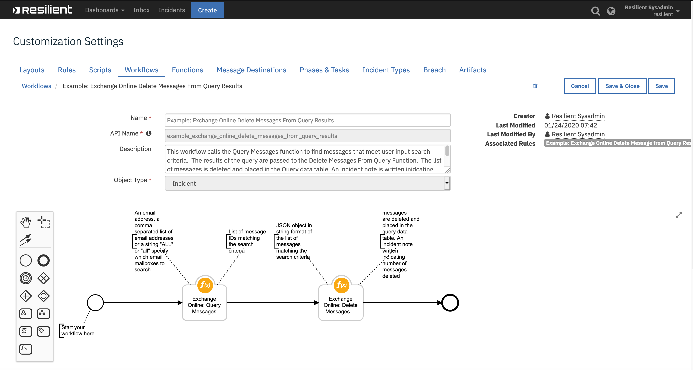


<details><summary>Example Pre-Process Script:</summary>
<p>

```python
inputs.exo_query_messages_results = workflow.properties.exo_query_results['raw']
```

</p>
</details>

<details><summary>Example Post-Process Script:</summary>
<p>

```python
from java.util import Date

deleted_count = 0
not_deleted_count = 0

# Add each email as a row in the query results data table
for user in results["content"]:
    
  not_deleted_count = not_deleted_count + len(user["not_deleted_list"])
  for email in user["deleted_list"]:
    deleted_count = deleted_count + 1
    message_row = incident.addRow("exo_message_query_results_dt")
    message_row.exo_dt_query_date = Date()
    message_row.exo_dt_message_id = email.id
    message_row.exo_dt_received_date   = email.receivedDateTime
    message_row.exo_dt_email_address = user["email_address"]
    if email.sender:
      message_row.exo_dt_sender_email = email.sender.emailAddress.address
    else:
      message_row.exo_dt_sender_email = ""
    message_row.exo_dt_message_subject = email.subject
    message_row.exo_dt_has_attachments = email.hasAttachments
    if email.webLink:
      ref_html = u"""<a href='{0}'>Link</a>""".format(email.webLink)
      message_row.exo_dt_web_link = helper.createRichText(ref_html)
    else:
      message_row.exo_dt_web_link = ""
 
    text = u"""<p style= "color:{color}">{status} </p>""".format(color="red", status="Deleted")
    message_row.exo_dt_status = helper.createRichText(text)


# Post a note containing the number of emails deleted
note = u"Exchange Online Delete Messages From Query Results:\n  {0} messages deleted".format(deleted_count)

# Add to the note if any messages from the query were not deleted.
if not_deleted_count > 0:
  note2 = u"  {0} messages NOT deleted".format(not_deleted_count)
  note = u"{0}\n{1}".format(note, note2)
incident.addNote(note)
```

</p>
</details>
<details><summary>Example Workflow Output:</summary>
<p>
The messages deleted will appear in the data table with red "Deleted" text in the Status column:


</p>
</details>

<details><summary>Example Rule:</summary>
<p>

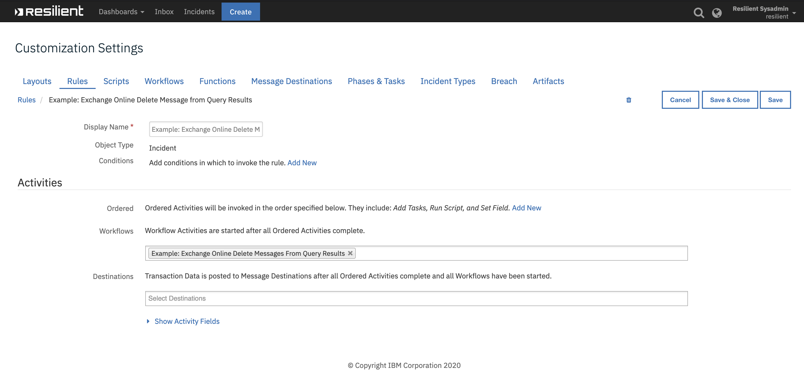

The Example: Exchange Online Delete Message From Query Results incident menu item rule will 
bring up the rule activity popup dialog pictured below to prompt for input querying message to be deleted.
See the Query function section for a description of querying.  

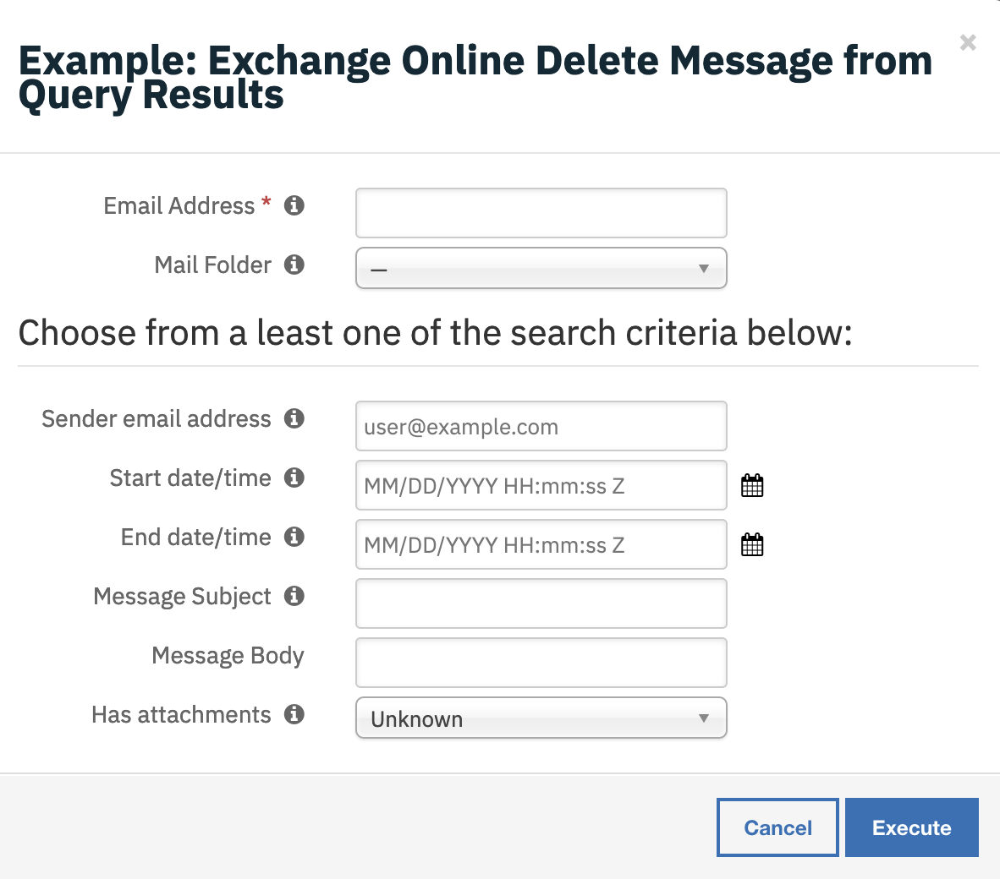

</p>
</details>

</p>
</details>

---
## Function - Exchange Online: Get Message
This function returns the contents of an Exchange Online message in json format.

 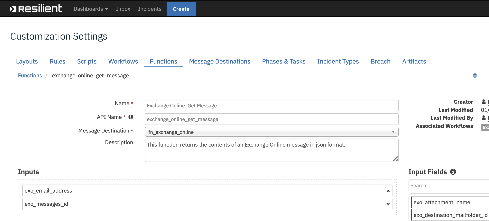

<details><summary>Inputs:</summary>
<p>

| Name | Type | Required | Example | Tooltip |
| ---- | :--: | :------: | ------- | ------- |
| `exo_email_address` | `text` | Yes | `user@example.com` | Get information on this user email account |
| `exo_messages_id` | `text` | Yes | `-` | The message id of the message to get|

</p>
</details>

<details><summary>Outputs:</summary>
<p>

```python
results = {'inputs': {u'exo_messages_id': u'AAMkAGFmNDE0ZDA1LTFmOGMtNGU2MS04Y2IwLTJhMmViNWU3Y2VhMABGAAAAAAD45IEka4IVS4DBeEtMPuSEBwBJf-ANAwqcRJF4hFv_x44UAAAinByvAABJf-ANAwqcRJF4hFv_x44UAAAinIROAAA=',
                      u'exo_email_address': u'resilient2@securitypocdemos.onmicrosoft.com'}, 
          'metrics': {'package': 'fn-exchange-online', 
                      'timestamp': '2020-02-03 15:39:31', 
                      'package_version': '1.0.0', 
                      'host': 'cambridge.ibm.com', 
                      'version': '1.0', '
                      'execution_time_ms': 654},
          'success': True, 
          'pretty_string': u'{\n    "@odata.context": "https://graph.microsoft.com/v1.0/$metadata#users(\'resilient2%40securitypocdemos.onmicrosoft.com\')/messages/$entity",\n    "@odata.etag": "W/\\"CQAAABYAAABJf/ANAwqcRJF4hFv+x44UAAAil53/\\"",\n    "bccRecipients": [],\n    "body": {\n        "content": "<html>\\r\\n<head>\\r\\n<meta http-equiv=\\"Content-Type\\" content=\\"text/html; charset=utf-8\\">\\r\\n<meta content=\\"text/html; charset=us-ascii\\">\\r\\n</head>\\r\\n<body>\\r\\n<div class=\\"rte\\">\\r\\n<div>test text area body</div>\\r\\n</div>\\r\\n</body>\\r\\n</html>\\r\\n",\n        "contentType": "html"\n    },\n    "bodyPreview": "test text area body",\n    "categories": [],\n    "ccRecipients": [],}......', 
          'content': {u'sentDateTime': u'2020-01-29T16:17:23Z', 
                      u'conversationId':u'AAQkAGFmNDE0ZDA1LTFmOGMtNGU2MS04Y2IwLTJhMmViNWU3Y2VhMAAQAGjzfC_8ndROs7O00o-q8ys=', 
                      u'isDraft': False, 
                      u'internetMessageId': u'<MMMMprod.outlook.com>', 
                      u'id': u'AAMkAGFmNDE0ZDA1LTFmOGMtNGU2MS04Y2IwLTJhMmViNWU3Y2VhMABGAAAAAAD45IEka4IVS4DBeEtMPuSEBwBJf-ANAwqcRJF4hFv_x44UAAAinByvAABJf-ANAwqcRJF4hFv_x44UAAAinIROAAA=', 
                      u'isReadReceiptRequested': False, 
                      u'subject': u'test text area body', 
                      u'lastModifiedDateTime': u'2020-02-03T16:46:41Z', 
                      u'bodyPreview': u'test text area body', 
                      u'from': {u'emailAddress': {u'name': u'Resilient User 3', u'address': u'resilient2@securitypocdemos.onmicrosoft.com'}}, 
                      u'flag': {u'flagStatus': u'notFlagged'}, 
                      .
                      .
                      .
                      },
              'reason': None, 
              'version': '1.0'}
```

</p>
</details>

<details><summary>Workflows:</summary>
<p>
The workflow Write Message JSON as Note calls the Get Message function and writes the JSON contents returned from MS Graph API to an incident note.  The JSON returned from MS Graph API contains information that is different from the .eml file, so both formats are provided in this package (see Write Message EML as Attachment).

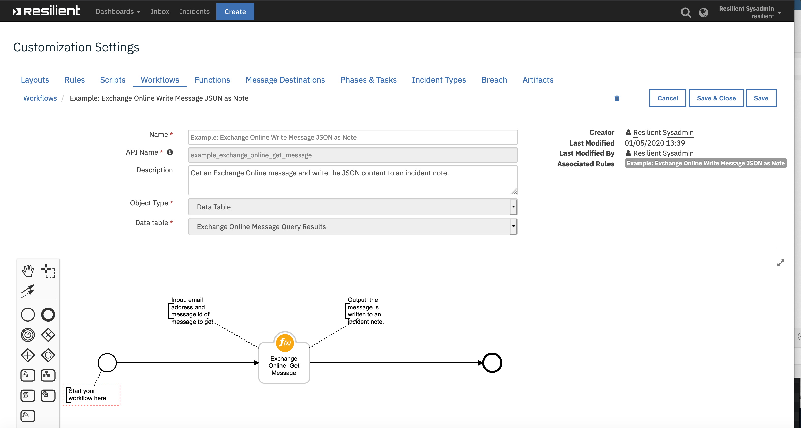


<details><summary>Example Pre-Process Script:</summary>
<p>

```python
inputs.exo_email_address = row.exo_dt_email_address
inputs.exo_messages_id = row.exo_dt_message_id
```

</p>
</details>

<details><summary>Example Post-Process Script:</summary>
<p>

```python
# Print the message to an incident note if it is found, otherwise update the status as Not Found in the datatable.
if results.content["error"] is not None:
  noteText = u"Exchange Online message NOT FOUND: \n email address: {0}\n message ID: {1}\n{2}".format(results.inputs["exo_email_address"], results.inputs["exo_messages_id"], results.pretty_string)
  row.exo_dt_status = "Not Found"
else:
  noteText = u"Exchange Online email address: {0} message:\n{1}".format(results.inputs["exo_email_address"], results.pretty_string)

incident.addNote(noteText)
```

</p>
</details>

<details><summary>Example Rule:</summary>
<p>

  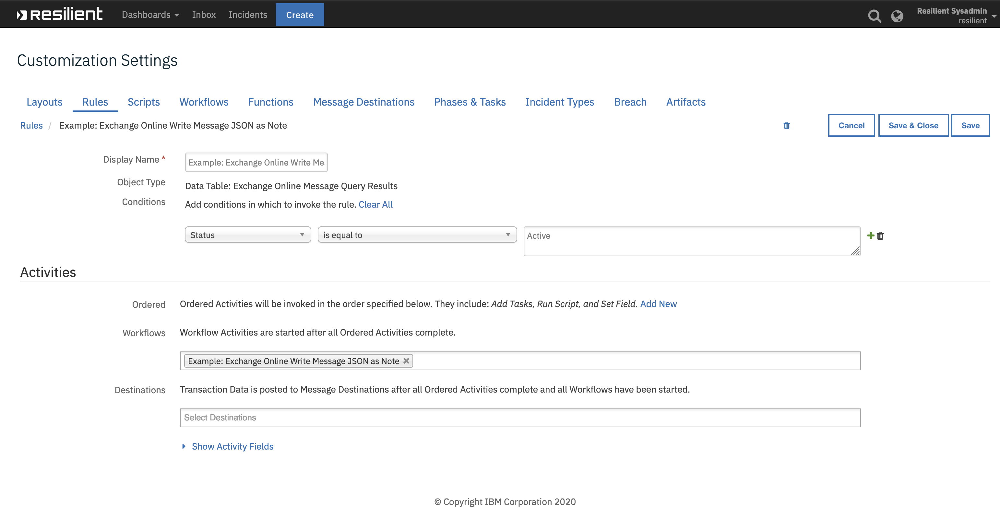

</p>
</details>

</p>
</details>

---
## Function - Exchange Online: Get User Profile
The Get User Profile function will return Exchange Online user profile for a given email address.

 

<details><summary>Inputs:</summary>
<p>

| Name | Type | Required | Example | Tooltip |
| ---- | :--: | :------: | ------- | ------- |
| `exo_email_address` | `text` | Yes | `user@example.com` | Get information on this user email account |

</p>
</details>

<details><summary>Outputs:</summary>
<p>

```python
results = {
    'inputs': {u'exo_email_address': u'resilient2@securitypocdemos.onmicrosoft.com'}, 
    'metrics': {'package': 'fn-exchange-online', 
                'timestamp': '2020-01-31 11:14:42', 
                'package_version': '1.0.0', 
                'host': 'MacBook-Pro.local', 
                'version': '1.0', 
                'execution_time_ms': 599}, 
    'success': True, 
    'pretty_string': u'{\n    "@odata.context": "https://graph.microsoft.com/v1.0/$metadata#users/$entity",\n    "businessPhones": [],\n    "displayName": "Resilient User 2",\n    "givenName": "Resilient User 2",\n    "id": "393c1ebb-8222-4ba1-8665-f54eaf7f024f",\n    "jobTitle": null,\n    "mail": "resilient2@securitypocdemos.onmicrosoft.com",\n    "mobilePhone": null,\n    "officeLocation": null,\n    "preferredLanguage": "en-US",\n    "surname": "Resilient User 2",\n    "userPrincipalName": "resilient2@securitypocdemos.onmicrosoft.com"\n}', 
    'content': {
        u'displayName': u'Resilient User 2', 
        u'mobilePhone': None, 
        u'preferredLanguage': u'en-US', 
        u'jobTitle': None, 
        u'userPrincipalName': u'resilient2@securitypocdemos.onmicrosoft.com', 
        u'@odata.context': u'https://graph.microsoft.com/v1.0/$metadata#users/$entity', 
        u'officeLocation': None, 
        u'businessPhones': [], 
        u'mail': u'resilient2@securitypocdemos.onmicrosoft.com', 
        u'surname': u'Resilient User 2', 
        u'givenName': u'Resilient User 2', 
        u'id': u'393c1ebb-8222-4ba1-8665-f54eaf7f024f'},
    'raw': '{"displayName": "Resilient User 2", "mobilePhone": null, "preferredLanguage": "en-US", "jobTitle": null, "userPrincipalName": "resilient2@securitypocdemos.onmicrosoft.com", "@odata.context": "https://graph.microsoft.com/v1.0/$metadata#users/$entity", "officeLocation": null, "businessPhones": [], "mail": "resilient2@securitypocdemos.onmicrosoft.com", "surname": "Resilient User 2", "givenName": "Resilient User 2", "id": "393c1ebb-8222-4ba1-8665-f54eaf7f024f"}', 
    'reason': None, 
    'version': '1.0'
}
```

</p>
</details>
<details><summary>Workflows:</summary>
<p>
The example Get User Profile workflow works off an artifact whose value contains the email address of the user whose profile is to be queried.  The user profile is returned in JSON format as an incident note.


<details><summary>Example Pre-Process Script:</summary>
<p>

```python
inputs.exo_email_address = artifact.value
```

</p>
</details>

<details><summary>Example Post-Process Script:</summary>
<p>

```python
if results.content["error"] is not None:
  noteText = u"Exchange Online user profile NOT FOUND: {0}\n{1}".format(results.inputs["exo_email_address"], results.pretty_string)
else:
  noteText = u"Exchange Online user profile: {0}\n{1}".format(results.inputs["exo_email_address"], results.pretty_string)

incident.addNote(noteText)
```

</p>
</details>

<details><summary>Example Workflow Output:</summary>
<p>
The Get User Profile workflow writes the user profile in JSON format to an incident note.  Sample output of the note is pictured below:


</p>
</details>

<details><summary>Example Rule:</summary>
<p>
The example Get User Profile rule will invoke the Get User Profile workflow if the artifact type is one of the following:

* Email Recipient
* Email Sender
* Email Sender Name
* User Account


</p>
</details>


</p>
</details>

---

## Function - Exchange Online: Move Message to Folder
This function will move an Exchange Online message to the specified folder in the users mailbox.

 

<details><summary>Inputs:</summary>
<p>

| Name | Type | Required | Example | Tooltip |
| ---- | :--: | :------: | ------- | ------- |
| `exo_email_address` | `text` | Yes | `user@example.com` | Get information on this user email account |
| `exo_mailfolders_id` | `text` | No | `-` | MailFolders id  |
| `exo_messages_id` | `text` | Yes | `-` | The message id of the message to be deleted |
| `exo_destination_mailfolder_id` | `select` | Yes | `recoverableitemsdeletions` | Destination folder to which message is moved. |
</p>
</details>

<details><summary>Outputs:</summary>
<p>

```python
Result: {
  'inputs': {u'exo_destination_mailfolder_id': {u'id': 126, 
                                               u'name': u'recoverableitemsdeletions'}, 
             u'exo_mailfolders_id': None, 
             u'exo_messages_id':u'AAMkAGFmNDE0ZDA1LTFmOGMtNGU2MS04Y2IwLTJhMmViNWU3Y2VhMABGAAAAAAD45IEka4IVS4DBeEtMPuSEBwBJf-ANAwqcRJF4hFv_x44UAAAAAAEMAABJf-ANAwqcRJF4hFv_x44UAAAXaS2qAAA=', u'exo_email_address': u'resilient2@securitypocdemos.onmicrosoft.com'}, 
  'metrics': {'package': 'fn-exchange-online', 
              'timestamp': '2020-01-31 13:23:41', 
              'package_version': '1.0.0', 
              'host': 'MacBook-Pro.local', 
              'version': '1.0', 
              'execution_time_ms': 1706}, 
  'success': True, 
  'content': {'value': True}, 
  'raw': '{"value": true}', 
  'reason': None, 
  'version': '1.0'}
```
</p>
</details>

<details><summary>Workflows:</summary>
<p>
The example Move Message to Folder workflow works off the Exchange Online Message Query Results data table. Messages can be moved to a "Well known Outlook folder:

* archive
* clutter
* conflicts
* conversationhistory
* deleteditems
* drafts
* inbox
* junkemail
* localfailures
* msgfolderroot
* outbox
* recoverableitemsdeletions
* scheduled
* searchfolders
* sentitems


<details><summary>Example Workflow Output:</summary>
<p>
The Move Message to Folder workflow will call MS Graph API to move message in the data table row to the specified Well-known Outlook folder specified in the exo_destination_mailfolder_id input parameter.
When a message is moved it's message ID is changed and as a result the status field column of the Exchange Online Message Query Results data table row entry will be updated to "Moved" in Red.   As the row status will no longer be "Active", the possible rules to be run on the data table row will be change because the message ID in the table is no longer valid.

Below is a screen shot of an example Note after a message is moved to a folder:


</p>

</details>

<details><summary>Example Pre-Process Script:</summary>
<p>

```python
inputs.exo_email_address = row.exo_dt_email_address
inputs.exo_mailfolders_id = None
inputs.exo_messages_id = row.exo_dt_message_id
inputs.exo_destination_mailfolder_id = rule.properties.exo_destination_mailfolder_id
```

</p>
</details>

<details><summary>Example Post-Process Script:</summary>
<p>

```python
if results.content["error"] is not None:
  # Print the message to an incident note if it is found, otherwise update the status as Not Found in the datatable.
  noteText = u"Exchange Online message NOT FOUND: \n email address: {0}\n message ID: {1}".format(results.inputs["exo_email_address"], results.inputs["exo_messages_id"])
  status_text = u"""<p style= "color:{color}">{status} </p>""".format(color="red", status="Not Found")
  row['exo_dt_status'] = helper.createRichText(status_text)
else:
  # When a message is moved it's ID changes, so update the new message ID into the data table
  noteText = u"Exchange Online email address: {0}\n\n  Message has been moved to folder: {1}\n\n  Old message ID: {2} \n\n  New message ID: {3}".format(results.inputs["exo_email_address"], results.inputs["exo_destination_mailfolder_id"]["name"], results.inputs["exo_messages_id"], results.content["new_message_id"])
  row['exo_dt_message_id'] = results.content["new_message_id"] 
incident.addNote(noteText)
```

<details><summary>Example Workflow Output:</summary>
<p>


</p>
</details>

</p>
</details>
<details><summary>Example Rule:</summary>
<p>
The example Move Message to Folder rule works off the Exchange Online Message Query Results data table.  When the status column of the row is Active the Move Message To Folder rule is available to initiate the corresponding workflow. The status column may be non-Active if the message is Moved, Deleted or Not Found, in which case the message cannot be moved.


</p>
</details>

</p>
</details>

---

## Function - Exchange Online: Query Messages
The Exchange Online: Query Message function will query Exchange Online to find messages matching the specified input parameters.  A list of messages matching the search criteria is returned from the function.  
<p>
The function will search over the following email accounts:

* all mailboxes of a tenant (specify "all", "ALL", "all users")
* a single email address
* a comma separated list of email addressed
<p>
If no mail folder if specified, all folders and subdirectories are queried.
The mail folder to be searched can be one of the list of Outlook "Well-known" folders:

* archive
* clutter
* conflicts
* conversationhistory
* deleteditems
* drafts
* inbox
* junkemail
* localfailures
* msgfolderroot
* outbox
* recoverableitemsdeletions
* scheduled
* searchfolders
* sentitems
<p>
At least one of the following search criteria must be passed to the query messages function

* Sender email address
* Message received date/time start/end 
* Message subject "contains" text
* Message body "contains" text
* Boolean flag indicating whether the message has an attachment

<p>
NOTE: the results of the Query Message function can be large.  Use the max_user and max_messages parameters in the app.config file to limit the number of users searched and the number of messages returned from a query.

 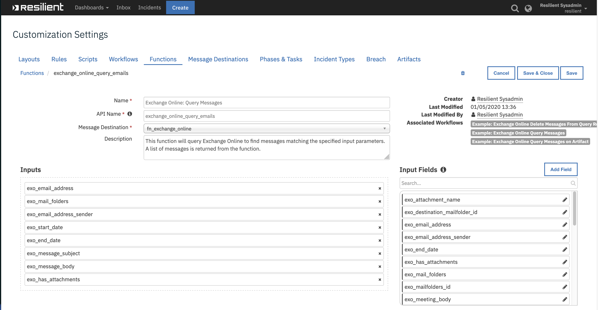

<details><summary>Inputs:</summary>
<p>

| Name | Type | Required | Example | Tooltip |
| ---- | :--: | :------: | ------- | ------- |
| `exo_email_address` | `text` | Yes | `user@example.com` | Get information on this user email account |
| `exo_email_address_sender` | `text` | No | `user@example.com` | Only get emails sent from this email address; leave blank to ignore sender attribute |
| `exo_end_date` | `datetimepicker` | No | `-` | Query message received ending at this date/time. |
| `exo_has_attachments` | `boolean` | No | `-` | True to include attachments, False to exclude attachments, Unknown to get all |
| `exo_mail_folders` | `text` | No | `Inbox` | The folder to search in the users mailbox |
| `exo_message_body` | `text` | No | `message body text` | message body |
| `exo_message_subject` | `text` | No | `message subject` | message subject |
| `exo_start_date` | `datetimepicker` | No | `-` | Query emails received starting at this date/time. |

</p>
</details>

<details><summary>Outputs:</summary>
<p>

```python
results = {
   'inputs': {u'exo_start_date': None,
              u'exo_email_address_sender': None, 
              u'exo_end_date': None, 
              u'exo_message_subject': u'lunch', 
              u'exo_has_attachments': None, 
              u'exo_email_address': u'all', 
              u'exo_mail_folders': None, 
              u'exo_message_body': None},
    'metrics': {'package': 'fn-exchange-online', 
              'timestamp': '2020-02-04 15:36:12', 
              'package_version': '1.0.0', 
              'host': 'MacBook-Pro.local', 
              'version': '1.0', 
              'execution_time_ms': 9492}, 
    'success': True, 
    'content': [{'status_code': 200, 
                'email_address': u'resilient2@securitypocdemos.onmicrosoft.com', 
                'email_list': [{u'sentDateTime': u'2020-02-04T20:44:02Z', 
                u'conversationId': u'AAQkAGFmNDE0ZDA1LTFmOGMtNGU2MS04Y2IwLTJhMmViNWU3Y2VhMAAQANIxI-VmHPNIslAVFC4yWrI=', 
                u'internetMessageId': u'<MWHPR2201MB11359DA0C07AF09AB319DD9FB1030@MWHPR2201MB1135.namprd22.prod.outlook.com>', 
                u'id': u'AAMkAGFmNDE0ZDA1LTFmOGMtNGU2MS04Y2IwLTJhMmViNWU3Y2VhMABGAAAAAAD45IEka4IVS4DBeEtMPuSEBwBJf-ANAwqcRJF4hFv_x44UAAAAAAEJAABJf-ANAwqcRJF4hFv_x44UAAAlbtF2AAA=', u'isReadReceiptRequested': False, 
                u'subject': u'lunch', 
                u'lastModifiedDateTime': u'2020-02-04T20:44:04Z', 
                u'bodyPreview': u"Let's have lunch at 12!", 
                u'from': {u'emailAddress': {u'name': u'Resilient User 2', 
                          u'address': u'resilient2@securitypocdemos.onmicrosoft.com'}}, 
                u'flag': {u'flagStatus': u'notFlagged'}, 
                u'isDraft': False, 
                u'replyTo': [], 
                u'changeKey': u'CQAAABYAAABJf/ANAwqcRJF4hFv+x44UAAAlac/G', u'receivedDateTime': u'2020-02-04T20:44:03Z', 
                u'parentFolderId': u'AQMkAGFmNDE0ZDA1LTFmOGMtNGU2MS04Y2IwLTJhMmViNWU3Y2VhMAAuAAAD_OSBJGuCFUuAwXhLTD7khAEASX-wDQMKnESReIRb-seOFAAAAgEJAAAA', 
                u'body': {u'content': u'<html>\r\n<head>\r\n<meta http-equiv="Content-Type" content="text/html; charset=utf-8">\r\n<meta content="text/html; charset=iso-8859-1">\r\n<style type="text/css" style="display:none">\r\n<!--\r\np\r\n\t{margin-top:0;\r\n\tmargin-bottom:0}\r\n-->\r\n</style>\r\n</head>\r\n<body dir="ltr">\r\n<div style="font-family:Calibri,Arial,Helvetica,sans-serif; font-size:12pt; color:rgb(0,0,0)">\r\nLet\'s have lunch at 12!<br>\r\n</div>\r\n</body>\r\n</html>\r\n', u'contentType': u'html'}, 
                u'isDeliveryReceiptRequested': False, 
                u'importance': u'normal', 
                u'toRecipients': [{u'emailAddress': {u'name': u'Resilient User 3', 
                                  u'address': u'resilient3@securitypocdemos.onmicrosoft.com'}}], 
                u'ccRecipients': [], 
                u'isRead': True, 
                u'categories': [], 
                u'sender': {u'emailAddress': {u'name': u'Resilient User 2', 
                            u'address': u'resilient2@securitypocdemos.onmicrosoft.com'}}, 
                u'createdDateTime': u'2020-02-04T20:44:02Z', 
                u'webLink': u'https://outlook.office365.com/owa/?ItemID=AAMkAGFmNDE0ZDA1LTFmOGMtNGU2MS04Y2IwLTJhMmViNWU3Y2VhMABGAAAAAAD45IEka4IVS4DBeEtMPuSEBwBJf%2FANAwqcRJF4hFv%2Bx44UAAAAAAEJAABJf%2FANAwqcRJF4hFv%2Bx44UAAAlbtF2AAA%3D&exvsurl=1&viewmodel=ReadMessageItem', 
                u'conversationIndex': u'AQHV25vV0jEj9WYc80iyUBUULjJasg==', 
                u'hasAttachments': False, 
                u'bccRecipients': [], 
                u'inferenceClassification': u'focused', 
                u'@odata.etag': u'W/"CQAAABYAAABJf/ANAwqcRJF4hFv+x44UAAAlac/G"'}]}], 
      'reason': None, 
      'version': '1.0'
}
```

</p>
</details>

<details><summary>Workflows:</summary>
<p>
The Example: Exchange Online Query Messages workflow will place results into the Exchange Online Query Results data table which appears on the Exchange Online custom incident tab. 
(See the Install Guide to setup the custom tab.)

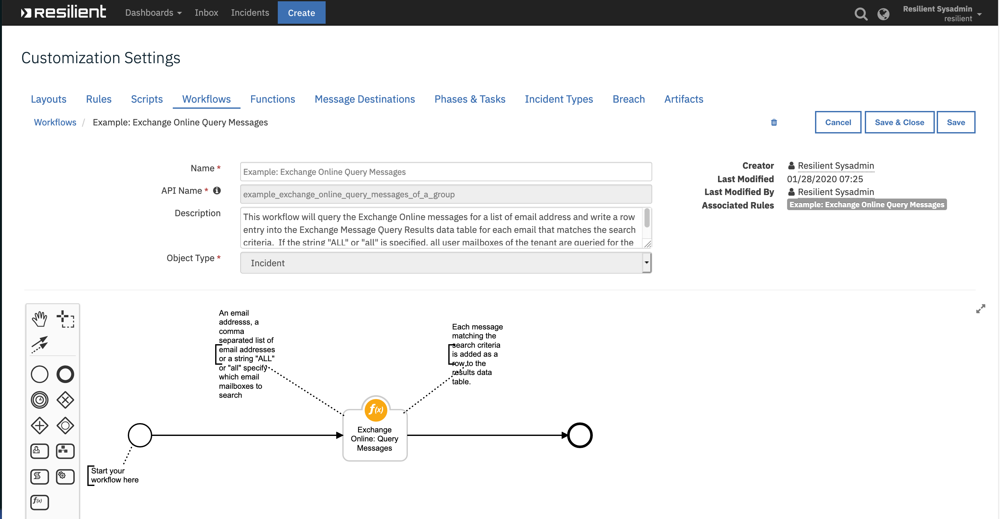

<details><summary>Example Pre-Process Script:</summary>
<p>

```python
# Get the email address of the user whose mailbox will be queried.
inputs.exo_email_address = inputs.exo_email_address if rule.properties.exo_email_address_list is None else rule.properties.exo_email_address_list

# Get the search criteria from the activity rules if available. 
inputs.exo_mail_folders         = inputs.exo_mail_folders         if rule.properties.exo_mailfolder_id        is None else rule.properties.exo_mailfolder_id
inputs.exo_email_address_sender = inputs.exo_email_address_sender if rule.properties.exo_email_address_sender is None else rule.properties.exo_email_address_sender
inputs.exo_message_subject      = inputs.exo_message_subject      if rule.properties.exo_message_subject      is None else rule.properties.exo_message_subject
inputs.exo_message_body         = inputs.exo_message_body         if rule.properties.exo_message_body         is None else rule.properties.exo_message_body
inputs.exo_start_date           = inputs.exo_start_date           if rule.properties.exo_start_date           is None else rule.properties.exo_start_date
inputs.exo_end_date             = inputs.exo_end_date             if rule.properties.exo_end_date             is None else rule.properties.exo_end_date
inputs.exo_has_attachments      = inputs.exo_has_attachments      if rule.properties.exo_has_attachments      is None else rule.properties.exo_has_attachments
```

</p>
</details>

<details><summary>Example Post-Process Script:</summary>
<p>

```python
from java.util import Date

note = u"Exchange Online Query Multiple users:\n"
note_len = len(note)

# Add each email as a row in the query results data table
for user in results["content"]:
  # If an email address is not found post to a note.
  if user["status_code"] == 404:
    line = u"email address not found: {}\n".format(user["email_address"])
    note = note + line
    
  for email in user["email_list"]:
    message_row = incident.addRow("exo_message_query_results_dt")
    message_row.exo_dt_query_date = Date()
    message_row.exo_dt_message_id = email.id
    message_row.exo_dt_received_date   = email.receivedDateTime
    message_row.exo_dt_email_address = user["email_address"]
    if email.sender:
      message_row.exo_dt_sender_email = email.sender.emailAddress.address
    else:
      message_row.exo_dt_sender_email = ""
    message_row.exo_dt_message_subject = email.subject
    message_row.exo_dt_has_attachments = email.hasAttachments
    if email.webLink:
      ref_html = u"""<a href='{0}'>Link</a>""".format(email.webLink)
      message_row.exo_dt_web_link = helper.createRichText(ref_html)
    else:
      message_row.exo_dt_web_link = ""
 
    message_row.exo_dt_status = helper.createRichText("Active")

# If any email addresses where not found post a note
if len(note) > note_len:
  incident.addNote(note)
```

</p>
</details>


<details><summary>Example Rule:</summary>
<p>

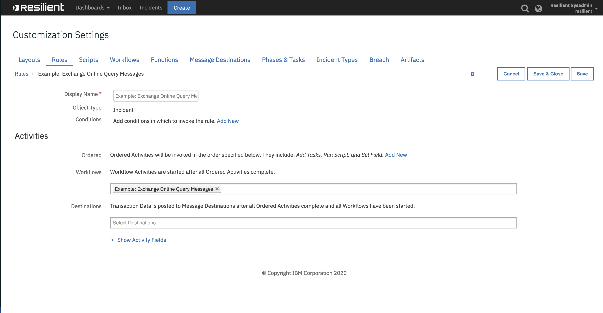

When the Example: Exchange Online Delete Messages from Query Results rule is activated the following rule activity popup dialog will appear prompting for input for creating the meeting and sending a message to the invitees:

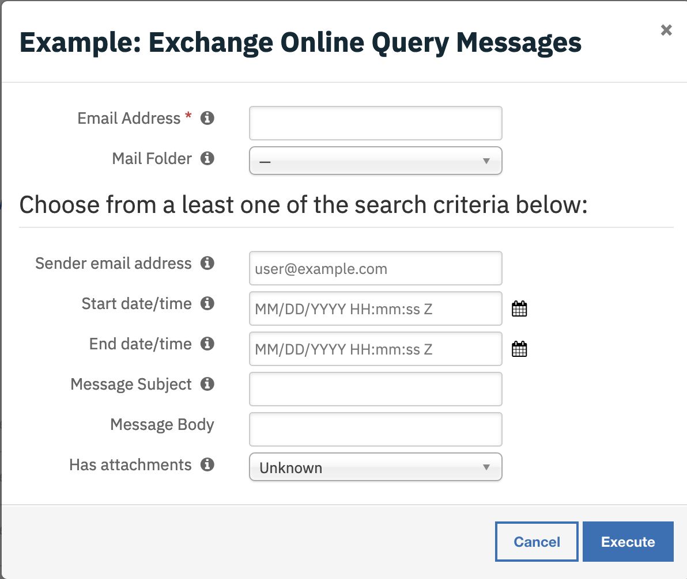

</p>
</details>

</p>
</details>

---
## Function - Exchange Online: Send Message
This function will create a message and send to the specified recipients.

 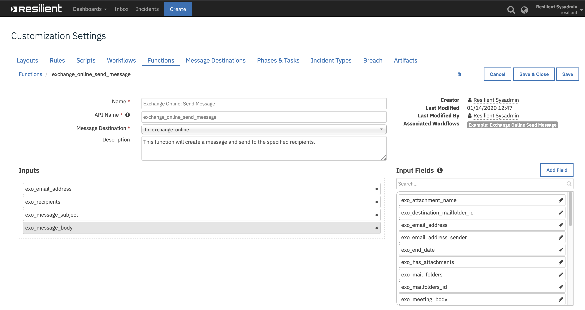

<details><summary>Inputs:</summary>
<p>

| Name | Type | Required | Example | Tooltip |
| ---- | :--: | :------: | ------- | ------- |
| `exo_email_address` | `text` | Yes | `user@example.com` | Get information on this user email account |
| `exo_message_body` | `text` | No | `message body text` | message body |
| `exo_message_subject` | `text` | No | `message subject` | message subject |
| `exo_recipients` | `text` | Yes | `-` | comma separated list of message recipients |

</p>
</details>

<details><summary>Outputs:</summary>
<p>

```python
results = {
    'inputs': {u'exo_recipients': u'resilient2@securitypocdemos.onmicrosoft.com,        resilient3@securitypocdemos.onmicrosoft.com', 
              u'exo_message_subject': u'Please investigate', 
              u'exo_message_body': u'<div class="rte"><div>Can you look into this?</div><div><br /></div><div>Thanks!</div></div>', 
              u'exo_email_address': u'resilient2@securitypocdemos.onmicrosoft.com'}, 
              
    'metrics': {'package': 'fn-exchange-online', 
                'timestamp': '2020-02-04 11:18:16', 
                'package_version': '1.0.0', 
                'host': 'MacBook-Pro.local', 
                'version': '1.0', 
                'execution_time_ms': 796}, 
    'success': True, 
    'content': {'value': True}, 
    'raw': '{"value": true}', 
    'reason': None, 
    'version': '1.0'}
```

</p>
</details>

<details><summary>Workflows:</summary>
<p>
The Example: Exchange Online Send Message workflow will call the Exchange Online Send Message function and write an incident note containing the results of the function.

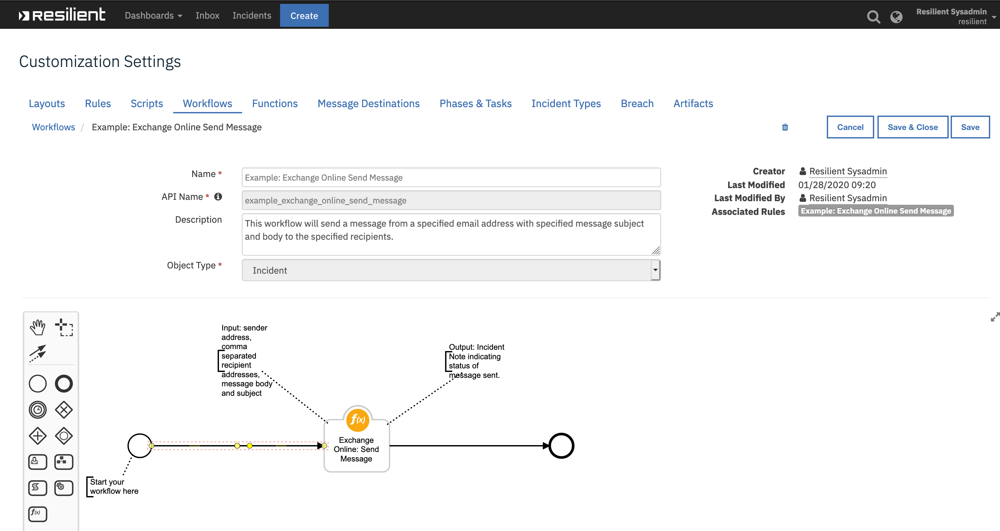

<details><summary>Example Pre-Process Script:</summary>
<p>

```python
inputs.exo_email_address   = inputs.exo_email_address   if rule.properties.exo_message_sender_address is None else rule.properties.exo_message_sender_address
inputs.exo_recipients      = inputs.exo_recipients      if rule.properties.exo_message_recipients     is None else rule.properties.exo_message_recipients
inputs.exo_message_subject = inputs.exo_message_subject if rule.properties.exo_message_subject is None else rule.properties.exo_message_subject
inputs.exo_message_body    = inputs.exo_message_send_body.content if rule.properties.exo_message_send_body.content is None else rule.properties.exo_message_send_body.content
```

</p>
</details>

<details><summary>Example Post-Process Script:</summary>
<p>

```python
if results.success:
  noteText = u"Exchange Online message sent\n   From: {0}\n   To: {1}\n   Subject: {2}\n   Body: {3}".format(results.inputs["exo_email_address"], results.inputs["exo_recipients"], results.inputs["exo_message_subject"], results.inputs["exo_message_body"])
else:
  noteText = u"Exchange Online message NOT sent\n   From: {0}\n  To: {1}".format(results.inputs["exo_email_address"], results.inputs["exo_recipients"])

incident.addNote(noteText)
```

</p>
</details>
<details><summary>Example Workflow Output:</summary>
<p>
The following is a sample incident note that is created from Example: Exchange Online Send Message workflow:

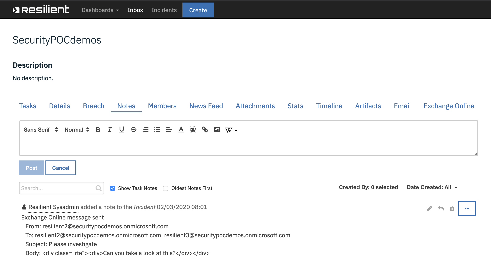

</p>
</details>

<details><summary>Example Rule:</summary>
<p>
The following Example: Exchange Online Send Message incident menu item rule is included to send a message via Exchange Online:

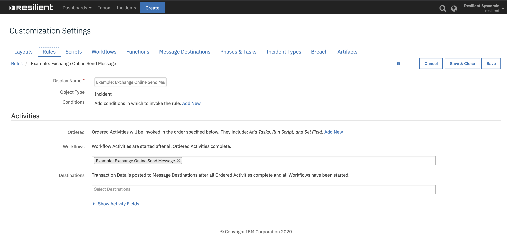

<p>

When the Example Send Message rule is initiated the following rule activity popup dialog will appear prompting for input on the message to send:

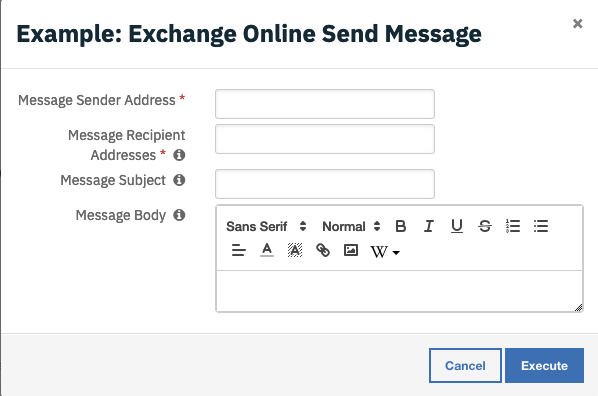
</p>
</details>

</p>
</details>

---
## Function - Exchange Online: Write Message as Attachment
This function will get the mime content of an Exchange Online message and write it as an incident attachment.  The attachment file name is an optional parameter and the functional will use a default message-{email-address}-{message-ID}.eml filename if none is specified.

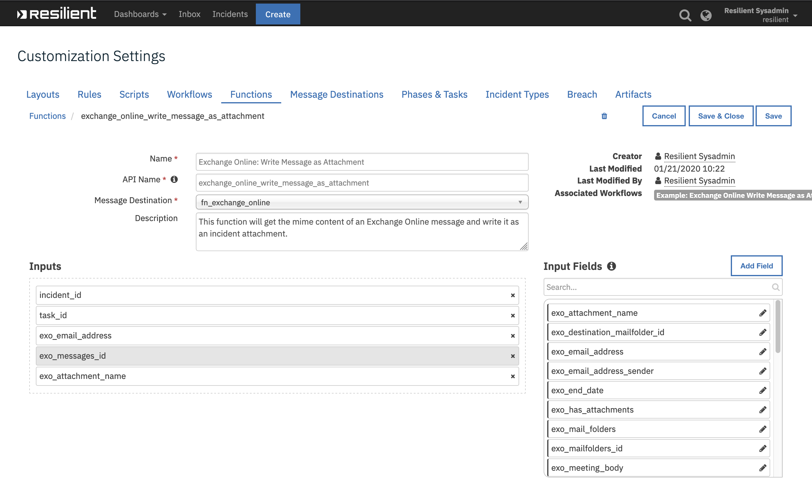

<details><summary>Inputs:</summary>
<p>

| Name | Type | Required | Example | Tooltip |
| ---- | :--: | :------: | ------- | ------- |
| `incident_id` | `number` | Yes | `-` | - |
| `task_id` | `number` | No | `-` | - |
| `exo_email_address` | `text` | Yes | `user@example.com` | Get information on this user email account |
| `exo_messages_id` | `text` | Yes | `-` | The message id of the message to be deleted |
| `exo_attachment_name` | `text` | No | `my-message.eml` | The name of the attachment file to which message is written. |
</p>
</details>

<details><summary>Outputs:</summary>
<p>

```python
results = {'inputs': {u'incident_id': 2099, 
                      u'exo_attachment_name': None, 
                      u'exo_messages_id': u'AAMkAGFmNDE0ZDA1LTFmOGMtNGU2MS04Y2IwLTJhMmViNWU3Y2VhMABGAAAAAAD45IEka4IVS4DBeEtMPuSEBwBJf-ANAwqcRJF4hFv_x44UAAAinByvAABJf-ANAwqcRJF4hFv_x44UAAAinIROAAA=', 
                       u'exo_email_address': u'resilient2@securitypocdemos.onmicrosoft.com'},
           'metrics': {'package': 'fn-exchange-online', 
                       'timestamp': '2020-02-03 14:54:13', 
                       'package_version': '1.0.0', 
                       'host': 'annmarie-mbp.cambridge.ibm.com', 
                       'version': '1.0', 'execution_time_ms': 5929}, 
            'success': True, 'content': {'attachment_name': u'my-message.eml'}, 
            'raw': '{"attachment_name": "my-message.eml"}', 
            'reason': None, 
            'version': '1.0'}
}
```

</p>
</details>

<details><summary>Workflows:</summary>
<p>
<details><summary>Example Pre-Process Script:</summary>
<p>

```python
inputs.incident_id = incident.id
#inputs.task_id = task.id
inputs.exo_attachment_name = rule.properties.exo_attachment_name
inputs.exo_email_address = row.exo_dt_email_address
inputs.exo_messages_id = row.exo_dt_message_id

```
</p>
</details>

<details><summary>Example Post-Process Script:</summary>
<p>

```python
None
```

</p>
</details>

<details><summary>Example Rule:</summary>
<p>
The example Write Message EML as Attachment rule works off the Exchange Online Message Query Results data table.  When the status column of the row is Active the Write Message as Attachment  rule is available to initiate the corresponding workflow. The status column may be non-Active if the message is Deleted or Not Found, in which case the message content can not be retrieed and written anymore.

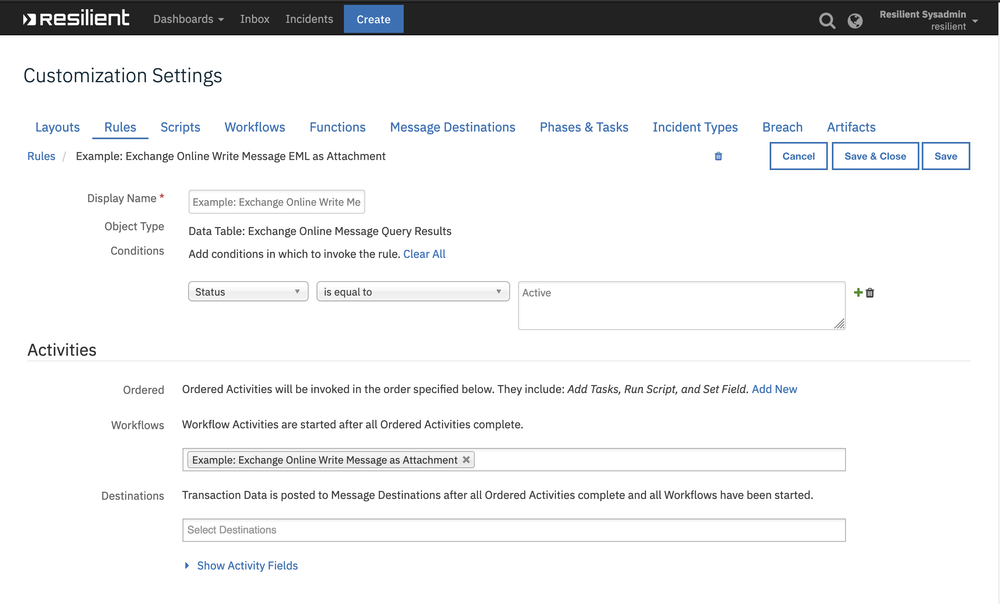

</p>
</details>
</p>
</details>

---

## Data Table - Exchange Online Message Query Results

Below is an example of results of a message query that are populated in the Exchange Online Message Query Results data table:

NOTE: The Web Link column contains a link to the message, but you have to be logged in as the message owner user to view the message in the link.  SOC operator will probably not be able to view by default.

 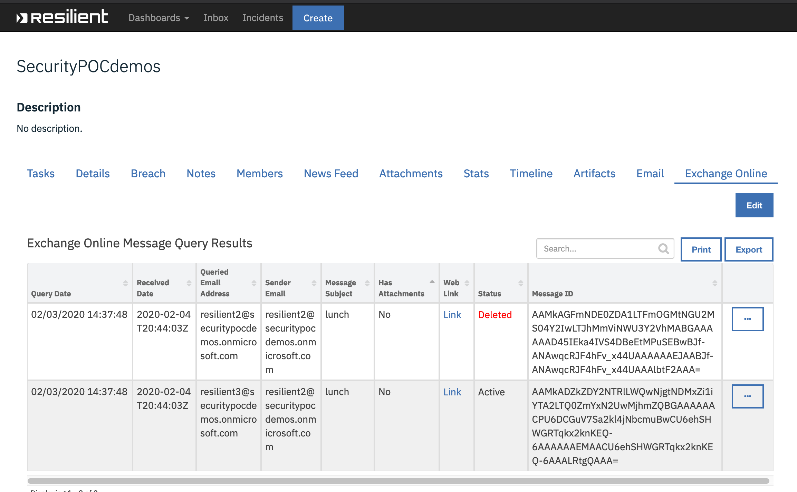


#### API Name:
exo_message_query_results_dt

#### Columns:
| Column Name | API Access Name | Type | Tooltip |
| ----------- | --------------- | ---- | ------- |
| Queried Email Address | `exo_dt_email_address` | `text` | - |
| Has Attachments | `exo_dt_has_attachments` | `boolean` | - |
| Message ID | `exo_dt_message_id` | `text` | - |
| Message Subject | `exo_dt_message_subject` | `text` | - |
| Query Date | `exo_dt_query_date` | `datetimepicker` | - |
| Received Date | `exo_dt_received_date` | `text` | - |
| Sender Email | `exo_dt_sender_email` | `text` | - |
| Status | `exo_dt_status` | `textarea` | - |
| Web Link | `exo_dt_web_link` | `textarea` | - |

---


## Rules
| Rule Name | Object | Workflow Triggered |
| --------- | ------ | ------------------ |
| Example: Exchange Online Write Message JSON as Note | exo_message_query_results_dt | `example_exchange_online_get_message` |
| Example: Exchange Online Send Message | incident | `example_exchange_online_send_message` |
| Example: Exchange Online Get User Profile | artifact | `example_exchange_online_get_user_profile` |
| Example: Exchange Online Delete Message from Query Results | incident | `example_exchange_online_delete_messages_from_query_results` |
| Example: Exchange Online Move Message to Folder | exo_message_query_results_dt | `example_exchange_online_move_message_to_folder` |
| Example: Exchange Online Query Messages on Artifact | artifact | `example_exchange_online_query_emails` |
| Example: Exchange Online Write Message EML as Attachment | exo_message_query_results_dt | `example_exchange_online_write_message_as_attachment` |
| Example: Exchange Online Query Messages | incident | `example_exchange_online_query_messages_of_a_group` |
| Example: Exchange Online Create Meeting | incident | `example_exchange_online_create_meeting` |
| Example: Exchange Online Create Artifacts | exo_message_query_results_dt | `-` |
| Example: Exchange Online Delete Message | exo_message_query_results_dt | `example_exchange_online_delete_email` |

---

<!--
## Inform Resilient Users
  Use this section to optionally provide additional information so that Resilient playbook 
  designer can get the maximum benefit of your integration.
-->