<!--
  This User README.md is generated by running:
  "resilient-sdk docgen -p fn_exchange_online --only-user-guide"

  It is best edited using a Text Editor with a Markdown Previewer. VS Code
  is a good example. Checkout https://guides.github.com/features/mastering-markdown/
  for tips on writing with Markdown

  If you make manual edits and run docgen again, a .bak file will be created

  Store any screenshots in the "doc/screenshots" directory and reference them like:
  
-->

# **User Guide:** Microsoft Exchange Online Functions for IBM Resilient v1.0.0

## Table of Contents
- [Key Features](#key-features)
- [Function - Exchange Online: Move Message to Folder](#function---exchange-online-move-message-to-folder)
- [Function - Exchange Online: Create Meeting](#function---exchange-online-create-meeting)
- [Function - Exchange Online: Send Message](#function---exchange-online-send-message)
- [Function - Exchange Online: Get User Profile](#function---exchange-online-get-user-profile)
- [Function - Exchange Online: Delete Messages From Query Results](#function---exchange-online-delete-messages-from-query-results)
- [Function - Exchange Online: Query Messages](#function---exchange-online-query-messages)
- [Function - Exchange Online: Delete Message](#function---exchange-online-delete-message)
- [Function - Exchange Online: Get Message](#function---exchange-online-get-message)
- [Function - Exchange Online: Write Message as Attachment](#function---exchange-online-write-message-as-attachment)
- [Data Table - Exchange Online Message Query Results](#data-table---exchange-online-message-query-results)
- [Rules](#rules)

---

## Key Features
<!--
  List the Key Features of the Integration
-->
Resilient Integration with Exchange Online provides the capability to access and manipulate Microsoft Exchange Online (Office 365 in the cloud) messages from the IBM Resilient Soar Platform.  The integration uses Microsoft Graph API to access the data in Office 365.  Included in the integrations are the following capabilities:

* Get the user profile of the specified email address in JSON format.

* Get a specified message and and return the results in JSON format.

* Get a specified message .eml format write as an incident attachment.

* Move a message to a specified "Well-known" Outlook folder.

* Send an message: from the specified email address to the specified recipients with specified message subject and body text.

* Query messages of a single user, a list of users, or the whole tenant and return a list of messages matching the criteria: message sender, messages from a specific Well-known folder, a time frame for when the message was received, text contained in the message subject or the message body, whether the message has attachments. Results are returned in the Exchange Online Query Message Results data table.

* Delete a single specified message from a specified email address.

* Delete a list of messages that are the results of a message query.  The messages deleted are written to the Exchange Online Query Messages data table.

* Create a meeting event in the organizer's Outlook calendar and send a calendar event message to meeting participants inviting them to the meeting.

---

## Function - Exchange Online: Move Message to Folder
This function will move an Exchange Online message to the specified folder in the users mailbox.

 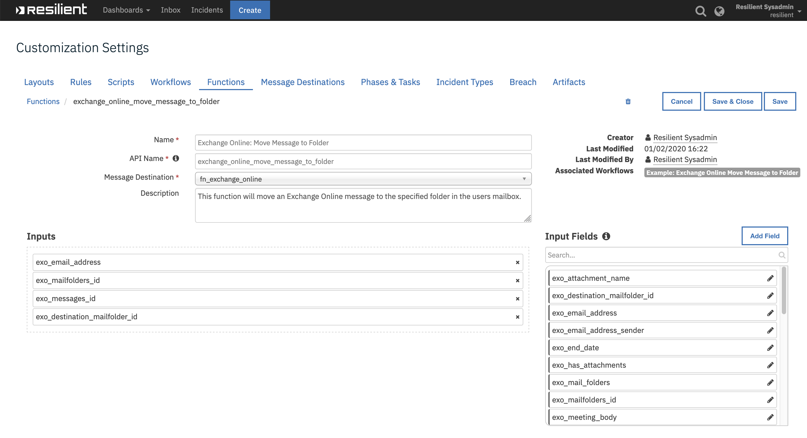

<details><summary>Inputs:</summary>
<p>

| Name | Type | Required | Example | Tooltip |
| ---- | :--: | :------: | ------- | ------- |
| `exo_email_address` | `text` | Yes | `user@example.com` | Get information on this user email account |
| `exo_mailfolders_id` | `text` | No | `-` | MailFolders id  |
| `exo_messages_id` | `text` | Yes | `-` | The message id of the message to be deleted |
| `exo_destination_mailfolder_id` | `select` | Yes | `-` | Destination folder to which message is moved. |
</p>
</details>

<details><summary>Outputs:</summary>
<p>

```python
Result: {
  'inputs': {u'exo_destination_mailfolder_id': {u'id': 126, 
                                               u'name': u'recoverableitemsdeletions'}, 
             u'exo_mailfolders_id': None, 
             u'exo_messages_id':u'AAMkAGFmNDE0ZDA1LTFmOGMtNGU2MS04Y2IwLTJhMmViNWU3Y2VhMABGAAAAAAD45IEka4IVS4DBeEtMPuSEBwBJf-ANAwqcRJF4hFv_x44UAAAAAAEMAABJf-ANAwqcRJF4hFv_x44UAAAXaS2qAAA=', u'exo_email_address': u'resilient2@securitypocdemos.onmicrosoft.com'}, 
  'metrics': {'package': 'fn-exchange-online', 
              'timestamp': '2020-01-31 13:23:41', 
              'package_version': '1.0.0', 
              'host': 'MacBook-Pro.local', 
              'version': '1.0', 
              'execution_time_ms': 1706}, 
  'success': True, 
  'content': {'value': True}, 
  'raw': '{"value": true}', 
  'reason': None, 
  'version': '1.0'}
```
</p>
</details>

<details><summary>Workflows:</summary>
<p>
The example Move Message to Folder workflow works off the Exchange Online Message Query Results data table.


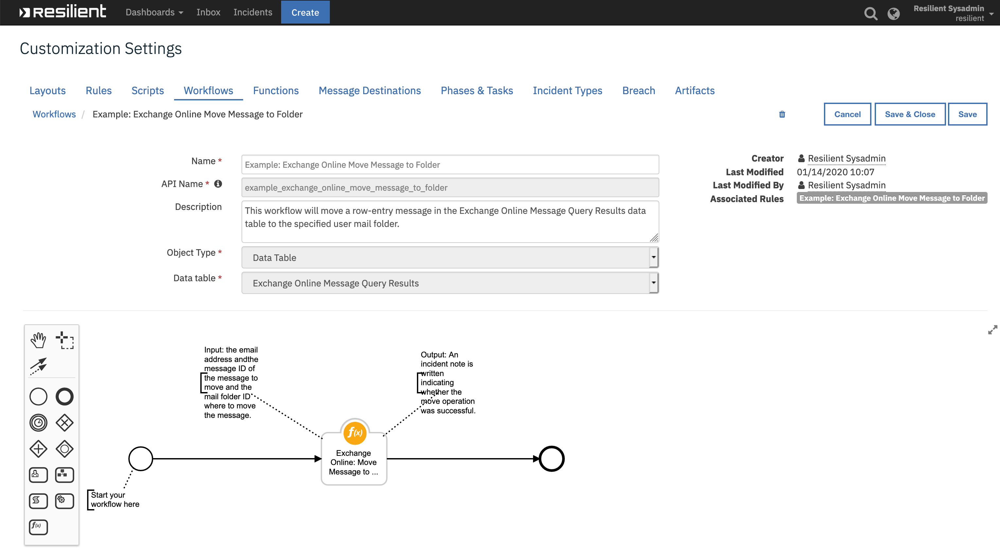

<details><summary>Example Workflow Output:</summary>
<p>
The Get User Profile workflow writes the user profile in JSON format to an incident note.  Sample output of the note is pictured below:

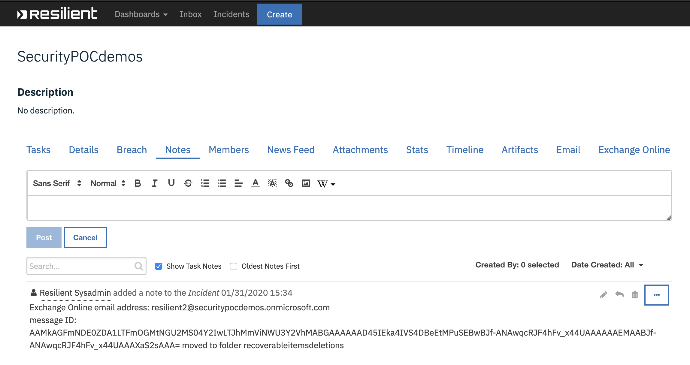

</p>

</details>


<details><summary>Example Pre-Process Script:</summary>
<p>

```python
inputs.exo_email_address = row.exo_dt_email_address
inputs.exo_mailfolders_id = None
inputs.exo_messages_id = row.exo_dt_message_id
inputs.exo_destination_mailfolder_id = rule.properties.exo_destination_mailfolder_id
```

</p>
</details>

<details><summary>Example Post-Process Script:</summary>
<p>

```python
# Print the message to an incident note if it is found, otherwise update the status as Not Found in the datatable.
if results.content["error"] is not None:
  noteText = u"Exchange Online message NOT FOUND: \n email address: {0}\n message ID: {1}".format(results.inputs["exo_email_address"], results.inputs["exo_messages_id"])
  status_text = u"""<p style= "color:{color}">{status} </p>""".format(color="red", status="Not Found")
  row['exo_dt_status'] = helper.createRichText(status_text)
else:
  noteText = u"Exchange Online email address: {0}\nmessage ID:\n{1} moved to folder {2}".format(results.inputs["exo_email_address"], results.inputs["exo_messages_id"], results.inputs["exo_destination_mailfolder_id"]["name"] )
  status_text = u"""<p style= "color:{color}">{status} </p>""".format(color="red", status="Moved")
  row['exo_dt_status'] = helper.createRichText(status_text)
incident.addNote(noteText)
```

</p>
</details>
<details><summary>Example Rule:</summary>
<p>

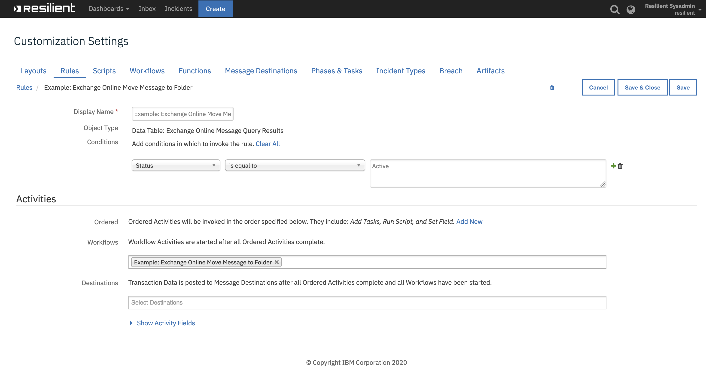

</p>
</details>

</p>
</details>

---
## Function - Exchange Online: Create Meeting
This function will create a meeting event in the organizer's Outlook calendar and send a calendar event mail message to the meeting participants inviting them to the meeting.

 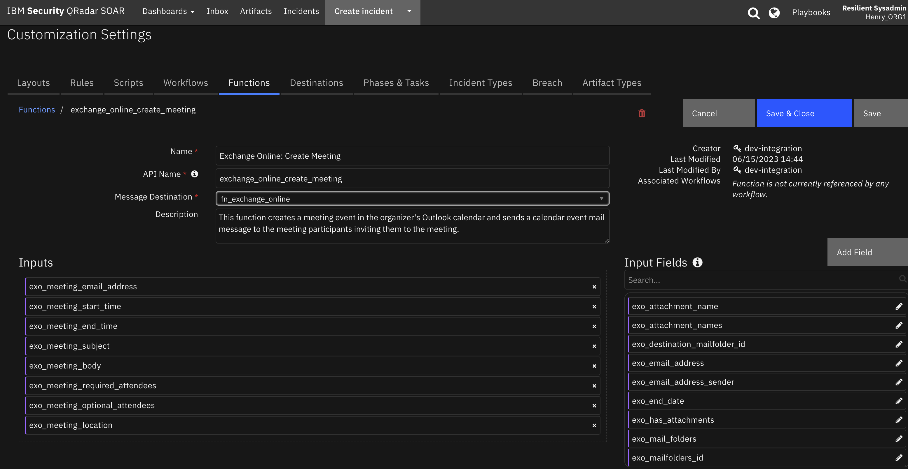

<details><summary>Inputs:</summary>
<p>

| Name | Type | Required | Example | Tooltip |
| ---- | :--: | :------: | ------- | ------- |
| `exo_meeting_body` | `text` | Yes | `-` | Meeting message body |
| `exo_meeting_email_address` | `text` | Yes | `user@example.com` | Email address of meeting coordinator |
| `exo_meeting_end_time` | `datetimepicker` | Yes | `-` | End date and time for meeting |
| `exo_meeting_location` | `text` | No | `-` | - |
| `exo_meeting_optional_attendees` | `text` | No | `user1@example.com, user2@example.com` | Comma separated list of optional attendee email addresses |
| `exo_meeting_required_attendees` | `text` | No | `user1@example.com, user2@example.com` | Comma separated list of required attendee email addresses |
| `exo_meeting_start_time` | `datetimepicker` | Yes | `-` | Meeting start date and time |
| `exo_meeting_subject` | `text` | Yes | `-` | Meeting Subect |

</p>
</details>

<details><summary>Outputs:</summary>
<p>

```python
results = {
    # TODO: Copy and paste an example of the Function Output within this code block.
    # To see view the output of a Function, run resilient-circuits in DEBUG mode and invoke the Function. 
    # The Function results will be printed in the logs: "resilient-circuits run --loglevel=DEBUG"
}
```

</p>
</details>

<details><summary>Example Pre-Process Script:</summary>
<p>

```python
inputs.exo_meeting_email_address = inputs.exo_meeting_email_address  if rule.properties.exo_meeting_email_address is None else rule.properties.exo_meeting_email_address
inputs.exo_meeting_start_time = inputs.exo_meeting_start_time if rule.properties.exo_meeting_start_time is None else rule.properties.exo_meeting_start_time
inputs.exo_meeting_end_time = inputs.exo_meeting_end_time if rule.properties.exo_meeting_end_time is None else rule.properties.exo_meeting_end_time
inputs.exo_meeting_subject = inputs.exo_meeting_subject if rule.properties.exo_meeting_subject is None else rule.properties.exo_meeting_subject
inputs.exo_meeting_body = inputs.exo_meeting_body if rule.properties.exo_meeting_body.content is None else rule.properties.exo_meeting_body.content
inputs.exo_meeting_required_attendees = inputs.exo_meeting_required_attendees if rule.properties.exo_meeting_required_attendees is None else rule.properties.exo_meeting_required_attendees
inputs.exo_meeting_optional_attendees = inputs.exo_meeting_optional_attendees if rule.properties.exo_meeting_optional_attendees is None else rule.properties.exo_meeting_optional_attendees
inputs.exo_meeting_location = inputs.exo_meeting_location if rule.properties.exo_meeting_location is None else rule.properties.exo_meeting_location
```

</p>
</details>

<details><summary>Example Post-Process Script:</summary>
<p>

```python
if results.success:
  noteText = u"Exchange Online created meeting\n   From: {0}\n{1}".format(results.inputs["exo_meeting_email_address"],results.pretty_string)
else:
  noteText = u"Exchange Online meeting was NOT created\n   From: {0}\n{1}".format(results.inputs["exo_meeting_email_address"], results.pretty_string)

incident.addNote(noteText)
```

</p>
</details>

---
## Function - Exchange Online: Send Message
This function will create a message and send to the specified recipients.

 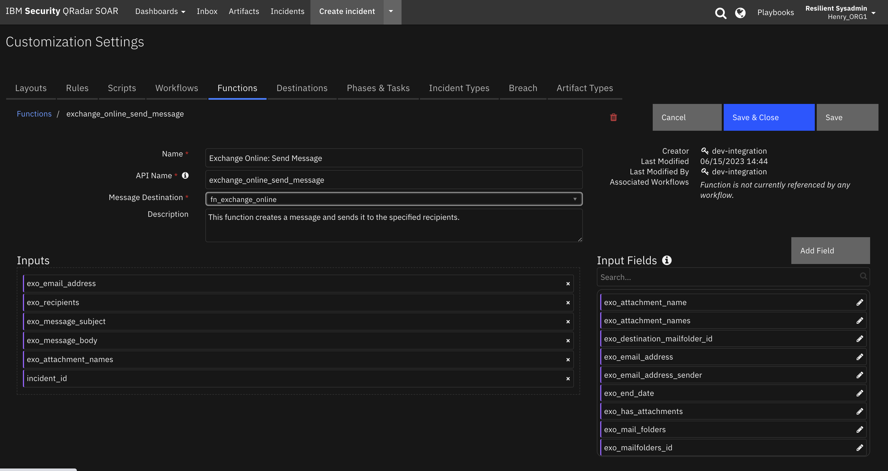

<details><summary>Inputs:</summary>
<p>

| Name | Type | Required | Example | Tooltip |
| ---- | :--: | :------: | ------- | ------- |
| `exo_email_address` | `text` | Yes | `user@example.com` | Get information on this user email account |
| `exo_message_body` | `text` | No | `message body text` | message body |
| `exo_message_subject` | `text` | No | `message subject` | message subject |
| `exo_recipients` | `text` | Yes | `-` | comma separated list of message recipients |

</p>
</details>

<details><summary>Outputs:</summary>
<p>

```python
results = {
    # TODO: Copy and paste an example of the Function Output within this code block.
    # To see view the output of a Function, run resilient-circuits in DEBUG mode and invoke the Function. 
    # The Function results will be printed in the logs: "resilient-circuits run --loglevel=DEBUG"
}
```

</p>
</details>

<details><summary>Example Pre-Process Script:</summary>
<p>

```python
inputs.exo_email_address   = inputs.exo_email_address   if rule.properties.exo_message_sender_address is None else rule.properties.exo_message_sender_address
inputs.exo_recipients      = inputs.exo_recipients      if rule.properties.exo_message_recipients     is None else rule.properties.exo_message_recipients
inputs.exo_message_subject = inputs.exo_message_subject if rule.properties.exo_message_subject is None else rule.properties.exo_message_subject
inputs.exo_message_body    = inputs.exo_message_send_body.content if rule.properties.exo_message_send_body.content is None else rule.properties.exo_message_send_body.content
```

</p>
</details>

<details><summary>Example Post-Process Script:</summary>
<p>

```python
if results.success:
  noteText = u"Exchange Online message sent\n   From: {0}\n   To: {1}\n   Subject: {2}\n   Body: {3}".format(results.inputs["exo_email_address"], results.inputs["exo_recipients"], results.inputs["exo_message_subject"], results.inputs["exo_message_body"])
else:
  noteText = u"Exchange Online message NOT sent\n   From: {0}\n  To: {1}".format(results.inputs["exo_email_address"], results.inputs["exo_recipients"])

incident.addNote(noteText)
```

</p>
</details>

---
## Function - Exchange Online: Get User Profile
The Get User Profile function will return Exchange Online user profile for a given email address.

 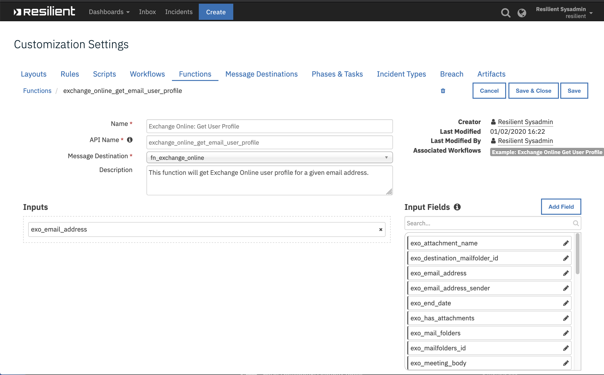

<details><summary>Inputs:</summary>
<p>

| Name | Type | Required | Example | Tooltip |
| ---- | :--: | :------: | ------- | ------- |
| `exo_email_address` | `text` | Yes | `user@example.com` | Get information on this user email account |

</p>
</details>

<details><summary>Outputs:</summary>
<p>

```python
results = {
    'inputs': {u'exo_email_address': u'resilient2@securitypocdemos.onmicrosoft.com'}, 
    'metrics': {'package': 'fn-exchange-online', 
                'timestamp': '2020-01-31 11:14:42', 
                'package_version': '1.0.0', 
                'host': 'MacBook-Pro.local', 
                'version': '1.0', 
                'execution_time_ms': 599}, 
    'success': True, 
    'pretty_string': u'{\n    "@odata.context": "https://graph.microsoft.com/v1.0/$metadata#users/$entity",\n    "businessPhones": [],\n    "displayName": "Resilient User 2",\n    "givenName": "Resilient User 2",\n    "id": "393c1ebb-8222-4ba1-8665-f54eaf7f024f",\n    "jobTitle": null,\n    "mail": "resilient2@securitypocdemos.onmicrosoft.com",\n    "mobilePhone": null,\n    "officeLocation": null,\n    "preferredLanguage": "en-US",\n    "surname": "Resilient User 2",\n    "userPrincipalName": "resilient2@securitypocdemos.onmicrosoft.com"\n}', 
    'content': {
        u'displayName': u'Resilient User 2', 
        u'mobilePhone': None, 
        u'preferredLanguage': u'en-US', 
        u'jobTitle': None, 
        u'userPrincipalName': u'resilient2@securitypocdemos.onmicrosoft.com', 
        u'@odata.context': u'https://graph.microsoft.com/v1.0/$metadata#users/$entity', 
        u'officeLocation': None, 
        u'businessPhones': [], 
        u'mail': u'resilient2@securitypocdemos.onmicrosoft.com', 
        u'surname': u'Resilient User 2', 
        u'givenName': u'Resilient User 2', 
        u'id': u'393c1ebb-8222-4ba1-8665-f54eaf7f024f'},
    'raw': '{"displayName": "Resilient User 2", "mobilePhone": null, "preferredLanguage": "en-US", "jobTitle": null, "userPrincipalName": "resilient2@securitypocdemos.onmicrosoft.com", "@odata.context": "https://graph.microsoft.com/v1.0/$metadata#users/$entity", "officeLocation": null, "businessPhones": [], "mail": "resilient2@securitypocdemos.onmicrosoft.com", "surname": "Resilient User 2", "givenName": "Resilient User 2", "id": "393c1ebb-8222-4ba1-8665-f54eaf7f024f"}', 
    'reason': None, 
    'version': '1.0'
}
```

</p>
</details>
<details><summary>Workflows:</summary>
<p>
The example Get User Profile workflow works off an artifact whose value contains the email address of the user whose profile is to be queried.  The user profile is returned in JSON format as an incident note.

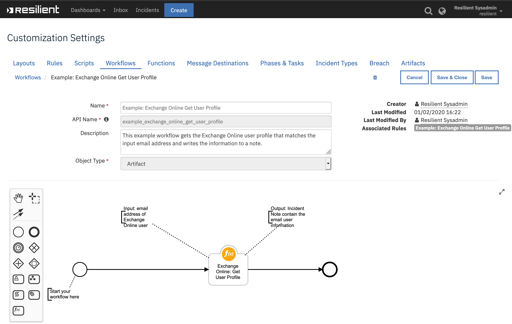

<details><summary>Example Pre-Process Script:</summary>
<p>

```python
inputs.exo_email_address = artifact.value
```

</p>
</details>

<details><summary>Example Post-Process Script:</summary>
<p>

```python
if results.content["error"] is not None:
  noteText = u"Exchange Online user profile NOT FOUND: {0}\n{1}".format(results.inputs["exo_email_address"], results.pretty_string)
else:
  noteText = u"Exchange Online user profile: {0}\n{1}".format(results.inputs["exo_email_address"], results.pretty_string)

incident.addNote(noteText)
```

</p>
</details>

<details><summary>Example Workflow Output:</summary>
<p>
The Get User Profile workflow writes the user profile in JSON format to an incident note.  Sample output of the note is pictured below:

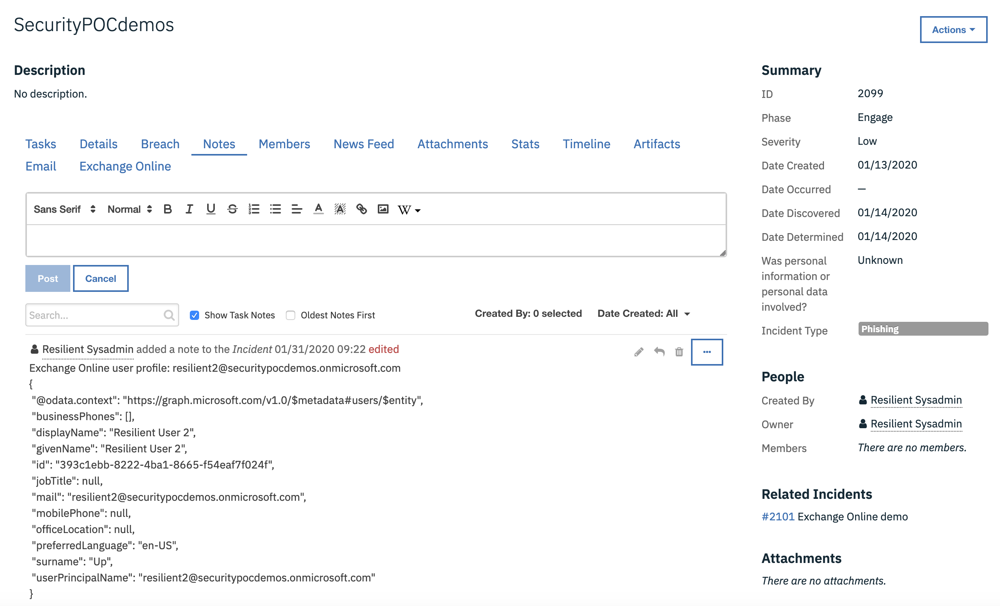

</p>

</details>

<details><summary>Example Rule:</summary>
<p>
The example Get User Profile rule will invoke the Get User Profile workflow if the artifact type is one of the following:

* Email Recipient
* Email Sender
* Email Sender Name
* User Account

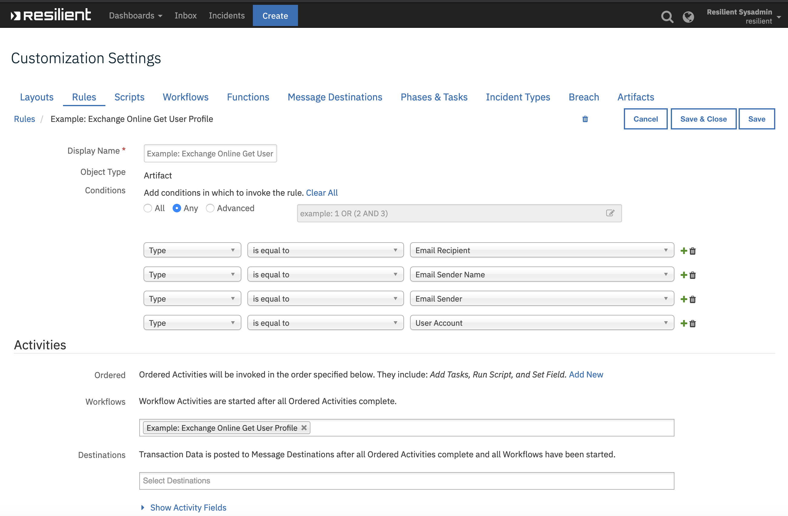

</p>
</details>


</p>
</details>


---
## Function - Exchange Online: Delete Messages From Query Results
This Exchange Online function will delete a list of messages returned from the Query Message function.  The input to the function is a string containing the JSON results from the Query Messages function.

 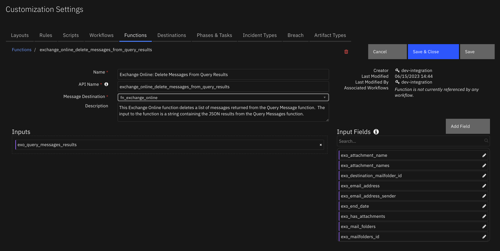

<details><summary>Inputs:</summary>
<p>

| Name | Type | Required | Example | Tooltip |
| ---- | :--: | :------: | ------- | ------- |
| `exo_query_messages_results` | `text` | Yes | `-` | String containing JSON data results from Query Messages function |

</p>
</details>

<details><summary>Outputs:</summary>
<p>

```python
results = {
    # TODO: Copy and paste an example of the Function Output within this code block.
    # To see view the output of a Function, run resilient-circuits in DEBUG mode and invoke the Function. 
    # The Function results will be printed in the logs: "resilient-circuits run --loglevel=DEBUG"
}
```

</p>
</details>

<details><summary>Example Pre-Process Script:</summary>
<p>

```python
inputs.exo_query_messages_results = workflow.properties.exo_query_results['raw']
```

</p>
</details>

<details><summary>Example Post-Process Script:</summary>
<p>

```python
from java.util import Date

deleted_count = 0
not_deleted_count = 0

# Add each email as a row in the query results data table
for user in results["content"]:
    
  not_deleted_count = not_deleted_count + len(user["not_deleted_list"])
  for email in user["deleted_list"]:
    deleted_count = deleted_count + 1
    message_row = incident.addRow("exo_message_query_results_dt")
    message_row.exo_dt_query_date = Date()
    message_row.exo_dt_message_id = email.id
    message_row.exo_dt_received_date   = email.receivedDateTime
    message_row.exo_dt_email_address = user["email_address"]
    if email.sender:
      message_row.exo_dt_sender_email = email.sender.emailAddress.address
    else:
      message_row.exo_dt_sender_email = ""
    message_row.exo_dt_message_subject = email.subject
    message_row.exo_dt_has_attachments = email.hasAttachments
    if email.webLink:
      ref_html = u"""<a href='{0}'>Link</a>""".format(email.webLink)
      message_row.exo_dt_web_link = helper.createRichText(ref_html)
    else:
      message_row.exo_dt_web_link = ""
 
    text = u"""<p style= "color:{color}">{status} </p>""".format(color="red", status="Deleted")
    message_row.exo_dt_status = helper.createRichText(text)


# Post a note containing the number of emails deleted
note = u"Exchange Online Delete Messages From Query Results:\n  {0} messages deleted".format(deleted_count)

# Add to the note if any messages from the query were not deleted.
if not_deleted_count > 0:
  note2 = u"  {0} messages NOT deleted".format(not_deleted_count)
  note = u"{0}\n{1}".format(note, note2)
incident.addNote(note)
```

</p>
</details>

---
## Function - Exchange Online: Query Messages
This function will query Exchange Online to find messages matching the specified input parameters.  A list of messages is returned from the function.

 

<details><summary>Inputs:</summary>
<p>

| Name | Type | Required | Example | Tooltip |
| ---- | :--: | :------: | ------- | ------- |
| `exo_email_address` | `text` | Yes | `user@example.com` | Get information on this user email account |
| `exo_email_address_sender` | `text` | No | `user@example.com` | Only get emails sent from this email address; leave blank to ignore sender attribute |
| `exo_end_date` | `datetimepicker` | No | `-` | Query message received ending at this date/time. |
| `exo_has_attachments` | `boolean` | No | `-` | True to include attachments, False to exclude attachments, Unknown to get all |
| `exo_mail_folders` | `text` | No | `Inbox` | The folder to search in the users mailbox |
| `exo_message_body` | `text` | No | `message body text` | message body |
| `exo_message_subject` | `text` | No | `message subject` | message subject |
| `exo_start_date` | `datetimepicker` | No | `-` | Query emails received starting at this date/time. |

</p>
</details>

<details><summary>Outputs:</summary>
<p>

```python
results = {
    # TODO: Copy and paste an example of the Function Output within this code block.
    # To see view the output of a Function, run resilient-circuits in DEBUG mode and invoke the Function. 
    # The Function results will be printed in the logs: "resilient-circuits run --loglevel=DEBUG"
}
```

</p>
</details>

<details><summary>Example Pre-Process Script:</summary>
<p>

```python
# Get the email address of the user whose mailbox will be queried.
inputs.exo_email_address = inputs.exo_email_address if rule.properties.exo_email_address_list is None else rule.properties.exo_email_address_list

# Get the search criteria from the activity rules if available. 
inputs.exo_mail_folders         = inputs.exo_mail_folders         if rule.properties.exo_mailfolder_id        is None else rule.properties.exo_mailfolder_id
inputs.exo_email_address_sender = inputs.exo_email_address_sender if rule.properties.exo_email_address_sender is None else rule.properties.exo_email_address_sender
inputs.exo_message_subject      = inputs.exo_message_subject      if rule.properties.exo_message_subject      is None else rule.properties.exo_message_subject
inputs.exo_message_body         = inputs.exo_message_body         if rule.properties.exo_message_body         is None else rule.properties.exo_message_body
inputs.exo_start_date           = inputs.exo_start_date           if rule.properties.exo_start_date           is None else rule.properties.exo_start_date
inputs.exo_end_date             = inputs.exo_end_date             if rule.properties.exo_end_date             is None else rule.properties.exo_end_date
inputs.exo_has_attachments      = inputs.exo_has_attachments      if rule.properties.exo_has_attachments      is None else rule.properties.exo_has_attachments
```

</p>
</details>

<details><summary>Example Post-Process Script:</summary>
<p>

```python
from java.util import Date

note = u"Exchange Online Query Multiple users:\n"
note_len = len(note)

# Add each email as a row in the query results data table
for user in results["content"]:
  # If an email address is not found post to a note.
  if user["status_code"] == 404:
    line = u"email address not found: {}\n".format(user["email_address"])
    note = note + line
    
  for email in user["email_list"]:
    message_row = incident.addRow("exo_message_query_results_dt")
    message_row.exo_dt_query_date = Date()
    message_row.exo_dt_message_id = email.id
    message_row.exo_dt_received_date   = email.receivedDateTime
    message_row.exo_dt_email_address = user["email_address"]
    if email.sender:
      message_row.exo_dt_sender_email = email.sender.emailAddress.address
    else:
      message_row.exo_dt_sender_email = ""
    message_row.exo_dt_message_subject = email.subject
    message_row.exo_dt_has_attachments = email.hasAttachments
    if email.webLink:
      ref_html = u"""<a href='{0}'>Link</a>""".format(email.webLink)
      message_row.exo_dt_web_link = helper.createRichText(ref_html)
    else:
      message_row.exo_dt_web_link = ""
 
    message_row.exo_dt_status = helper.createRichText("Active")

# If any email addresses where not found post a note
if len(note) > note_len:
  incident.addNote(note)
```

</p>
</details>

---
## Function - Exchange Online: Delete Message
Delete a message in the specified user's email address mailbox.  The email address of the mailbox and the message id are required input parameters.  The mail folder is an optional parameter.

 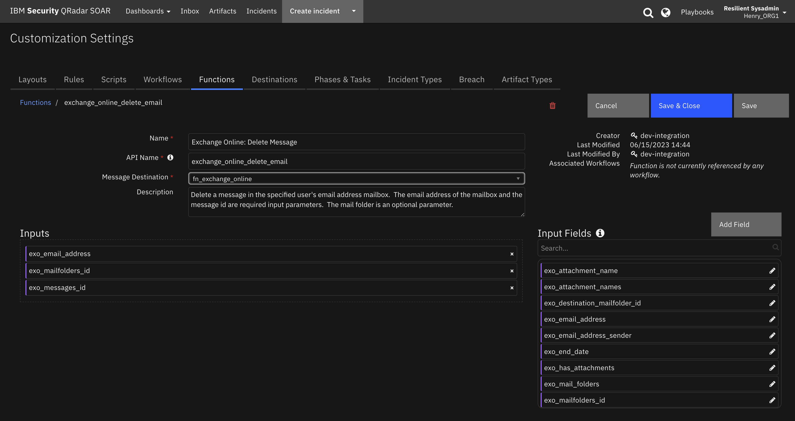

<details><summary>Inputs:</summary>
<p>

| Name | Type | Required | Example | Tooltip |
| ---- | :--: | :------: | ------- | ------- |
| `exo_email_address` | `text` | Yes | `user@example.com` | Get information on this user email account |
| `exo_mailfolders_id` | `text` | No | `-` | MailFolders id  |
| `exo_messages_id` | `text` | Yes | `-` | The message id of the message to be deleted |

</p>
</details>

<details><summary>Outputs:</summary>
<p>

```python
results = {
    # TODO: Copy and paste an example of the Function Output within this code block.
    # To see view the output of a Function, run resilient-circuits in DEBUG mode and invoke the Function. 
    # The Function results will be printed in the logs: "resilient-circuits run --loglevel=DEBUG"
}
```

</p>
</details>

<details><summary>Example Pre-Process Script:</summary>
<p>

```python
inputs.exo_email_address = row.exo_dt_email_address
inputs.exo_messages_id = row.exo_dt_message_id
inputs.exo_mailfolders_id = None
```

</p>
</details>

<details><summary>Example Post-Process Script:</summary>
<p>

```python
if results.success:
  # The message was deleted, so update "status" column in data table.
  text = u"""<p style= "color:{color}">{status} </p>""".format(color="red", status="Deleted")
  row['exo_dt_status'] = helper.createRichText(text)
elif results.content["error"] is not None: 
  # There is an "item not found" error mostly likely here
  row['exo_dt_status'] = helper.createRichText(results.content["error"]["code"])
```

</p>
</details>

---
## Function - Exchange Online: Get Message
This function returns the contents of an Exchange Online message in json format.

 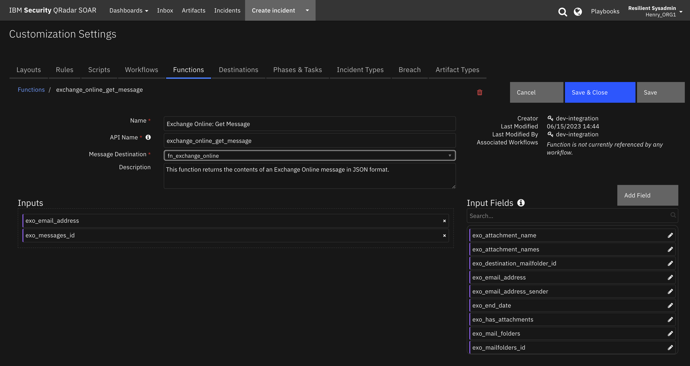

<details><summary>Inputs:</summary>
<p>

| Name | Type | Required | Example | Tooltip |
| ---- | :--: | :------: | ------- | ------- |
| `exo_email_address` | `text` | Yes | `user@example.com` | Get information on this user email account |
| `exo_messages_id` | `text` | Yes | `-` | The message id of the message to be deleted |

</p>
</details>

<details><summary>Outputs:</summary>
<p>

```python
results = {
    # TODO: Copy and paste an example of the Function Output within this code block.
    # To see view the output of a Function, run resilient-circuits in DEBUG mode and invoke the Function. 
    # The Function results will be printed in the logs: "resilient-circuits run --loglevel=DEBUG"
}
```

</p>
</details>

<details><summary>Example Pre-Process Script:</summary>
<p>

```python
inputs.exo_email_address = row.exo_dt_email_address
inputs.exo_messages_id = row.exo_dt_message_id
```

</p>
</details>

<details><summary>Example Post-Process Script:</summary>
<p>

```python
# Print the message to an incident note if it is found, otherwise update the status as Not Found in the datatable.
if results.content["error"] is not None:
  noteText = u"Exchange Online message NOT FOUND: \n email address: {0}\n message ID: {1}\n{2}".format(results.inputs["exo_email_address"], results.inputs["exo_messages_id"], results.pretty_string)
  row.exo_dt_status = "Not Found"
else:
  noteText = u"Exchange Online email address: {0} message:\n{1}".format(results.inputs["exo_email_address"], results.pretty_string)

incident.addNote(noteText)
```

</p>
</details>

---
## Function - Exchange Online: Write Message as Attachment
This function will get the mime content of an Exchange Online message and write it as an incident attachment.

 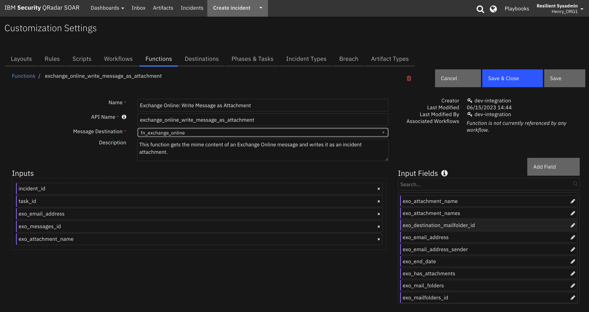

<details><summary>Inputs:</summary>
<p>

| Name | Type | Required | Example | Tooltip |
| ---- | :--: | :------: | ------- | ------- |
| `exo_attachment_name` | `text` | No | `-` | The name of the attachment file to which message is written. |
| `exo_email_address` | `text` | Yes | `user@example.com` | Get information on this user email account |
| `exo_messages_id` | `text` | Yes | `-` | The message id of the message to be deleted |
| `incident_id` | `number` | Yes | `-` | - |
| `task_id` | `number` | No | `-` | - |

</p>
</details>

<details><summary>Outputs:</summary>
<p>

```python
results = {
    # TODO: Copy and paste an example of the Function Output within this code block.
    # To see view the output of a Function, run resilient-circuits in DEBUG mode and invoke the Function. 
    # The Function results will be printed in the logs: "resilient-circuits run --loglevel=DEBUG"
}
```

</p>
</details>

<details><summary>Example Pre-Process Script:</summary>
<p>

```python
inputs.incident_id = incident.id
#inputs.task_id = task.id
inputs.exo_attachment_name = rule.properties.exo_attachment_name
inputs.exo_email_address = row.exo_dt_email_address
inputs.exo_messages_id = row.exo_dt_message_id

```

</p>
</details>

<details><summary>Example Post-Process Script:</summary>
<p>

```python
None
```

</p>
</details>

---
---
## Function - Exchange Online: Get User Profile
The Get User Profile function will return Exchange Online user profile for a given email address.

 

<details><summary>Inputs:</summary>
<p>

| Name | Type | Required | Example | Tooltip |
| ---- | :--: | :------: | ------- | ------- |
| `exo_email_address` | `text` | Yes | `user@example.com` | Get information on this user email account |

</p>
</details>

<details><summary>Outputs:</summary>
<p>

```python
results = {
    'inputs': {u'exo_email_address': u'resilient2@securitypocdemos.onmicrosoft.com'}, 
    'metrics': {'package': 'fn-exchange-online', 
                'timestamp': '2020-01-31 11:14:42', 
                'package_version': '1.0.0', 
                'host': 'MacBook-Pro.local', 
                'version': '1.0', 
                'execution_time_ms': 599}, 
    'success': True, 
    'pretty_string': u'{\n    "@odata.context": "https://graph.microsoft.com/v1.0/$metadata#users/$entity",\n    "businessPhones": [],\n    "displayName": "Resilient User 2",\n    "givenName": "Resilient User 2",\n    "id": "393c1ebb-8222-4ba1-8665-f54eaf7f024f",\n    "jobTitle": null,\n    "mail": "resilient2@securitypocdemos.onmicrosoft.com",\n    "mobilePhone": null,\n    "officeLocation": null,\n    "preferredLanguage": "en-US",\n    "surname": "Resilient User 2",\n    "userPrincipalName": "resilient2@securitypocdemos.onmicrosoft.com"\n}', 
    'content': {
        u'displayName': u'Resilient User 2', 
        u'mobilePhone': None, 
        u'preferredLanguage': u'en-US', 
        u'jobTitle': None, 
        u'userPrincipalName': u'resilient2@securitypocdemos.onmicrosoft.com', 
        u'@odata.context': u'https://graph.microsoft.com/v1.0/$metadata#users/$entity', 
        u'officeLocation': None, 
        u'businessPhones': [], 
        u'mail': u'resilient2@securitypocdemos.onmicrosoft.com', 
        u'surname': u'Resilient User 2', 
        u'givenName': u'Resilient User 2', 
        u'id': u'393c1ebb-8222-4ba1-8665-f54eaf7f024f'},
    'raw': '{"displayName": "Resilient User 2", "mobilePhone": null, "preferredLanguage": "en-US", "jobTitle": null, "userPrincipalName": "resilient2@securitypocdemos.onmicrosoft.com", "@odata.context": "https://graph.microsoft.com/v1.0/$metadata#users/$entity", "officeLocation": null, "businessPhones": [], "mail": "resilient2@securitypocdemos.onmicrosoft.com", "surname": "Resilient User 2", "givenName": "Resilient User 2", "id": "393c1ebb-8222-4ba1-8665-f54eaf7f024f"}', 
    'reason': None, 
    'version': '1.0'
}
```

</p>
</details>
<details><summary>Workflows:</summary>
<p>
The example Get User Profile workflow works off an artifact whose value contains the email address of the user whose profile is to be queried.  The user profile is returned in JSON format as an incident note.


<details><summary>Example Pre-Process Script:</summary>
<p>

```python
inputs.exo_email_address = artifact.value
```

</p>
</details>

<details><summary>Example Post-Process Script:</summary>
<p>

```python
if results.content["error"] is not None:
  noteText = u"Exchange Online user profile NOT FOUND: {0}\n{1}".format(results.inputs["exo_email_address"], results.pretty_string)
else:
  noteText = u"Exchange Online user profile: {0}\n{1}".format(results.inputs["exo_email_address"], results.pretty_string)

incident.addNote(noteText)
```

</p>
</details>

<details><summary>Example Workflow Output:</summary>
<p>
The Get User Profile workflow writes the user profile in JSON format to an incident note.  Sample output of the note is pictured below:


</p>

</details>

<details><summary>Example Rule:</summary>
<p>
The example Get User Profile rule will invoke the Get User Profile workflow if the artifact type is one of the following:

* Email Recipient
* Email Sender
* Email Sender Name
* User Account


</p>
</details>


</p>
</details>

---

## Data Table - Exchange Online Message Query Results

 

#### API Name:
exo_message_query_results_dt

#### Columns:
| Column Name | API Access Name | Type | Tooltip |
| ----------- | --------------- | ---- | ------- |
| Queried Email Address | `exo_dt_email_address` | `text` | - |
| Has Attachments | `exo_dt_has_attachments` | `boolean` | - |
| Message ID | `exo_dt_message_id` | `text` | - |
| Message Subject | `exo_dt_message_subject` | `text` | - |
| Query Date | `exo_dt_query_date` | `datetimepicker` | - |
| Received Date | `exo_dt_received_date` | `text` | - |
| Sender Email | `exo_dt_sender_email` | `text` | - |
| Status | `exo_dt_status` | `textarea` | - |
| Web Link | `exo_dt_web_link` | `textarea` | - |

---


## Rules
| Rule Name | Object | Workflow Triggered |
| --------- | ------ | ------------------ |
| Example: Exchange Online Write Message JSON as Note | exo_message_query_results_dt | `example_exchange_online_get_message` |
| Example: Exchange Online Send Message | incident | `example_exchange_online_send_message` |
| Example: Exchange Online Get User Profile | artifact | `example_exchange_online_get_user_profile` |
| Example: Exchange Online Delete Message from Query Results | incident | `example_exchange_online_delete_messages_from_query_results` |
| Example: Exchange Online Move Message to Folder | exo_message_query_results_dt | `example_exchange_online_move_message_to_folder` |
| Example: Exchange Online Query Messages on Artifact | artifact | `example_exchange_online_query_emails` |
| Example: Exchange Online Write Message EML as Attachment | exo_message_query_results_dt | `example_exchange_online_write_message_as_attachment` |
| Example: Exchange Online Query Messages | incident | `example_exchange_online_query_messages_of_a_group` |
| Example: Exchange Online Create Meeting | incident | `example_exchange_online_create_meeting` |
| Example: Exchange Online Create Artifacts | exo_message_query_results_dt | `-` |
| Example: Exchange Online Delete Message | exo_message_query_results_dt | `example_exchange_online_delete_email` |

---

<!--
## Inform Resilient Users
  Use this section to optionally provide additional information so that Resilient playbook 
  designer can get the maximum benefit of your integration.
-->