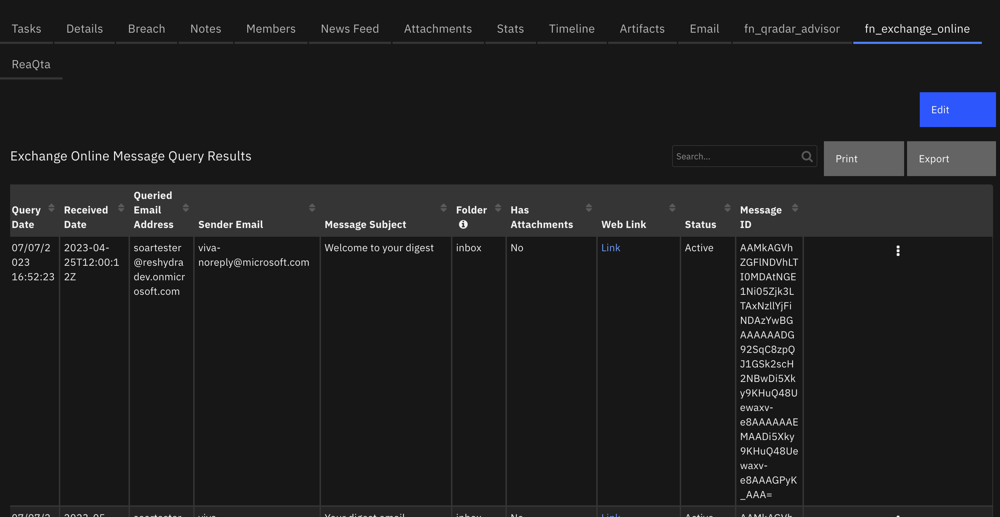

<!--
  This User README.md is generated by running:
  "resilient-sdk docgen -p fn_exchange_online --only-user-guide"

  It is best edited using a Text Editor with a Markdown Previewer. VS Code
  is a good example. Checkout https://guides.github.com/features/mastering-markdown/
  for tips on writing with Markdown

  If you make manual edits and run docgen again, a .bak file will be created

  Store any screenshots in the "doc/screenshots" directory and reference them like:
  
-->

# **User Guide:** fn_exchange_online_v1.0.0

## Table of Contents
- [Key Features](#key-features)
- [Function - Exchange Online: Delete Message](#function---exchange-online-delete-message)
- [Function - Exchange Online: Move Message to Folder](#function---exchange-online-move-message-to-folder)
- [Function - Exchange Online: Get Message](#function---exchange-online-get-message)
- [Function - Exchange Online: Get User Profile](#function---exchange-online-get-user-profile)
- [Function - Exchange Online: Write Message as Attachment](#function---exchange-online-write-message-as-attachment)
- [Function - Exchange Online: Query Messages](#function---exchange-online-query-messages)
- [Data Table - Exchange Online Message Query Results](#data-table---exchange-online-message-query-results)
- [Rules](#rules)

---

## Key Features
<!--
  List the Key Features of the Integration
-->
* Key Feature 1
* Key Feature 2
* Key Feature 3

---

## Function - Exchange Online: Delete Message
Delete a message in the specified user's email address mailbox.  The email address of the mailbox and the message id are required input parameters.  The mail folder is an optional parameter.

 

<details><summary>Inputs:</summary>
<p>

| Name | Type | Required | Example | Tooltip |
| ---- | :--: | :------: | ------- | ------- |
| `exo_email_address` | `text` | Yes | `user@example.com` | Get information on this user email account |
| `exo_mailfolders_id` | `text` | No | `-` | MailFolders id  |
| `exo_messages_id` | `text` | Yes | `-` | The message id of the message to be deleted |

</p>
</details>

<details><summary>Outputs:</summary>
<p>

```python
results = {
    # TODO: Copy and paste an example of the Function Output within this code block.
    # To see view the output of a Function, run resilient-circuits in DEBUG mode and invoke the Function. 
    # The Function results will be printed in the logs: "resilient-circuits run --loglevel=DEBUG"
}
```

</p>
</details>

<details><summary>Example Pre-Process Script:</summary>
<p>

```python
inputs.exo_email_address = row.exo_dt_email_address
inputs.exo_messages_id = row.exo_dt_message_id
inputs.exo_mailfolders_id = None
```

</p>
</details>

<details><summary>Example Post-Process Script:</summary>
<p>

```python
if results.success:
  # The message was deleted, so update "status" column in data table.
  text = u"""<p style= "color:{color}">{status} </p>""".format(color="red", status="Deleted")
  row['exo_dt_status'] = helper.createRichText(text)
elif results.content["error"] is not None: 
  # There is an "item not found" error mostly likely here
  row['exo_dt_status'] = helper.createRichText(results.content["error"]["code"])
```

</p>
</details>

---
## Function - Exchange Online: Move Message to Folder
This function will move an Exchange Online message to the specified folder in the users mailbox.

 

<details><summary>Inputs:</summary>
<p>

| Name | Type | Required | Example | Tooltip |
| ---- | :--: | :------: | ------- | ------- |
| `exo_destination_mailfolder_id` | `select` | Yes | `-` | Destination folder to which message is moved. |
| `exo_email_address` | `text` | Yes | `user@example.com` | Get information on this user email account |
| `exo_mailfolders_id` | `text` | No | `-` | MailFolders id  |
| `exo_messages_id` | `text` | Yes | `-` | The message id of the message to be deleted |

</p>
</details>

<details><summary>Outputs:</summary>
<p>

```python
results = {
    # TODO: Copy and paste an example of the Function Output within this code block.
    # To see view the output of a Function, run resilient-circuits in DEBUG mode and invoke the Function. 
    # The Function results will be printed in the logs: "resilient-circuits run --loglevel=DEBUG"
}
```

</p>
</details>

<details><summary>Example Pre-Process Script:</summary>
<p>

```python
inputs.exo_email_address = row.exo_dt_email_address
inputs.exo_mailfolders_id = None
inputs.exo_messages_id = row.exo_dt_message_id
inputs.exo_destination_mailfolder_id = rule.properties.exo_destination_mailfolder_id
```

</p>
</details>

<details><summary>Example Post-Process Script:</summary>
<p>

```python
# Print the message to an incident note if it is found, otherwise update the status as Not Found in the datatable.
if results.content["error"] is not None:
  noteText = u"Exchange Online message NOT FOUND: \n email address: {0}\n message ID: {1}".format(results.inputs["exo_email_address"], results.inputs["exo_messages_id"])
  row.exo_dt_status = "Not Found"
else:
  noteText = u"Exchange Online email address: {0}\nmessage ID:\n{1} moved to folder {2}".format(results.inputs["exo_email_address"], results.inputs["exo_messages_id"], results.inputs["exo_destination_mailfolder_id"]["name"] )

incident.addNote(noteText)
```

</p>
</details>

---
## Function - Exchange Online: Get Message
This function returns the contents of an Exchange Online message in json format.

 

<details><summary>Inputs:</summary>
<p>

| Name | Type | Required | Example | Tooltip |
| ---- | :--: | :------: | ------- | ------- |
| `exo_email_address` | `text` | Yes | `user@example.com` | Get information on this user email account |
| `exo_messages_id` | `text` | Yes | `-` | The message id of the message to be deleted |

</p>
</details>

<details><summary>Outputs:</summary>
<p>

```python
results = {
    # TODO: Copy and paste an example of the Function Output within this code block.
    # To see view the output of a Function, run resilient-circuits in DEBUG mode and invoke the Function. 
    # The Function results will be printed in the logs: "resilient-circuits run --loglevel=DEBUG"
}
```

</p>
</details>

<details><summary>Example Pre-Process Script:</summary>
<p>

```python
inputs.exo_email_address = row.exo_dt_email_address
inputs.exo_messages_id = row.exo_dt_message_id
```

</p>
</details>

<details><summary>Example Post-Process Script:</summary>
<p>

```python
# Print the message to an incident note if it is found, otherwise update the status as Not Found in the datatable.
if results.content["error"] is not None:
  noteText = u"Exchange Online message NOT FOUND: \n email address: {0}\n message ID: {1}\n{2}".format(results.inputs["exo_email_address"], results.inputs["exo_messages_id"], results.pretty_string)
  row.exo_dt_status = "Not Found"
else:
  noteText = u"Exchange Online email address: {0} message:\n{1}".format(results.inputs["exo_email_address"], results.pretty_string)

incident.addNote(noteText)
```

</p>
</details>

---
## Function - Exchange Online: Get User Profile
This function will get Exchange Online user profile for a given email address.

 

<details><summary>Inputs:</summary>
<p>

| Name | Type | Required | Example | Tooltip |
| ---- | :--: | :------: | ------- | ------- |
| `exo_email_address` | `text` | Yes | `user@example.com` | Get information on this user email account |

</p>
</details>

<details><summary>Outputs:</summary>
<p>

```python
results = {
    # TODO: Copy and paste an example of the Function Output within this code block.
    # To see view the output of a Function, run resilient-circuits in DEBUG mode and invoke the Function. 
    # The Function results will be printed in the logs: "resilient-circuits run --loglevel=DEBUG"
}
```

</p>
</details>

<details><summary>Example Pre-Process Script:</summary>
<p>

```python
inputs.exo_email_address = artifact.value
```

</p>
</details>

<details><summary>Example Post-Process Script:</summary>
<p>

```python
if results.content["error"] is not None:
  noteText = u"Exchange Online user profile NOT FOUND: {0}\n{1}".format(results.inputs["exo_email_address"], results.pretty_string)
else:
  noteText = u"Exchange Online user profile: {0}\n{1}".format(results.inputs["exo_email_address"], results.pretty_string)

incident.addNote(noteText)
```

</p>
</details>

---
## Function - Exchange Online: Write Message as Attachment
This function will get the mime content of an Exchange Online message and write it as an attachment.

 

<details><summary>Inputs:</summary>
<p>

| Name | Type | Required | Example | Tooltip |
| ---- | :--: | :------: | ------- | ------- |
| `exo_attachment_name` | `text` | No | `-` | The name of the attachment file to which message is written. |
| `exo_email_address` | `text` | Yes | `user@example.com` | Get information on this user email account |
| `exo_messages_id` | `text` | Yes | `-` | The message id of the message to be deleted |
| `incident_id` | `number` | Yes | `-` | - |
| `task_id` | `number` | No | `-` | - |

</p>
</details>

<details><summary>Outputs:</summary>
<p>

```python
results = {
    # TODO: Copy and paste an example of the Function Output within this code block.
    # To see view the output of a Function, run resilient-circuits in DEBUG mode and invoke the Function. 
    # The Function results will be printed in the logs: "resilient-circuits run --loglevel=DEBUG"
}
```

</p>
</details>

<details><summary>Example Pre-Process Script:</summary>
<p>

```python
inputs.incident_id = incident.id
#inputs.task_id = task.id
inputs.exo_attachment_name = rule.properties.exo_attachment_name
inputs.exo_email_address = row.exo_dt_email_address
inputs.exo_messages_id = row.exo_dt_message_id

```

</p>
</details>

<details><summary>Example Post-Process Script:</summary>
<p>

```python
None
```

</p>
</details>

---
## Function - Exchange Online: Query Messages
This function will query Exchange Online to find messages matching the specified input parameters.  A list of messages is returned from the function.

 

<details><summary>Inputs:</summary>
<p>

| Name | Type | Required | Example | Tooltip |
| ---- | :--: | :------: | ------- | ------- |
| `exo_email_address` | `text` | Yes | `user@example.com` | Get information on this user email account |
| `exo_email_address_sender` | `text` | No | `user@example.com` | Only get emails sent from this email address; leave blank to ignore sender attribute |
| `exo_end_date` | `datetimepicker` | No | `-` | Query message received ending at this date/time. |
| `exo_has_attachments` | `boolean` | No | `-` | True to include attachments, False to exclude attachments, Unknown to get all |
| `exo_mail_folders` | `text` | No | `Inbox` | The folder to search in the users mailbox |
| `exo_message_body` | `text` | No | `text to search for` | Text to query for in message body. |
| `exo_message_subject` | `text` | No | `text to search` | Text to query for in the message subject field. |
| `exo_order_by_recency` | `boolean` | No | `-` | Yes to get newest emails first, No to get oldest emails first, Unknown to ignore time sent |
| `exo_start_date` | `datetimepicker` | No | `-` | Query emails received starting at this date/time. |

</p>
</details>

<details><summary>Outputs:</summary>
<p>

```python
results = {
    # TODO: Copy and paste an example of the Function Output within this code block.
    # To see view the output of a Function, run resilient-circuits in DEBUG mode and invoke the Function. 
    # The Function results will be printed in the logs: "resilient-circuits run --loglevel=DEBUG"
}
```

</p>
</details>

<details><summary>Example Pre-Process Script:</summary>
<p>

```python
# Get the email address of the user whose mailbox will be queried.
inputs.exo_email_address = artifact.value

# Get the search criteria from the activity rules if available. 
inputs.exo_email_address_sender = inputs.exo_email_address_sender if rule.properties.exo_email_address_sender is None else rule.properties.exo_email_address_sender
inputs.exo_mail_folders         = inputs.exo_mail_folders         if rule.properties.exo_mail_folders         is None else rule.properties.exo_mail_folders
inputs.exo_message_subject      = inputs.exo_message_subject      if rule.properties.exo_message_subject      is None else rule.properties.exo_message_subject
inputs.exo_message_body         = inputs.exo_message_body         if rule.properties.exo_message_body         is None else rule.properties.exo_message_body
inputs.exo_start_date           = inputs.exo_start_date           if rule.properties.exo_start_date           is None else rule.properties.exo_start_date
inputs.exo_end_date             = inputs.exo_end_date             if rule.properties.exo_end_date             is None else rule.properties.exo_end_date
inputs.exo_has_attachments      = inputs.exo_has_attachments      if rule.properties.exo_has_attachments      is None else rule.properties.exo_has_attachments

```

</p>
</details>

<details><summary>Example Post-Process Script:</summary>
<p>

```python
from java.util import Date

note = u"Exchange Online Query user:\n"
note_len = len(note)

# Add each email as a row in the query results data table
for user in results["content"]:
  # If an email address is not found post to a note.
  if user["status_code"] == 404:
    line = u"email address not found: {}\n".format(user["email_address"])
    note = note + line
    
  for email in user["email_list"]:
    message_row = incident.addRow("exo_message_query_results_dt")
    message_row.exo_dt_query_date = Date()
    message_row.exo_dt_message_id = email.id
    message_row.exo_dt_received_date   = email.receivedDateTime
    message_row.exo_dt_email_address = user["email_address"]
    if email.sender:
      message_row.exo_dt_sender_email = email.sender.emailAddress.address
    else:
      message_row.exo_dt_sender_email = ""
    message_row.exo_dt_message_subject = email.subject
    message_row.exo_dt_has_attachments = email.hasAttachments
    if email.webLink:
      ref_html = u"""<a href='{0}'>Link</a>""".format(email.webLink)
      message_row.exo_dt_web_link = helper.createRichText(ref_html)
    else:
      message_row.exo_dt_web_link = ""
 
    message_row.exo_dt_status = helper.createRichText("Active")

# If any email addresses where not found post a note
if len(note) > note_len:
  incident.addNote(note)
```

</p>
</details>

---

## Data Table - Exchange Online Message Query Results

 

#### API Name:
exo_message_query_results_dt

#### Columns:
| Column Name | API Access Name | Type | Tooltip |
| ----------- | --------------- | ---- | ------- |
| Queried Email Address | `exo_dt_email_address` | `text` | - |
| Has Attachments | `exo_dt_has_attachments` | `boolean` | - |
| Message ID | `exo_dt_message_id` | `text` | - |
| Message Subject | `exo_dt_message_subject` | `text` | - |
| Query Date | `exo_dt_query_date` | `datetimepicker` | - |
| Received Date | `exo_dt_received_date` | `text` | - |
| Sender Email | `exo_dt_sender_email` | `text` | - |
| Status | `exo_dt_status` | `textarea` | - |
| Web Link | `exo_dt_web_link` | `textarea` | - |

---


## Rules
| Rule Name | Object | Workflow Triggered |
| --------- | ------ | ------------------ |
| Example: Exchange Online Get User Profile | artifact | `example_exchange_online_get_user_profile` |
| Example: Exchange Online Create Artifacts | exo_message_query_results_dt | `-` |
| Example: Exchange Online Move Message to Folder | exo_message_query_results_dt | `example_exchange_online_move_message_to_folder` |
| Example: Exchange Online Query Messages Multiple Users | incident | `example_exchange_online_query_messages_of_a_group` |
| Example: Exchange Online Delete Message | exo_message_query_results_dt | `example_exchange_online_delete_email` |
| Example: Exchange Online Write Message EML as Attachment | exo_message_query_results_dt | `example_exchange_online_write_message_as_attachment` |
| Example: Exchange Online Write Message JSON as Note | exo_message_query_results_dt | `example_exchange_online_get_message` |
| Example: Exchange Online Query Messages | artifact | `example_exchange_online_query_emails` |

---

<!--
## Inform Resilient Users
  Use this section to optionally provide additional information so that Resilient playbook 
  designer can get the maximum benefit of your integration.
-->